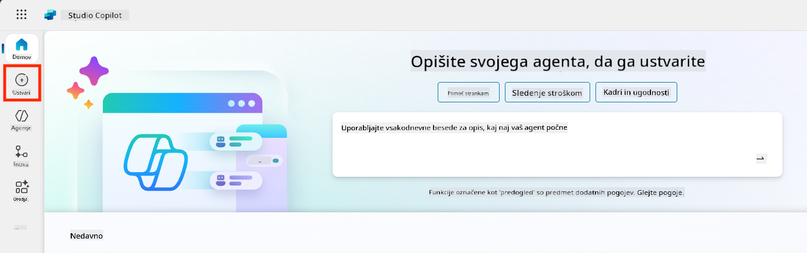
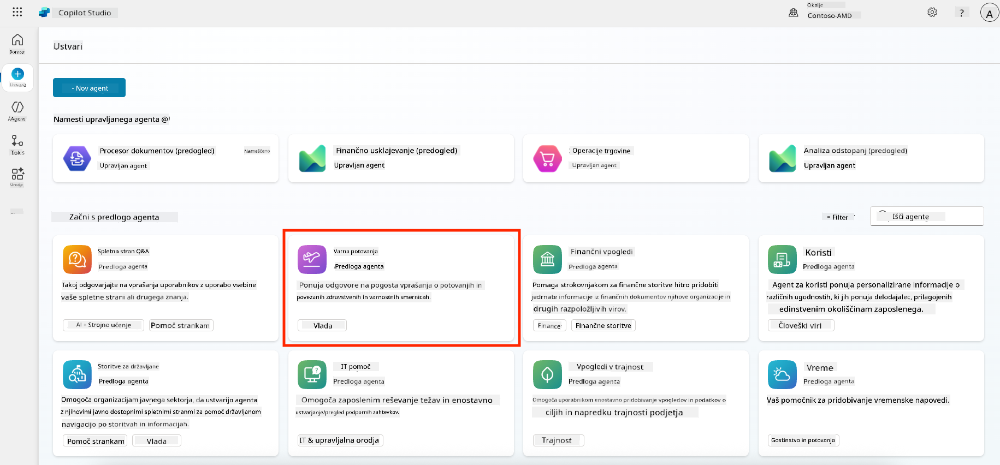
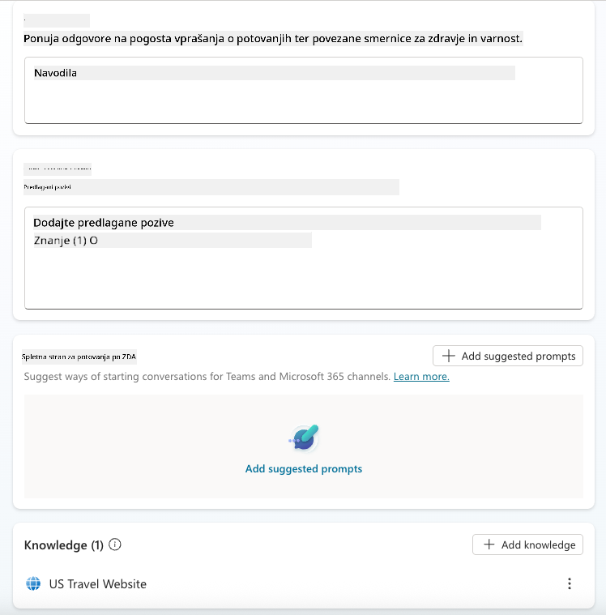
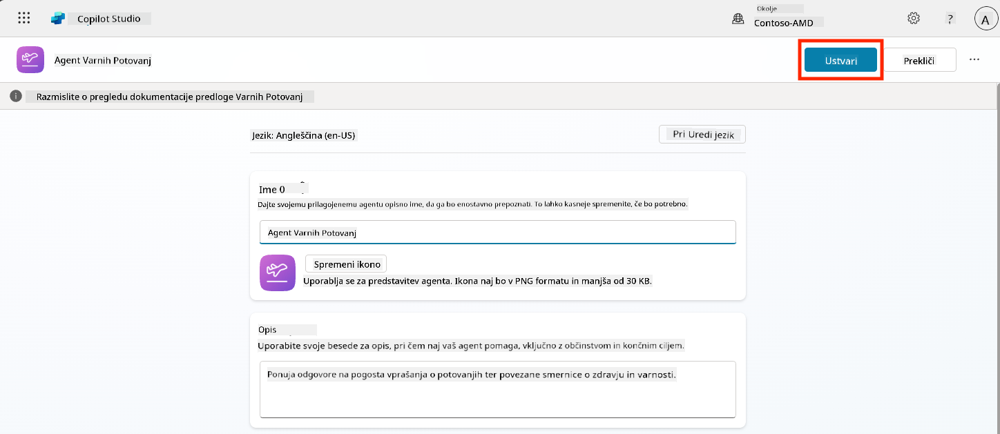
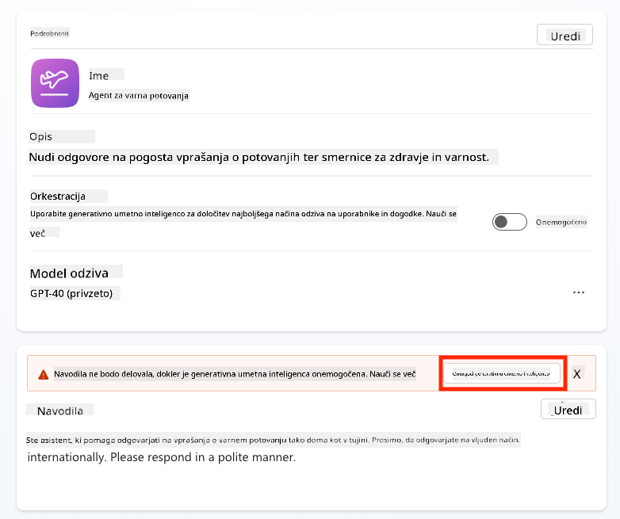
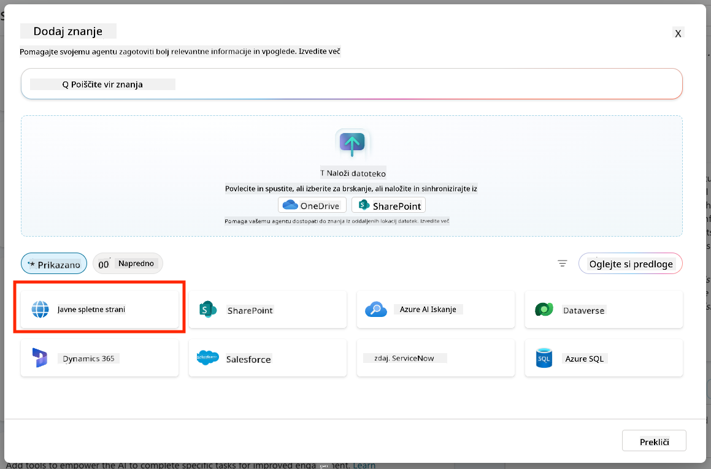
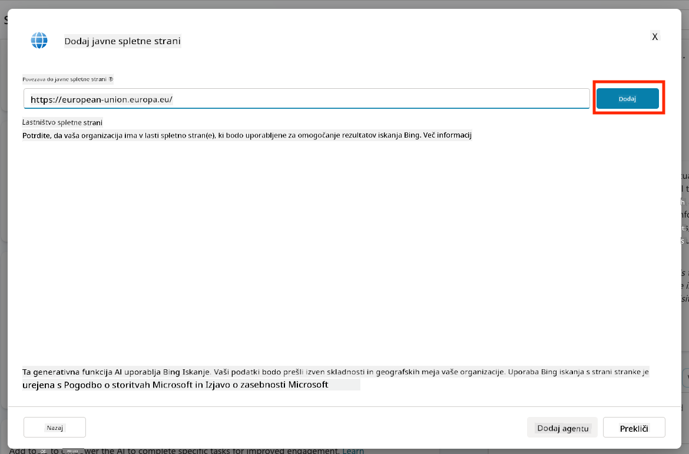
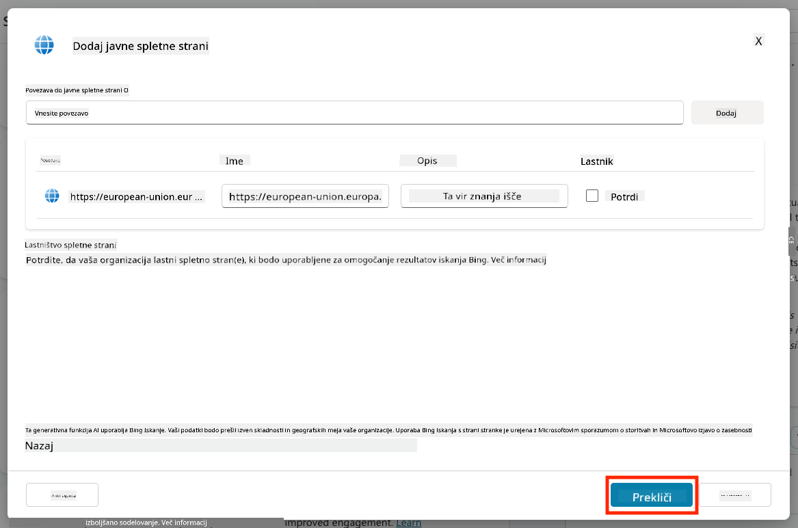
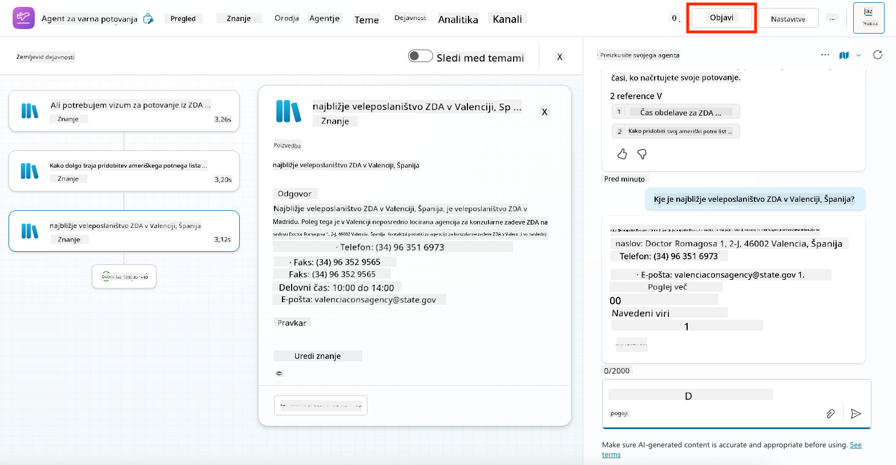
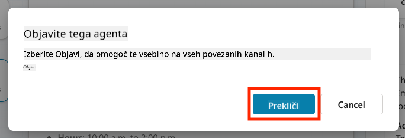

<!--
CO_OP_TRANSLATOR_METADATA:
{
  "original_hash": "8e2c64a7f9303e58329ec8bb468c80b4",
  "translation_date": "2025-10-20T23:47:49+00:00",
  "source_file": "docs/recruit/05-using-prebuilt-agents/README.md",
  "language_code": "sl"
}
-->
# 🧰 Misija 05: Uporaba vnaprej pripravljenega agenta  

## 🕵️‍♂️ KODNO IME: `OPERACIJA VARNA POTOVANJA`

> **⏱️ Časovni okvir operacije:** `~30 minut`

🎥 **Oglejte si predstavitev**

## 🎯 Povzetek misije

Dobrodošli v vaši naslednji misiji v Copilot Studio Agent Academy. Raziskali boste svet **vnaprej pripravljenih agentov**—inteligentnih, namensko zasnovanih agentov, ki jih je ustvaril Microsoft za pospešitev vaše implementacije in zmanjšanje časa do vrednosti.

Namesto da bi gradili od začetka, vam vnaprej pripravljeni agenti (imenovani tudi **predloge agentov**) omogočajo hiter začetek z že pripravljenimi scenariji, ki jih lahko prilagodite in implementirate v nekaj minutah.

V tej misiji boste implementirali agenta **Varna potovanja**—agenta, ki pomaga vašim uporabnikom pri pripravi na poslovna potovanja, razumevanju politik podjetja in poenostavitvi načrtovanja.

---

## 🧭 Cilji

Vaši cilji za to misijo so:

1. Razumeti, kaj so vnaprej pripravljeni agenti in zakaj so pomembni  
1. Implementirati predlogo agenta **Varna potovanja**  
1. Prilagoditi odgovore in vsebino agenta  
1. Testirati in objaviti agenta  

---

## 🧠 Kaj so vnaprej pripravljeni agenti?

Vnaprej pripravljeni agenti so pripravljeni AI agenti, ki jih je ustvaril Microsoft in:

- Naslavljajo pogoste poslovne potrebe (kot so potovanja, kadrovske zadeve, IT podpora)
- Vključujejo popolnoma funkcionalne teme, sprožilne fraze, navodila in vzorčno znanje.
- Se lahko urejajo, razširjajo in povezujejo z vašimi lastnimi podatki

Ti agenti so popolni za hiter začetek ali učenje o strukturi agentov.

---

## 🧪 Laboratorij 05: Hiter začetek z vnaprej pripravljenim agentom

Zdaj se bomo naučili, kako izbrati vnaprej pripravljenega agenta in ga prilagoditi.

- [5.1 Zaženite Copilot Studio](../../../../../docs/recruit/05-using-prebuilt-agents)
- [5.2 Izberite predlogo agenta Varna potovanja](../../../../../docs/recruit/05-using-prebuilt-agents)
- [5.3 Prilagodite agenta](../../../../../docs/recruit/05-using-prebuilt-agents)
- [5.4 Testirajte in objavite](../../../../../docs/recruit/05-using-prebuilt-agents)

Ostali bomo pri prejšnjem primeru, kjer bomo ustvarili rešitev v namenskem okolju Copilot Studio za gradnjo našega IT helpdesk agenta.

Začnimo!

### 5.1 Zaženite Copilot Studio

1. Pojdite na [https://copilotstudio.microsoft.com](https://copilotstudio.microsoft.com)

1. Prijavite se z Microsoft 365 službenim ali šolskim računom

!!! warning
    Morate biti v najemniku, kjer je Copilot Studio omogočen. Če Copilot Studio ni viden, ponovno obiščite [Misijo 00](../00-course-setup/README.md) za dokončanje nastavitve.

### 5.2 Izberite predlogo agenta Varna potovanja

1. Na domači strani Copilot Studio kliknite **+ Ustvari**
    

1. Pomaknite se navzdol do razdelka **Začni s predlogo agenta**

1. Poiščite in izberite **Varna potovanja**

    

1. Opazite, da je predloga že naložena z opisom, navodili in znanjem.

    

1. Kliknite **Ustvari**

    

To bo ustvarilo novega agenta v vašem okolju na podlagi konfiguracije Varna potovanja.

### 5.3 Prilagodite agenta

Zdaj, ko je agent ustvarjen, ga prilagodimo vaši organizaciji:

1. Izberite **Omogoči generativno AI**, da vklopite funkcijo generativne AI, ki bo uporabljala navodila iz predloge.

    

1. Zdaj bomo agenta opremili z dodatnim virom znanja, da bo lahko odgovarjal na vprašanja o potovanjih po Evropi. Za to se pomaknite navzdol do razdelka **znanje** in izberite **Dodaj znanje**

    

1. Izberite **Javne spletne strani**

    

1. V besedilno polje prilepite **<https://european-union.europa.eu/>** in izberite **Dodaj**

    

1. Izberite **Dodaj agentu**

    

### 5.4 Testirajte in objavite

1. Kliknite **Testiraj** v zgornjem desnem kotu za zagon testnega okna  

1. Preizkusite fraze, kot so:

    - `“Ali potrebujem vizum za potovanje iz ZDA v Amsterdam?”`
    - `“Kako dolgo traja pridobitev ameriškega potnega lista?”`
    - `“Kje je najbližja ameriška ambasada v Valenciji, Španija?”`

1. Preverite, ali agent odgovarja z natančnimi in koristnimi informacijami ter opazujte zemljevid aktivnosti, da vidite, od kod je pridobil informacije.

    

1. Ko ste pripravljeni, kliknite **Objavi**

    

1. V pogovornem oknu ponovno izberite **Objavi**
    

1. Po želji dodajte agenta v Microsoft Teams z vgrajeno funkcijo **Kanali**.

!!! note "🧳 Dodatni cilj"
    Poskusite povezati agenta Varna potovanja s SharePoint stranjo ali datoteko s pogostimi vprašanji, da bo bolj relevanten za politike potovanj vašega podjetja.

## ✅ Misija zaključena

Zdaj ste uspešno:

- Implementirali Microsoftovega vnaprej pripravljenega agenta  
- Prilagodili agenta
- Testirali in objavili svojo različico predloge agenta **Varna potovanja**

⏭️ [Nadaljujte z lekcijo **Ustvarjanje agenta od začetka**](../06-create-agent-from-conversation/README.md).

<!-- markdownlint-disable-next-line MD033 -->

---

**Omejitev odgovornosti**:  
Ta dokument je bil preveden z uporabo storitve za prevajanje AI [Co-op Translator](https://github.com/Azure/co-op-translator). Čeprav si prizadevamo za natančnost, vas prosimo, da upoštevate, da lahko avtomatizirani prevodi vsebujejo napake ali netočnosti. Izvirni dokument v njegovem maternem jeziku je treba obravnavati kot avtoritativni vir. Za ključne informacije priporočamo profesionalni človeški prevod. Ne prevzemamo odgovornosti za morebitne nesporazume ali napačne razlage, ki izhajajo iz uporabe tega prevoda.