<!--
CO_OP_TRANSLATOR_METADATA:
{
  "original_hash": "cd99a76bcb7372ac2771b6ae178b023d",
  "translation_date": "2025-10-20T23:22:41+00:00",
  "source_file": "docs/recruit/10-add-event-triggers/README.md",
  "language_code": "sl"
}
-->
# 🚨 Misija 10: Dodaj sprožilce dogodkov - Omogoči sposobnosti avtonomnega agenta

## 🕵️‍♂️ KODNO IME: `OPERACIJA DUHOVNA RUTINA`

> **⏱️ Čas operacije:** `~45 minut`

🎥 **Oglejte si predstavitev**

[](https://www.youtube.com/watch?v=ZgwHL8PQ1nY "Oglejte si predstavitev na YouTubu")

## 🎯 Kratek opis misije

Čas je, da svojega agenta povzdignete iz pogovornega asistenta v avtonomnega operativca. Vaša naloga je omogočiti, da vaš agent deluje brez poziva - odziva se na signale iz vašega digitalnega okolja z natančnostjo in hitrostjo.

S sprožilci dogodkov boste svojega agenta naučili spremljati zunanje sisteme, kot so SharePoint, Teams in Outlook, ter izvajati inteligentne akcije takoj, ko prejme signal. Ta operacija vašega agenta spremeni v popolnoma operativno terensko enoto - tiho, hitro in vedno pozorno.

Uspeh pomeni gradnjo agentov, ki ustvarjajo vrednost - ne le odgovarjajo nanjo.

## 🔎 Cilji

📖 Ta lekcija bo zajemala:

- Razumevanje sprožilcev dogodkov in kako omogočajo avtonomno vedenje agenta
- Učenje razlike med sprožilci dogodkov in sprožilci tem, vključno z delovnimi tokovi sprožilcev in podatkovnimi paketi
- Raziskovanje pogostih scenarijev sprožilcev dogodkov
- Razumevanje avtentikacije, varnosti in objavnih vidikov za agente, ki temeljijo na dogodkih
- Izdelava avtonomnega agenta za IT pomoč, ki se odziva na dogodke v SharePointu in pošilja potrditvena e-poštna sporočila

## 🤔 Kaj je sprožilec dogodka?

**Sprožilec dogodka** je mehanizem, ki omogoča vašemu agentu, da se avtonomno odzove na zunanje dogodke, brez potrebe po neposrednem uporabniškem vnosu. Predstavljajte si, da vaš agent "opazuje" določene dogodke in samodejno ukrepa, ko se ti dogodki zgodijo.

Za razliko od sprožilcev tem, ki zahtevajo, da uporabniki nekaj napišejo za aktivacijo pogovora, se sprožilci dogodkov aktivirajo na podlagi dogajanja v povezanih sistemih. Na primer:

- Ko je v SharePointu ali OneDrive for Business ustvarjena nova datoteka
- Ko je v Dataverse ustvarjen zapis
- Ko je v Plannerju dokončana naloga
- Ko je oddan nov odgovor v Microsoft Forms
- Ko je dodano novo sporočilo v Microsoft Teams
- Na podlagi ponavljajočega se urnika (npr. dnevni opomniki)  
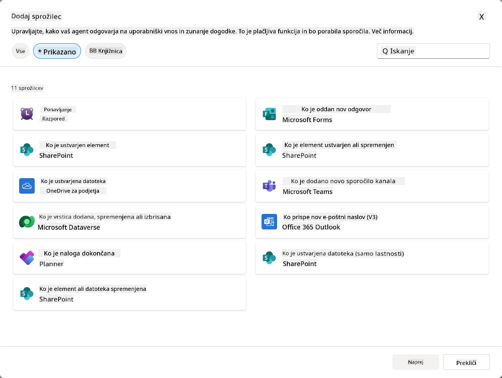

### Zakaj so sprožilci dogodkov pomembni za avtonomne agente

Sprožilci dogodkov vašega agenta spremenijo iz reaktivnega asistenta v proaktivnega, avtonomnega pomočnika:

1. **Avtonomno delovanje** - vaš agent lahko deluje 24/7 brez človeškega posredovanja, odzivajoč se na dogodke takoj, ko se zgodijo.
    - *Primer:* Samodejno pozdravi nove člane ekipe, ko so dodani v ekipo.

1. **Odzivnost v realnem času** - namesto da čaka, da uporabniki postavijo vprašanja, se vaš agent takoj odzove na ustrezne dogodke.
    - *Primer:* Opozori IT ekipo, ko je dokument v SharePointu spremenjen.

1. **Avtomatizacija delovnih tokov** - poveže več akcij na podlagi enega sprožilnega dogodka.
    - *Primer:* Ko je ustvarjena nova podporna zahteva, ustvari nalogo, obvesti vodjo in posodobi nadzorno ploščo.

1. **Dosledni procesi** - zagotovi, da pomembni koraki nikoli ne bodo izpuščeni z avtomatizacijo odzivov na ključne dogodke.
    - *Primer:* Vsak nov zaposleni samodejno prejme gradivo za uvajanje in zahteve za dostop.

1. **Akcije, ki temeljijo na podatkih** - uporabi informacije iz sprožilnega dogodka za pametne odločitve in ustrezne ukrepe.
    - *Primer:* Preusmeri nujne zahteve na višje osebje glede na stopnjo prioritete v podatkovnem paketu sprožilca.

## ⚙️ Kako delujejo sprožilci dogodkov?

Sprožilci dogodkov delujejo prek tridelnega delovnega toka, ki omogoča vašemu agentu, da se avtonomno odzove na zunanje dogodke:

### Delovni tok sprožilca

1. **Zaznavanje dogodka** - Določen dogodek se zgodi v povezanem sistemu (SharePoint, Teams, Outlook itd.)
1. **Aktivacija sprožilca** - Sprožilec dogodka zazna ta dogodek in pošlje podatkovni paket vašemu agentu prek Power Automate Cloud Flow.
1. **Odziv agenta** - Vaš agent prejme podatkovni paket in izvede navodila, ki ste jih določili.

### Razlika med sprožilci dogodkov in sprožilci tem

Razumevanje razlike med tema dvema vrstama sprožilcev je ključnega pomena:

| **Sprožilci dogodkov** | **Sprožilci tem** |
|-------------------------|-------------------|
| Aktivirani z dogodki v zunanjem sistemu | Aktivirani z uporabniškim vnosom/besednimi zvezami |
| Omogočajo avtonomno vedenje agenta | Omogočajo pogovorne odzive |
| Uporabljajo avtentikacijo ustvarjalca | Možnost avtentikacije uporabnika |
| Delujejo brez interakcije z uporabnikom | Zahtevajo, da uporabnik začne pogovor |
| Primeri: Ustvarjena datoteka, prejeto e-poštno sporočilo | Primer: "Kakšno je vreme?" |

## 📦 Razumevanje podatkovnih paketov sprožilcev

Ko se zgodi dogodek, sprožilec pošlje **podatkovni paket** vašemu agentu, ki vsebuje informacije o dogodku in navodila, kako se odzvati.

### Privzeti vs. prilagojeni podatkovni paketi

Vsaka vrsta sprožilca ima privzeto strukturo podatkovnega paketa, vendar jo lahko prilagodite:

**Privzeti podatkovni paket** - Uporablja standardni format, kot je `Uporabi vsebino iz {Body}`

- Vsebuje osnovne informacije o dogodku
- Uporablja splošna navodila za obdelavo
- Primeren za enostavne scenarije

**Prilagojeni podatkovni paket** - Dodajte specifična navodila in formatiranje podatkov

- Vključuje podrobna navodila za vašega agenta
- Natančno določa, katere podatke uporabiti in kako
- Boljši za kompleksne delovne tokove

### Navodila za agenta vs. navodila za podatkovni paket

Imate dve možnosti za usmerjanje vedenja vašega agenta s sprožilci dogodkov:

**Navodila za agenta** (globalna)

- Splošna navodila, ki veljajo za vse sprožilce
- Primer: "Pri obdelavi zahtev vedno najprej preveri podvojene vnose"
- Najbolj primerno za splošne vzorce vedenja

**Navodila za podatkovni paket** (specifična za sprožilec)

- Specifična navodila za posamezne vrste sprožilcev  
- Primer: "Za to posodobitev v SharePointu pošlji povzetek v kanal projekta"
- Najbolj primerno za kompleksne agente z več sprožilci

💡 **Nasvet**: Izogibajte se nasprotujočim si navodilom med tema dvema nivojema, saj lahko to povzroči nepričakovano vedenje.

## 🎯 Pogosti scenariji sprožilcev dogodkov

Tukaj so praktični primeri, kako lahko sprožilci dogodkov izboljšajo vašega agenta:

### Agent za IT pomoč

- **Sprožilec**: Nov element na seznamu SharePoint (zahteva za podporo)
- **Akcija**: Samodejno kategorizira, določi prioriteto in obvesti ustrezne člane ekipe

### Agent za uvajanje zaposlenih

- **Sprožilec**: Nov uporabnik dodan v Dataverse
- **Akcija**: Pošlje pozdravno sporočilo, ustvari naloge za uvajanje in omogoči dostop

### Agent za projektno vodenje

- **Sprožilec**: Dokončana naloga v Plannerju
- **Akcija**: Posodobi nadzorno ploščo projekta, obvesti deležnike in preveri morebitne ovire

### Agent za upravljanje dokumentov

- **Sprožilec**: Datoteka naložena v določen SharePointov mapo
- **Akcija**: Izvleče metapodatke, doda oznake in obvesti lastnike dokumenta

### Pomočnik za sestanke

- **Sprožilec**: Ustvarjen dogodek v koledarju
- **Akcija**: Pošlje opomnike pred sestankom in dnevni red, rezervira vire

## ⚠️ Premisleki o objavi in avtentikaciji

Preden vaš agent lahko uporablja sprožilce dogodkov v produkciji, morate razumeti posledice avtentikacije in varnosti.

### Avtentikacija ustvarjalca

Sprožilci dogodkov uporabljajo **podatke za prijavo ustvarjalca agenta** za vso avtentikacijo:

- Vaš agent dostopa do sistemov z vašimi dovoljenji
- Uporabniki lahko potencialno dostopajo do podatkov prek vaših podatkov za prijavo
- Vsa dejanja se izvajajo "kot vi", tudi ko uporabniki komunicirajo z agentom

### Najboljše prakse za zaščito podatkov

Za ohranjanje varnosti pri objavi agentov s sprožilci dogodkov:

1. **Ocenite dostop do podatkov** - Preglejte, do katerih sistemov in podatkov imajo vaši sprožilci dostop
1. **Temeljito testirajte** - Razumite, katere informacije sprožilci vključujejo v podatkovne pakete
1. **Omejite obseg sprožilcev** - Uporabite specifične parametre za omejitev dogodkov, ki aktivirajo sprožilce
1. **Preglejte podatkovne pakete** - Prepričajte se, da sprožilci ne razkrivajo občutljivih informacij
1. **Spremljajte uporabo** - Spremljajte aktivnost sprožilcev in porabo virov

## ⚠️ Odpravljanje težav in omejitve

Upoštevajte te pomembne vidike pri delu s sprožilci dogodkov:

### Vpliv na kvote in obračunavanje

- Vsaka aktivacija sprožilca se šteje v porabo sporočil
- Pogosti sprožilci (npr. ponavljanje vsako minuto) lahko hitro porabijo kvoto
- Spremljajte porabo, da se izognete omejitvam

### Tehnične zahteve

- Na voljo samo za agente z omogočeno generativno orkestracijo
- Zahteva omogočeno deljenje rešitev v oblaku v vašem okolju

### Preprečevanje izgube podatkov (DLP)

- Politike DLP vaše organizacije določajo, kateri sprožilci so na voljo
- Administratorji lahko popolnoma blokirajo sprožilce dogodkov
- Obrnite se na svojega administratorja, če pričakovani sprožilci niso na voljo

## 🧪 Laboratorij 10 - Dodajanje sprožilcev dogodkov za avtonomno vedenje agenta

### 🎯 Primer uporabe

Izboljšali boste svojega agenta za IT pomoč, da se bo samodejno odzval na nove zahteve za podporo. Ko nekdo ustvari nov element na seznamu zahtev za podporo v SharePointu, bo vaš agent:

1. Samodejno sprožen, ko je ustvarjena zahteva v SharePointu
1. Posredoval podrobnosti o zahtevi in navodila za korake, ki jih želite, da izvede
1. Samodejno potrdil prejem zahteve po e-pošti, ki jo ustvari AI

Ta laboratorij prikazuje, kako sprožilci dogodkov omogočajo resnično avtonomno vedenje agenta.

### Predpogoji

Pred začetkom tega laboratorija se prepričajte, da imate:

- ✅ Zaključene prejšnje laboratorije (zlasti laboratorije 6-8 za agenta IT pomoči)
- ✅ Dostop do SharePointovega mesta s seznamom zahtev za IT podporo
- ✅ Okolje Copilot Studio z omogočenimi sprožilci dogodkov
- ✅ Vaš agent ima omogočeno generativno orkestracijo
- ✅ Ustrezna dovoljenja v SharePointu in vašem okolju Copilot Studio

### 10.1 Omogočite generativno AI in ustvarite sprožilec za ustvarjanje elementa v SharePointu

1. Odprite svojega **agenta za IT pomoč** v **Copilot Studio**

1. Najprej se prepričajte, da je za vašega agenta omogočena **Generativna AI**:
   - Pojdite na zavihek **Pregled**
   - Pod razdelkom Orkestracija preklopite **Generativna orkestracija** na **Vklopljeno**, če še ni omogočena  
     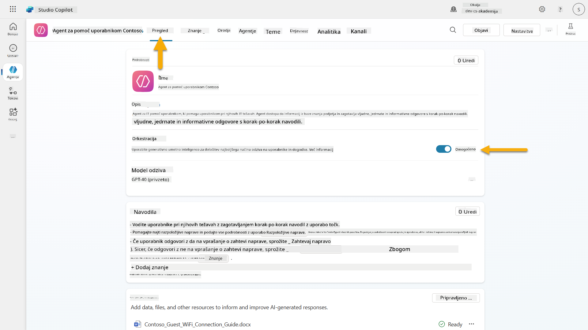

1. Pojdite na zavihek **Pregled** in poiščite razdelek **Sprožilci**

1. Kliknite **+ Dodaj sprožilec**, da odprete knjižnico sprožilcev  
    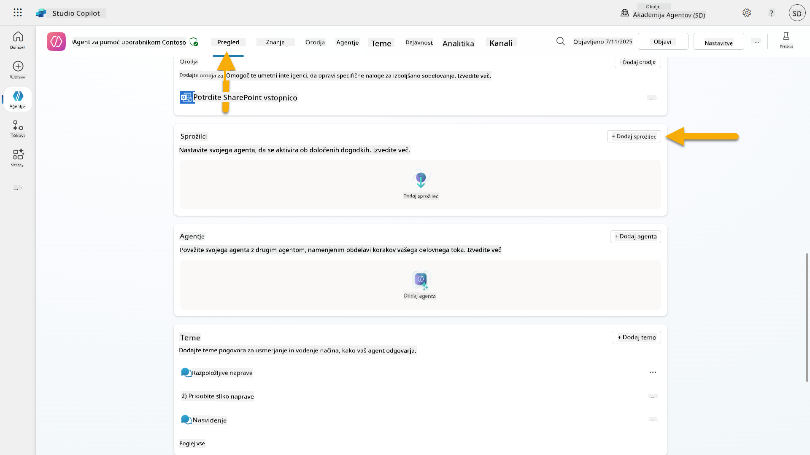

1. Poiščite in izberite **Ko je element ustvarjen** (SharePoint)  
    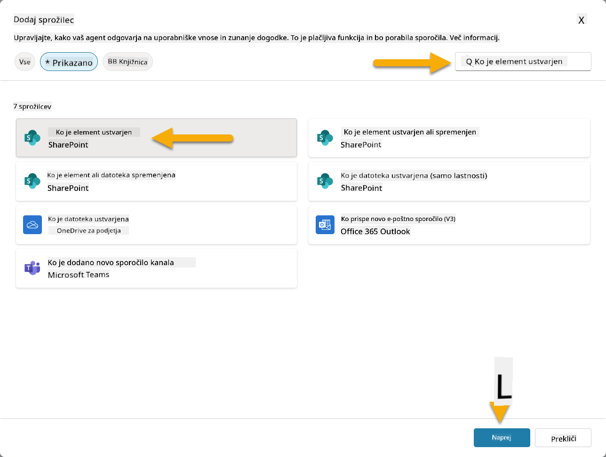

1. Konfigurirajte ime sprožilca in povezave:

   - **Ime sprožilca:** Ustvarjena nova zahteva za podporo v SharePointu

1. Počakajte, da se povezave konfigurirajo, nato izberite **Naprej**, da nadaljujete.  
   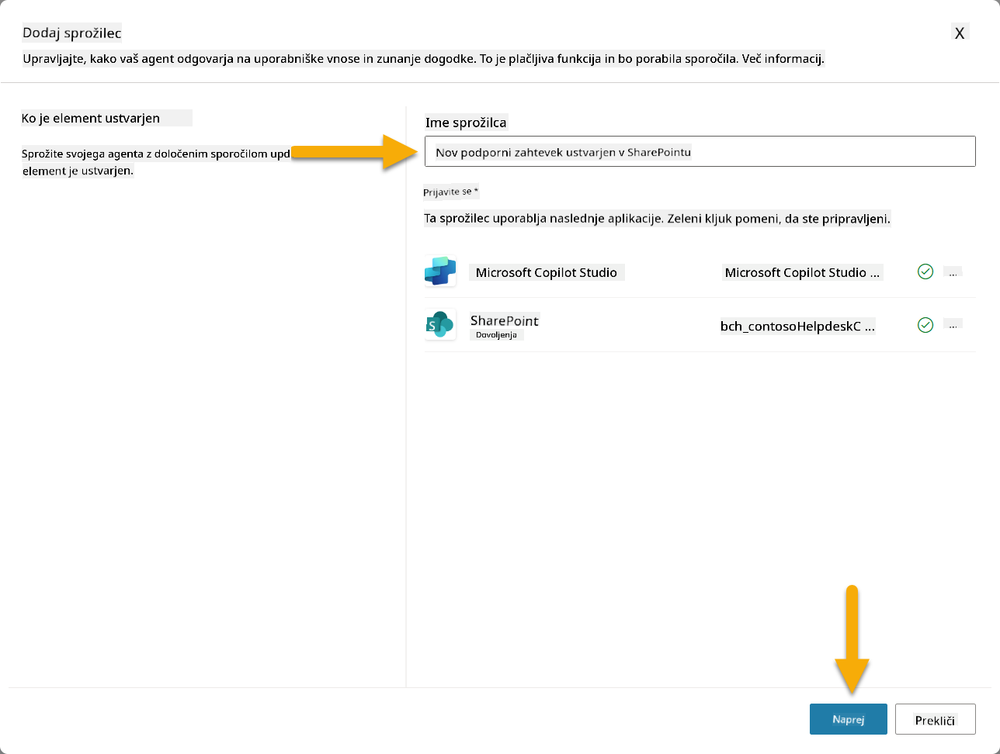

1. Konfigurirajte parametre sprožilca:

   - **Naslov mesta**: Izberite svoje SharePointovo mesto "Contoso IT"

   - **Ime seznama**: Izberite svoj seznam "Zahteve"

   - **Dodatna navodila za agenta, ko ga sproži sprožilec:**

     ```text
     New Support Ticket Created in SharePoint: {Body}
     
     Use the 'Acknowledge SharePoint Ticket' tool to generate the email body automatically and respond.
     
     IMPORTANT: Do not wait for any user input. Work completely autonomously.
     ```

     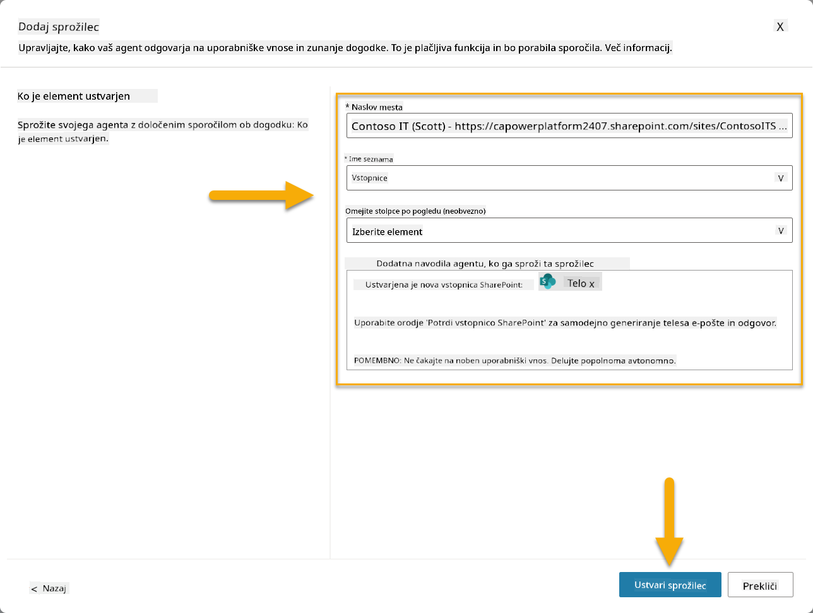

1. Izberite **Ustvari sprožilec**, da dokončate ustvarjanje sprožilca. Samodejno se ustvari Power Automate Cloud Flow, ki avtonomno sproži agenta.

1. Izberite **Zapri**.

### 10.2 Uredi sprožilec

1. Znotraj razdelka **Sprožilci** na zavihku **Pregled** izberite meni **...** na sprožilcu **Ustvarjena nova zahteva za podporo v SharePointu**

1. Izberite **Uredi v Power Automate**  
   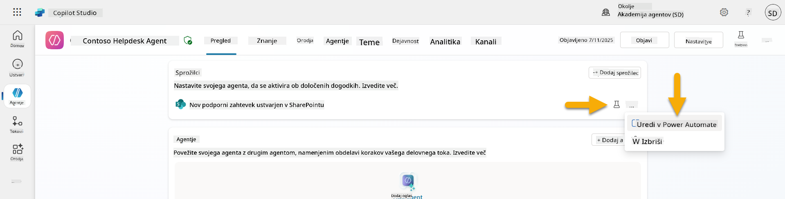

1. Izberite vozlišče **Pošlje poziv določenemu copilotu za obdelavo**

1. V polju **Telo/sporočilo** odstranite vsebino Telesa, **pritisnite tipko poševnica** (/) in izberite **Vstavi izraz**  
   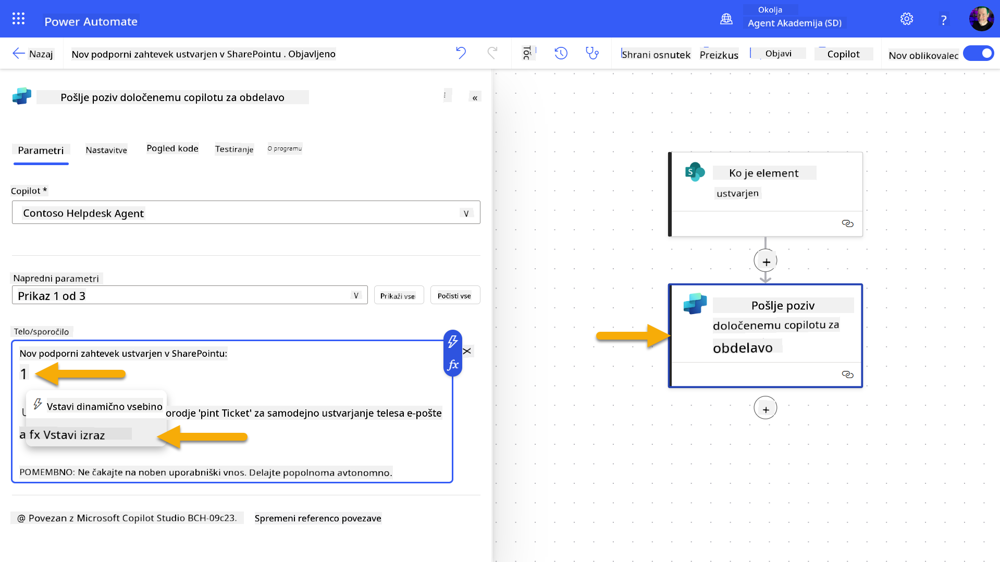

1. Vnesite naslednji izraz, da agentu zagotovite specifične podrobnosti o zahtevi:

    ```text
    concat('Submitted By Name: ', first(triggerOutputs()?['body/value'])?['Author/DisplayName'], '\nSubmitted By Email: ', first(triggerOutputs()?['body/value'])?['Author/Email'], '\nTitle: ', first(triggerOutputs()?['body/value'])?['Title'], '\nIssue Description: ', first(triggerOutputs()?['body/value'])?['Description'], '\nPriority: ', first(triggerOutputs()?['body/value'])?['Priority/Value'],'\nTicket ID : ', first(triggerOutputs()?['body/value'])?['ID'])
    ```

1. Izberite **Dodaj**  
   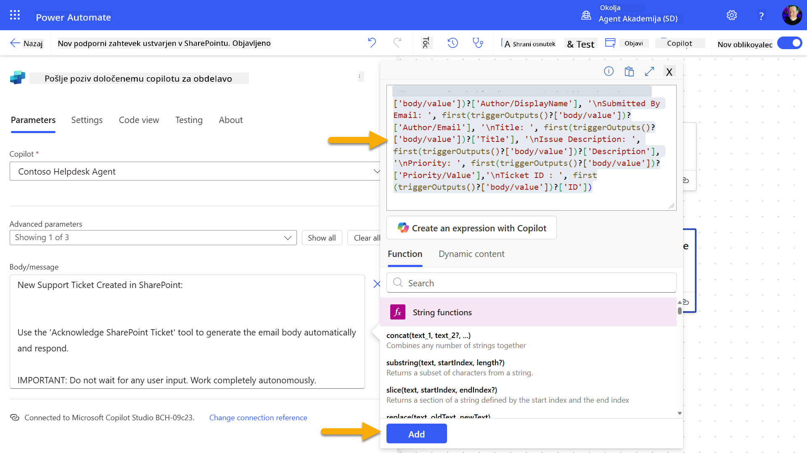

1. Izberite **Objavi** na zgornji desni orodni vrstici.

### 10.3 Ustvarite orodje za potrditveno e-pošto

1. **Vrnite se** k svojemu agentu v Copilot Studio

1. Pojdite na zavihek **Orodja** v svojem agentu

1. Kliknite **+ Dodaj orodje** in izberite **Povezovalnik**

1. Poiščite in izberite povezovalnik **Pošlji e-pošto (V2)**  
    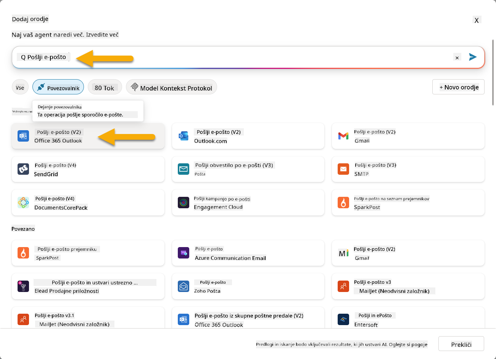

1. Počakajte, da se povezava konfigurira, nato izberite **Dodaj in konfiguriraj**

1. Konfigurirajte nastavitve orodja:

   - **Ime**: Potrdi zahtevo v SharePointu
   - **Opis**: To orodje
1. Odprite nov zavihek v brskalniku in pojdite na svoj **SharePoint seznam IT podpornih zahtevkov**
1. Kliknite **+ Dodaj nov element**, da ustvarite testni zahtevek:
   - **Naslov**: "Ne morem se povezati na VPN"
   - **Opis**: "Po zadnji posodobitvi se ne morem povezati na korporativno WIFI omrežje"
   - **Prioriteta**: "Normalno"

1. **Shrani** SharePoint element  
    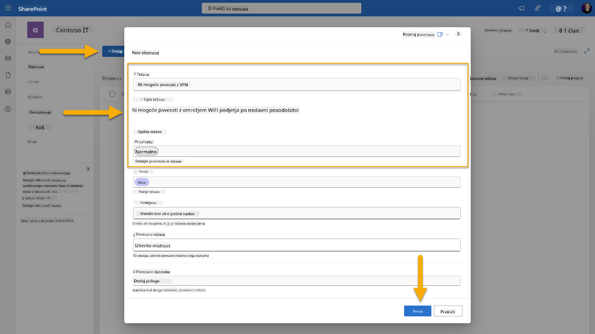
1. Vrnite se v **Copilot Studio** in spremljajte ploščo **Preizkusite sprožilec** za aktivacijo sprožilca. Uporabite ikono **Osveži**, da naložite dogodek sprožilca, kar lahko traja nekaj minut.  
    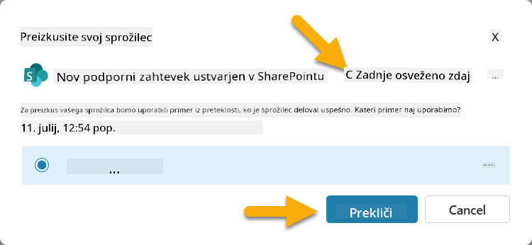
1. Ko se sprožilec pojavi, izberite **Začni testiranje**
1. Kliknite na **Ikono zemljevida aktivnosti** na vrhu plošče **Preizkusite svojega agenta**
1. Preverite, ali je vaš agent:
   - Prejel podatke sprožilca
   - Uporabil orodje "Potrdi SharePoint zahtevek"  
     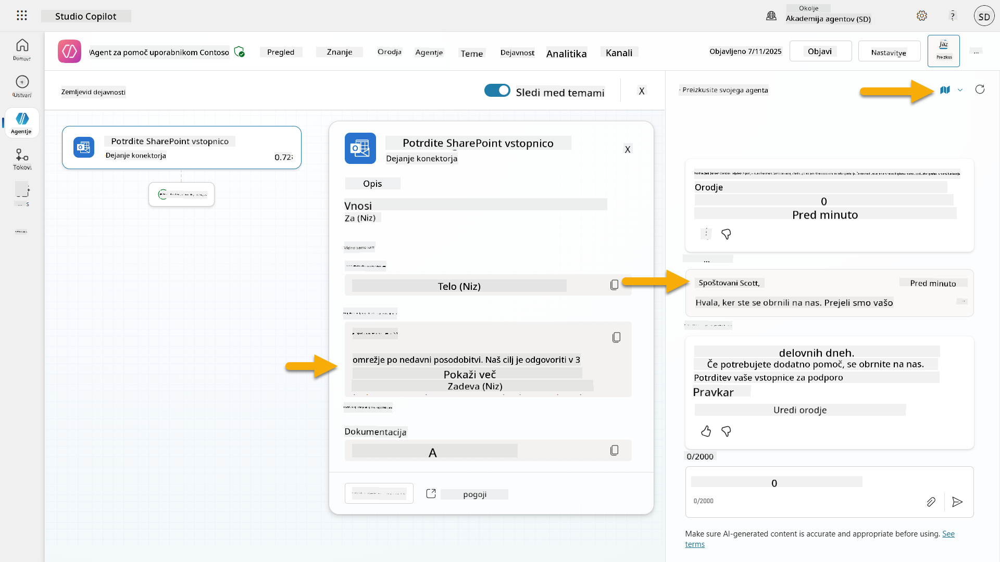
1. Preverite e-poštni nabiralnik pošiljatelja, da potrdite, da je bilo potrditveno e-poštno sporočilo poslano  
    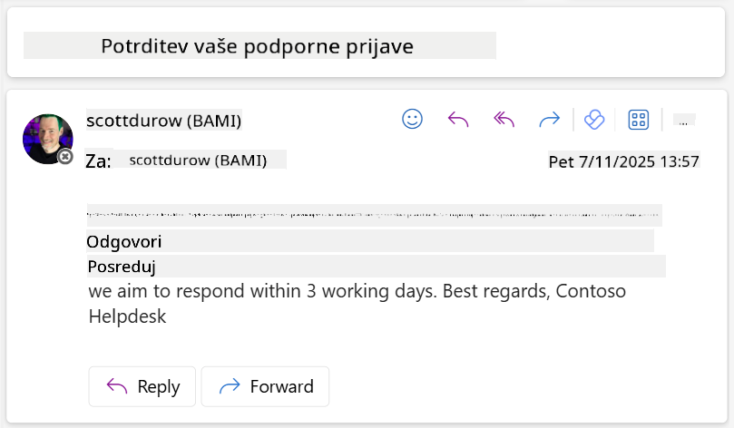
1. Preglejte zavihek **Aktivnost** v Copilot Studio, da si ogledate celoten sprožilec in izvedbo orodja

## ✅ Misija zaključena

🎉 **Čestitke!** Uspešno ste implementirali sprožilce dogodkov z orodji za povezovanje, ki omogočajo vašemu agentu, da deluje samostojno, samodejno pošilja potrditvena e-poštna sporočila in obdeluje podporne zahtevke brez posredovanja uporabnika. Ko bo vaš agent objavljen, bo deloval samostojno v vašem imenu.

🚀 **Naslednje**: V naslednji lekciji boste izvedeli, kako [objaviti svojega agenta](../11-publish-your-agent/README.md) v Microsoft Teams in Microsoft 365 Copilot, da bo na voljo celotni organizaciji!

⏭️ [Premakni se na lekcijo **Objavi svojega agenta**](../11-publish-your-agent/README.md)

## 📚 Taktični viri

Pripravljeni na poglobitev v sprožilce dogodkov in samostojne agente? Oglejte si te vire:

- **Microsoft Learn**: [Naredite svojega agenta samostojnega v Copilot Studio](https://learn.microsoft.com/training/modules/autonomous-agents-online-workshop/?WT.mc_id=power-177340-scottdurow)
- **Dokumentacija**: [Dodaj sprožilec dogodka](https://learn.microsoft.com/microsoft-copilot-studio/authoring-trigger-event?WT.mc_id=power-177340-scottdurow)
- **Najboljše prakse**: [Uvod v sprožilce Power Automate](https://learn.microsoft.com/power-automate/triggers-introduction?WT.mc_id=power-177340-scottdurow)
- **Napredni scenariji**: [Uporaba Power Automate tokov z agenti](https://learn.microsoft.com/microsoft-copilot-studio/advanced-flow-create?WT.mc_id=power-177340-scottdurow)
- **Varnost**: [Preprečevanje izgube podatkov za Copilot Studio](https://learn.microsoft.com/microsoft-copilot-studio/admin-data-loss-prevention?WT.mc_id=power-177340-scottdurow)


---

**Omejitev odgovornosti**:  
Ta dokument je bil preveden z uporabo storitve za prevajanje z umetno inteligenco [Co-op Translator](https://github.com/Azure/co-op-translator). Čeprav si prizadevamo za natančnost, vas prosimo, da upoštevate, da lahko avtomatski prevodi vsebujejo napake ali netočnosti. Izvirni dokument v njegovem maternem jeziku je treba obravnavati kot avtoritativni vir. Za ključne informacije priporočamo profesionalni človeški prevod. Ne prevzemamo odgovornosti za morebitna nesporazumevanja ali napačne razlage, ki izhajajo iz uporabe tega prevoda.