<!--
CO_OP_TRANSLATOR_METADATA:
{
  "original_hash": "9dceeba2eae2bb73e328602a060eddab",
  "translation_date": "2025-10-20T23:54:13+00:00",
  "source_file": "docs/recruit/11-publish-your-agent/README.md",
  "language_code": "sl"
}
-->
# 🚨 Misija 11: Objavi svojega agenta

## 🕵️‍♂️ KODNO IME: `OPERACIJA OBJAVI OBJAVI OBJAVI`

> **⏱️ Časovni okvir operacije:** `~30 minut`

🎥 **Oglejte si navodila**

[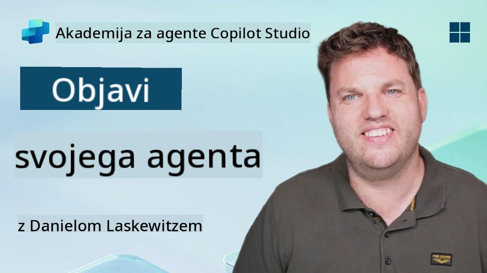](https://www.youtube.com/watch?v=eVZmljhYlSI "Oglejte si navodila na YouTubu")

## 🎯 Povzetek misije

Po zaključku serije zahtevnih modulov, Agent Maker, ste zdaj pripravljeni na svoj najpomembnejši korak doslej: objavo svojega agenta. Čas je, da svojo stvaritev omogočite uporabnikom v Microsoft Teams in Microsoft 365 Copilot.

Vaš agent—opremljen z jasno nalogo, zmogljivimi orodji in dostopom do ključnih virov znanja—je pripravljen na delo. Z uporabo Microsoft Copilot Studio boste svojega agenta uvedli, da bo lahko začel pomagati resničnim uporabnikom tam, kjer delajo.

Zaženimo vašega agenta v akcijo.

## 🔎 Cilji

📖 Ta lekcija zajema:

1. Zakaj je pomembno objaviti svojega agenta
1. Kaj se zgodi, ko objavite svojega agenta
1. Kako dodati kanal (Microsoft Teams & Microsoft 365 Copilot)
1. Kako dodati agenta v Microsoft Teams
1. Kako omogočiti agenta v Microsoft Teams za celotno organizacijo

## 🚀 Objavi agenta

Vsakič, ko delate na agentu v Copilot Studio, ga lahko posodobite z dodajanjem znanja ali orodij. Ko ste pripravljeni z vsemi spremembami in ste jih temeljito preizkusili, ste pripravljeni na objavo. Objava zagotavlja, da so najnovejše posodobitve na voljo. Če posodobite svojega agenta z novimi orodji, vendar ne pritisnete gumba za objavo, posodobitve še ne bodo na voljo končnim uporabnikom.

Vedno se prepričajte, da pritisnete gumb za objavo, ko želite posodobitve posredovati uporabnikom svojega agenta. Vaš agent ima morda dodane kanale, in ko pritisnete objavi, so posodobitve na voljo za vse kanale, ki ste jih dodali agentu.

## ⚙️ Konfigurirajte kanale

Kanali določajo, kje lahko vaši uporabniki dostopajo do vašega agenta in komunicirajo z njim. Ko objavite svojega agenta, ga lahko omogočite v več kanalih. Vsak kanal lahko prikazuje vsebino vašega agenta drugače.

Svojega agenta lahko dodate v naslednje kanale:

- **Microsoft Teams in Microsoft 365 Copilot** - Omogočite svojega agenta v klepetih in sestankih Teams ter v izkušnjah Microsoft 365 Copilot ([Več informacij](https://learn.microsoft.com/microsoft-copilot-studio/publication-add-bot-to-microsoft-teams))
- **Demo spletna stran** - Preizkusite svojega agenta na demo spletni strani, ki jo zagotavlja Copilot Studio ([Več informacij](https://learn.microsoft.com/microsoft-copilot-studio/publication-connect-bot-to-web-channels))
- **Prilagojena spletna stran** - Vdelajte svojega agenta neposredno na svojo spletno stran ([Več informacij](https://learn.microsoft.com/microsoft-copilot-studio/publication-connect-bot-to-web-channels))
- **Mobilna aplikacija** - Integrirajte svojega agenta v prilagojeno mobilno aplikacijo ([Več informacij](https://learn.microsoft.com/microsoft-copilot-studio/publication-connect-bot-to-custom-application))
- **SharePoint** - Dodajte svojega agenta na SharePoint strani za pomoč pri dokumentih in straneh ([Več informacij](https://learn.microsoft.com/microsoft-copilot-studio/publication-add-bot-to-sharepoint))
- **Facebook Messenger** - Povežite se z uporabniki prek Facebookove platforme za sporočanje ([Več informacij](https://learn.microsoft.com/microsoft-copilot-studio/publication-add-bot-to-facebook))
- **Power Pages** - Integrirajte svojega agenta v spletne strani Power Pages ([Več informacij](https://learn.microsoft.com/microsoft-copilot-studio/publication-add-bot-to-power-pages))
- **Kanali storitve Azure Bot Service** - Dostopajte do dodatnih kanalov, vključno s Slack, Telegram, Twilio SMS in drugimi ([Več informacij](https://learn.microsoft.com/microsoft-copilot-studio/publication-connect-bot-to-azure-bot-service-channels))

Za dodajanje kanala pojdite na zavihek **Kanali** v svojem agentu in izberite kanal, ki ga želite konfigurirati. Vsak kanal ima specifične zahteve za nastavitev in lahko zahteva dodatno avtentikacijo ali korake konfiguracije.

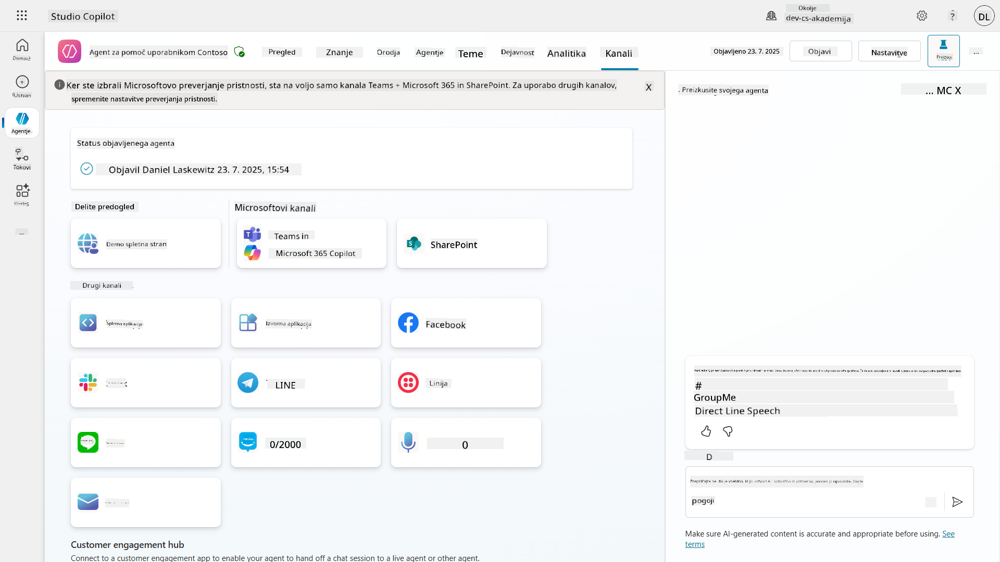

## 📺 Izkušnje s kanali

Različni kanali ponujajo različne uporabniške izkušnje. Ko ustvarjate agenta za več kanalov, se prepričajte, da ste seznanjeni z razlikami med kanali. Vedno je dobra strategija, da svojega agenta preizkusite v več kanalih, da preverite, ali resnično deluje tako, kot ste si zamislili.

| Izkušnja                        | Spletna stran | Teams in Microsoft 365 Copilot         | Facebook                 | Dynamics Omnichannel za storitve za stranke                   |
| -------------------------------- | ------------- | --------------------------------------- | ------------------------ | ------------------------------------------------------------- |
| [Anketa o zadovoljstvu strank][1] | Prilagodljiva kartica | Samo besedilo                               | Samo besedilo                | Samo besedilo                                                   |
| [Možnosti večkratne izbire][1]      | Podprto     | [Podprto do šest (kot hero kartica)][4] | [Podprto do 13][6]  | [Delno podprto][8]                                    |
| [Markdown][2]                     | Podprto     | [Delno podprto][5]                | [Delno podprto][7] | [Delno podprto][9]                                    |
| [Pozdravno sporočilo][1]              | Podprto     | Podprto                               | Ni podprto            | Podprto za [Klepet][10]. Ni podprto za druge kanale. |
| [Ali ste mislili][3]                 | Podprto     | Podprto                               | Podprto                | Podprto za [Microsoft Teams][11], [Klepet][10], Facebook in kanale samo za besedilo (kratka sporočila (SMS) prek [TeleSign][12] in [Twilio][13], [WhatsApp][14], [WeChat][15] in [Twitter][16]). Predlagana dejanja so predstavljena kot seznam samo za besedilo; uporabniki morajo ponovno vnesti možnost za odgovor. |

[1]: https://learn.microsoft.com/microsoft-copilot-studio/authoring-create-edit-topics
[2]: https://daringfireball.net/projects/markdown/
[3]: https://learn.microsoft.com/microsoft-copilot-studio/advanced-ai-features
[4]: https://learn.microsoft.com/microsoftteams/platform/concepts/cards/cards-reference#hero-card
[5]: https://learn.microsoft.com/microsoftteams/platform/bots/how-to/format-your-bot-messages#text-only-messages
[6]: https://developers.facebook.com/docs/messenger-platform/send-messages/quick-replies/
[7]: https://www.facebook.com/help/147348452522644?helpref=related
[8]: https://learn.microsoft.com/dynamics365/customer-service/asynchronous-channels#suggested-actions-support
[9]: https://learn.microsoft.com/dynamics365/customer-service/asynchronous-channels#preview-support-for-formatted-messages
[10]: https://learn.microsoft.com/dynamics365/customer-service/set-up-chat-widget
[11]: https://learn.microsoft.com/dynamics365/customer-service/configure-microsoft-teams
[12]: https://learn.microsoft.com/dynamics365/customer-service/configure-sms-channel
[13]: https://learn.microsoft.com/dynamics365/customer-service/configure-sms-channel-twilio
[14]: https://learn.microsoft.com/dynamics365/customer-service/configure-whatsapp-channel
[15]: https://learn.microsoft.com/dynamics365/customer-service/configure-wechat-channel
[16]: https://learn.microsoft.com/dynamics365/customer-service/configure-twitter-channel

> [!NOTE]
> Obstajajo nekateri primeri, kjer lahko uporabite različno logiko za različne kanale. Primer tega lahko najdete v repozitoriju Power Platform Snippets:
>
> Henry Jammes je delil primer, kako prikazati drugačno prilagodljivo kartico, ko je kanal Microsoft Teams. ([Povezava do primera](https://github.com/pnp/powerplatform-snippets/blob/main/copilot-studio/multiple-topics-matched-topic/source/multiple-topics-matched.yaml#L40))

## 🧪 Laboratorij 11: Objavite svojega agenta v Teams in Microsoft 365 Copilot

### 🎯 Primer uporabe

Vaš agent za pomoč uporabnikom Contoso IT je zdaj popolnoma konfiguriran z zmogljivimi funkcijami—ima dostop do virov znanja na SharePointu, lahko ustvarja podporne zahtevke, pošilja proaktivna obvestila in inteligentno odgovarja na vprašanja uporabnikov. Vendar so vse te funkcije trenutno na voljo le v razvojnem okolju, kjer ste jih ustvarili.

**Izziv:** Končni uporabniki ne morejo izkoristiti zmogljivosti vašega agenta, dokler ni pravilno objavljen in omogočen prek kanalov, kjer dejansko delajo.

**Rešitev:** Objava vašega agenta zagotavlja, da je najnovejša različica—z vsemi vašimi nedavnimi posodobitvami, novimi temami, izboljšanimi viri znanja in konfiguriranimi tokovi—na voljo resničnim uporabnikom. Brez objave bi uporabniki še vedno komunicirali s starejšo različico vašega agenta, ki morda nima ključnih funkcionalnosti.

Dodajanje kanala Teams in Microsoft 365 Copilot je prav tako ključnega pomena, ker:

- **Integracija s Teams**: Zaposleni v vaši organizaciji večino dneva preživijo v Microsoft Teams za sodelovanje, sestanke in komunikacijo. Z dodajanjem vašega agenta v Teams lahko uporabniki dobijo IT podporo, ne da bi zapustili svoje primarno delovno okolje.

- **Microsoft 365 Copilot**: Uporabniki lahko dostopajo do vašega specializiranega agenta za pomoč IT neposredno v svoji izkušnji Microsoft 365 Copilot, kar omogoča brezhibno integracijo v njihov vsakdanji delovni tok v aplikacijah Office.

- **Centraliziran dostop**: Namesto da si zapomnijo ločene spletne strani ali aplikacije, lahko uporabniki dostopajo do IT podpore prek platform, ki jih že uporabljajo, kar zmanjšuje ovire in povečuje sprejemanje.

Ta misija pretvori vaše razvojno delo v rešitev, pripravljeno za produkcijo, ki prinaša resnično vrednost končnim uporabnikom vaše organizacije.

### Predpogoji

Pred začetkom tega laboratorija se prepričajte, da imate:

- ✅ Zaključene prejšnje laboratorije in popolnoma konfiguriran agent za pomoč uporabnikom Contoso
- ✅ Vaš agent je bil preizkušen in je pripravljen za uporabo v produkciji
- ✅ Dovoljenja v vašem okolju Copilot Studio za objavo agentov
- ✅ Dostop do Microsoft Teams v vaši organizaciji

### 11.1 Objavite svojega agenta

Zdaj, ko je vse naše delo na agentu končano, moramo poskrbeti, da bo vse naše delo na voljo končnim uporabnikom, ki bodo uporabljali našega agenta. Da zagotovimo, da je vsebina na voljo vsem uporabnikom, moramo objaviti našega agenta.

1. Pojdite na Contoso Helpdesk Agent v Copilot Studio (prek [portala Copilot Studio maker](https://copilotstudio.microsoft.com))

    V Copilot Studio je enostavno objaviti svojega agenta. Preprosto izberite gumb za objavo na vrhu pregleda agenta.

    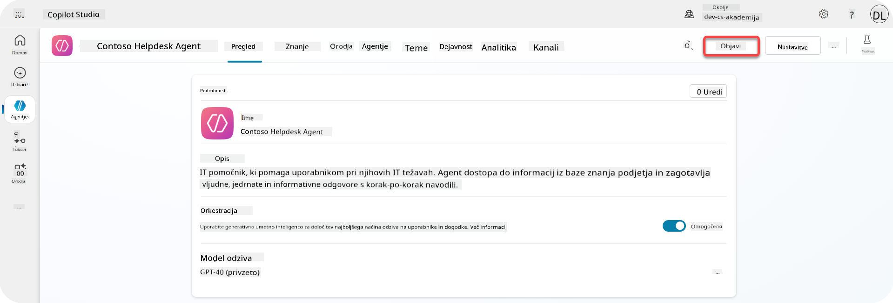

1. Izberite gumb **Objavi** v svojem agentu

    Odpre se pojavno okno za potrditev, da res želite objaviti svojega agenta.

    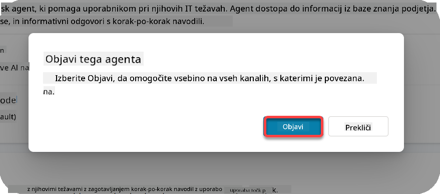

1. Izberite **Objavi**, da potrdite objavo svojega agenta

    Zdaj se prikaže sporočilo, da se vaš agent objavlja. Ni vam treba pustiti odprtega pojavnega okna. Obveščeni boste, ko bo agent objavljen.

    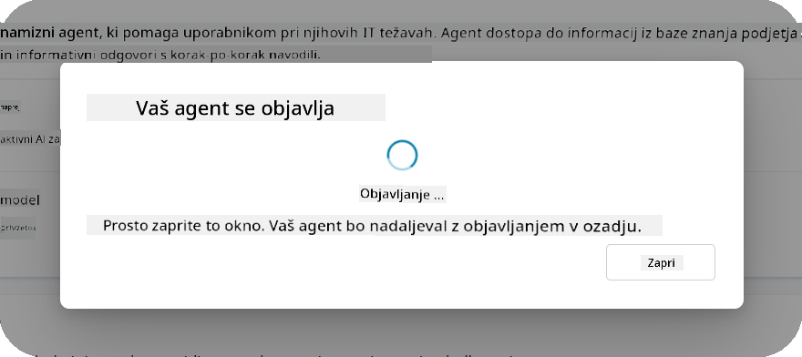

    Ko je agent objavljen, se na vrhu strani agenta prikaže obvestilo.

    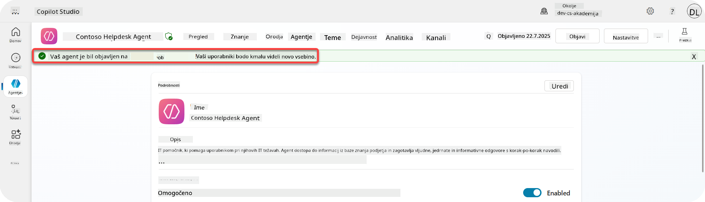

Ampak - objavili smo le agenta, še ga nismo dodali v kanal, zato to zdaj uredimo!

### 11.2 Dodajte kanal Teams in Microsoft 365 Copilot

1. Za dodajanje kanala Teams in Microsoft 365 Copilot našemu agentu moramo izbrati **Kanal** v zgornji navigaciji agenta

    

    Tukaj lahko vidimo vse kanale, ki jih lahko dodamo temu agentu.

1. Izberite **Teams in Microsoft 365**

    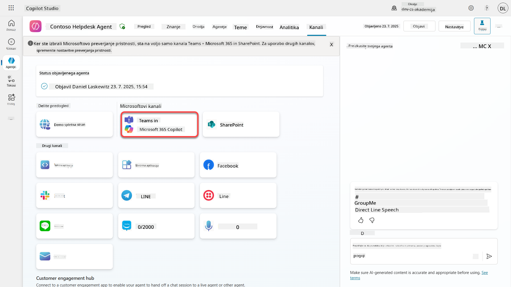

1. Izberite **Dodaj kanal**, da dokončate čarovnika in dodate kanal agentu

    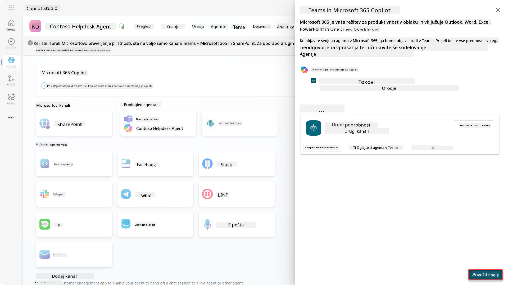

    To bo trajalo nekaj časa, dokler ne bo dodano. Ko bo dodano, se bo na vrhu stranske vrstice prikazalo zeleno obvestilo.

    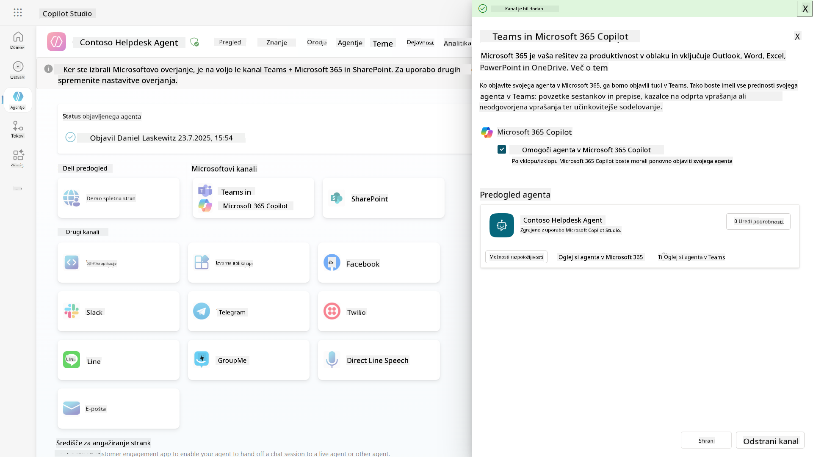

1. Izberite **Oglejte si agenta v Teams**, da odprete nov zavihek

    

1. Izberite **Dodaj**, da dodate Contoso Helpdesk Agent v Teams

    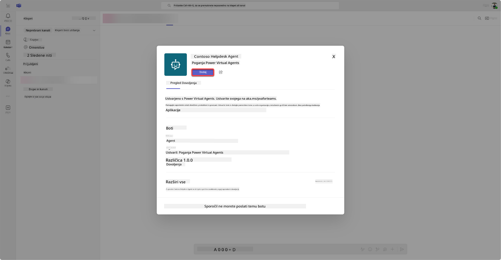

    To bo trajalo nekaj časa. Po tem se mora prikazati naslednji zaslon:

    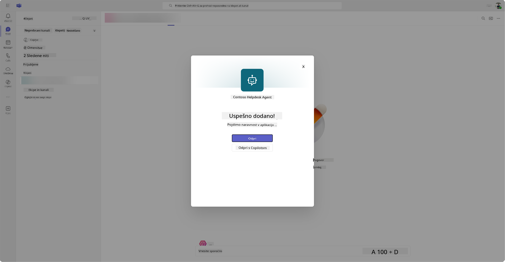

1. Izberite **Odpri**, da odprete agenta v Teams

    To bo odprlo agenta v Teams kot aplikacijo Teams

    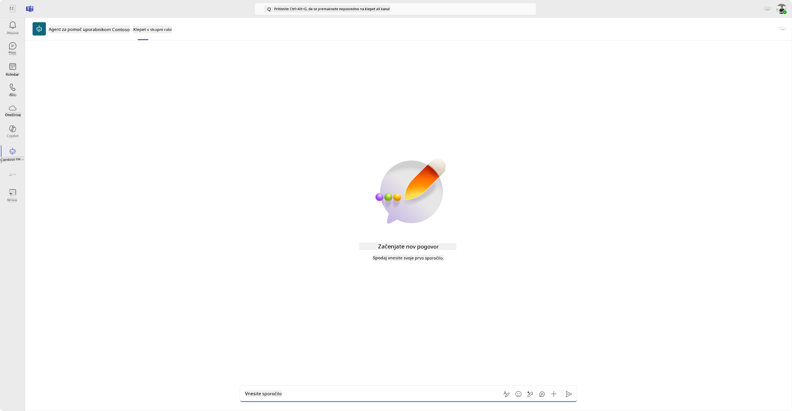

Zdaj smo objavili agenta, da deluje za vas v Microsoft Teams, vendar boste morda želeli to omogočiti za več ljudi.

### 11.3 Omogočite agenta za vse uporabnike v najemniku

1. Zaprite zavihek brskalnika, kjer je bil odprt Contoso Helpdesk Agent

    To vas mora vrniti v Copilot Studio, kjer je stranska plošča Teams in Microsoft 365 Copilot še vedno odprta. Zdaj smo agenta odprli le v Teams, vendar lahko tukaj storimo še veliko več. Lahko uredimo podrobnosti agenta, ga uvedemo za več uporabnikov in še več.

1. Izberite **Uredi podrobnosti**

    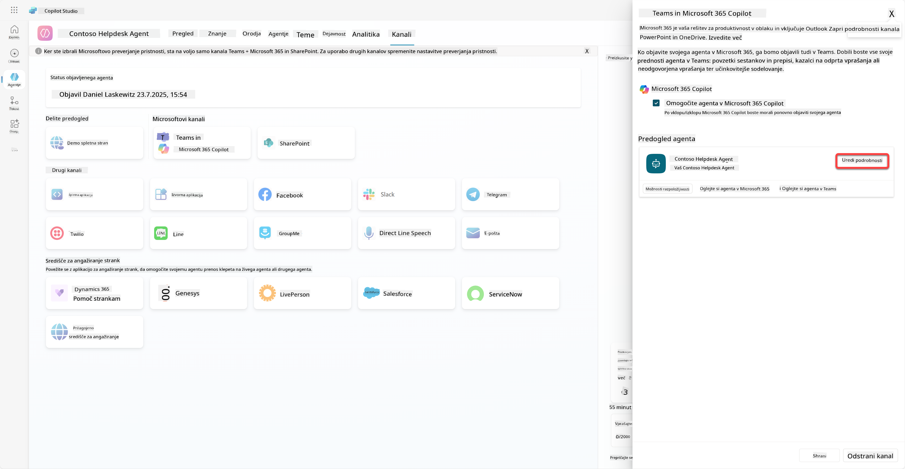
To bo odprlo podokno, kjer lahko spremenimo številne podrobnosti in nastavitve agenta. Spremenimo lahko osnovne podrobnosti, kot so ikona, barva ozadja ikone in opisi. Prav tako lahko tukaj spremenimo nastavitve za Teams (na primer omogočimo uporabniku, da doda agenta v ekipo, ali omogočimo uporabo tega agenta v skupinskih in sestankovnih klepetih). Ko izberete *več*, lahko spremenite tudi podrobnosti razvijalca, kot so ime razvijalca, spletna stran, izjava o zasebnosti in pogoji uporabe.

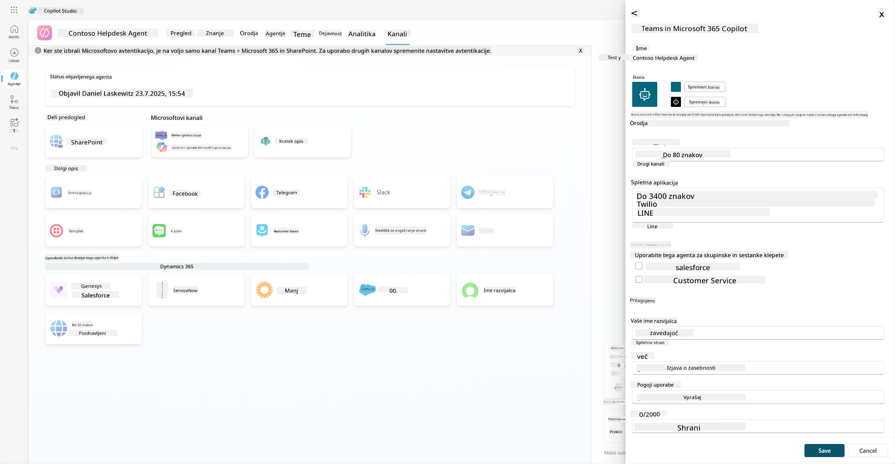

1. Izberite **Prekliči**, da zaprete podokno za urejanje podrobnosti.

1. Izberite **Možnosti razpoložljivosti**.

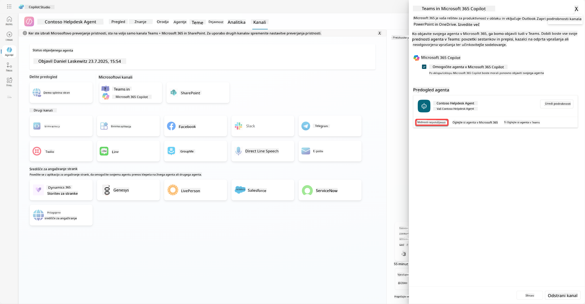

To bo odprlo podokno možnosti razpoložljivosti, kjer lahko kopirate povezavo za pošiljanje uporabnikom, da uporabijo tega agenta (bodite pozorni, agenta morate deliti tudi z uporabnikom) in prenesete datoteko za dodajanje agenta v Microsoft Teams ali Microsoft 365 trgovino. Za prikaz agenta v trgovini imate tudi druge možnosti: lahko ga prikažete svojim sodelavcem in deljenim uporabnikom (za prikaz v razdelku *Zgrajeno s Power Platform*) ali pa ga prikažete vsem v vaši organizaciji (to zahteva odobritev skrbnika).

1. Izberite **Prikaži vsem v moji organizaciji**.

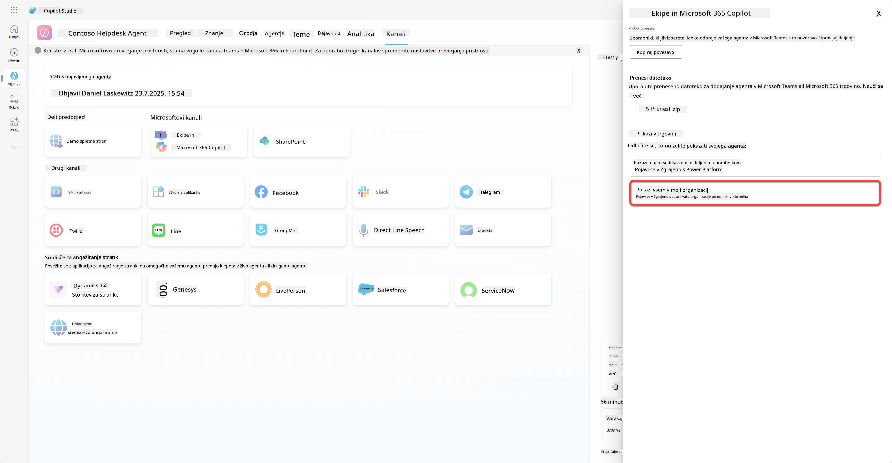

1. Izberite **Pošlji v odobritev skrbniku**.

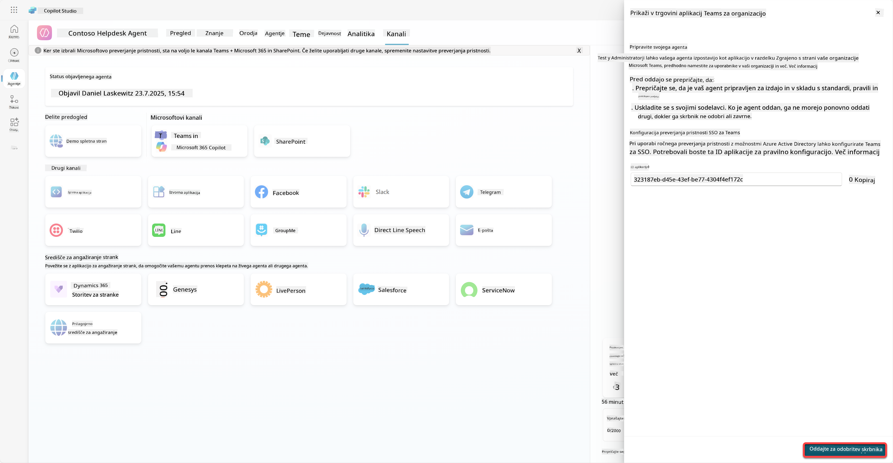

Zdaj mora vaš skrbnik odobriti oddajo agenta. To lahko stori tako, da odpre Teams Admin Center in poišče Contoso Helpdesk Agent v aplikacijah. Na posnetku zaslona lahko vidite, kaj bi skrbnik videl v Teams Admin Center.

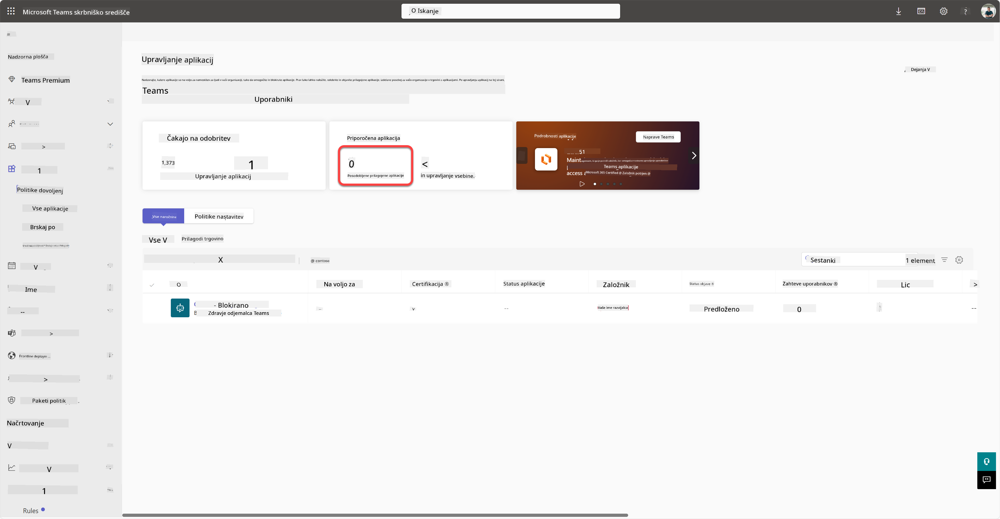

Skrbnik mora izbrati Contoso Helpdesk Agent in izbrati *Objavi*, da objavi Contoso Helpdesk Agent za vse.

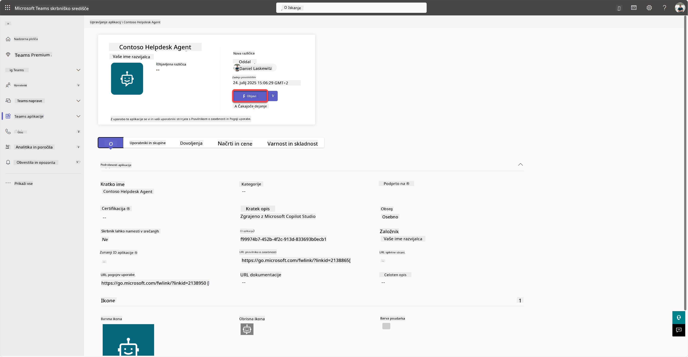

Ko skrbnik objavi oddajo agenta, boste lahko osvežili Copilot Studio in videli banner *na voljo v trgovini aplikacij* v možnostih razpoložljivosti.

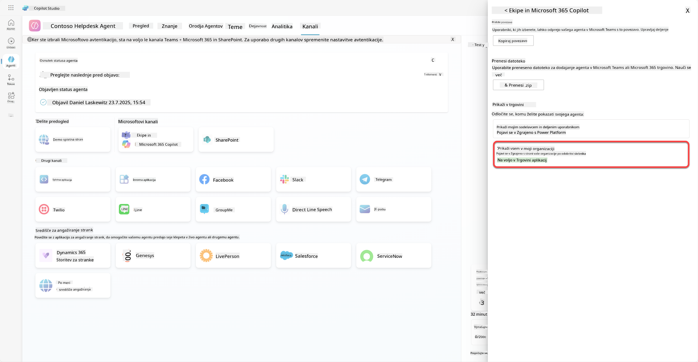

Tu so še dodatne možnosti. Vaš skrbnik lahko spremeni globalno politiko nastavitve in samodejno namesti Contoso Helpdesk Agent za vse v najemniku. Poleg tega lahko agenta Contoso Helpdesk pripnete na levi meni, da bo dostop do njega enostaven za vse.

## ✅ Misija zaključena

🎉 **Čestitke!** Uspešno ste objavili svojega agenta in ga dodali v Teams ter Microsoft 365 Copilot! Naslednja naloga je zadnja misija tečaja: Razumevanje licenciranja.

⏭️ [Premakni se na lekcijo **Razumevanje licenciranja**](../12-understanding-licensing/README.md)

## 📚 Taktični viri

🔗 [Dokumentacija o kanalih za objavo](https://learn.microsoft.com/microsoft-copilot-studio/publication-fundamentals-publish-channels)

---

**Omejitev odgovornosti**:  
Ta dokument je bil preveden z uporabo storitve za prevajanje z umetno inteligenco [Co-op Translator](https://github.com/Azure/co-op-translator). Čeprav si prizadevamo za natančnost, vas prosimo, da upoštevate, da lahko avtomatski prevodi vsebujejo napake ali netočnosti. Izvirni dokument v njegovem maternem jeziku je treba obravnavati kot avtoritativni vir. Za ključne informacije priporočamo profesionalni človeški prevod. Ne prevzemamo odgovornosti za morebitne nesporazume ali napačne razlage, ki izhajajo iz uporabe tega prevoda.