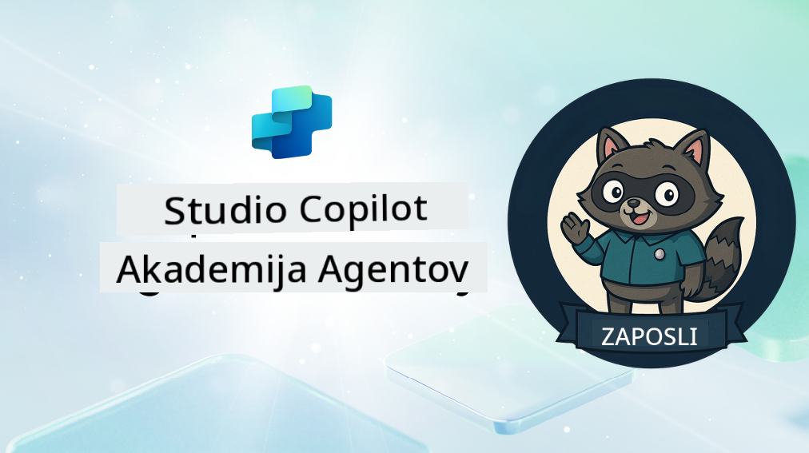

<!--
CO_OP_TRANSLATOR_METADATA:
{
  "original_hash": "8b5ecad9d5d073ea3f4c2b844e80f2e5",
  "translation_date": "2025-10-20T23:19:33+00:00",
  "source_file": "docs/recruit/README.md",
  "language_code": "sl"
}
-->
# Dobrodošel, Rekrut

**Dobrodošel, Rekrut.**  
Tvoja misija—če jo sprejmeš—je obvladati umetnost ustvarjanja agentov z uporabo **Microsoft Copilot Studio**.

Ta praktično usmerjeno usposabljanje je tvoje izhodišče v **svet agentov**: od osnovnih pozivov do prilagodljivih kartic in tokov agentov. Naučil se boš, kako graditi, razširjati in uvajati inteligentne agente z uporabo resničnih orodij in primerov uporabe.

---

## 🎯 Cilj Misije

Ko zaključiš Akademijo za agente, boš sposoben:

- Razumeti, kaj so agenti v kontekstu Microsoft Copilot Studio
- Raziskati, kako se veliki jezikovni modeli (LLM), generacija z dodatnim pridobivanjem informacij (RAG) in orkestracija združujejo v agentu
- Ustvariti tako **deklarativne** kot **prilagojene agente**
- Izboljšati agente z **Temami**, **Prilagodljivimi karticami** in **Tokovi agentov**
- Uvajati agente v **Microsoft Teams** in **Microsoft 365 Copilot**

---

## 🧪 Predpogoji

Za uspešno dokončanje vseh misij potrebuješ:

- Microsoft 365 Developer tenant (z omogočenim SharePointom)
- Dostop do **Microsoft Copilot Studio** (poskusna ali licencirana različica)
- Opcijsko: Osnovno znanje o SharePointu, Power Platform ali Power Fx

---

## 🧬 Za koga je namenjeno

Ta tečaj je idealen za:

- Ustvarjalce in razvijalce, ki raziskujejo **Copilot Studio**
- IT strokovnjake, ki gradijo **razširitve za Microsoft 365 Copilot**
- Navdušence nad Power Platform, ki želijo **nadgraditi svoje znanje** z inteligentnimi agenti
- Vsakogar, ki se raje uči skozi **praktično delo**

---

## 🧭 Pregled učnega načrta

Akademija je razdeljena na progresivne lekcije—vsaka je zasnovana kot misija na terenu za nadgradnjo tvojih veščin pri gradnji agentov.

| Lekcija | Naslov | Povzetek misije |
|---------|--------|-----------------|
| `00` | 🧰 [Nastavitev tečaja](./00-course-setup/README.md) | Nastavi svoje razvojno okolje, poskusno različico Copilot Studio in SharePoint stran |
| `01` | 🧠 [Uvod v agente](./01-introduction-to-agents/README.md) | Razumi koncepte pogovorne umetne inteligence, LLM in avtonomne vs. deklarativne agente |
| `02` | 🛠️ [Osnove Copilot Studio](./02-copilot-studio-fundamentals/README.md) | Spoznaj gradnike: znanje, veščine, avtonomija |
| `03` | 👩‍💻 [Ustvari deklarativnega agenta](./03-create-a-declarative-agent-for-M365Copilot/README.md) | Dodaj svojega agenta v Microsoft 365 Copilot, temelječega na pozivu |
| `04` | 🧩 [Ustvarjanje rešitve](./04-creating-a-solution/README.md) | Pakiraj svojega agenta v ponovno uporabno rešitev za upravljanje okolja |
| `05` | 🚀 [Začni z vnaprej pripravljenimi agenti](./05-using-prebuilt-agents/README.md) | Uporabi in prilagodi predlogo agenta za pospešitev nastavitve |
| `06` | ✍️ [Ustvari prilagojenega agenta](./06-create-agent-from-conversation/README.md) | Ustvari novega Copilota, temelječega na virih znanja |
| `07` | 🧠 [Dodaj temo s sprožilci](./07-add-new-topic-with-trigger/README.md) | Uporabi teme za definiranje poti vprašanj/odgovorov po meri |
| `08` | 🪪 [Izboljšaj s prilagodljivimi karticami](./08-add-adaptive-card/README.md) | Ustvari prilagodljivo kartico z uporabo Power Fx in SharePointa |
| `09` | 🔁 [Avtomatiziraj s tokovi agentov](./09-add-an-agent-flow/README.md) | Uporabi vnos prilagodljive kartice za sprožitev zalednih tokov |
| `10` | 🧭 [Dodaj sprožilce dogodkov](./10-add-event-triggers/README.md) | Omogoči svojemu agentu, da deluje avtonomno z uporabo logike, temelječe na dogodkih |
| `11` | 📢 [Objavi svojega agenta](./11-publish-your-agent/README.md) | Uvajaj svojega agenta v Microsoft Teams in Microsoft 365 Copilot |
| `12` | 🪪 [Razumevanje licenciranja](./12-understanding-licensing/README.md) | Nauči se, kako deluje licenciranje in obračunavanje z Copilot Studio |
| `13` | 🚨 [Pridobi značko rekruta](./course-completion-badges-recruit/README.md) | Pridobi svojo značko in označi svoj dosežek! |

!!! note
    ✅ Z dokončanjem tega učnega načrta si prislužiš značko **Rekrut**.  
    🔓 **Operativec** in **Poveljnik** bosta odklenjena v prihodnjih fazah.

<!-- markdownlint-disable-next-line MD033 -->

---

**Omejitev odgovornosti**:  
Ta dokument je bil preveden z uporabo storitve za prevajanje z umetno inteligenco [Co-op Translator](https://github.com/Azure/co-op-translator). Čeprav si prizadevamo za natančnost, vas prosimo, da upoštevate, da lahko avtomatski prevodi vsebujejo napake ali netočnosti. Izvirni dokument v njegovem maternem jeziku naj se šteje za avtoritativni vir. Za ključne informacije priporočamo profesionalni človeški prevod. Ne odgovarjamo za morebitne nesporazume ali napačne razlage, ki izhajajo iz uporabe tega prevoda.