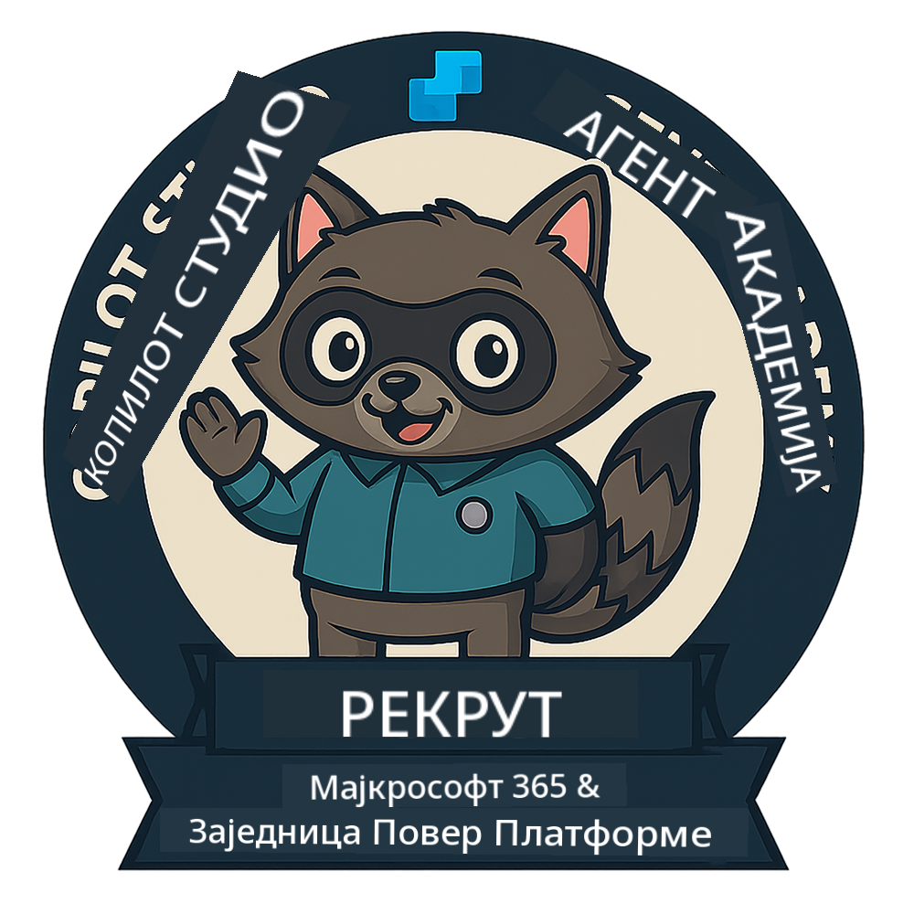
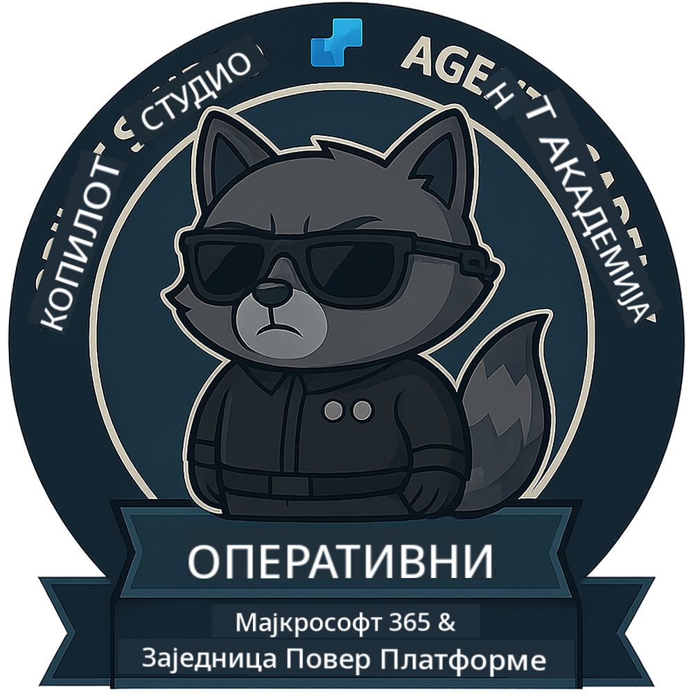
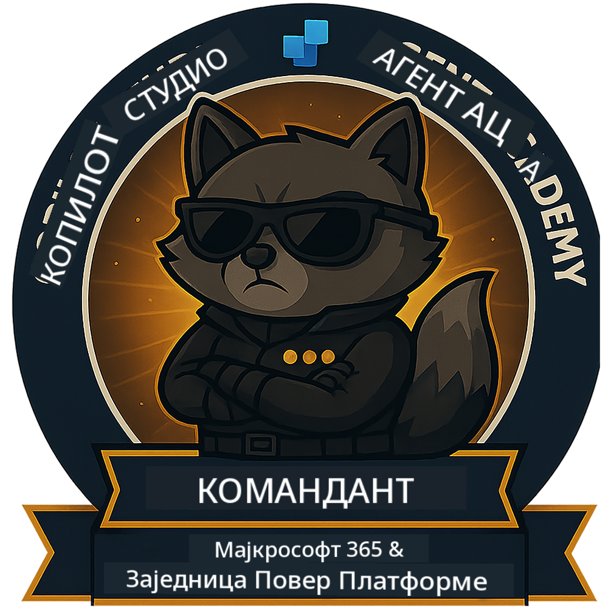

<!--
CO_OP_TRANSLATOR_METADATA:
{
  "original_hash": "15e57e059ce7689d602d7853187235cd",
  "translation_date": "2025-10-20T22:41:08+00:00",
  "source_file": "docs/index.md",
  "language_code": "sr"
}
-->
---
hide:
- navigation
---

# Академија агената Copilot Studio

**Добродошли у Академију агената Copilot Studio.**  

Ваша мисија—ако је прихватите—је да савладате вештину креирања агената користећи **Microsoft Copilot Studio**.

Ова практична обука је ваш улазак у **свет агената**: од основних упита до адаптивних картица и токова агената, научићете како да креирате, скалирате и примените интелигентне агенте користећи алате и примере из стварног света.

---

## 🏅 Напредак у рангу

**Академија агената Copilot Studio** је програм обуке у више фаза, осмишљен да развије ваше вештине кроз три ранга агената. Сваки ниво укључује значку и повећане одговорности:

| Ранг             | Ниво | Визуелно |
|------------------|:-----:|--------|
| 🟢 **Рекрут**  [🚀 Започните](https://aka.ms/agent-academy-recruit){ .md-button .md-button--primary }     | •     | { width="300" }     |
| 🔵 **Оперативац** (Ускоро)   | ••    | { width="300" } |
| 🟡 **Командант** (Ускоро)    | •••   | { width="300" } |

Сваки ниво се надовезује на претходни. Завршите своју мисију као Рекрут и пратите новости како бисте напредовали у својим агентским квалификацијама.

---

## 🎒 Остали курсеви

Погледајте ове друге курсеве како бисте наставили да учите о вештачкој интелигенцији и агентима:

- [Microsoft Copilot Studio <3 MCP Lab](https://aka.ms/mcsmcplab)
- [Copilot Developer Camp](https://microsoft.github.io/copilot-camp/)
- [AI Agents for Beginners](https://microsoft.github.io/ai-agents-for-beginners/)
- [Model Context Protocol (MCP) For Beginners](https://github.com/microsoft/mcp-for-beginners)

---

## 🚑 Проблеми

Веома ценимо ваше повратне информације! Молимо вас да користите [списак проблема](https://github.com/microsoft/agent-academy/issues) како бисте поделили своје коментаре и проблеме. Хвала!

---

## 📜 Кодекс понашања

Овај пројекат је усвојио [Microsoft Open Source Кодекс понашања](https://opensource.microsoft.com/codeofconduct/).

!!! info "Ресурси:"

    - [Microsoft Open Source Кодекс понашања](https://opensource.microsoft.com/codeofconduct/)
    - [Microsoft Кодекс понашања - Често постављана питања](https://opensource.microsoft.com/codeofconduct/faq/)
    - Контактирајте [opencode@microsoft.com](mailto:opencode@microsoft.com) за питања или недоумице

---

[⭐️ Оцените наш репозиторијум](https://github.com/microsoft/agent-academy){ .md-button .md-button--primary }

<!-- markdownlint-disable-next-line MD033 -->

---

**Одрицање од одговорности**:  
Овај документ је преведен помоћу услуге за превођење уз помоћ вештачке интелигенције [Co-op Translator](https://github.com/Azure/co-op-translator). Иако настојимо да обезбедимо тачност, молимо вас да имате у виду да аутоматски преводи могу садржати грешке или нетачности. Оригинални документ на изворном језику треба сматрати меродавним извором. За критичне информације препоручује се професионални превод од стране људи. Не преузимамо одговорност за било каква погрешна тумачења или неспоразуме који могу настати услед коришћења овог превода.