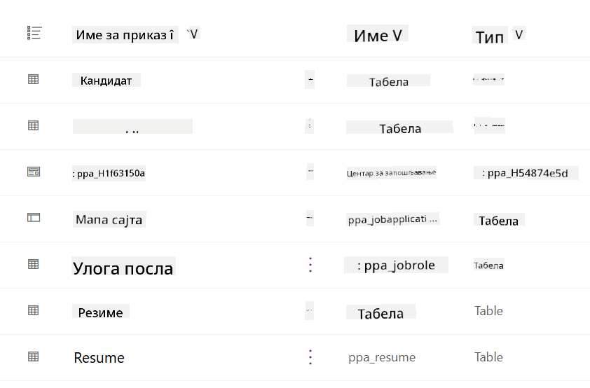
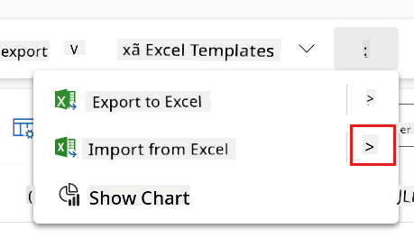
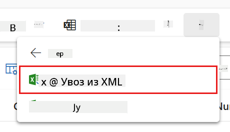
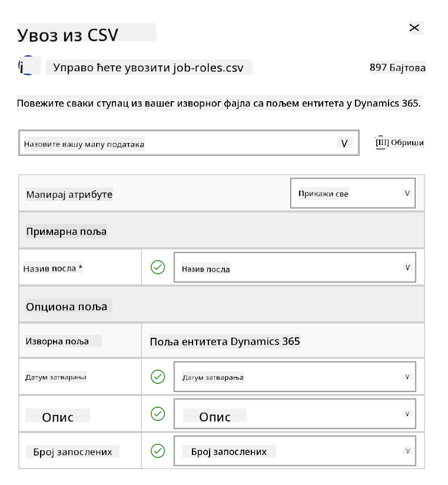
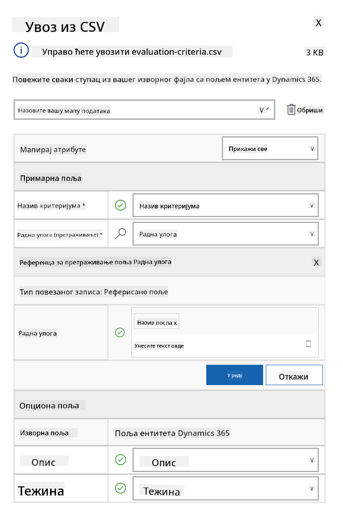
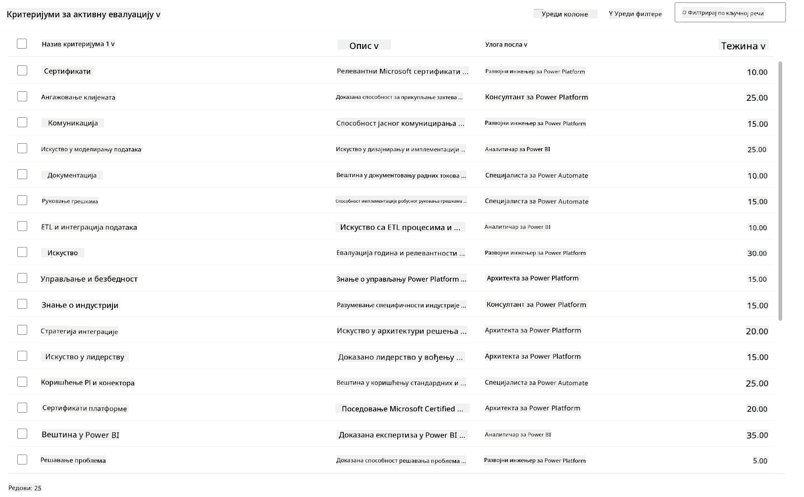

<!--
CO_OP_TRANSLATOR_METADATA:
{
  "original_hash": "2620cf9eaf09a3fc6be7fa31a3a62956",
  "translation_date": "2025-10-20T23:06:33+00:00",
  "source_file": "docs/operative-preview/01-get-started/README.md",
  "language_code": "sr"
}
-->
# 🚨 Мисија 01: Започните са агентом за запошљавање

--8<-- "disclaimer.md"

## 🕵️‍♂️ КОДНО ИМЕ: `ОПЕРАЦИЈА ЛОВ НА ТАЛЕНТЕ`

> **⏱️ Време трајања операције:** `~45 минута`

## 🎯 Опис мисије

Добродошли, агенте. Ваш први задатак је **Операција Лов на таленте** - успостављање основне инфраструктуре за систем запошљавања заснован на вештачкој интелигенцији који ће трансформисати начин на који организације идентификују и запошљавају најбоље таленте.

Ваша мисија, ако је прихватите, јесте да имплементирате и конфигуришете свеобухватан систем за управљање запошљавањем користећи Microsoft Copilot Studio. Увезите унапред припремљено решење које садржи све потребне структуре података, а затим креирајте свог првог AI агента - **Агент за запошљавање** - који ће служити као централни координатор за све будуће операције запошљавања.

Ова почетна имплементација успоставља командни центар који ћете унапређивати током програма оперативца Академије агената. Сматрајте ово својом базом операција - темељем на којем ћете изградити целу мрежу специјализованих агената у наредним мисијама.

---

## 🔎 Циљеви

Завршетком ове мисије, постићи ћете:

- **Разумевање сценарија**: Стицање свеобухватног знања о изазовима и решењима аутоматизације запошљавања
- **Имплементација решења**: Успешно увезите и конфигуришите основе система за управљање запошљавањем
- **Креирање агента**: Изградите агента за запошљавање који је почетак сценарија који ћете развијати као оперативци Академије агената

---

## 🔍 Предуслови

Пре него што започнете ову мисију, уверите се да имате:

- Лиценцу за Copilot Studio
- Приступ Microsoft Power Platform окружењу
- Административне дозволе за креирање решења и агената

---

## 🏢 Разумевање сценарија аутоматизације запошљавања

Овај сценарио показује како компанија може користити Microsoft Copilot Studio за побољшање и аутоматизацију процеса запошљавања. Уводи систем агената који заједно раде на задацима као што су прегледање биографија, препоручивање радних места, припрема материјала за интервјуе и процена кандидата.

### Пословна вредност

Решење помаже HR тимовима да уштеде време и донесу боље одлуке кроз:

- Аутоматску обраду биографија примљених путем е-поште.
- Препоруке за одговарајуће радне позиције на основу профила кандидата.
- Креирање пријава за посао и водича за интервјуе прилагођених сваком кандидату.
- Осигурање праведних и усклађених пракси запошљавања кроз уграђене функције безбедности и модерације.
- Прикупљање повратних информација ради побољшања решења.

### Како функционише

- Централни **Агент за запошљавање** координира процес и чува податке у Microsoft Dataverse.
- **Агент за пријем пријава** чита биографије и креира пријаве за посао.
- **Агент за припрему интервјуа** генерише питања за интервју и документацију на основу искуства кандидата.
- Систем се може објавити на демо веб-сајту, омогућавајући заинтересованим странама да интерагују са њим.

Овај сценарио је идеалан за организације које желе да модернизују своје радне токове запошљавања користећи аутоматизацију засновану на вештачкој интелигенцији, уз одржавање транспарентности, праведности и ефикасности.

---

## 🧪 Лабораторија: Постављање агента за запошљавање

У овој практичној лабораторији, успоставићете темеље за ваш систем аутоматизације запошљавања. Почећете увозом унапред конфигурисаног решења које садржи све потребне Dataverse табеле и структуру података за управљање кандидатима, радним позицијама и радним токовима запошљавања. Затим ћете попунити ове табеле узорним подацима који ће подржати ваше учење током овог модула и пружити реалне сценарије за тестирање. На крају, креираћете агента за запошљавање у Copilot Studio, постављајући основни интерфејс за разговор који ће служити као темељ за све остале функције које ћете додати у будућим мисијама.

### 🧪 Лабораторија 1.1: Увоз решења

1. Идите на **[Copilot Studio](https://copilotstudio.microsoft.com)**
1. Изаберите **...** у левој навигацији и изаберите **Solutions**
1. Изаберите дугме **Import Solution** на врху
1. **[Преузмите](https://raw.githubusercontent.com/microsoft/agent-academy/refs/heads/main/docs/operative-preview/01-get-started/assets/Operative_1_0_0_0.zip)** припремљено решење
1. Изаберите **Browse** и изаберите преузето решење из претходног корака
1. Изаберите **Next**
1. Изаберите **Import**

!!! success
    Успешно сте увезли решење! Када се процес заврши, видећете зелену траку са поруком:  
    "Solution "Operative" imported successfully."

Када је решење увезено, погледајте шта сте увезли тако што ћете изабрати приказ имена решења (`Operative`).



Следеће компоненте су увезене:

| Приказ имена | Тип | Опис |
|-------------|------|-------------|
| Кандидат | Табела | Информације о кандидату |
| Критеријуми за процену | Табела | Критеријуми за процену за позицију |
| Центар за запошљавање | Апликација заснована на моделу | Апликација за управљање процесом запошљавања |
| Центар за запошљавање | Мапа сајта | Структура навигације за апликацију Центар за запошљавање |
| Пријава за посао | Табела | Пријаве за посао |
| Радна позиција | Табела | Радне позиције |
| Биографија | Табела | Биографије кандидата |

Као последњи задатак за ову лабораторију, изаберите дугме **Publish all customizations** на врху странице.

### 🧪 Лабораторија 1.2: Увоз узорних података

У овој лабораторији, додаћете узорне податке у неке од табела које сте увезли у лабораторији 1.1.

#### Преузмите датотеке за увоз

1. **[Преузмите](https://raw.githubusercontent.com/microsoft/agent-academy/refs/heads/main/docs/operative-preview/01-get-started/assets/evaluation-criteria.csv)** CSV-датотеку са критеријумима за процену
1. **[Преузмите](https://raw.githubusercontent.com/microsoft/agent-academy/refs/heads/main/docs/operative-preview/01-get-started/assets/job-roles.csv)** CSV-датотеку са радним позицијама

#### Увоз узорних података за радне позиције

1. Вратите се на решење које сте управо увезли у претходној лабораторији
1. Изаберите **Центар за запошљавање** апликацију засновану на моделу тако што ћете означити поље испред реда
1. Изаберите дугме **Play** на врху

    !!! warning
        Можда ће вам бити затражено да се поново пријавите. Уверите се да сте то урадили. Након тога, требало би да видите апликацију Центар за запошљавање.

1. Изаберите **Радне позиције** у левој навигацији
1. Изаберите икону **Више** (три тачке једна испод друге) у командној траци
1. Изаберите **десну стрелицу** поред *Import from Excel*

    

1. Изаберите **Import from CSV**

    

1. Изаберите дугме **Choose File**, изаберите датотеку **job-roles.csv** коју сте управо преузели и затим изаберите **Open**
1. Изаберите **Next**
1. Оставите следећи корак како јесте и изаберите **Review Mapping**

    

1. Уверите се да је мапирање исправно и изаберите **Finish Import**

    !!! info
        Ово ће покренути увоз, а напредак можете пратити или одмах завршити процес тако што ћете изабрати **Done**

1. Изаберите **Done**

Ово може потрајати мало времена, али можете притиснути дугме **Refresh** да бисте проверили да ли је увоз успешно завршен.


#### Увоз узорних података за критеријуме процене

1. Изаберите **Критеријуми за процену** у левој навигацији
1. Изаберите икону **Више** (три тачке једна испод друге) у командној траци
1. Изаберите **десну стрелицу** поред *Import from Excel*

    

1. Изаберите **Import from CSV**

    

1. Изаберите дугме **Choose File**, изаберите датотеку **evaluation-criteria.csv** коју сте управо преузели и затим изаберите **Open**
1. Изаберите **Next**
1. Оставите следећи корак како јесте и изаберите **Review Mapping**

    

1. Сада морамо урадити мало више посла за мапирање. Изаберите икону лупе (икона 🔎) поред поља Job Role
1. Уверите се да је **Job Title** овде изабран, а ако није - додајте га
1. Изаберите **OK**
1. Уверите се да је остатак мапирања такође исправан и изаберите **Finish Import**

    !!! info
        Ово ће поново покренути увоз, а напредак можете пратити или одмах завршити процес тако што ћете изабрати **Done**

1. Изаберите **Done**

Ово може потрајати мало времена, али можете притиснути дугме **Refresh** да бисте проверили да ли је увоз успешно завршен.



### 🧪 Лабораторија 1.3: Креирање агента за запошљавање

Сада када сте завршили постављање предуслова, време је за прави посао! Прво додајмо нашег агента за запошљавање!

1. Идите на **[Copilot Studio](https://copilotstudio.microsoft.com)** и уверите се да сте у истом окружењу где сте увезли решење и податке
1. Изаберите **Agents** у левој навигацији
1. Изаберите **New Agent**
1. Изаберите **Configure**
1. За **Name**, унесите:

    ```text
    Hiring Agent
    ```

1. За **Description**, унесите:

    ```text
    Central orchestrator for all hiring activities
    ```

1. Изаберите **...** поред дугмета *Create* у горњем десном углу
1. Изаберите **Update advanced settings**
1. Као **Solution**, изаберите `Operative`
1. Изаберите **Update**
1. Изаберите **Create** у горњем десном углу

Ово ће креирати агента за запошљавање, који ћете користити током овог курса за оперативце.

---

## 🎉 Мисија завршена

Мисија 01 је завршена! Сада сте савладали следеће вештине:

✅ **Разумевање сценарија**: Свеобухватно знање о изазовима и решењима аутоматизације запошљавања  
✅ **Имплементација решења**: Успешно сте увезли и конфигурисали основе система за управљање запошљавањем  
✅ **Креирање агента**: Креирали сте агента за запошљавање који је почетак сценарија који ћете развијати као оперативци Академије агената  

Следеће је [Мисија 02](../02-multi-agent/README.md): Припремите свог агента за рад са повезаним агентима.

---

## 📚 Тактички ресурси

📖 [Microsoft Copilot Studio - Креирање агента](https://learn.microsoft.com/microsoft-copilot-studio/authoring-first-bot)  
📖 [Microsoft Dataverse документација](https://learn.microsoft.com/power-apps/maker/data-platform)

---

**Одрицање од одговорности**:  
Овај документ је преведен помоћу услуге за превођење уз помоћ вештачке интелигенције [Co-op Translator](https://github.com/Azure/co-op-translator). Иако настојимо да обезбедимо тачност, молимо вас да имате у виду да аутоматски преводи могу садржати грешке или нетачности. Оригинални документ на његовом изворном језику треба сматрати меродавним извором. За критичне информације препоручује се професионални превод од стране људи. Не преузимамо одговорност за било каква погрешна тумачења или неспоразуме који могу настати услед коришћења овог превода.