<!--
CO_OP_TRANSLATOR_METADATA:
{
  "original_hash": "4fb913dfc3bbc71506dd3602c4b8e6ed",
  "translation_date": "2025-10-20T22:46:15+00:00",
  "source_file": "docs/operative-preview/02-multi-agent/README.md",
  "language_code": "sr"
}
-->
# 🚨 Мисија 02: Повезани агенти

--8<-- "disclaimer.md"

## 🕵️‍♂️ КОДНО ИМЕ: `ОПЕРАЦИЈА СИМФОНИЈА`

> **⏱️ Време трајања операције:** `~45 минута`

## 🎯 Опис мисије

Добродошли назад, агенте. У Мисији 01, изградили сте свог главног агента за запошљавање - солидну основу за управљање процесима регрутовања. Али један агент може да уради само толико.

Ваш задатак, ако га прихватите, је **Операција Симфонија** - трансформација вашег једног агента у **систем више агената**: оркестрирани тим специјализованих агената који заједно решавају сложене изазове запошљавања. Замислите то као надоградњу са соло оператера на командовање специјализованом радном групом.

Као симфонијски оркестар где сваки музичар свира свој део у савршеној хармонији, додаћете два кључна специјалиста вашем постојећем агенту за запошљавање: агента за пријем апликација који аутоматски обрађује биографије и агента за припрему интервјуа који креира свеобухватне материјале за интервјуе. Ови агенти ће беспрекорно сарађивати под управом вашег главног оркестратора.

## 🔎 Циљеви

У овој мисији ћете научити:

1. Када користити **подагенте** уместо **повезаних агената**
1. Како дизајнирати **архитектуре више агената** које се могу скалирати  
1. Креирање **подагената** за фокусиране задатке
1. Успостављање **образаца комуникације** између агената
1. Изградњу агента за пријем апликација и агента за припрему интервјуа

## 🧠 Шта су повезани агенти?

У Copilot Studio, нисте ограничени на изградњу једног, монолитног агента. Можете креирати **системе више агената** - мреже специјализованих агената који заједно раде на решавању сложених процеса.

Замислите то као стварну организацију: уместо да једна особа ради све, имате специјалисте који су изузетни у одређеним задацима и сарађују када је то потребно.

### Зашто су системи више агената важни

- **Скалабилност:** Сваки агент може бити развијен, тестиран и одржаван независно од стране различитих тимова.  
- **Специјализација:** Агенти се могу фокусирати на оно у чему су најбољи. Можда један за обраду података, други за интеракцију са корисницима, трећи за доношење одлука.  
- **Флексибилност:** Можете комбиновати и прилагођавати агенте, поново их користити у различитим пројектима и постепено развијати свој систем.  
- **Одрживост:** Промене на једном агенту не утичу нужно на друге, што чини ажурирања сигурнијим и лакшим.

### Пример из стварног света: процес запошљавања

Размотрите наш процес запошљавања - више агената може сарађивати са следећим одговорностима:

- **Пријем биографија** захтева вештине за обраду докумената и екстракцију података
- **Оцењивање** укључује процену биографија кандидата и њихово упоређивање са захтевима посла
- **Припрема за интервју** захтева дубинско разматрање о томе како кандидат одговара позицији  
- **Комуникација са кандидатима** захтева емпатичне комуникационе способности

Уместо да изградите једног масивног агента који покушава да обради све ове различите вештине, можете креирати специјализоване агенте за сваку област и оркестрирати их заједно.

## 🔗 Подагенти vs повезани агенти: Кључна разлика

Copilot Studio нуди два начина за изградњу система више агената, сваки са специфичним случајевима употребе:

### ↘️ Подагенти

Подагенти су **лагани специјалисти** који постоје унутар вашег главног агента. Замислите их као специјализоване тимове унутар истог одељења.

#### Кључни технички детаљи

- Подагенти постоје унутар главног агента и имају једну страницу за конфигурацију.
- Алатке и знање су **складиштени код главног** агента, али су конфигурисани да буду "доступни" подагенту.
- Подагенти **деле теме** свог главног агента. Теме могу бити референциране у упутствима подагента.
- Подагенти **не морају бити посебно објављени** - аутоматски су доступни унутар свог главног агента након креирања. Ово олакшава тестирање јер се промене на главном и подагентима могу извршити у **истом заједничком радном простору**.

#### Користите подагенте када

- Један тим управља целокупним решењем
- Желите логички организовати алатке и знање у подагенте
- Не треба вам посебна аутентификација или распоређивање за сваког агента
- Агенти неће бити посебно објављени или коришћени независно
- Не треба вам поновна употреба агената у више решења

**Пример:** Агенти за помоћ у ИТ сектору са подагентима за:

- Процедуре за ресетовање лозинки
- Решавање проблема са хардвером  
- Упутства за инсталацију софтвера

### 🔀 Повезани агенти

Повезани агенти су **потпуно независни агенти** са којима ваш главни агент може сарађивати. Замислите их као одвојене одељења која раде заједно на пројекту.

#### Кључни технички детаљи

- Повезани агенти имају **своје теме** и токове разговора. Они раде независно са сопственим подешавањима, логиком и животним циклусом распоређивања.
- Повезани агенти **морају бити објављени** пре него што могу бити додати и коришћени од стране других агената.
- Током тестирања, промене на повезаном агенту морају бити објављене пре него што их позивајући агент може користити.

#### Користите повезане агенте када

- Више тимова развија и одржава различите агенте независно
- Агенти требају своја подешавања, аутентификацију и канале распоређивања
- Желите да објављујете и одржавате агенте одвојено са независним управљањем животним циклусом апликације (ALM) за сваког агента
- Агенти треба да буду поново употребљиви у више решења

**Пример:** Систем за корисничку подршку који се повезује са:

- Посебним агентом за наплату који одржава финансијски тим
- Посебним агентом за техничку подршку који одржава тим за производе
- Посебним агентом за поврат робе који одржава тим за операције

!!! tip "Савет"
    Можете комбиновати оба приступа! На пример, ваш главни агент може се повезати са спољним агентима из других тимова, док истовремено има своје подагенте за специјализоване унутрашње задатке.

## 🎯 Шаблони архитектуре више агената

Приликом дизајнирања система више агената, појављују се различити шаблони на основу начина на који агенти интерагују:

| Шаблон              | Опис                                                                 | Најбоље за                                                      |
|----------------------|---------------------------------------------------------------------|-----------------------------------------------------------------|
| **Центар и краци**    | Главни оркестратор координира са више специјализованих агената. Оркестратор управља интеракцијом са корисником и делегира задатке подагентима или повезаним агентима. | Сложени процеси где један агент координира специјализоване задатке |
| **Линија**         | Агенти прослеђују рад секвенцијално један другом, сваки додаје вредност пре него што га проследи следећој фази. | Линеарни процеси као што је обрада апликација (пријем → процена → интервју → одлука) |
| **Сараднички**    | Агенти раде заједно истовремено на различитим аспектима истог проблема, делећи контекст и резултате. | Сложене анализе које захтевају више перспектива или области експертизе |

!!! tip "Савет"
    Можете имати чак и хибрид два или више ових шаблона.

## 💬Комуникација агената и дељење контекста

Када агенти раде заједно, потребно је да ефикасно деле информације. Ево како то функционише у Copilot Studio:

### Историја разговора

По подразумеваном подешавању, када главни агент позове подагента или повезаног агента, може да проследи **историју разговора**. Ово омогућава специјализованом агенту да има потпуни контекст о томе шта је корисник говорио.

Можете онемогућити ову опцију из безбедносних или перформансних разлога - на пример, ако специјализовани агент треба само да заврши одређени задатак без потребе за пуним контекстом разговора. Ово може бити добра одбрана од **цурења података**.

### Експлицитна упутства

Ваш главни агент може давати **специфична упутства** подагентима или повезаним агентима. На пример: "Обради ову биографију и сумирај њихове вештине за позицију вишег програмера."

### Повратне вредности

Агенти могу враћати структурисане информације назад позивајућем агенту, омогућавајући главном агенту да користи те информације у наредним корацима или да их дели са другим агентима.

### Интеграција са Dataverse

За сложеније сценарије, агенти могу делити информације преко **Dataverse** или других складишта података, омогућавајући трајно дељење контекста кроз више интеракција.

## ↘️Подагент: Агент за пријем апликација

Хајде да започнемо изградњу нашег система за запошљавање са више агената. Наш први специјалиста биће **Агент за пријем апликација** - подагент одговоран за обраду пристиглих биографија и информација о кандидатима.

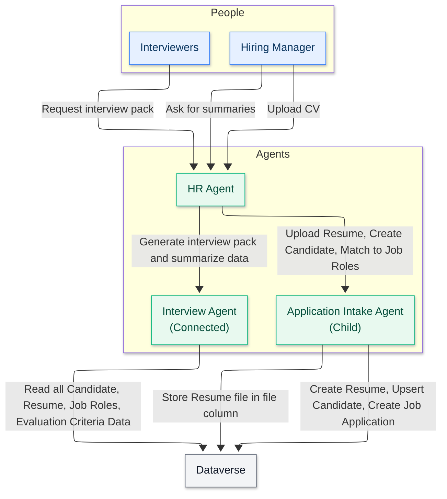
```mermaid
---
config:
  layout: elk
  look: neo
---
flowchart TB
 subgraph People["People"]
    direction TB
        HiringManager["Hiring Manager"]
        Interviewers["Interviewers"]
  end
 subgraph Agents["Agents"]
    direction LR
        ApplicationIntakeAgent["Application Intake Agent<br>(Child)"]
        InterviewAgent["Interview Agent<br>(Connected)"]
        HRAgent["HR Agent"]
  end
    HiringManager -- Upload CV --> HRAgent
    HRAgent -- Upload Resume, Create Candidate, Match to Job Roles --> ApplicationIntakeAgent
    ApplicationIntakeAgent -- Create Resume, Upsert Candidate, Create Job Application --> Dataverse["Dataverse"]
    ApplicationIntakeAgent -- Store Resume file in file column --> Dataverse
    HiringManager -- Ask for summaries --> HRAgent
    Interviewers -- Request interview pack --> HRAgent
    HRAgent -- Generate interview pack and summarize data --> InterviewAgent
    InterviewAgent -- Read all Candidate, Resume, Job Roles, Evaluation Criteria Data --> Dataverse
     HiringManager:::person
     Interviewers:::person
     ApplicationIntakeAgent:::agent
     InterviewAgent:::agent
     HRAgent:::agent
     Dataverse:::data
    classDef person fill:#e6f0ff,stroke:#3b82f6,color:#0b3660
    classDef agent fill:#e8f9ef,stroke:#10b981,color:#064e3b
    classDef data  fill:#f3f4f6,stroke:#6b7280,color:#111827
```

### 🤝Одговорности агента за пријем апликација

- **Парсирање садржаја биографије** из PDF докумената достављених путем интерактивног чета (у будућој мисији ћете научити како да аутономно обрађујете биографије).
- **Екстракција структурисаних података** (име, вештине, искуство, образовање)
- **Упоређивање кандидата са отвореним позицијама** на основу квалификација и мотивационог писма
- **Чување информација о кандидатима** у Dataverse за каснију обраду
- **Елиминација дупликата апликација** како би се избегло креирање истог кандидата два пута, упоређивање са постојећим записима користећи адресу е-поште из биографије.

### ⭐Зашто ово треба да буде подагент

Агент за пријем апликација савршено се уклапа као подагент јер:

- Специјализован је за обраду докумената и екстракцију података
- Не треба му посебно објављивање  
- Део је нашег укупног решења за запошљавање којим управља исти тим
- Фокусира се на одређени окидач (примање нове биографије) и активира га главни агент за запошљавање.

## 🔀Повезани агент: Агент за припрему интервјуа  

Наш други специјалиста биће **Агент за припрему интервјуа** - повезани агент који помаже у креирању свеобухватних материјала за интервјуе и процени одговора кандидата.

### 🤝Одговорности агента за припрему интервјуа

- **Креирање пакета за интервјуе** са информацијама о компанији, захтевима за позицију и критеријумима за процену
- **Генерисање питања за интервјуе** прилагођених специфичним позицијама и позадини кандидата
- **Одговарање на општа питања** о радним местима и апликацијама за комуникацију са заинтересованим странама

### ⭐Зашто ово треба да буде повезани агент

Агент за припрему интервјуа боље функционише као повезани агент јер:

- Тим за регрутовање можда жели да га користи независно у различитим процесима запошљавања
- Потребна му је сопствена база знања о најбољим праксама за интервјуе и критеријумима за процену
- Различити менаџери за запошљавање можда желе да прилагоде његово понашање за своје тимове
- Може се поново користити за унутрашње позиције, а не само за спољашње запошљавање

## 🧪Лабораторија 2.1: Додавање агента за пријем апликација

Спремни да теорију примените у пракси? Хајде да додамо наш први подагент вашем постојећем агенту за запошљавање.

### Предуслови за завршетак ове мисије

Потребно је да **или**:

- **Завршите Мисију 01** и имате спремног агента за запошљавање, **ИЛИ**
- **Увезете почетно решење за Мисију 02** ако почињете од почетка или треба да надокнадите. [Преузмите почетно решење за Мисију 02](https://aka.ms/agent-academy)

!!! note "Увоз решења и пример података"
    Ако користите почетно решење, погледајте [Мисија 01](../01-get-started/README.md) за детаљна упутства о томе како да увезете решења и пример података у своје окружење.

### 2.1.1 Постављање решења

1. Унутар Copilot Studio, изаберите три тачке (...) испод Алатки у левој навигацији.
1. Изаберите **Решења**.  
    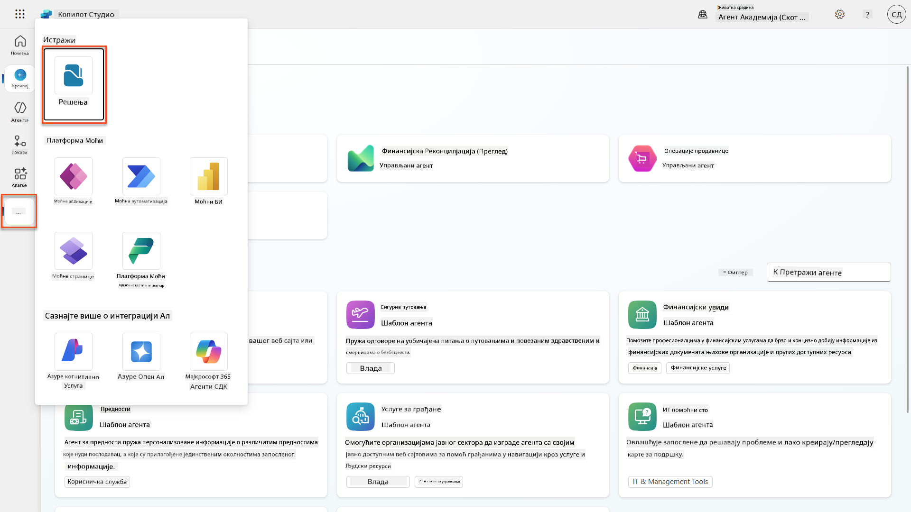
1. Пронађите своје оперативно решење, изаберите **три тачке (...)** поред њега и изаберите **Постави као преферирано решење**. Ово ће осигурати да сав ваш рад буде додат овом решењу.  
    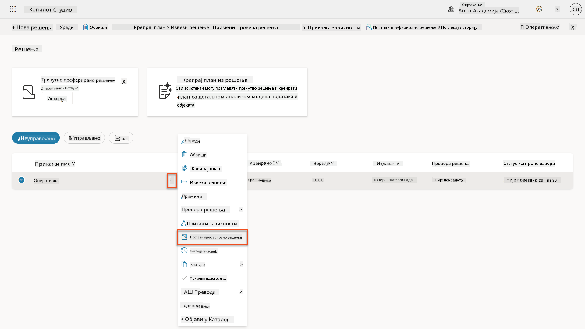

### 2.1.2 Конфигуришите упутства за агента за запошљавање

1. **Навигирајте** до Copilot Studio. Осигурајте да је ваше окружење изабрано у горњем десном **Изборнику окружења**.

1. Отворите ваш **Агент за запошљавање** из Мисије 01

1. Изаберите **Уреди** у секцији **Упутства** на картици **Преглед**, и додајте
Koristimo **Agent Flow alate** umesto Tema za korak *Otpremanje CV-a* jer ovaj višestepeni proces u pozadini zahteva determinističko izvršavanje i integraciju sa spoljnim sistemima. Dok su Teme najbolje za vođenje razgovora, Agent Flow omogućava strukturiranu automatizaciju potrebnu za pouzdano rukovanje obradom fajlova, validacijom podataka i ažuriranjem baze podataka (dodavanje novih ili ažuriranje postojećih) bez oslanjanja na interakciju sa korisnikom.

1. Pronađite odeljak **Alati** na stranici Application Intake Agent.
   **Važno:** Ovo nije kartica Alati glavnog agenta, već se može pronaći ako se pomerite dole ispod instrukcija za podređenog agenta.

1. Izaberite **+ Dodaj**
   

1. Izaberite **+ Novi alat** 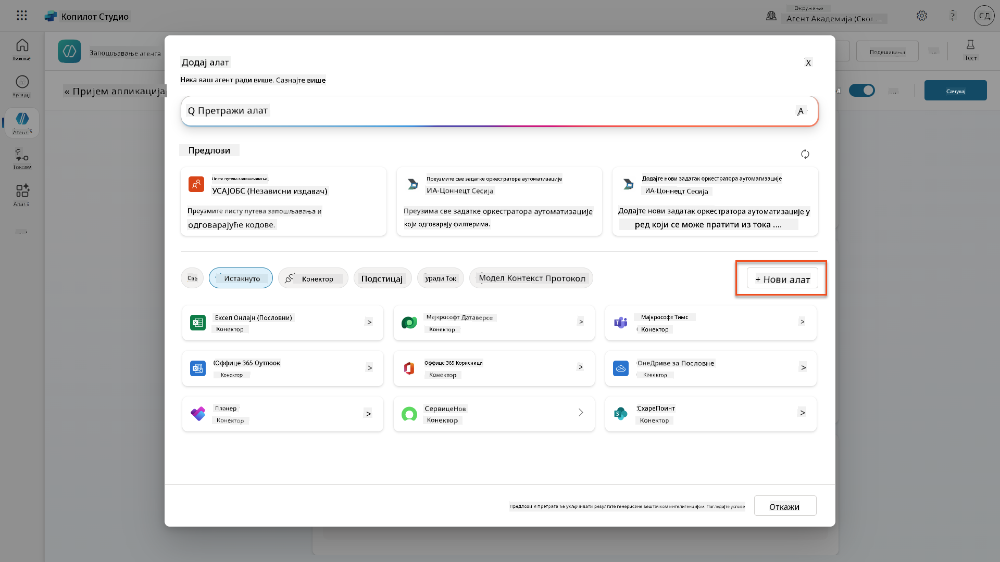

1. Izaberite **Agent flow**.
    Otvoriće se dizajner Agent Flow, gde ćemo dodati logiku za otpremanje CV-a.  
    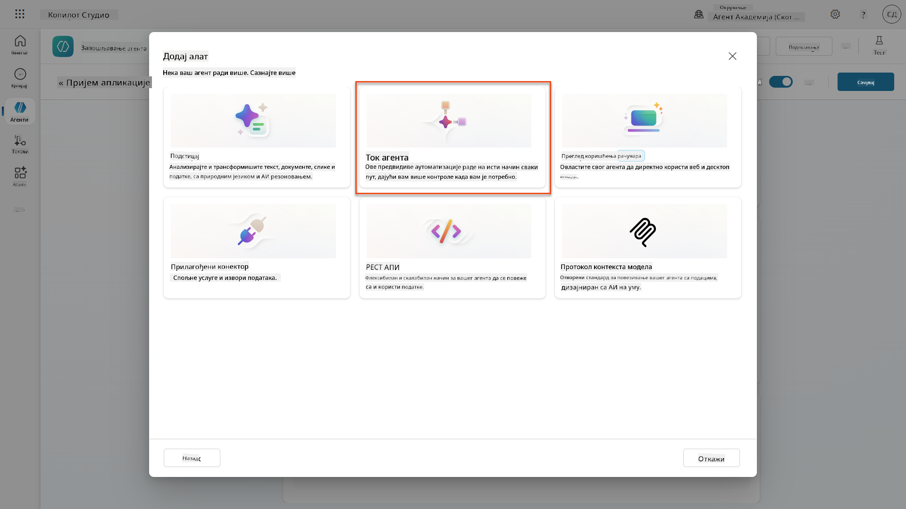

1. Izaberite čvor **Kada agent pozove tok**, i izaberite **+ Dodaj** ulaz za sledeće parametre, vodeći računa da dodate i ime i opis.

    | Tip  | Ime       | Opis                                                                                                   |
    |------|-----------|-------------------------------------------------------------------------------------------------------|
    | Fajl | CV        | PDF fajl CV-a                                                                                         |
    | Tekst| Poruka    | Izvucite poruku u stilu propratnog pisma iz konteksta. Poruka mora biti kraća od 2000 karaktera.       |
    | Tekst| EmailKorisnika | Email adresa sa koje je CV poslat. Ovo će biti korisnik koji otprema CV u četu, ili email adresa pošiljaoca ako je primljeno putem emaila. |

    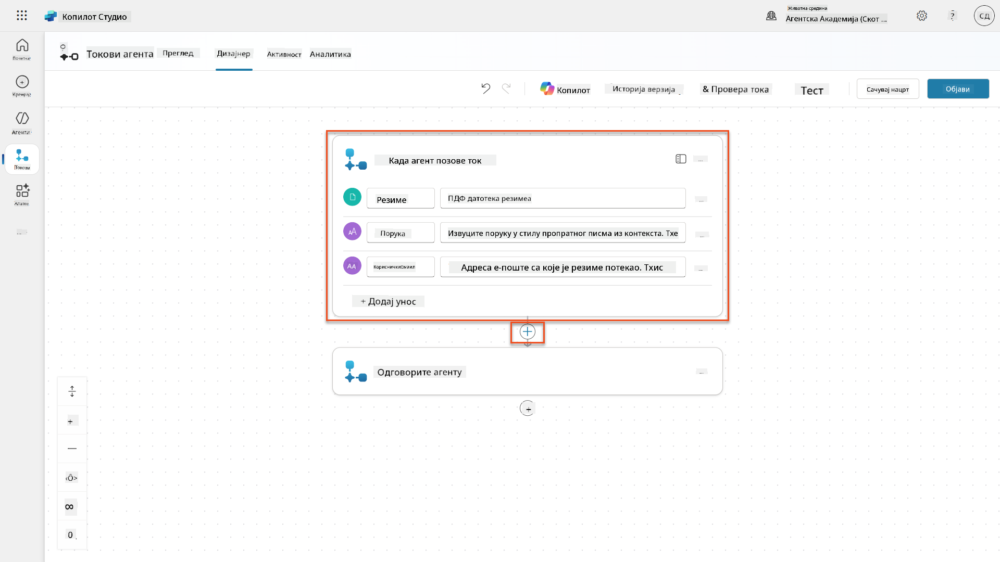

1. Izaberite **+ ikonu** ispod čvora za pokretanje, potražite `Dataverse`, izaberite **Vidi više** pored Microsoft Dataverse, a zatim izaberite akciju **Dodaj novi red** u odeljku **Microsoft Dataverse**  
    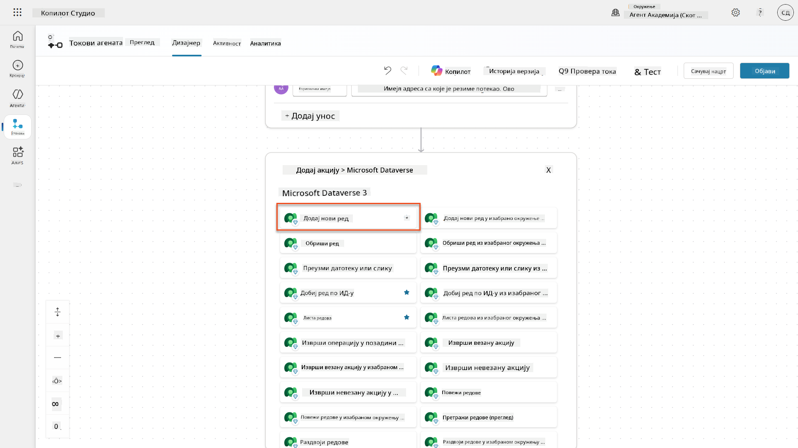

1. Nazovite čvor **Kreiraj CV**, tako što ćete izabrati **tri tačke(...)**, i izabrati **Preimenuj**  
    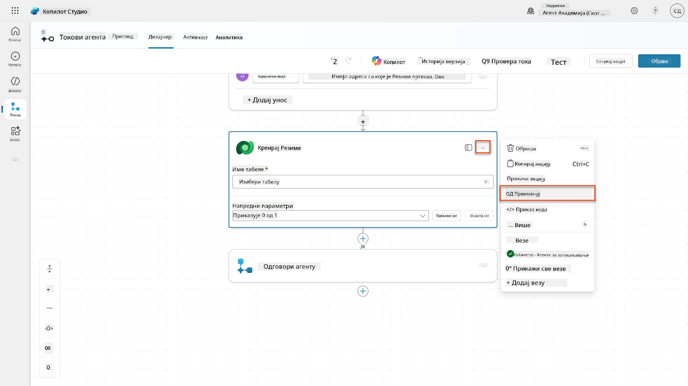

1. Postavite **Ime tabele** na **CV-ovi**, zatim izaberite **Prikaži sve**, da biste prikazali sve parametre.

1. Postavite sledeće **svojstva**:

    | Svojstvo               | Kako postaviti                 | Detalji / Izraz                                              |
    |------------------------|--------------------------------|--------------------------------------------------------------|
    | **Naslov CV-a**        | Dinamički podaci (ikona munje) | **Kada agent pozove tok** → **Ime CV-a**    Ako ne vidite ime CV-a, uverite se da ste prethodno konfigurisali parametar CV kao tip podataka. |
    | **Propratno pismo**    | Izraz (ikona fx)               | `if(greater(length(triggerBody()?['text']), 2000), substring(triggerBody()?['text'], 0, 2000), triggerBody()?['text'])` |
    | **Email adresa izvora**| Dinamički podaci (ikona munje) | **Kada agent pozove tok** → **EmailKorisnika**               |
    | **Datum otpremanja**   | Izraz (ikona fx)               | `utcNow()`                                                   |

    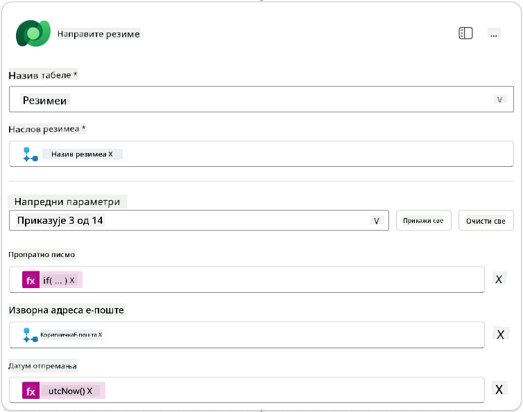

1. Izaberite **+ ikonu** ispod čvora Kreiraj CV, potražite `Dataverse`, izaberite **Vidi više** pored Microsoft Dataverse, a zatim izaberite akciju **Otpremi fajl ili sliku**.
   **Važno:** Vodite računa da ne izaberete akciju Otpremi fajl ili sliku u izabrano okruženje.

1. Nazovite čvor **Otpremi CV fajl**, tako što ćete izabrati **tri tačke(...)**, i izabrati **Preimenuj**

1. Postavite sledeća **svojstva**:

     | Svojstvo | Kako postaviti | Detalji |
     |----------|----------------|---------|
     | **Ime sadržaja** | Dinamički podaci (ikona munje) | Kada agent pozove tok → Ime CV-a |
     | **Ime tabele** | Izaberite | CV-ovi |
     | **ID reda** | Dinamički podaci (ikona munje) | Kreiraj CV → Vidi više → CV |
     | **Ime kolone** | Izaberite | PDF CV |
     | **Sadržaj** | Dinamički podaci (ikona munje) | Kada agent pozove tok → contentBytes CV-a |

     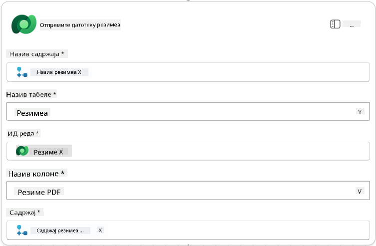

1. Izaberite čvor **Odgovori agentu**, a zatim izaberite **+ Dodaj izlaz**

     | Svojstvo | Kako postaviti | Detalji |
     |----------|----------------|---------|
     | **Tip** | Izaberite | `Tekst` |
     | **Ime** | Unesite | `BrojCV-a` |
     | **Vrednost** | Dinamički podaci (ikona munje) | Kreiraj CV → Vidi više → Broj CV-a |
     | **Opis** | Unesite | `Broj [BrojCV-a] kreiranog CV-a` |

     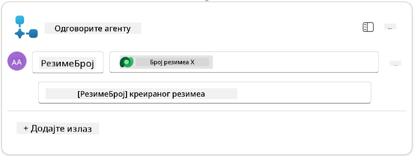

1. Izaberite **Sačuvaj nacrt** u gornjem desnom uglu  
     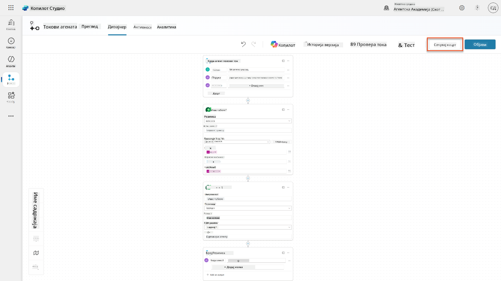

1. Izaberite karticu **Pregled**, izaberite **Izmeni** na panelu **Detalji**

     1. **Ime toka**:`Otpremanje CV-a`
     1. **Opis**:`Otprema CV kada se zatraži`

     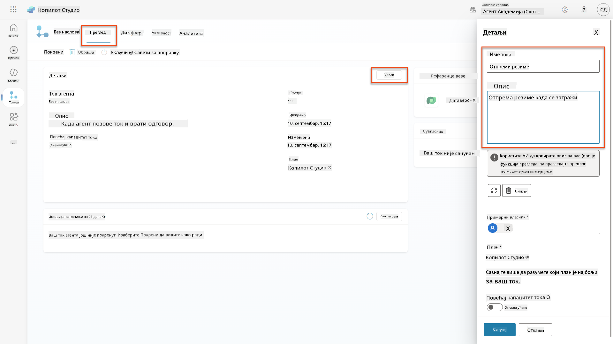

1. Ponovo izaberite karticu **Dizajner**, i izaberite **Objavi**.  
     

### 2.1.5 Povežite tok sa svojim agentom

Sada ćete povezati objavljeni tok sa svojim Application Intake Agent-om.

1. Vratite se na **Hiring Agent** i izaberite karticu **Agenti**. Otvorite **Application Intake Agent**, a zatim pronađite panel **Alati**.  
    

1. Izaberite **+ Dodaj**

1. Izaberite filter **Tok**, i potražite `Otpremanje CV-a`. Izaberite tok **Otpremanje CV-a**, a zatim **Dodaj i konfiguriši**.

1. Postavite sledeće parametre:

    | Parametar | Vrednost |
    |-----------|----------|
    | **Opis** | `Otprema CV kada se zatraži. STROGO PRAVILO: Pozvati ovaj alat samo kada se referencira u formi "Otpremanje CV-a" i kada postoje Prilozi` |
    | **Dodatni detalji → Kada se ovaj alat može koristiti** | `samo kada se referencira od strane tema ili agenata` |
    | **Ulazi → Dodaj ulaz** | `contentBytes` |
    | **Ulazi → Dodaj ulaz** | `name` |

    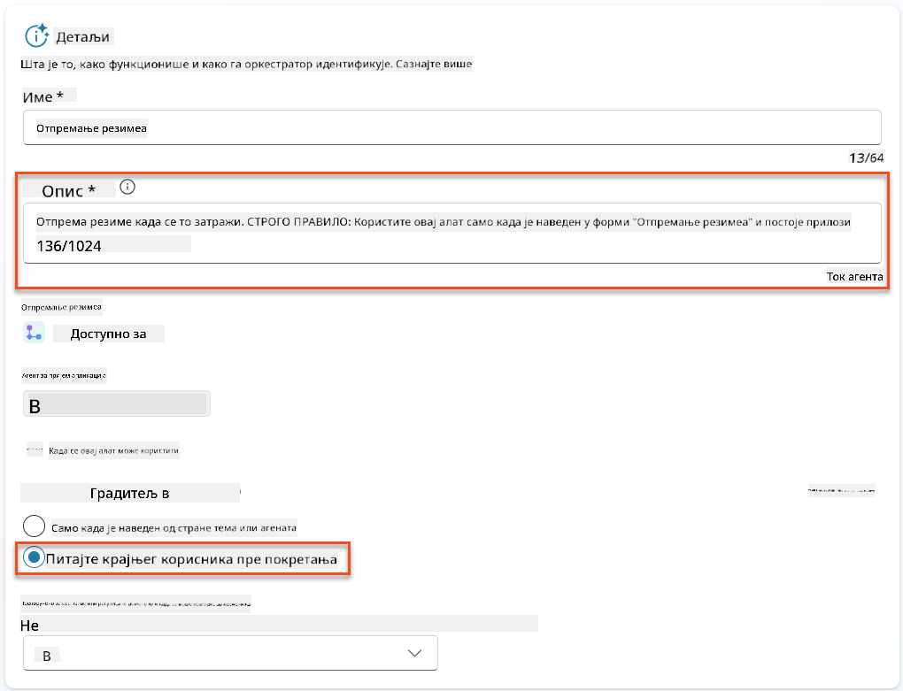

    

1. Zatim postavite svojstva ulaza na sledeći način:

    | Parametar ulaza | Svojstvo | Detalji |
    |-----------------|----------|---------|
    | **contentBytes** | Popuni koristeći | Prilagođena vrednost |
    |                  | Vrednost (...→Formula→Umetni) | `First(System.Activity.Attachments).Content` |
    | **name** | Popuni koristeći | Prilagođena vrednost |
    |          | Vrednost (...→Formula→Umetni) | `First(System.Activity.Attachments).Name` |
    | **Poruka** | Prilagodi | Konfiguriši prilagođena podešavanja |
    |             | Opis | `Izvucite poruku u stilu propratnog pisma iz konteksta. Vodite računa da nikada ne tražite od korisnika i kreirajte makar minimalno propratno pismo iz dostupnog konteksta. STROGO PRAVILO - poruka mora biti kraća od 2000 karaktera.` |
    |             | Koliko puta ponoviti | Ne ponavljaj |
    |             | Akcija ako entitet nije pronađen | Postavi promenljivu na vrednost |
    |             | Podrazumevana vrednost entiteta | Otpremanje CV-a |
    | **EmailKorisnika** | Popuni koristeći | Prilagođena vrednost |
    |  | Vrednost (...→Formula→Umetni) | `System.User.Email` |

    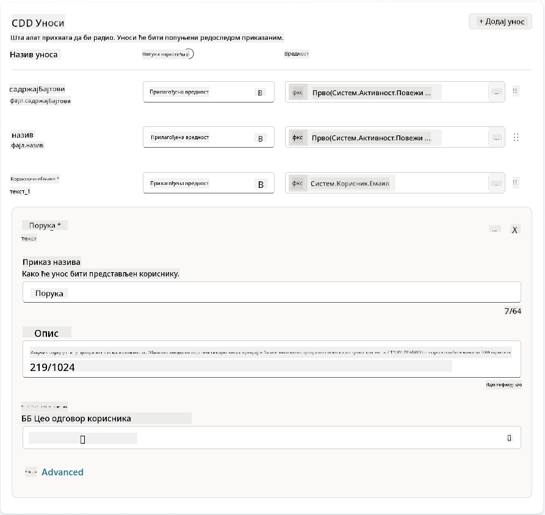

1. Izaberite **Sačuvaj**

### 2.1.6 Definišite instrukcije za agenta

1. Vratite se u **Application Intake Agent** tako što ćete izabrati karticu **Agenti**, a zatim pronađite panel **Instrukcije**.

1. U polje **Instrukcije**, nalepite sledeće jasne smernice za vašeg podređenog agenta:

    ```text
    You are tasked with managing incoming Resumes, Candidate information, and creating Job Applications.  
    Only use tools if the step exactly matches the defined process. Otherwise, indicate you cannot help.  
    
    Process for Resume Upload via Chat  
    1. Upload Resume  
      - Trigger only if /System.Activity.Attachments contains exactly one new resume.  
      - If more than one file, instruct the user to upload one at a time and stop.  
      - Call /Upload Resume once. Never upload more than once for the same message.  
    
    2. Post-Upload  
      - Always output the [ResumeNumber] (R#####).  
    ```

1. Gde instrukcije uključuju kosu crtu (/), izaberite tekst koji sledi nakon / i izaberite rešeno ime. Uradite ovo za:

    - `System.Activity.Attachments` (Promenljiva)
    - `Otpremanje CV-a` (Alat)

    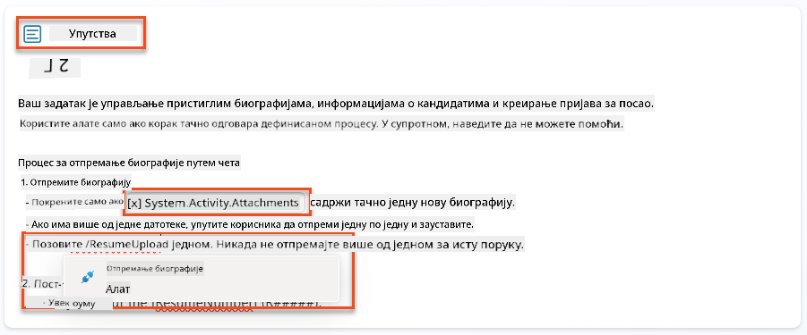

1. Izaberite **Sačuvaj**

### 2.1.7 Testirajte svog Application Intake Agent-a

Sada ćemo proveriti da li vaš prvi član orkestra radi ispravno.

1. **Preuzmite** [testne CV-ove.](https://download-directory.github.io/?url=https://github.com/microsoft/agent-academy/tree/main/operative/sample-data/resumes&filename=operative_sampledata)

1. **Otvorite** test panel tako što ćete izabrati **Test**.

1. **Otpremite** dva CV-a u test četu, i unesite poruku `Obradi ove CV-ove`

    - Agent bi trebalo da vrati poruku sličnu *Može se otpremiti samo jedan CV odjednom. Molimo vas da otpremite jedan CV da biste nastavili.*

    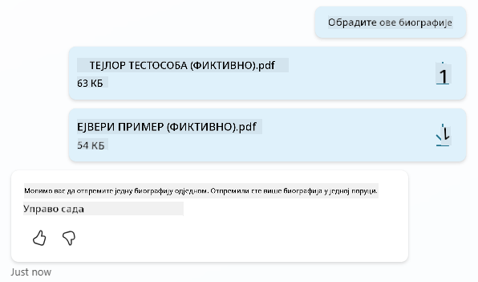

1. Pokušajte da otpremite **samo jedan CV**, sa porukom `Obradi ovaj CV`

    - Agent bi tada trebalo da vrati poruku sličnu *CV za Avery Example je uspešno otpremljen. Broj CV-a je R10026.*

1. Na **mapi aktivnosti**, trebalo bi da vidite kako **Application Intake Agent** obrađuje otpremanje CV-a.  
    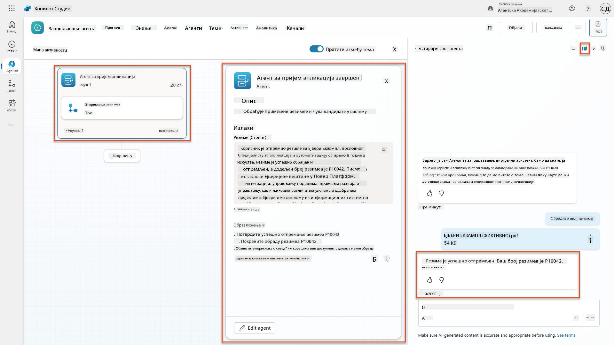

1. Idite na make.powerapps.com → Uverite se da je vaše okruženje izabrano u gornjem desnom uglu birača okruženja.

1. Izaberite **Aplikacije** → Hiring Hub → meni sa tri tačke(...) → **Pokreni**  
    

    Napomena: Ako je dugme za pokretanje sivo, to znači da niste objavili svoje rešenje iz Misije 01. Izaberite **Rešenja** → **Objavi sve prilagođavanja**.

1. Idite na **CV-ovi**, i proverite da li je fajl CV-a otpremljen i propratno pismo postavljeno u skladu s tim.  
    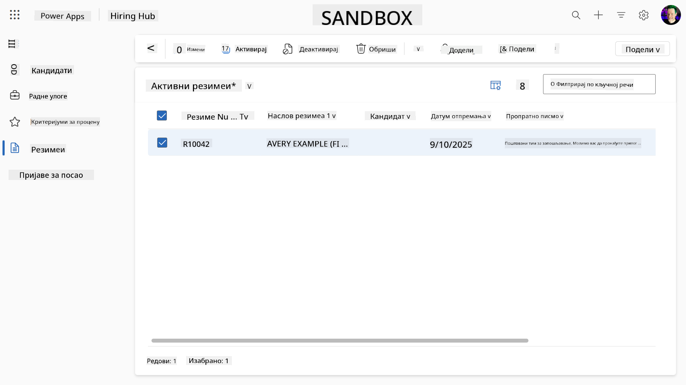

## 🧪Laboratorija 2.2: Dodavanje povezanog agenta za pripremu intervjua

Sada ćemo kreirati našeg povezanog agenta za pripremu intervjua i dodati ga vašem postojećem Hiring Agent-u.

### 2.2.1 Kreirajte povezanog agenta za intervju

1. **Idite** na Copilot Studio. Uverite se da je vaše okruženje i dalje izabrano u gornjem desnom uglu birača okruženja.

1. Otvorite svog **Hiring Agent-a**

1. Idite na karticu Agent, i izaberite **+ Dodaj agenta**

1. Izaberite **Poveži postojećeg agenta** → **Copilot Studio**

1. Izaberite **+ Novi agent**

### 2.2.2 Konfigurišite osnovna podešavanja

1. Izaberite karticu **Konfiguriši**, i unesite sledeća svojstva:

    - **Ime**: `Agent za intervju`
    - **Opis**: `Pomaže u procesu intervjua.`

1. Instrukcije:

    ```text
    You are the Interview Agent. You help interviewers and hiring managers prepare for interviews. You never contact candidates. 
    Use Knowledge to help with interview preparation. 
    
    The only valid identifiers are:
      - ResumeNumber (ppa_resumenumber)→ format R#####
      - CandidateNumber (ppa_candidatenumber)→ format C#####
      - ApplicationNumber (ppa_applicationnumber)→ format A#####
      - JobRoleNumber (ppa_jobrolenumber)→ format J#####
    
    Examples you handle
      - Give me a summary of ...
      - Help me prepare to interview candidates for the Power Platform Developer role
      - Create interview assistance for the candidates for Power Platform Developer
      - Give targeted questions for Candidate Alex Johnson focusing on the criteria for the Job Application
      
    How to work:
        You are expected to ask clarification questions if required information for queries is not provided
        - If asked for interview help without providing a job role, ask for it
        - If asking for interview questions, ask for the candidate and job role if not provided.
    
    General behavior
    - Do not invent or guess facts
    - Be concise, professional, and evidence-based
    - Map strengths and risks to the highest-weight criteria
    - If data is missing (e.g., no resume), state what is missing and ask for clarification
    - Never address or message a candidate
    ```

1. Prebacite **Pretragu na internetu** na **Onemogućeno**

1. Izaberite **Kreiraj**  
    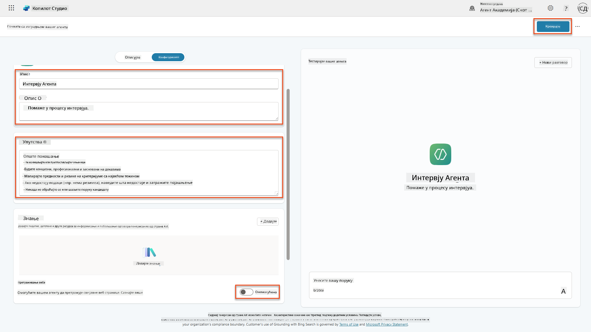

### 2.2.3 Konfigurišite pristup podacima i objavite

1. U odeljku **Znanje**, izaberite **+ Dodaj znanje**  
    
1. Izaberite **Dataverse**  
    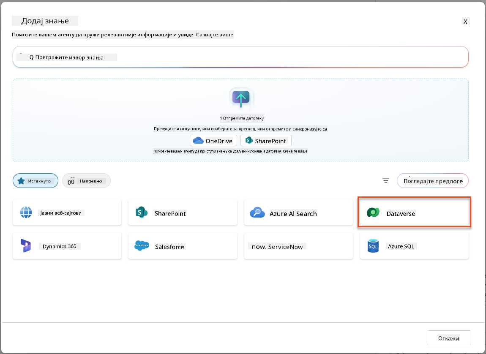
1. U polju za pretragu, unesite `ppa_`. Ovo je prefiks za tabele koje ste prethodno uvezli.
1. **Izaberite** svih 5 tabela (Kandidat, Kriterijumi za evaluaciju, Prijava za posao, Radno mesto, CV)
1. Izaberite **Dodaj agentu**  
    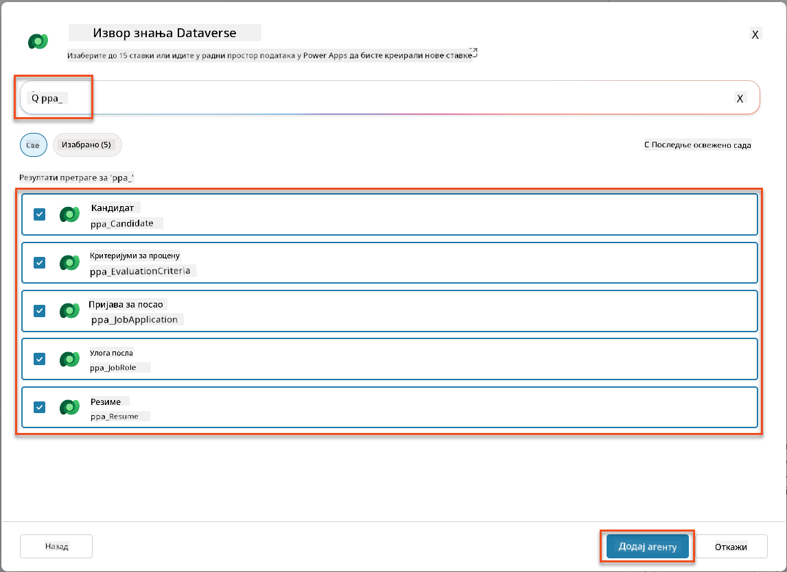
1. Izaberite **Podešavanja**, na Agentu za intervju, i postavite sledeća podešavanja:

    - **Dozvoli drugim agentima da se povežu i koriste ovog:** `Uključeno`
    - **Koristi opšte znanje**: `Isključeno`
    - **Otpremanje fajlova**: `Isključeno`
    - **Nivo moderacije sadržaja:** `Srednji`
1. Izaberite **Sačuvaj**
1. Izaberite **Objavi**, i sačekajte da se objavljivanje završi.

### 2.2.4 Povežite agenta za pripremu intervjua sa vašim Hiring Agent-om

1. Vratite se na svog **Hiring Agent-a**

1. Izaberite karticu **Agenti**

1. Koristite **+Dodaj agenta** → **Copilot Studio**, da dodate **Agenta za intervju**. Postavite opis na:
    ```text
    Assists with the interview process and provides information about Resumes, Candidates, Job Roles, and Evaluation Criteria.
    ```

    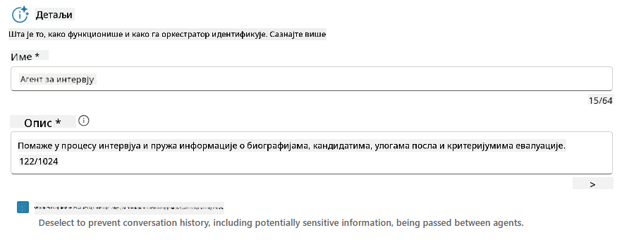
    Приметите да је опција Pass conversation history to this agent означена. Ово омогућава главном агенту да пружи комплетан контекст повезаном агенту.

1. Изаберите **Add agent**

1. Уверите се да видите и **Application Intake Agent** и **Interview Agent**. Приметите како је један дете агент, а други повезани агент.  
    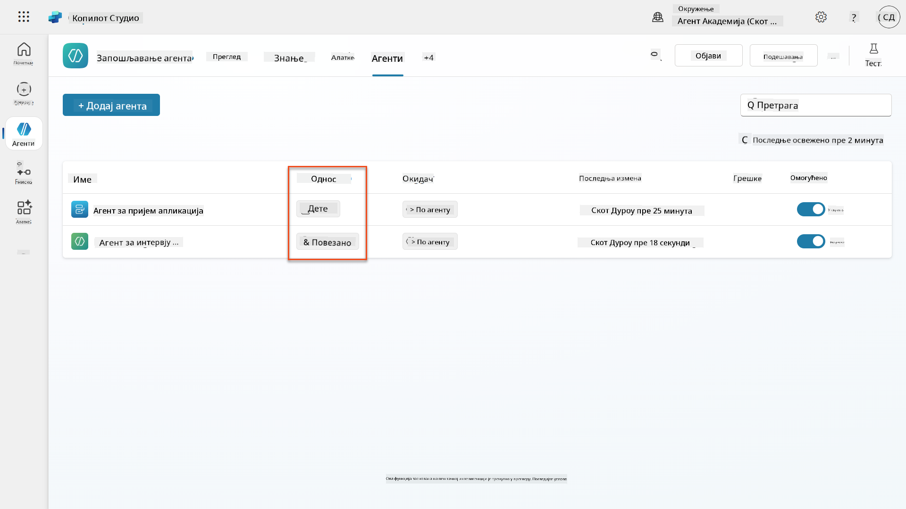

### 2.2.5 Тестирање сарадње више агената

1. **Отворите** панел за тестирање тако што ћете изабрати **Test**.

1. **Отпремите** један од тестних резимеа и унесите следећи опис који говори главном агенту шта може да делегира повезаном агенту:

    ```text
    Upload this resume, then show me open job roles, each with a description of the evaluation criteria, then use this to match the resume to at least one suitable job role even if not a perfect match.
    ```

    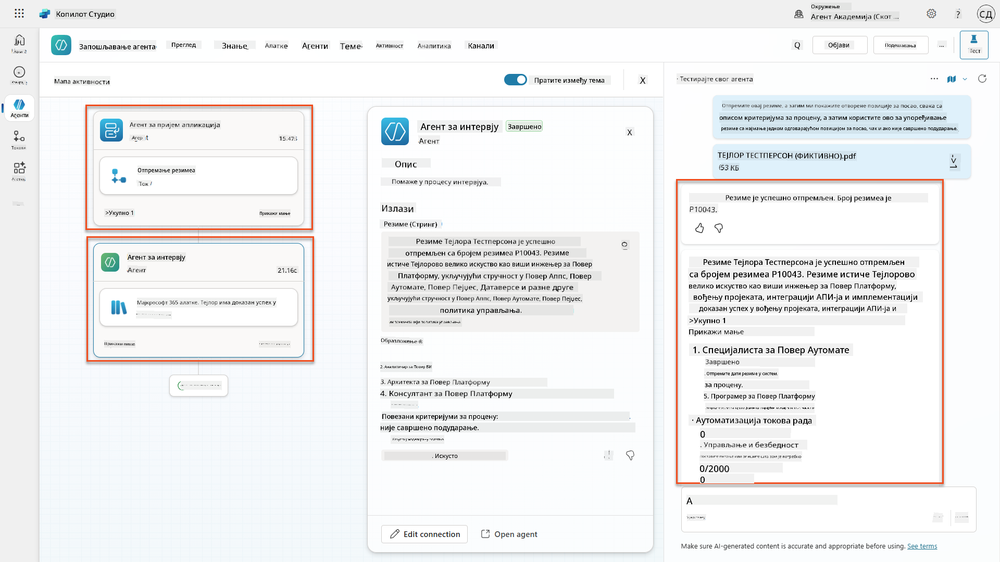

1. Приметите како је Hiring Agent делегирао отпремање дете агенту, а затим затражио од Interview Agent-а да пружи резиме и подударност са радним местом користећи своје знање.  
   Испробајте различите начине постављања питања о резимеима, радним местима и критеријумима за процену.  
   **Примери:**

    ```text
    Give me a summary of active resumes
    ```

    ```text
    Summarize resume R10044
    ```

    ```text
    Which active resumes are suitable for the Power Platform Developer role?
    ```

## 🎉 Мисија завршена

Одличан посао, Агенте! **Операција Симфонија** је сада завршена. Успешно сте трансформисали свог једноставног Hiring Agent-а у софистицирану оркестрацију више агената са специјализованим способностима.

Ево шта сте постигли у овој мисији:

**✅ Мајсторство архитектуре више агената**  
Сада разумете када да користите дете агенте у односу на повезане агенте и како да дизајнирате системе који се могу проширити.

**✅ Дете агент за пријем апликација**  
Додали сте специјализованог дете агента свом Hiring Agent-у који обрађује резимее, извлачи податке о кандидатима и чува информације у Dataverse.

**✅ Повезани агент за припрему интервјуа**  
Направили сте поново употребљивог повезаног агента за припрему интервјуа и успешно га повезали са својим Hiring Agent-ом.

**✅ Комуникација агената**  
Видели сте како ваш главни агент може да координира са специјалистичким агентима, дели контекст и оркестрира сложене токове рада.

**✅ Основа за аутономију**  
Ваш побољшани систем за запошљавање сада је спреман за напредне функције које ћемо додати у наредним мисијама: аутономне тригере, модерацију садржаја и дубоко резоновање.

🚀**Шта следи:** У вашој следећој мисији, научићете како да конфигуришете свог агента да аутономно обрађује резимее из е-поште!

⏩[Прелазак на Мисију 03: Аутоматизујте свог агента помоћу тригера](../03-automate-triggers/README.md)

## 📚 Тактички ресурси

📖 [Додајте друге агенте (преглед)](https://learn.microsoft.com/microsoft-copilot-studio/authoring-add-other-agents?WT.mc_id=power-182762-scottdurow)

📖 [Додајте алате прилагођеним агентима](https://learn.microsoft.com/microsoft-copilot-studio/advanced-plugin-actions?WT.mc_id=power-182762-scottdurow)

📖 [Рад са Dataverse у Copilot Studio](https://learn.microsoft.com/microsoft-copilot-studio/knowledge-add-dataverse?WT.mc_id=power-182762-scottdurow)

📖 [Преглед токова агената](https://learn.microsoft.com/microsoft-copilot-studio/flows-overview?WT.mc_id=power-182762-scottdurow)

📖 [Креирајте решење](https://learn.microsoft.com/power-platform/alm/solution-concepts-alm?WT.mc_id=power-182762-scottdurow)

📖 [Водич за ALM решења у Power Platform](https://learn.microsoft.com/power-platform/alm/overview-alm?WT.mc_id=power-182762-scottdurow)

📺 [Сарадња агената у Copilot Studio](https://youtu.be/d-oD3pApHAg?si=rwIHKhJTkjSvhTHw)

---

**Одрицање од одговорности**:  
Овај документ је преведен помоћу услуге за превођење вештачке интелигенције [Co-op Translator](https://github.com/Azure/co-op-translator). Иако настојимо да обезбедимо тачност, молимо вас да имате у виду да аутоматски преводи могу садржати грешке или нетачности. Оригинални документ на његовом изворном језику треба сматрати меродавним извором. За критичне информације препоручује се професионални превод од стране људи. Не преузимамо одговорност за било каква погрешна тумачења или неспоразуме који могу настати услед коришћења овог превода.