<!--
CO_OP_TRANSLATOR_METADATA:
{
  "original_hash": "616d142d4fb5f45d2a168fad6c1f9545",
  "translation_date": "2025-10-20T23:02:17+00:00",
  "source_file": "docs/operative-preview/07-multimodal-prompts/README.md",
  "language_code": "sr"
}
-->
# 🚨 Мисија 07: Извлачење садржаја из биографија помоћу мултимодалних упита

--8<-- "disclaimer.md"

## 🕵️‍♂️ КОДНО ИМЕ: `ДОКУМЕНТ БИОГРАФИЈА РЕКОН`

> **⏱️ Време операције:** `~45 минута`

## 🎯 Опис мисије

Добродошли, оперативче. Ваше претходне мисије су вас опремиле моћним вештинама оркестрације агената, али сада је време да откључате способност која мења правила игре: **анализа мултимодалних докумената**.

Ваш задатак, ако га прихватите, је **Документ Биографија Рекон** - прецизно извлачење структурираних података из било ког документа. Иако ваши агенти лако обрађују текст, стварни свет захтева свакодневно руковање PDF-овима, сликама и сложеним документима. Биографије се гомилају, фактуре треба обрадити, а обрасци захтевају тренутну дигитализацију.

Ова мисија ће вас трансформисати из градитеља агената који раде само са текстом у **мултимодалног стручњака**. Научићете како да конфигуришете AI који чита и разуме документе као људски аналитичар - али са брзином и конзистентношћу AI-а. До краја мисије, изградићете комплетан систем за извлачење биографија који се интегрише у ваш процес запошљавања.

Технике које овде научите биће од суштинског значаја за напредне операције засноване на подацима у вашој следећој мисији.

## 🔎 Циљеви

У овој мисији ћете научити:

1. Шта су мултимодални упити и када користити различите AI моделе
1. Како конфигурисати упите са улазима у облику слика и докумената
1. Како форматирати излазе упита као JSON за извлачење структурираних података
1. Најбоље праксе за инжењеринг упита у анализи докумената
1. Како интегрисати мултимодалне упите са Agent Flows

## 🧠 Разумевање мултимодалних упита

### Шта чини упит "мултимодалним"?

Традиционални упити раде само са текстом. Али мултимодални упити могу обрађивати више типова садржаја:

- **Текст**: Писане инструкције и садржај
- **Слике**: Фотографије, снимци екрана, графикони и дијаграми (.PNG, .JPG, .JPEG)  
- **Документи**: Фактуре, биографије, обрасци (.PDF)

Ова способност отвара моћне сценарије као што су анализа биографија, обрада фактура или извлачење података из образаца.

### Зашто је мултимодалност важна за ваше радне процесе

Свакодневно се ваша организација суочава са изазовима у обради докумената:

- **Преглед биографија**: Ручно читање стотина биографија одузима драгоцено време
- **Обрада фактура**: Извлачење података о добављачима, износа и датума из различитих формата докумената
- **Анализа образаца**: Претварање папирних образаца у дигиталне податке

Мултимодални упити елиминишу ове препреке комбинујући разумевање језика AI-а са способностима визуелне анализе. Ово даје вашем AI-у могућност да обрађује документе једнако ефикасно као и текст.

### Уобичајени пословни сценарији

Ево неких примера како се мултимодални упити могу применити:

| Сценарио                | Задатак                                                                                                                                      | Пример излазних поља                                                                                   |
|-------------------------|-------------------------------------------------------------------------------------------------------------------------------------------|---------------------------------------------------------------------------------------------------------|
| **Преглед биографија**    | Извлачење имена кандидата, е-поште, телефона, тренутне позиције, година искуства и кључних вештина.                                                 | Име кандидата, адреса е-поште, број телефона, тренутна позиција, године искуства, кључне вештине         |
| **Обрада фактура**  | Извлачење информација о добављачу, датума фактуре, укупног износа и ставки фактуре.                                                 | Име добављача, датум фактуре, укупан износ, ставке фактуре                                             |
| **Анализа образаца**       | Анализа овог обрасца за пријаву и извлачење свих попуњених поља.                                                                              | Назив поља (нпр. Име кандидата), Унети податак (нпр. Јован Јовановић), ...                                  |
| **Верификација личних докумената** | Извлачење имена, броја личне карте, датума истека и адресе из овог личног документа. Проверите да ли је сав текст јасно читљив и означите све нејасне делове. | Пуно име, број личне карте, датум истека, адреса, ознака за нејасне делове                        |

## ⚙️ Избор модела у AI Builder-у

AI Builder нуди различите моделе оптимизоване за специфичне задатке. Разумевање који модел користити је кључно за успех.

!!! note "Тачно од септембра 2025."
    Модели AI Builder-а се редовно ажурирају, па проверите најновију [документацију о подешавањима модела AI Builder-а](https://learn.microsoft.com/ai-builder/prompt-modelsettings) за тренутну доступност модела.

### Поређење модела

Сви следећи модели подржавају обраду слика и докумената

| Модел | 💰Цена | ⚡Брзина | ✅Најбоље за |
|-------|------|-------|----------|
| **GPT-4.1 mini** | Основни (најисплативији) | Брз | Стандардна обрада докумената, сумирање, пројекти са ограниченим буџетом |
| **GPT-4.1** | Стандардни | Умерен | Сложени документи, напредно креирање садржаја, потребе за високом прецизношћу |
| **o3** | Премијум | Спор (прво разматрање) | Анализа података, критичко размишљање, софистицирано решавање проблема |
| **GPT-5 chat** | Стандардни | Побољшан | Најновије разумевање докумената, највећа прецизност одговора |
| **GPT-5 reasoning** | Премијум | Спор (сложена анализа) | Најсофистициранија анализа, планирање, напредно размишљање |

### Објашњење подешавања температуре

Температура контролише колико су одговори вашег AI-а креативни или предвидљиви:

- **Температура 0**: Најпредвидљивији, конзистентни резултати (најбоље за извлачење података)
- **Температура 0.5**: Баланс између креативности и конзистентности  
- **Температура 1**: Максимална креативност (најбоље за креирање садржаја)

За анализу докумената, користите **температуру 0** како бисте осигурали конзистентно извлачење података.

## 📊 Формати излаза: Текст vs JSON

Избор правог формата излаза је кључан за даљу обраду.

### Када користити текстуални излаз

Текстуални излаз добро функционише за:

- Резиме који је читљив за људе
- Једноставне класификације
- Садржај који не захтева структурисану обраду

### Када користити JSON излаз

JSON излаз је неопходан за:

- Извлачење структурисаних података
- Интеграцију са базама података или системима
- Обраду у Power Automate токовима
- Конзистентно мапирање поља

### Најбоље праксе за JSON

1. **Дефинишите јасна имена поља**: Користите описна, конзистентна имена
1. **Обезбедите примере**: Укључите пример излаза и вредности за свако поље
1. **Наведите типове података**: Укључите примере за датуме, бројеве и текст
1. **Решите проблеме са недостајућим подацима**: Планирајте за null или празне вредности
1. **Потврдите структуру**: Тестирајте са различитим типовима докумената

### Разматрања о квалитету докумената

- **Резолуција**: Осигурајте да су слике јасне и читљиве
- **Оријентација**: Ротирајте документе у правилан положај пре обраде
- **Подршка за формат**: Тестирајте са вашим специфичним типовима докумената (PDF, JPG, PNG)
- **Ограничења величине**: Будите свесни ограничења величине датотека у вашем окружењу

### Оптимизација перформанси

- **Изаберите одговарајуће моделе**: Надоградите моделе само када је то потребно
- **Оптимизујте упите**: Често краће, јасније инструкције дају боље резултате
- **Руковање грешкама**: Планирајте за документе који не могу бити обрађени
- **Пратите трошкове**: Различити модели троше различите количине AI Builder кредита

## 🧪 Лабораторија 7: Изградња система за извлачење биографија

Време је да примените своје знање о мултимодалности у пракси. Изградићете свеобухватан систем за извлачење биографија који анализира документе кандидата и претвара их у структурисане податке за ваш процес запошљавања.

### Предуслови за завршетак мисије

1. Потребно је да **или**:

    - **Завршите Мисију 06** и имате спреман свој систем за запошљавање са више агената, **ИЛИ**
    - **Увезете почетно решење за Мисију 07** ако почињете од почетка или треба да надокнадите. [Преузмите почетно решење за Мисију 07](https://aka.ms/agent-academy)

1. Пример докумената биографија са [Тест биографије](https://download-directory.github.io/?url=https://github.com/microsoft/agent-academy/tree/main/operative/sample-data/resumes&filename=operative_sampledata)

!!! note "Увоз решења и пример података"
    Ако користите почетно решење, погледајте [Мисију 01](../01-get-started/README.md) за детаљна упутства о томе како да увезете решења и пример података у ваше окружење.

### 7.1 Креирање мултимодалног упита

Ваш први циљ: креирајте упит способан да анализира документе биографија и извуче структурисане податке.

1. Пријавите се на [Copilot Studio](https://copilotstudio.microsoft.com) и изаберите **Tools** из левог менија.

1. Изаберите **+ New tool**, затим изаберите **Prompt**.  
    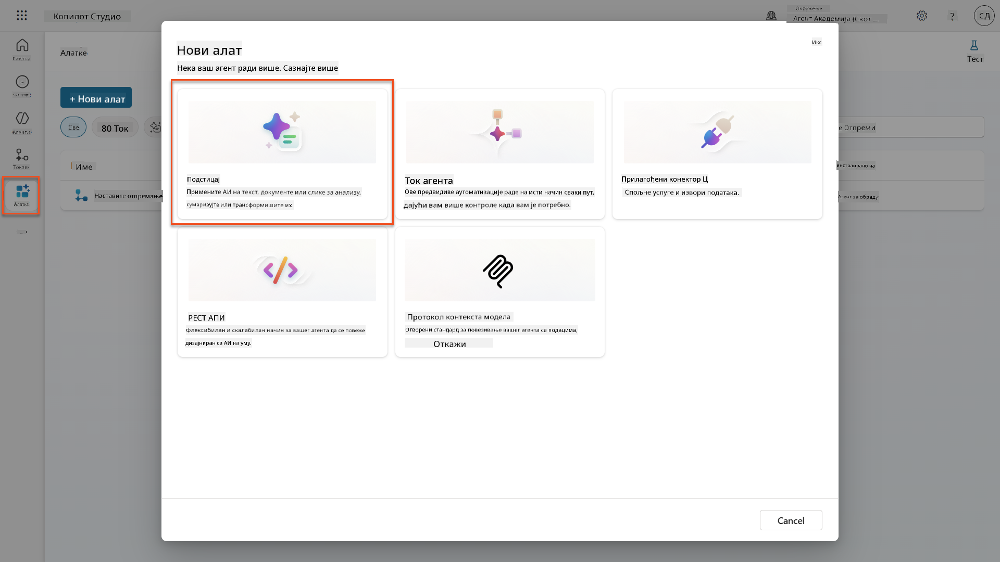

1. **Преименујте** упит из подразумеваног назива са временским жигом (нпр. *Custom prompt 09/04/2025, 04:59:11 PM*) у `Summarize Resume`.

1. У пољу за инструкције, додајте овај упит:

    ```text
    You are tasked with extracting key candidate information from a resume and cover letter to facilitate matching with open job roles and creating a summary for application review.
    
    Instructions:
    1. Extract Candidate Details:
        - Identify and extract the candidate’s full name.
        - Extract contact information, specifically the email address.
    2. Create Candidate Summary:
        - Summarize the candidate’s profile as multiline text (max 2000 characters) with the following sections:
            - Candidate name
            - Role(s) applied for if present
            - Contact and location
            - One-paragraph summary
            - Experience snapshot (last 2–3 roles with outcomes)
            - Key projects (1–3 with metrics)
            - Education and certifications
            - Top skills (Top 10)
            - Availability and work authorization
    
    Guidelines:
    - Extract information only from the provided resume and cover letter documents.
    - Ensure accuracy in identifying all details such as contact details and skills.
    - The summary should be concise but informative, suitable for quick application review.
    
    Resume: /document
    CoverLetter: /text
    ```

    !!! tip "Користите помоћ Copilot-а"
        Можете користити "Get started with Copilot" да генеришете свој упит користећи природни језик. Покушајте да замолите Copilot да креира упит за сумирање биографије!

1. **Конфигуришите** улазне параметре:

    | Параметар | Тип | Назив | Пример података |
    |-----------|------|------|-------------|
    | Биографија | Слика или документ | Биографија | Отпремите пример биографије из фасцикле са тест-подацима |
    | Пропратно писмо | Текст | Пропратно писмо | Ово је биографија! |

1. Изаберите **Test** да бисте видели почетни текстуални излаз из вашег упита.  
    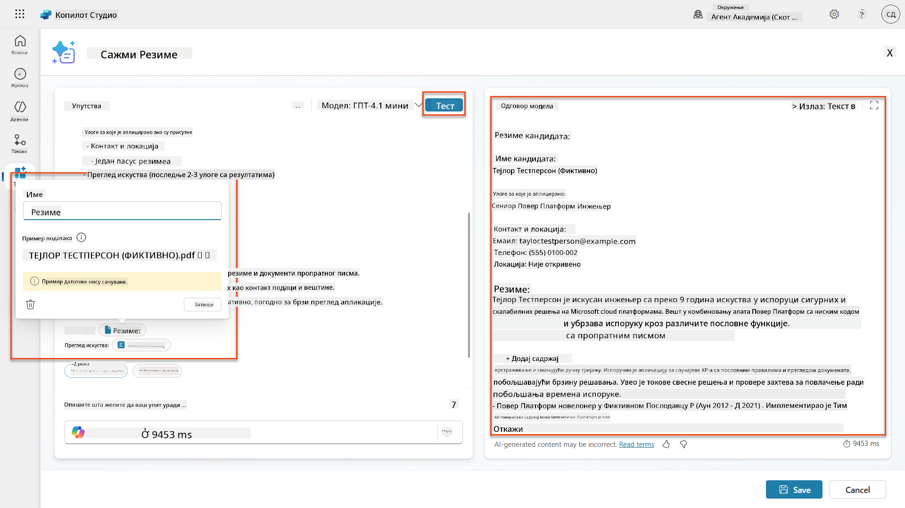

### 7.2 Конфигурисање JSON излаза

Сада ћете претворити упит да излази структуриране JSON податке уместо обичног текста.

1. Додајте ову спецификацију JSON формата на крај инструкција вашег упита:

    ```text
    Output Format:
    Provide the output in valid JSON format with the following structure:
    
    {
        "CandidateName": "string",
        "Email": "string",
        "Summary": "string max 2000 characters",
        "Skills": [ {"item": "Skill 1"}, {"item": "Skill 2"}],
        "Experience": [ {"item": "Experience 1"}, {"item": "Experience 2"}],
    }
    ```

1. Промените подешавање **Output** са "Text" на **JSON**.

1. Поново изаберите **Test** да бисте проверили да ли је излаз сада форматиран као JSON.  
    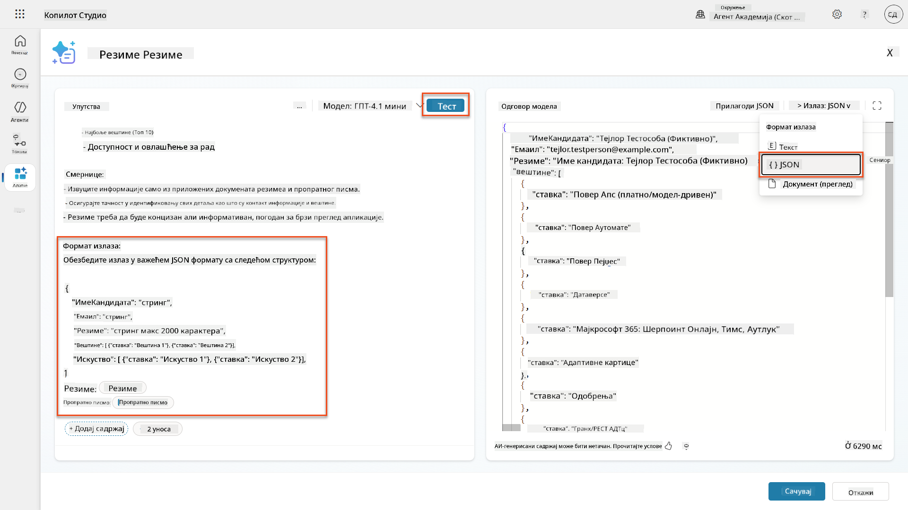

1. **Опционо:** Експериментишите са различитим AI моделима да видите како се излази разликују, а затим се вратите на подразумевани модел.

1. Изаберите **Save** да бисте креирали упит.

1. У дијалогу **Configure for use in Agent**, изаберите **Cancel**.

    !!! info "Зашто још не додајемо ово као алат"
        Користићете овај упит у Agent Flow-у уместо директно као алат, што вам даје већу контролу над радним током обраде података.

### 7.3 Додавање упита у Agent Flow

Креираћете Agent Flow који користи ваш упит за обраду биографија похрањених у Dataverse-у.

!!! tip "Изрази у Agent Flow-у"
    Веома је важно да тачно следите упутства за именовање ваших чворова и унос израза, јер се изрази односе на претходне чворове користећи њихово име! Погледајте [мисију Agent Flow у Recruit](../../recruit/09-add-an-agent-flow/README.md#you-mentioned-expressions-what-are-expressions) за брзи подсетник!

1. Идите на ваш **Hiring Agent** унутар Copilot Studio

1. Изаберите картицу **Agents**, и изаберите под-агента **Application Intake Agent**

1. Унутар панела **Tools**, изаберите **+ Add** → **+ New tool** → **Agent flow**

1. У чвору When an agent calls the flow, користите **+ Add an input** да додате следећи параметар:

    | Тип | Назив | Опис |
    |------|------|-------------|
    | Текст | ResumeNumber | Обавезно користите [ResumeNumber]. Ово увек мора почети словом R |

1. Изаберите **+** икону за уметање акције испод првог чвора, потражите **Dataverse**, изаберите **See more**, а затим пронађите акцију **List rows**

1. Изаберите **елипсе (...)** на чвору List rows, и изаберите **Rename** у `Get Resume Record`, а затим поставите следеће параметре:

    | Својство | Како поставити | Вредност |
    |----------|------------|-------|
    | **Назив табеле** | Изаберите | Resumes |
    | **Филтрирај редове** | Динамички подаци (икона грома) | `ppa_resumenumber eq 'ResumeNumber'` Замените **ResumeNumber** са **When an agent calls the flow** → **ResumeNumber** |
    | **Број редова** | Унесите | 1 |

    !!! tip "Оптимизујте те
| **Подстицај** | Изабери | Сажми резиме |
| **Пропратно писмо** | Израз (икона fx) | `first(body('Get_Resume_Record')?['value'])?['ppa_coverletter']` |
| **Резиме** | Динамички подаци (икона муња) | Преузми резиме → Садржај фајла или слике |

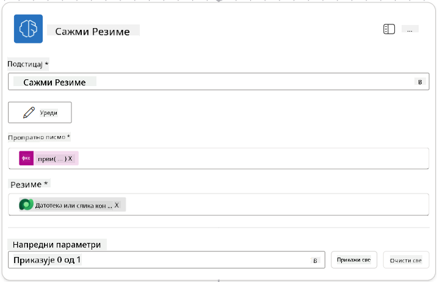

!!! tip "Параметри подстицаја"
    Обратите пажњу како су параметри које попуњавате исти они које сте конфигурисали као улазне параметре када сте креирали подстицај.

### 7.4 Креирање записа кандидата

Следеће, потребно је да узмете информације које вам је подстицај дао и креирате нови запис кандидата ако већ не постоји.

1. Изаберите икону **+** за уметање акције испод чвора Summarize Resume, потражите **Dataverse**, изаберите **See more**, а затим пронађите акцију **List rows**.

1. Преименујте чвор у `Get Existing Candidate`, а затим подесите следеће параметре:

    | Својство | Како подесити | Вредност |
    |----------|---------------|----------|
    | **Име табеле** | Изабери | Candidates |
    | **Филтрирај редове** | Динамички подаци (икона муња) | `ppa_email eq 'Email'`  **Замените** `Email` са **Summarize Resume → Email** |
    | **Број редова** | Унесите | 1 |

    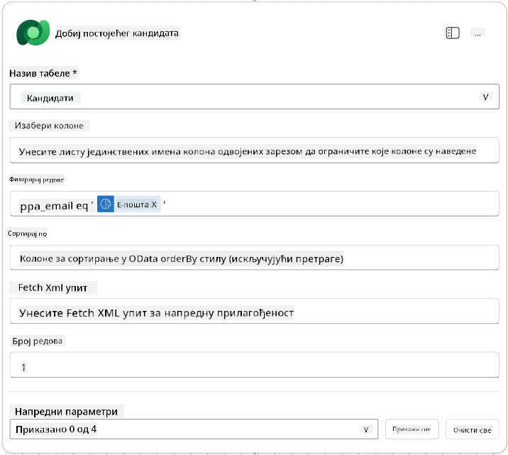

1. Изаберите икону **+** за уметање акције испод чвора Get Existing Candidate, потражите **Control**, изаберите **See more**, а затим пронађите акцију **Condition**.

1. У својствима услова, подесите следећи услов:

    | Услов | Оператор | Вредност |
    |-------|----------|----------|
    | Израз (икона fx): `length(outputs('Get_Existing_Candidate')?['body/value'])` | је једнако | 0 |

    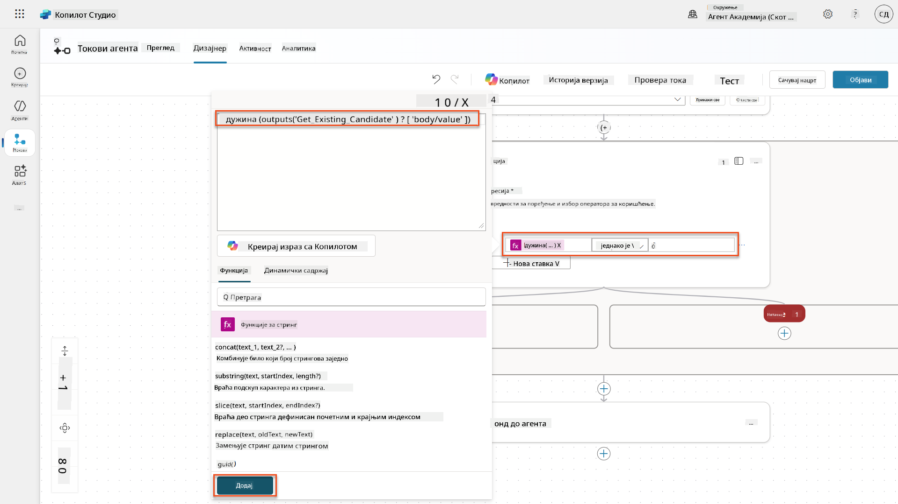

1. Изаберите икону **+** за уметање акције у грани **True**, потражите **Dataverse**, изаберите **See more**, а затим пронађите акцију **Add a new row**.

1. Преименујте чвор у `Add a New Candidate`, а затим подесите следеће параметре:

    | Својство | Како подесити | Вредност |
    |----------|---------------|----------|
    | **Име табеле** | Изабери | Candidates |
    | **Име кандидата** | Динамички подаци (икона муња) | Summarize Resume → `CandidateName` |
    | **Емаил** | Динамички подаци (икона муња) | Summarize Resume → `Email` |

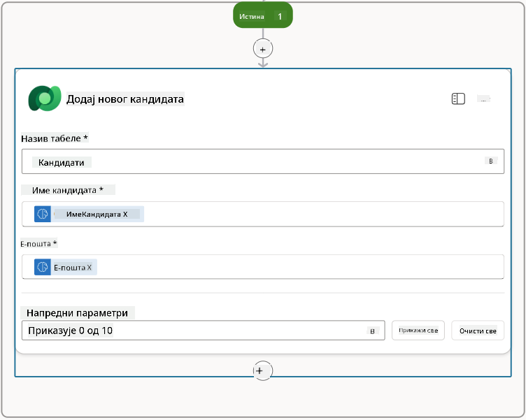

### 7.5 Ажурирање резимеа и конфигурисање излазних података тока

Завршите ток ажурирањем записа резимеа и конфигурисањем података који ће бити враћени вашем агенту.

1. Изаберите икону **+** за уметање акције испод услова, потражите **Dataverse**, изаберите **See more**, а затим пронађите акцију **Update a row**.

1. Изаберите наслов да преименујете чвор у `Update Resume`, изаберите **Show all**, а затим подесите следеће параметре:

    | Својство | Како подесити | Вредност |
    |----------|---------------|----------|
    | **Име табеле** | Изабери | Resumes |
    | **ID реда** | Израз (икона fx) | `first(body('Get_Resume_Record')?['value'])?['ppa_resumeid']` |
    | **Сажетак** | Динамички подаци (икона муња) | Summarize Resume → Text |
    | **Кандидат (Candidates)** | Израз (икона fx) | `if(equals(length(outputs('Get_Existing_Candidate')?['body/value']), 1), first(outputs('Get_Existing_Candidate')?['body/value'])?['ppa_candidateid'], outputs('Add_a_New_Candidate')?['body/ppa_candidateid'])` |

    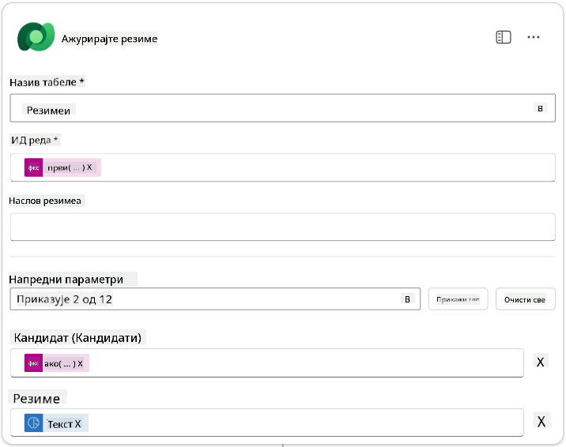

1. Изаберите чвор **Respond to the agent** и затим користите **+ Add an output** да конфигуришете:

    | Тип | Име              | Како подесити                      | Вредност                                                        | Опис                                            |
    |-----|------------------|-------------------------------------|------------------------------------------------------------------|------------------------------------------------|
    | Текст | `CandidateName`   | Динамички подаци (икона муња) | Summarize Resume → See more → CandidateName                  | [CandidateName] дат у резимеу                |
    | Текст | `CandidateEmail`  | Динамички подаци (икона муња) | Summarize Resume → See more → Email                          | [CandidateEmail] дат у резимеу               |
    | Текст | `CandidateNumber` | Израз (икона fx)            | `concat('ppa_candidates/', if(equals(length(outputs('Get_Existing_Candidate')?['body/value']), 1), first(outputs('Get_Existing_Candidate')?['body/value'])?['ppa_candidateid'], outputs('Add_a_New_Candidate')?['body/ppa_candidateid']) )` | [CandidateNumber] новог или постојећег кандидата |
    | Текст | `ResumeSummary`   | Динамички подаци (икона муња) | Summarize Resume → See more → body/responsev2/predictionOutput/structuredOutput | Сажетак резимеа и детаљи у JSON формату            |

    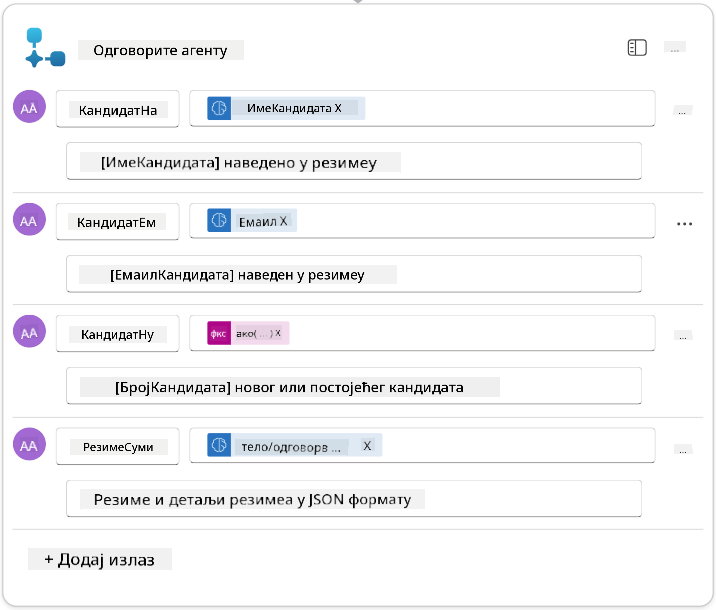

1. Изаберите **Save draft** у горњем десном углу. Ваш ток агента треба да изгледа као следеће  
    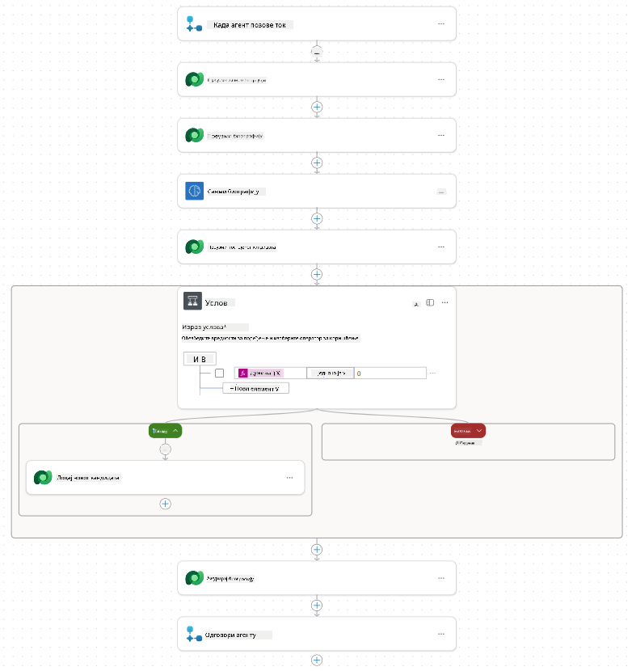

1. Изаберите картицу **Overview**, изаберите **Edit** на панелу **Details**

    1. **Име тока**:`Summarize Resume`
    1. **Опис**:

        ```text
        Summarize an existing Resume stored in Dataverse using a [ResumeNumber] as input, return the [CandidateNumber], and resume summary JSON
        ```

1. Изаберите **Save**

1. Поново изаберите картицу **Designer**, а затим изаберите **Publish**.

### 7.6 Повезивање тока са вашим агентом

Сада ћете додати ток као алат и конфигурисати вашег агента да га користи.

1. Отворите ваш **Hiring Agent** унутар Copilot Studio

1. Изаберите картицу **Agents**, и отворите **Application Intake Agent**

1. Изаберите панел **Tools**, и изаберите **+ Add a tool** - > **Flow** -> **Summarize Resume** **(Agent Flow)**

1. Изаберите **Add and configure**

1. Конфигуришите подешавања алата на следећи начин:

    | Подешавање | Вредност |
    |------------|----------|
    | **Опис** | Сажми постојећи резиме који је сачуван у Dataverse користећи [ResumeNumber] као улаз, врати [CandidateNumber] и сажетак резимеа у JSON формату |
    | **Када се овај алат може користити** | Само када га помињу теме или агенти |

1. Изаберите **Save**  
    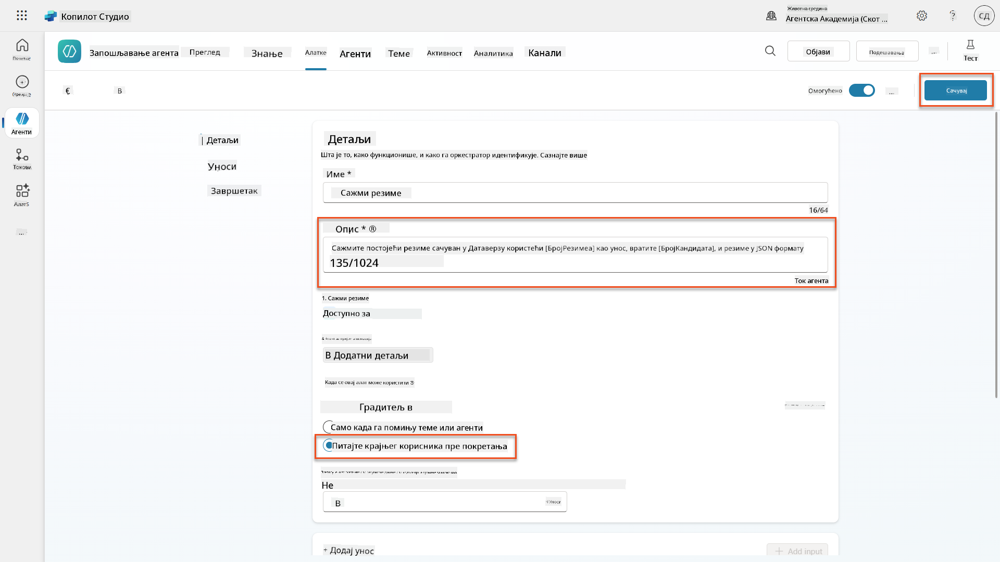

1. Ако изаберете Tools унутар Hiring Agent, сада ћете видети оба наша алата који су употребљиви од стране **Application Intake Agent**.  
    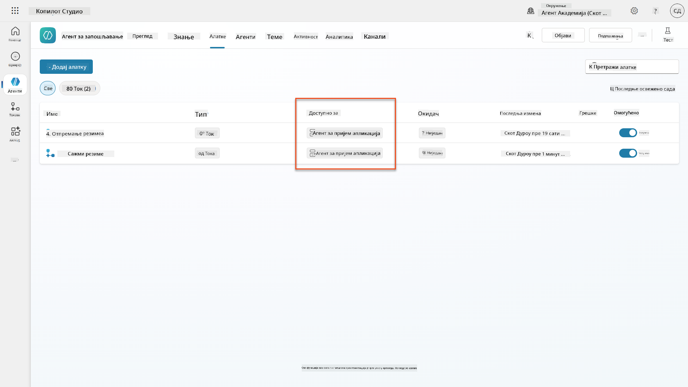

1. Навигирајте до инструкција агента **Application Intake Child**, и измените корак **Post-Upload** на следећи начин:

    ```text
    2. Post-Upload Processing  
        - After uploading, be sure to also output the [ResumeNumber] in all messages
        - Pass [ResumeNumber] to /Summarize Resume  - Be sure to use the correct value that will start with the letter R.
        - Be sure to also output the [CandidateNumber] in all messages
        - Use the [ResumeSummary] to output a summary of the processed Resume and candidate
    ```

    Замените `/Summarize Resume` уметањем референце на **Summarize Resume agent flow** тако што ћете укуцати косу црту (`/)` или изабрати `/Summarize` да уметнете референцу.  
    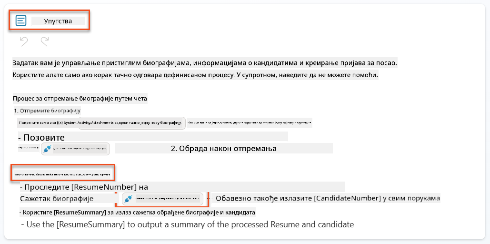

1. Изаберите **Save**.

### 7.7 Тестирајте вашег агента

Тестирајте ваш комплетан мултимодални систем како бисте се уверили да све ради исправно.

1. **Почните тестирање**:

    - Изаберите **Test** да отворите панел за тестирање
    - Укуцајте: `Here is a candidate Resume`

    - Отпремите један од узорака резимеа са [Test Resumes](https://download-directory.github.io/?url=https://github.com/microsoft/agent-academy/tree/main/operative/sample-data/resumes&filename=operative_sampledata)

1. **Потврдите резултате**:
    - Када пошаљете поруку и резиме, проверите да ли сте добили број резимеа (формат: R#####)
    - Потврдите да сте добили број кандидата и сажетак
    - Користите мапу активности да видите како алат за отпремање резимеа и алат Summarize Resume раде, и како агент прима излазе из подстицаја за сажетак:  
        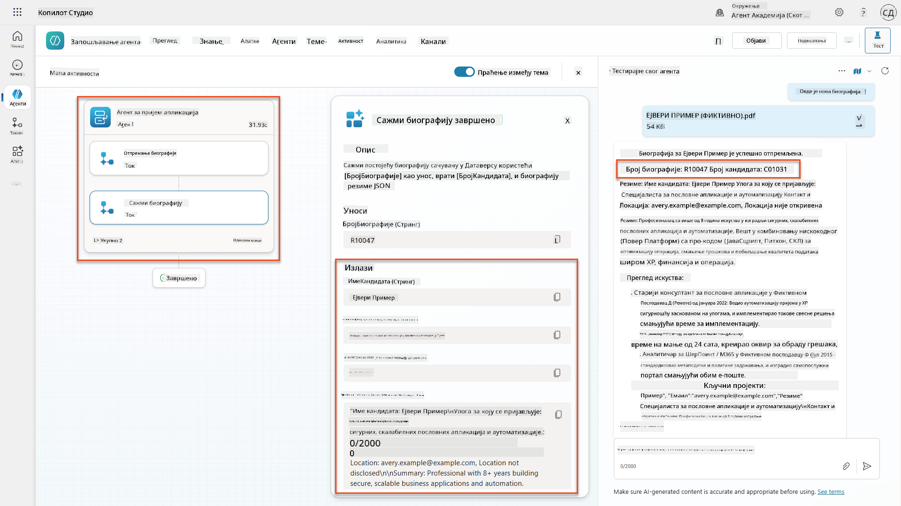

1. **Проверите трајност података**:
    - Навигирајте до [Power Apps](https://make.powerapps.com)
    - Отворите **Apps** → **Hiring Hub** → **Play**
    - Идите на **Resumes** да проверите да ли је резиме отпремљен и обрађен. Требало би да има и информације о сажетку и повезан запис кандидата.
    - Проверите **Candidates** да видите извучене информације о кандидату  
        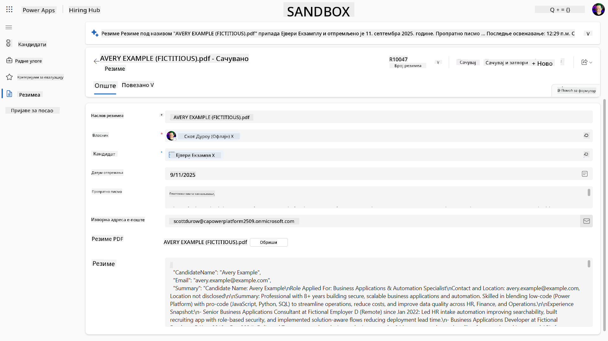
    - Када поново покренете процес, требало би да користи постојећег кандидата (према емаил адреси извученој из резимеа) уместо да креира новог.

!!! tip "Решавање проблема"
    - **Резиме није обрађен**: Уверите се да је фајл у PDF формату и да је у дозвољеним границама величине
    - **Кандидат није креиран**: Проверите да ли је емаил исправно извучен из резимеа
    - **Грешке у JSON формату**: Проверите да ли ваше инструкције подстицаја укључују тачну структуру JSON-а
    - **Грешке у току**: Проверите да ли су све Dataverse везе и изрази исправно конфигурисани

### Спремност за продукцију

Иако није део ове мисије, да би овај ток агента био спреман за продукцију, можете размотрити следеће:

1. **Руковање грешкама** - Ако број резимеа није пронађен, или ако подстицај није успео да анализира документ, треба додати руковање грешкама како би се агенту вратила јасна грешка.
1. **Ажурирање постојећих кандидата** - Кандидат се проналази помоћу емаил адресе, а затим се име може ажурирати да одговара оном на резимеу.
1. **Раздвајање сажимања резимеа и креирања кандидата** - Ова функционалност може бити подељена на мање токове агента како би се олакшало њихово одржавање, а затим агенту дати инструкције да их користи редом.

## 🎉 Мисија завршена

Одличан посао, Оперативче! **Документ Резиме Реконструкција** је сада завршена. Успешно сте савладали мултимодалне подстицаје и сада можете са прецизношћу извлачити структуриране податке из било ког документа.

Ево шта сте постигли у овој мисији:

**✅ Мајсторство мултимодалних подстицаја**  
Сада разумете шта су мултимодални подстицаји и када користити различите AI моделе за оптималне резултате.

**✅ Експертиза у обради докумената**  
Научили сте како да конфигуришете подстицаје са улазима у виду слика и докумената, и како да форматирате излазе као JSON за извлачење структурираних података.

**✅ Систем за извлачење резимеа**  
Изградили сте комплетан систем за извлачење резимеа који обрађује документе кандидата и интегрише се са вашим процесом запошљавања.

**✅ Примена најбољих пракси**  
Применили сте најбоље праксе за инжењеринг подстицаја у анализи докумената и интегрисали мултимодалне подстицаје са токовима агента.

**✅ Основа за напредну обраду**  
Ваше побољшане способности анализе докумената сада су спремне за напредне функције засноване на подацима које ћемо додати у наредним мисијама.

🚀 **Следеће:** У Мисији 08, открићете како да побољшате своје подстицаје са реалним подацима из Dataverse-а, креирајући динамична AI решења која се прилагођавају променљивим пословним захтевима.

⏩ [Прелазак на Мисију 08: Побољшани подстицаји са Dataverse основом](../08-dataverse-grounding/README.md)

## 📚 Тактички ресурси

📖 [Креирајте подстицај](https://learn.microsoft.com/ai-builder/create-a-custom-prompt?WT.mc_id=power-power-182762-scottdurow)

📖 [Додајте текст, слику или документ као улаз у ваш подстицај](https://learn.microsoft.com/ai-builder/add-inputs-prompt?WT.mc_id=power-182762-scottdurow)

📖 [Обрадите одговоре са JSON излазом](https://learn.microsoft.com/ai-builder/process-responses-json-output?WT.mc_id=power-182762-scottdurow)

📖 [Избор модела и подешавање температуре](https://learn.microsoft.com/ai-builder/prompt-modelsettings?WT.mc_id=power-182762-scottdurow)

📖 [Користите ваш подстицај у Power Automate](https://learn.microsoft.com/ai-builder/use-a-custom-prompt-in-flow?WT.mc_id=power-182762-scottdurow)

📺 [AI Builder: JSON излази у подстицајима](https://www.youtube.com/watch?v=F0fGnWrRY_I)

---

**Одрицање од одговорности**:  
Овај документ је преведен помоћу услуге за превођење вештачке интелигенције [Co-op Translator](https://github.com/Azure/co-op-translator). Иако настојимо да обезбедимо тачност, молимо вас да имате у виду да аутоматски преводи могу садржати грешке или нетачности. Оригинални документ на његовом изворном језику треба сматрати ауторитативним извором. За критичне информације препоручује се професионални превод од стране људи. Не преузимамо одговорност за било каква погрешна тумачења или неспоразуме који могу произаћи из коришћења овог превода.