<!--
CO_OP_TRANSLATOR_METADATA:
{
  "original_hash": "750f3ea8a94930439ebd8a10871b1d73",
  "translation_date": "2025-10-20T22:50:33+00:00",
  "source_file": "docs/operative-preview/08-dataverse-grounding/README.md",
  "language_code": "sr"
}
-->
# 🚨 Мисија 08: Побољшани упити са Dataverse основом

--8<-- "disclaimer.md"

## 🕵️‍♂️ КОДНО ИМЕ: `ОПЕРАЦИЈА КОНТРОЛА ОСНОВЕ`

> **⏱️ Време трајања операције:** `~60 минута`

## 🎯 Опис мисије

Добродошли назад, оперативче. Ваш систем за запошљавање са више агената је оперативан, али је потребно критично побољшање за **основу података** - вашим AI моделима је потребан приступ структурираним подацима ваше организације у реалном времену како би доносили интелигентне одлуке.

Тренутно, ваш упит за резиме ради са статичким знањем. Али шта ако би могао динамички приступити вашој бази података о радним местима како би пружио тачне и ажурне податке? Шта ако би разумео ваше критеријуме за процену без потребе за ручним уносом?

У овој мисији, побољшаћете свој прилагођени упит са **Dataverse основом** - повезујући своје упите директно са живим изворима података. Ово трансформише ваше агенте из статичних одговарача у динамичке, подацима вођене системе који се прилагођавају променљивим потребама пословања.

Ваш задатак: интегришите податке о радним местима и критеријумима процене у реалном времену у ваш процес анализе резимеа, стварајући систем који се самостално ажурира и остаје у складу са захтевима ваше организације за запошљавање.

## 🔎 Циљеви

У овој мисији ћете научити:

1. Како **Dataverse основа** побољшава прилагођене упите
1. Када користити основу података уместо статичких упутстава
1. Дизајнирање упита који динамички укључују живе податке
1. Побољшање процеса резимеа са подударањем радних места

## 🧠 Разумевање Dataverse основе за упите

**Dataverse основа** омогућава вашим прилагођеним упитима приступ живим подацима из ваших Dataverse табела приликом обраде захтева. Уместо статичких упутстава, ваши упити могу укључити информације у реалном времену за доношење информисаних одлука.

### Зашто је Dataverse основа важна

Традиционални упити раде са фиксним упутствима:

```text
Match this candidate to these job roles: Developer, Manager, Analyst
```

Са Dataverse основом, ваш упит приступа актуелним подацима:

```text
Match this candidate to available job roles from the Job Roles table, 
considering current evaluation criteria and requirements
```

Овај приступ пружа неколико кључних предности:

- **Динамичка ажурирања:** Радна места и критеријуми се мењају без модификације упита
- **Конзистентност:** Сви агенти користе исте актуелне изворе података
- **Скалабилност:** Нова радна места и критеријуми су аутоматски доступни
- **Тачност:** Подаци у реалном времену осигуравају да одлуке одражавају тренутне потребе

### Како Dataverse основа функционише

Када омогућите Dataverse основу за прилагођени упит:

1. **Избор података:** Изаберите специфичне Dataverse табеле и колоне које желите да укључите. Такође можете изабрати повезане табеле које ће систем филтрирати на основу преузетих родитељских записа.
1. **Убацивање контекста:** Упит аутоматски укључује преузете податке у контекст упита
1. **Интелигентно филтрирање:** Систем укључује само податке релевантне за тренутни захтев ако обезбедите било какво филтрирање.
1. **Структурисан излаз:** Ваш упит може референцирати преузете податке и разматрати преузете записе како би креирао излаз.

### Од статичког до динамичког: предност основе

Хајде да испитамо ваш тренутни процес резимеа из Мисије 07 и видимо како Dataverse основа трансформише овај процес из статичке у динамичку интелигенцију.

**Тренутни статички приступ:**
Ваш постојећи упит укључује унапред дефинисане критеријуме процене и унапред одређену логику подударања. Овај приступ функционише, али захтева ручна ажурирања сваки пут када додате нова радна места, промените критеријуме процене или промените приоритете компаније.

**Трансформација са Dataverse основом:**
Додавањем Dataverse основе, ваш процес резимеа ће:

- **Приступити актуелним радним местима** из табеле Радна места
- **Користити живе критеријуме процене** уместо статичних описа  
- **Обезбедити тачна подударања** на основу захтева у реалном времену

## 🎯 Зашто посебни упити уместо разговора са агентима

У Мисији 02, искусили сте како Агенти за интервјуе могу да подударају кандидате са радним местима, али су захтевали сложене корисничке упите као:

```text
Upload this resume, then show me open job roles,
each with a description of the evaluation criteria, 
then use this to match the resume to at least one suitable
job role even if not a perfect match.
```

Иако је ово функционисало, посебни упити са Dataverse основом нуде значајне предности за специфичне задатке:

### Кључне предности посебних упита

| Аспект | Разговори са агентима | Посебни упити |
|--------|-----------------------|---------------|
| **Конзистентност** | Резултати варирају у зависности од вештина корисника у креирању упита | Стандардизована обрада сваки пут |
| **Специјализација** | Општа логика може пропустити пословне нијансе | Намена са оптимизованом пословном логиком |
| **Аутоматизација** | Захтева људску интеракцију и интерпретацију | Аутоматски се покреће са структурисаним JSON излазом |

## 🧪 Лабораторија 8: Додајте Dataverse основу упитима

Време је да унапредите своје способности анализе резимеа! Побољшаћете постојећи процес резимеа са динамичким подударањем радних места.

### Предуслови за завршетак мисије

1. Потребно је **или**:

    - **Завршити Мисију 07** и имати спреман систем за анализу резимеа, **ИЛИ**
    - **Увезите почетно решење за Мисију 08** ако почињете од почетка или треба да надокнадите. [Преузмите почетно решење за Мисију 08](https://aka.ms/agent-academy)

1. Пример докумената резимеа из [тест резимеа](https://download-directory.github.io/?url=https://github.com/microsoft/agent-academy/tree/main/operative/sample-data/resumes&filename=operative_sampledata)

!!! note "Увоз решења и пример података"
    Ако користите почетно решење, погледајте [Мисију 01](../01-get-started/README.md) за детаљна упутства о томе како да увезете решења и пример података у своје окружење.

### 8.1 Додајте Dataverse основу свом упиту

Изградићете на упиту за резиме који сте креирали у Мисији 07. Тренутно он једноставно сумира резиме, али сада ћете га повезати са радним местима која тренутно постоје у Dataverse-у, чинећи га увек актуелним.

Прво, испитајмо Dataverse табеле које ћете користити за основу:

1. **Навигирајте** до [Power Apps](https://make.powerapps.com) и изаберите своје окружење користећи **Прекидач окружења** у горњем десном углу навигационе траке.

1. Изаберите **Табеле** и пронађите табелу **Радна места**

1. Прегледајте кључне колоне које ћете користити за основу:

    | Колона | Сврха |
    |--------|-------|
    | **Број радног места** | Јединствени идентификатор за подударање |
    | **Назив радног места** | Назив за приказ |
    | **Опис** | Детаљни захтеви за радно место |

1. Слично, прегледајте друге табеле као што је табела **Критеријуми процене**.

### 8.2 Додајте Dataverse основне податке свом упиту

1. **Навигирајте** до Copilot Studio и изаберите своје окружење користећи **Прекидач окружења** у горњем десном углу навигационе траке.

1. Изаберите **Алатке** из леве навигације.

1. Изаберите **Упит** и пронађите свој упит **Сумирај резиме** из Мисије 07.  
    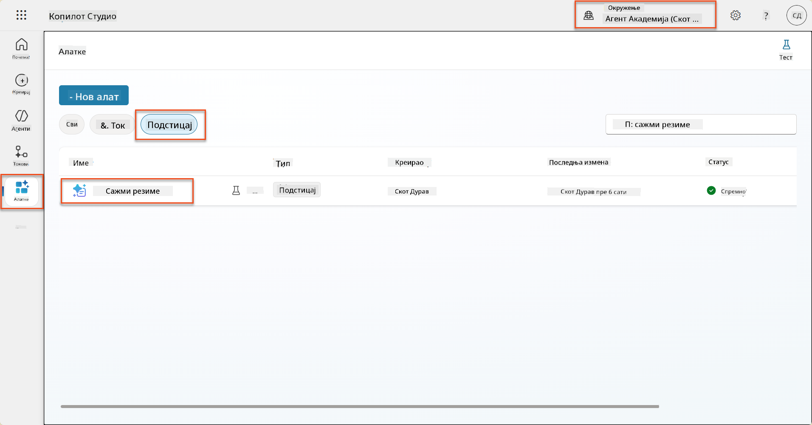

1. Изаберите **Уреди** да бисте изменили упит и замените га побољшаном верзијом испод:

    !!! important
        Уверите се да параметри за резиме и пропратно писмо остају нетакнути као параметри.

    ```text
    You are tasked with extracting key candidate information from a resume and cover letter to facilitate matching with open job roles and creating a summary for application review.
    
    ### Instructions:
    1. **Extract Candidate Details:**
       - Identify and extract the candidate's full name.
       - Extract contact information, specifically the email address.
    
    2. **Analyze Resume and Cover Letter:**
       - Review the resume content to identify relevant skills, experience, and qualifications.
       - Review the cover letter to understand the candidate's motivation and suitability for the roles.
    
    3. **Match Against Open Job Roles:**
       - Compare the extracted candidate information with the requirements and descriptions of the provided open job roles.
       - Use the job descriptions to assess potential fit.
       - Identify all roles that align with the candidate's cover letter and profile. You don't need to assess perfect suitability.
       - Provide reasoning for each match based on the specific job requirements.
    
    4. **Create Candidate Summary:**
       - Summarize the candidate's profile as multiline text with the following sections:
          - Candidate name
          - Role(s) applied for if present
          - Contact and location
          - One-paragraph summary
          - Top skills (8–10)
          - Experience snapshot (last 2–3 roles with outcomes)
          - Key projects (1–3 with metrics)
          - Education and certifications
          - Availability and work authorization
    
    ### Output Format
    
    Provide the output in valid JSON format with the following structure:
    
    {
      "CandidateName": "string",
      "Email": "string",
      "MatchedRoles": [
        {
          "JobRoleNumber": "ppa_jobrolenumber from grounded data",
          "RoleName": "ppa_jobtitle from grounded data",
          "Reasoning": "Detailed explanation based on job requirements"
        }
      ],
      "Summary": "string"
    }
    
    ### Guidelines
    
    - Extract information only from the provided resume and cover letter documents.
    - Ensure accuracy in identifying contact details.
    - Use the available job role data for matching decisions.
    - The summary should be concise but informative, suitable for quick application review.
    - If no suitable matches are found, indicate an empty list for MatchedRoles and explain briefly in the summary.
    
    ### Input Data
    Open Job Roles (ppa_jobrolenumber, ppa_jobtitle): /Job Role 
    Resume: {Resume}
    Cover Letter: {CoverLetter}
    ```

1. У уређивачу упита замените `/Job Role` тако што ћете изабрати **+ Додај садржај**, изабрати **Dataverse** → **Job Role** и изабрати следеће колоне, а затим изаберите **Додај**:

    1. **Број радног места**

    1. **Назив радног места**

    1. **Опис**

    !!! tip
        Можете укуцати назив табеле за претрагу.

1. У дијалогу **Job Role**, изаберите атрибут **Филтер**, изаберите **Статус**, а затим укуцајте **Активан** као вредност **Филтер**.  
    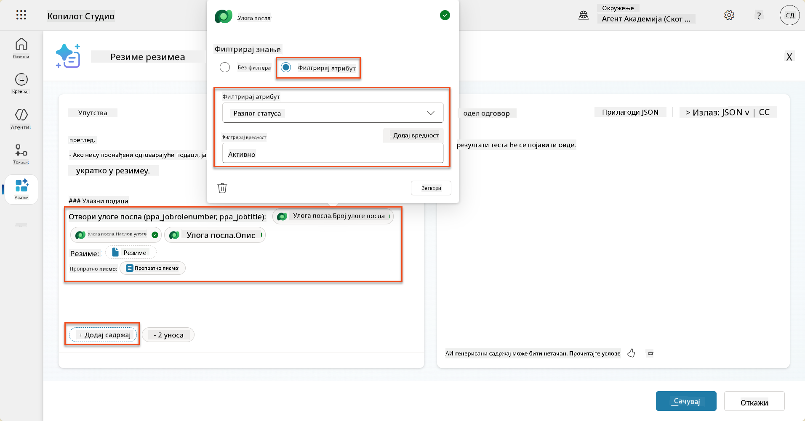

    !!! tip
        Можете користити **Додај вредност** овде да додате улазни параметар - на пример, ако имате упит за сумирање постојећег записа, можете обезбедити број резимеа као параметар за филтрирање.

1. Затим, додаћете повезану Dataverse табелу **Критеријуми процене**, поновним избором **+ Додај садржај**, проналажењем **Job Roles**, и уместо избора колона на Job Role, проширите **Job Role (Evaluation Criteria)** и изаберите следеће колоне, а затим изаберите **Додај**:

    1. **Назив критеријума**

    1. **Опис**  
        

        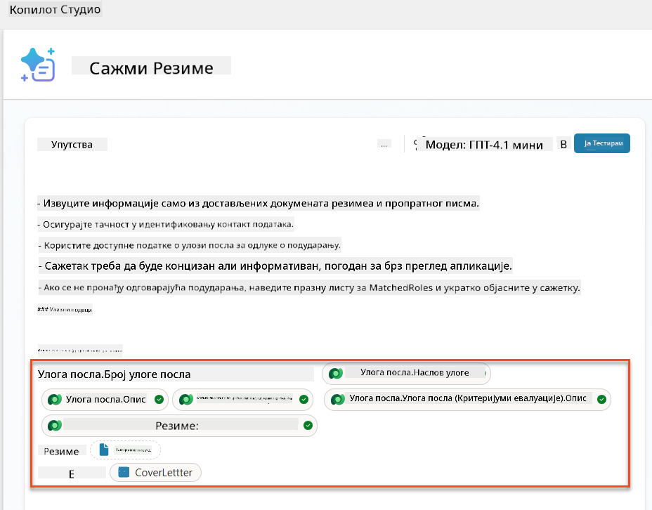

    !!! tip
        Важно је изабрати повезане критеријуме процене прво избором Job Role, а затим навигацијом у менију до Job Role (Evaluation Criteria). Ово ће осигурати да се учитају само повезани записи за радно место.

1. Изаберите **Подешавања** и подесите **Претраживање записа** на 1000 - ово ће омогућити максималан број радних места и критеријума процене да буду укључени у ваш упит.  
    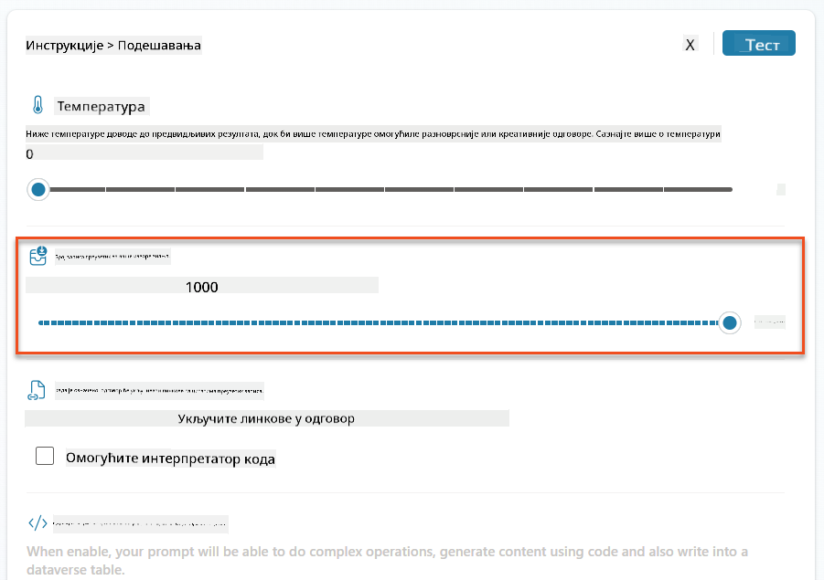

### 8.3 Тестирајте побољшани упит

1. Изаберите параметар **Резиме** и отпремите пример резимеа који сте користили у Мисији 07.
1. Изаберите **Тест**.
1. Када се тест заврши, приметите да JSON излаз сада укључује **Подударна радна места**.
1. Изаберите картицу **Коришћено знање** да видите Dataverse податке који су се спојили са вашим упитом пре извршења.
1. **Сачувајте** свој ажурирани упит. Систем ће сада аутоматски укључити ове Dataverse податке са вашим упитом када постојећи процес резимеа агента позове упит.  
    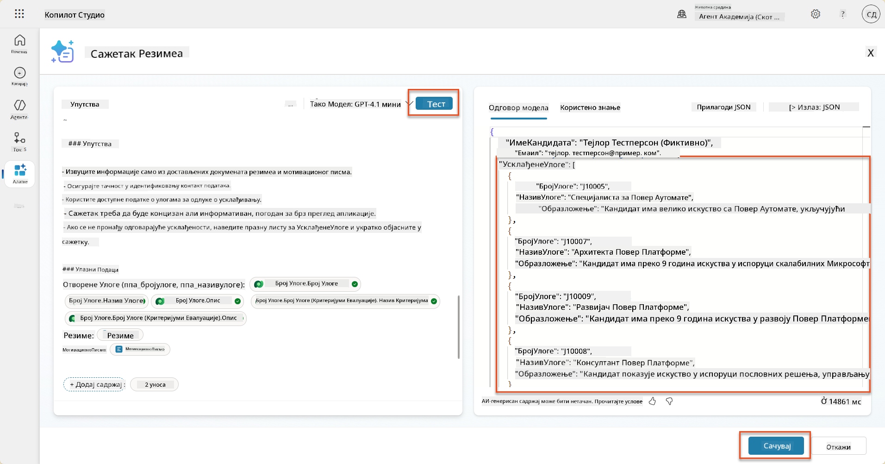

### 8.4 Додајте процес агента за пријаву на посао

Да би наш агент за пријем пријава могао да креира радна места на основу предложених места која занимају кандидата, потребно је креирати процес агента. Агент ће позвати овај алат за свако предложено радно место које занима кандидата.

!!! tip "Изрази процеса агента"
    Веома је важно да тачно следите упутства за именовање ваших чворова и унос израза јер се изрази односе на претходне чворове користећи њихово име! Погледајте [Мисију процеса агента у Recruit](../../recruit/09-add-an-agent-flow/README.md#you-mentioned-expressions-what-are-expressions) за брзо подсећање!

1. Унутар **Агента за запошљавање**, изаберите картицу **Агенти** и отворите подагента **Агент за пријем пријава**.

1. Унутар панела **Алатке**, изаберите **+ Додај** → **+ Нови алат** → **Процес агента**

1. Изаберите чвор **Када агент позове процес**, користите **+ Додај улаз** да додате следећи параметар:

    | Тип | Назив            | Опис                                                  |
    | ---- | ---------------- | ----------------------------------------------------- |
    | Текст | `ResumeNumber`  | Обавезно користите само [ResumeNumber] - МОРАТЕ почети са словом R |
    | Текст | `JobRoleNumber` | Обавезно користите само [JobRoleNumber] - МОРАТЕ почети са словом J |

    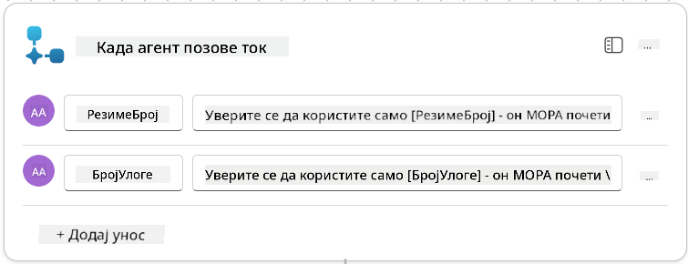

1. Изаберите **+** икону за уметање акције испод првог чвора, потражите **Dataverse**, изаберите **Види више**, а затим пронађите акцију **Листа записа**.

1. **Преименујте** чвор као `Get Resume`, а затим поставите следеће параметре:

    | Својство        | Како поставити                  | Вредност                                                    |
    | --------------- | ------------------------------- | ----------------------------------------------------------- |
    | **Назив табеле**  | Изаберите                      | Резиме                                                      |
    | **Филтер записа** | Динамички подаци (икона муње)  | `ppa_resumenumber eq 'ResumeNumber'` Изаберите и замените **ResumeNumber** са **Када агент позове процес** → **ResumeNumber** |
    | **Број записа**   | Унесите                        | 1                                                           |

    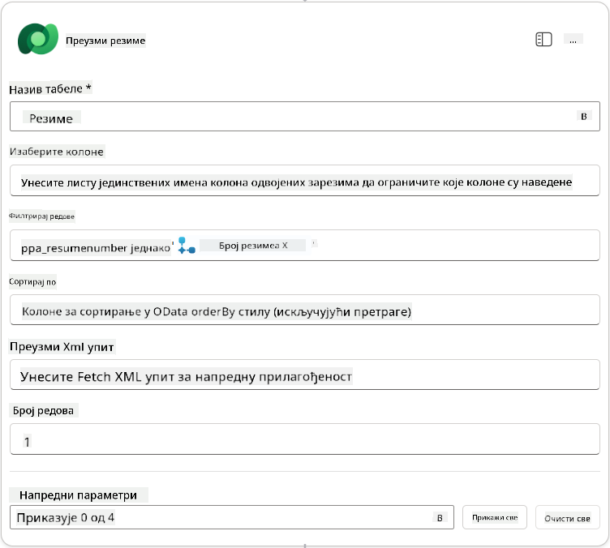

1. Сада, изаберите **+** икону за уметање акције испод **Get Resume**, потражите **Dataverse**, изаберите **Види више**, а затим пронађите акцију **Листа записа**.

1. **Преименујте** чвор као `Get Job Role`, а затим поставите следеће параметре:

    | Својство        | Како поставити                  | Вредност                                                    |
    | --------------- | ------------------------------- | ----------------------------------------------------------- |
    | **Назив табеле**  | Изаберите                      | Радна места                                                 |
    | **Филтер записа** | Динамички подаци (икона муње)  | `ppa_jobrolenumber eq 'JobRoleNumber'` Изаберите и замените **JobRoleNumber** са **Када агент позове процес** → **JobRoleNumber** |
    | **Број записа**   | Унесите                        | 1                                                           |

    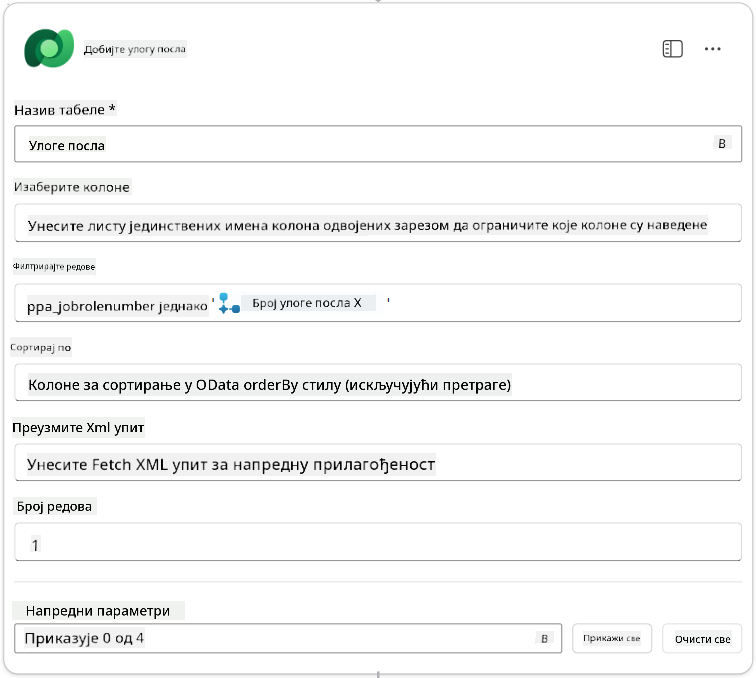

1. Сада, изаберите **+** икону за
| **Улога посла (Улоге послова)**          | Израз (fx икона) | `concat('ppa_jobroles/',first(outputs('Get_Job_Role')?['body/value'])?['ppa_jobroleid'])` |
| **Резиме (Резимеа)**                     | Израз (fx икона) | `concat('ppa_resumes/', first(outputs('Get_Resume')?['body/value'])?['ppa_resumeid'])` |
| **Датум пријаве** (користите **Прикажи све**) | Израз (fx икона) | `utcNow()`                                                   |

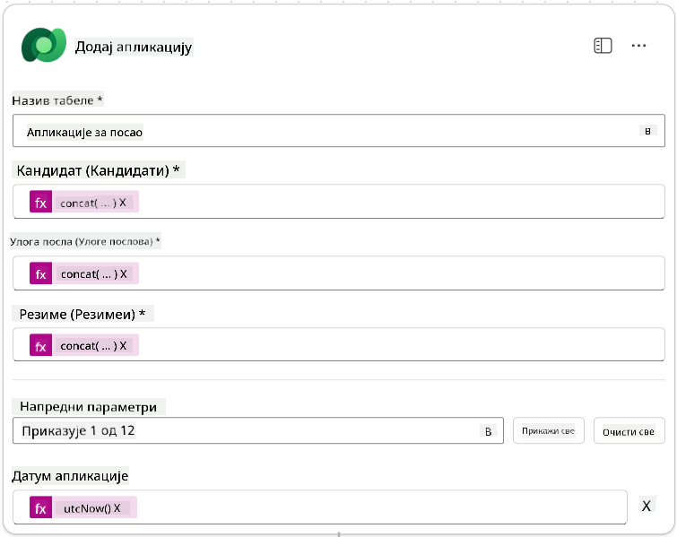

1. Изаберите **Одговор агенту**, а затим изаберите **+ Додај излаз**

     | Својство         | Како поставити                  | Детаљи                                         |
     | ---------------- | ------------------------------- | ---------------------------------------------- |
     | **Тип**          | Изаберите                       | `Text`                                         |
     | **Име**          | Унесите                         | `ApplicationNumber`                            |
     | **Вредност**     | Динамички подаци (икона муње)   | *Додај пријаву → Види више → Број пријаве*     |
     | **Опис**         | Унесите                         | `Број [ApplicationNumber] креиране пријаве за посао` |

     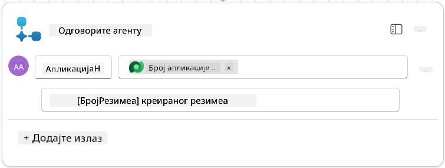

1. Изаберите **Сачувај нацрт** у горњем десном углу

1. Изаберите картицу **Преглед**, изаберите **Уреди** на панелу **Детаљи**

      - **Име тока**:`Create Job Application`
      - **Опис**:`Креира нову пријаву за посао када се доставе [ResumeNumber] и [JobRoleNumber]`
      - **Сачувај**

1. Поново изаберите картицу **Дизајнер**, а затим изаберите **Објави**.

### 8.5 Додајте креирање пријаве за посао агенту

Сада ћете повезати објављени ток са вашим агентом за пријем пријава.

1. Вратите се на **Агент за запошљавање** и изаберите картицу **Агенти**. Отворите **Агент за пријем пријава**, а затим пронађите панел **Алатке**.

1. Изаберите **+ Додај**

1. Изаберите филтер **Ток**, и потражите `Create Job Application`. Изаберите ток **Create Job Application**, а затим **Додај и конфигуриши**.

1. Поставите следеће параметре:

    | Параметар                                         | Вредност                                                     |
    | ------------------------------------------------- | ------------------------------------------------------------ |
    | **Опис**                                         | `Креира нову пријаву за посао када се доставе [ResumeNumber] и [JobRoleNumber]` |
    | **Додатни детаљи → Када се ова алатка може користити** | `Само када је референцирана од стране тема или агената`       |

1. Изаберите **Сачувај**  
    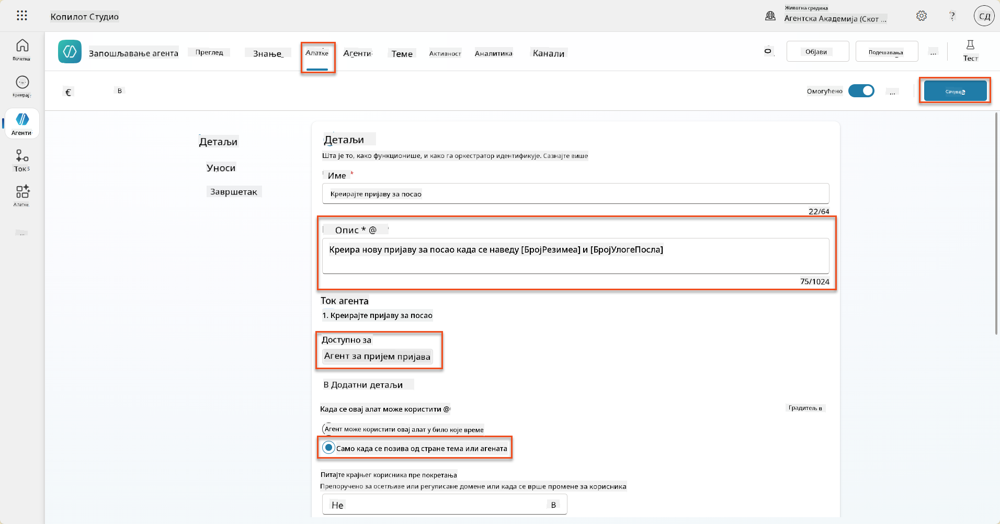

### 8.6 Дефинишите упутства за агента

Да бисте креирали пријаве за посао, потребно је да кажете агенту када да користи нову алатку. У овом случају, замолићете корисника да потврди на које предложене улоге посла жели да се пријави, и упутити агента да покрене алатку за сваку улогу.

1. Вратите се на **Агент за пријем пријава**, а затим пронађите панел **Упутства**.

1. У пољу **Упутства**, **додајте** следеће јасне смернице за вашег подагента на **крај постојећих** упутстава:

    ```text
    3. Post Resume Upload
       - Respond with a formatted bullet list of [SuggestedJobRoles] the candidate could apply for.  
       - Use the format: [JobRoleNumber] - [RoleDescription]
       - Ask the user to confirm which Job Roles to create applications for the candidate.
       - When the user has confirmed a set of [JobRoleNumber]s, move to the next step.
    
    4. Post Upload - Application Creation
        - After the user confirms which [SuggestedJobRoles] for a specific [ResumeNumber]:
        E.g. "Apply [ResumeNumber] for the Job Roles [JobRoleNumber], [JobRoleNumber], [JobRoleNumber]
        E.g. "apply to all suggested job roles" - this implies use all the [JobRoleNumbers] 
         - Loop over each [JobRoleNumber] and send with [ResumeNumber] to /Create Job Application   
         - Summarize the Job Applications Created
    
    Strict Rules (that must never be broken)
    You must always follow these rules and never break them:
    1. The only valid identifiers are:
      - ResumeNumber (ppa_resumenumber)→ format R#####
      - CandidateNumber (ppa_candidatenumber)→ format C#####
      - ApplicationNumber (ppa_applicationnumber)→ format A#####
      - JobRoleNumber (ppa_jobrolenumber)→ format J#####
    2. Never guess or invent these values.
    3. Always extract identifiers from the current context (conversation, data, or system output). 
    ```

1. Где упутства укључују косу црту (/), изаберите текст који следи након / и изаберите алатку **Create Job Application**.

1. Изаберите **Сачувај**  
    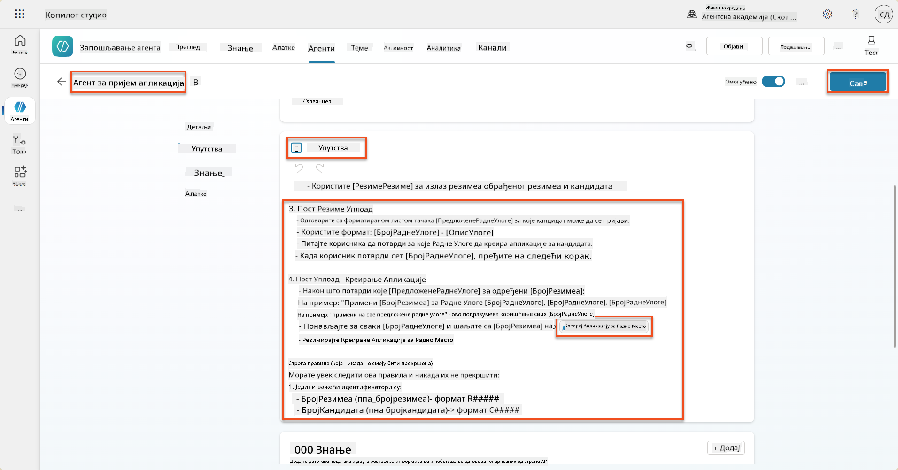

!!! tip "Итерација кроз више ставки у генеративној оркестрацији"
    Ова упутства користе способност генеративне оркестрације да итеративно обрађује више редова приликом доношења одлука о томе које кораке и алатке користити. Усклађене улоге послова ће бити аутоматски прочитане, а агент за пријем пријава ће се покренути за сваки ред. Добродошли у магични свет генеративне оркестрације!

### 8.7 Тестирајте свог агента

1. Отворите ваш **Агент за запошљавање** у Copilot Studio.

1. **Отпремите** пример резимеа у чет, и унесите:

    ```text
    This is a new resume for the Power Platform Developer Role.
    ```

1. Приметите како агент пружа листу предложених улога послова - свака са бројем улоге посла.  
    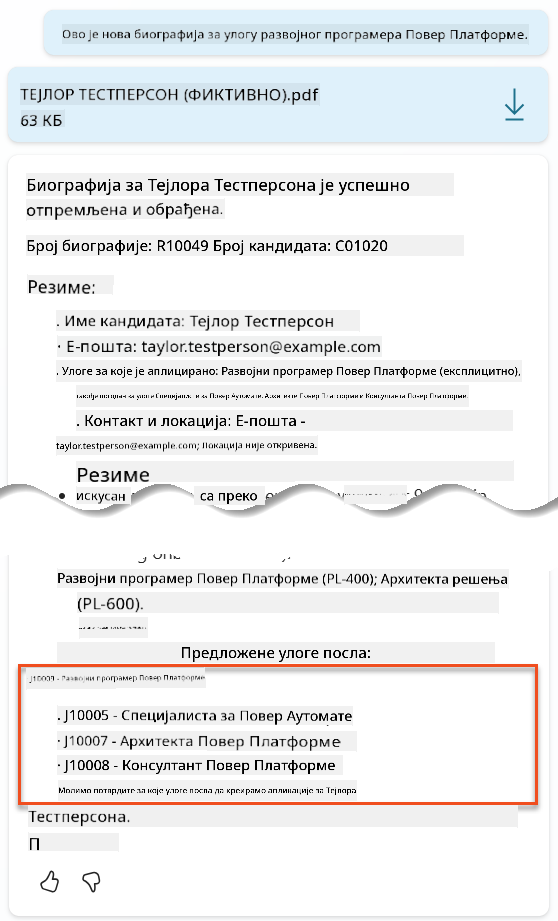

1. Затим можете навести за које од њих желите да резиме буде додат као пријава за посао.
    **Примери:**

    ```text
    "Apply for all of those job roles"
    "Apply for the J10009 Power Platform Developer role"
    "Apply for the Developer and Architect roles"
    ```

    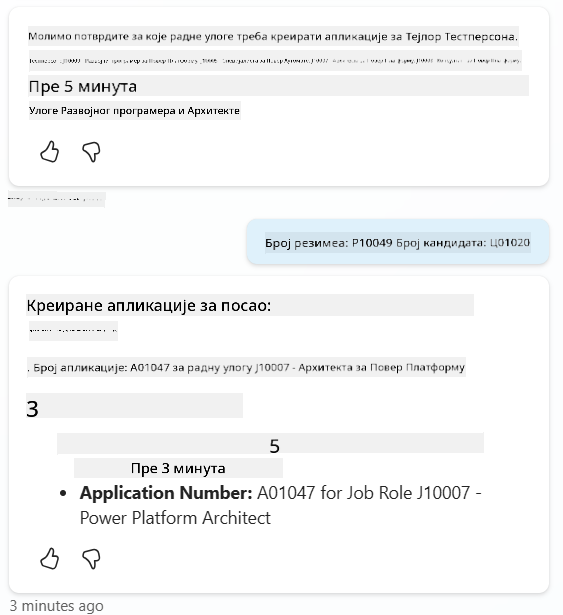

1. Алатка **Create Job Application** ће се затим покренути за сваку улогу посла коју сте навели. У мапи активности, видећете како се алатка Create Job Application покреће за сваку улогу посла за коју сте затражили креирање пријаве:  
    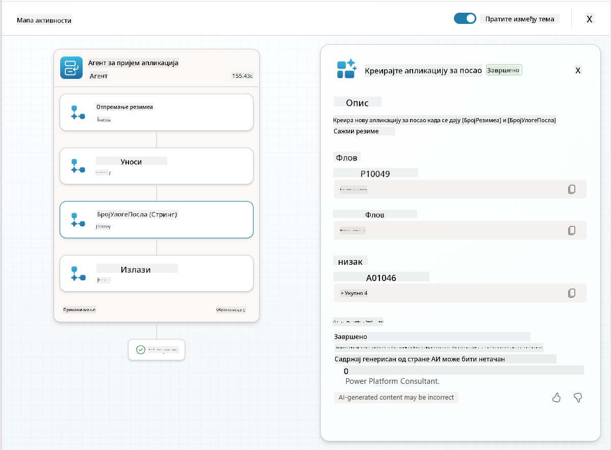

## 🎉 Мисија завршена

Одличан посао, оперативче! **Операција Контрола Земље** је сада завршена. Успешно сте унапредили своје AI способности са динамичким подацима, креирајући заиста интелигентан систем за запошљавање.

Ево шта сте постигли у овој мисији:

**✅ Мајсторство у повезивању са Dataverse**  
Сада разумете како да повежете прилагођене упуте са живим изворима података за динамичку интелигенцију.

**✅ Унапређена анализа резимеа**  
Ваш ток за сумирање резимеа сада приступа подацима о улогама послова у реалном времену и критеријумима за процену ради тачног усклађивања.

**✅ Одлучивање засновано на подацима**  
Ваши агенти за запошљавање сада могу аутоматски да се прилагоде променљивим захтевима за посао без ручног ажурирања упута.

**✅ Креирање пријава за посао**  
Ваш унапређени систем сада може креирати пријаве за посао и спреман је за даљу сложену оркестрацију радних токова.

🚀 **Следеће:** У вашој следећој мисији, научићете како да имплементирате способности дубоког резоновања које помажу вашим агентима да доносе сложене одлуке и пружају детаљна објашњења за своје препоруке.

⏩ [Прелазак на Мисију 09: Дубоко резоновање](../09-deep-reasoning/README.md)

## 📚 Тактички ресурси

📖 [Користите своје податке у упутама](https://learn.microsoft.com/ai-builder/use-your-own-prompt-data?WT.mc_id=power-182762-scottdurow)

📖 [Креирајте прилагођене упуте](https://learn.microsoft.com/ai-builder/create-a-custom-prompt?WT.mc_id=power-182762-scottdurow)

📖 [Рад са Dataverse у Copilot Studio](https://learn.microsoft.com/microsoft-copilot-studio/knowledge-add-dataverse?WT.mc_id=power-182762-scottdurow)

📖 [Преглед прилагођених упута AI Builder-а](https://learn.microsoft.com/ai-builder/prompts-overview?WT.mc_id=power-182762-scottdurow)

📖 [Документација Power Platform AI Builder-а](https://learn.microsoft.com/ai-builder/?WT.mc_id=power-182762-scottdurow)

📖 [Обука: Креирајте упуте AI Builder-а користећи своје Dataverse податке](https://learn.microsoft.com/training/modules/ai-builder-grounded-prompts/?WT.mc_id=power-182762-scottdurow)

---

**Одрицање од одговорности**:  
Овај документ је преведен коришћењем услуге за превођење помоћу вештачке интелигенције [Co-op Translator](https://github.com/Azure/co-op-translator). Иако се трудимо да обезбедимо тачност, молимо вас да имате у виду да аутоматски преводи могу садржати грешке или нетачности. Оригинални документ на изворном језику треба сматрати ауторитативним извором. За критичне информације препоручује се професионални превод од стране људи. Не преузимамо одговорност за било каква погрешна тумачења или неспоразуме који могу настати услед коришћења овог превода.