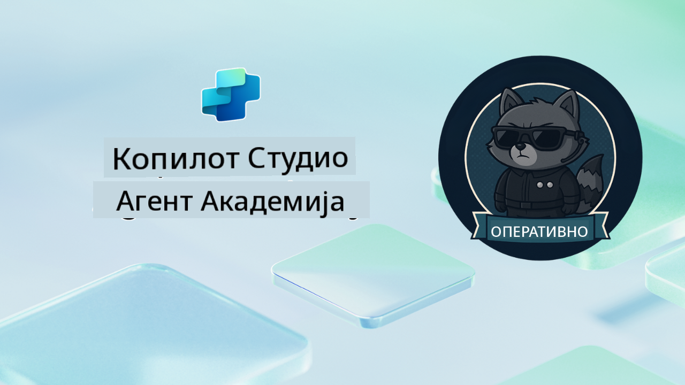

<!--
CO_OP_TRANSLATOR_METADATA:
{
  "original_hash": "24fcbe9a57d3439e05f8866e550c0a84",
  "translation_date": "2025-10-20T22:42:05+00:00",
  "source_file": "docs/operative-preview/README.md",
  "language_code": "sr"
}
-->
# Добродошли, Оперативче

**Добродошли, оперативче.**  
Ваша напредна мисија—ако одлучите да је прихватите—јесте да савладате уметност креирања **мулти-агентских система за предузећа** користећи **Microsoft Copilot Studio**.

Ова интензивна обука вас води даље од основног креирања агената у сложени свет **оркестрације мулти-агената**: од аутоматизације запошљавања до безбедности вештачке интелигенције, научићете како да изградите, координирате и примените интелигентне екосистеме агената користећи реалне сценарије из предузећа.

--8<-- "disclaimer.md"

---

## 🎯 Циљ Мисије

Завршетком програма Agent Academy Operative, бићете у могућности да:

- Дизајнирате и имплементирате **мулти-агентске системе** за сложене пословне сценарије
- Савладате **оркестрацију агената** и обрасце сарадње
- Имплементирате **безбедност вештачке интелигенције и модерацију садржаја** у производним системима
- Креирате **мултимодалне упите** за обраду и анализу докумената
- Примените **агенте спремне за предузећа** уз одговарајуће управљање и тестирање

---

## 🧪 Предуслови

Да бисте завршили све мисије, потребно је:

- Завршена обука **Agent Academy Recruit**
- Microsoft Power Platform окружење са **Copilot Studio** лиценцом
- Приступ **Microsoft Dataverse**
- Административне дозволе за креирање решења и агената

---

## 🧬 За кога је намењено

Ова напредна обука је идеална за:

- **Архитекте решења** који дизајнирају AI системе за предузећа
- **Програмере** који креирају решења агената спремна за производњу
- **ИТ професионалце** који имплементирају управљање и безбедност AI
- **Пословне аналитичаре** који креирају сложене аутоматизоване токове рада
- Свакога ко је спреман да **унапреди своје знање** од основних агената до предузетничких система

---

## 🧭 Преглед Курикулума

Ова академија је структурирана као прогресивна серија теренских операција—свака мисија се надовезује на претходну како би се креирао свеобухватан систем за аутоматизацију запошљавања.

| Мисија | Наслов | Оперативни Брифинг |
|--------|--------|--------------------|
| `01` | 🚨 [Почните са агентом за запошљавање](./01-get-started/README.md) | Примените основну инфраструктуру и креирајте ваш централни оркестратор агент |
| `02` | 🎭 [Припремите вашег агента за мулти-агентски рад са повезаним агентима](./02-multi-agent/README.md) | Претворите једног агента у координирани мулти-агентски систем |
| `03` | ⚡ [Аутоматизујте вашег агента помоћу тригера](./03-automate-triggers/README.md) | Имплементирајте аутономно понашање агента помоћу тригера заснованих на догађајима |
| `04` | 📝 [Писање инструкција за агента](./04-agent-instructions/README.md) | Савладајте прецизну комуникацију и контролу понашања агента |
| `05` | 💬 [Персонализација одговора агента](./05-agent-responses/README.md) | Прилагодите одговоре агента за максималан утицај и ангажовање |
| `06` | 🛡️ [Основе модерације садржаја и безбедности AI](./06-ai-safety/README.md) | Имплементирајте безбедносне и комплајанс мере на нивоу предузећа |
| `07` | 🎨 [Екстракција садржаја из биографија помоћу мултимодалних упита](./07-multimodal-prompts/README.md) | Обрађујте документе и слике уз напредне AI могућности |
| `08` | 🗄️ [Упити - Основа у Dataverse](./08-dataverse-grounding/README.md) | Осигурајте тачност одговора агената уз податке из предузећа |
| `09` | 🧠 [Примена дубоког резоновања за процену кандидата и припрему интервјуа](./09-deep-reasoning/README.md) | Имплементирајте софистицирано AI резоновање за сложене одлуке |
| `10` | 📄 [Генеришите интервју документацију специфичну за кандидата помоћу упита](./10-generate-documents/README.md) | Креирајте динамичне документе на основу анализе агента |
| `11` | 📊 [Прикупите повратне информације корисника помоћу адаптивних картица](./11-obtain-user-feedback/README.md) | Прикупите и обрадите повратне информације корисника за континуирано унапређење |
| `12` | 🌐 [Објавите ваше агенте на демо вебсајту за тестирање од стране заинтересованих страна](./12-demo-website/README.md) | Примените комплетно решење за демонстрацију и тестирање од стране заинтересованих страна |

!!! note
    ✅ Завршетком овог курикулума добијате значку **Operative**.  
    🔓 **Commander** ће бити доступан у будућим фазама.

<!-- markdownlint-disable-next-line MD033 -->

---

**Одрицање од одговорности**:  
Овај документ је преведен помоћу услуге за превођење вештачке интелигенције [Co-op Translator](https://github.com/Azure/co-op-translator). Иако настојимо да обезбедимо тачност, молимо вас да имате у виду да аутоматски преводи могу садржати грешке или нетачности. Оригинални документ на његовом изворном језику треба сматрати ауторитативним извором. За критичне информације препоручује се професионални превод од стране људи. Не преузимамо одговорност за било каква погрешна тумачења или неспоразуме који могу настати услед коришћења овог превода.