<!--
CO_OP_TRANSLATOR_METADATA:
{
  "original_hash": "d9cd8cd1a4fbd8915171a2ed972cc322",
  "translation_date": "2025-10-21T00:04:52+00:00",
  "source_file": "docs/recruit/00-course-setup/README.md",
  "language_code": "sr"
}
-->
# 🚨 Мисија 00: Подешавање курса

## 🕵️‍♂️ КОДНО ИМЕ: `ОПЕРАЦИЈА СПРЕМНОСТ ЗА ДЕПЛОЈМЕНТ`

> **⏱️ Време трајања операције:** `~30 минута`  

## 🎯 Опис мисије

Добродошли у прву мисију вашег тренинга као агент Copilot Studio.  
Пре него што почнете са креирањем вашег првог AI агента, потребно је да успоставите **развојно окружење спремно за терен**.

Овај водич објашњава системе, приступне акредитиве и кораке подешавања који су потребни за успешно функционисање у екосистему Microsoft 365.

## 🔎 Циљеви

Ваша мисија укључује:

1. Добијање Microsoft 365 налога  
1. Приступ Microsoft Copilot Studio  
1. (Опционо) Обезбеђивање Microsoft 365 Copilot лиценце за продукцијско објављивање  
1. Креирање развојног окружења као вашег Copilot Studio окружења за рад  
1. Креирање SharePoint сајта који ће служити као извор података у наредним мисијама  

---

## 🔍 Предуслови

Пре него што почнете, уверите се да имате:

1. **Емаил адресу за посао или школу** (личне адресе као што су @outlook.com, @gmail.com, итд., нису подржане).  
1. Приступ интернету и модеран претраживач (Edge, Chrome или Firefox се препоручују).  
1. Основно познавање Microsoft 365 (на пример, пријављивање у Office апликације или Teams).  
1. (Опционо) Кредитну картицу или начин плаћања ако планирате да купите плаћене лиценце.

---

## Корак 1: Добијање Microsoft 365 налога

Copilot Studio се налази у оквиру Microsoft 365, па вам је потребан Microsoft 365 налог за приступ. Можете користити постојећи налог ако га већ имате или следити ове кораке да бисте добили одговарајућу лиценцу:

1. **Набавите плаћену Microsoft 365 Business претплату**  
   1. Идите на [Microsoft 365 Business Plans and Pricing Page](https://www.microsoft.com/microsoft-365/business/microsoft-365-plans-and-pricing)  
   1. Најјефтинија опција за почетак је Microsoft 365 Business Basic план. Изаберите `Try for free` и пратите упутства за попуњавање детаља о претплати, налогу и плаћању.  
   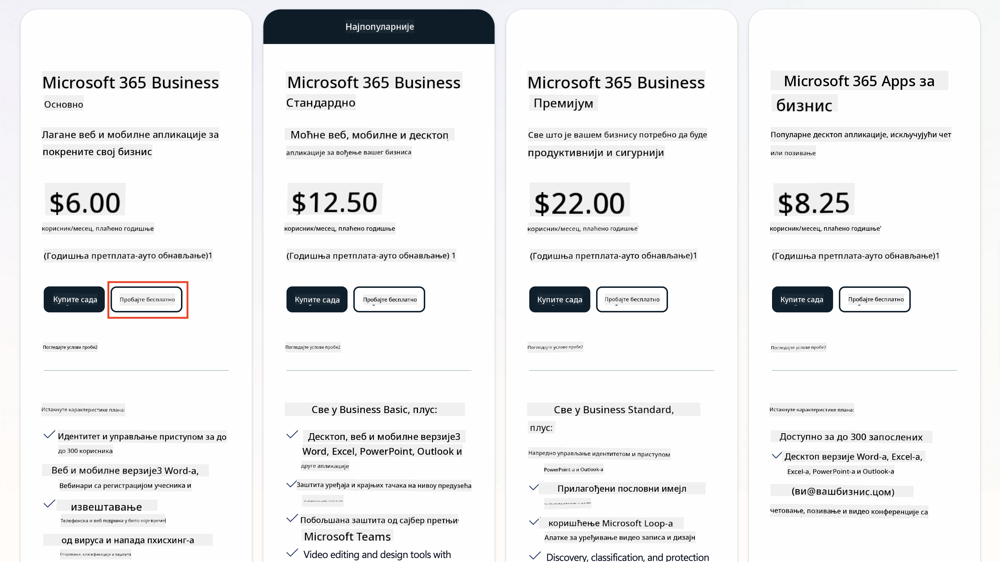  
   1. Када добијете нови налог, пријавите се.

    !!! Tip
        Ако планирате да објављујете агенте у Microsoft 365 Copilot Chat или да се повежете са организационим подацима (SharePoint, OneDrive, Dataverse), потребна је Microsoft 365 Copilot лиценца. Ово је додатна лиценца о којој можете сазнати више [на сајту за лиценцирање](https://www.microsoft.com/microsoft-365/copilot#plans).

---

## Корак 2: Започните пробни период за Copilot Studio

Када добијете свој Microsoft 365 Tenant, потребно је да добијете приступ Copilot Studio. Можете добити бесплатан пробни период од 30 дана пратећи ове кораке:

1. Идите на [aka.ms/TryCopilotStudio](https://aka.ms/TryCopilotStudio).  
1. Унесите емаил адресу новог налога који сте конфигурисали у претходном кораку и изаберите `Next`.  
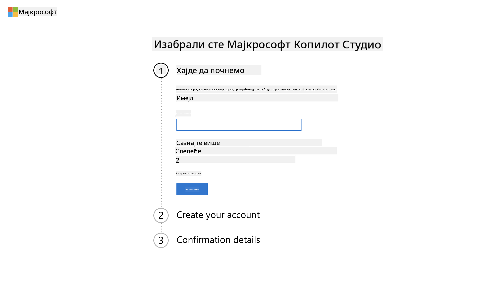  
1. Требало би да препозна ваш налог. Изаберите `Sign In`.  
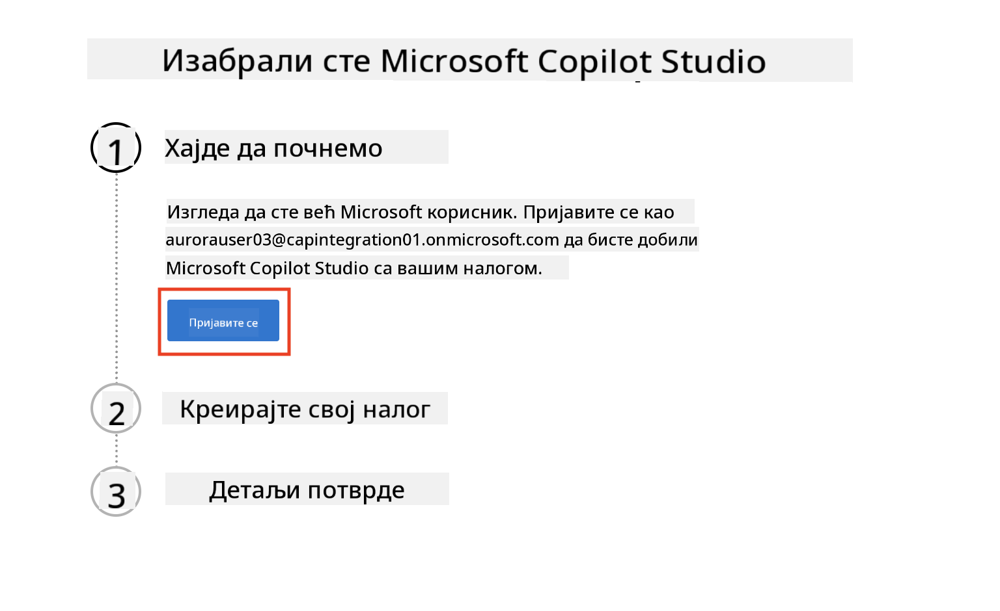  
1. Изаберите `Start Free Trial`.  
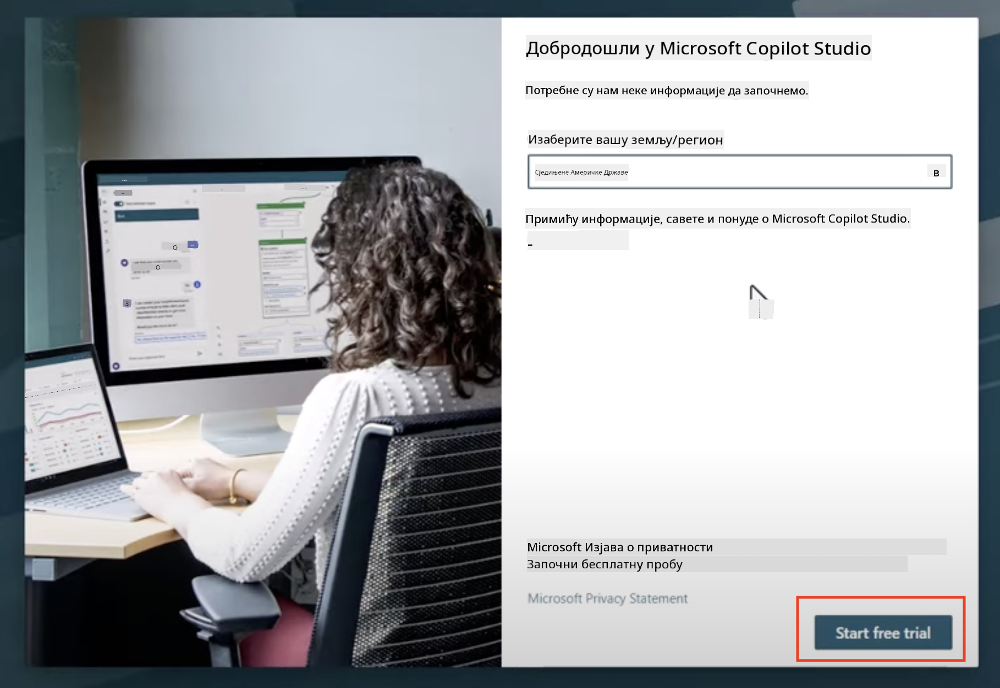

!!! info "Напомене о пробном периоду"  
     1. Бесплатни пробни период пружа **потпуне могућности Copilot Studio**.  
     1. Добијаћете емаил обавештења о истеку пробног периода. Можете продужити пробни период у интервалима од 30 дана (до 90 дана рада агента).  
     1. Ако је ваш администратор тенанта онемогућио самостално пријављивање, видећете грешку—контактирајте свог Microsoft 365 администратора да га поново омогући.

---

## Корак 3: Креирајте ново развојно окружење

### Пријавите се за Power Apps Developer Plan

Користећи исти Microsoft 365 tenant из Корака 1, пријавите се за Power Apps Developer Plan да бисте креирали бесплатно развојно окружење за рад и тестирање са Copilot Studio.

1. Пријавите се на [Power Apps Developer Plan вебсајт](https://aka.ms/PowerAppsDevPlan).

    - Унесите вашу емаил адресу  
    - Означите поље  
    - Изаберите **Start free**

    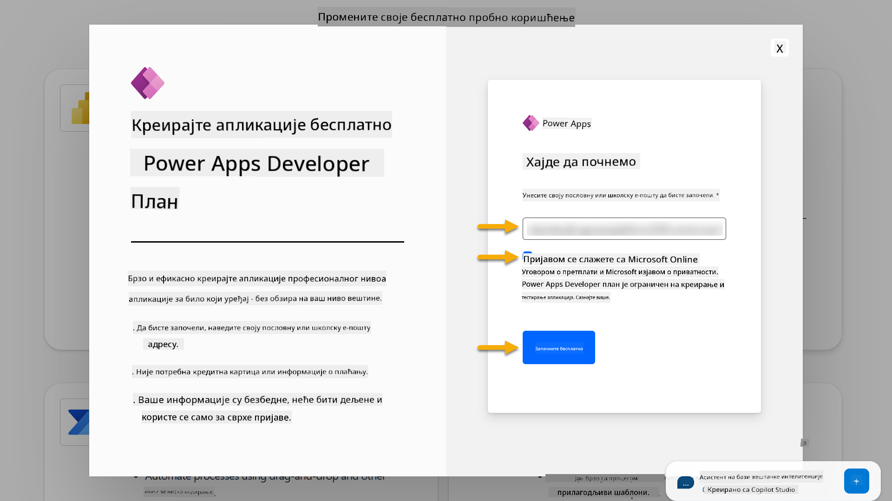

1. Након пријаве за Developer Plan, бићете преусмерени на [Power Apps](https://make.powerapps.com/). Окружење користи ваше име, на пример **Adele Vance's environment**. Ако већ постоји окружење са тим именом, ново окружење ће бити названо **Adele Vance's (1)** environment.

    Користите ово развојно окружење у Copilot Studio приликом завршетка лабораторија.

!!! Note
    Ако користите постојећи Microsoft 365 налог и нисте креирали нови у Кораку 1, на пример - користећи свој налог у вашој радној организацији, ваш IT администратор (или еквивалентни тим) који управља вашим тенантом/окружењима можда је онемогућио процес пријављивања. У том случају, контактирајте свог администратора или креирајте тестни тенант као што је описано у Кораку 1.

---

## Корак 4: Креирајте нови SharePoint сајт

Потребно је креирати нови SharePoint сајт који ће се користити у [Лекцији 06 - Креирање прилагођеног агента користећи конверзацијско искуство са Copilot-ом и повезивање са вашим подацима](../06-create-agent-from-conversation/README.md#62-add-an-internal-knowledge-source-using-a-sharepoint-site).

1. Изаберите икону вафла у горњем левом углу Microsoft Copilot Studio да бисте видели мени. Изаберите SharePoint из менија.

    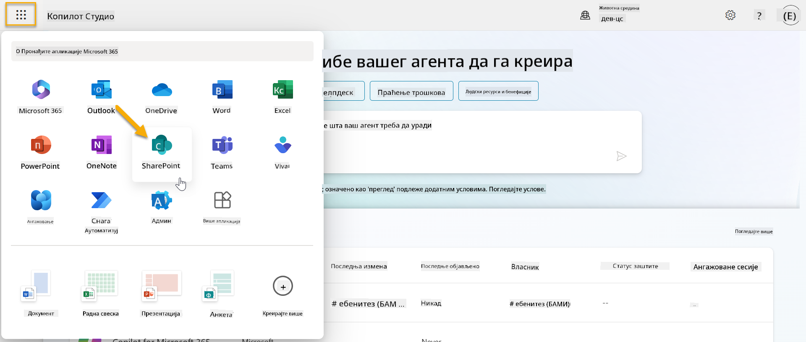

1. SharePoint ће се учитати. Изаберите **+ Create site** да бисте креирали нови SharePoint сајт.

    

1. Појавиће се дијалог који ће вас водити кроз процес креирања новог SharePoint сајта. Изаберите **Team site**.

    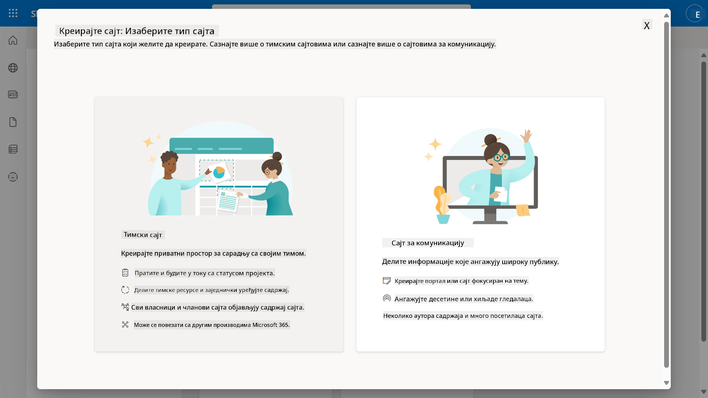

1. У следећем кораку, листа Microsoft шаблона ће се учитати по подразумеваним подешавањима. Скролујте надоле и изаберите шаблон **IT help desk**.

    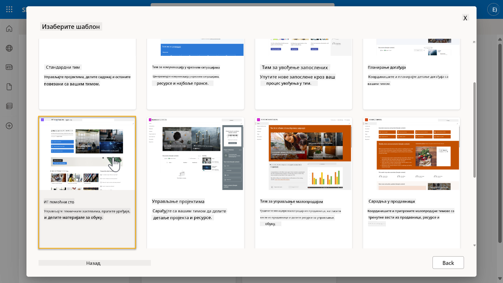

1. Изаберите **Use template** да бисте креирали нови SharePoint сајт користећи шаблон IT help desk.

    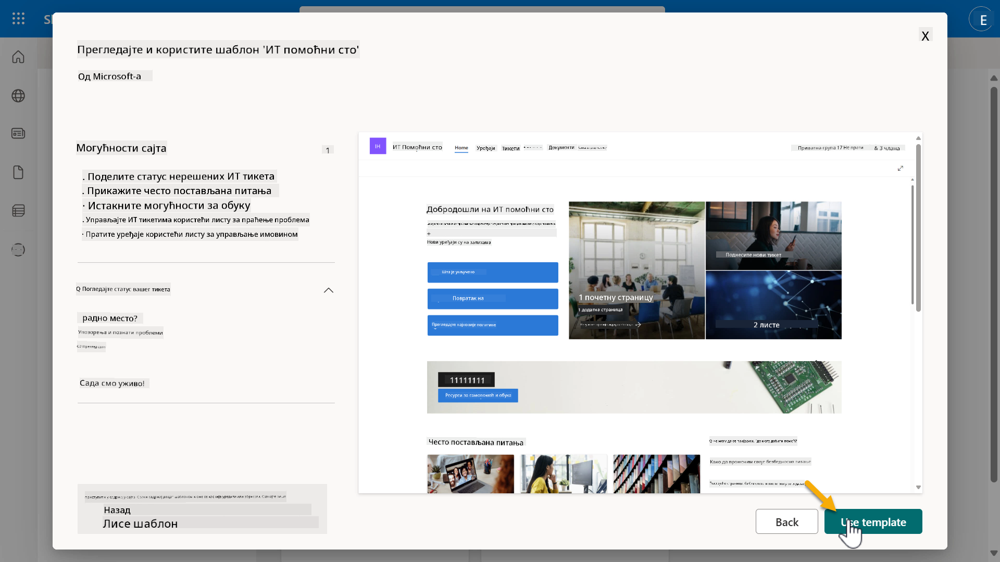

1. Унесите информације за ваш сајт. Следећи је пример:

    | Поље | Вредност |
    | --- | --- |
    | Име сајта | Contoso IT |
    | Опис сајта | Copilot Studio за почетнике |
    | Адреса сајта | ContosoIT |

    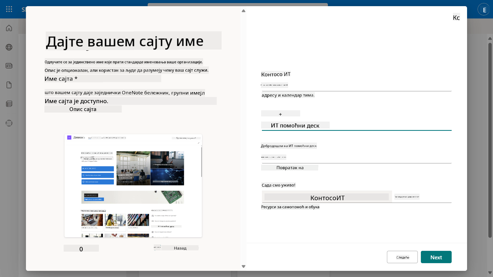

1. У последњем кораку, можете изабрати језик за SharePoint сајт. По подразумеваним подешавањима биће **Енглески**. Оставите језик као **Енглески** и изаберите **Create site**.

    

1. SharePoint сајт ће се креирати у наредних неколико секунди. У међувремену, можете додати друге кориснике на ваш сајт уношењем њихове емаил адресе у поље **Add members**. Када завршите, изаберите **Finish**.

    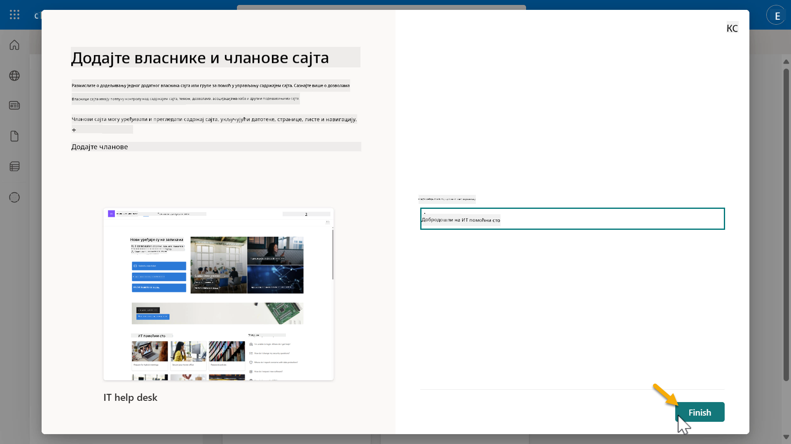

1. Почетна страница SharePoint сајта ће се учитати. **Копирајте** URL адресе SharePoint сајта.

1. Овај шаблон пружа странице са примерима података о различитим IT политикама и две пример листе (Tickets и Devices).

### Користите Devices SharePoint листу

Користићемо **Devices** листу у [Мисији 07 - Додавање нове теме са тригером и чворовима](../07-add-new-topic-with-trigger/README.md#73-add-a-tool-using-a-connector).

### Додајте нову колону

Скролујте до краја листе и изаберите дугме **+ Add column**. Изаберите тип **hyperlink**, унесите **Image** као име колоне и изаберите додавање.

### Креирајте пример података у Devices SharePoint листи

Потребно је да попуните ову листу са најмање 4 примерка података и додате још једну колону у ову листу.  

Када додајете пример података, уверите се да су следећа поља попуњена:

- Фотографија уређаја - користите слике из [фолдера са сликама уређаја](https://github.com/microsoft/agent-academy/tree/main/docs/recruit/00-course-setup/images/device-images)  
- Наслов  
- Статус  
- Произвођач  
- Модел  
- Тип уређаја  
- Боја  
- Серијски број  
- Датум куповине  
- Цена куповине  
- Број наруџбине  
- Слика - користите следеће линкове  

|Уређај  |URL  |
|---------|---------|
|Surface Laptop 13     | [https://raw.githubusercontent.com/microsoft/agent-academy/refs/heads/main/docs/recruit/00-course-setup/images/device-images/Surface-Laptop-13.png](https://raw.githubusercontent.com/microsoft/agent-academy/refs/heads/main/docs/recruit/00-course-setup/images/device-images/Surface-Laptop-13.png)        |
|Surface Laptop 15     | [https://raw.githubusercontent.com/microsoft/agent-academy/refs/heads/main/docs/recruit/00-course-setup/images/device-images/Surface-Laptop-15.png](https://raw.githubusercontent.com/microsoft/agent-academy/refs/heads/main/docs/recruit/00-course-setup/images/device-images/Surface-Laptop-15.png)        |
|Surface Pro    | [https://raw.githubusercontent.com/microsoft/agent-academy/refs/heads/main/docs/recruit/00-course-setup/images/device-images/Surface-Pro-12.png](https://raw.githubusercontent.com/microsoft/agent-academy/refs/heads/main/docs/recruit/00-course-setup/images/device-images/Surface-Pro-12.png)        |
|Surface Studio    | [https://raw.githubusercontent.com/microsoft/agent-academy/refs/heads/main/docs/recruit/00-course-setup/images/device-images/Surface-Studio.png](https://raw.githubusercontent.com/microsoft/agent-academy/refs/heads/main/docs/recruit/00-course-setup/images/device-images/Surface-Studio.png)        |

---

## ✅ Мисија завршена

Успешно сте:

- Подесили Microsoft 365 развојно окружење  
- Активирали пробни период за Copilot Studio  
- Креирали SharePoint сајт за повезивање агената  
- Попунили Devices листу за употребу у будућим мисијама  

Званично сте спремни да започнете своју **обуку агента на нивоу регрута** у [Лекцији 01](../01-introduction-to-agents/README.md).  

<!-- markdownlint-disable-next-line MD033 -->

---

**Одрицање од одговорности**:  
Овај документ је преведен помоћу услуге за превођење вештачке интелигенције [Co-op Translator](https://github.com/Azure/co-op-translator). Иако настојимо да обезбедимо тачност, молимо вас да имате у виду да аутоматски преводи могу садржати грешке или нетачности. Оригинални документ на његовом изворном језику треба сматрати ауторитативним извором. За критичне информације препоручује се професионални превод од стране људи. Не преузимамо одговорност за било каква погрешна тумачења или неспоразуме који могу настати услед коришћења овог превода.