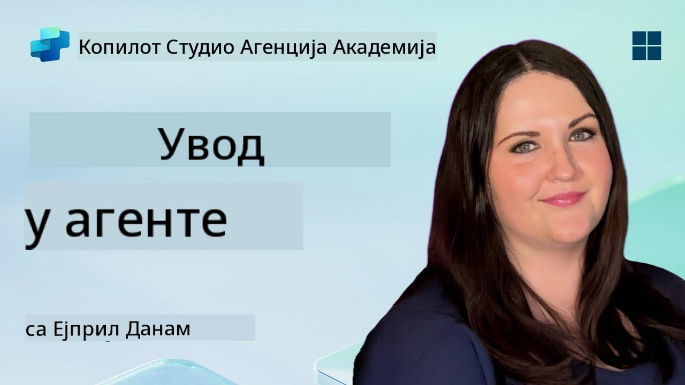

<!--
CO_OP_TRANSLATOR_METADATA:
{
  "original_hash": "d6706e107678264168d77b2e107710b1",
  "translation_date": "2025-10-20T23:32:20+00:00",
  "source_file": "docs/recruit/01-introduction-to-agents/README.md",
  "language_code": "sr"
}
-->
# 🚨 Мисија 01: Увод у агенте

## 🕵️‍♂️ КОДНО ИМЕ: `ОПЕРАЦИЈА ДЕКОДИРАЊЕ АИ АГЕНТА`

> **⏱️ Време трајања операције:** `~30 минута – само информације, без теренског рада`

🎥 **Погледајте видео водич**

## 🎯 Опис мисије

Добродошли, регруте. Пре него што се упустимо у креирање агената, потребно је да добро разумете концепте вештачке интелигенције који их покрећу. Ова мисија ће вас опремити основним знањем о конверзацијској вештачкој интелигенцији, великим језичким моделима (LLMs), генерацији уз помоћ претраживања (RAG) и типовима агената које можете креирати у Copilot Studio.

## 🔎 Циљеви

У овој мисији ћете научити:

1. Шта је конверзацијска вештачка интелигенција и зашто је важна  
1. Како велики језички модели (LLMs) покрећу искуства у чету  
1. Шта генерација уз помоћ претраживања (RAG) доноси  
1. Разлику између конверзацијских агената и аутономних агената  
1. Како агенти у Copilot Studio користе ове концепте  

Хајде да почнемо!

---

## Шта је конверзацијска вештачка интелигенција?

Конверзацијска вештачка интелигенција се односи на било који систем који може да разуме, обрађује и одговара на људски језик – било текст или говор – на начин који делује природно. Помислите на четботове у корисничким сервисима или виртуелне личне асистенте у вашим омиљеним апликацијама. У основи, већина савремених конверзацијских АИ система се ослања на велике језичке моделе (LLMs), о којима ћемо говорити у наставку.

### Зашто је важно

- **Корисничко искуство:** Конверзацијски интерфејси су често интуитивнији од кликања кроз меније.  
- **Скалабилност:** Један агент може да обради десетине или стотине истовремених разговора.  
- **Ефикасност:** Уместо креирања прилагођених скрипти заснованих на правилима, агенти који користе LLM могу се прилагодити у ходу на основу уноса корисника.  
- **Проширивост:** Уз прави дизајн, агенти могу приступити базама знања, повезати се са API-јевима или деловати као „дигиталне колеге“ у пословним процесима.

---

## Велики језички модели (LLMs) 101

У основи већине конверзацијских АИ система налазе се **велики језички модели** – неуронске мреже обучене на огромним корпусима текста. Они уче статистичке обрасце језика како би могли да генеришу кохерентне реченице, одговарају на питања или чак дају идеје. Кључне тачке које треба разумети:

1. **Тренинг подаци:** LLM-ови обрађују терабајте текста (веб странице, књиге, чланке). Ово „светско знање“ им омогућава да одговарају на многе теме.  
1. **Токенизација:** Текст се дели на мање јединице назване токени (речи, делови речи или карактери). Модел предвиђа један токен по један.  
1. **Прозор контекста:** Сваки LLM има ограничење на број токена које може „видети“ одједном. Преко тог ограничења, претходни токени се одсецају.  
1. **Промптинг:** Са LLM-ом комуницирате слањем промпта. Што је ваш промпт бољи, то је одговор фокусиранији и релевантнији.  
1. **Zero-shot vs. Fine-tuning:** Zero-shot значи коришћење LLM-а у његовом изворном облику (само сирови параметри). Fine-tuning значи прилагођавање модела на податке специфичне за домен како би одговори били прецизнији за ваше потребе.

!!! Tip "Савет"
    Уобичајена аналогија је да је LLM попут „супер паметног аутокомплита.“ Не разуме истински значење као људски мозак, али је изузетно добар у предвиђању следеће најбоље речи (или фразе) у низу.

---

## Генерација уз помоћ претраживања (RAG)

Када се LLM-ови ослањају искључиво на статичке тренинг податке, могу да „халуцинирају“ или постану застарели. RAG решава овај проблем омогућавајући моделу да „потражи“ свежу информацију пре него што састави одговор. На високом нивоу, RAG функционише овако:

1. **Кориснички упит:** Корисник поставља питање (нпр. „Шта је ново у кварталним зарадама компаније Contoso?“).  
1. **Корак претраживача:** Систем претражује извор знања (документе, интерне базе података, библиотеке SharePoint-а итд.) како би пронашао релевантне пасусе.  
1. **Допуна:** Пронађени пасуси се додају или постављају пре промпта LLM-у.  
1. **Генерација:** LLM обрађује и питање корисника и пронађени контекст, а затим генерише одговор заснован на ажурираним подацима.  

Са RAG-ом, ваш агент може да приступи интерним викијима компаније, API-јевима за додатке или да претражује базу знања FAQ – и да врати одговоре који нису ограничени на статички објављене параметре модела.

---

## Конверзацијски vs. Аутономни агенти

У контексту Copilot Studio, термин **агент** може се односити на различите типове АИ асистената. Корисно је направити разлику између:

**Конверзацијски агенти:**

- Првенствено се фокусирају на двосмерни дијалог.  
- Чувају контекст током више корака у разговору.  
- Обично се оркестрирају кроз унапред дефинисане токове или тригере (нпр. „Ако корисник каже X, одговори са Y“).  
- Идеални за корисничку подршку, FAQ, вођене интеракције, заказивање или једноставна питања и одговоре.  
  - Примери:  
    - Четбот за Teams који одговара на питања о HR политици.  
    - Bot за Power Virtual Agents на страници SharePoint-а који води кориснике кроз формулар.  

**Аутономни агенти:**

- Иду даље од дијалога; могу **предузимати радње** у име корисника.  
- Користе циклусе размишљања LLM-а (замислите „планирај → делуј → посматрај → поново планирај“) за обављање задатака.  
- Повезују се са спољним алатима или API-јевима (нпр. покрећу Power Automate ток, шаљу позивнице за календар, манипулишу подацима у Dataverse-у).  
- Раде без сталних људских упита – када се активирају, могу самостално обављати процес са више корака.  
  - Примери:  
    - Агент који генерише план путовања, резервише летове и шаље потврде путем е-поште.  
    - Агент „Сажетак састанка“ који се придружује позиву на Teams-у, транскрибује га у реалном времену и пише извршни сажетак у OneNote.  

!!! Info "Кључна разлика"
    Конверзацијски агенти чекају унос корисника и држе се дијалога. Аутономни агенти проактивно планирају и извршавају низ корака користећи шири приступ алатима.

---

## Агенти у Copilot Studio

**Copilot Studio** обједињује и конверзацијске и аутономне сценарије у један оквир. Ево како Copilot Studio помаже у креирању агената:

1. **Визуелни дизајнер агената:** Платформа са мало кода за дефинисање промпта, меморије и алата за чет и радне токове.  
1. **Конфигурације LLM-а:** Изаберите између различитих OpenAI модела или Microsoft-овог GPT-а за предузећа како бисте ускладили перформансе и трошкове.  
1. **Конектори за претраживање:** Унапред припремљене интеграције за SharePoint, OneDrive, Azure Cognitive Search и Dataverse, омогућавајући RAG одмах.  
1. **Прилагођени алати и функције:** Дефинишите прилагођене HTTP радње или Power Automate токове које ваш агент може аутономно позвати.  
1. **Подршка за више модалитета:** Поред текста, агенти Copilot Studio могу обрађивати слике, датотеке или структуриране податке за обогаћивање контекста.  
1. **Објављивање и дистрибуција:** Када је ваш агент спреман, можете га објавити на Microsoft 365 Copilot (тако да га корисници могу позвати у Teams-у, SharePoint-у, Outlook-у итд.) или га уградити као самостални чет видџет на веб страници.

---

## 🎉 Мисија завршена

Сада сте завршили свој увод у агенте и основне концепте вештачке интелигенције. Разумете:

1. **LLMs = „Мозак“ вашег агента**  
   - Одговоран за разумевање језика и његово генерисање.  
   - Више токена = богатији контекст, али и већи трошкови по позиву.  

1. **RAG = Интеграција знања у реалном времену**  
   - Превазилази јаз између статичког LLM-а и стално променљивих извора података.  
   - Претражује и убацује релевантне документе или записе у промпт LLM-а.  

1. **Конверзацијски vs. Аутономни**  
   - **Конверзацијски:** Фокусирају се на ток дијалога и чување контекста (нпр. „Меморија сесије“).  
   - **Аутономни:** Додају „Блокове радњи“ који омогућавају агенту да позива спољне алате или услуге.

---
У наставку ћете истражити [основе Copilot Studio](../02-copilot-studio-fundamentals/README.md)!

Останите фокусирани, регруте - ваше АИ путовање тек почиње!

## 📚 Тактички ресурси

🔗 [Почетна страница документације Copilot Studio](https://learn.microsoft.com/microsoft-copilot-studio/)

---

---

**Одрицање од одговорности**:  
Овај документ је преведен помоћу услуге за превођење вештачке интелигенције [Co-op Translator](https://github.com/Azure/co-op-translator). Иако настојимо да обезбедимо тачност, молимо вас да имате у виду да аутоматски преводи могу садржати грешке или нетачности. Оригинални документ на изворном језику треба сматрати ауторитативним извором. За критичне информације препоручује се професионални превод од стране људи. Не преузимамо одговорност за било каква погрешна тумачења или неспоразуме који могу настати услед коришћења овог превода.