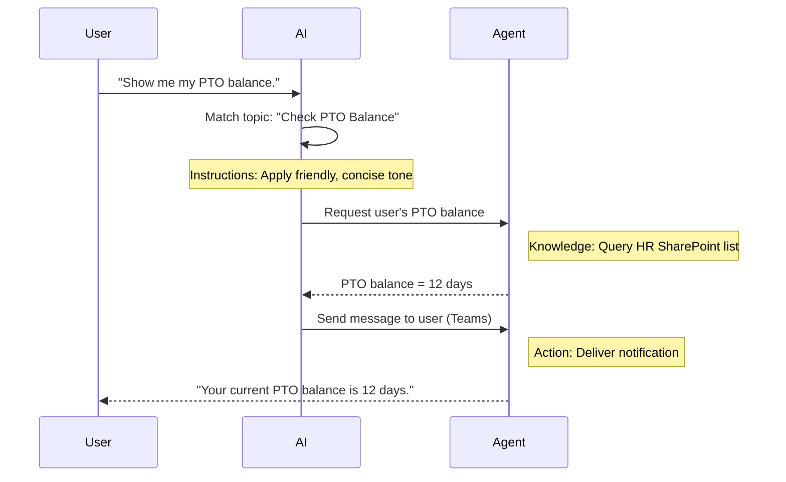

<!--
CO_OP_TRANSLATOR_METADATA:
{
  "original_hash": "90a3c5122f5687bbc8cc819990f175d4",
  "translation_date": "2025-10-20T23:55:07+00:00",
  "source_file": "docs/recruit/02-copilot-studio-fundamentals/README.md",
  "language_code": "sr"
}
-->
# 🚨 Мисија 02: Основе Copilot Studio

## 🕵️‍♂️ КОДНО ИМЕ: `ОПЕРАЦИЈА ОСНОВНИ ПРОТОКОЛ`

> **⏱️ Време трајања операције:** `~30 минута – само информације, без теренског рада`  

🎥 **Погледајте видео водич**

[](https://www.youtube.com/watch?v=x4OCwDRGeLE "Погледајте водич на YouTube-у")

## 🎯 Опис мисије

Добродошли, регруте. Ова мисија ће вас опремити основним информацијама за разумевање како функционише Copilot Studio и како да изградите интелигентне агенте који доносе стварну пословну вредност.

Пре него што направите свог првог агента, потребно је да разумете четири кључне компоненте које чине сваког прилагођеног AI агента: Знање, Алатке, Теме и Упутства. Такође ћете научити како ови елементи раде заједно у оркестратору Copilot Studio.

## 🔎 Циљеви

У овој мисији, научићете:

- **Шта је Copilot Studio**
- **Када и зашто користити агенте**
- **Истражите четири грађевинска блока агената**
      - **Знање**
      - **Алатке**
      - **Теме**
      - **Упутства**
- **Разумети како ове компоненте раде заједно** да би се створио интелигентан, аутоматизован агент

---

## Шта су агенти у Copilot Studio?

**Агент** је специјализовани AI асистент који дизајнирате да обавља одређене задатке или одговара на упите. За разлику од општег чет-бота, ваш агент:

- **Познаје специфичне податке компаније** (политике, документа, базе података)  
- **Извршава стварне задатке** (шаље поруке, креира догађаје у календару, ажурира записе)  
- **Одржава контекст разговора** како би могао да прати претходна питања  

Пошто је Copilot Studio ниско-кодна платформа, можете превлачити и испуштати унапред направљене компоненте—без потребе за дубоким знањем програмирања. Када направите агента, људи могу да га користе унутар Teams-а, Slack-а или чак на прилагођеном веб сајту како би добили одговоре или аутоматски покренули радне токове.

---

## Када и зашто користити Copilot Studio

Док Microsoft 365 Copilot пружа општу AI помоћ у апликацијама Office-а, прилагођени агент је потребан када:

### Потребно вам је знање специфично за домен

- Уграђени Copilot можда неће знати унутрашње процедуре или податке ваше компаније. Агент може да претражује ваше SharePoint сајтове, базе података или прилагођене изворе како би пружио тачне и ажурне одговоре.  

### Желите да аутоматизујете радне токове у више корака

- На пример: "Када неко поднесе трошак, пошаљите га на одобрење, ажурирајте финансијски трацкер и обавестите менаџера." Прилагођени агент може да обави сваки корак, покренут једном командом или догађајем.  

### Потребно вам је контекстуално искуство у алату  

- Замислите агента за увођење нових запослених у Teams-у који води HR особље кроз сваку политику, шаље потребне формуларе и заказује оријентационе састанке—директно унутар вашег постојећег платформе за сарадњу.  

---

## Четири грађевинска блока агента

Сваки Copilot Studio агент је изграђен од четири основне компоненте:

1. **Знање**  
1. **Алатке (Акције)**  
1. **Теме**  
1. **Упутства**

У наставку ћемо дефинисати сваки грађевински блок и показати како они раде заједно да би се направио ефикасан агент.

### 1. Знање

**Знање** представља податке и контекст који ваш агент користи да би тачно одговарао на питања. Састоји се из два дела:

#### Прилагођена упутства и контекст

- Напишете кратак опис сврхе и тона агента. На пример:  

    ```text
    You are an IT support agent. You help employees troubleshoot common software issues, provide troubleshooting steps, and escalate urgent tickets.
    ```

- Током разговора, агент памти претходне кораке како би могао да се врати на оно што је већ било дискутовано (на пример, ако корисник прво каже: "Мој штампач не ради," а затим пита: "Да ли сте проверили ниво мастила?" агент се сећа контекста штампача).

#### Извори знања (основни подаци)

- Повезујете свог агента са више извора података—SharePoint библиотекама, сајтовима са документацијом, викијима или другим базама података.  
- Када корисник постави питање, агент извлачи релевантне делове из тих извора како би одговори били **засновани** на стварним политикама, приручницима производа или било којим власничким информацијама ваше организације.  
- Можете чак и да натерате агента да одговара само информацијама из тих извора, спречавајући га да нагађа или "измишља" одговоре.

!!! пример
    Агент "Асистент за политике" може бити повезан са вашим HR SharePoint сајтом. Ако корисник пита: "Која је наша стопа акумулације годишњег одмора?" агент ће извући тачан текст из HR документа о политици, уместо да се ослања на генерички AI одговор.

---

### 2. Алатке (Акције)

**Алатке (Акције)** дефинишу шта агент може да уради осим разговора. Свака акција је задатак који агент програмски извршава, као што су:

- Слање е-поште или поруке у Teams-у  
- Креирање или ажурирање догађаја у календару  
- Додавање или уређивање записа у бази података (нпр. SharePoint листа или Dataverse табела)  
- Позивање Power Automate тока или REST API-ја  

#### Како акције функционишу

- **Дефинисање улазних и излазних параметара**  
      - На пример, акција Слање е-поште може захтевати:  
        - `RecipientEmailAddress`  
        - `SubjectLine`  
        - `EmailBody`  

- **Комбиновање акција у радне токове**  
      - Често, испуњавање захтева корисника укључује више корака.  
      - Можете секвенцирати акције тако да:  
             1. Агент извуче податке из SharePoint листе.  
             2. Генерише резиме користећи LLM.  
             3. Пошаље Teams поруку са тим резимеом.  

- **Повезивање са спољним системима**  
      - Ако треба да ажурирате CRM или позовете интерни API, креирајте прилагођену акцију за то.  
      - Copilot Studio може да се интегрише са Power Platform-ом или било којим HTTP заснованим крајњим тачкама.

!!! пример "Агент "Помоћник за трошкове" могао би:"  
    1. Слушати захтев "Поднеси трошак."  
    2. Преузети детаље трошка корисника из формулара.  
    3. Користити акцију "Додај у SharePoint листу" да би сачувао податке.  
    4. Покренути акцију "Пошаљи е-пошту" да би обавестио одобраваоца.  

---

### 3. Теме

**Теме** дефинишу разговорне окидаче или улазне тачке за вашег агента. Свака тема одговара делу функционалности или категорији питања.

#### Разговорни окидачи  

- Тема може бити "Поднеси IT тикет," "Провери стање годишњег одмора," или "Креирај извештај о продаји."  
- У позадини, Copilot Studio користи **генеративну оркестрацију**: уместо да се ослања на тачне кључне речи, AI тумачи намеру корисника и бира праву тему на основу кратког описа који пружите.  

#### Опис теме  

- У свакој теми, напишете јасан, концизан опис онога што та тема покрива.

!!! пример "Пример описа теме"
    Ова тема помаже корисницима да поднесу IT тикет за подршку прикупљањем детаља о проблему, приоритету и контакт информација.

- AI користи тај опис да одлучи када да активира ову тему, чак и ако формулација корисника не одговара тачно.

#### Повезивање тема са акцијама  

- Свака тема је повезана са једном или више акција или корака за преузимање података.  
- Када AI изабере тему, води разговор кроз секвенцу коју сте дефинисали (поставља додатна питања, позива акције, враћа резултате).

!!! пример
    Ако корисник каже: "Треба ми помоћ са подешавањем новог лаптопа," AI може да повежe ту намеру са темом "Поднеси IT тикет." Агент затим пита за модел лаптопа, детаље о кориснику и аутоматски уноси тикет у систем за подршку.

---

### 4. Упутства

**Упутства** (понекад названа "Подстицаји" или "Системске поруке") воде тон, стил и границе LLM-а. Они обликују начин на који агент одговара у било којој ситуацији.

#### Улога и личност  

- Кажете AI-у ко је он (нпр. "Ви сте агент за корисничку подршку за Contoso Retail").  
- Ово поставља тон—пријатељски, концизан, формалан или лежеран—у зависности од вашег случаја употребе.

#### Смернице за одговор  

- Наведите правила која агент мора да следи, као што су:  
      - "Увек сумирај информације о политици у облику тачака."  
      - "Ако не знаш одговор, реци ‘Жао ми је, немам те информације.’"  
      - "Никада не укључуј поверљиве податке ван контекста."

#### Правила памћења и контекста

- Можете упутити агента колико корака разговора да памти.  
- На пример: "Памти детаље из захтева овог корисника за до три додатна питања."

!!! пример "У агенту "Саветник за бенефиције," можете укључити:"
    "Увек се позивај на најновији HR приручник када одговараш на питања. Ако те питају за рокове за упис, пружи конкретне датуме из политике. Држи одговоре испод 150 речи."

---

## Како четири грађевинска блока раде заједно

Када саставите **Знање**, **Алатке**, **Теме** и **Упутства**, AI оркестратор Copilot Studio-а ствара агента који:

1. **Слуша за релевантну тему** (вођен вашим описима тема).  
1. **Примењује упутства** да би поставио тон, одлучио када да постави додатна питања и применио правила.  
1. **Користи изворе знања** да би своје одговоре засновао на подацима ваше организације.  
1. **Позива алатке (акције)** по потреби да би извршио задатке—слање порука, ажурирање записа или позивање API-ја.  

У позадини, оркестратор користи приступ **генеративног планирања**: одлучује које кораке да предузме, којим редоследом, како би испунио захтев корисника. Ако акција не успе (на пример, е-пошта не може бити послата), агент следи ваше смернице за руковање изузецима (поставља додатно питање или пријављује грешку). Пошто се LLM прилагођава контексту разговора, агент може да одржава памћење током више корака и укључује нове информације како се разговор одвија.

**Пример визуелног тока:**  
<!--
1. **Корисник:** "Покажи ми стање мог годишњег одмора."
1. **AI (Теме):** Повезује са темом "Провери стање годишњег одмора."  
1. **AI (Упутства):** Користи пријатељски, концизан тон.  
1. **Агент (Знање):** Претражује HR SharePoint листу за стање корисника.  
1. **Агент (Акције):** Преузима вредност и шаље Teams поруку:  
   > "Ваше тренутно стање годишњег одмора је 12 дана."  
-->



---

## 🎉 Мисија завршена

Успешно сте завршили основну обуку. Сада сте научили четири суштинска грађевинска блока сваког агента у Copilot Studio:

1. **Знање** – Одакле агент преузима чињеничне информације и како одржава памћење разговора.  
1. **Алатке** – Задаци које агент може да изврши како би аутоматски обавио ствари.  
1. **Теме** – Како агент препознаје намеру корисника и одлучује који радни ток да покрене.  
1. **Упутства** – Правила, тон и границе које воде сваки одговор.

Са овим компонентама, можете направити основног агента који одговара на питања и извршава једноставне радне токове. У следећем лекцији, проћи ћемо кроз корак-по-корак туторијал за креирање агента "Сервисни деск"—од повезивања вашег првог извора знања до дефинисања теме и повезивања акције.

Следеће: Направићете [свог првог декларативног агента за M365 Copilot](../03-create-a-declarative-agent-for-M365Copilot/README.md).

<!-- markdownlint-disable-next-line MD033 -->


---

**Одрицање од одговорности**:  
Овај документ је преведен помоћу услуге за превођење вештачке интелигенције [Co-op Translator](https://github.com/Azure/co-op-translator). Иако настојимо да обезбедимо тачност, молимо вас да имате у виду да аутоматски преводи могу садржати грешке или нетачности. Оригинални документ на његовом изворном језику треба сматрати ауторитативним извором. За критичне информације препоручује се професионални превод од стране људи. Не преузимамо одговорност за било каква погрешна тумачења или неспоразуме који могу произаћи из коришћења овог превода.