<!--
CO_OP_TRANSLATOR_METADATA:
{
  "original_hash": "0c51aabca81d6256990caf4c015e6195",
  "translation_date": "2025-10-20T23:34:41+00:00",
  "source_file": "docs/recruit/04-creating-a-solution/README.md",
  "language_code": "sr"
}
-->
# 🚨 Мисија 04: Креирање решења за вашег агента

## 🕵️‍♂️ КОДНО ИМЕ: `ОПЕРАЦИЈА CTRL-ALT-ПАКЕТ`

> **⏱️ Време трајања операције:** `~45 минута`

🎥 **Погледајте видео водич**

[](https://www.youtube.com/watch?v=1iATbkgfcpU "Погледајте водич на YouTube-у")

## 🎯 Опис мисије

Творац агента, добродошли у вашу следећу тактичку операцију. У овој мисији, научићете како да саставите решење - званично средство за распоређивање вашег агента за ИТ помоћ, направљеног у Microsoft Copilot Studio. Замислите ово као дигиталну актовку која чува вашег агента и његове артефакте.

Сваки агент треба добро организован дом. То је оно што Power Platform решење пружа - ред, преносивост и спремност за продукцију.

Хајде да спакујемо.

## 🔎 Циљеви

У овој мисији, научићете:

1. Шта су Power Platform решења и њихова улога у развоју агента
1. Предности коришћења решења за организовање и распоређивање агената
1. Истраживање издавача решења и њихов значај у управљању компонентама
1. Разумевање животног циклуса Power Platform решења од развоја до продукције
1. Креирање сопственог издавача решења и прилагођеног решења за вашег агента за ИТ помоћ

## 🕵🏻‍♀️ Решење? Шта је то?

У Microsoft Power Platform-у, решења су као контејнери или пакети који чувају све делове ваших апликација или агената - то могу бити табеле, обрасци, токови и прилагођена логика. Решења су суштинска за управљање животним циклусом апликација (ALM), омогућавајући вам да управљате вашом апликацијом и агентима од идеје до развоја, тестирања, распоређивања и ажурирања.

У Copilot Studio-у, сваки агент који креирате се чува у Power Platform решењу. По подразумеваним подешавањима, агенти се креирају у подразумеваном решењу, осим ако не креирате ново прилагођено решење за креирање вашег агента. То ћемо научити 🤓 у овој лекцији и практичној лабораторији.

Решења су традиционално креирана у **Power Apps maker порталу** - веб интерфејсу где можете креирати и прилагодити апликације, Dataverse, токове, истраживати AI компоненте и још много тога.

   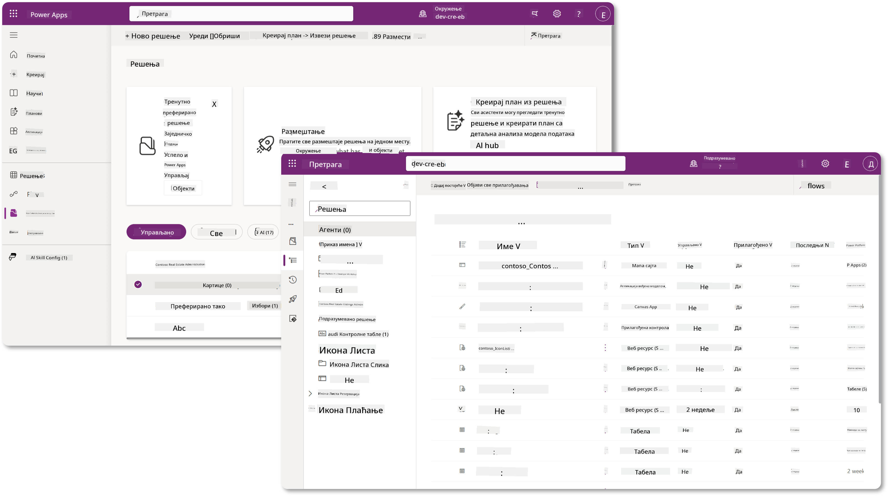

У Copilot Studio-у сада постоји **Solution Explorer** где можете директно управљати вашим решењима. Више није потребно да се пребацујете на Power Apps maker портал да бисте управљали вашим решењима, то можете урадити директно у Copilot Studio 🪄

Ово значи да можете обављати уобичајене задатке везане за решења:

- **Креирање решења** - прилагођена решења омогућавају извоз и увоз агената између окружења.
- **Постављање жељеног решења** - одаберите решење у којем ће агенти, апликације итд. бити креирани по подразумеваним подешавањима.
- **Додавање или уклањање компоненти** - ваш агент може да се ослања на друге компоненте као што су променљиве окружења или cloud токови. Због тога ове компоненте треба да буду укључене у решење.
- **Извоз решења** - за премештање решења у друго циљно окружење.
- **Увоз решења** - увоз решења креираних на другом месту, укључујући надоградњу или ажурирање решења.
- **Креирање и управљање решењима за аутоматизацију** - аутоматизација распоређивања решења између окружења.
- **Git интеграција** - омогућава програмерима да повежу решења са Git репозиторијумима ради контроле верзија, сарадње и ALM. Намењено је само за употребу у програмерским окружењима.

   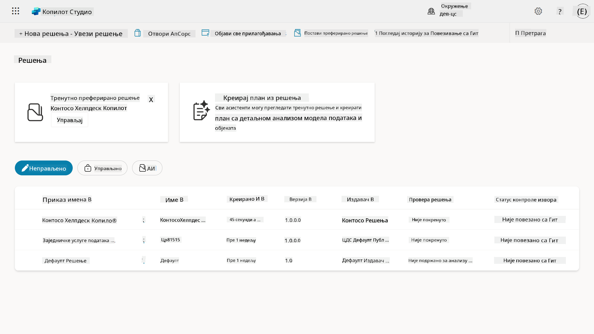

Постоје две врсте решења:

- **Неправљена решења** - користе се током развоја. Можете их слободно уређивати и прилагођавати по потреби.
- **Прављена решења** - користе се када сте спремни да распоредите вашу апликацију за тестирање или продукцију. Ова решења су закључана како би се спречиле случајне измене.

## 🤔 Зашто _треба_ да користим решење за свог агента?

Замислите решења као _алатке_. Када треба да поправите или изградите нешто (агента) на другој локацији (окружењу), сакупите све потребне алатке (компоненте) и ставите их у вашу кутију са алаткама (решење). Затим можете понети ту кутију са алаткама на нову локацију (окружење) и користити алатке (компоненте) да завршите посао или додате нове алатке (компоненте) за прилагођавање вашег агента или пројекта који градите.

!!! quote "Елаиза, ваша пријатељска заговорница облака се јавља 🙋🏻‍♀️ да подели неке речи:"
    Имамо изреку на Новом Зеланду, "Буди уредан Киви!" што је позив на акцију за Новозеланђане 🥝 да преузму одговорност за своје окружење тако што ће правилно одлагати отпад и одржавати јавне просторе чистим. Можемо користити исти контекст за агенте тако што ћемо све што је повезано са вашим агентом држати организовано и преносиво, што ће вам помоћи да одржите уредно окружење.

Добра је пракса креирати агента у посебном решењу у вашем изворном (развојном) окружењу. Ево зашто су решења вредна:

🧩 **Организован развој**

- Држите вашег агента одвојеним од подразумеваног решења које садржи све у окружењу. Све компоненте вашег агента су на једном месту 🎯

- Све што вам је потребно за вашег агента налази се у решењу, што олакшава извоз и увоз у циљно окружење 👉🏻 ово је здрава навика ALM-а.

🧩 **Безбедно распоређивање**

- Можете извозити вашу апликацију или агента као прављено решење и распоредити га у друга циљна окружења (као што су тестирање или продукција) без ризика од случајних измена.

🧩 **Контрола верзија**

- Можете креирати закрпе (циљане исправке), ажурирања (опсежније измене) или надоградње (замена решења - обично велике промене и увођење нових функција).

- Помаже вам да уводите промене на контролисан начин.

🧩 **Управљање зависностима**

- Решења прате који делови зависе од других. Ово вас спречава да нешто покварите када правите промене.

🧩 **Сарадња у тиму**

- Програмери и креатори могу сарађивати користећи неправљена решења у развоју, а затим предати прављено решење за распоређивање.

## 🪪 Разумевање издавача решења

Издавач решења у Power Platform-у је као етикета или бренд који идентификује ко је креирао или поседује решење. То је мали, али важан део управљања вашим апликацијама, агентима и прилагођавањем токова, посебно када радите у тимовима или између окружења.

Када креирате решење, морате изабрати издавача. Овај издавач дефинише:

- Префикс који се додаје свим прилагођеним компонентама (као што су табеле, поља и токови).

- Име и контакт информације организације или особе која поседује решење.

### 🤔 Зашто је то важно?

1. **Лако препознавање** - префикс (на пример - `new_` или `abc_`) вам помаже да брзо идентификујете које компоненте припадају којем решењу или тиму.

1. **Избегавање конфликата** - ако два тима креирају колону названу статус, њихови префикси (`teamA_status`, `teamB_status`) спречавају сукобе у именовању.

1. **Подршка за ALM** - приликом премештања решења између окружења (Развој → Тестирање → Продукција), издавач помаже у праћењу власништва и одржавању конзистентности.

### ✨ Пример

Рецимо да креирате издавача названог Contoso Solutions са префиксом `cts_`.

Ако додате прилагођену колону названу _Приоритет_, она ће бити сачувана као `cts_Priority` у решењу.

Свако ко наиђе на ту колону на нивоу решења, без обзира у којем окружењу се налази, лако може да је идентификује као колону која је повезана са Contoso Solutions.

## 🧭 Животни циклус Power Platform решења

Сада када разумете сврху решења, следеће је да научите о животном циклусу.

**1. Креирање решења у развојном окружењу** - започните креирањем новог решења у вашем развојном окружењу.

**2. Додавање компоненти** - додајте апликације, токове, табеле и друге елементе у ваше решење.

**3. Извоз као прављено решење** - пакујте ваше решење за распоређивање тако што ћете га извозити као прављено решење.

**4. Увоз у тестно окружење** - тестирајте ваше решење у посебном тестном окружењу како бисте се уверили да све функционише како треба.

**5. Увоз у продукционо окружење** - распоредите тестирано решење у ваше активно продукционо окружење.

**6. Примена закрпа, ажурирања или надоградњи** - унапређујте или исправљајте решење користећи закрпе, ажурирања или надоградње. 🔁 Поновите циклус!

### ✨ Пример

Замислите да градите агента за ИТ помоћ који помаже запосленима са проблемима као што су проблеми са уређајима, решавање проблема са мрежом, подешавање штампача и још много тога.

- Започињете у развојном окружењу користећи неправљено решење.

- Када је спремно, извозите га као прављено решење и увозите у циљно окружење као што је системско тестирање или тестирање прихватања корисника (UAT).

- Након тестирања, премештате га у продукционо окружење - све без додиривања оригиналне развојне верзије.

## 🧪 Лабораторија 04: Креирање новог решења

Сада ћемо научити

- [4.1 Како креирати издавача решења](../../../../../docs/recruit/04-creating-a-solution)
- [4.2 Како креирати решење](../../../../../docs/recruit/04-creating-a-solution)

Држаћемо се примера из раније, где ћемо креирати решење у посебном Copilot Studio окружењу за изградњу нашег агента за ИТ помоћ.

Хајде да почнемо!

### Предуслови

#### Безбедносна улога

У Copilot Studio-у, оно што _можете урадити_ у истраживачу решења зависи од ваше корисничке безбедносне улоге.
Ако немате дозволу за управљање решењима у Power Apps администраторском центру, нећете моћи да обављате те задатке у Copilot Studio-у.

Да би све функционисало глатко, проверите да ли имате одговарајуће безбедносне улоге и дозволе. Или, ако не управљате окружењима у вашој организацији, питајте вашег ИТ администратора (или еквивалентни тим) који управља вашим тенантом/окружењима.

Следеће су безбедносне улоге које омогућавају корисницима да креирају решење у свом окружењу.

| Безбедносна улога    | Опис |
| ---------- | ---------- |
| Креатор окружења | Омогућава неопходне дозволе за креирање, прилагођавање и управљање ресурсима у одређеном окружењу, укључујући решења  |
| Прилагођивач система  | Шире дозволе од Креатора окружења, укључујући могућност прилагођавања окружења и управљања безбедносним улогама |
| Администратор система   | Највиши ниво дозвола и може управљати свим аспектима окружења, укључујући креирање и додељивање безбедносних улога     |

#### Развојно окружење

Уверите се да сте се пребацили на ваше посебно развојно окружење, погледајте [Лекција 00 - Подешавање курса - Корак 3: Креирање новог развојног окружења](../00-course-setup/README.md#step-3-create-new-developer-environment).

1. У горњем десном углу, изаберите икону **Cog wheel** и пребаците се из подразумеваног окружења у ваше окружење, на пример **Adele Vance's environment**.

    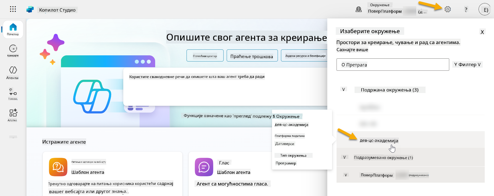

### 4.1 Креирање издавача решења

1. Користећи исто Copilot Studio окружење које сте користили у претходној лекцији, изаберите **икону са три тачке (. . .)** на левој страни менија у Copilot Studio-у. Изаберите **Решења** под заглављем **Истраживање**.

    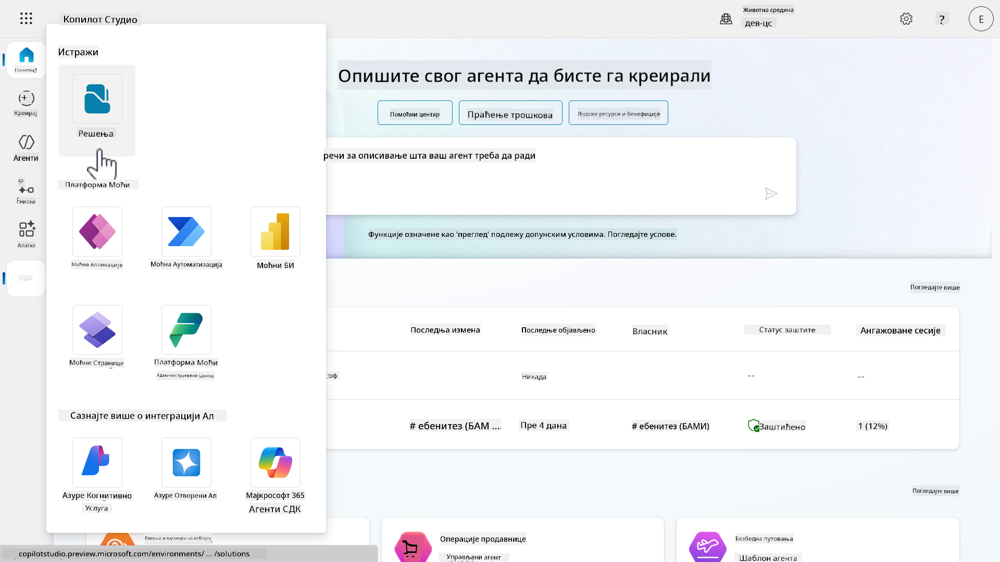

1. Учитаће се **Solution Explorer** у Copilot Studio-у. Изаберите **+ Ново решење**

    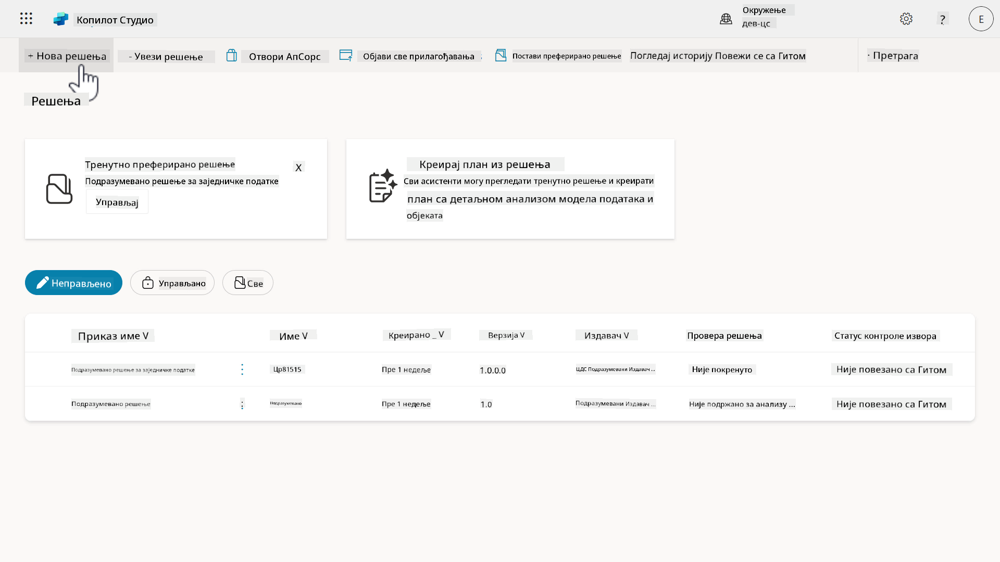

1. Појавиће се панел **Ново решење** где можемо дефинисати детаље нашег решења. Прво, треба да креирамо новог издавача. Изаберите **+ Нов издавач**.

    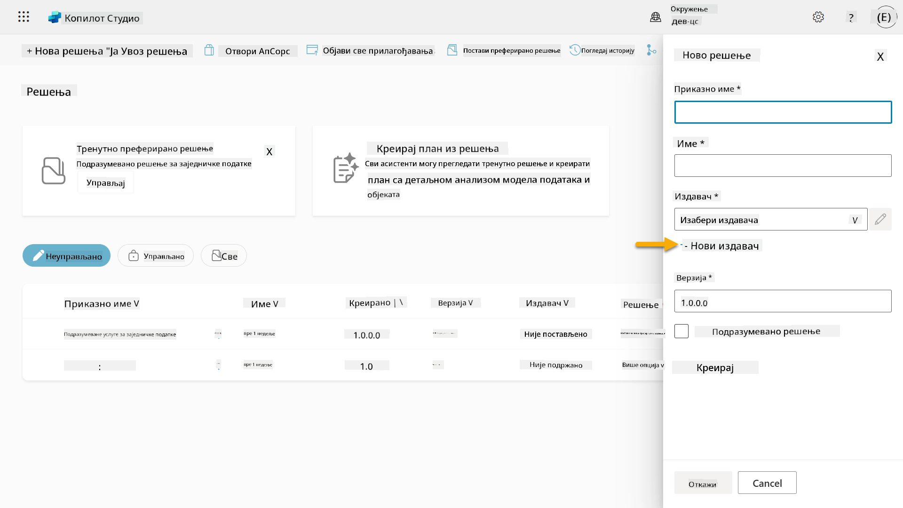  

1. Појавиће се таб **Својства** панела **Нови издавач** са обавезним и необавезним пољима која треба попунити у табу **Својства**. Овде можемо навести детаље издавача који ће се користити као етикета или бренд који идентификује ко је креирао или поседује решење.

    | Својство    | Опис | Обавезно |
    | ---------- | ---------- | :----------: |
    | Назив за приказ | Назив за приказ издавача | Да   |
    | Име  | Јединствено име и шема имена за издавача  | Да    |
    | Опис   | Описује сврху реше
1. Панел за новог издавача ће се затворити и бићете враћени на панел **Ново решење** са ново креираним издавачем који је изабран.

    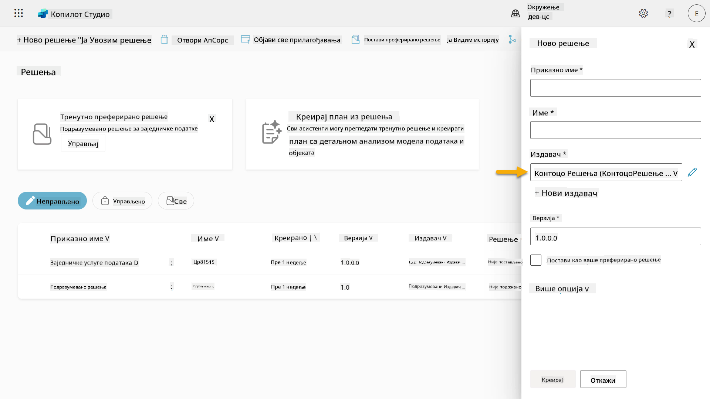  

Честитамо, сада сте креирали Издавача решења! 🙌🏻 Следеће ћемо научити како да креирамо ново прилагођено решење.

### 4.2 Креирање новог решења

1. Сада када смо креирали наше решење, можемо да попунимо остатак форме у панелу **Ново решење**.

    Копирајте и налепите следеће као **Приказано име**,

    ```text
    Contoso Helpdesk Agent
    ```

    Копирајте и налепите следеће као **Име**,

    ```text
    ContosoHelpdeskAgent
    ```

    Пошто креирамо ново решење, [**Број верзије**](https://learn.microsoft.com/power-apps/maker/data-platform/update-solutions#understanding-version-numbers-for-updates/?WT.mc_id=power-172615-ebenitez) подразумевано ће бити `1.0.0.0`.

    Означите поље **Постави као ваше преферирано решење**.

    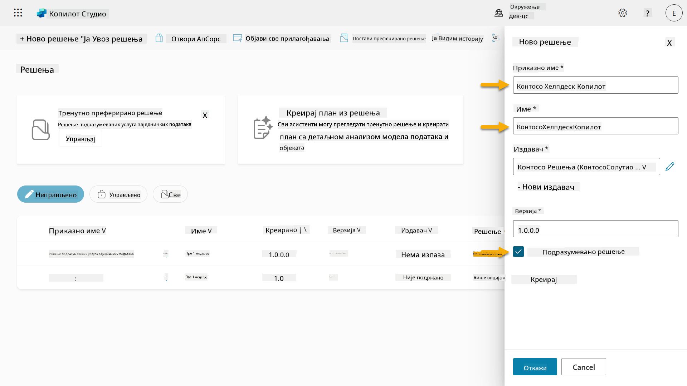  

1. Проширите **Више опција** да бисте видели додатне детаље који могу бити укључени у решење.

    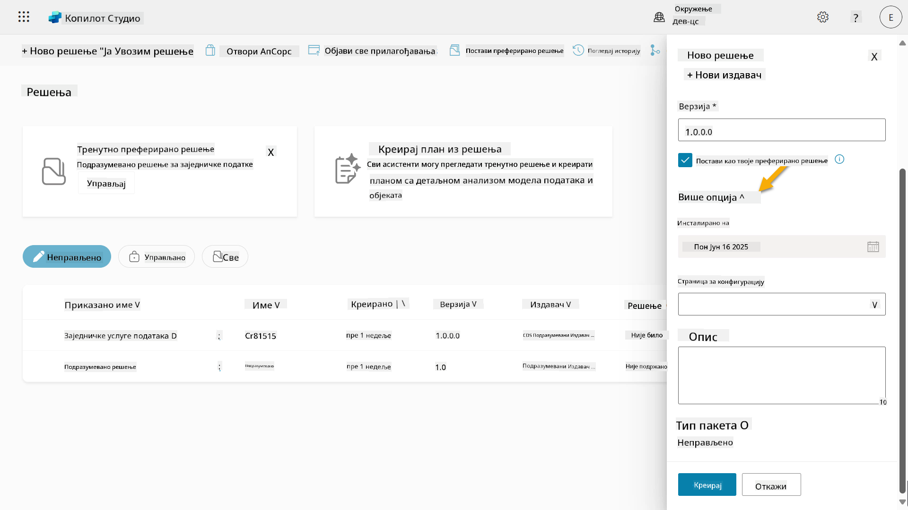

1. Видећете следеће:

    - **Инсталирано на** - датум када је решење инсталирано.

    - **Страница за конфигурацију** - програмери постављају HTML веб ресурс како би помогли корисницима да интерагују са својом апликацијом, агентом или алатом, где ће се појавити као веб страница у секцији Информације са упутствима или дугмадима. Углавном се користи од стране компанија или програмера који креирају и деле решења са другима.

    - **Опис** - описује решење или даје општи опис странице за конфигурацију.

    Оставићемо ове секције празним за ову лабораторију.

    Изаберите **Креирај**.

    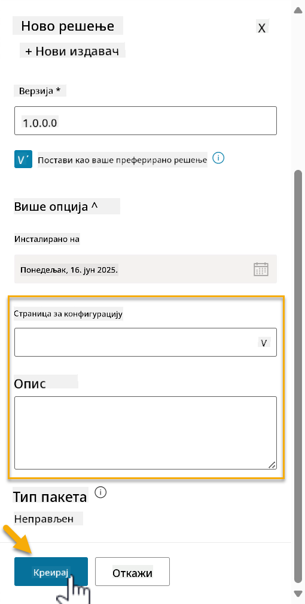

1. Решење за Contoso Helpdesk Agent је сада креирано. Неће бити компоненти док не креирамо агента у Copilot Studio.

    Изаберите икону **стрелица назад** да бисте се вратили у Solution Explorer.

    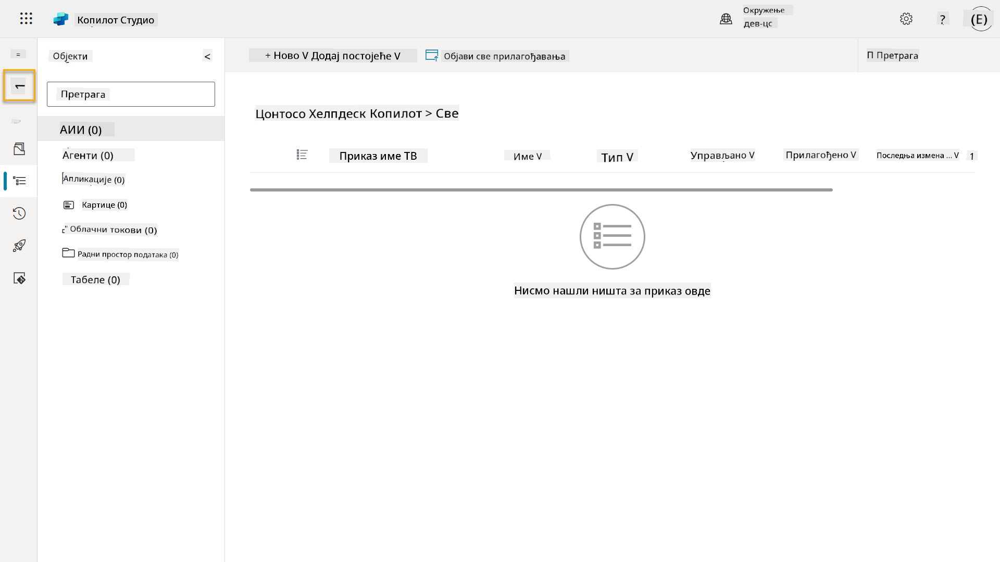

1. Приметићете да се Contoso Helpdesk Agent сада приказује као **Тренутно преферирано решење** јер смо раније означили поље **Постави као ваше преферирано решење**.

    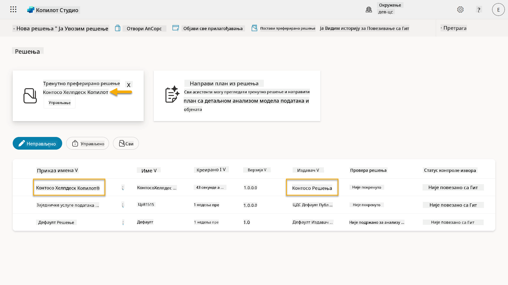

## ✅ Мисија завршена

Честитамо! 👏🏻 Креирали сте Издавача и користили га у вашем ново креираном решењу за изградњу вашег агента!

Браво, Креаторе агента. Уредан дигитални траг је први корак ка оперативности у великом обиму. Сада имате алате и начин размишљања за одржив развој агента спремног за предузећа.

Ово је крај **Лабораторије 04 - Креирање решења**, изаберите линк испод да бисте прешли на следећи час. Ваше решење креирано у овој лабораторији ће бити коришћено у лабораторији следећег часа.

⏭️ [Прелазак на лекцију **Брзи почетак са унапред изграђеним агентима**](../05-using-prebuilt-agents/README.md)

## 📚 Тактички ресурси

🔗 [Креирање решења](https://learn.microsoft.com/power-apps/maker/data-platform/create-solution/?WT.mc_id=power-172615-ebenitez)

🔗 [Креирање и управљање решењима у Copilot Studio](https://learn.microsoft.com/microsoft-copilot-studio/authoring-solutions-overview/?WT.mc_id=power-172615-ebenitez)

🔗 [Дељење агената са другим корисницима](https://learn.microsoft.com/microsoft-copilot-studio/admin-share-bots/?WT.mc_id=power-172615-ebenitez)

🔗 [Резиме доступних ресурса за унапред дефинисане безбедносне улоге](https://learn.microsoft.com/power-platform/admin/database-security#summary-of-resources-available-to-predefined-security-roles/?WT.mc_id=power-172615-ebenitez)

🔗 [Надоградња или ажурирање решења](https://learn.microsoft.com/power-apps/maker/data-platform/update-solutions/?WT.mc_id=power-172615-ebenitez)

🔗 [Преглед цевовода у Power Platform](https://learn.microsoft.com/power-platform/alm/pipelines/?WT.mc_id=power-172615-ebenitez)

🔗 [Преглед интеграције са Git-ом у Power Platform](https://learn.microsoft.com/power-platform/alm/git-integration/overview/?WT.mc_id=power-172615-ebenitez)


---

**Одрицање од одговорности**:  
Овај документ је преведен коришћењем услуге за превођење помоћу вештачке интелигенције [Co-op Translator](https://github.com/Azure/co-op-translator). Иако настојимо да обезбедимо тачност, молимо вас да имате у виду да аутоматски преводи могу садржати грешке или нетачности. Оригинални документ на његовом изворном језику треба сматрати меродавним извором. За критичне информације препоручује се професионални превод од стране људи. Не преузимамо одговорност за било каква погрешна тумачења или неспоразуме који могу настати услед коришћења овог превода.