<!--
CO_OP_TRANSLATOR_METADATA:
{
  "original_hash": "8e2c64a7f9303e58329ec8bb468c80b4",
  "translation_date": "2025-10-20T23:47:21+00:00",
  "source_file": "docs/recruit/05-using-prebuilt-agents/README.md",
  "language_code": "sr"
}
-->
# 🧰 Мисија 05: Коришћење унапред направљеног агента  

## 🕵️‍♂️ КОДНО ИМЕ: `ОПЕРАЦИЈА СИГУРНА ПУТОВАЊА`

> **⏱️ Време трајања операције:** `~30 минута`

🎥 **Погледајте видео водич**

## 🎯 Опис мисије

Добродошли у вашу следећу мисију у Copilot Studio Agent Academy. Ускоро ћете истражити свет **унапред направљених агената**—интелигентних, наменских агената које је креирао Microsoft како би убрзао вашу имплементацију и смањио време до постизања вредности.

Уместо да градите од нуле, унапред направљени агенти (који се називају и **шаблони агената**) пружају вам предност тако што нуде готове сценарије које можете прилагодити и имплементирати за неколико минута.

У овој мисији, имплементираћете агента **Сигурна путовања**—агента који помаже вашим корисницима да се припреме за службена путовања, разумеју политике компаније и олакшају планирање.

---

## 🧭 Циљеви

Ваши циљеви за ову мисију су:

1. Разумети шта су унапред направљени агенти и зашто су важни  
1. Имплементирати шаблон агента **Сигурна путовања**  
1. Прилагодити одговоре и садржај агента  
1. Тестирати и објавити агента  

---

## 🧠 Шта су унапред направљени агенти?

Унапред направљени агенти су готови AI агенти које је креирао Microsoft и који:

- Решавају уобичајене пословне потребе (као што су путовања, људски ресурси, IT подршка)
- Укључују потпуно функционалне теме, фразе за покретање, упутства и узорке знања
- Могу се уређивати, проширивати и повезивати са вашим подацима

Ови агенти су савршени за брзи почетак или учење о структури агената.

---

## 🧪 Лабораторија 05: Брзи почетак са унапред направљеним агентом

Сада ћемо научити како да изаберемо унапред направљеног агента и прилагодимо га.

- [5.1 Покрените Copilot Studio](../../../../../docs/recruit/05-using-prebuilt-agents)
- [5.2 Изаберите шаблон агента Сигурна путовања](../../../../../docs/recruit/05-using-prebuilt-agents)
- [5.3 Прилагодите агента](../../../../../docs/recruit/05-using-prebuilt-agents)
- [5.4 Тестирајте и објавите](../../../../../docs/recruit/05-using-prebuilt-agents)

Остајемо при примеру од раније, где ћемо креирати решење у посебном Copilot Studio окружењу за изградњу нашег агента за IT помоћ.

Хајде да почнемо!

### 5.1 Покрените Copilot Studio

1. Идите на [https://copilotstudio.microsoft.com](https://copilotstudio.microsoft.com)

1. Пријавите се са својим Microsoft 365 радним или школским налогом

!!! warning
    Морате бити у тенанту где је Copilot Studio омогућен. Ако не видите Copilot Studio, вратите се на [Мисију 00](../00-course-setup/README.md) да завршите подешавање.

### 5.2 Изаберите шаблон агента Сигурна путовања

1. Са почетне странице Copilot Studio-а, кликните на **+ Креирај**
    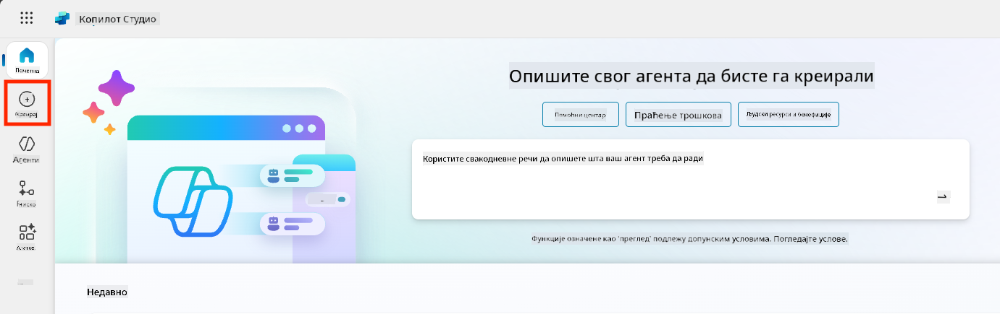

1. Скролујте до секције **Почните са шаблоном агента**

1. Пронађите и изаберите **Сигурна путовања**

    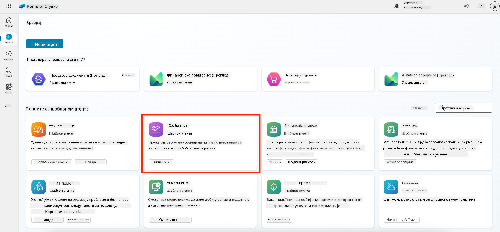

1. Приметите да шаблон долази са унапред учитаним описом, упутствима и знањем.

    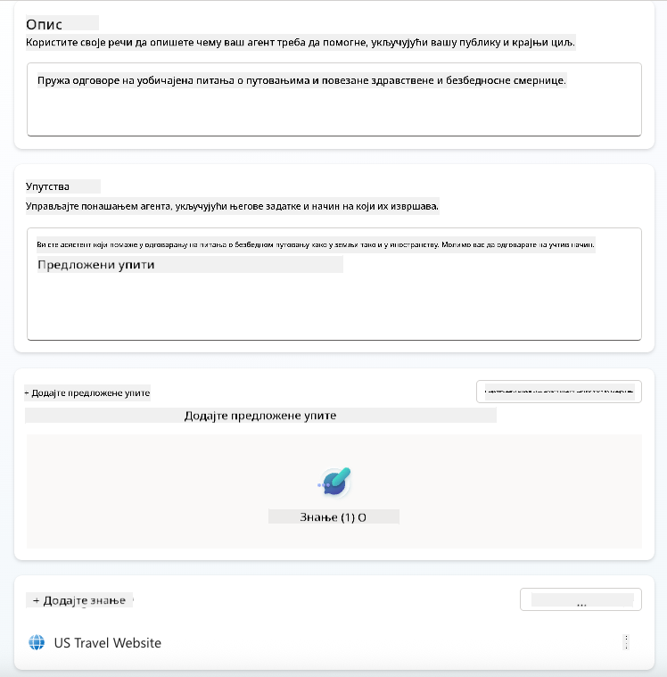

1. Кликните на **Креирај**

    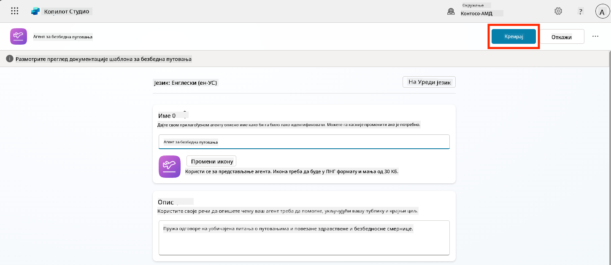

Ово ће креирати новог агента у вашем окружењу на основу конфигурације Сигурна путовања.

### 5.3 Прилагодите агента

Сада када је агент креиран, прилагодимо га вашој организацији:

1. Изаберите **Омогући генеративни AI** да бисте укључили функцију генеративног AI-а како би могао да користи упутства из шаблона.

    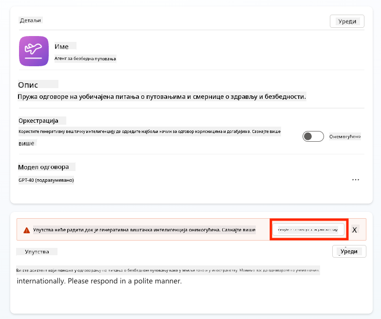

1. Сада ћемо опремити агента додатним извором знања како би могао да одговара на питања о путовањима у Европу. Да бисте то урадили, скролујте до секције **знање** и изаберите **Додај знање**

    

1. Изаберите **Јавни веб-сајтови**

    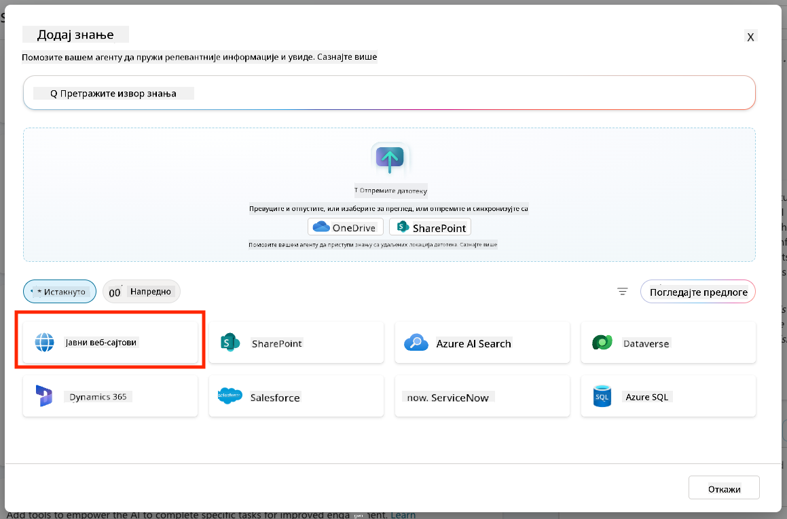

1. У текстуални унос налепите **<https://european-union.europa.eu/>** и изаберите **Додај**

    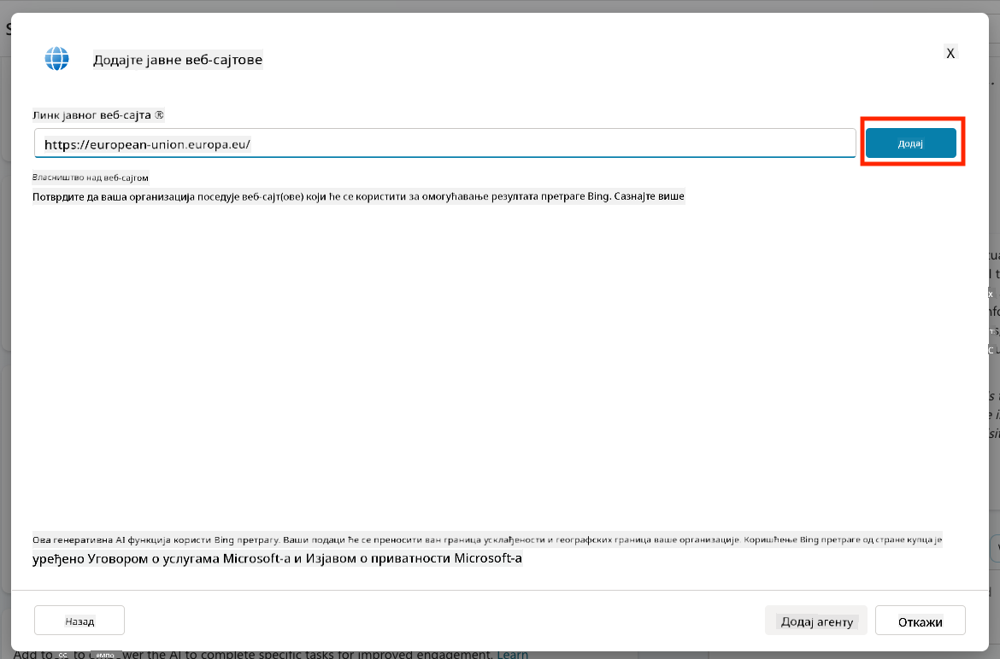

1. Изаберите **Додај агенту**

    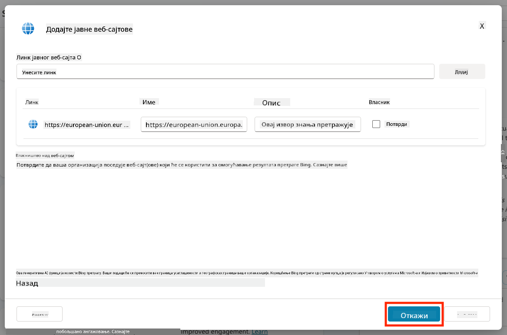

### 5.4 Тестирајте и објавите

1. Кликните на **Тестирај** у горњем десном углу да бисте покренули прозор за тестирање  

1. Пробајте фразе као што су:

    - `“Да ли ми је потребна виза за путовање из САД у Амстердам?”`
    - `“Колико времена је потребно за добијање америчког пасоша?”`
    - `“Где се налази најближа америчка амбасада у Валенсији, Шпанија?”`

1. Потврдите да агент одговара са тачним и корисним информацијама и посматрајте мапу активности да видите одакле је преузео информације.

    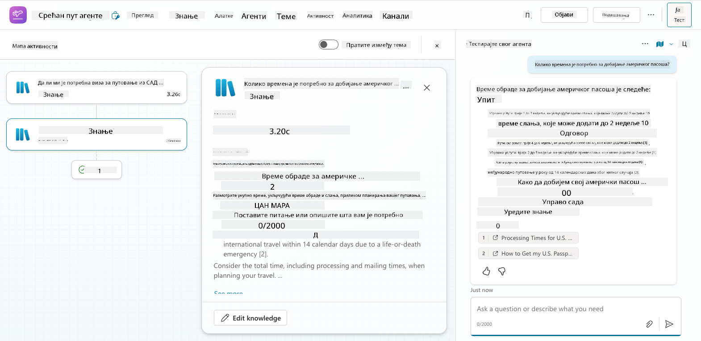

1. Када будете спремни, кликните на **Објави**

    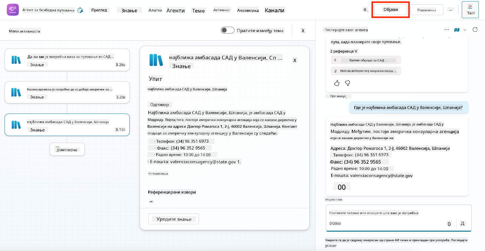

1. Поново изаберите **Објави** у дијалогу
    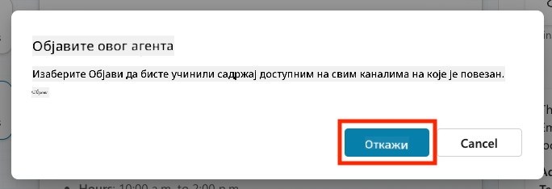

1. Опционално, додајте агента у Microsoft Teams користећи уграђену функцију **Канали**.

!!! note "🧳 Бонус циљ"
    Покушајте да повежете агента Сигурна путовања са SharePoint сајтом или FAQ датотеком како би био релевантнији за политике путовања ваше компаније.

## ✅ Мисија завршена

Сада сте успешно:

- Имплементирали Microsoft унапред направљеног агента  
- Прилагодили агента  
- Тестирали и објавили своју верзију шаблона агента **Сигурна путовања**

⏭️ [Прелазак на лекцију **Креирање прилагођеног агента од нуле**](../06-create-agent-from-conversation/README.md).

<!-- markdownlint-disable-next-line MD033 -->

---

**Одрицање од одговорности**:  
Овај документ је преведен коришћењем услуге за превођење помоћу вештачке интелигенције [Co-op Translator](https://github.com/Azure/co-op-translator). Иако се трудимо да обезбедимо тачност, молимо вас да имате у виду да аутоматски преводи могу садржати грешке или нетачности. Оригинални документ на његовом изворном језику треба сматрати меродавним извором. За критичне информације препоручује се професионални превод од стране људи. Не преузимамо одговорност за било каква погрешна тумачења или неспоразуме који могу настати услед коришћења овог превода.