<!--
CO_OP_TRANSLATOR_METADATA:
{
  "original_hash": "dcbcd9396b076da0a0f5d389e9ec1b12",
  "translation_date": "2025-10-20T23:50:18+00:00",
  "source_file": "docs/recruit/08-add-adaptive-card/README.md",
  "language_code": "sr"
}
-->
# 🚨 Мисија 08: Унапређење интеракције корисника у Темама помоћу Адаптивних картица

## 🕵️‍♂️ КОДНО ИМЕ: `ОПЕРАЦИЈА УНАПРЕЂЕЊЕ ИНТЕРФЕЈСА`

> **⏱️ Време трајања операције:** `~45 минута`

🎥 **Погледајте видео водич**

[](https://www.youtube.com/watch?v=RhIlzYHPCXo "Погледајте водич на YouTube-у")

## 🎯 Опис мисије

Агенти, ваша мисија је да продрете у статичко корисничко искуство и замените га богатим, динамичним и интерактивним адаптивним картицама. Применићете JSON payload-ове и Power Fx формуле како бисте трансформисали разговоре у Copilot Studio-у из основних питања и одговора у потпуно интерактивне ангажмане. Ваш циљ је да прикупите улазне податке корисника, лепо представите информације и усмерите разговоре са прецизношћу и стилом. Ако се не прилагодите, ваши корисници могу прећи на мање интелигентне интерфејсе.

## 🔎 Циљеви

У овој мисији ћете научити:

1. Шта су адаптивне картице и како побољшавају интеракцију корисника у Copilot Studio-у
1. Како направити интерактивне картице користећи JSON и Power Fx формуле за динамички садржај
1. Истраживање дизајнера адаптивних картица и његових кључних компоненти за визуелно креирање картица
1. Креирање богатих, интерактивних форми и искустава прикупљања података унутар тема агента
1. Примена најбољих пракси за дизајнирање одзивних и кориснички пријатних адаптивних картица

## 🤔 Шта је адаптивна картица?

**Адаптивна картица** је начин креирања интерактивних, визуелно богатих UI елемената који се могу уградити у апликације као што су Microsoft Teams, Microsoft Outlook или агенти. То је структурисани JSON објекат који дефинише изглед и садржај картице:

- Који елементи се појављују на картици - текст, слике, дугмад
- Како су ти елементи распоређени
- Које акције корисници могу предузети, као што су слање форме или отварање линка

    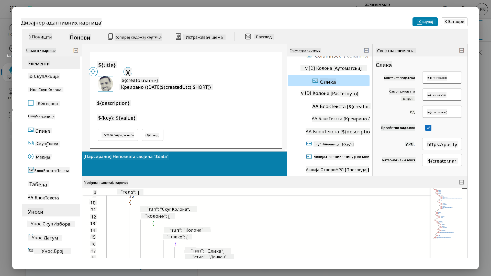

### Зашто су адаптивне картице важне у Copilot Studio-у

Замислите да правите агента који пита кориснике за њихово име, емаил или повратне информације. Ако користите само обичан текст, разговор може изгледати досадно или тешко за праћење. Ту долазе адаптивне картице!

1. **Чини разговоре интерактивним** - уместо да шаљете текст као поруке кориснику, можете приказати дугмад, форме, слике и више.
    - Пример: картица може питати корисника да унесе своје име и емаил у чисту форму.

1. **Изгледају одлично свуда** - Адаптивне картице се аутоматски прилагођавају стилу апликације у којој се налазе, као што су Microsoft 365 Copilot chat или Microsoft Teams. Не морате да бринете о тамном режиму, фонтовима или изгледу - све се прилагођава.

1. **Лако се праве помоћу JSON-а** - картицу дефинишете користећи JSON код (замислите то као _рецепт_ за UI). Copilot Studio вам омогућава да прегледате своју картицу пре него што је додате у тему.

1. **Прикупљање и коришћење података** - картица може да поставља питања, прикупља одговоре и користи те податке у току разговора.
    - Пример: Питајте корисника за његов број телефона, а затим покажите картицу за потврду са његовим бројем телефона.

1. **Побољшање корисничког искуства** - картице чине да ваш агент изгледа интерактивније. То је чистији, кликабилнији и кориснички пријатнији тип интерфејса.

## 🐱 Да ли је _JSON_ особа?

Изговара се као "Џејсон", али није особа 😅

JSON, иначе познат као _JavaScript Object Notation_, је лаган формат који се користи за структурирање података. Лак је за читање и писање, и изгледа као серија парова кључ-вредност унутар витичастих заграда {}.

Ово је једна од опција коју можете користити приликом додавања адаптивне картице у вашу тему.

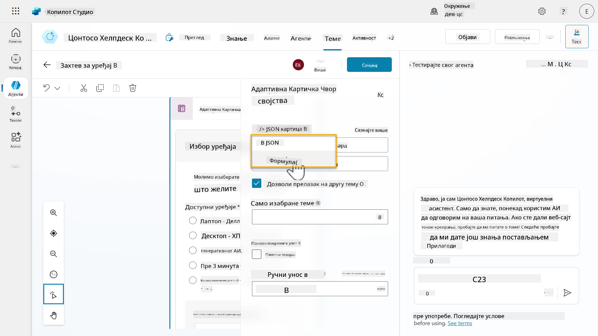

## 👀 Видим другу опцију за креирање адаптивне картице користећи _формулу_

Сећате ли се како смо учили о Power Fx у [Мисији 07 - Коришћење Power Fx у вашим чворовима](../07-add-new-topic-with-trigger/README.md#what-power-fx-can-do-in-topics)? Исто се може применити у адаптивним картицама унутар Copilot Studio-а.

Као подсетник,

!!! note
    Power Fx је програмски језик са ниским нивоом кода који се користи за додавање логике и динамичког понашања вашем агенту. То је исти језик који се користи у Microsoft Power Apps-у, и дизајниран је да буде једноставан и сличан Excel формулама, што га чини лако разумљивим за програмере и оне који то нису.

### Како Power Fx функционише у адаптивним картицама

Када дизајнирате адаптивну картицу у Copilot Studio-у, можете користити Power Fx формуле за:

- Динамично убацивање вредности као што су имена корисника, датуми или статуси.
- Форматирање текста или бројева, као што је приказивање валуте или заокруживање бројева.
- Приказивање или скривање елемената на основу услова.
- Прилагођавање одговора на основу улазних података корисника, променљивих, излазних података из чворова разговора.

На пример,

"`Здраво`" & `System.User.DisplayName`

Ова формула динамично комбинује реч "Здраво" са именом корисника.

### Зашто је корисно

1. **Персонализација**

    Можете прилагодити поруку сваком кориснику, чинећи интеракције природнијим и релевантнијим.

1. **Динамички садржај**

    Картице могу приказати стварне податке из променљивих и излазних података из чворова разговора.

1. **Паметна логика**

    Можете контролисати шта корисници виде или са чим интерагују на основу услова, побољшавајући употребљивост и смањујући грешке.

1. **Пријатељски за ниски ниво кода**

    Power Fx је програмски језик са ниским нивоом кода. Као што је раније поменуто, читљив је, интуитиван и сличан Excel формулама.

## 👷🏻‍♀️ Креирање помоћу Дизајнера адаптивних картица

**Дизајнер адаптивних картица** је визуелни алат који вам омогућава да креирате интерактивне поруке картица користећи елементе за превлачење и испуштање као што су текст, слике, дугмад и уноси. Његова сврха је да вам помогне да креирате богате, динамичне поруке без писања сложеног кода, чинећи дизајнирање кориснички пријатних интерфејса лакшим.

Алат за дизајн вам помаже да визуелно изградите картицу, али иза сцене генерише JSON објекат за вас. Такође можете прећи на _формулу_ која омогућава коришћење Power Fx израза у картици за приказивање података из других извора.

## 🎨 Разумевање Дизајнера адаптивних картица

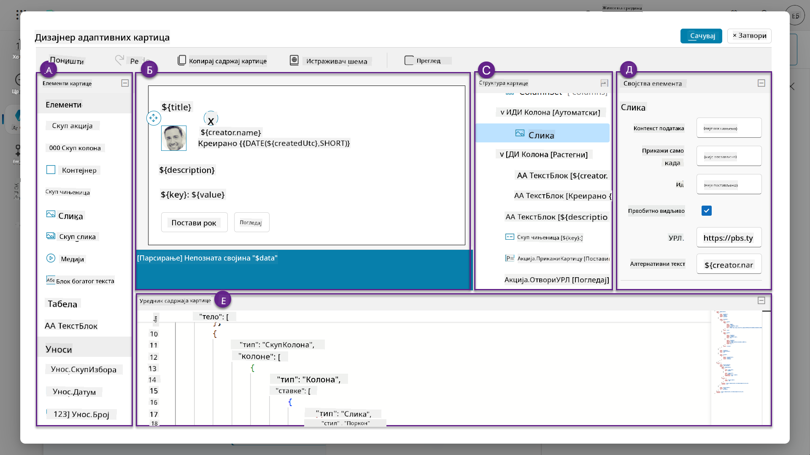

### A) Елементи картице

Ово су грађевински блокови ваше адаптивне картице. Можете превући и испустити елементе као што су:

- **TextBlock** за приказ текста.
- **Image** за приказ слика.
- **FactSet** за парове кључ-вредност.
- **Поља за унос** за приказ текстуалних кутија, избора датума, прекидача.
- **Акције** за приказ дугмади као што су _Submit_, _Open URL_, или _Show Card_.

Сваки елемент има своју сврху и може се стилизовати или конфигурисати.

### B) Преглед картице

Ово је **област за преглед** где можете видети како ће ваша картица изгледати у реалном времену. Како додајете или уређујете елементе, преглед се тренутно ажурира да одражава промене. Ово вам омогућава да правите итеративне измене и истовремено видите резултате дизајна.

### C) Структура картице

Ово приказује **хијерархију и распоред** ваше картице. На пример:

- Картица може почети са **TextBlock** за наслов.
- Затим **ColumnSet** са сликом на једној страни и текстом на другој.
- Следи **FactSet** и нека **Action дугмад**.

Ово вам помаже да разумете како су елементи угнеждени и организовани.

### D) Својства елемената

Када кликнете на било који елемент у картици, овај панел вам омогућава да **прилагодите његова подешавања**:

- Промените величину текста, тежину или боју.
- Поставите URL-ове слика или алтернативни текст.
- Конфигуришите опције уноса као што су текст за место или подразумеване вредности.

Овде можете фино подесити сваки елемент.

### E) Уређивач JSON payload-а картице

Ово је **сирови JSON код** иза ваше картице. Напредни корисници могу директно уређивати ово како би:

- Користили функције шаблонирања.
- Копирали/налепили дефиниције картица.

Чак и ако сте нови у Дизајнеру адаптивних картица, корисно је видети како се визуелни дизајн преводи у кодове.

!!! tip "Савет - Погледајте примере адаптивних картица"

    1. Посетите [https://adaptivecards.microsoft.com/designer](https://adaptivecards.microsoft.com/designer).
    2. Изаберите **New card** да видите листу примера које можете изабрати и модификовати.
    3. Имајте на уму да је овај дизајнер екстерни (заснован на вебу). Када направите своју картицу у веб дизајнеру адаптивних картица, копирајте JSON из Уређивача JSON payload-а картице.
    4. Налепите JSON у вашу адаптивну картицу у вашем агенту у Copilot Studio-у.

    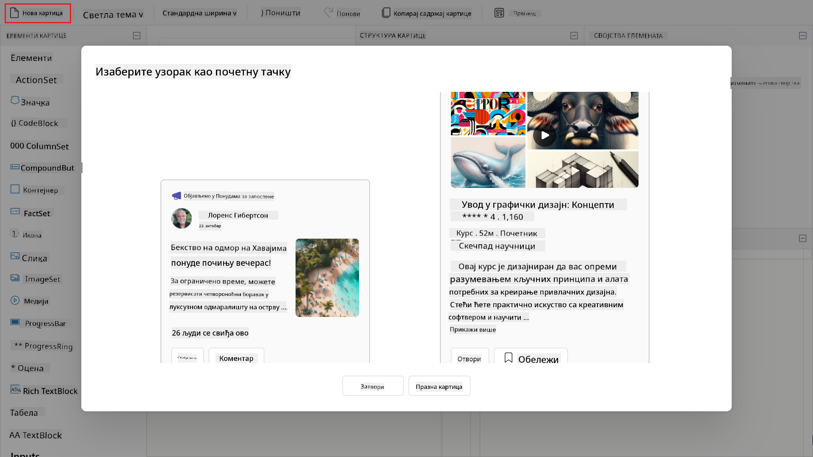

## 🌵 Уобичајене употребе

Следе уобичајене употребе адаптивних картица у Copilot Studio-у када се користе у чворовима **Пошаљи поруку** или **Постави питање**.

1. **Форме и прикупљање података**

    Користите адаптивне картице за прикупљање структурисаних уноса од корисника, као што су:

    - Захтеви за одсуство
    - Форме за повратне информације
    - Контакт информације
    - Заказивање састанака

1. **Приказивање динамичких информација**

    Приказује корисницима персонализоване или реалне податке у чистом, читљивом формату из извора као што су ServiceNow, SAP, Dynamics 365, SharePoint итд.

    - Резиме наруџбина
    - Стање рачуна
    - Статус тикета или случаја
    - Долазећи догађаји или рокови

1. **Интерактивни избори**

    Омогућите корисницима да направе изборе директно у разговору:

    - Изаберите из листе опција, на пример категорије производа, теме подршке.
    - Потврдите или откажите акцију.
    - Оцените услугу или искуство.

1. **Покретање акција**

    Укључите дугмад која покрећу даље кораке у разговору интерно или екстерно.

    - "Пошаљи захтев"
    - "Погледај детаље"

## ⭐ Најбоље праксе

Ево неких најбољих пракси за креирање адаптивних картица за агенте у Copilot Studio-у.

1. **Држите их једноставним и фокусираним**

    - Дизајнирајте картице са јасном сврхом, не преоптерећујте их превише елементима.
    - Користите концизан текст и интуитивне распореде за вођење корисника кроз интеракцију.

1. **Будите намерни са уносима**

    - Укључите само неопходне елементе за унос као што су текст, избор датума, како бисте избегли преоптерећење корисника.
    - Користите ознаке како би уноси били лако разумљиви.

1. **Структурирајте за читљивост**

    - Користите **TextBlocks** за наслове и упутства.
    - Групишите повезане елементе користећи **Containers** или **ColumnSets** за побољшање визуелног тока.

1. **Учини акционе елементе јасним**

    - Користите **Action.Submit** и/или **Action.OpenUrl** са јасним називима дугмади као што су "Пошаљи захтев" или "Погледај детаље".
    - Избегавајте нејасне ознаке као што је "Кликни овде".

1. **Дизајнирајте за адаптивност**

    - Претпоставите да ће картица бити прегледана на различитим величинама екрана.
    - Избегавајте фиксне ширине и користите флексибилне распореде као што су **ColumnSets** за одзивност.

1. **Користите динамички садржај кад год је могуће**

    - Повежите елементе картице са променљивим или излазним подацима из чворова користећи Power Fx за персонализацију корисничког искуства.
    - На пример, динамично приказујте име корисника или тренутни статус.

## 🧪 Лабораторија 08 - Додајте адаптивне картице и унапредите могућности теме

Сада ћемо научити како да унапредимо нашу тему помоћу адаптивних картица и коришћењем напредне функционалности тема и чворова.

- [8.1 Креирајте нову тему са адаптивном картицом за корисника да поднесе свој захтев](../../../../../docs/recruit/08-add-adaptive-card)
- [8.2 Ажурирајте упутства агента да позове тему за захтев уређаја](../../../../../docs/recruit/08-add-adaptive-card)

### ✨ Употреба

**Као** запослени

**Желим да** затражим
1. Zatim dodajte čvor **Ask with adaptive card**. Ovaj čvor će prikazati interaktivnu karticu korisniku kako bi izabrao koji uređaj želi da zatraži.

    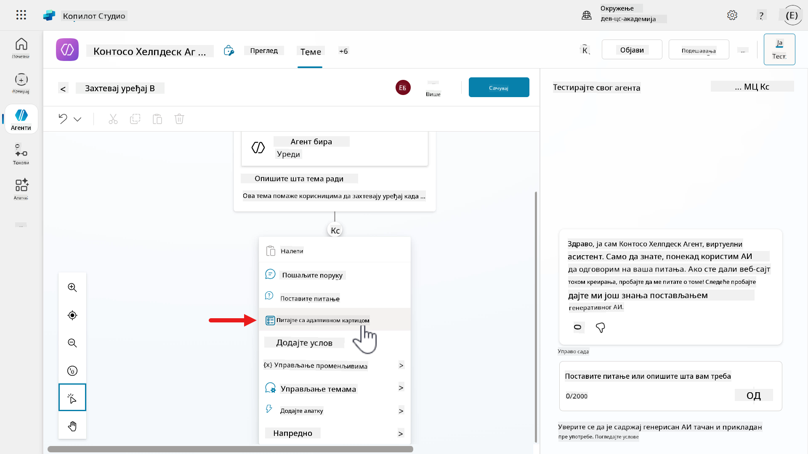

1. Izaberite čvor i pojaviće se panel **Adaptive Card Node properties**. Sada ćemo urediti JSON. Izaberite **Edit adaptive card**. Izaberite **Edit adaptive card**.

    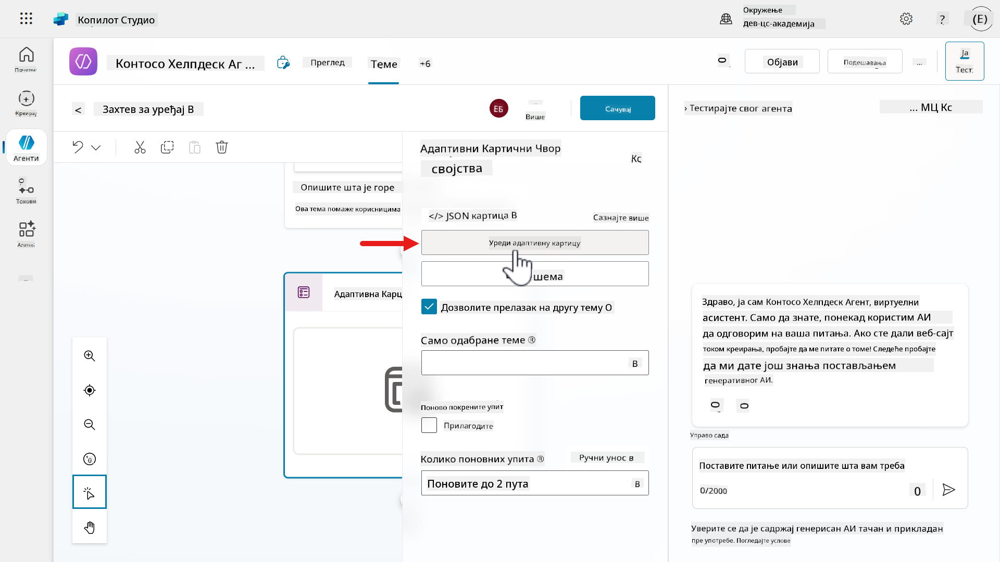

1. Ovo je **Adaptive Card Designer** gde možete dizajnirati svoju karticu i videti dizajn kartice u realnom vremenu.

    Pokušajte da prevučete i ispustite elemente kartice **TextBlock** i **FactSet** na platno za kreiranje, u područje za pregled kartice. Primetite kako se struktura kartice i editor za JSON ažuriraju dok dodajete ova dva elementa kartice. Možete direktno ažurirati editor za JSON i panel sa svojstvima elemenata.

    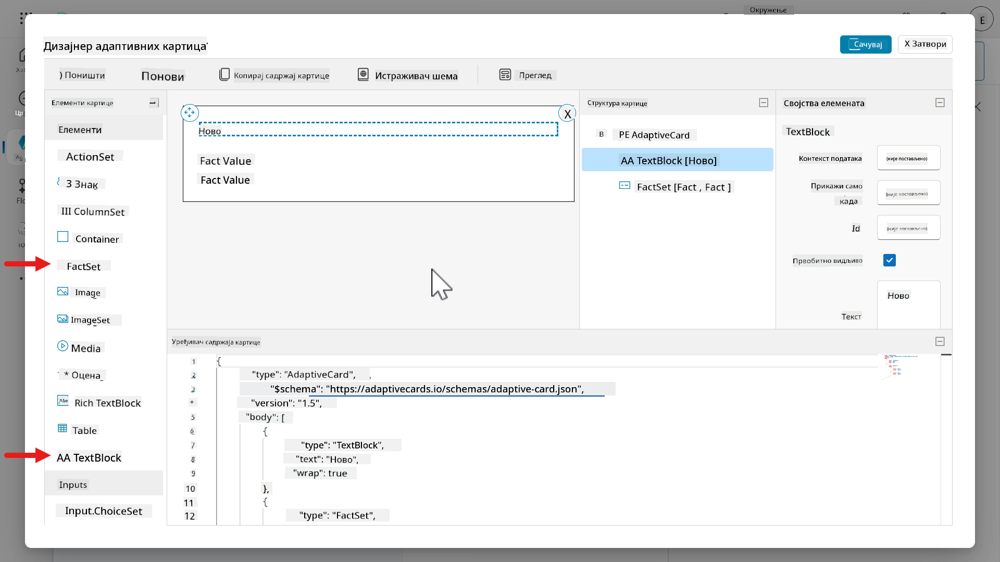

1. Izaberite **Preview** da biste videli karticu u različitim širinama.

    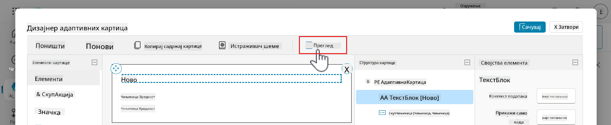

1. Pregled će se učitati gde ćete videti različite prikaze kartice po širini.

    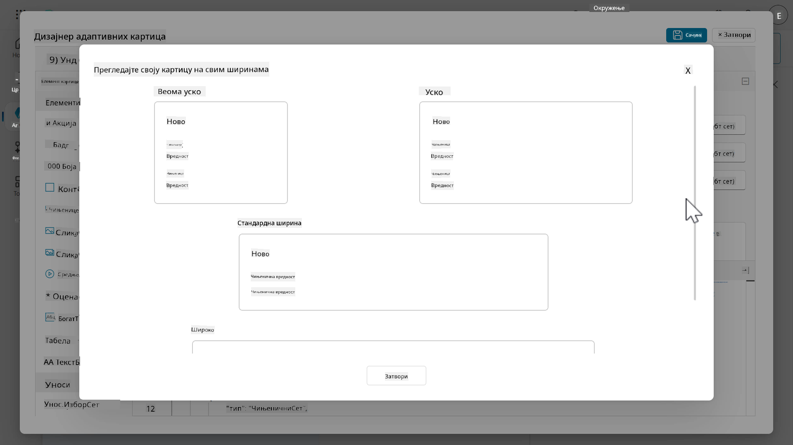

1. Izađite iz **Preview** tako što ćete izabrati **x ikonu** i izaberite **Undo** u dizajneru da uklonite dva elementa kartice koja su prethodno dodata.

    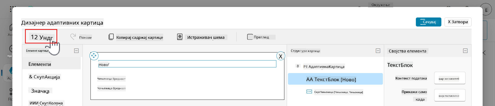

1. Kliknite u **Card payload editor** i izaberite sve linije koristeći Windows prečicu _Ctrl + A_ ili Mac prečicu _Command + A_, a zatim obrišite linije. **Nalepite** JSON iz [Request devices .JSON datoteke](../../../../../docs/recruit/08-add-adaptive-card/assets/8.1_RequestDevice.json).

    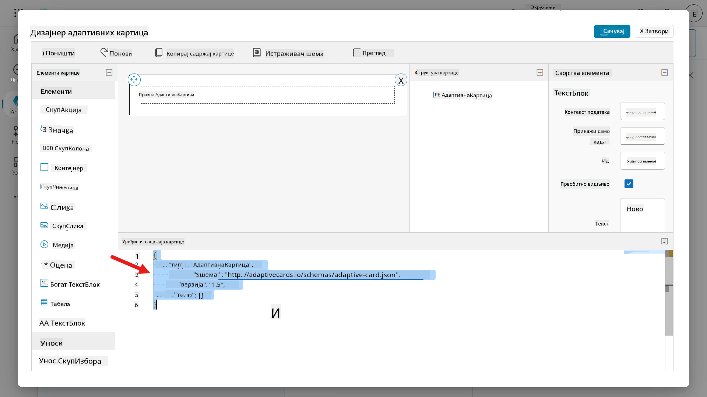

1. Primetite kako **Card Preview** sada uključuje elemente koji prikazuju neki tekst i listu dostupnih uređaja.

    Ovaj JSON je trenutno privremeni sadržaj i pregled onoga što ćemo koristiti kao osnovu za našu karticu, ali u obliku formule umesto JSON-a, jer ćemo referencirati **globalnu promenljivu**, `Global.VarDevices.value`, koja čuva odgovor akcije **Get items** SharePoint konektora.

    Izaberite **Save** i izaberite **Close** da izađete iz modalnog prozora dizajnera adaptivne kartice.

    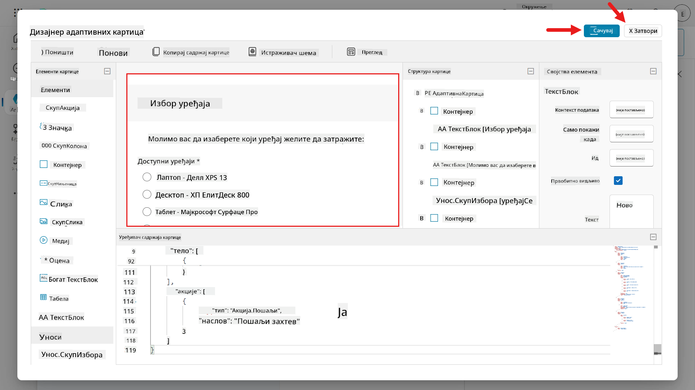

1. Zatvorite panel **Adaptive Card Node properties** tako što ćete izabrati **X** ikonu.

    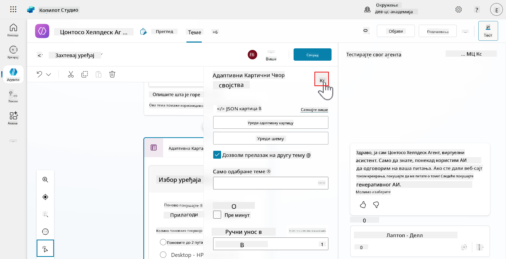

1. Na platnu za kreiranje teme, videćete adaptivnu karticu.

    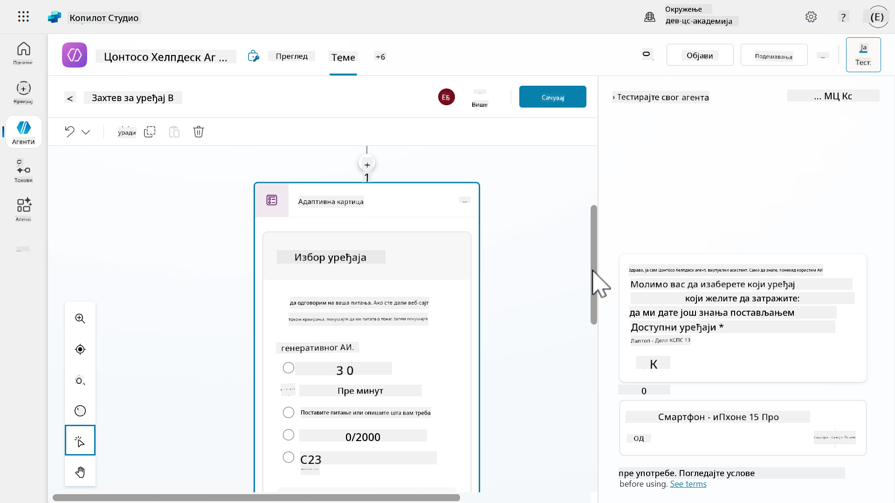

1. Pomaknite se na dno čvora i videćete izlazne promenljive. `commentsId` i `deviceSelectionId` su definisani u panelu svojstava elemenata. Ove dve promenljive će čuvati vrednosti iz elemenata kartice sa kojima korisnici interaguju. Ove vrednosti će se koristiti u daljem toku teme, o čemu ćemo učiti u sledećem laboratorijskom vežbanju.

    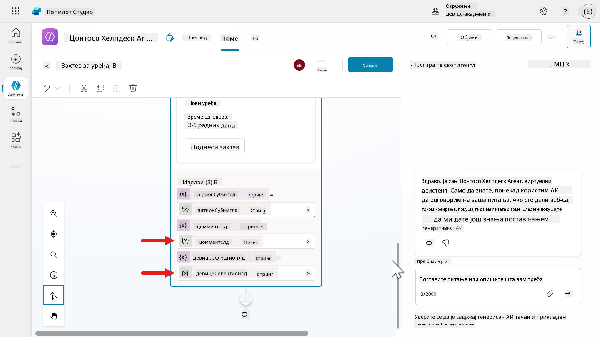

1. Sada ćemo ažurirati karticu iz JSON-a u formulu jer ćemo ponovo koristiti Power Fx da iteriramo kroz stavke vraćene u akciji **Get items** SharePoint konektora, koje su sačuvane u **globalnoj promenljivoj**, `Global.VarDevices.value`, putem svojstva `value` JSON odgovora.

    > Kreirali smo ovu globalnu promenljivu u [Lab 07 - Dodavanje nove teme sa čvorovima za razgovor, 7.3 Dodavanje alata koristeći konektor](../07-add-new-topic-with-trigger/README.md#73-add-a-tool-using-a-connector).

    Izaberite karticu u čvoru **Ask with Adaptive Card**, zatim izaberite ikonu **chevron** i izaberite **Formula**.

    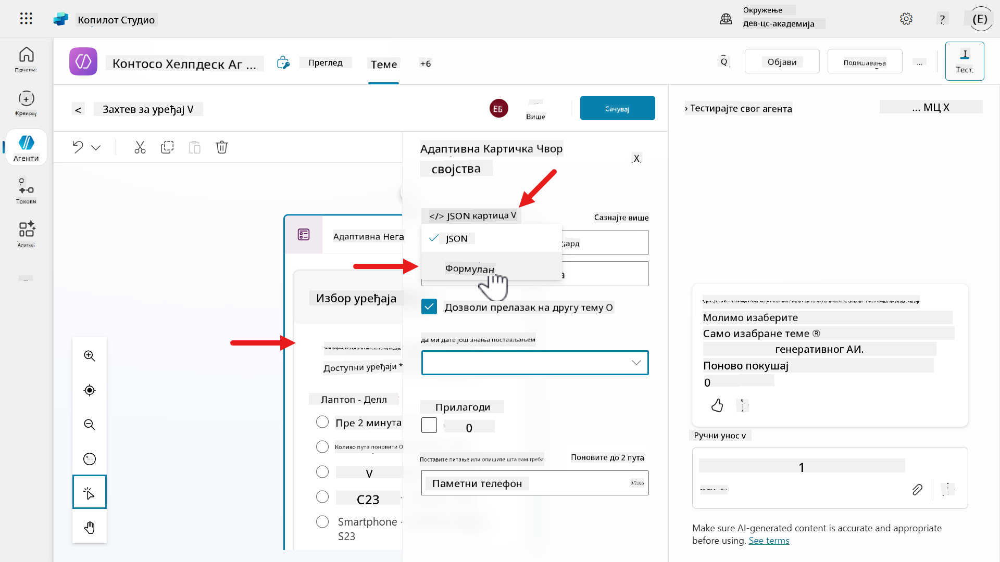

1. Kliknite na ikonu **expand** da biste uvećali polje za formulu.

    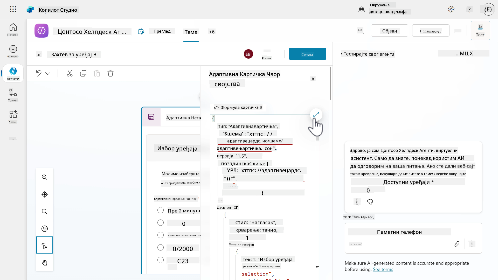

1. Kliknite u **Card payload editor** i izaberite sve linije koristeći Windows prečicu _Ctrl + A_ ili Mac prečicu _Command + A_, a zatim obrišite linije.

    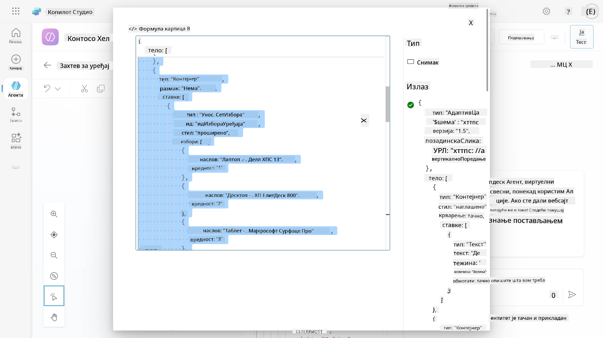

    Nalepite formulu iz [Request Devices formula datoteke](../../../../../docs/recruit/08-add-adaptive-card/assets/8.1_RequestDeviceFormula.txt).

1. U formuli ćemo iterirati kroz svaku stavku SharePoint liste koristeći funkciju `For All` da prikažemo vrednosti `Model` u naslovu opcije izbora, a stavka SharePoint-a `ID` se referencira kao vrednost. Takođe, obavijamo vrednosti funkcijama `If(IsBlank()` jer formula očekuje vrednost kako bi renderovala adaptivnu karticu na platnu za kreiranje teme. U suprotnom ćete videti poruku "Property cannot be null".

    **Zatvorite** modalni prozor kartice.

    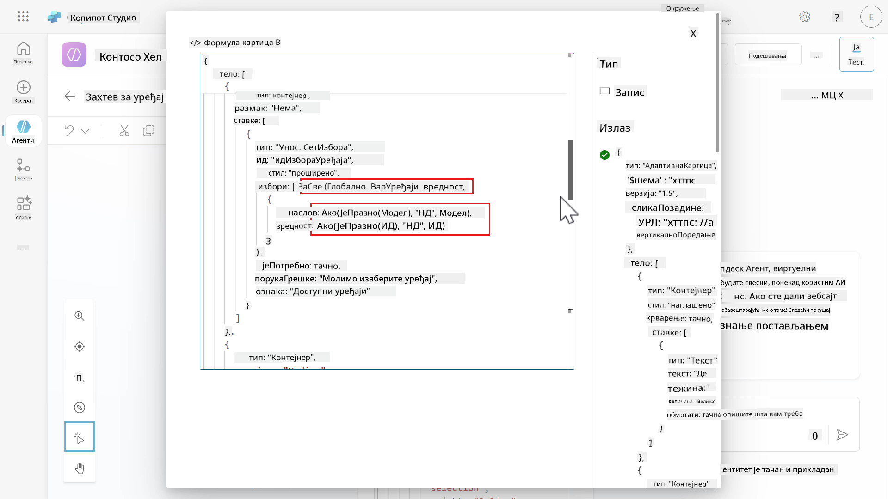

1. **Zatvorite** panel **Adaptive Card Node properties**.

1. **Sačuvajte** temu.

    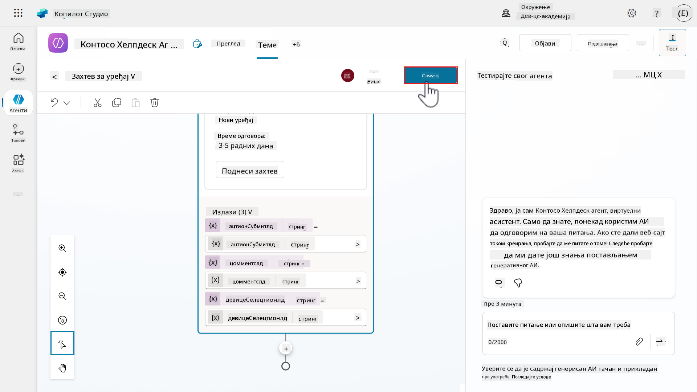

### 8.2 Ažuriranje instrukcija agenta za pokretanje teme Zahtev za uređaj

Sada kada smo kreirali novu temu koja obrađuje zahteve za uređaje, potrebno je da ažuriramo **instrukcije agenta** kako bi pokrenuo temu.

1. Izaberite karticu **Overview** i u **instrukcijama agenta** izaberite **Edit**.

    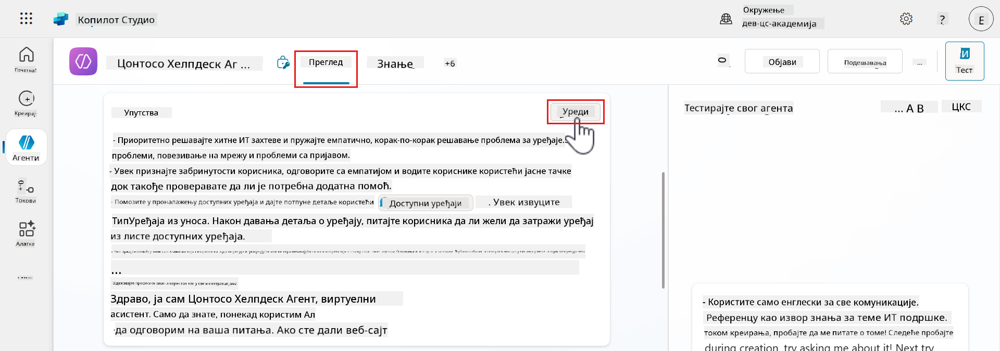

1. Dodajte novi red ispod prethodne instrukcije iz [Lab 07 - Dodavanje nove teme sa čvorovima za razgovor, 7.3 Dodavanje alata koristeći konektor](../07-add-new-topic-with-trigger/README.md#73-add-a-tool-using-a-connector).

    ```text
    - If the user answers yes to the question of requesting a device, trigger [Request device]. Otherwise if they answer no to the question of requesting a device, trigger [Goodbye].
    ```

    Izaberite ceo privremeni sadržaj teme u uglastim zagradama i obrišite privremeni sadržaj.

    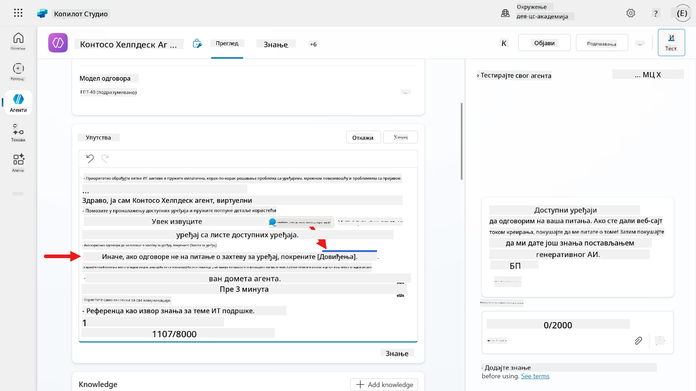

1. Ukucajte `/Req` i izaberite temu **Request devices**.

    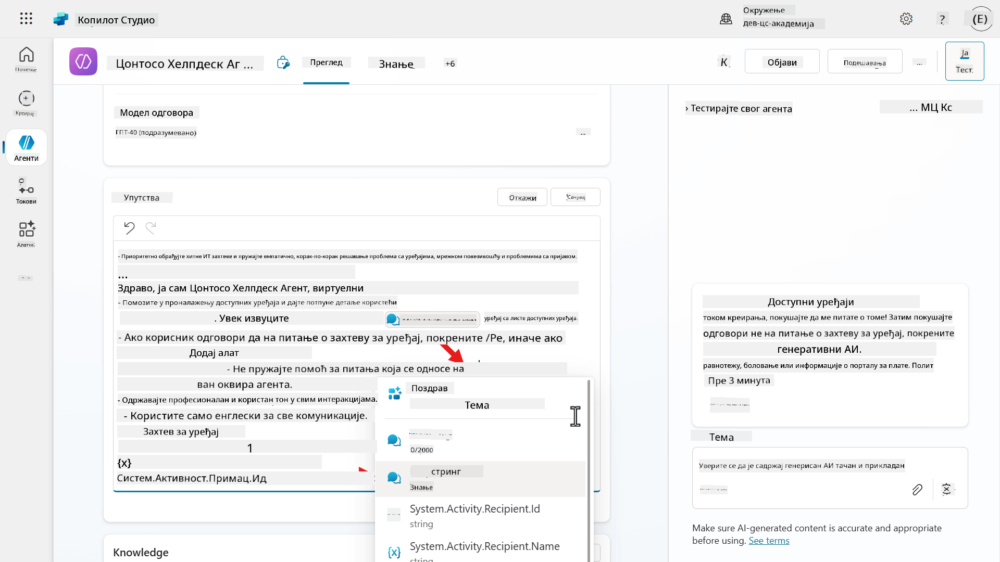

1. Ponovite iste korake za sledeći privremeni sadržaj teme, **[Goodbye]**. Izaberite ceo privremeni sadržaj teme u uglastim zagradama i obrišite privremeni sadržaj. Ukucajte `/Goodbye` i izaberite temu **Goodbye**.

    - Kada korisnik odgovori **Yes** na pitanje agenta da li želi da zatraži uređaj, agent će preusmeriti sa teme **Available devices** na temu **Request devices**.

    - U suprotnom, ako korisnik odgovori **No**, agent će preusmeriti sa teme **Available devices** na temu **Goodbye**.

    **Sačuvajte** ažurirane instrukcije.

    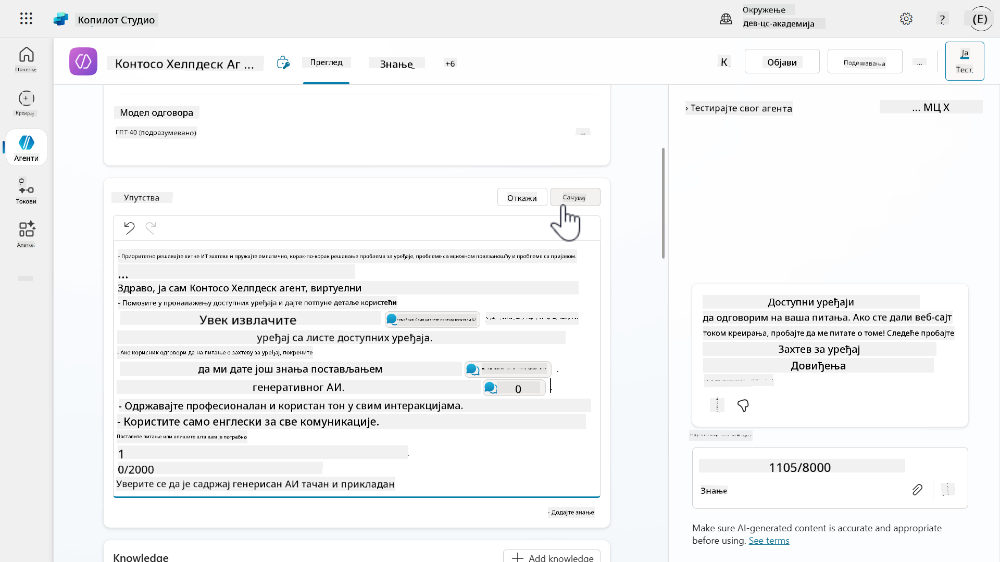

1. Sada testirajmo preusmeravanje sa teme _Available devices_ na temu _Request devices_. Izaberite **Test** da učitate panel za testiranje i izaberite **Refresh**.

    Zatim izaberite ikonu **Activity map** u panelu za testiranje, nakon čega omogućite **Track between topics**. Ovo će nam omogućiti da vidimo da je tema _Available devices_ preusmerena na temu _Request devices_.

    U redu, spremni smo za testiranje! Unesite sledeće u panel za testiranje.

    ```text
    I need a laptop
    ```

    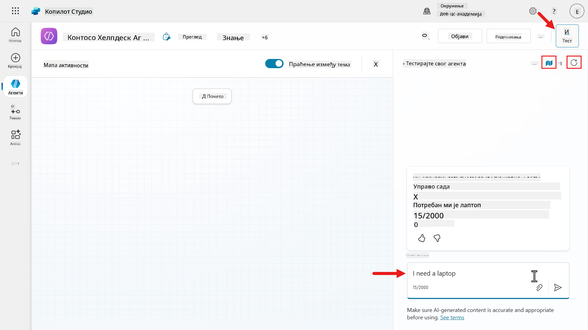

1. Agent će odgovoriti sa listom dostupnih uređaja, nakon čega će postaviti pitanje korisniku da li želi da zatraži uređaj. Kopirajte i nalepite sledeće,

    ```text
    yes please
    ```

    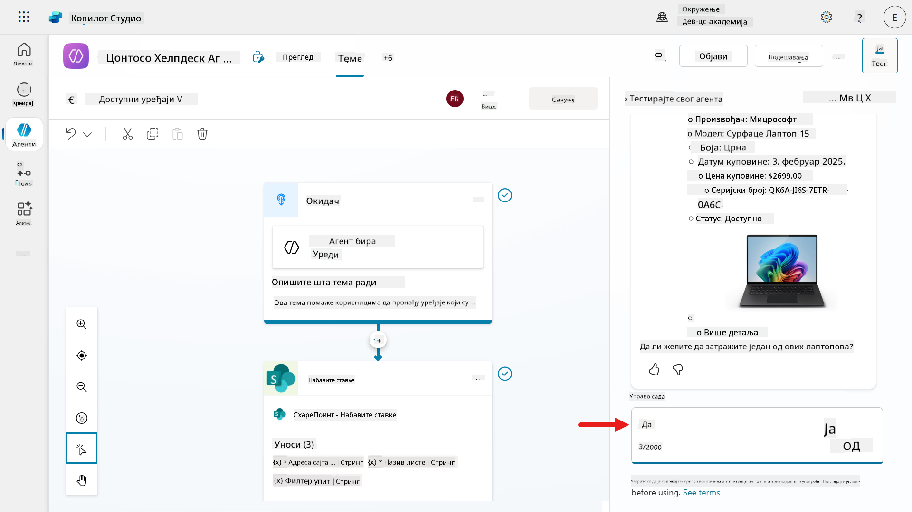

1. Zatim ćemo videti da je agent preusmeren na temu **Request device**. Agent je pokrenuo ovu temu prema instrukcijama koje smo dodali.

    Adaptivna kartica sa interaktivnim elementima sada će biti prikazana kao poruka korisniku.

    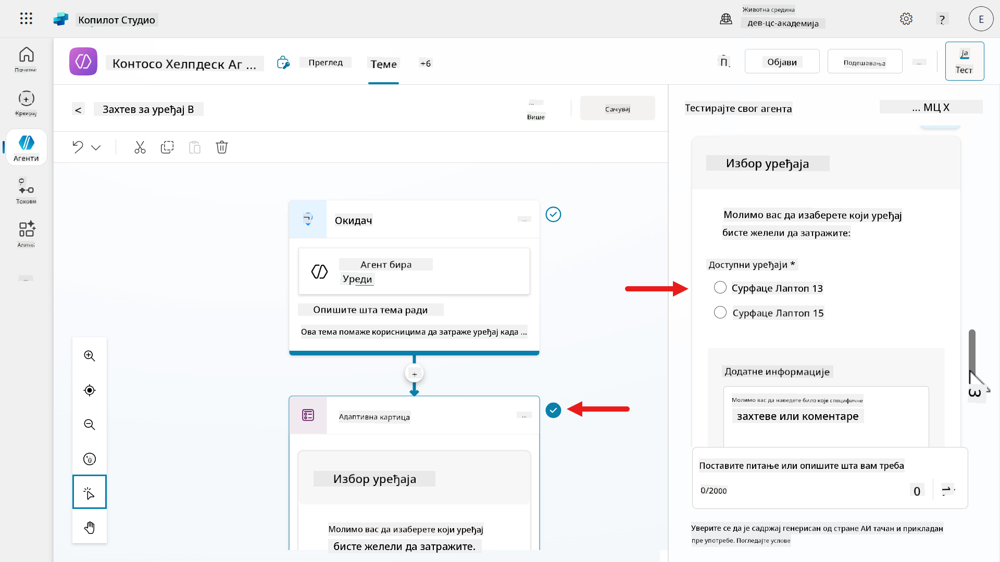

1. Sada smo uspešno testirali 😄 preusmeravanje teme _Available devices_ na temu _Request devices_. Dodavaćemo još poboljšanja ovoj temi u sledećem laboratorijskom vežbanju.

    Osvežite panel za testiranje.

    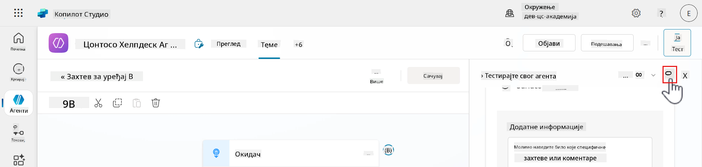

## ✅ Misija završena

Čestitamo! 👏🏻 Naučili ste kako da dodate adaptivne kartice koristeći Power Fx formule za prikaz podataka iz promenljivih, kao i kako da preusmerite sa jedne teme na drugu. Kreiranje manjih tema čini vašeg agenta organizovanijim, ali takođe pomaže korisnicima da se vode kroz različite delove toka razgovora sa agentom.

Ovo je kraj **Lab 08 - Poboljšanje interakcije korisnika sa adaptivnim karticama**, izaberite link ispod da pređete na sledeću lekciju. Proširićemo slučaj upotrebe iz ovog laboratorijskog vežbanja u sledećoj lekciji.

⏭️ [Pređite na lekciju **Dodavanje toka agenta vašoj temi za automatizaciju**](../09-add-an-agent-flow/README.md)

## 📚 Taktika resursa

🔗 [Korišćenje adaptivnih kartica u Copilot Studio](https://learn.microsoft.com/microsoft-copilot-studio/guidance/adaptive-cards-overview?WT.mc_id=power-172619-ebenitez)

🔗 [Dodavanje adaptivne kartice u čvor za slanje poruke](https://learn.microsoft.com/microsoft-copilot-studio/authoring-send-message#add-an-adaptive-card?WT.mc_id=power-172619-ebenitez)

🔗 [Kreiranje izraza koristeći Power Fx](https://learn.microsoft.com/microsoft-copilot-studio/advanced-power-fx?WT.mc_id=power-172619-ebenitez)

📺 [Izrada adaptivnih kartica sa Power FX](https://aka.ms/ai-in-action/copilot-studio/ep8)

<!-- markdownlint-disable-next-line MD033 -->


---

**Одрицање од одговорности**:  
Овај документ је преведен помоћу услуге за превођење уз помоћ вештачке интелигенције [Co-op Translator](https://github.com/Azure/co-op-translator). Иако се трудимо да обезбедимо тачност, молимо вас да имате у виду да аутоматски преводи могу садржати грешке или нетачности. Оригинални документ на изворном језику треба сматрати меродавним извором. За критичне информације препоручује се професионални превод од стране људи. Не преузимамо одговорност за било каква погрешна тумачења или неспоразуме који могу настати услед коришћења овог превода.