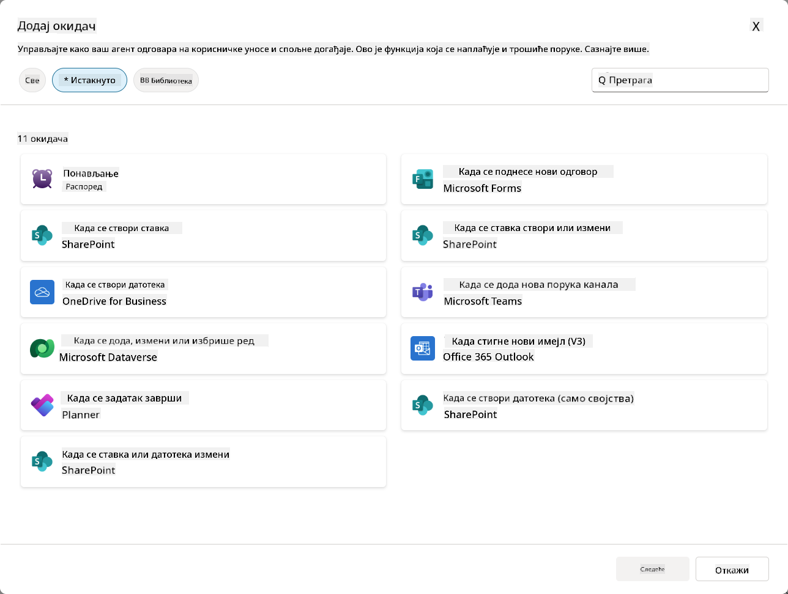
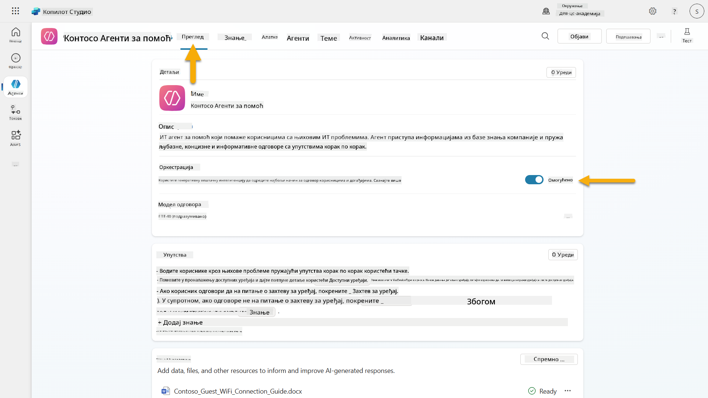
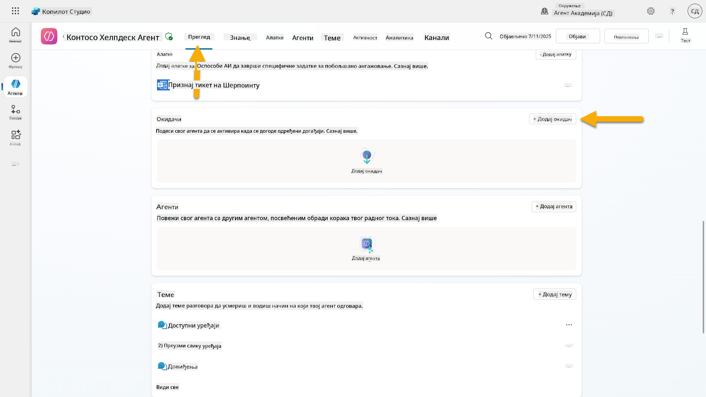
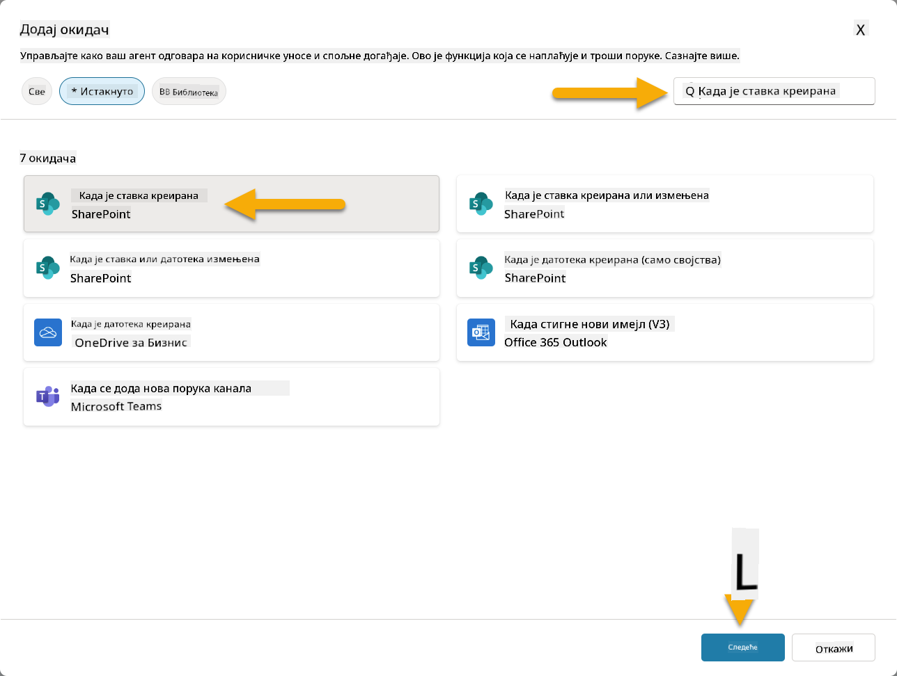
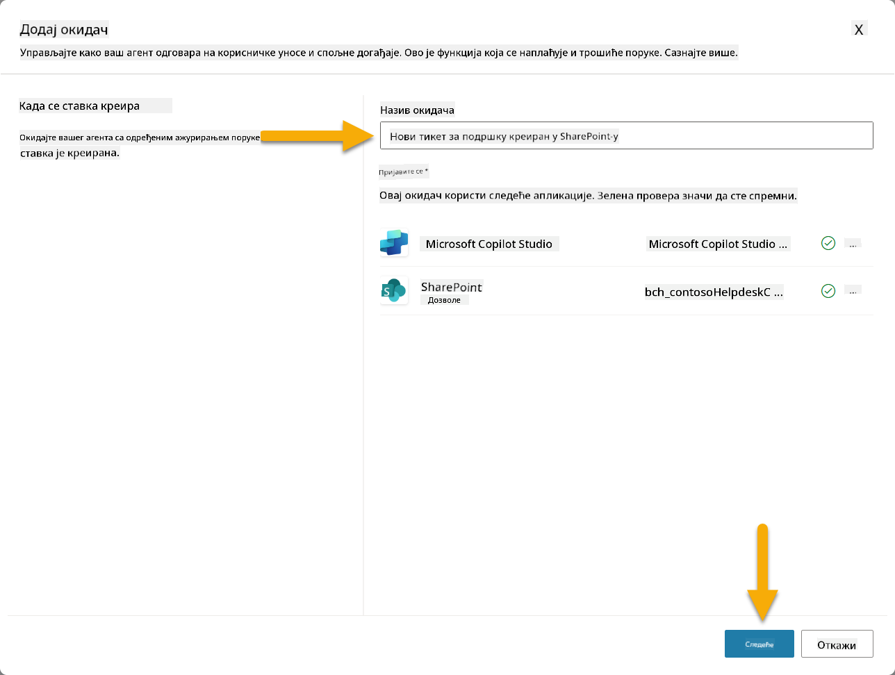
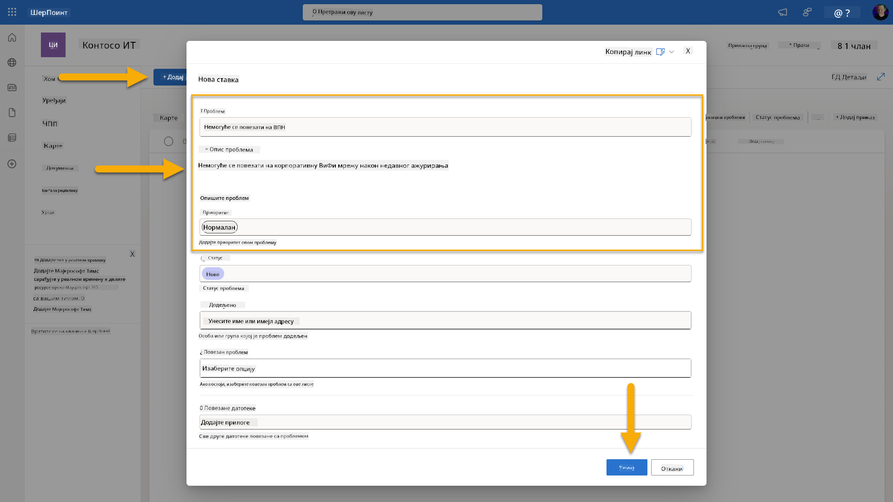
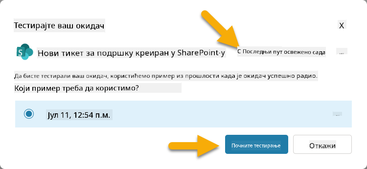
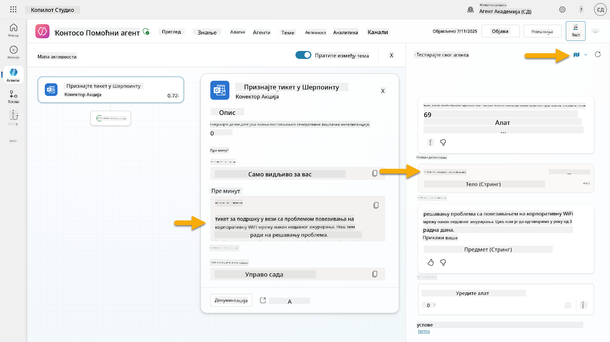
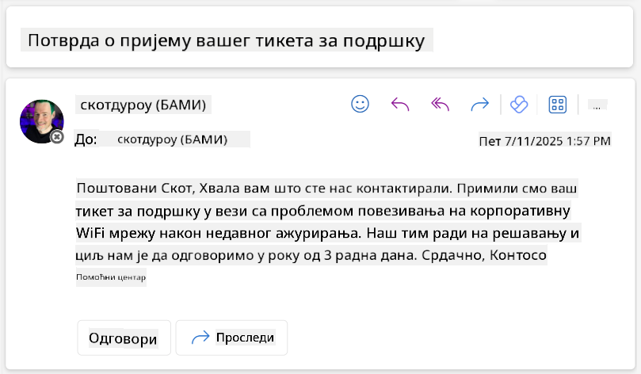

<!--
CO_OP_TRANSLATOR_METADATA:
{
  "original_hash": "cd99a76bcb7372ac2771b6ae178b023d",
  "translation_date": "2025-10-20T23:21:29+00:00",
  "source_file": "docs/recruit/10-add-event-triggers/README.md",
  "language_code": "sr"
}
-->
# 🚨 Мисија 10: Додавање активатора догађаја - Омогућите способности аутономног агента

## 🕵️‍♂️ КОДНО ИМЕ: `ОПЕРАЦИЈА ДУХОВНА РУТИНА`

> **⏱️ Време трајања операције:** `~45 минута`

🎥 **Погледајте видео водич**

## 🎯 Опис мисије

Време је да ваш агент пређе са улоге конверзацијског асистента на аутономног оперативца. Ваш задатак је да омогућите вашем агенту да делује без позивања - да одговара на сигнале из вашег дигиталног окружења са прецизношћу и брзином.

Са активаторима догађаја, обучићете вашег агента да прати спољне системе као што су SharePoint, Teams и Outlook, и да извршава интелигентне радње чим прими сигнал. Ова операција трансформише вашег агента у потпуно оперативног теренског сарадника - тихог, брзог и увек на опрезу.

Успех значи изградњу агената који иницирају вредност - не само да на њу реагују.

## 🔎 Циљеви

📖 Ова лекција ће обухватити:

- Разумевање активатора догађаја и како они омогућавају аутономно понашање агента
- Учење разлике између активатора догађаја и активатора тема, укључујући радне токове активатора и информације о догађају (payloads)
- Истраживање уобичајених сценарија активатора догађаја
- Разумевање аутентификације, безбедности и разматрања објављивања за агенте засноване на догађајима
- Изградња аутономног агента за ИТ помоћ који реагује на догађаје у SharePoint-у и шаље потврде путем е-поште

## 🤔 Шта је активатор догађаја?

**Активатор догађаја** је механизам који омогућава вашем агенту да делује аутономно као одговор на спољне догађаје, без потребе за директним уносом корисника. Замислите то као да ваш агент "посматра" одређене догађаје и аутоматски предузима радње када се ти догађаји догоде.

За разлику од активатора тема, који захтевају од корисника да нешто укуцају како би активирали разговор, активатори догађаја се активирају на основу онога што се дешава у вашим повезаним системима. На пример:

- Када се нова датотека креира у SharePoint-у или OneDrive for Business
- Када се креира запис у Dataverse-у
- Када се задатак заврши у Planner-у
- Када се поднесе нови одговор у Microsoft Forms
- Када се дода нова порука у Microsoft Teams
- На основу редовног распореда (као што су дневни подсетници)  

### Зашто су активатори догађаја важни за аутономне агенте

Активатори догађаја трансформишу вашег агента из реактивног асистента у проактивног, аутономног помоћника:

1. **Аутономно деловање** - ваш агент може радити 24/7 без људске интервенције, реагујући на догађаје како се дешавају.
    - *Пример:* Аутоматски поздравља нове чланове тима када се додају у тим.

1. **Реакција у реалном времену** - уместо да чека да корисници поставе питања, ваш агент одмах реагује на релевантне догађаје.
    - *Пример*: Упозорава ИТ тим када се документ у SharePoint-у измени.

1. **Аутоматизација радних токова** - повезује више радњи на основу једног активатора догађаја.
    - *Пример:* Када се креира нови тикет за подршку, креира задатак, обавештава менаџера и ажурира контролни панел.

1. **Конзистентни процеси** - осигурава да важни кораци никада не буду пропуштени аутоматизацијом одговора на кључне догађаје.
    - *Пример:* Сваки нови запослени аутоматски добија материјале за увод и захтеве за приступ.

1. **Акције засноване на подацима** - користи информације из активирајућег догађаја за доношење паметних одлука и предузимање одговарајућих радњи.
    - *Пример:* Прослеђује хитне тикете вишем особљу на основу нивоа приоритета у информацијама о догађају.

## ⚙️ Како функционишу активатори догађаја?

Активатори догађаја функционишу кроз тростепени радни ток који омогућава вашем агенту да аутономно реагује на спољне догађаје:

### Радни ток активатора

1. **Детекција догађаја** - Одређени догађај се дешава у повезаном систему (SharePoint, Teams, Outlook, итд.)
1. **Активирање активатора** - Активатор догађаја детектује овај догађај и шаље информације вашем агенту преко Power Automate Cloud Flow-а.
1. **Реакција агента** - Ваш агент прима информације и извршава дефинисане инструкције.

### Активатори догађаја vs активатори тема

Разумевање разлике између ове две врсте активатора је кључно:

| **Активатори догађаја** | **Активатори тема** |
|-------------------------|---------------------|
| Активирају се догађајима у спољним системима | Активирају се уносом корисника/фразама |
| Омогућавају аутономно понашање агента | Омогућавају конверзацијске одговоре |
| Користе аутентификацију креатора | Опција за аутентификацију корисника |
| Раде без интеракције корисника | Захтевају да корисник започне разговор |
| Примери: Креирана датотека, примљена е-пошта | Пример: "Какво је време?" |

## 📦 Разумевање информација о догађају (payloads)

Када се догађај догоди, активатор шаље **информације о догађају** вашем агенту које садрже информације о догађају и инструкције како да реагује.

### Подразумеване vs прилагођене информације о догађају

Сваки тип активатора долази са подразумеваном структуром информација, али можете је прилагодити:

**Подразумеване информације** - Користи стандардни формат као што је `Користи садржај из {Body}`

- Садржи основне информације о догађају
- Користи опште инструкције за обраду
- Добро за једноставне сценарије

**Прилагођене информације** - Додајте специфичне инструкције и формат података

- Укључује детаљна упутства за вашег агента
- Прецизира тачно које податке да користи и како
- Боље за сложене радне токове

### Инструкције за агента vs инструкције за прилагођене информације

Постоје два места где можете водити понашање вашег агента са активаторима догађаја:

**Инструкције за агента** (Глобалне)

- Опште смернице које се примењују на све активаторе
- Пример: "Када обрађујете тикете, увек прво проверите дупликате"
- Најбоље за опште обрасце понашања

**Инструкције за информације о догађају** (Специфичне за активатор)

- Специфична упутства за појединачне типове активатора  
- Пример: "За ово ажурирање у SharePoint-у, пошаљите резиме на канал пројекта"
- Најбоље за сложене агенте са више активатора

💡 **Савет**: Избегавајте конфликтне инструкције између ова два нивоа, јер то може изазвати неочекивано понашање.

## 🎯 Уобичајени сценарији активатора догађаја

Ево практичних примера како активатори догађаја могу побољшати вашег агента:

### Агенти за ИТ помоћ

- **Активатор**: Нови елемент листе у SharePoint-у (тикет за подршку)
- **Акција**: Аутоматски категорише, одређује приоритет и обавештава одговарајуће чланове тима

### Агенти за увод у посао

- **Активатор**: Нови корисник додат у Dataverse
- **Акција**: Шаље поруку добродошлице, креира задатке за увод и обезбеђује приступ

### Агенти за управљање пројектима

- **Активатор**: Завршен задатак у Planner-у
- **Акција**: Ажурира контролни панел пројекта, обавештава заинтересоване стране и проверава блокаде

### Агенти за управљање документима

- **Активатор**: Датотека отпремљена у одређену фасциклу у SharePoint-у
- **Акција**: Извлачи метаподатке, примењује ознаке и обавештава власнике докумената

### Агенти за састанке

- **Активатор**: Креиран догађај у календару
- **Акција**: Шаље подсетнике пре састанка и дневни ред, резервише ресурсе

## ⚠️ Разматрања о објављивању и аутентификацији

Пре него што ваш агент може да користи активаторе догађаја у продукцији, потребно је да разумете импликације аутентификације и безбедности.

### Аутентификација креатора

Активатори догађаја користе **акредитиве креатора агента** за сву аутентификацију:

- Ваш агент приступа системима користећи ваша овлашћења
- Корисници потенцијално могу приступити подацима преко ваших акредитива
- Све радње се изводе "у ваше име" чак и када корисници комуницирају са агентом

### Најбоље праксе за заштиту података

Да бисте одржали безбедност приликом објављивања агената са активаторима догађаја:

1. **Процените приступ подацима** - Прегледајте којим системима и подацима ваши активатори могу приступити
1. **Темељно тестирајте** - Разумите које информације активатори укључују у информације о догађају
1. **Ограничите обим активатора** - Користите специфичне параметре за ограничавање догађаја који активирају активаторе
1. **Прегледајте податке о догађају** - Осигурајте да активатори не откривају осетљиве информације
1. **Пратите употребу** - Пратите активност активатора и потрошњу ресурса

## ⚠️ Решавање проблема и ограничења

Имајте на уму следеће важне аспекте приликом рада са активаторима догађаја:

### Утицај на квоту и наплату

- Свака активација активатора се рачуна у вашу потрошњу порука
- Чести активатори (као што је понављање сваког минута) могу брзо потрошити квоту
- Пратите употребу како бисте избегли ограничења

### Технички захтеви

- Доступно само за агенте са омогућеном генеративном оркестрацијом
- Захтева омогућено дељење решења у облаку у вашем окружењу

### Превенција губитка података (DLP)

- Политике DLP ваше организације одређују који активатори су доступни
- Администратори могу у потпуности блокирати активаторе догађаја
- Контактирајте свог администратора ако очекивани активатори нису доступни

## 🧪 Лабораторија 10 - Додавање активатора догађаја за аутономно понашање агента

### 🎯 Пример употребе

Унапредићете свог агента за ИТ помоћ да аутоматски реагује на нове захтеве за подршку. Када неко креира нови елемент у вашој SharePoint листи тикета за подршку, ваш агент ће:

1. Аутономно се активирати када се креира тикет у SharePoint-у
1. Обезбедити детаље о тикету и инструкције о корацима које желите да изврши
1. Аутоматски потврдити пријем тикета подносиоцу путем е-поште генерисане помоћу вештачке интелигенције

Ова лабораторија демонстрира како активатори догађаја омогућавају заиста аутономно понашање агента.

### Предуслови

Пре него што започнете ову лабораторију, уверите се да имате:

- ✅ Завршене претходне лабораторије (посебно Лабораторије 6-8 за агента за ИТ помоћ)
- ✅ Приступ SharePoint сајту са листом тикета за ИТ подршку
- ✅ Окружење Copilot Studio са омогућеним активаторима догађаја
- ✅ Ваш агент има омогућену генеративну оркестрацију
- ✅ Одговарајуће дозволе у SharePoint-у и вашем Copilot Studio окружењу

### 10.1 Омогућите генеративну вештачку интелигенцију и креирајте активатор за креирање елемента у SharePoint-у

1. Отворите ваш **агент за ИТ помоћ** у **Copilot Studio**

1. Прво, уверите се да је **Генеративна вештачка интелигенција** омогућена за вашег агента:
   - Идите на картицу **Преглед**
   - У оквиру секције Оркестрација, укључите **Генеративну оркестрацију** ако већ није омогућена  
     

1. Идите на картицу **Преглед** и пронађите секцију **Активатори**

1. Кликните на **+ Додај активатор** да бисте отворили библиотеку активатора  
    

1. Претражите и изаберите **Када се креира елемент** (SharePoint)  
    

1. Конфигуришите име активатора и везе:

   - **Име активатора:** Креиран нови тикет за подршку у SharePoint-у

1. Сачекајте да се везе конфигуришу, а затим изаберите **Следеће** за наставак.  
   

1. Конфигуришите параметре активатора:

   - **Адреса сајта**: Изаберите ваш SharePoint сајт "Contoso IT"

   - **Име листе**: Изаберите вашу листу "Тикети"

   - **Додатне инструкције агенту када
1. Отворите нови таб у претраживачу и идите на вашу листу **SharePoint IT Support Tickets**
1. Кликните на **+ Add new item** да бисте креирали тест тикет:
   - **Наслов**: "Не могу да се повежем на VPN"
   - **Опис**: "Не могу да се повежем на корпоративну WIFI мрежу након недавног ажурирања"
   - **Приоритет**: "Нормалан"

1. **Сачувајте** SharePoint ставку  
    
1. Вратите се на **Copilot Studio** и пратите панел **Test your trigger** за активацију тригера. Користите икону **Refresh** да учитате догађај тригера, ово може потрајати неколико минута.  
    
1. Када се тригер појави, изаберите **Start testing**
1. Изаберите **Activity Map icon** на врху панела **Test your agent**
1. Потврдите да је ваш агент:
   - Примио податке тригера
   - Позвао алат "Acknowledge SharePoint ticket"  
     
1. Проверите емаил инбокс подносиоца да бисте потврдили да је емаил потврде послат  
    
1. Прегледајте таб **Activity** у Copilot Studio да бисте видели комплетну извршену акцију тригера и алата

## ✅ Мисија завршена

🎉 **Честитамо!** Успешно сте имплементирали тригере догађаја са конектор алатима који омогућавају вашем агенту да ради аутономно, аутоматски шаљући емаил потврде и обрађујући тикете за подршку без интервенције корисника. Када ваш агент буде објављен, деловаће аутономно у ваше име.

🚀 **Следеће**: У следећем лекцији, научићете како да [објавите вашег агента](../11-publish-your-agent/README.md) на Microsoft Teams и Microsoft 365 Copilot, чиме ће бити доступан целој вашој организацији!

⏭️ [Прелазак на лекцију **Објавите вашег агента**](../11-publish-your-agent/README.md)

## 📚 Тактички ресурси

Спремни да дубље истражите тригере догађаја и аутономне агенте? Погледајте ове ресурсе:

- **Microsoft Learn**: [Учини вашег агента аутономним у Copilot Studio](https://learn.microsoft.com/training/modules/autonomous-agents-online-workshop/?WT.mc_id=power-177340-scottdurow)
- **Документација**: [Додајте тригер догађаја](https://learn.microsoft.com/microsoft-copilot-studio/authoring-trigger-event?WT.mc_id=power-177340-scottdurow)
- **Најбоље праксе**: [Увод у тригере у Power Automate](https://learn.microsoft.com/power-automate/triggers-introduction?WT.mc_id=power-177340-scottdurow)
- **Напредни сценарији**: [Коришћење Power Automate токова са агентима](https://learn.microsoft.com/microsoft-copilot-studio/advanced-flow-create?WT.mc_id=power-177340-scottdurow)
- **Безбедност**: [Превенција губитка података за Copilot Studio](https://learn.microsoft.com/microsoft-copilot-studio/admin-data-loss-prevention?WT.mc_id=power-177340-scottdurow)

---

**Одрицање од одговорности**:  
Овај документ је преведен помоћу услуге за превођење вештачке интелигенције [Co-op Translator](https://github.com/Azure/co-op-translator). Иако настојимо да обезбедимо тачност, молимо вас да имате у виду да аутоматски преводи могу садржати грешке или нетачности. Оригинални документ на изворном језику треба сматрати ауторитативним извором. За критичне информације препоручује се професионални превод од стране људи. Не преузимамо одговорност за било каква погрешна тумачења или неспоразуме који могу настати услед коришћења овог превода.