<!--
CO_OP_TRANSLATOR_METADATA:
{
  "original_hash": "9dceeba2eae2bb73e328602a060eddab",
  "translation_date": "2025-10-20T23:53:09+00:00",
  "source_file": "docs/recruit/11-publish-your-agent/README.md",
  "language_code": "sr"
}
-->
# 🚨 Мисија 11: Објавите свог агента

## 🕵️‍♂️ КОДНО ИМЕ: `ОПЕРАЦИЈА ОБЈАВИ ОБЈАВИ ОБЈАВИ`

> **⏱️ Време трајања операције:** `~30 минута`  

🎥 **Погледајте упутство**

## 🎯 Опис мисије

Након завршетка серије изазовних модула, Творац агента, сада сте спремни за најважнији корак до сада: објављивање вашег агента. Време је да ваша креација постане доступна корисницима широм Microsoft Teams-а и Microsoft 365 Copilot-а.

Ваш агент—опремљен јасном мисијом, моћним алатима и приступом кључним изворима знања—спреман је да служи. Уз помоћ Microsoft Copilot Studio-а, можете да објавите свог агента како би почео да помаже стварним корисницима, тамо где раде.

Хајде да покренемо вашег агента у акцију.

## 🔎 Циљеви

📖 Ова лекција обухвата:

1. Зашто је важно објавити свог агента
1. Шта се дешава када објавите свог агента
1. Како додати канал (Microsoft Teams & Microsoft 365 Copilot)
1. Како додати агента у Microsoft Teams
1. Како учинити агента доступним у Microsoft Teams-у за целу вашу организацију

## 🚀 Објавите агента

Сваки пут када радите на агенту у Copilot Studio-у, можда ћете га ажурирати додавањем знања или алата. Када завршите са свим изменама и темељно их тестирате, спремни сте да га објавите. Објављивање осигурава да су најновија ажурирања активна. Ако ажурирате свог агента новим алатима, а не притиснете дугме за објављивање, ажурирања још увек неће бити доступна крајњим корисницима.

Увек се уверите да сте притиснули дугме за објављивање када желите да ажурирања буду доступна корисницима вашег агента. Ваш агент може имати додате канале, а када притиснете дугме за објављивање, ажурирања ће бити доступна за све канале које сте додали агенту.

## ⚙️ Конфигуришите канале

Канали одређују где ваши корисници могу приступити и комуницирати са вашим агентом. Након што објавите свог агента, можете га учинити доступним на више канала. Сваки канал може приказати садржај вашег агента на различит начин.

Можете додати свог агента на следеће канале:

- **Microsoft Teams и Microsoft 365 Copilot** - Учини свог агента доступним у Teams четовима и састанцима, као и у оквиру Microsoft 365 Copilot искустава ([Сазнајте више](https://learn.microsoft.com/microsoft-copilot-studio/publication-add-bot-to-microsoft-teams))
- **Демо веб-сајт** - Тестирајте свог агента на демо веб-сајту који пружа Copilot Studio ([Сазнајте више](https://learn.microsoft.com/microsoft-copilot-studio/publication-connect-bot-to-web-channels))
- **Прилагођени веб-сајт** - Уградите свог агента директно у ваш веб-сајт ([Сазнајте више](https://learn.microsoft.com/microsoft-copilot-studio/publication-connect-bot-to-web-channels))
- **Мобилна апликација** - Интегришите свог агента у прилагођену мобилну апликацију ([Сазнајте више](https://learn.microsoft.com/microsoft-copilot-studio/publication-connect-bot-to-custom-application))
- **SharePoint** - Додајте свог агента на SharePoint сајтове за помоћ са документима и сајтовима ([Сазнајте више](https://learn.microsoft.com/microsoft-copilot-studio/publication-add-bot-to-sharepoint))
- **Facebook Messenger** - Повежите се са корисницима преко Facebook платформе за размену порука ([Сазнајте више](https://learn.microsoft.com/microsoft-copilot-studio/publication-add-bot-to-facebook))
- **Power Pages** - Интегришите свог агента у Power Pages веб-сајтове ([Сазнајте више](https://learn.microsoft.com/microsoft-copilot-studio/publication-add-bot-to-power-pages))
- **Azure Bot Service канали** - Приступите додатним каналима укључујући Slack, Telegram, Twilio SMS и друге ([Сазнајте више](https://learn.microsoft.com/microsoft-copilot-studio/publication-connect-bot-to-azure-bot-service-channels))

Да бисте додали канал, идите на картицу **Channels** у вашем агенту и изаберите канал који желите да конфигуришете. Сваки канал има специфичне захтеве за подешавање и може захтевати додатну аутентификацију или кораке конфигурације.

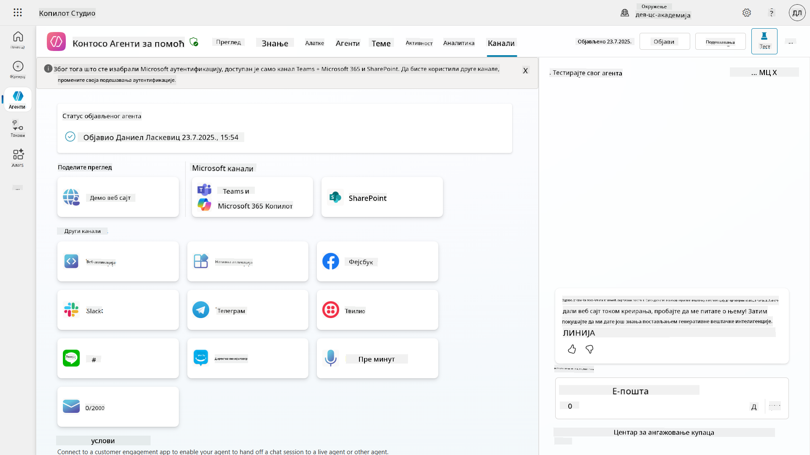

## 📺 Искуства канала

Различити канали имају различита корисничка искуства. Када правите агента за више канала, уверите се да сте свесни разлика између канала. Увек је добра стратегија тестирати свог агента на више канала како бисте били сигурни да ради оно што сте замислили.

| Искуство                          | Веб-сајт      | Teams и Microsoft 365 Copilot          | Facebook                 | Dynamics Omnichannel за корисничку подршку                  |
| --------------------------------- | ------------- | --------------------------------------- | ------------------------ | ----------------------------------------------------------- |
| [Анкета о задовољству корисника][1] | Адаптивна картица | Само текст                             | Само текст               | Само текст                                                  |
| [Опције вишеструког избора][1]     | Подржано      | [Подржано до шест (као херој картица)][4] | [Подржано до 13][6]      | [Делимично подржано][8]                                     |
| [Markdown][2]                     | Подржано      | [Делимично подржано][5]                | [Делимично подржано][7]  | [Делимично подржано][9]                                     |
| [Порука добродошлице][1]          | Подржано      | Подржано                               | Није подржано            | Подржано за [Chat][10]. Није подржано за друге канале.      |
| [Да ли сте мислили на][3]         | Подржано      | Подржано                               | Подржано                 | Подржано за [Microsoft Teams][11], [Chat][10], Facebook и текстуалне канале (SMS преко [TeleSign][12] и [Twilio][13], [WhatsApp][14], [WeChat][15] и [Twitter][16]). Предложене акције се приказују као текстуална листа; корисници морају поново да укуцају опцију да би одговорили. |

[1]: https://learn.microsoft.com/microsoft-copilot-studio/authoring-create-edit-topics  
[2]: https://daringfireball.net/projects/markdown/  
[3]: https://learn.microsoft.com/microsoft-copilot-studio/advanced-ai-features  
[4]: https://learn.microsoft.com/microsoftteams/platform/concepts/cards/cards-reference#hero-card  
[5]: https://learn.microsoft.com/microsoftteams/platform/bots/how-to/format-your-bot-messages#text-only-messages  
[6]: https://developers.facebook.com/docs/messenger-platform/send-messages/quick-replies/  
[7]: https://www.facebook.com/help/147348452522644?helpref=related  
[8]: https://learn.microsoft.com/dynamics365/customer-service/asynchronous-channels#suggested-actions-support  
[9]: https://learn.microsoft.com/dynamics365/customer-service/asynchronous-channels#preview-support-for-formatted-messages  
[10]: https://learn.microsoft.com/dynamics365/customer-service/set-up-chat-widget  
[11]: https://learn.microsoft.com/dynamics365/customer-service/configure-microsoft-teams  
[12]: https://learn.microsoft.com/dynamics365/customer-service/configure-sms-channel  
[13]: https://learn.microsoft.com/dynamics365/customer-service/configure-sms-channel-twilio  
[14]: https://learn.microsoft.com/dynamics365/customer-service/configure-whatsapp-channel  
[15]: https://learn.microsoft.com/dynamics365/customer-service/configure-wechat-channel  
[16]: https://learn.microsoft.com/dynamics365/customer-service/configure-twitter-channel  

> [!NOTE]  
> Постоје неки примери где можете користити различиту логику за различите канале. Пример за то можете пронаћи у Power Platform Snippets репозиторијуму:  
>
> Henry Jammes је поделио пример како приказати различиту адаптивну картицу када је канал Microsoft Teams. ([Линк ка примеру](https://github.com/pnp/powerplatform-snippets/blob/main/copilot-studio/multiple-topics-matched-topic/source/multiple-topics-matched.yaml#L40))

## 🧪 Лабораторија 11: Објавите свог агента у Teams и Microsoft 365 Copilot

### 🎯 Пример употребе

Ваш Contoso IT Help Desk агент је сада у потпуности конфигурисан са моћним могућностима—може приступити SharePoint изворима знања, креирати тикете за подршку, слати проактивне обавештења и интелигентно одговарати на упите корисника. Међутим, све ове функције су тренутно доступне само у развојном окружењу где сте их креирали.

**Изазов:** Крајњи корисници не могу да искористе могућности вашег агента док он не буде правилно објављен и учињен доступним преко канала на којима заправо раде.

**Решење:** Објављивање вашег агента осигурава да најновија верзија—са свим вашим недавним ажурирањима, новим темама, побољшаним изворима знања и конфигурисаним токовима—буде доступна стварним корисницима. Без објављивања, корисници би и даље комуницирали са старијом верзијом вашег агента која можда нема кључне функционалности.

Додавање Teams и Microsoft 365 Copilot канала је једнако важно јер:

- **Интеграција са Teams-ом**: Запослени у вашој организацији проводе већину свог радног дана у Microsoft Teams-у ради сарадње, састанака и комуникације. Додавањем вашег агента у Teams, корисници могу добити IT подршку без напуштања свог примарног радног окружења.

- **Microsoft 365 Copilot**: Корисници могу приступити вашем специјализованом IT Help Desk агенту директно у оквиру свог Microsoft 365 Copilot искуства, чинећи га беспрекорно интегрисаним у њихов свакодневни рад у Office апликацијама.

- **Централизовани приступ**: Уместо да памте одвојене веб-сајтове или апликације, корисници могу приступити IT подршци преко платформи које већ користе, смањујући трење и повећавајући усвајање.

Ова мисија трансформише ваш развојни рад у решење спремно за производњу које доноси стварну вредност крајњим корисницима ваше организације.

### Предуслови

Пре него што започнете ову лабораторију, уверите се да имате:

- ✅ Завршене претходне лабораторије и у потпуности конфигурисан Contoso Helpdesk Agent  
- ✅ Ваш агент је тестиран и спреман за употребу у производњи  
- ✅ Дозволе у вашем Copilot Studio окружењу за објављивање агената  
- ✅ Приступ Microsoft Teams-у у вашој организацији  

### 11.1 Објавите свог агента

Сада када је сав наш рад на агенту завршен, морамо се уверити да је сав наш рад доступан крајњим корисницима који ће користити нашег агента. Да би садржај био доступан свим корисницима, потребно је да објавимо нашег агента.

1. Идите на Contoso Helpdesk Agent у Copilot Studio (преко [Copilot Studio maker портала](https://copilotstudio.microsoft.com))

    У Copilot Studio-у, лако је објавити вашег агента. Само изаберите дугме за објављивање на врху прегледа агента.

    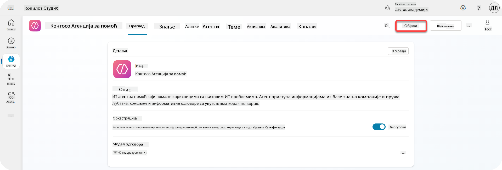

1. Изаберите дугме **Publish** у вашем агенту

    Отвара се поп-ап за објављивање - да потврдите да заиста желите да објавите свог агента.

    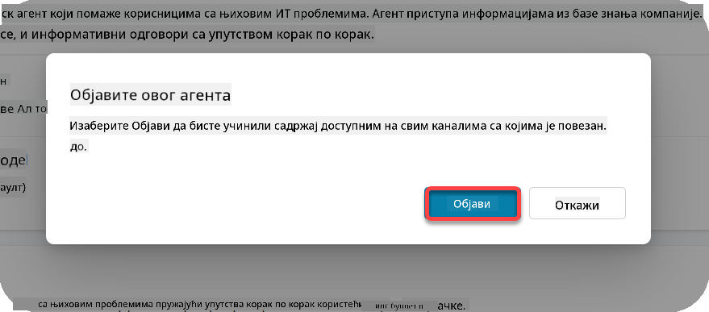

1. Изаберите **Publish** да потврдите објављивање вашег агента

    Сада се приказује порука да се ваш агент објављује. Не морате да држите тај поп-ап отворен. Бићете обавештени када агент буде објављен.

    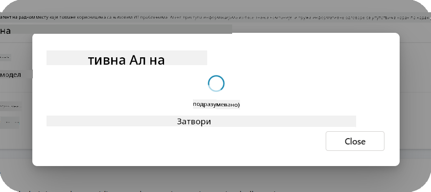

    Када се агент објави, видећете обавештење на врху странице агента.

    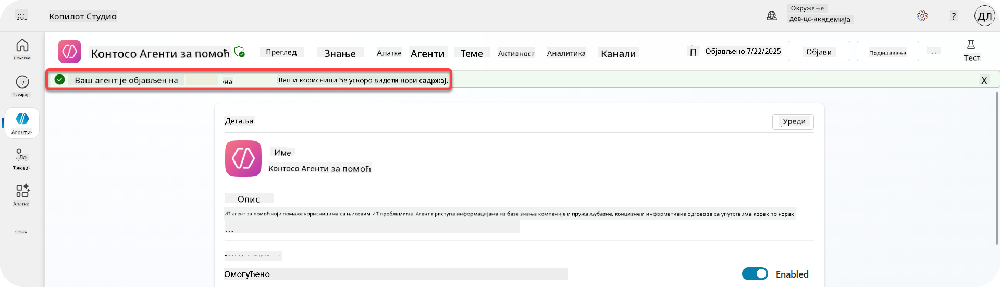

Али - само смо објавили агента, нисмо га додали ни на један канал, па хајде да то сада решимо!

### 11.2 Додајте Teams и Microsoft 365 Copilot канал

1. Да бисте додали Teams и Microsoft 365 Copilot канал вашем агенту, потребно је да изаберете **Channel** у горњој навигацији агента

    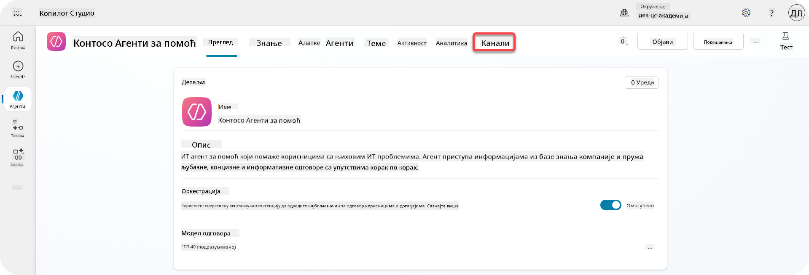

    Овде можемо видети све канале које можемо додати овом агенту.

1. Изаберите **Teams and Microsoft 365**

    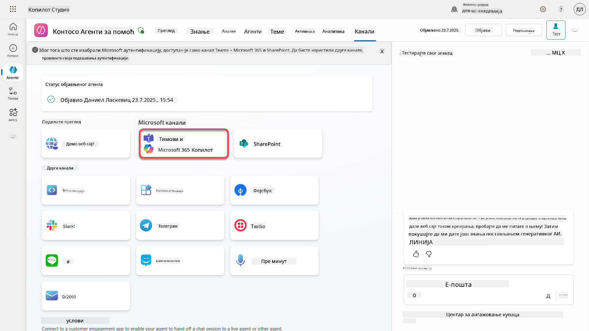

1. Изаберите **Add channel** да завршите чаробњака и додате канал агенту

    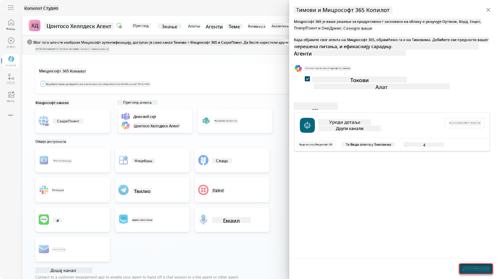

    Требаће мало времена док се канал не дода. Након што се дода, зелено обавештење ће се појавити на врху бочне траке.

    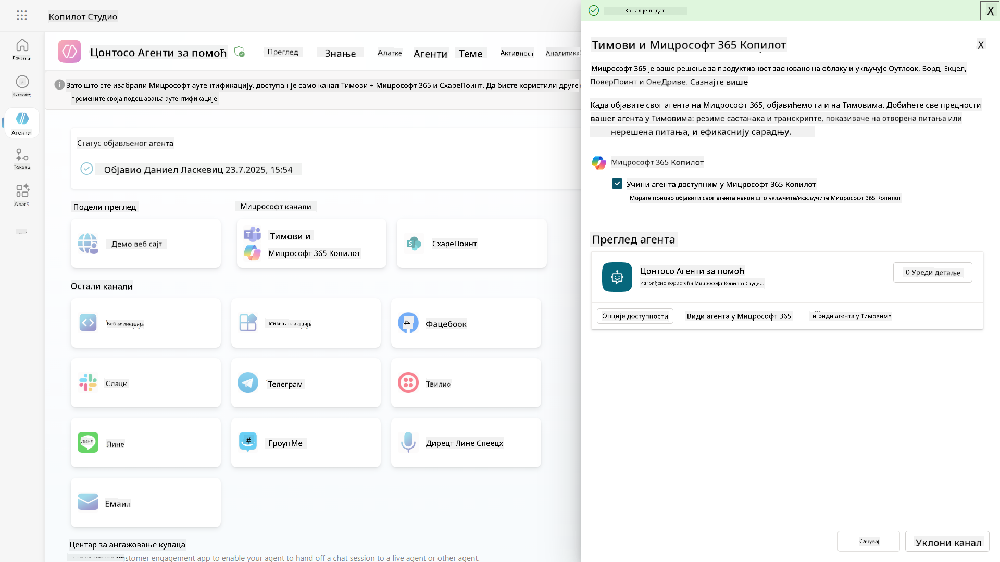

1. Изаберите **See agent in Teams** да отворите нови таб

    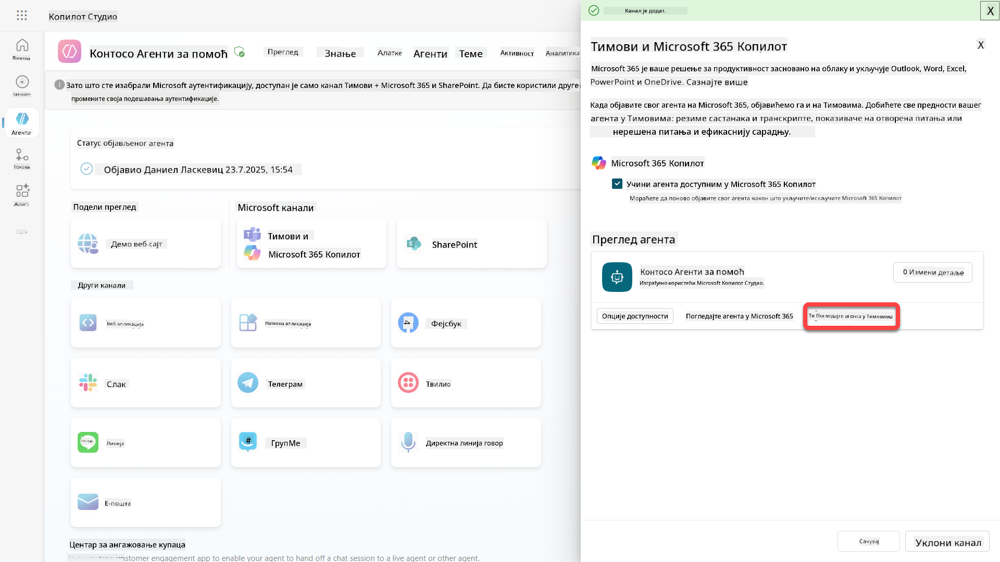

1. Изаберите **Add** да додате Contoso Helpdesk Agent у Teams

    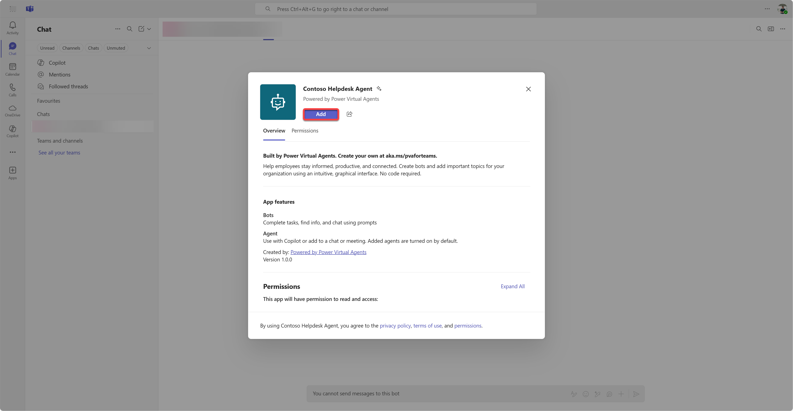

    Ово би требало да потраје мало времена. Након тога би требало да се прикаже следећи екран:

    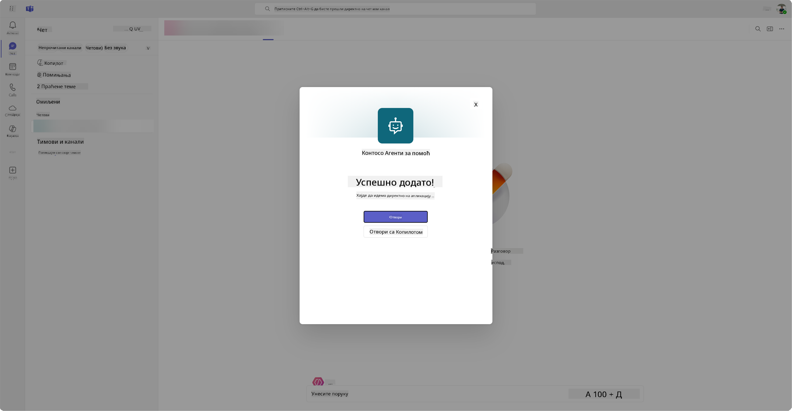

1. Изаберите **Open** да отворите агента у Teams-у

    Ово ће отворити агента у Teams-у као Teams апликацију

    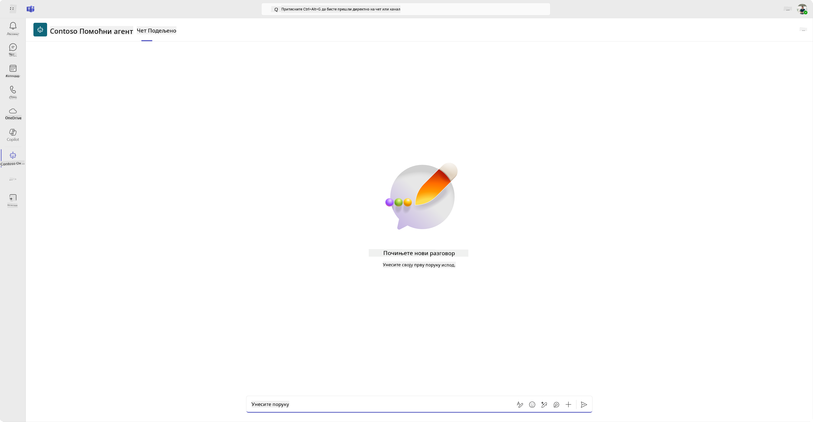

Сада смо објавили агента да ради за вас у Microsoft Teams-у, али можда желите да га учините доступним за више људи.

### 11.3 Учини агента доступним за све кориснике у тенанту

1. Затворите таб у претраживачу где је Contoso Helpdesk Agent отворен

    Ово би требало да вас врати у Copilot Studio где је Teams и Microsoft 365 Copilot бочна табла још увек отворена. Сада смо само отворили агента у Teams-у, али можемо урадити много више овде. Можемо уредити детаље агента, можемо га распоредити за више корисника и још много тога.

1. Изаберите **Edit details**

    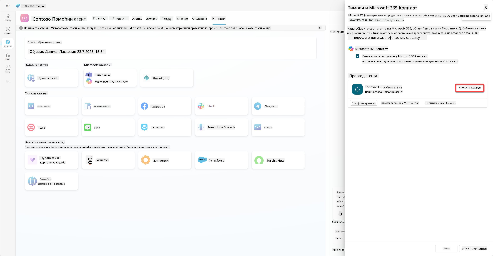
Ово ће отворити панел где можемо променити низ детаља и подешавања агента. Можемо променити основне детаље као што су икона, боја позадине иконе и описе. Такође можемо променити подешавања за Teams (на пример, дозволити кориснику да дода агента у тим или дозволити коришћење овог агента у групним и састанцима у чету) овде. Када изаберете *више*, можете променити детаље за програмере као што су име програмера, веб-сајт, изјава о приватности и услови коришћења.

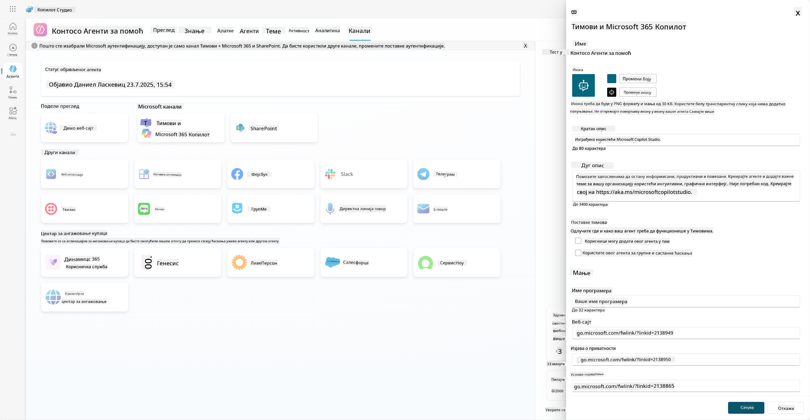

1. Изаберите **Cancel** да затворите панел за измену детаља.

1. Изаберите **Availability options**

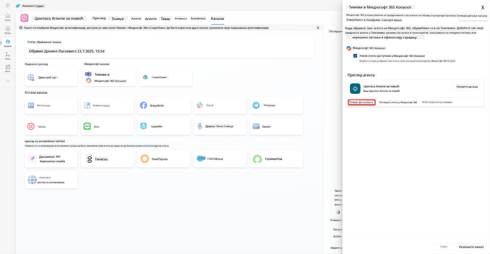

Ово ће отворити панел за опције доступности, где можете копирати линк који ћете послати корисницима да користе овог агента (имајте на уму, потребно је да поделите агента са корисником) и можете преузети датотеку за додавање вашег агента у Microsoft Teams или Microsoft 365 продавницу. Да бисте приказали агента у продавници, имате и друге опције: можете га приказати својим колегама и корисницима са којима је подељен (да се прикаже у секцији *Изграђено са Power Platform*) или можете да га прикажете свима у вашој организацији (ово захтева одобрење администратора).

1. Изаберите **Show to everyone in my org**

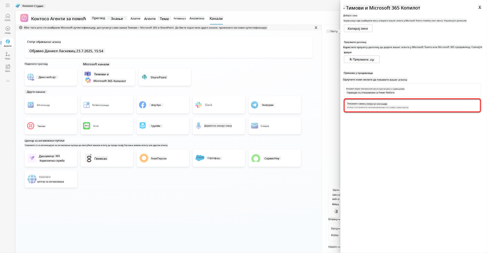

1. Изаберите **Submit for admin approval**

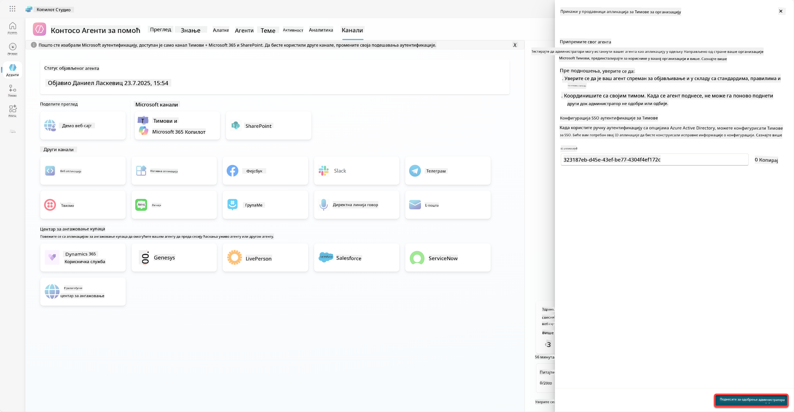

Сада ваш администратор мора да одобри подношење вашег агента. То могу учинити тако што ће отићи у Teams Admin Center и потражити Contoso Helpdesk Agent у апликацијама. На снимку екрана можете видети шта би администратор видео у Teams Admin Center.

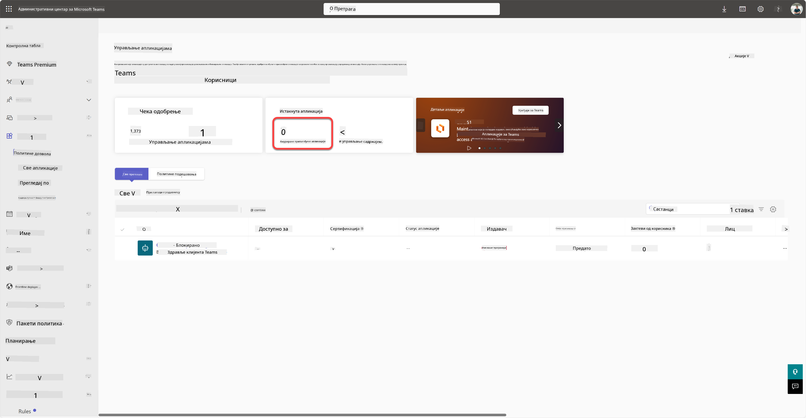

Администратор мора да изабере Contoso Helpdesk Agent и изабере *Publish* да објави Contoso Helpdesk Agent свима.

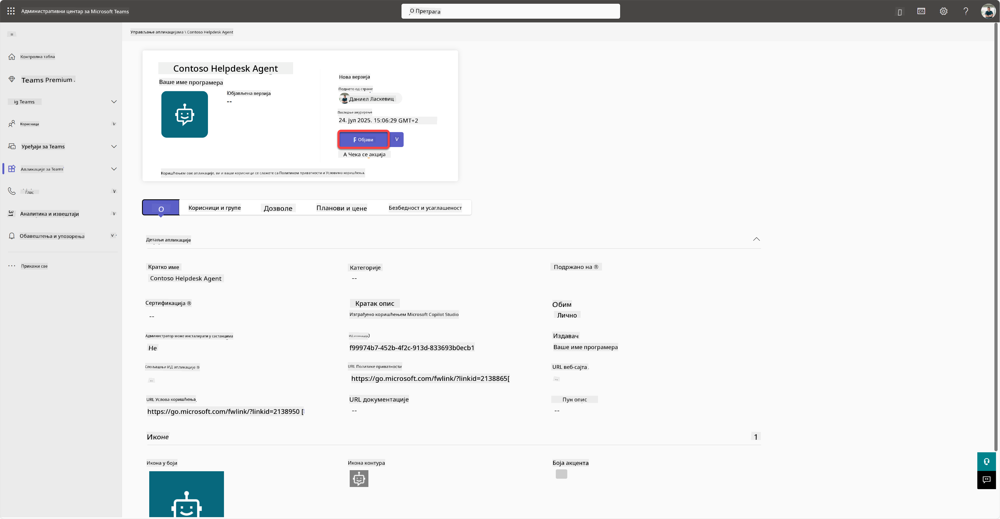

Када администратор објави подношење агента, моћи ћете да освежите Copilot Studio и требало би да видите банер *доступно у продавници апликација* у опцијама доступности.

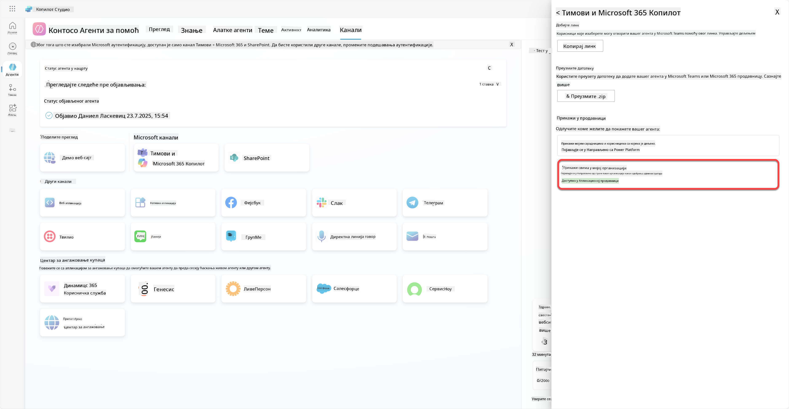

Овде постоје још више могућности. Ваш администратор може променити глобалну политику подешавања и аутоматски инсталирати Contoso Helpdesk Agent за све у тенанту. Поред тога - можете да закачите Contoso Helpdesk Agent на леву траку тако да сви имају лак приступ.

## ✅ Мисија завршена

🎉 **Честитамо!** Успешно сте објавили вашег агента и додали га у Teams и Microsoft 365 Copilot! Следеће је последња мисија курса: Разумевање лиценцирања.

⏭️ [Прелазак на лекцију **Разумевање лиценцирања**](../12-understanding-licensing/README.md)

## 📚 Тактички ресурси

🔗 [Документација о каналима за објављивање](https://learn.microsoft.com/microsoft-copilot-studio/publication-fundamentals-publish-channels)

---

**Одрицање од одговорности**:  
Овај документ је преведен коришћењем услуге за превођење помоћу вештачке интелигенције [Co-op Translator](https://github.com/Azure/co-op-translator). Иако настојимо да обезбедимо тачност, молимо вас да имате у виду да аутоматски преводи могу садржати грешке или нетачности. Оригинални документ на изворном језику треба сматрати меродавним извором. За критичне информације препоручује се професионални превод од стране људи. Не преузимамо одговорност за било каква погрешна тумачења или неспоразуме који могу настати услед коришћења овог превода.