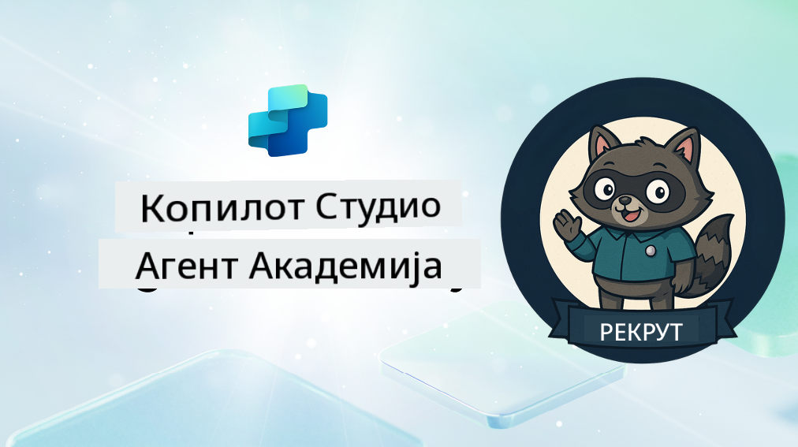

<!--
CO_OP_TRANSLATOR_METADATA:
{
  "original_hash": "8b5ecad9d5d073ea3f4c2b844e80f2e5",
  "translation_date": "2025-10-20T23:19:10+00:00",
  "source_file": "docs/recruit/README.md",
  "language_code": "sr"
}
-->
# Добродошли, Рекруту

**Добродошли, Рекруту.**  
Ваша мисија—ако је прихватите—јесте да савладате вештину креирања агената користећи **Microsoft Copilot Studio**.

Ова практична обука је ваш улазак у **свет агената**: од основних упита до Adaptive Cards и токова агената, научићете како да креирате, скалирате и имплементирате интелигентне агенте користећи алате и примере из стварног света.

---

## 🎯 Циљ Мисије

Завршетком Академије за агенте, бићете у могућности да:

- Разумете шта су агенти у контексту Microsoft Copilot Studio
- Истражите како се велики језички модели (LLMs), генерација уз помоћ претраживања (RAG) и оркестрација спајају у агента
- Креирате и **декларативне** и **прилагођене агенте**
- Унапредите агенте помоћу **Тема**, **Adaptive Cards** и **Токова агената**
- Имплементирате агенте у **Microsoft Teams** и **Microsoft 365 Copilot**

---

## 🧪 Предуслови

Да бисте завршили све мисије, потребно вам је:

- Microsoft 365 Developer налог (са омогућеним SharePoint-ом)
- Приступ **Microsoft Copilot Studio** (пробна верзија или лиценцирана)
- Опционо: Основно знање о SharePoint-у, Power Platform-у или Power Fx-у

---

## 🧬 За кога је намењено

Овај курс је идеалан за:

- Креаторе и програмере који истражују **Copilot Studio**
- IT професионалце који креирају **Microsoft 365 Copilot екстензије**
- Ентузијасте Power Platform-а који желе да **унапреде своје вештине** са интелигентним агентима
- Свакога ко више воли да учи кроз **праксу**

---

## 🧭 Преглед Наставног Плана

Ова академија је подељена на прогресивне лекције—свака је осмишљена као мисија на терену за унапређење ваших вештина у креирању агената.

| Лекција | Наслов | Опис Мисије |
|---------|--------|-------------|
| `00` | 🧰 [Подешавање Курсa](./00-course-setup/README.md) | Подесите своје развојно окружење, пробну верзију Copilot Studio и SharePoint сајт |
| `01` | 🧠 [Увод у Агенте](./01-introduction-to-agents/README.md) | Разумите концепте конверзационе AI, LLM-ове и аутономне vs. декларативне агенте |
| `02` | 🛠️ [Основе Copilot Studio](./02-copilot-studio-fundamentals/README.md) | Научите основне елементе: знање, вештине, аутономија |
| `03` | 👩‍💻 [Креирање Декларативног Агента](./03-create-a-declarative-agent-for-M365Copilot/README.md) | Додајте свог агента у Microsoft 365 Copilot, заснованог на упиту |
| `04` | 🧩 [Креирање Решења](./04-creating-a-solution/README.md) | Пакетујте свог агента у поновљиво решење за управљање окружењем |
| `05` | 🚀 [Почетак са Унапред Креираним Агентима](./05-using-prebuilt-agents/README.md) | Користите и прилагодите шаблон агента за убрзано подешавање |
| `06` | ✍️ [Креирање Прилагођеног Агента](./06-create-agent-from-conversation/README.md) | Креирајте нови Copilot заснован на изворима знања |
| `07` | 🧠 [Додавање Теме са Окидачима](./07-add-new-topic-with-trigger/README.md) | Користите Теме за дефинисање прилагођених путева питања/одговора |
| `08` | 🪪 [Унапређење са Adaptive Cards](./08-add-adaptive-card/README.md) | Креирајте Adaptive Card користећи Power Fx и SharePoint |
| `09` | 🔁 [Аутоматизација са Токовима Агента](./09-add-an-agent-flow/README.md) | Користите унос у Adaptive Card за покретање позадинских токова |
| `10` | 🧭 [Додавање Окидача за Догађаје](./10-add-event-triggers/README.md) | Омогућите свом агенту да делује аутономно користећи логику засновану на догађајима |
| `11` | 📢 [Објављивање Вашег Агента](./11-publish-your-agent/README.md) | Имплементирајте свог агента у Microsoft Teams и Microsoft 365 Copilot |
| `12` | 🪪 [Разумевање Лиценцирања](./12-understanding-licensing/README.md) | Сазнајте како функционише лиценцирање и наплата у Copilot Studio |
| `13` | 🚨 [Осигурање Ваше Рекрут Значке](./course-completion-badges-recruit/README.md) | Преузмите своју значку и обележите своје постигнуће! |

!!! note
    ✅ Завршетком овог наставног плана добијате **Рекрут** значку.  
    🔓 **Оперативац** и **Командант** ће бити доступни у будућим фазама.

<!-- markdownlint-disable-next-line MD033 -->

---

**Одрицање од одговорности**:  
Овај документ је преведен помоћу услуге за превођење уз помоћ вештачке интелигенције [Co-op Translator](https://github.com/Azure/co-op-translator). Иако настојимо да обезбедимо тачност, молимо вас да имате у виду да аутоматски преводи могу садржати грешке или нетачности. Оригинални документ на његовом изворном језику треба сматрати меродавним извором. За критичне информације препоручује се професионални превод од стране људи. Не преузимамо одговорност за било каква погрешна тумачења или неспоразуме који могу настати услед коришћења овог превода.