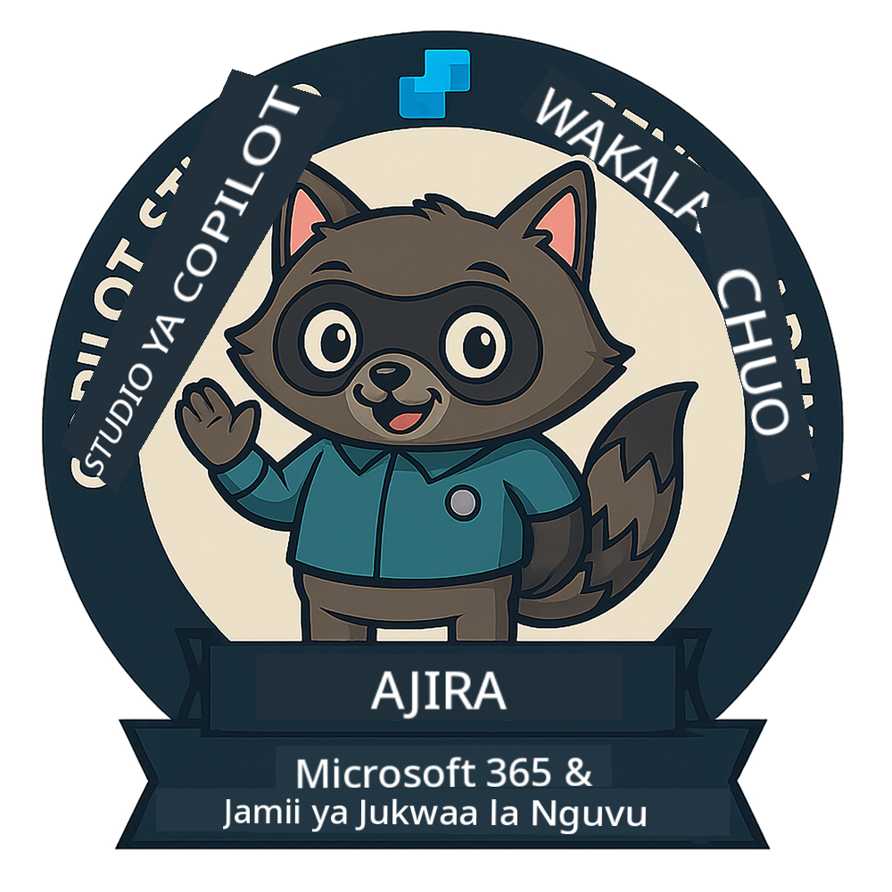

<!--
CO_OP_TRANSLATOR_METADATA:
{
  "original_hash": "15e57e059ce7689d602d7853187235cd",
  "translation_date": "2025-10-20T00:30:03+00:00",
  "source_file": "docs/index.md",
  "language_code": "sw"
}
-->
---
hide:
- navigation
---

# Copilot Studio Agent Academy

**Karibu kwenye Copilot Studio Agent Academy.**  

Dhamira yako—ukiamua kuikubali—ni kujifunza sanaa ya kujenga mawakala kwa kutumia **Microsoft Copilot Studio**.

Mafunzo haya ya vitendo ni njia yako ya kuingia katika **ulimwengu wa mawakala**: kutoka kwa maelekezo yaliyoimarishwa hadi Adaptive Cards na mtiririko wa mawakala, utajifunza jinsi ya kujenga, kupanua, na kupeleka mawakala wenye akili kwa kutumia zana halisi na mifano ya matumizi.

---

## 🏅 Maendeleo ya Cheo

**Copilot Studio Agent Academy** ni programu ya mafunzo ya awamu nyingi iliyoundwa kukuza ujuzi wako katika vyeo vitatu vya mawakala. Kila ngazi inajumuisha beji na majukumu yanayoongezeka:

| Cheo             | Ngazi | Picha |
|------------------|:-----:|--------|
| 🟢 **Mwanachama Mpya**  [🚀 Anza sasa](https://aka.ms/agent-academy-recruit){ .md-button .md-button--primary }     | •     | { width="300" }     |
| 🔵 **Operative** (Inakuja Hivi Karibuni)   | ••    | { width="300" } |
| 🟡 **Kamanda** (Inakuja Hivi Karibuni)    | •••   | { width="300" } |

Kila ngazi inajenga juu ya ile ya awali. Maliza dhamira yako ya Mwanachama Mpya, na endelea kusubiri ili kupandisha cheo chako cha wakala.

---

## 🎒 Kozi Nyingine

Angalia kozi hizi nyingine ili kuendelea kujifunza kuhusu AI na Mawakala:

- [Microsoft Copilot Studio <3 MCP Lab](https://aka.ms/mcsmcplab)
- [Copilot Developer Camp](https://microsoft.github.io/copilot-camp/)
- [AI Agents for Beginners](https://microsoft.github.io/ai-agents-for-beginners/)
- [Model Context Protocol (MCP) For Beginners](https://github.com/microsoft/mcp-for-beginners)

---

## 🚑 Masuala

Tunashukuru sana maoni yako! Tafadhali tumia [orodha ya masuala](https://github.com/microsoft/agent-academy/issues) kushiriki maoni na masuala yako. Asante!

---

## 📜 Kanuni za Maadili

Mradi huu umechukua [Kanuni za Maadili za Microsoft Open Source](https://opensource.microsoft.com/codeofconduct/).

!!! info "Rasilimali:"

    - [Kanuni za Maadili za Microsoft Open Source](https://opensource.microsoft.com/codeofconduct/)
    - [Maswali Yanayoulizwa Mara kwa Mara kuhusu Kanuni za Maadili za Microsoft](https://opensource.microsoft.com/codeofconduct/faq/)
    - Wasiliana na [opencode@microsoft.com](mailto:opencode@microsoft.com) kwa maswali au wasiwasi

---

[⭐️ Penda repo yetu](https://github.com/microsoft/agent-academy){ .md-button .md-button--primary }

<!-- markdownlint-disable-next-line MD033 -->

---

**Kanusho**:  
Hati hii imetafsiriwa kwa kutumia huduma ya tafsiri ya AI [Co-op Translator](https://github.com/Azure/co-op-translator). Ingawa tunajitahidi kwa usahihi, tafadhali fahamu kuwa tafsiri za kiotomatiki zinaweza kuwa na makosa au kutokuwa sahihi. Hati ya asili katika lugha yake ya awali inapaswa kuzingatiwa kama chanzo cha mamlaka. Kwa taarifa muhimu, tafsiri ya kitaalamu ya binadamu inapendekezwa. Hatutawajibika kwa kutoelewana au tafsiri zisizo sahihi zinazotokana na matumizi ya tafsiri hii.