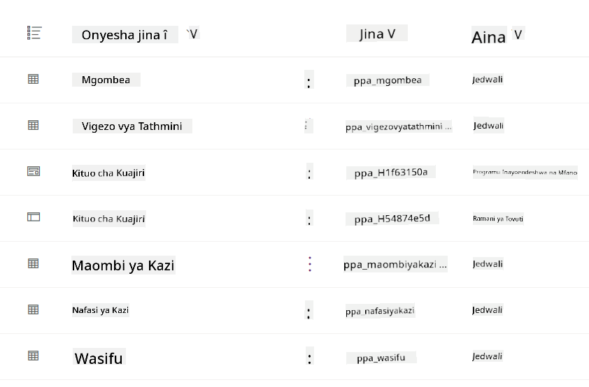
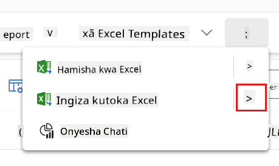
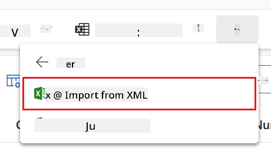
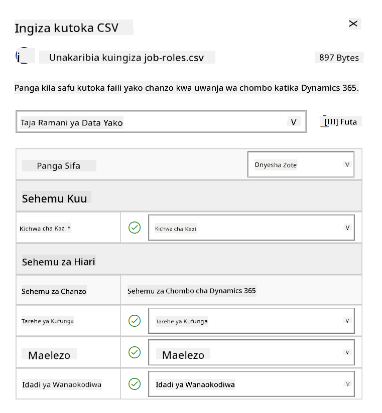
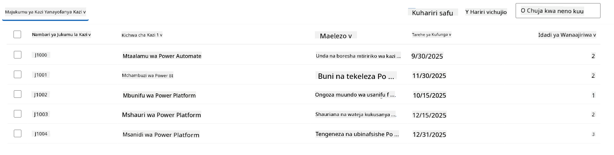
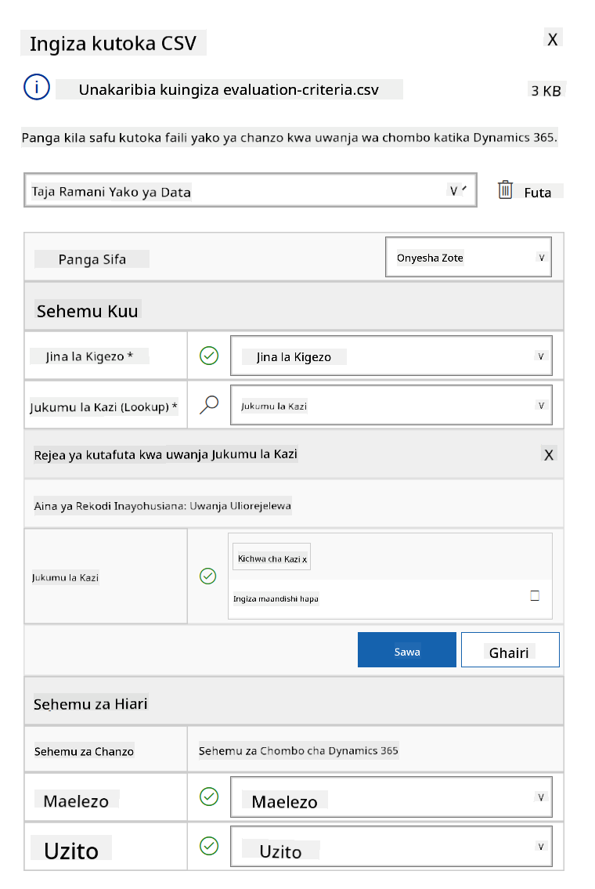
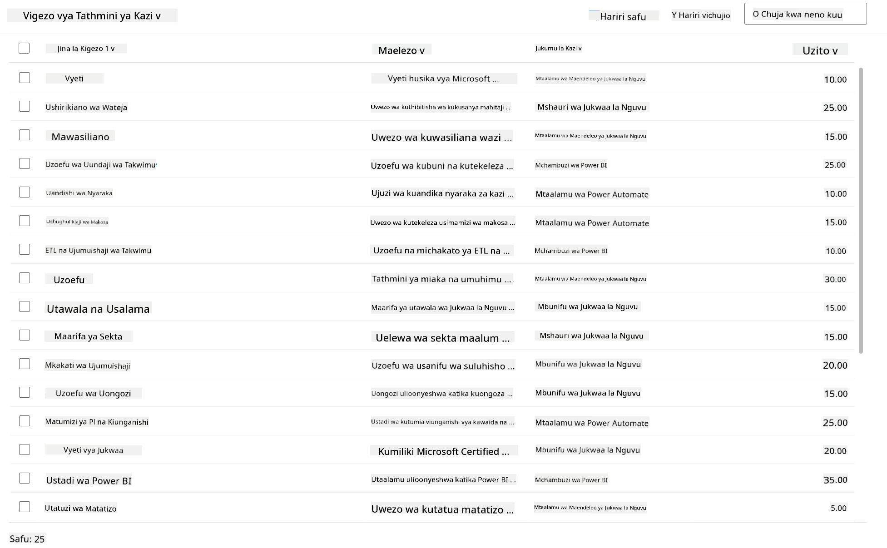

<!--
CO_OP_TRANSLATOR_METADATA:
{
  "original_hash": "2620cf9eaf09a3fc6be7fa31a3a62956",
  "translation_date": "2025-10-20T01:05:02+00:00",
  "source_file": "docs/operative-preview/01-get-started/README.md",
  "language_code": "sw"
}
-->
# 🚨 Kazi 01: Anza na Wakala wa Kuajiri

--8<-- "disclaimer.md"

## 🕵️‍♂️ JINA LA KODI: `OPERESHENI MTAFUTA VIPAJI`

> **⏱️ Muda wa Operesheni:** `~dakika 45`

## 🎯 Maelezo ya Kazi

Karibu, Wakala. Kazi yako ya kwanza ni **Operesheni Mtafuta Vipaji** - kuanzisha miundombinu ya msingi kwa mfumo wa kuajiri unaotumia AI ambao utabadilisha jinsi mashirika yanavyotambua na kuajiri vipaji bora.

Kazi yako, ikiwa utaamua kuikubali, ni kuanzisha na kusanidi mfumo wa usimamizi wa kuajiri kwa kutumia Microsoft Copilot Studio. Utaleta suluhisho lililotengenezwa tayari lenye miundo yote muhimu ya data, kisha utaunda wakala wako wa kwanza wa AI - **Wakala wa Kuajiri** - ambaye atakuwa msimamizi mkuu wa operesheni zote za kuajiri zijazo.

Uanzishaji huu wa awali utaanzisha kituo cha amri ambacho utaboresha katika kipindi chote cha programu ya Operative ya Agent Academy. Fikiria hii kama msingi wako wa operesheni - msingi ambao utajenga mtandao mzima wa mawakala maalum katika kazi zijazo.

---

## 🔎 Malengo

Kwa kukamilisha kazi hii, utaweza:

- **Kuelewa Hali ya Kisa**: Kupata uelewa wa kina wa changamoto na suluhisho za kiotomatiki za kuajiri
- **Uanzishaji wa Suluhisho**: Kuleta na kusanidi misingi ya mfumo wa usimamizi wa kuajiri
- **Uundaji wa Wakala**: Kuunda wakala wa kuajiri ambaye ni mwanzo wa kisa unachojenga kama Operative wa Agent Academy

---

## 🔍 Mahitaji ya Awali

Kabla ya kuanza kazi hii, hakikisha una:

- Leseni ya Copilot Studio
- Ufikiaji wa mazingira ya Microsoft Power Platform
- Ruhusa za kiutawala za kuunda suluhisho na mawakala

---

## 🏢 Kuelewa Hali ya Kiotomatiki ya Kuajiri

Kisa hiki kinaonyesha jinsi kampuni inaweza kutumia Microsoft Copilot Studio kuboresha na kuotomatisha mchakato wake wa kuajiri. Kinaanzisha mfumo wa mawakala wanaoshirikiana kushughulikia kazi kama vile kupitia wasifu, kupendekeza nafasi za kazi, kuandaa nyaraka za mahojiano, na kutathmini wagombea.

### Thamani ya Biashara

Suluhisho linasaidia timu za HR kuokoa muda na kufanya maamuzi bora kwa:

- Kushughulikia kiotomatiki wasifu unaopokelewa kupitia barua pepe.
- Kupendekeza nafasi za kazi zinazofaa kulingana na wasifu wa mgombea.
- Kuunda maombi ya kazi na miongozo ya mahojiano inayolingana na kila mgombea.
- Kuhakikisha mazoea ya kuajiri yanayozingatia usawa na kufuata sheria kupitia vipengele vya usalama vilivyojengwa ndani.
- Kukusanya maoni ili kuboresha suluhisho.

### Jinsi Inavyofanya Kazi

- **Wakala wa Kuajiri** wa kati anaratibu mchakato na kuhifadhi data katika Microsoft Dataverse.
- **Wakala wa Kupokea Maombi** husoma wasifu na kuunda maombi ya kazi.
- **Wakala wa Kuandaa Mahojiano** hutengeneza maswali ya mahojiano na nyaraka kulingana na historia ya mgombea.
- Mfumo unaweza kuchapishwa kwenye tovuti ya maonyesho, kuruhusu wadau kuingiliana nao.

Kisa hiki ni bora kwa mashirika yanayotafuta kuboresha mchakato wao wa kuajiri kwa kutumia kiotomatiki inayotumia AI, huku yakidumisha uwazi, usawa, na ufanisi.

---

## 🧪 Maabara: Sanidi Wakala wa Kuajiri

Katika maabara hii ya vitendo, utaanzisha msingi wa mfumo wako wa kiotomatiki wa kuajiri. Utaanza kwa kuleta suluhisho lililosanidiwa tayari lenye meza zote muhimu za Dataverse na muundo wa data wa kusimamia wagombea, nafasi za kazi, na mchakato wa kuajiri. Kisha, utaweka data ya mfano kwenye meza hizi ili kusaidia kujifunza kwako katika moduli hii na kutoa hali halisi za majaribio. Hatimaye, utaunda Wakala wa Kuajiri katika Copilot Studio, ukisanidi kiolesura cha mazungumzo cha msingi ambacho kitakuwa msingi wa vipengele vingine vyote utakavyoongeza katika kazi zijazo.

### 🧪 Maabara 1.1: Leta suluhisho

1. Nenda kwenye **[Copilot Studio](https://copilotstudio.microsoft.com)**
1. Chagua **...** kwenye urambazaji wa kushoto na uchague **Suluhisho**
1. Chagua kitufe cha **Leta Suluhisho** juu
1. **[Pakua](https://raw.githubusercontent.com/microsoft/agent-academy/refs/heads/main/docs/operative-preview/01-get-started/assets/Operative_1_0_0_0.zip)** suluhisho lililoandaliwa
1. Chagua **Vinjari** na uchague suluhisho ulilopakua katika hatua ya awali
1. Chagua **Inayofuata**
1. Chagua **Leta**

!!! success
    Ukifanikiwa, utaona upau wa arifa ya kijani na ujumbe ufuatao ukimaliza:  
    "Suluhisho "Operative" limeletwa kwa mafanikio."

Suluhisho likishaletwa, angalia ulicholetewa kwa kuchagua jina la kuonyesha la suluhisho (`Operative`).



Vipengele vifuatavyo vimeletwa:

| Jina la Kuonyesha | Aina | Maelezo |
|-------------------|------|---------|
| Mgombea | Meza | Taarifa za mgombea |
| Vigezo vya Tathmini | Meza | Vigezo vya tathmini kwa nafasi |
| Kituo cha Kuajiri | Programu Inayoendeshwa na Mfano | Programu ya kusimamia mchakato wa kuajiri |
| Kituo cha Kuajiri | Ramani ya Tovuti | Muundo wa urambazaji wa programu ya Kituo cha Kuajiri |
| Maombi ya Kazi | Meza | Maombi ya kazi |
| Nafasi ya Kazi | Meza | Nafasi za kazi |
| Wasifu | Meza | Wasifu wa wagombea |

Kama kazi ya mwisho kwa maabara hii, Chagua kitufe cha **Chapisha ubinafsishaji wote** juu ya ukurasa.

### 🧪 Maabara 1.2: Leta data ya mfano

Katika maabara hii, utaongeza data ya mfano kwenye baadhi ya meza ulizoleta katika maabara ya 1.1.

#### Pakua faili za kuleta

1. **[Pakua](https://raw.githubusercontent.com/microsoft/agent-academy/refs/heads/main/docs/operative-preview/01-get-started/assets/evaluation-criteria.csv)** faili ya CSV yenye vigezo vya tathmini
1. **[Pakua](https://raw.githubusercontent.com/microsoft/agent-academy/refs/heads/main/docs/operative-preview/01-get-started/assets/job-roles.csv)** faili ya CSV yenye nafasi za kazi

#### Leta data ya mfano ya Nafasi za Kazi

1. Rudi kwenye suluhisho uliloletewa katika maabara ya mwisho
1. Chagua programu ya Kituo cha Kuajiri Inayoendeshwa na Mfano kwa kuchagua alama ya tiki mbele ya safu
1. Chagua kitufe cha **Cheza** juu

    !!! warning
        Unaweza kuombwa kuingia tena. Hakikisha unafanya hivyo. Baada ya kufanya hivyo, unapaswa kuona programu ya Kituo cha Kuajiri.

1. Chagua **Nafasi za Kazi** kwenye urambazaji wa kushoto
1. Chagua ikoni ya **Zaidi** (nukta tatu zilizo chini ya kila moja) kwenye upau wa amri
1. Chagua **mshale wa kulia** karibu na *Leta kutoka Excel*

    

1. Chagua **Leta kutoka CSV**

    

1. Chagua kitufe cha **Chagua Faili**, chagua faili ya **job-roles.csv** uliyopakua na kisha chagua **Fungua**
1. Chagua **Inayofuata**
1. Acha hatua inayofuata kama ilivyo na chagua **Kagua Ulinganifu**

    

1. Hakikisha ulinganifu ni sahihi na chagua **Maliza Leta**

    !!! info
        Hii itaanzisha mchakato wa kuleta na utaweza kufuatilia maendeleo au kumaliza mchakato mara moja kwa kuchagua **Imekamilika**

1. Chagua **Imekamilika**

Hii inaweza kuchukua muda kidogo, lakini unaweza kubonyeza kitufe cha **Refresh** ili kuona kama kuleta kumefanikiwa.



#### Leta data ya mfano ya Vigezo vya Tathmini

1. Chagua **Vigezo vya Tathmini** kwenye urambazaji wa kushoto
1. Chagua ikoni ya **Zaidi** (nukta tatu zilizo chini ya kila moja) kwenye upau wa amri
1. Chagua **mshale wa kulia** karibu na *Leta kutoka Excel*

    

1. Chagua **Leta kutoka CSV**

    

1. Chagua kitufe cha **Chagua Faili**, chagua faili ya **evaluation-criteria.csv** uliyopakua na kisha chagua **Fungua**
1. Chagua **Inayofuata**
1. Acha hatua inayofuata kama ilivyo na chagua **Kagua Ulinganifu**

    

1. Sasa tunahitaji kufanya kazi zaidi kwa ulinganifu. Chagua ikoni ya darubini (🔎) karibu na sehemu ya Nafasi ya Kazi
1. Hakikisha **Jina la Kazi** limechaguliwa hapa, na ikiwa sivyo - ongeza
1. Chagua **Sawa**
1. Hakikisha ulinganifu mwingine pia ni sahihi na chagua **Maliza Leta**

    !!! info
        Hii itaanzisha mchakato wa kuleta tena na utaweza kufuatilia maendeleo au kumaliza mchakato mara moja kwa kuchagua **Imekamilika**

1. Chagua **Imekamilika**

Hii inaweza kuchukua muda kidogo, lakini unaweza kubonyeza kitufe cha **Refresh** ili kuona kama kuleta kumefanikiwa.



### 🧪 Maabara 1.3: Unda wakala wa kuajiri

Sasa umemaliza kusanidi mahitaji ya awali, ni wakati wa kazi halisi! Hebu tuongeze Wakala wetu wa Kuajiri kwanza!

1. Nenda kwenye **[Copilot Studio](https://copilotstudio.microsoft.com)** na hakikisha uko katika mazingira sawa na mahali ulipoleta suluhisho na data
1. Chagua **Mawakala** kwenye urambazaji wa kushoto
1. Chagua **Wakala Mpya**
1. Chagua **Sanidi**
1. Kwa **Jina**, ingiza:

    ```text
    Hiring Agent
    ```

1. Kwa **Maelezo**, ingiza:

    ```text
    Central orchestrator for all hiring activities
    ```

1. Chagua **...** karibu na kitufe cha *Unda* juu kulia
1. Chagua **Sasisha mipangilio ya hali ya juu**
1. Kama **Suluhisho**, chagua `Operative`
1. Chagua **Sasisha**
1. Chagua **Unda** juu kulia

Hii itaunda Wakala wa Kuajiri kwako, ambaye utatumia katika kozi hii ya Operative.

---

## 🎉 Kazi Imekamilika

Kazi 01 imekamilika! Sasa umemiliki ujuzi ufuatao:

✅ **Kuelewa Hali ya Kisa**: Uelewa wa kina wa changamoto na suluhisho za kiotomatiki za kuajiri  
✅ **Uanzishaji wa Suluhisho**: Umeleta na kusanidi misingi ya mfumo wa usimamizi wa kuajiri  
✅ **Uundaji wa Wakala**: Umeunda wakala wa kuajiri ambaye ni mwanzo wa kisa unachojenga kama Operative wa Agent Academy  

Kazi inayofuata ni [Kazi 02](../02-multi-agent/README.md): Fanya wakala wako kuwa tayari kwa mawakala wengi kwa kuunganisha mawakala.

---

## 📚 Rasilimali za Kijeshi

📖 [Microsoft Copilot Studio - Unda wakala](https://learn.microsoft.com/microsoft-copilot-studio/authoring-first-bot)  
📖 [Nyaraka za Microsoft Dataverse](https://learn.microsoft.com/power-apps/maker/data-platform)

---

**Kanusho**:  
Hati hii imetafsiriwa kwa kutumia huduma ya tafsiri ya AI [Co-op Translator](https://github.com/Azure/co-op-translator). Ingawa tunajitahidi kwa usahihi, tafadhali fahamu kuwa tafsiri za kiotomatiki zinaweza kuwa na makosa au kutokuwa sahihi. Hati ya asili katika lugha yake ya asili inapaswa kuzingatiwa kama chanzo cha mamlaka. Kwa taarifa muhimu, tafsiri ya kitaalamu ya binadamu inapendekezwa. Hatutawajibika kwa kutoelewana au tafsiri zisizo sahihi zinazotokana na matumizi ya tafsiri hii.