<!--
CO_OP_TRANSLATOR_METADATA:
{
  "original_hash": "75efaf515d5694d4fd549bfd6518901a",
  "translation_date": "2025-10-20T01:13:04+00:00",
  "source_file": "docs/operative-preview/03-automate-triggers/README.md",
  "language_code": "sw"
}
-->
# Dhamira 03: Ongeza Vichochezi vya Matukio ili kutenda kwa uhuru

--8<-- "disclaimer.md"

## 🕵️‍♂️ JINA LA KODI: `OPERESHENI SIGNAL POINT`

> **⏱️ Muda wa Operesheni:** `~dakika 45`

## 🎯 Maelezo ya Dhamira

Karibu tena, Wakala. Katika [Dhamira 02](../02-multi-agent/README.md) - ulijifunza jinsi ya kujenga wakala mdogo wa Kupokea Maombi na wakala wa Kujiandaa kwa Mahojiano ili kupanua uwezo wa Wakala wako mkuu wa Kuajiri.

Kazi yako, ikiwa utaamua kuikubali, ni **Operesheni Signal Point** - kuchunguza kwa kina **vichochezi vya matukio** - kuinua mfumo wako wa wakala kutoka hali ya kujibu hadi **utendaji wa uhuru**. Utabadilisha mawakala wako kutoka kusubiri pembejeo za binadamu hadi kujibu kwa proakti matukio ya nje na kuchukua hatua za busara bila usimamizi.

Fikiria kama kuboresha kutoka kwa mawakala wanaojibu maswali hadi mawakala wanaotabiri mahitaji na kutenda kwa uhuru. Kupitia vichochezi vya matukio na mtiririko wa kazi otomatiki, Wakala wako wa Kuajiri atatambua barua pepe zinazoingia zenye wasifu, kushughulikia viambatisho kiotomatiki, kuhifadhi data kwenye Dataverse, na kuwajulisha timu yako ya HR kupitia Microsoft Teams - yote haya wakati unazingatia kazi za thamani ya juu.

Karibu katika ulimwengu ambapo otomatiki inakutana na akili.

## 🔎 Malengo

Katika dhamira hii, utajifunza:

1. Jinsi vichochezi vya matukio vinavyowezesha tabia ya wakala wa uhuru bila mwingiliano wa mtumiaji
1. Tofauti kati ya mawakala wa mazungumzo na mawakala wa uhuru katika Copilot Studio
1. Jinsi ya kuunda vichochezi vya matukio vinavyoshughulikia kiotomatiki viambatisho vya barua pepe na kupakia faili kwenye Dataverse
1. Jinsi ya kujenga mtiririko wa wakala unaotuma kadi za kubadilika kwenye njia za Teams kwa ajili ya arifa
1. Jinsi ya kupitisha data kati ya vichochezi vya matukio na mtiririko wa wakala kwa otomatiki ya mwisho hadi mwisho

## 🤔 Kichochezi cha Tukio ni nini?

Hapo awali katika [Recruit](../../recruit/10-add-event-triggers/README.md), tulijifunza kuhusu vichochezi vya matukio. Hebu tufanye muhtasari wa haraka kuhusu hili iwapo ulilikosa.

**Vichochezi vya matukio** vinamruhusu wakala _kutenda_ peke yake wakati kitu kinatokea katika mfumo mwingine - hakuna ujumbe wa mtumiaji unaohitajika. Wakati tukio lililowekwa linapotokea - kama vile “kipengee kipya cha SharePoint,” “barua pepe mpya,” “kazi ya Planner iliyotolewa,” au hata tukio la kurudiwa kwa muda, kiunganishi kinatuma mzigo wa kichochezi kwa wakala wako. Kisha wakala hufuata maagizo yako kuamua ni hatua gani au mada gani ya kuita.

### Sifa kuu

- **Uanzishaji wa uhuru:**
      - Tofauti na vichochezi vya mada vinavyoanza wakati mtumiaji anapoandika kwa wakala, vichochezi vya matukio vinatokea kutoka kwa matukio ya nje, kuwezesha tabia ya proakti.

- **Inayoendeshwa na mzigo:**
      - Kila tukio linatoa mzigo (vigezo + maagizo ya hiari) kupitia kiunganishi. Wakala hutumia maagizo uliyofafanua na mzigo kuamua cha kufanya baadaye.
      - Kwa mfano _kuita mada_ au _kutekeleza hatua zilizofafanuliwa na Zana_.

- **Mifano ya moja kwa moja:**
      - Faili au kipengee cha SharePoint/OneDrive kilichoundwa
      - Kazi ya Planner iliyokamilika/iliyotolewa
      - Jibu la Microsoft Forms lililowasilishwa
      - Kurudiwa/kupangwa

    Upatikanaji unategemea sera za data za shirika lako zilizowekwa katika Power Automate.

- **Inahitaji uratibu wa kizazi:**
      - Vichochezi vya matukio vinapatikana tu wakati uratibu wa kizazi umewezeshwa kwa wakala.

- **Malipo/matumizi:**
      - Kila utoaji wa kichochezi huhesabiwa kama ujumbe kuelekea uwezo wa Copilot Studio.
      - Kwa mfano kurudiwa kwa dakika 10 hutuma ujumbe kila dakika 10.

- **Mfano wa uthibitisho na usanidi:**
      - Unaongeza vichochezi ndani ya Muhtasari wa wakala, chini ya _Vichochezi_. Uthibitisho wa kiunganishi cha kichochezi hutumia akaunti ya mtengenezaji wa wakala (“uthibitisho wa mwandishi wa wakala”).
      - Unaweza kuhariri vigezo vya kichochezi na mzigo katika portal ya mtengenezaji wa Power Automate.

- **Upimaji na ufuatiliaji:**
      - Unaweza kupima vichochezi kutoka kwa paneli ya majaribio ya wakala na kuchunguza tabia kwa ramani ya shughuli kabla ya kuchapisha.

!!! info "Muhtasari kwa watengenezaji"

    Fikiria vichochezi vya matukio kama **ishara zinazofanana na webhook** zinazotuma mzigo ulio na muundo kwa wakala wako, zikimruhusu _kuanzisha_ kazi na kuunganisha hatua katika mifumo - bila kusubiri mtumiaji kuuliza.

### Vichochezi vya mada - jinsi vinavyotofautiana

Hapo awali ulijifunza kuhusu vichochezi vya mada katika [Recruit](../../recruit/07-add-new-topic-with-trigger/README.md), hata hivyo unaweza bado kushangaa jinsi _Vichochezi vya Mada_ vinavyotofautiana na _Vichochezi vya Matukio_, na kwa nini tofauti hiyo ni muhimu kwa kuelewa kinachofanya wakala kuwa wa uhuru.

Vichochezi vya mada vinadhibiti _wakati mada inakimbia_, kawaida kwa kujibu ujumbe wa mtumiaji.

- Katika uratibu wa kizazi, kichochezi cha chaguo-msingi ni **Na wakala** - mpangaji huchagua mada ambayo jina/maelezo yake yanalingana vyema na ujumbe wa mtumiaji.
- Katika uratibu wa kawaida, chaguo-msingi ni **Misemo** - mpangaji huchagua mada wakati moja au misemo kadhaa ya kichochezi inalingana vyema na ujumbe wa mtumiaji.

Aina nyingine za vichochezi ni `Ujumbe uliopokelewa`, `Tukio lililopokelewa`, `Shughuli iliyopokelewa`, `Sasisho la mazungumzo`, `Kuitwa kupokelewa`, `Kutokuwepo`, na `Mpango umekamilika`.

!!! info "Tofauti kuu"

    Vichochezi vya mada ni _vianzishaji vya shughuli za mazungumzo_ ndani ya mazungumzo.
    
    Vichochezi vya matukio ni _vianzishaji vya matukio ya mfumo_ vinavyotolewa kupitia viunganishi ambavyo vinaweza kuendesha wakala bila mazungumzo yoyote.

### Mwongozo wa haraka wa Kichochezi cha mada vs Kichochezi cha tukio

- **Kichochezi cha mada:** Mtumiaji (au shughuli ya mazungumzo) alisema/alifanya X ➡️ kimbia Mada T.
- **Kichochezi cha tukio:** SharePoint/Planner/Barua pepe/Kipima muda kilitokea na mzigo P ➡️ wakala anapima maagizo ➡️ kuita Hatua/Mada ipasavyo.

## 🏓 Wakala wa mazungumzo vs Wakala wa uhuru - kulinganisha

Sasa kwa kuwa unajua tofauti kati ya vichochezi vya matukio na vichochezi vya mada, hebu tujifunze tofauti kati ya wakala wa mazungumzo vs wakala wa uhuru.

Katika Copilot Studio, "mazungumzo" yanahusiana na mawakala wanaoshirikiana hasa kupitia **mada** katika mazungumzo ya njia. "Uhuru" unahusiana na mawakala wanaotumia pia **vichochezi vya matukio** kuendesha bila pembejeo za mtumiaji.

Jedwali lifuatalo linatoa muhtasari wa tofauti na kufanana kwao.

| Kipengele                           | Wakala wa mazungumzo  | Wakala wa uhuru                                                                                              |
|-------------------------------------|-----------------------|---------------------------------------------------------------------------------------------------------------|
| Jinsi inavyoanza                    | Mtumiaji (au shughuli ya mazungumzo) huchochea mada. Mfano: Na wakala, Misemo, Ujumbe uliopokelewa.   | Kichochezi cha tukio cha nje hutuma mzigo kupitia kiunganishi kwa wakala. Mfano: SharePoint, Planner, barua pepe, ratiba, nk. |
| Matumizi ya msingi                  | Maswali na majibu, mtiririko wa kazi unaoongozwa, hatua zinazoendeshwa na maombi katika mazungumzo - Teams, wavuti, nk.  | Operesheni za proakti na otomatiki ya nyuma - kujibu mabadiliko ya mfumo na kisha kutoa taarifa, kuhifadhi, au kupanga kazi. |
| Uso wa kichochezi                   | Vichochezi vya mada: Na wakala / Misemo / Ujumbe uliopokelewa / Aina za shughuli / Kuitwa / Kutokuwepo / Mpango umekamilika | Maktaba ya vichochezi vya matukio kupitia viunganishi; mzigo unajumuisha data ya tukio + maagizo ya hiari. |
| Mpangaji (uratibu wa kizazi)        | Inatumika sana kwa vichochezi vya Na wakala na Mpango umekamilika kuchagua/kupanga mada. | Inahitajika kwa vichochezi vya matukio; wakala hutumia maagizo + mzigo kuamua ni hatua/mada gani ya kuita. |
| Mfano wa kawaida                    | Mtumiaji anauliza "Sera yetu ya kurejesha ni ipi?" → Mada inakimbia, inatafuta maarifa, inajibu. | Kazi mpya ya Planner imetolewa → Kichochezi cha tukio kinatokea → Wakala anachapisha ujumbe wa Teams, anasasisha rekodi, au anaita mada. |
| Njia ya usanidi                     | Unda mada, fafanua aina ya kichochezi, andika mazungumzo/hatua; chapisha kwa njia. | Ongeza kichochezi cha tukio (Muhtasari → Vichochezi), thibitisha kiunganishi na hati za mwandishi wa wakala, sanidi mzigo/maagizo; jaribu kupitia paneli ya majaribio; chapisha. |
| Uthibitisho na usimamizi            | Inaendeshwa chini ya muktadha wa njia/uthibitisho; vichochezi vya mada hujibu shughuli za mazungumzo katika njia zilizoidhinishwa. | Upatikanaji wa kichochezi unategemea sera za data za Power Automate; viunganishi vinaendeshwa chini ya akaunti ya mtengenezaji wa wakala. |
| Ufuatiliaji                         | Jaribu mada ndani ya Copilot Studio, chunguza nakala za mazungumzo/shughuli. | Tumia Jaribu kichochezi na ramani ya shughuli kuthibitisha utekelezaji kabla ya kuchapisha, fuatilia shughuli baada ya kuchapisha. |
| Athari ya uwezo                     | Kila ujumbe wa mtumiaji/jibu la wakala ni ujumbe unaotumia uwezo. | Kila utoaji wa tukio pia ni ujumbe, pamoja na hatua zozote zinazofuata. Mfano: kurudiwa kwa dakika 10 = ujumbe 6/saa |

### Wakati wa kutumia nini?

- Chagua **vichochezi vya mada (mazungumzo)** wakati watumiaji wananzisha mazungumzo ya wakala - FAQ, kupokea maombi kwa mwongozo, au kazi za mtindo wa amri ndani ya mazungumzo. Kichochezi cha Na wakala cha mpangaji hupunguza uundaji wa misemo kwa mikono.
- Ongeza **vichochezi vya matukio (uhuru)** wakati wakala anapaswa kuanzisha mazungumzo au kuchukua hatua yenyewe - juu ya masasisho katika SharePoint/Dataverse, barua pepe zinazoingia, au kwenye ratiba. Hii inakuhamisha kutoka operesheni za kujibu hadi operesheni za proakti.

## Vidokezo vya watengenezaji & tahadhari

1. **Wezesha uratibu wa kizazi** kwa wakala wowote unayotaka kufanya uhuru. Vichochezi vya matukio havitaonekana vinginevyo.

1. **Sanidi mzigo mapema.** Amua ni sehemu gani za chini zaidi ambazo wakala wako anahitaji kutoka kwa kichochezi kama vile `itemId`, `assignedTo`, `dueDate` na ongeza maagizo mafupi yanayoeleza wakala ni hatua/mada gani ya kuita kulingana na thamani za mzigo.

1. **Upeo wa uthibitisho ni muhimu.** Vichochezi vinathibitisha kwa kutumia akaunti ya mtengenezaji wa wakala. Hakikisha akaunti hiyo ina ruhusa sahihi za kiunganishi na inakubaliana na sera za data za Power Automate.

1. **Dhibiti gharama na kelele.** Kurudiwa kwa mara nyingi au vyanzo vyenye mazungumzo mengi vinaweza kuongeza matumizi ya ujumbe haraka - punguza pale inapowezekana au ongeza masharti katika kichochezi kuchuja matukio.

1. **Jaribu kabla ya kuchapisha.** Tumia **Jaribu kichochezi** na ramani ya shughuli kutazama mpango na hatua zilizoitwa - rudia maagizo/mzigo hadi tabia iwe thabiti.

## 🧪 Maabara 03 - Kuotomatisha barua pepe za maombi ya wagombea

Tutaanza kwa kuongeza kichochezi cha tukio kwa **Wakala wa Kuajiri** na kujenga mtiririko wa wakala katika wakala mdogo **Wakala wa Kupokea Maombi** kushughulikia usindikaji zaidi kwa uhuru.

### ✨ Hali ya matumizi

!!! info ""

    **Kama** Mtaalamu wa Kuajiri HR

    **Ninataka** kujulishwa wakati barua pepe yenye wasifu imefika kwenye Inbox yangu na kupakiwa kiotomatiki kwenye Dataverse

    **Ili** niweze kujulishwa kuhusu wasifu uliotumwa kwa barua pepe kwa maombi yaliyopakiwa kiotomatiki kwenye Dataverse

Tutafanikisha hili kwa kutumia mbinu mbili

1. Kichochezi cha tukio kwa wakati barua pepe inafika,
    1. Angalia `contentType` ya faili inalingana na `PDF` kama aina ya muundo.
    1. Toa faili na upakie kwenye Dataverse kwa kutumia hatua kupitia kiunganishi cha Dataverse.
    1. Kisha tuma maelekezo kwa wakala kwa usindikaji zaidi kwa kupitisha vigezo vya pembejeo kutoka kwa hatua za Dataverse.

1. Mtiririko wa wakala utaongezwa kwa wakala mdogo **Wakala wa Kupokea Maombi** ambao utaitwa na maelekezo katika kichochezi cha tukio.
    1. Tumia vigezo vya pembejeo vilivyopitishwa kutoka kwa maelekezo ya kichochezi cha tukio katika kadi ya kubadilika iliyochapishwa kwenye njia ya Microsoft Teams kuwajulisha timu ya Kuajiri ya HR. Kadi ya kubadilika itakuwa na kiungo cha safu katika Dataverse ambayo itaonekana katika **Wakala wa Kuajiri**.

Tuanzishe!

### ✨ Mahitaji ya kukamilisha dhamira hii

Utahitaji **ama**:

- **Kuwa umekamilisha Dhamira 01 na Dhamira 02** na kuwa na Wakala wako wa Kuajiri tayari, **AU**
- **Ingiza suluhisho la kuanzia la Dhamira 03** ikiwa unaanza upya au unahitaji kufikia hatua. [Pakua Suluhisho la Kuanzia la Dhamira 03](https://aka.ms/agent-academy)

!!! note "Uingizaji wa Suluhisho na Data ya Mfano"
    Ikiwa unatumia suluhisho la kuanzia, rejelea [Dhamira 01](../01-get-started/README.md) kwa maelezo ya kina kuhusu jinsi ya kuingiza suluhisho na data ya mfano katika mazingira yako.

Utahitaji pia ufikiaji wa **Microsoft Teams** kukamilisha zoezi la pili la maabara la kuchapisha kadi ya kubadilika kwenye Microsoft Teams.

### Maabara 3.1 - Kuotomatisha upakiaji wa wasifu kwenye Dataverse uliopokelewa kwa barua pepe

1. Katika Wakala wa Kuajiri, shuka chini kwenye **tab ya Muhtasari** na uchague **+ Ongeza kichochezi**.

       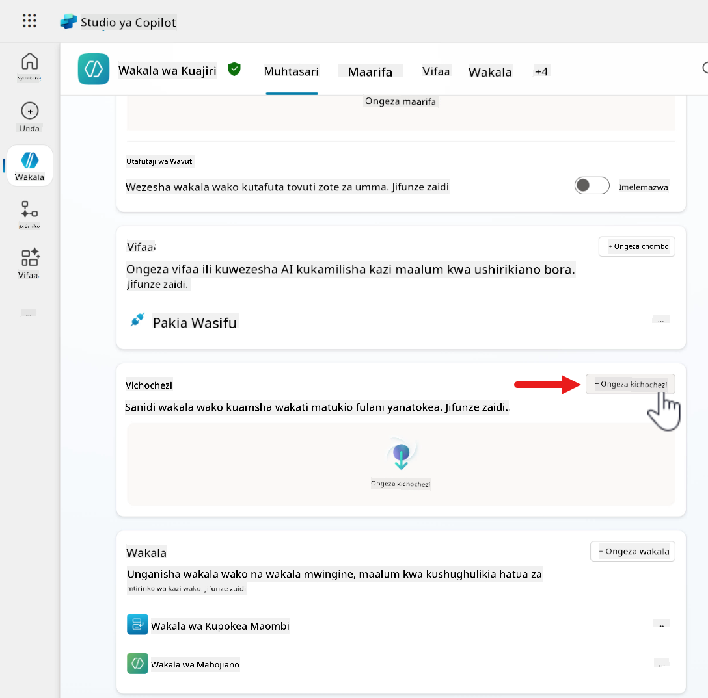

1. Orodha ya vichochezi itaonekana. Chagua **Wakati barua pepe mpya inafika (V3)** na uchague **Inayofuata**.

       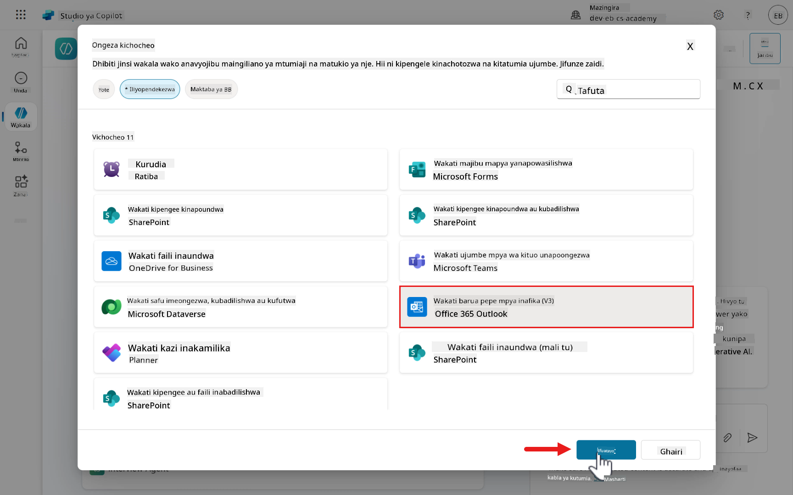

1. Sasa tutaona **Jina la Kichochezi** na marejeleo ya mu
Sasa tutaenda kusasisha kichocheo cha tukio ili kuongeza uwezo zaidi wa kiotomatiki. Chagua **alama za nukta tatu (...)** kwenye kichocheo na uchague **Hariri katika Power Automate**.

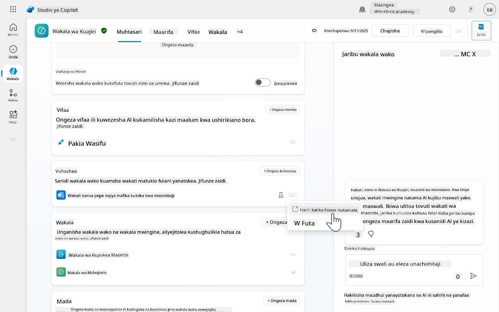

1. Kichocheo kitasomeka kama mtiririko katika portal ya Power Automate maker. Unachokiona ni muundo wa mtiririko katika portal ya Power Automate maker. Hapa ndipo tunaweza kuongeza mantiki zaidi na hatua kwa ajili ya kiotomatiki zaidi. Kichocheo kitaonekana juu, kikifuatiwa na **Inatuma maelezo kwa copilot maalum kwa ajili ya usindikaji** kama hatua ya mwisho katika mtiririko.

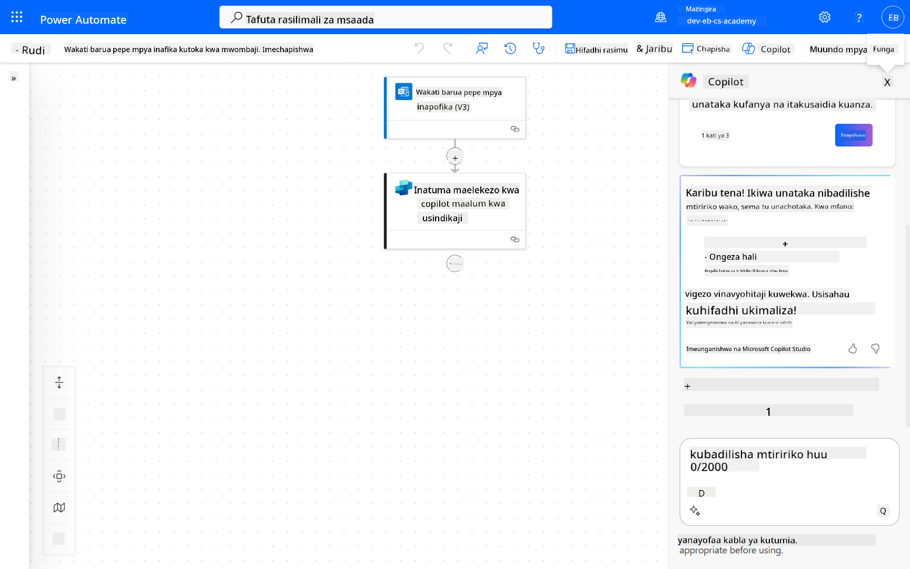

1. Kwa default, kichocheo cha **Wakati barua pepe mpya inafika** katika Power Automate kinaweza kusindika barua pepe nyingi kwa pamoja ikiwa kadhaa zitafika mara moja, na kuendesha mtiririko mara moja tu kwa kundi hilo.

Ili kuhakikisha mtiririko unaendeshwa kando kwa kila barua pepe, wezesha mpangilio wa **Split On** katika mipangilio ya kichocheo na uchague `@triggerOutputs()?['body/value']` katika sehemu ya orodha ya kushuka.

Kwa kuwezesha **Split On** na kuweka sehemu ya orodha kwa `@triggerOutputs()?['body/value']`, mtiririko utaendeshwa kando kwa kila ujumbe, hata kama nyingi zitafika kwa wakati mmoja.

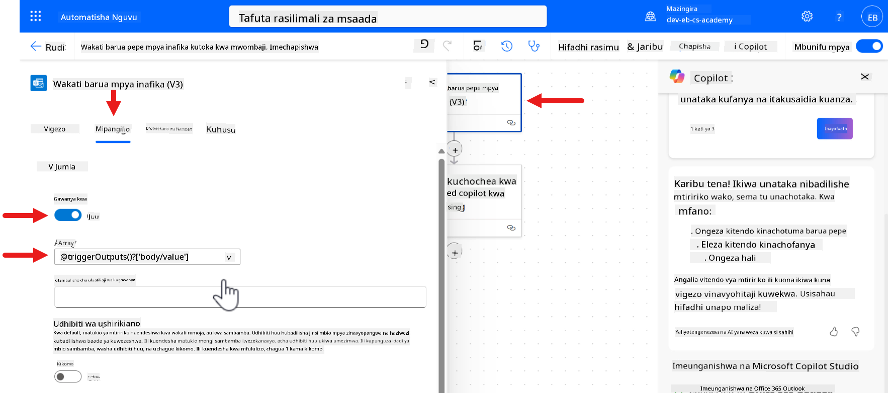

1. Sasa tutaongeza mantiki ya kuangalia aina ya faili ya kiambatisho, tunataka tu kupakia viambatisho vya faili za .PDF na si picha (ambazo zinaweza kutoka kwa saini za barua pepe). Chagua ikoni ya **+** chini ya kichocheo na uchague **Udhibiti** chini ya sehemu ya **Zana za ndani**.

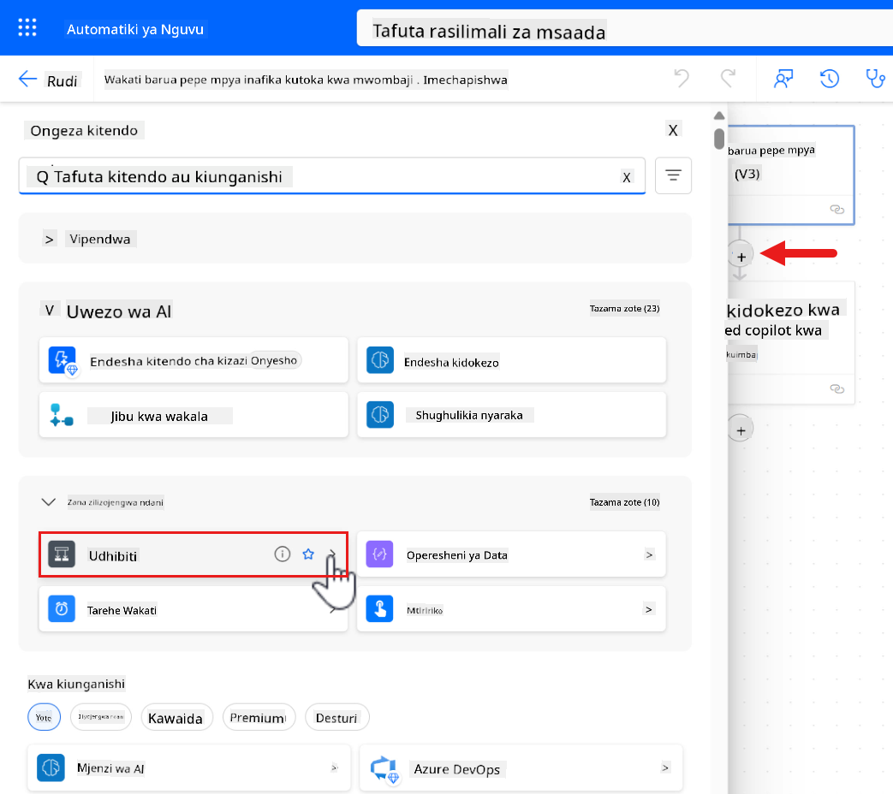

1. Chagua hatua ya **Hali**.


1. Sasa tunasanidi hali ya kuangalia kama aina ya kiambatisho cha faili ni .PDF. Katika sehemu ya **Chagua thamani**, chagua **ikoni ya radi** au **ikoni ya fx** upande wa kulia.

1. Katika sehemu ya **Tafuta**, andika yafuatayo,

```text
content type
```

1. Kisha chagua kipengele cha **Attachments Content-Type** kutoka kwa kichocheo.

1. Kisha, chagua **Ongeza** ili kuongeza maudhui ya nguvu kwenye kipengele cha **Id** cha hatua.

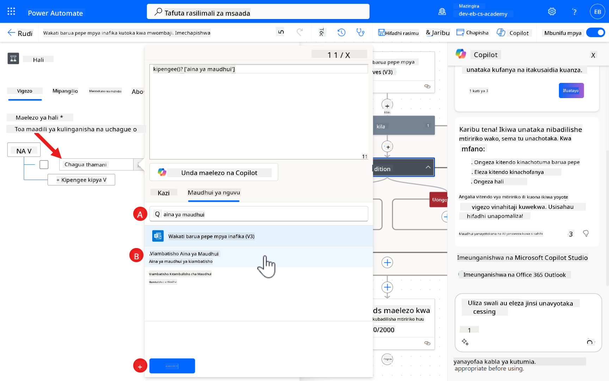

1. Tuweke kidogo hapa, labda uliona kwamba hatua ya **Kwa kila** ilionekana moja kwa moja.

Chagua hatua ya **Kwa kila**. Hatua hii inawakilisha kuzunguka kila kiambatisho katika barua pepe, kwa kuwa kipengele cha **Attachments Content-Type** kutoka kwa kichocheo kimeunganishwa na kila kiambatisho.

Chini ya hood, ni orodha na ndiyo sababu hatua ya **Kwa kila** iliongezwa moja kwa moja tulipochagua kipengele cha **Attachments Content-Type** katika hatua ya **Hali**.

Ili kujifunza zaidi kuhusu hili, panua kizuizi cha ziada cha kujifunza kilicho hapa chini.

??? info "Kujifunza Zaidi: Hatua ya Kwa kila inaonekana moja kwa moja"

🤔 **Kwa nini "Tumia kwa kila" au "Kwa kila" Inaonekana Moja kwa Moja?**

Unapochagua kipengele (maudhui ya nguvu) kinachowakilisha orodha au safu ya vitu - kwa mfano, orodha ya viambatisho, barua pepe, au safu - Power Automate inatambua kwamba unaweza kutaka kusindika kila kipengele kando.

Ili kukusaidia kufanya hivyo, Power Automate inaongeza moja kwa moja **“Tumia kwa kila”** (au **Kwa kila**) mzunguko karibu na hatua yako. Hii inahakikisha kwamba hatua yako itaendeshwa mara moja kwa kila kipengele katika orodha, badala ya kujaribu kusindika orodha nzima mara moja (ambayo inaweza kusababisha makosa).

🦋 **Mfano**

- Ikiwa unachagua "Viambatisho" kutoka kwa hatua ya awali (ambayo ni safu), na kujaribu kuitumia katika hatua inayotarajia faili moja, Power Automate inafunga hatua yako katika **"Tumia kwa kila"** (au **Kwa kila**) mzunguko. 
- Kwa njia hii, hatua yako itaendeshwa kwa **kila kiambatisho** - moja kwa moja.

💡 **Vidokezo Muhimu**

- **Moja kwa moja:** Mzunguko unaonekana moja kwa moja ili kukusaidia kusindika kila kipengele katika mkusanyiko.
- **Huzuia makosa:** Bila mzunguko, hatua yako inaweza kushindwa kwa sababu haiwezi kushughulikia vitu vingi mara moja.
- **Ishara ya kuona:** Ni njia ya kuona kuonyesha kwamba mtiririko wako utarudia hatua kwa kila kipengele katika orodha.

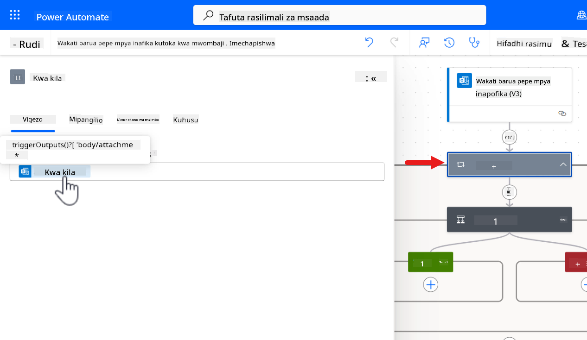

1. Kisha, katika sehemu nyingine ya **Chagua thamani**, andika yafuatayo,

```text
application/pdf
```

Hii itahakikisha kwamba kwa kila kiambatisho cha faili, itakagua kama muundo wa kiendelezi cha faili ni .PDF.

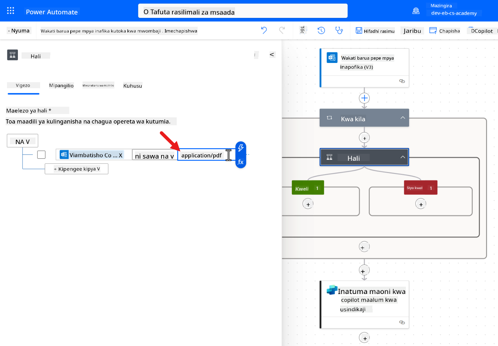

1. Sasa tutaweka njia ya **Kweli** ili kutoa faili kutoka kwa barua pepe na kuipakia kwenye jedwali la **Resume** la Dataverse.

Ongeza hatua mpya chini ya njia ya **Kweli** na tafuta `html to text`. Chagua hatua ya **Html to text**.

Ili kujifunza zaidi kuhusu hatua ya **Html to text**, panua kizuizi cha ziada cha kujifunza kilicho hapa chini.

??? info "Kujifunza Zaidi: Hatua ya Html to text"

🤔 **Hatua ya "HTML to text" ni nini?**

Hatua ya **HTML to text** katika Power Automate inatumika kubadilisha maudhui yaliyo na muundo wa HTML kuwa maandishi ya kawaida. Hii ni muhimu hasa unapopokea data (kama barua pepe, maudhui ya wavuti, au majibu ya API) yenye lebo za HTML, na unataka kutoa tu maandishi yanayosomeka bila muundo au msimbo wowote.

⚙️ **Inafanyaje kazi?**

- **Ingizo:** Unatoa mfululizo wa maudhui ya HTML (kwa mfano, mwili wa barua pepe).
- **Matokeo:** Hatua huondoa lebo zote za HTML na kurudisha tu maandishi ya kawaida.

👍🏻 **Ni lini unapaswa kuitumia?**

- Unapotaka kutoa maandishi yanayosomeka kutoka kwa barua pepe, kurasa za wavuti, au majibu ya API yenye HTML.
- Kabla ya kutuma maudhui kwa mifumo ambayo haiungi mkono muundo wa HTML (kama SMS, ujumbe wa Teams, au hifadhidata).
- Kusafisha data kwa usindikaji zaidi au uchambuzi.

🔭 **Wapi pa kuipata?**

- Katika Power Automate kwa mtiririko wa Wakala, tafuta hatua inayoitwa `HTML to text`. Iko chini ya kiunganishi cha **Data Operations**.

💡 **Vidokezo Muhimu**

- Inaondoa lebo zote za HTML na kuacha tu maandishi.
- Haiwezi kutafsiri au kutekeleza maandishi/muundo - inatoa tu lebo.
- Inafaa kwa kusafisha data na kuandaa maudhui kwa matokeo ya maandishi ya kawaida.

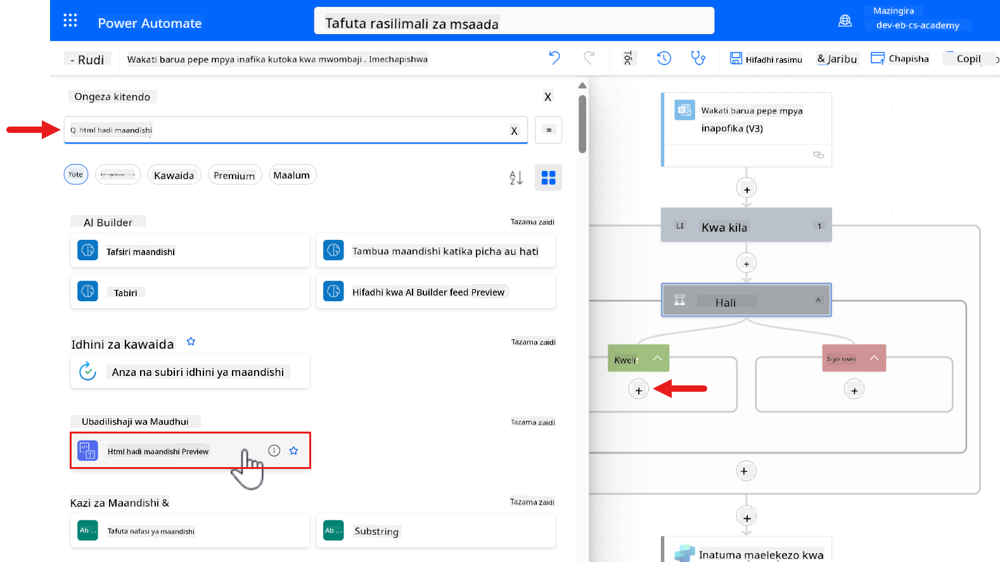

1. Kisha, tunahitaji kuunda rejeleo jipya la muunganisho kwa hatua ya **Html to text** kwa kuchagua **Ongeza mpya**.

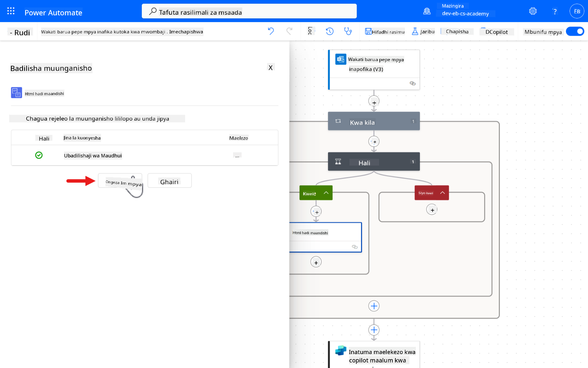

1. Hatua sasa inaweza kusanidiwa. Wacha tuongeze kipengele cha **Mwili** kutoka kwa kichocheo. Katika sehemu ya **Maudhui**, chagua **ikoni ya radi** au **ikoni ya fx** upande wa kulia.

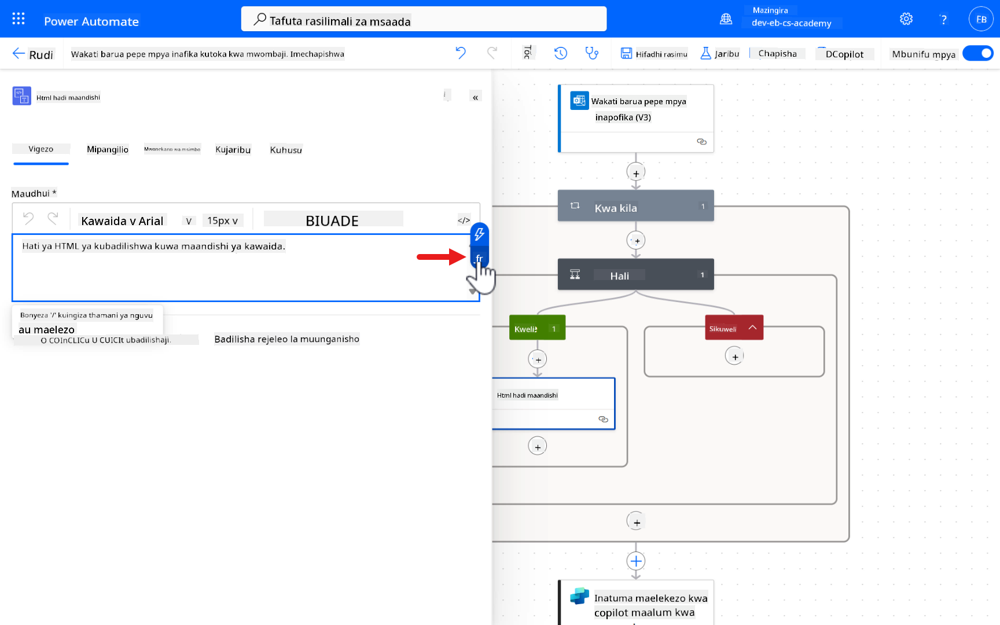

1. Katika tabo ya **Maudhui ya Nguvu**, tafuta `body` na uchague kipengele cha **Mwili**, kisha chagua **Ongeza**.

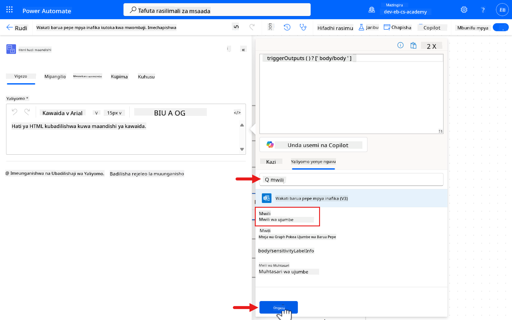

1. Tumekamilisha kusanidi hatua hii kwa hivyo wacha tutoke kwenye hatua kwa kuchagua mabano mawili ya pembe («) yanayoelekea kushoto ili kufunga paneli.

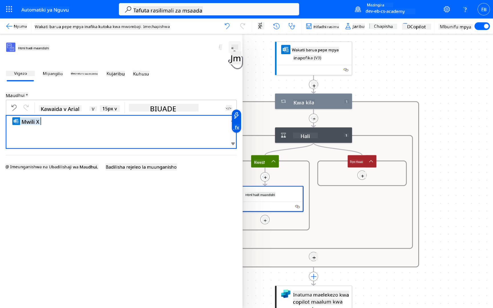

1. Tutaongeza hatua mpya kwa kuchagua **ikoni ya +** chini ya hatua ya **Html to text** ambayo itapakia paneli ya kuongeza hatua. Chagua kiunganishi cha **Microsoft Dataverse**.

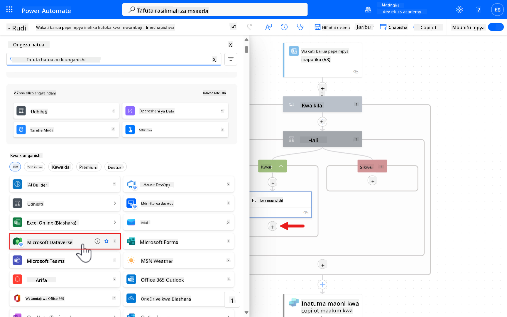

1. Chagua hatua ya **Ongeza safu mpya**.

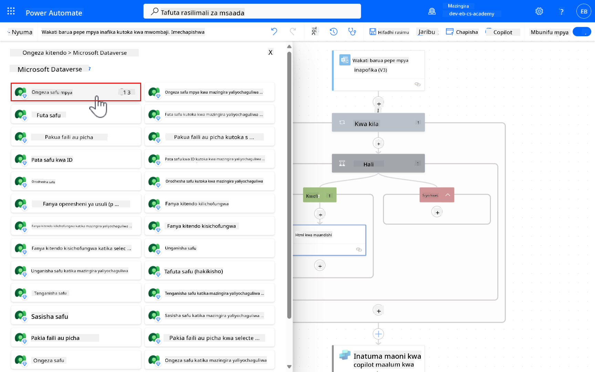

1. Badilisha jina la hatua kwa kuchagua **Nukta tatu (...)**, nakili na ubandike yafuatayo kama jina,

```text
Ongeza safu mpya ya Resume
```

Kwa kipengele cha **Jina la Jedwali**, tafuta `res` na uchague jedwali la **Resumes**.

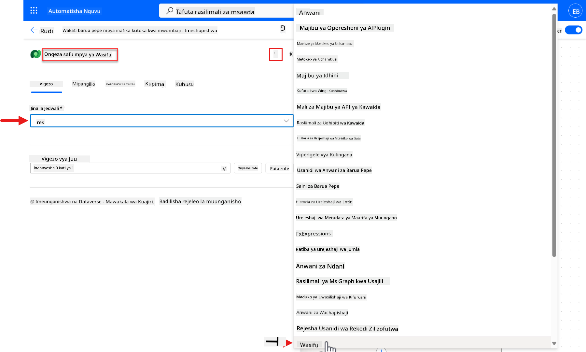

1. Chagua sehemu ya **Kichwa cha Resume** kisha uchague **ikoni ya radi** au **ikoni ya fx** upande wa kulia.

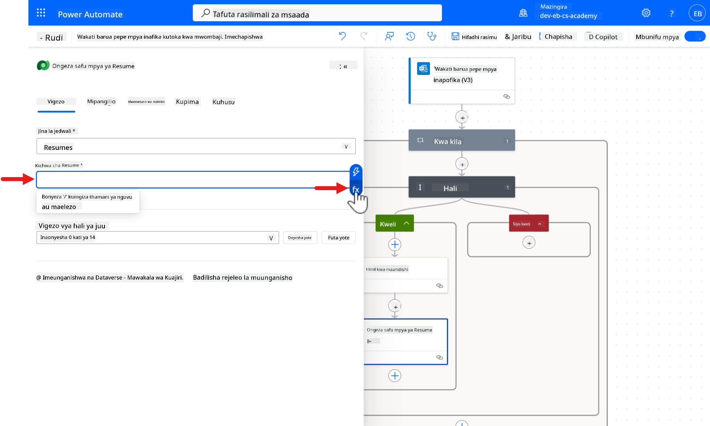

1. Katika tabo ya **Kazi**, ingiza usemi ufuatao unaotumia kazi ya `item()`.

```text
item()?['name']
```

Ili kujifunza zaidi kuhusu kazi ya `item ()`, panua kizuizi cha ziada cha kujifunza kilicho hapa chini.

??? info "Kujifunza Zaidi: Kazi ya `item()`"

🤔 **Kazi ya `item()` ni nini?**

- Unapotumia hatua ya **Tumia kwa kila**, Power Automate hupitia kila kipengele katika mkusanyiko (safu).
- Mara nyingi hutumika ndani ya hatua kama **Tumia kwa kila** (au **Kwa kila**), **Chagua**, au **Chuja safu**.

⚙️ **Inafanyaje kazi?**

- `item()` ni kazi inayorudisha kipengele cha sasa kinachosindika katika mzunguko au operesheni ya safu.
- Ndani ya mzunguko huo, `item()` inahusu _kipengele cha sasa_ kinachosindika.

📌 **Wapi pa kuitumia?**

- **Tumia kwa kila:** kufikia mali za kipengele cha sasa.
- **Chagua:** kubadilisha kila kipengele katika safu.
- **Chuja safu:** kurejelea kipengele cha sasa kinachotathminiwa.

🦋 **Mfano**

- Usemi ndani ya mzunguko:
       -  `item()?['Email']`
- Hii inapata mali ya `Email` ya kipengele cha sasa.

💡 **Vidokezo Muhimu**

- `item()` ni _inayohusiana na muktadha_: kila wakati inahusu kipengele cha sasa katika mzunguko au operesheni ya safu unayofanya.
- Ikiwa unazungusha mizunguko, unaweza kutumia `items('LoopName')` kurejelea vitu katika mzunguko maalum.

Chagua **Ongeza** ili kuongeza usemi kwenye kipengele cha **Kichwa cha Resume**.

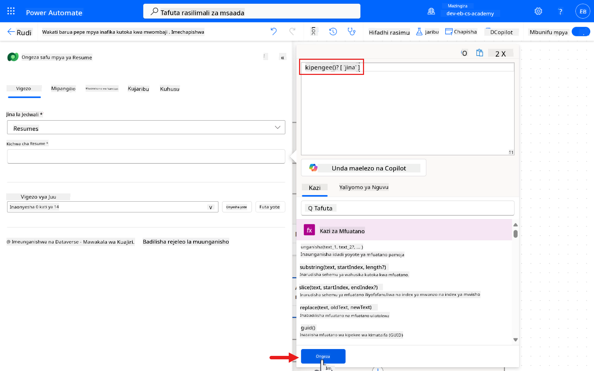

1. Bado tunahitaji kusanidi vigezo kadhaa zaidi, chagua **Onyesha yote** na katika sehemu ya **Barua ya Maombi**, chagua **ikoni ya radi** au **ikoni ya fx** upande wa kulia.

Katika tabo ya **Kazi**, ingiza usemi ufuatao unaotumia usemi sawa na ule wa [kazi ya awali](../02-multi-agent/README.md).

```text
if(greater(length(body('Html_to_text')), 2000), substring(body('Html_to_text'), 0, 2000), body('Html_to_text'))
```

Usemi huu unakagua ikiwa _maandishi_ kutoka kwa hatua ya **Html to text** ni marefu zaidi ya herufi 2000, na ikiwa ni hivyo, unarudisha herufi 2000 za kwanza; vinginevyo, unarudisha maandishi kamili.

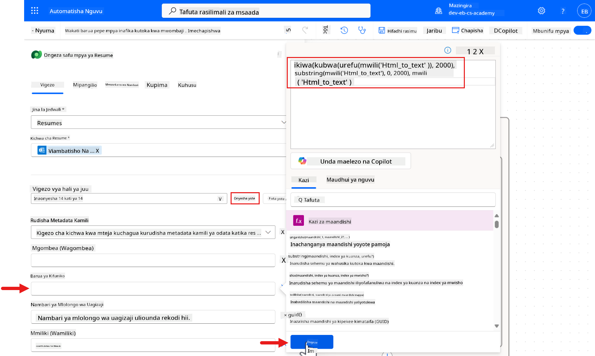

1. Usemi sasa utaongezwa kwenye sehemu ya **Barua ya Maombi**.

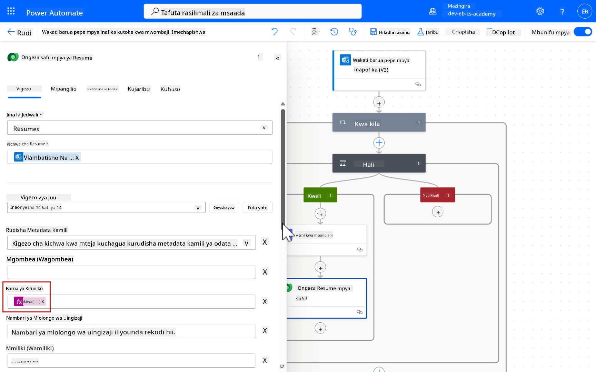

1. Kwa sehemu ya **Anwani ya Barua Pepe ya Chanzo**, tafuta `from` na uchague kipengele cha **From** kutoka kwa kichocheo kwa kuwa kina thamani ya anwani ya barua pepe.


1. Kwa sehemu ya **Tarehe ya Kupakia**, chagua **ikoni ya radi** au **ikoni ya fx** upande wa kulia. Katika tabo ya **Kazi**, ingiza usemi ufuatao unaotumia kazi ya `utcNow()`.

```text
utcNow()
```

Ili kujifunza zaidi kuhusu kazi ya `utcNow`, panua kizuizi cha ziada cha kujifunza kilicho hapa chini.

??? info "Kujifunza Zaidi: Kazi ya `utcNow`"

🤔 **Kazi ya `utcNow()` ni nini?**

- Kazi ya utcnow() katika Power Automate inarudisha tarehe na muda wa sasa katika Muda wa Ulimwengu wa Kuratibu (UTC) katika muundo wa ISO 8601, kama: `2025-09-23T04:32:14Z`

🦋 **Mfano**

- Usemi:
       -  `concat('Ripoti imetolewa mnamo ', utcnow())`
- Matokeo ni:
       - Ripoti imetolewa mnamo `2025-09-23T04:32:14Z`

💡 **Vidokezo Muhimu**
- **Hakuna hoja (vigezo vya pembejeo) vinavyohitajika:** kila wakati inatoa alama ya muda ya sasa ya UTC.
   - **Matumizi**
       - Kuongeza alama za muda kwenye kumbukumbu au majina ya faili
       - Kulinganisha muda wa sasa na tarehe nyingine
       - Kupanga ratiba au masharti yanayohusiana na muda

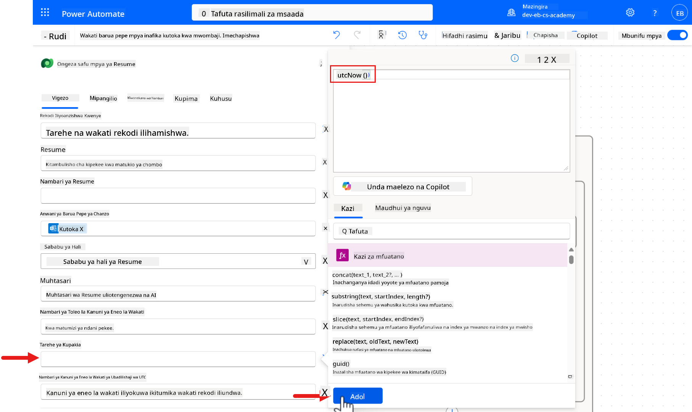

1. Sasa tumekamilisha kusanidi hatua ya **Ongeza safu mpya ya Resume**, basi tuondoke kwenye paneli kwa kuifunga.

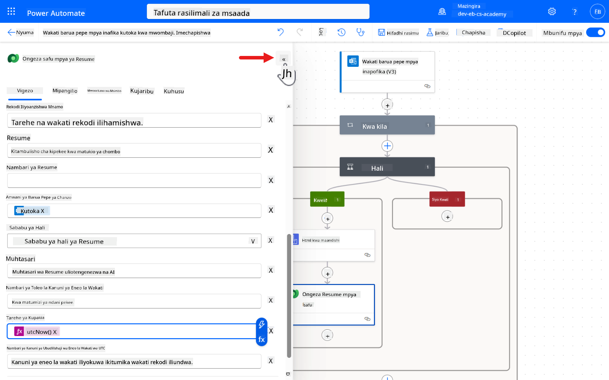

1. Tutaongeza hatua mpya kwa kuchagua **ikoni ya +** chini ya hatua ya **Ongeza safu mpya ya Resume** ambayo itafungua paneli ya kuongeza hatua. Chagua tena kiunganishi cha **Microsoft Dataverse**.

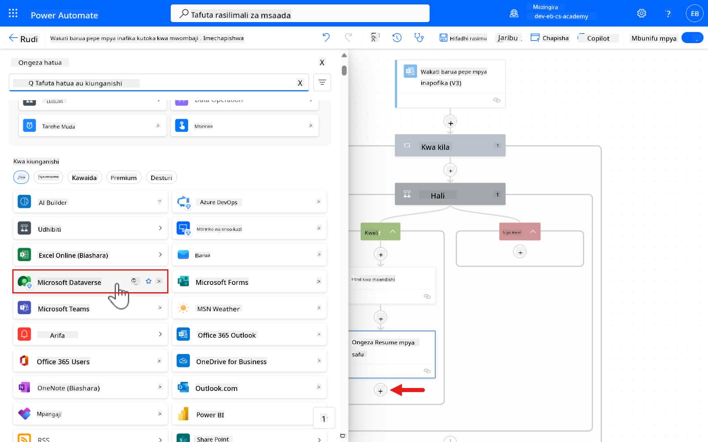

1. Chagua hatua ya **Pakia faili au picha**.

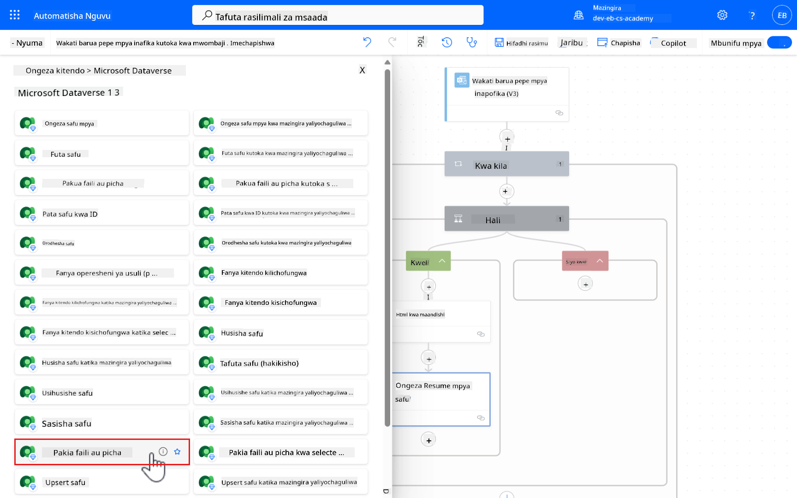

1. Badilisha jina la hatua kwa kuchagua **Ellipsis (...)**, nakili na ubandike yafuatayo kama jina,

```text
Pakia Faili ya Resume
```

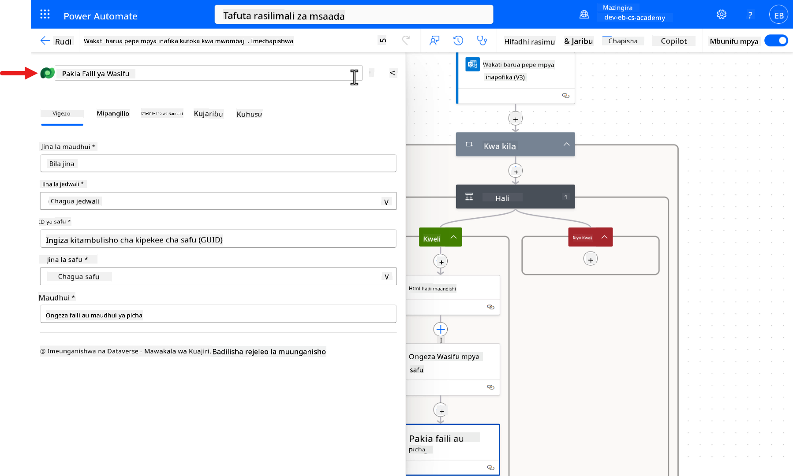

1. Chagua sehemu ya **Jina la Maudhui** kisha uchague **ikoni ya radi** au **ikoni ya fx** upande wa kulia.

Katika **tab ya Kazi**, ingiza usemi ufuatao unaotumia kazi ya `item ()`. Hii inapata mali ya `name` ya kipengele cha sasa (faili ya kiambatisho).

```text
item()?['name']
```

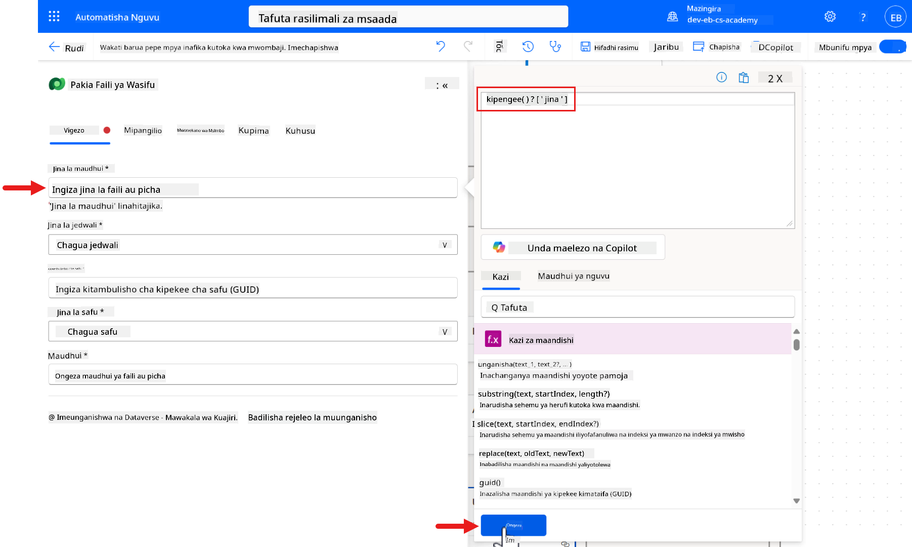

1. Kwa parameter ya **Jina la Jedwali**, tafuta `res` na uchague jedwali la **Resumes**.

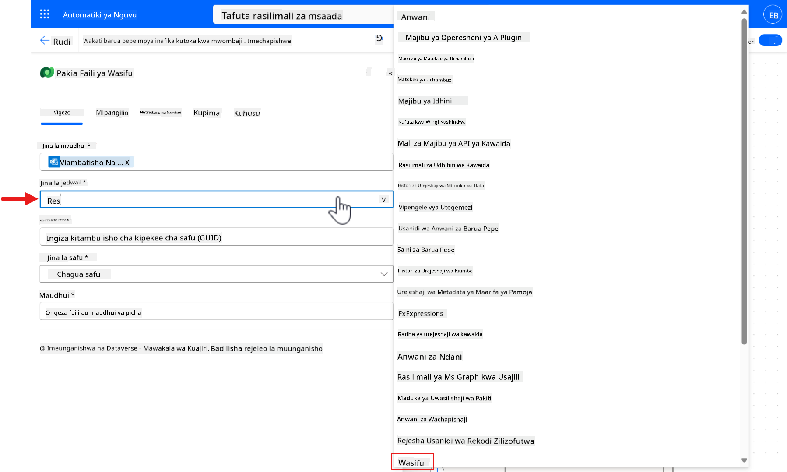

1. Chagua sehemu ya **ID ya Safu** kisha uchague **ikoni ya radi** au **ikoni ya fx** upande wa kulia.

Tafuta `ID` na uchague parameter ya **Resume** kutoka hatua ya _Ongeza safu mpya ya Dataverse_ kwani hii ina thamani ya ID ya safu ya kupakia faili ya PDF.

Chagua **Ongeza**.

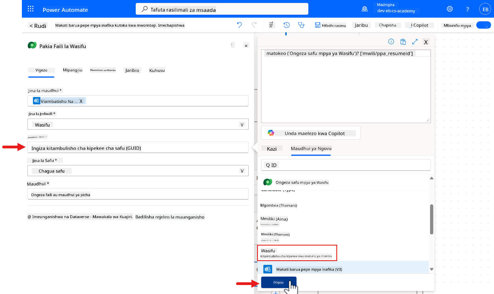

1. Chagua sehemu ya **Jina la Safu** na uchague chaguo la **Resume PDF**.

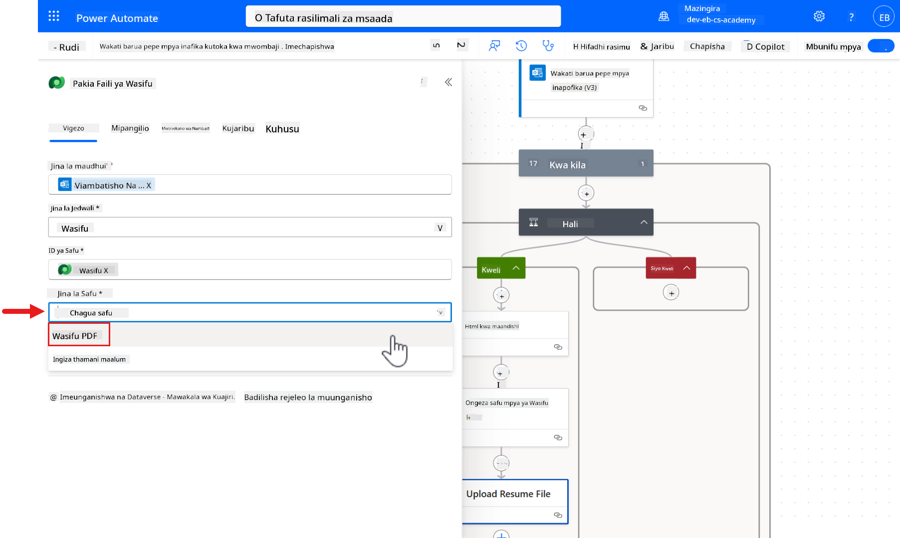

1. Chagua sehemu ya **Maudhui** na uchague **ikoni ya radi** au **ikoni ya fx** upande wa kulia.

Katika **tab ya Kazi**, ingiza usemi ufuatao unaotumia kazi ya `item ()`. Hii inapata mali ya `contentBytes` ya kipengele cha sasa (faili ya kiambatisho). `contentBytes` inahusu data ghafi ya binary ya faili au kiambatisho, iliyosimbwa kama kamba ya Base64.

```text
item()?['contentBytes']
```

1. Tumekamilisha kusanidi hatua hii basi tuondoke kwenye hatua kwa kuchagua mabano mawili ya pembe («) yanayoelekea kushoto ili kufunga paneli.

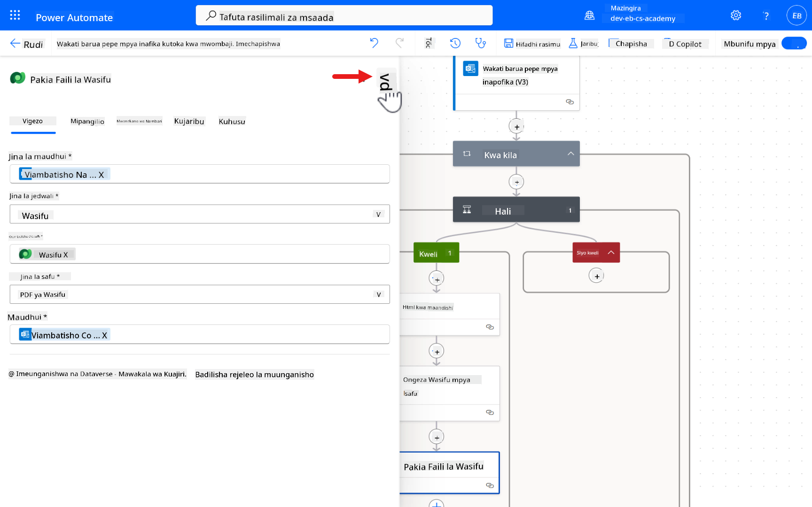

1. Kisha, chagua **Inatuma maoni kwa copilot maalum kwa usindikaji**, kisha buruta na uweke hatua hii chini ya hatua ya **Pakia Faili ya Resume** katika njia ya _True_ ya hali.

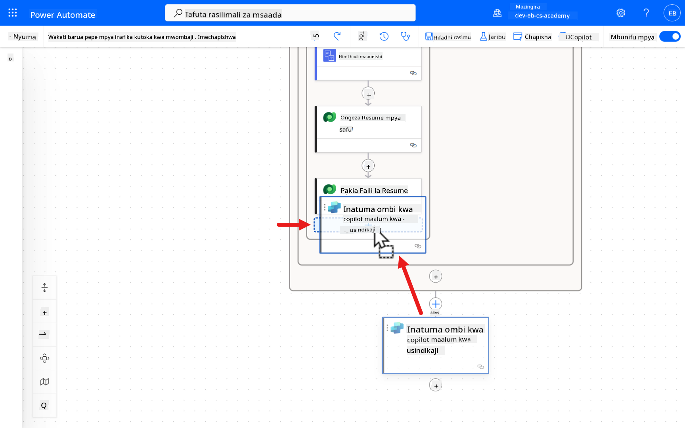

1. Chagua **Inatuma maoni kwa copilot maalum kwa usindikaji** ili kuisanidi.

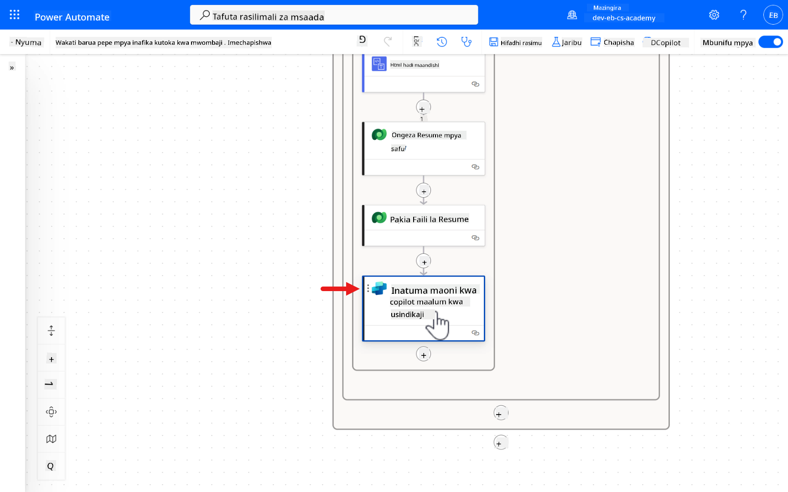

1. Katika sehemu ya **Mwili/ujumbe**, chagua maudhui yote ya sehemu na uyafute.

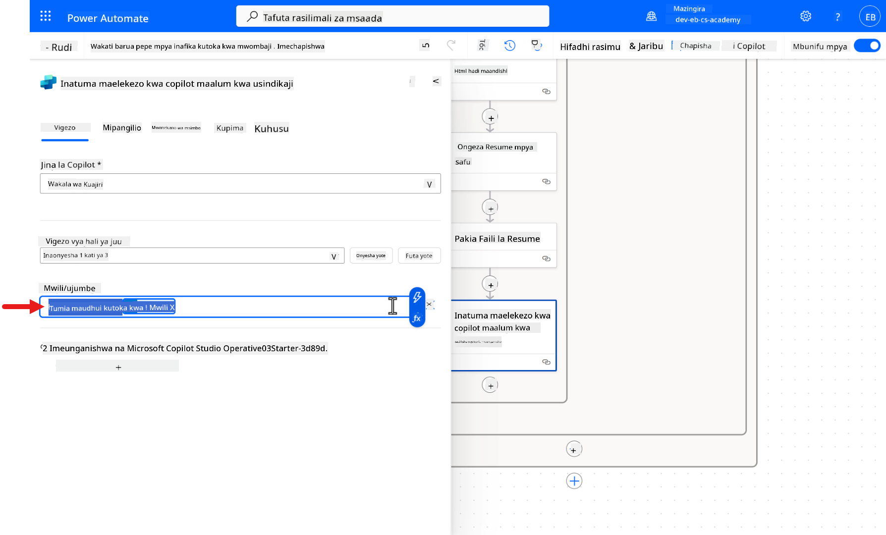

1. Nakili na ubandike maandishi yafuatayo katika sehemu ya **Mwili/ujumbe** na uweke alama `RESUME ID PLACEHOLDER`.

```text
Tuma [ResumeId (text)] = "RESUME ID PLACEHOLDER" na [ResumeTitle (text_1)] = "RESUME TITLE PLACEHOLDER" na [ResumeNumber (text_2)]= "RESUME NUMBER PLACEHOLDER" kwa Zana "Arifu Timu ya Waajiriwa ya Teams" katika wakala mdogo "Wakala wa Kupokea Maombi"
```

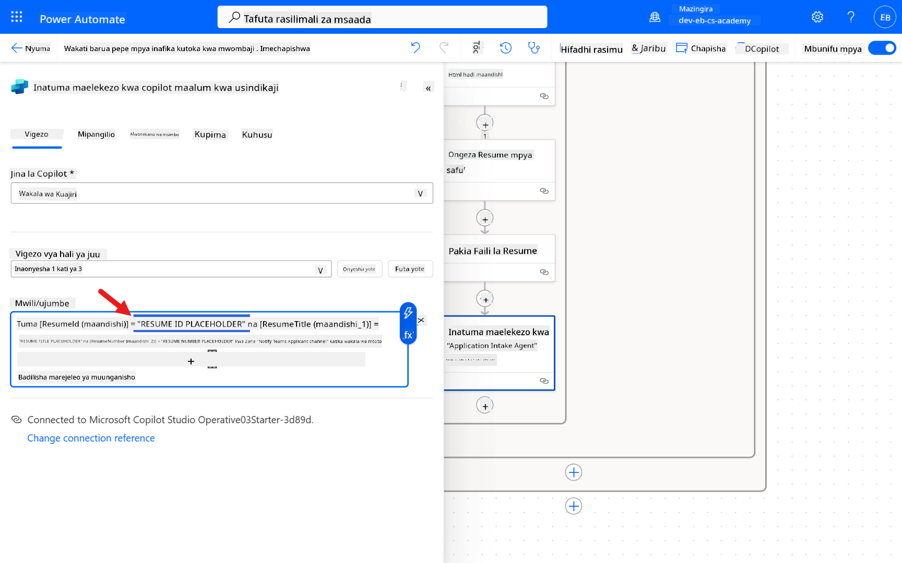

1. Chagua **ikoni ya radi** au **ikoni ya fx** upande wa kulia.

Tafuta `resume` na uchague parameter ya **Resume** kutoka hatua ya _Ongeza safu mpya ya Dataverse_ kwani hii ina thamani ya `ID` ya safu ya Resume iliyoundwa.

Chagua **Ongeza**.

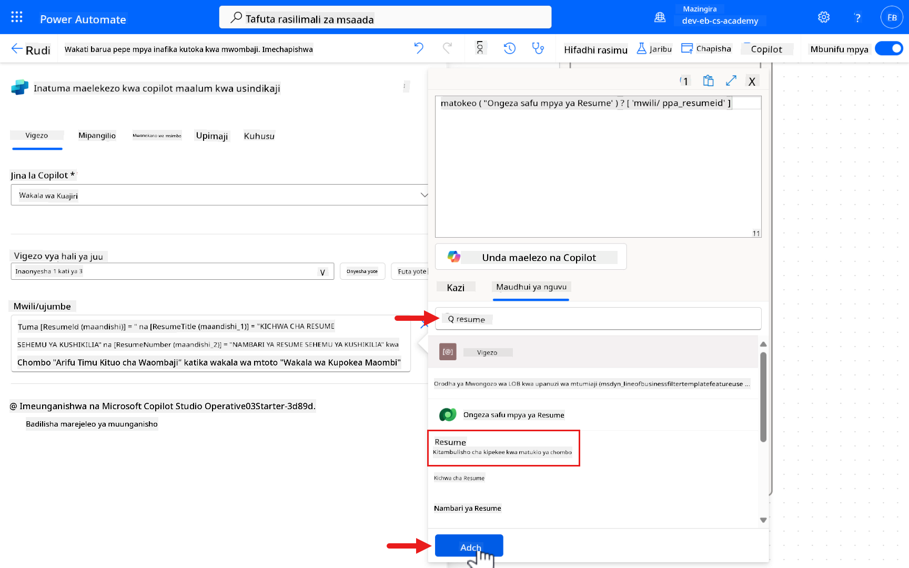

1. Weka alama `RESUME TITLE PLACEHOLDER`. Chagua **ikoni ya radi** au **ikoni ya fx** upande wa kulia.

Tafuta `title` na uchague parameter ya **Resume Title** kutoka hatua ya _Ongeza safu mpya ya Dataverse_ kwani hii ina thamani ya `resume title` ya safu ya Resume iliyoundwa.

Chagua **Ongeza**.

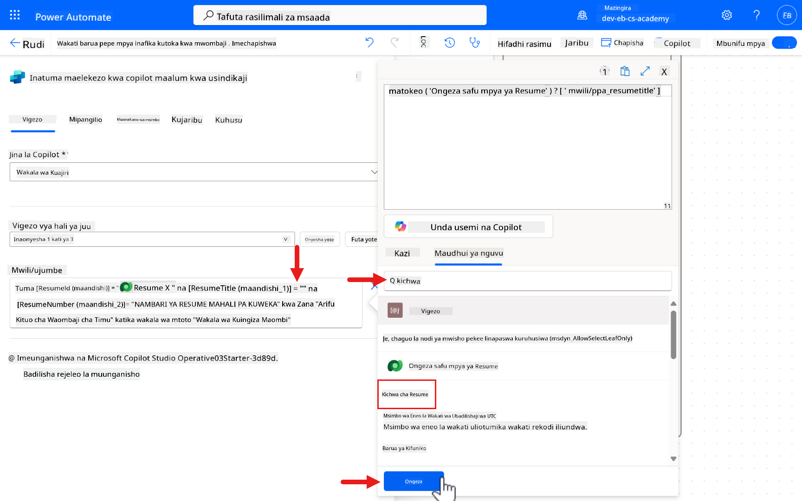

1. Weka alama `RESUME NUMBER PLACEHOLDER`. Chagua **ikoni ya radi** au **ikoni ya fx** upande wa kulia.

Tafuta `resume number` na uchague parameter ya **Resume Number** kutoka hatua ya _Ongeza safu mpya ya Dataverse_ kwani hii ina thamani ya `Resume Number` ya safu ya Resume iliyoundwa.

Chagua **Ongeza**.

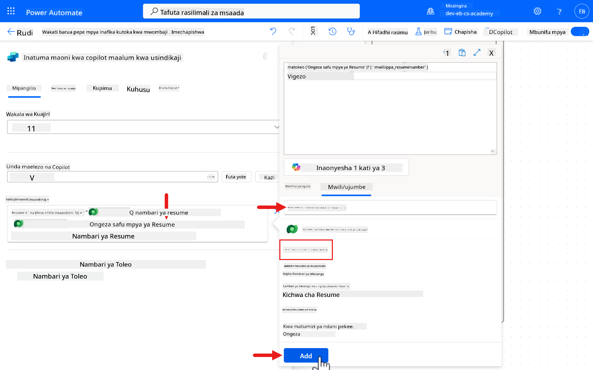

1. Tumekamilisha kusanidi hatua hii na mtiririko wa wakala wetu 🙌🏻 Unafanya kazi nzuri! Sasa tuhifadhi mtiririko wa tukio letu kwa kuchagua **Hifadhi rasimu**.

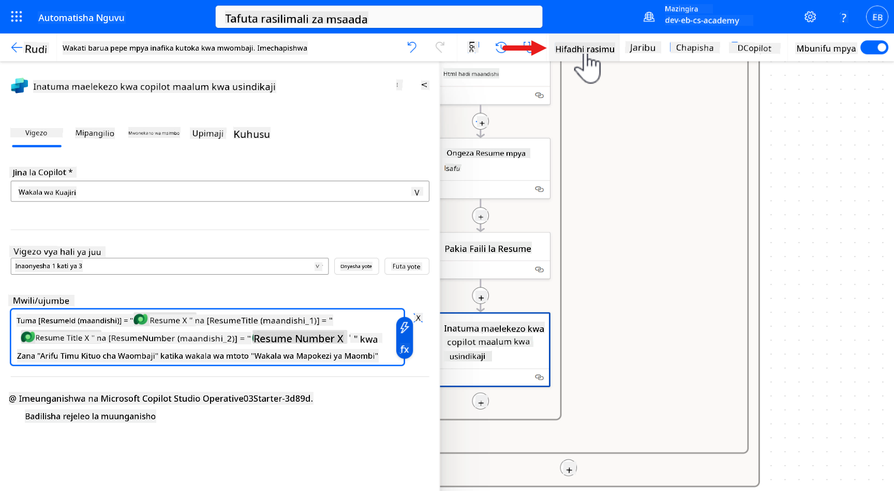

1. Sasa tunahitaji kuhariri maelezo ya mtiririko wa wakala, chagua **Rudi**.

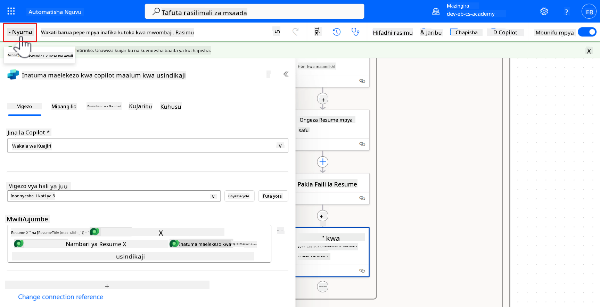

1. Chagua **Hariri** katika sehemu ya **Maelezo** na sasisha **Mpango** kuwa chaguo la **Copilot Studio**.

Chagua **Hifadhi**.

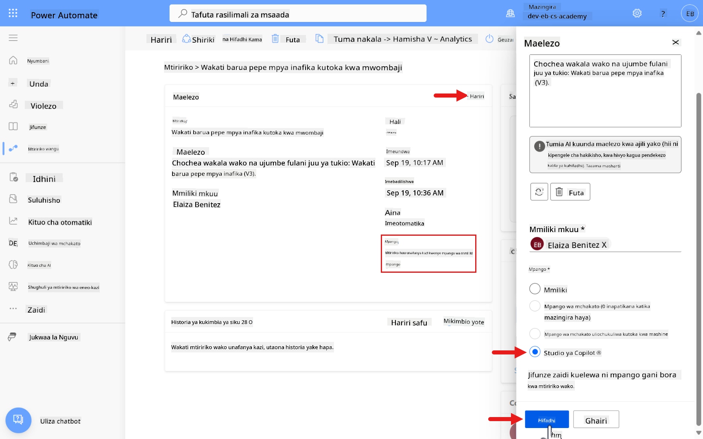

1. Modal itaonekana kukuuliza uthibitishe kubadilisha mpango kuwa Copilot Studio. Chagua **Thibitisha**.

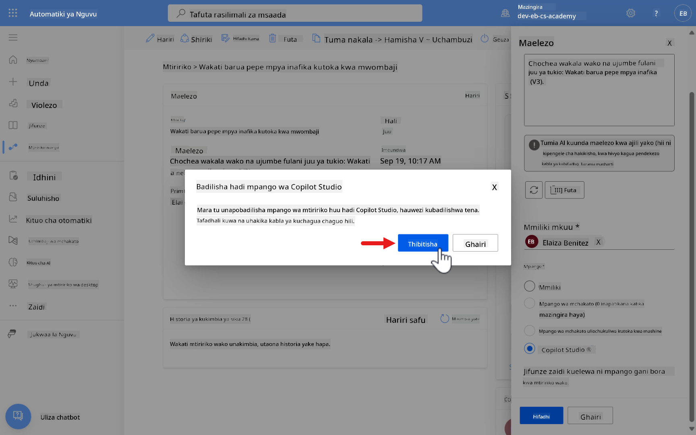

1. Mpango sasa umesasishwa kuwa **Copilot Studio**. Chagua **Hariri** kwani tunahitaji kuchapisha mtiririko wa tukio kwa wakala wetu.

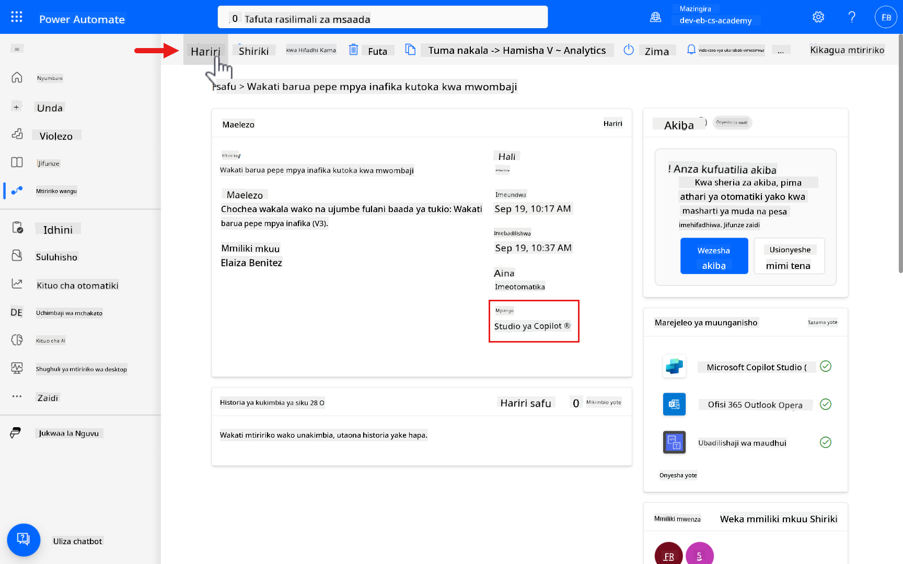

1. Chagua **Chapisha**.


Hongera! Mtiririko wa tukio sasa umechapishwa 😃

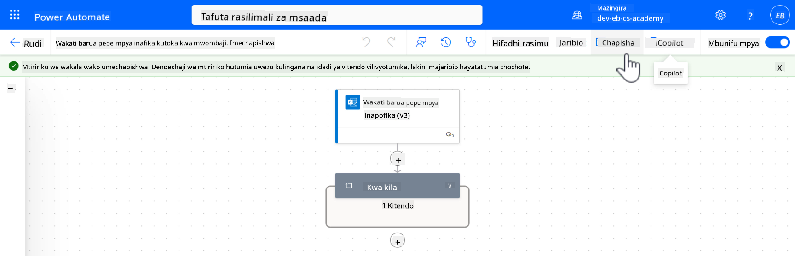

Tuendelee kuunda mtiririko mpya wa wakala ambao utaanzishwa na wakala mdogo **Wakala wa Kupokea Maombi**.

### Maabara 3.2 - Arifu kituo cha Teams kwa kutumia kadi ya kubadilika

Sasa tutaunda mtiririko mpya wa wakala kwa wakala mdogo **Wakala wa Kupokea Maombi** ambao utatumia maadili yaliyopitishwa na mtiririko wa tukio, kutuma kadi ya kubadilika kwenye kituo cha Teams. Kadi hii ya kubadilika itaarifu timu ya HR ya uajiri kuhusu PDF iliyopakiwa kiotomatiki ili waweze kuikagua.

Tuanzishe!

1. Katika **Wakala wa Kuajiri** chagua tabo ya **Mawakala** na uchague **Wakala wa Kupokea Maombi**.

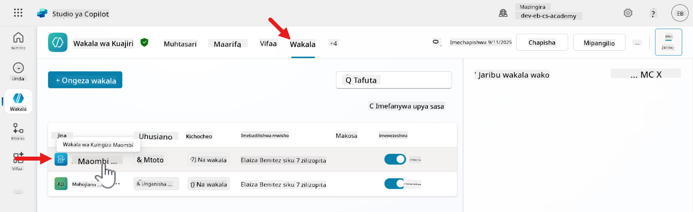

1. Shuka chini hadi **Zana** na uchague **+ Ongeza**.

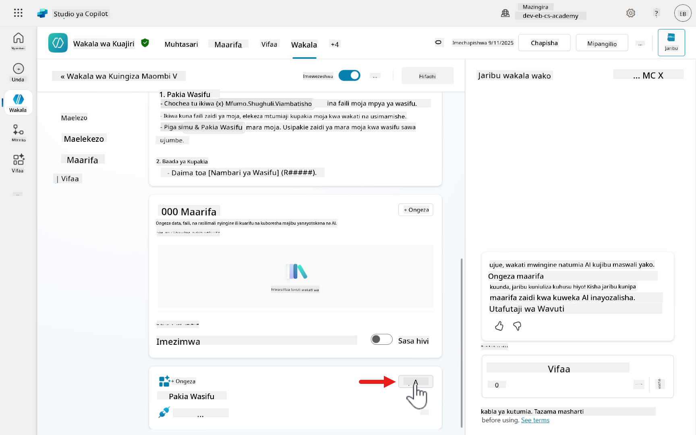

1. Modal ya **Ongeza zana** itaonekana. Chagua **+ Zana mpya**.

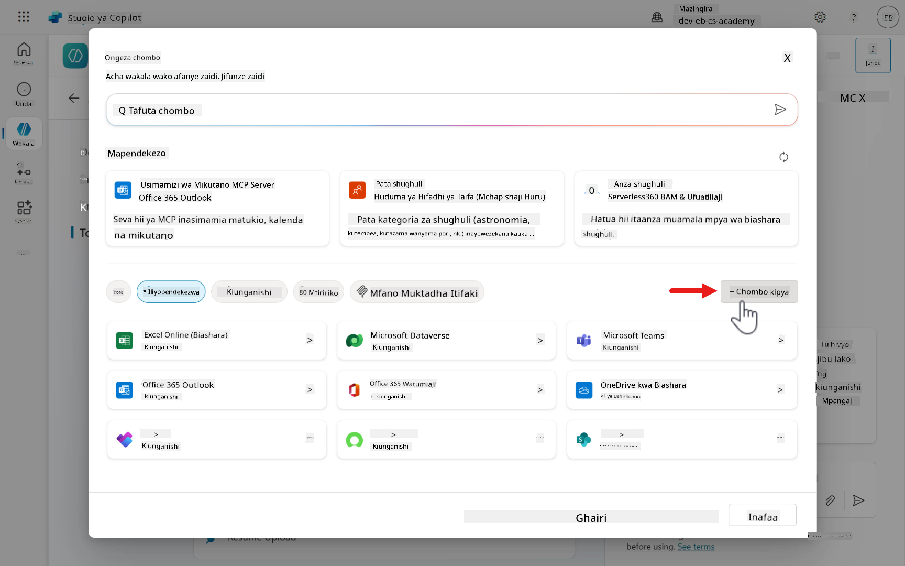

1. Chagua **Mtiririko wa wakala**.

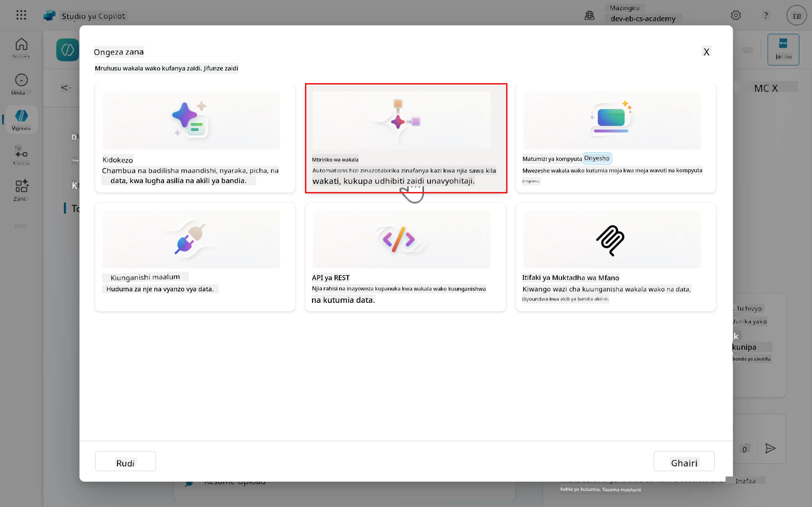

1. Kisha **mbunifu wa mtiririko wa wakala** utapakia. Katika kichochezi cha **Wakati wakala anapoitisha mtiririko**, chagua **+ Ongeza pembejeo**.


1. Chagua **Maandishi** kama aina ya pembejeo ya mtumiaji.

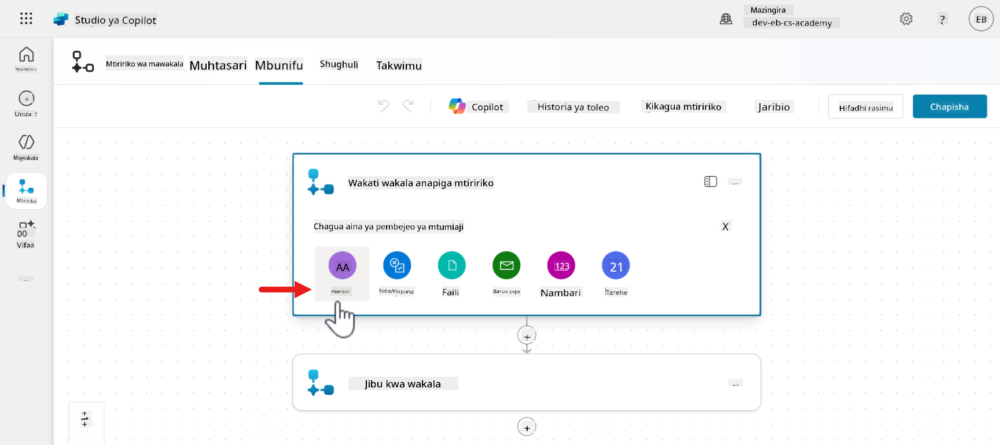

1. Katika sehemu ya maandishi ya pembejeo, nakili na ubandike yafuatayo kwa jina la parameter ya pembejeo.

```text
ResumeId
```


1. Rudia hatua hizo hizo kuongeza pembejeo ya pili ya maandishi. Nakili na ubandike yafuatayo kwa jina la parameter ya pembejeo.

```text
ResumeTitle
```

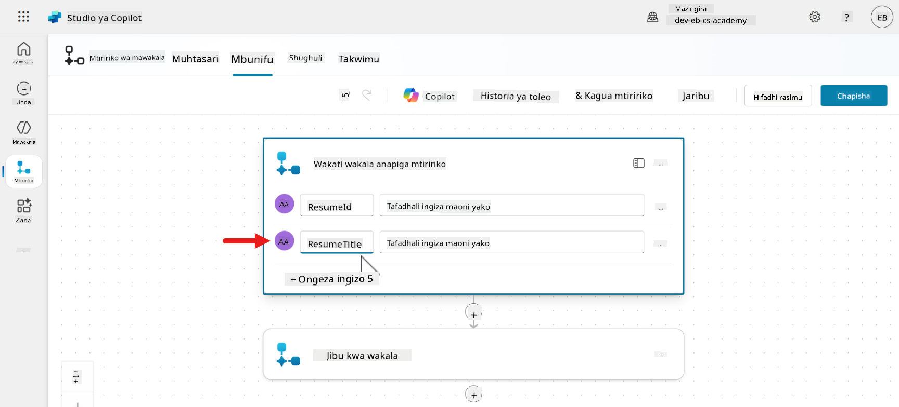

1. Rudia hatua hizo hizo kuongeza pembejeo ya tatu ya maandishi. Nakili na ubandike yafuatayo kwa jina la parameter ya pembejeo.

```text
ResumeNumber
```
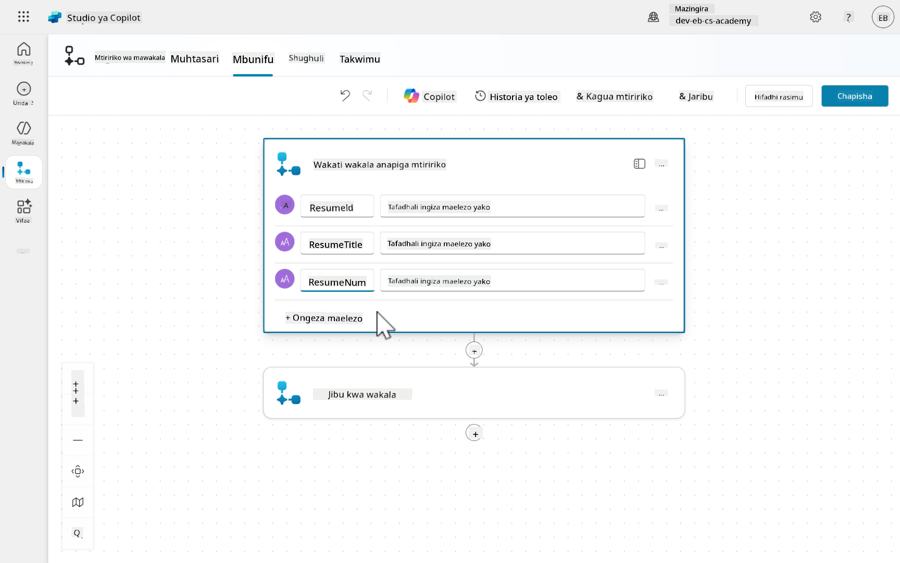

1. Unakumbuka jinsi tulivyofanya katika [Kuajiri](../../recruit/08-add-adaptive-card/README.md#81-create-a-new-topic-with-an-adaptive-card-for-user-to-submit-their-request) tulipoongeza kadi ya kubadilika ndani ya Mada kwa wakala wetu? Wakati huu, tutaongeza kadi ya kubadilika katika mtiririko wa wakala. Sasa tutaongeza hatua nyingine kwa mtiririko wa wakala wetu ambayo itatuma kadi ya kubadilika kwenye kituo cha Teams.

Chagua **ikoni ya +** chini ya kichochezi.

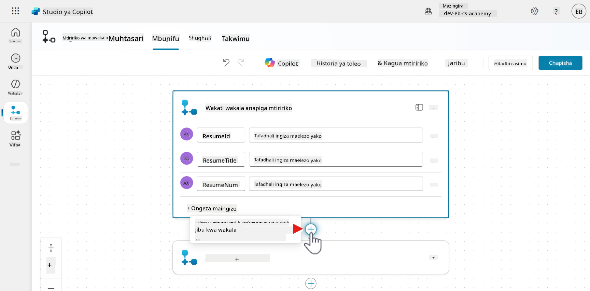

1. Chagua hatua ya **Tuma kadi katika mazungumzo au kituo**.

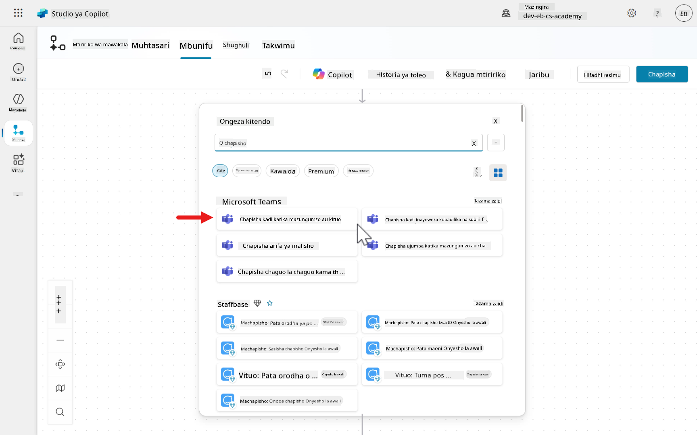

1. Marejeleo ya muunganisho kwa Microsoft Teams yanahitaji kuundwa na akaunti yako ya kuingia. Chagua **Ingia**.

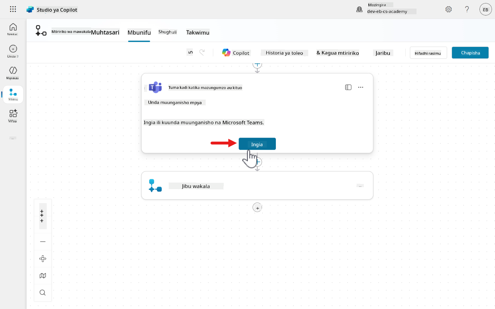

1. Chagua akaunti yako kisha uchague **Ruhusu ufikiaji**.

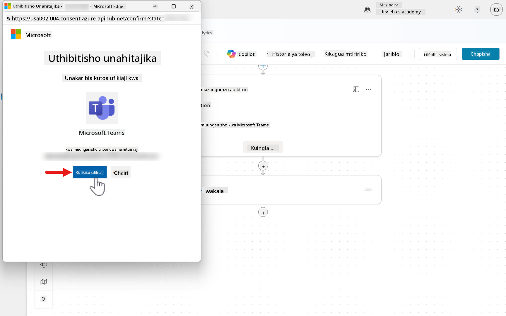

1. Kwa vigezo vya pembejeo vifuatavyo,

| Parameter | Jinsi ya Kuweka | Maelezo |
|----------|------------|---------|
| **Tuma kama** | Chaguo la kushuka | Chagua chaguo la `Flow bot` |
| **Tuma katika** | Chaguo la kushuka | Chagua chaguo la `Channel` |
| **Timu** | Chaguo la kushuka | Chagua timu inayopatikana katika mazingira yako ambayo una ufikiaji wa kukamilisha zoezi hili la maabara |
| **Kituo** | Chaguo la kushuka | Chagua kituo kinachopatikana katika mazingira yako ambacho una ufikiaji wa kukamilisha zoezi hili la maabara |

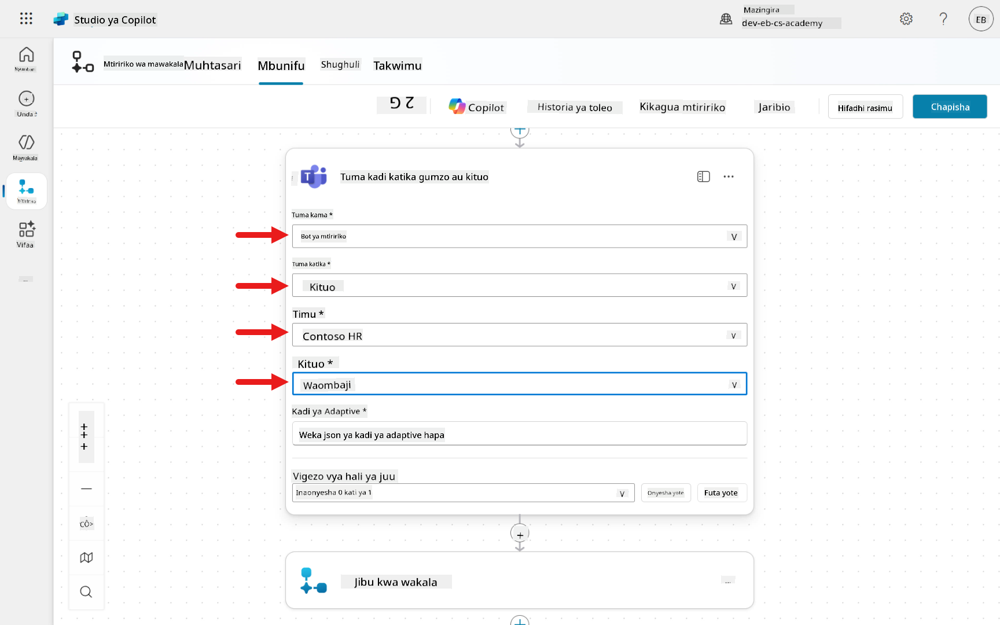

1. Kisha, tutaweka sehemu ya **Kadi ya Kubadilika**. Chagua sehemu ya **Kadi ya Kubadilika**.

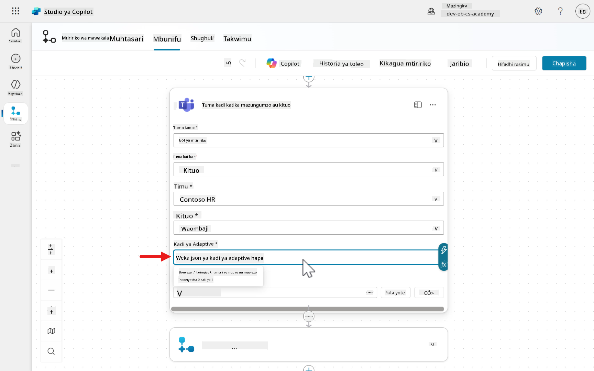

1. Fungua faili ya [Resume Table Updated JSON](../../../../../docs/operative-preview/03-automate-triggers/assets/3.2_ResumeTableUpdated.json), nakili maudhui yake yote, na uyabandike kwenye sehemu ya Kadi ya Kubadilika.

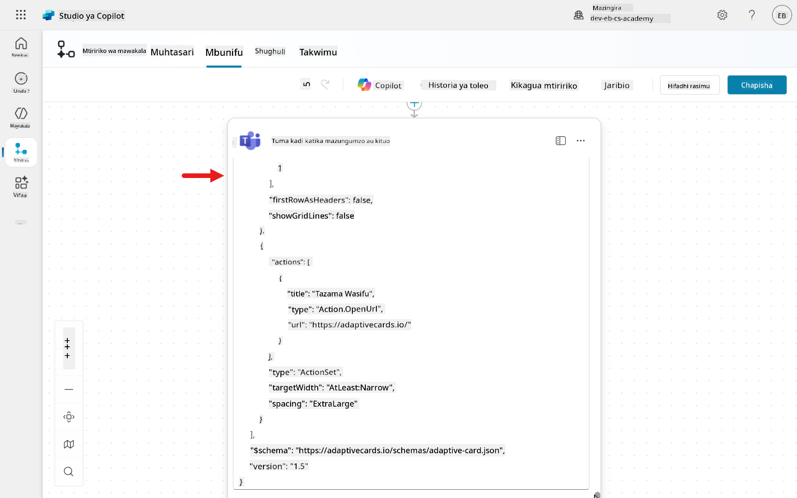

1. Kama tulivyofanya katika [Kuajiri](../../recruit/08-add-adaptive-card/README.md#81-create-a-new-topic-with-an-adaptive-card-for-user-to-submit-their-request), sasa tutabadilisha maadili yaliyopo kwenye mzigo wa JSON na maadili halisi au maudhui ya nguvu.

Kwanza, wacha tusasishe URL kwa mali ya `url` ndani ya mali ya `selectAction`. URL hii itabadilishwa na URL ya mtazamo wa mfumo wa Resumes katika programu ya **Hiring Hub** inayotegemea modeli. Hii itamruhusu Mtaalamu wa Uajiri kuchagua hatua na kuelekezwa kwenye mtazamo wa mfumo wa Resumes katika programu inayotegemea modeli.

Weka alama thamani ya URL ya sasa na uifute.

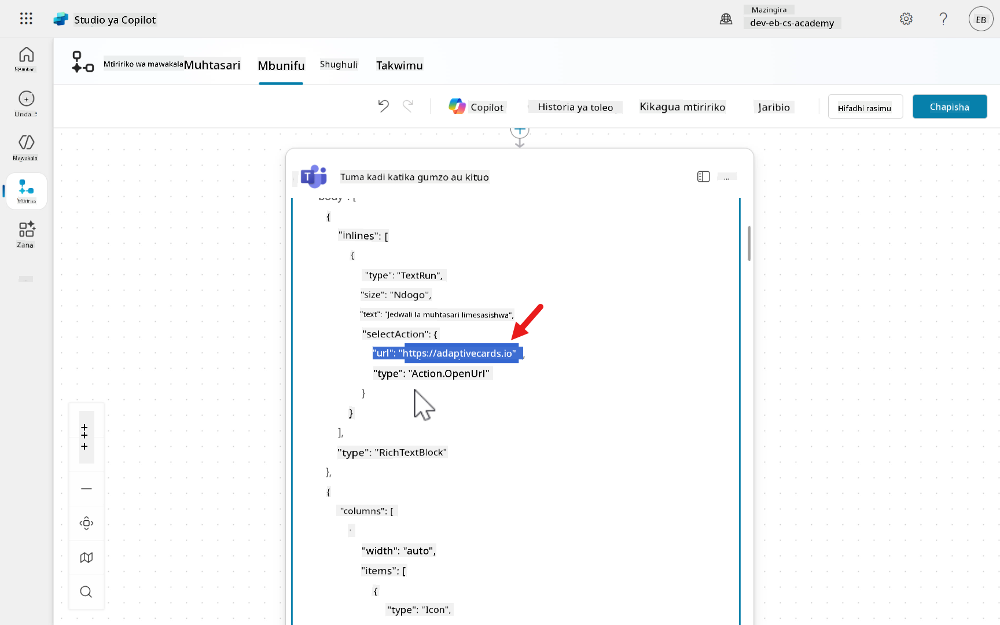

1. Katika programu ya **Hiring Hub** inayotegemea modeli, nenda kwenye mtazamo wa mfumo wa **Resumes** ukitumia menyu ya upande wa kushoto na nakili URL. Kisha rudi kwenye mtiririko wa wakala, na ubandike URL iliyokopiwa kwenye mali ya **url** ndani ya mali ya `selectAction`.

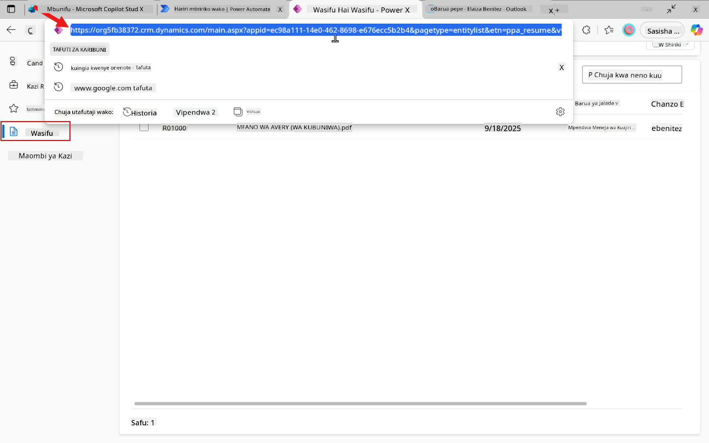
1. Unapaswa kuona yafuatayo ambapo sehemu iliyotolewa kwa rangi ya Njano ni maelezo ya mazingira yako ya programu ya **Hiring Hub** inayotumia modeli.

     | Kipengele | Thamani | Maelezo |
     |----------|------------|---------|
     | **Organization URI** | GUID | URL ya shirika la mazingira ya Dataverse/Dynamics 365 |
     | **appid** | GUID | Ili kufungua programu maalum inayotumia modeli, kipengele cha swali cha appid au appname kinatumika. Katika kesi hii, appid inatumika |
     | **viewid** | GUID | Kipengele cha swali ambacho ni kitambulisho cha mtazamo |

       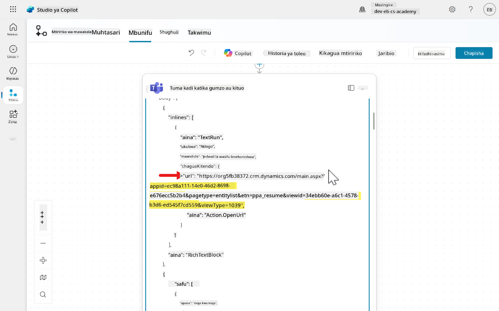

1. Kisha, tutaongeza maadili ya maudhui ya nguvu kwa mali kadhaa. Wacha tuanze na maandishi yatakayoonyesha rejeleo la Nambari ya Resume ya safu iliyoundwa na kichocheo cha tukio kwa uhuru.

      Chagua ikoni ya **paneli** ili kupakia paneli ya hatua.

       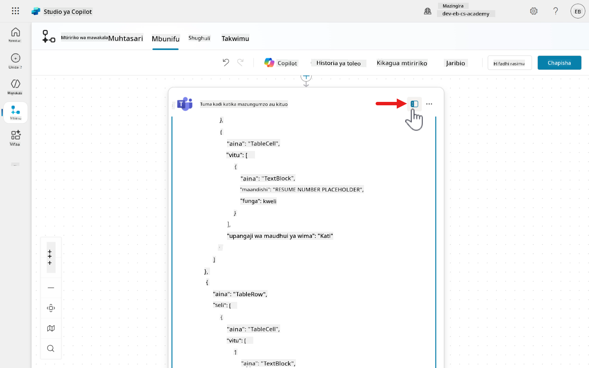

1. Shuka chini hadi mstari ambapo unaona mali ya `text` kwa `RESUME NUMBER PLACEHOLDER`. Toa thamani ya placeholder na uifute.

       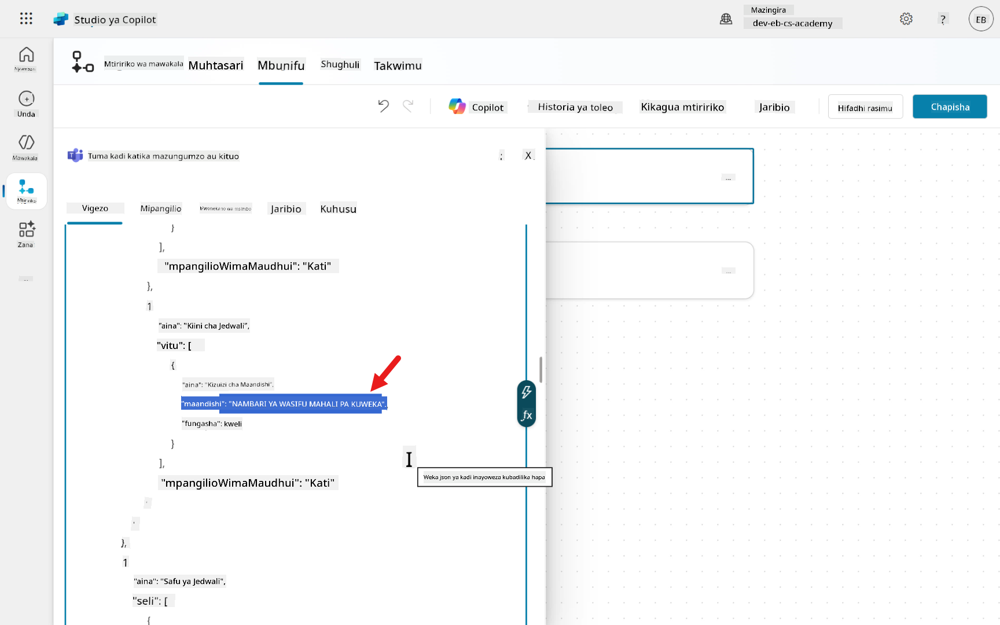

1. Bonyeza kati ya alama za nukuu mbili na uchague ikoni ya **radi** au ikoni ya **fx** upande wa kulia.

      Katika kichupo cha **Dynamic Content** chagua kipengele cha **ResumeNumber** na uchague **Add**.

       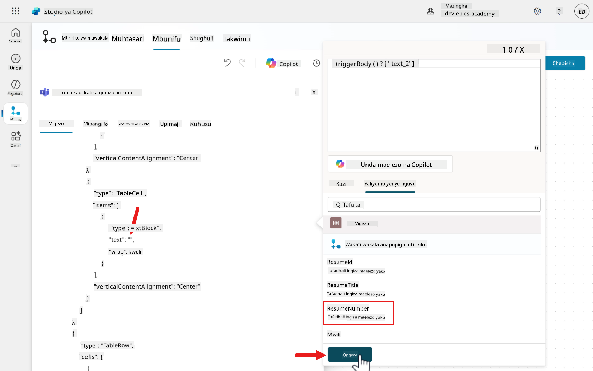

1. Kipengele cha **ResumeNumber** sasa kitaongezwa kama maudhui ya nguvu kwa mali ya `text`.

       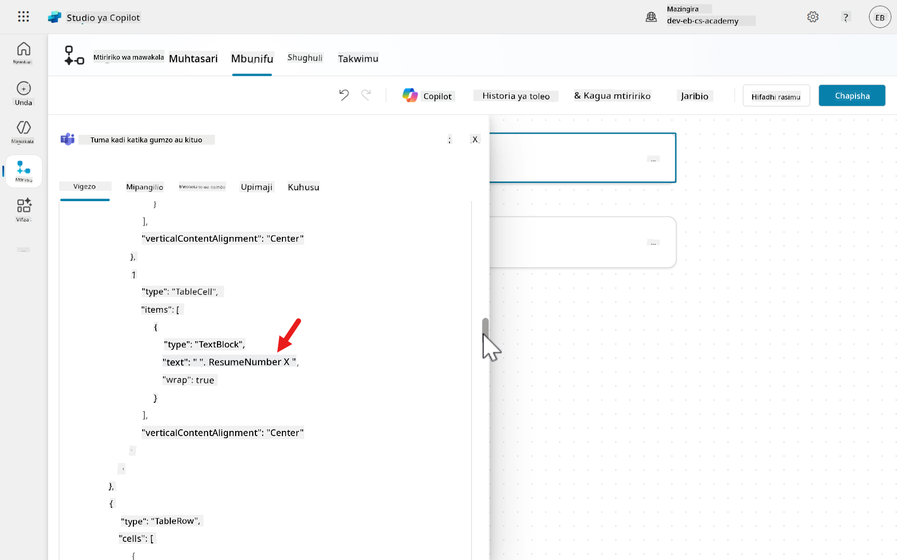

1. Tutarudia hatua hizo hizo kwa `RESUME NAME PLACEHOLDER`. Shuka chini hadi mstari ambapo unaona mali ya `text` kwa `RESUME NAME PLACEHOLDER`. Toa thamani ya placeholder na uifute.

       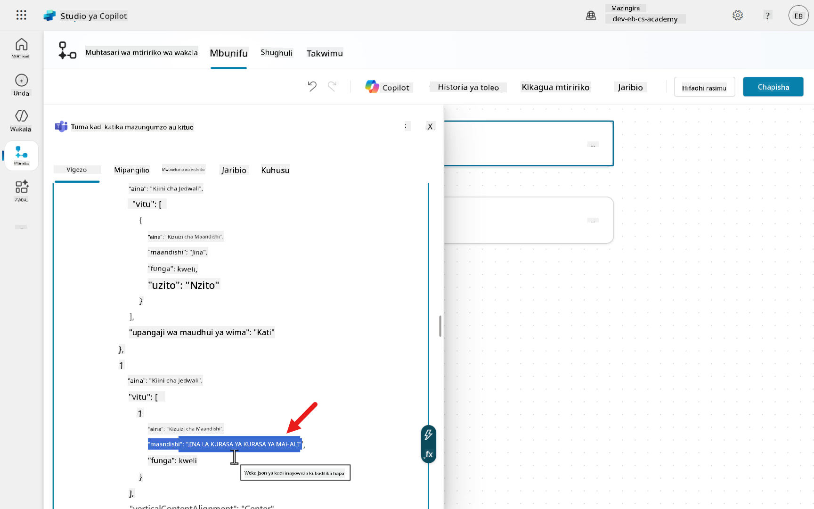

1. Bonyeza kati ya alama za nukuu mbili na uchague ikoni ya **radi** au ikoni ya **fx** upande wa kulia.

      Katika kichupo cha **Dynamic Content** chagua kipengele cha **ResumeTitle** na uchague **Add**.

       

1. Kipengele cha **ResumeTitle** sasa kitaongezwa kama maudhui ya nguvu kwa mali ya `text`.

       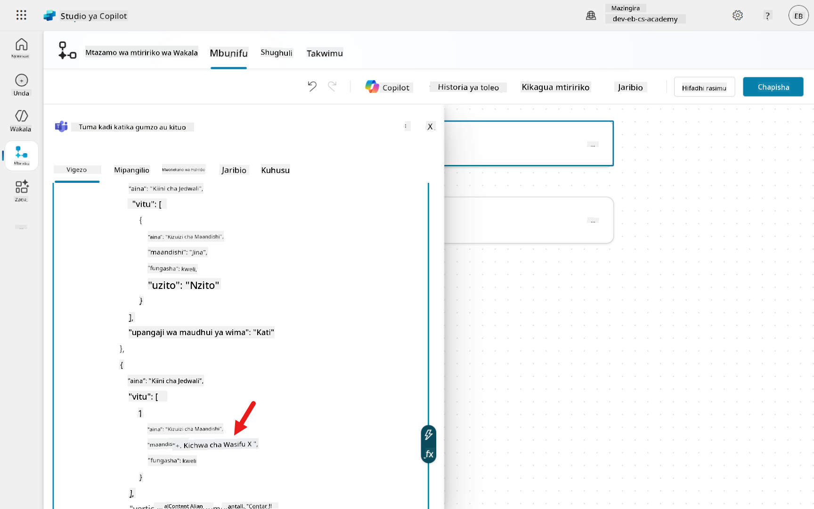

1. Tutarudia hatua hizo hizo kwa thamani ya **Due Date** inayowakilisha wakati mwajiri anapaswa kukagua resume. Shuka chini hadi mstari ambapo unaona mali ya `text` kwa `May 21, 2023`.

       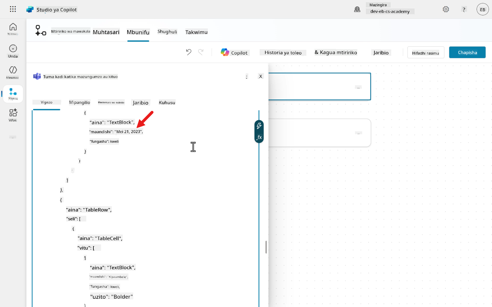

1. Futa thamani ya placeholder ya tarehe hii na bonyeza kati ya alama za nukuu mbili.

       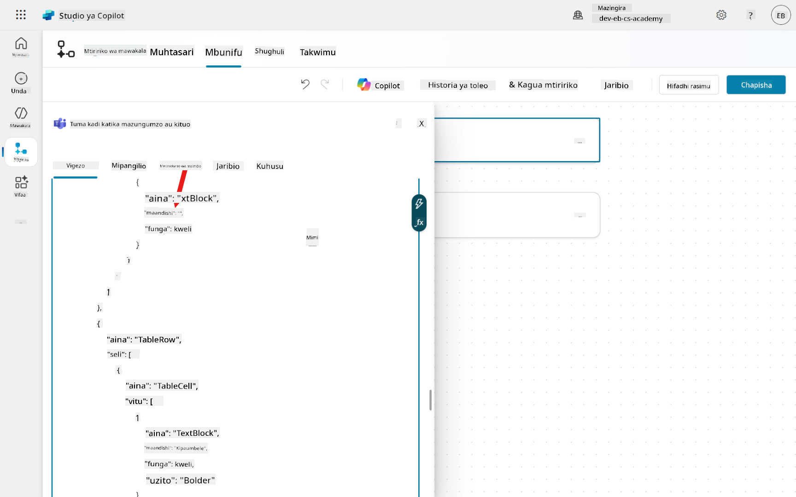

1. Chagua ikoni ya **radi** au ikoni ya **fx** upande wa kulia na katika kichupo cha **Function**, ingiza usemi ufuatao na uchague **Add**.

       ```text
       addDays(utcNow(), 3, 'MMM dd, yyyy')
       ```

      Usemi huu unatumia kazi mbili.

     | Kazi | Maelezo |
     |----------|------------|
     | **addDays** | Huongeza idadi maalum ya siku kwa tarehe iliyotolewa na kurudisha tarehe inayotokana katika muundo wa maandishi |
     | **utcNow** | Hurejesha tarehe na wakati wa sasa katika muundo wa Universal Time (UTC) kama maandishi. |

      Kwa thamani ya utcNow, tunaunda tarehe kuwa mwezi na tarehe, ikifuatiwa na mwaka.

       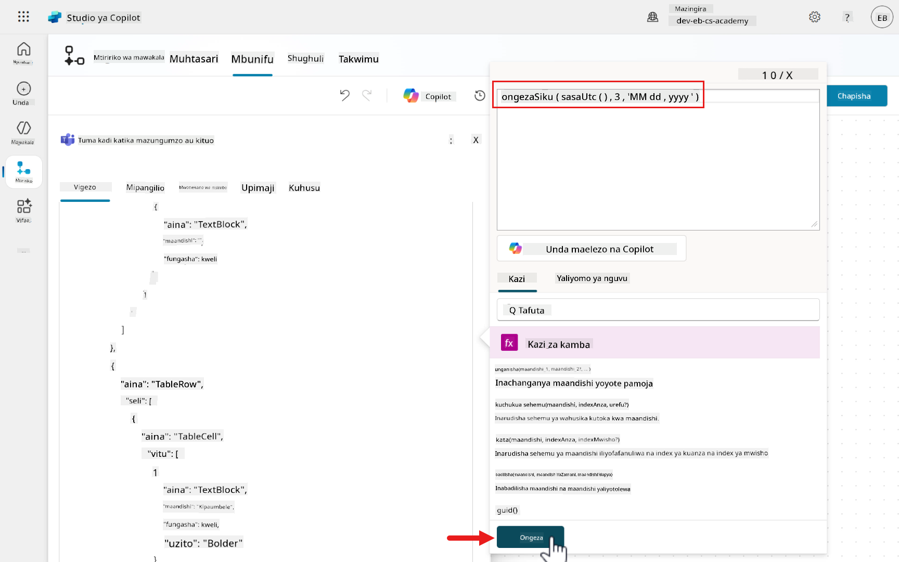

      Usemi sasa utaongezwa kwa mali ya `text`.

       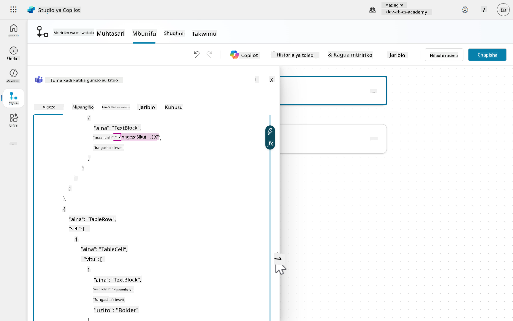

1. Mwisho, tutasasisha URL kwa mali ya `url` ndani ya mali ya safu ya `actions` chini ya mzigo wa JSON. URL ya placeholder ya sasa itabadilishwa na URL ya safu ya Resume katika programu ya **Hiring Hub** inayotumia modeli. Hii itamruhusu Mwajiri kuchagua hatua ya `Action.OpenURL` ya kadi ya adaptive na kuelekezwa kwenye Resume katika programu inayotumia modeli.

       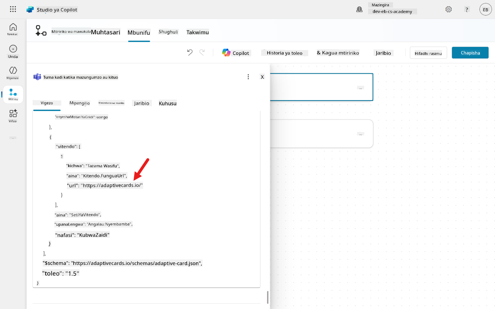

1. Katika programu ya **Hiring Hub** inayotumia modeli, fungua safu katika mtazamo wa mfumo wa **Resumes** ukitumia menyu ya upande wa kushoto. Safu ya resume itapakiwa kama fomu katika programu inayotumia modeli.

      Nakili URL ya safu ya Resume.

    ??? info "Jinsi ya kurudi kwenye programu ya **Hiring Hub** inayotumia modeli ikiwa ulitoka/kufunga"

        1. Tembelea [https://make.powerapps.com](https://make.powerapps.com) na hakikisha uko katika mazingira yako ya msanidi programu unayotumia kwa mazoezi haya ya maabara, vinginevyo badilisha kwenda kwake.
        
        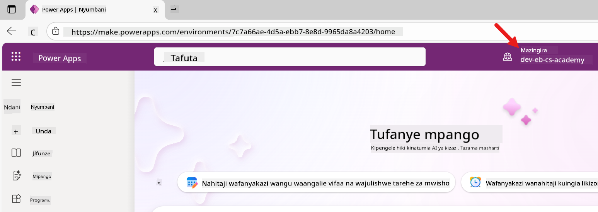

        1. Chagua **Apps** katika paneli ya menyu ya upande wa kushoto na kwa programu ya **Hiring Hub** inayotumia modeli, chagua ikoni ya **Play** ili kuipakia kwenye kivinjari chako.
        
        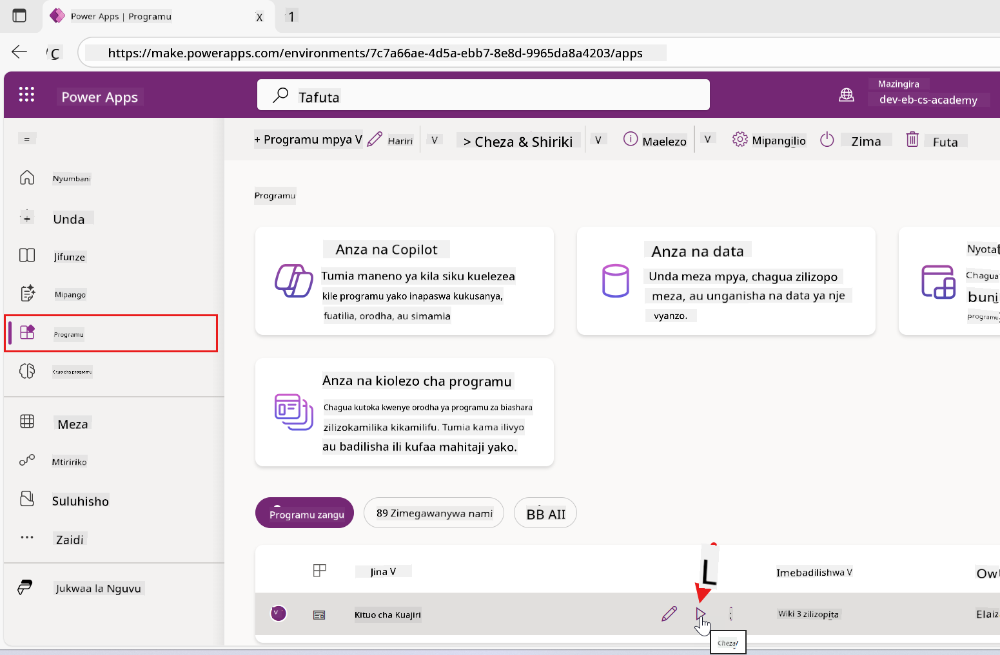

       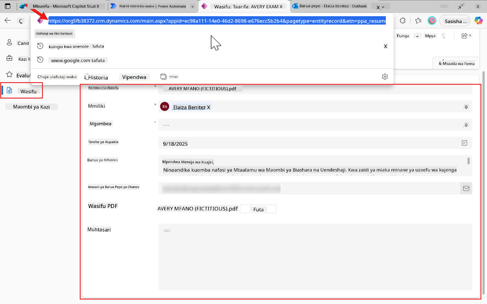

1. Kisha rudi kwenye mtiririko wa wakala, toa thamani ya placeholder ya URL ya sasa na uifute.

       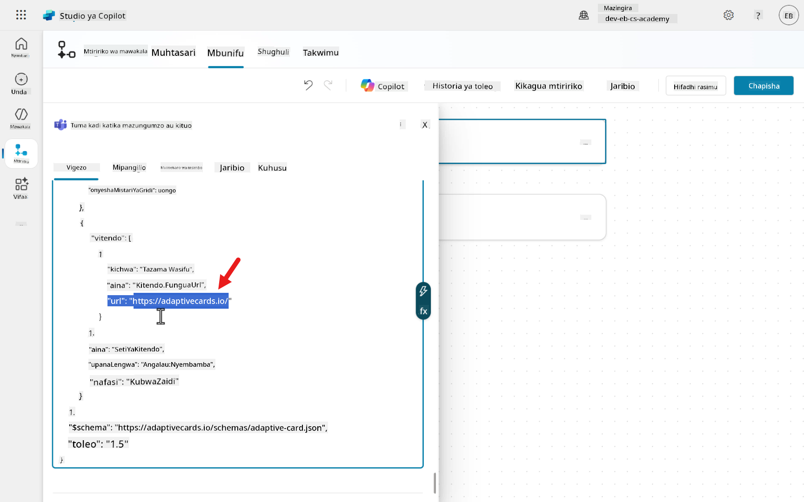

1. Kisha bandika URL iliyokopiwa kwenye mali ya **url** ndani ya mali ya `url`.

       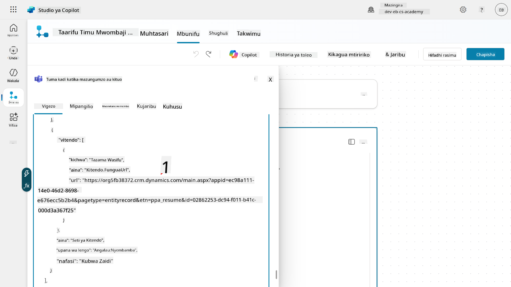

1. Unapaswa kuona yafuatayo. Futa thamani ya kitambulisho cha `GUID` mwishoni. Tutabadilisha maudhui haya ya nguvu - kipengele cha **ResumeId**.

       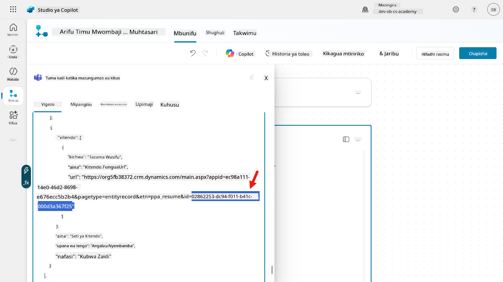

1. Chagua ikoni ya **radi** au ikoni ya **fx** upande wa kulia.

      Katika kichupo cha **Dynamic Content** chagua kipengele cha **ResumeId** na uchague **Add**..

       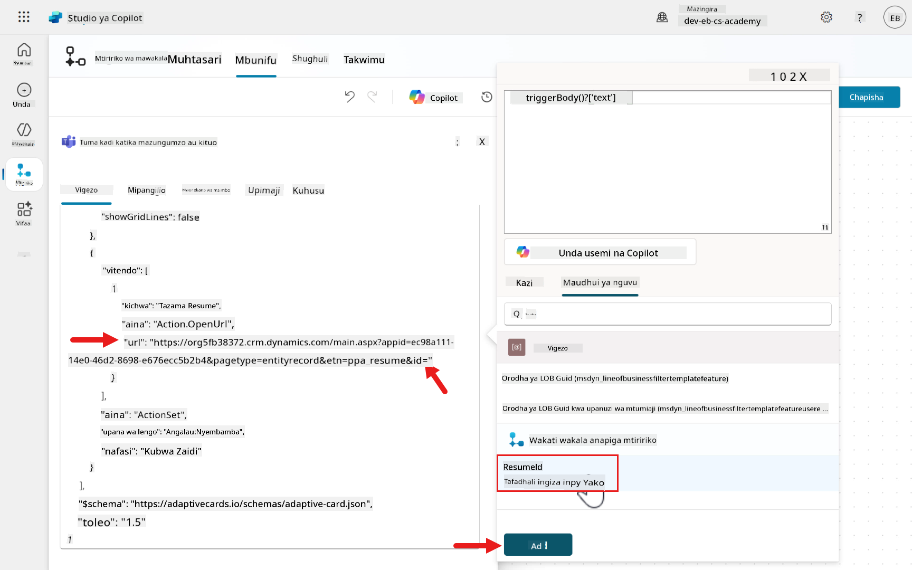

1. Kipengele cha **ResumeId** kitaongezwa kama maudhui ya nguvu. Yafuatayo yaliyotolewa kwa rangi ya Njano ni maelezo ya mazingira yako ya programu ya **Hiring Hub** inayotumia modeli.

     | Kipengele | Thamani | Maelezo |
     |----------|------------|---------|
     | **Organization URI** | GUID | URL ya shirika la mazingira ya Dataverse/Dynamics 365 |
     | **appid** | GUID | Ili kufungua programu maalum inayotumia modeli, kipengele cha swali cha appid au appname kinatumika. Katika kesi hii, appid inatumika |
     | **id** | GUID | Kipengele cha swali ambacho ni kitambulisho cha safu ya Resume |

       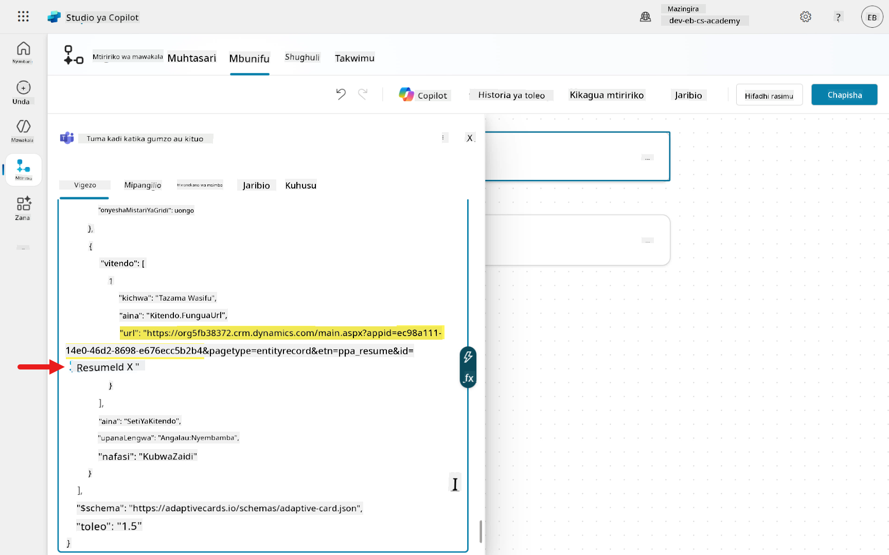

1. Tumekamilisha kusanidi hatua ya **Post card in a chat or channel** 👏🏻 Toka kwenye paneli ya usanidi wa hatua kwa kuchagua ikoni ya **x**.

       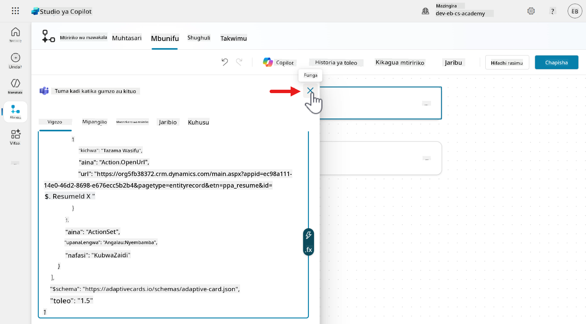

1. Mwisho, tutasanidi hatua ya mwisho, **Respond to the agent** kwa kutuma maandishi kurudi kwa wakala kumaliza usindikaji.

      Katika hatua ya **Respond to the agent**, chagua **+Add an output**.

       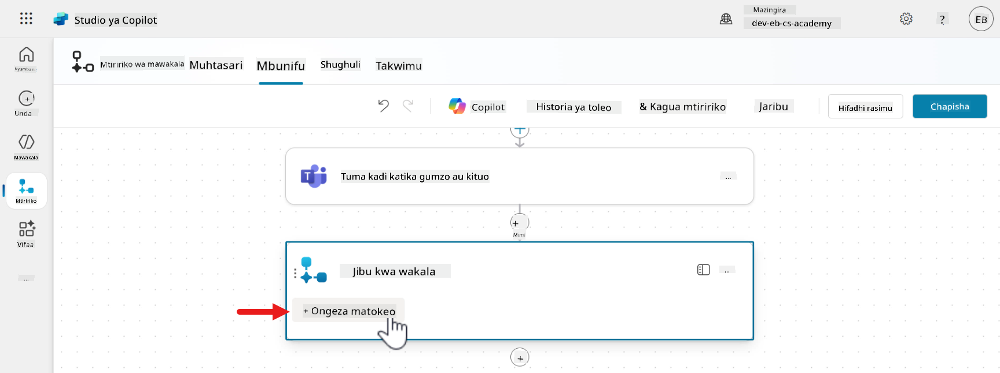

1. Chagua **Text** kama aina ya matokeo.

       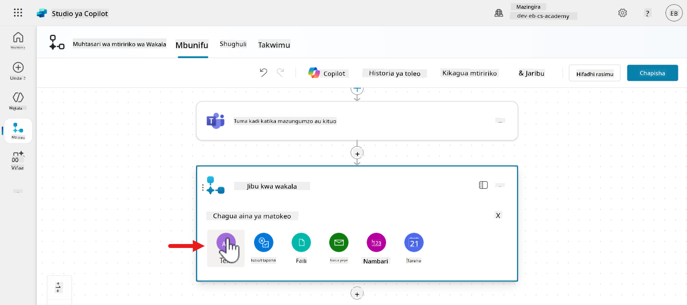

1. Ingiza yafuatayo kama jina la matokeo.

       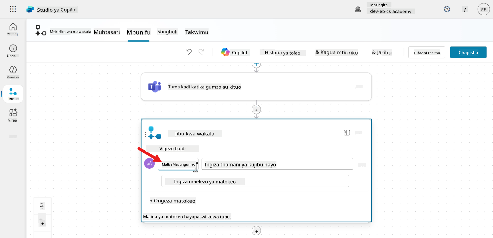

1. Ingiza yafuatayo kama thamani ya matokeo.

       ```text
       Finished
       ```

       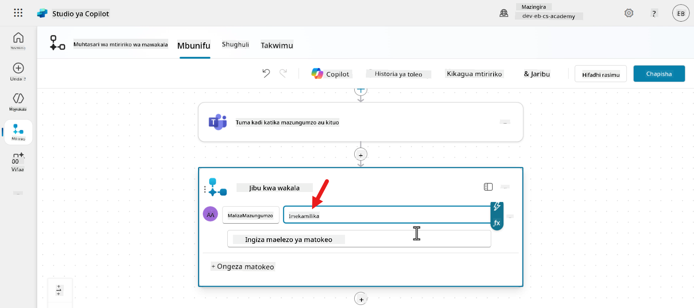

1. Sasa tumekamilisha kusanidi mtiririko wa wakala. Chagua **Save draft** kuhifadhi mtiririko wa wakala. Ujumbe wa uthibitisho utaonekana mara baada ya kuhifadhiwa.

       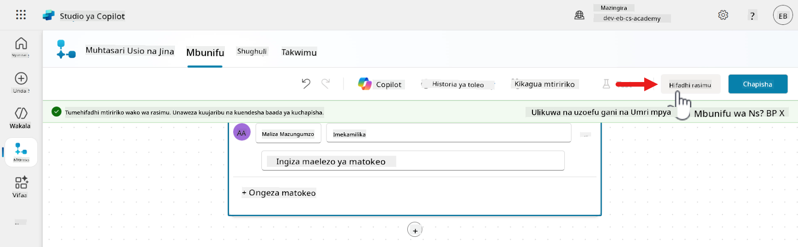

1. Kabla ya kuchapisha mtiririko wa wakala, tunahitaji kusasisha maelezo ya mtiririko wa wakala. Chagua kichupo cha **Overview** na uchague **Edit**.

      Katika sehemu ya jina la mtiririko, ingiza yafuatayo.

       ```text
       Notify Teams Applicant channel
       ```      

      Baadaye, chagua ikoni ya **Refresh** ili kusasisha maelezo ya mtiririko wa wakala ukitumia AI.

      Kisha chagua **Save** kuhifadhi maelezo yaliyosasishwa ya mtiririko wa wakala.

       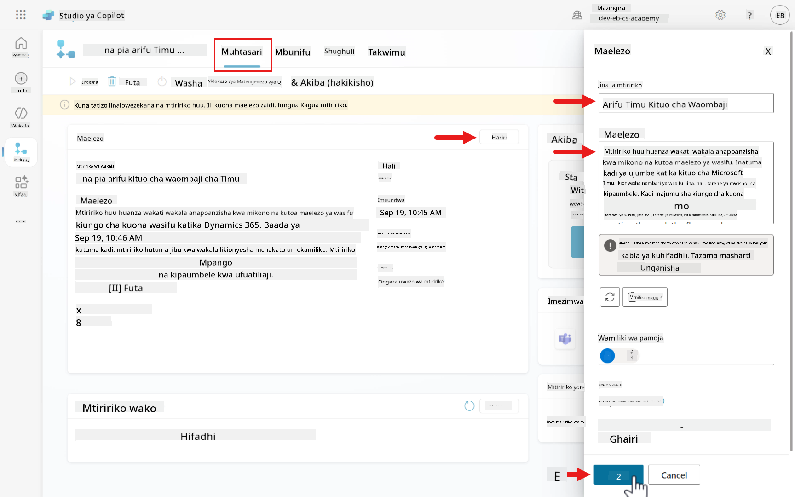

1. Rudi kwenye kichupo cha **Designer** na chagua **Publish** kuchapisha mtiririko wa wakala. Ujumbe wa uthibitisho utaonekana mara baada ya kuhifadhiwa.

       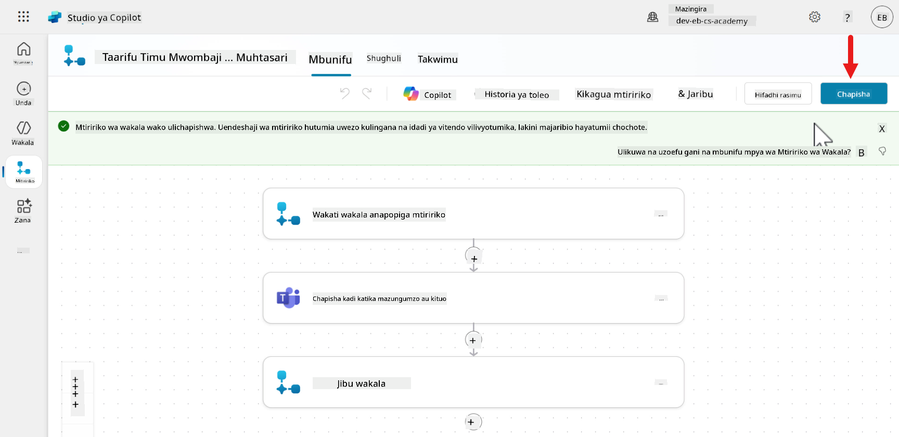

1. Mtiririko wa wakala sasa unahitaji kuongezwa kama zana katika **Application Intake Agent**. Rudi kwenye **Hiring Agent** na chagua kichupo cha **Agents**, kisha chagua **Application Intake Agent**.

       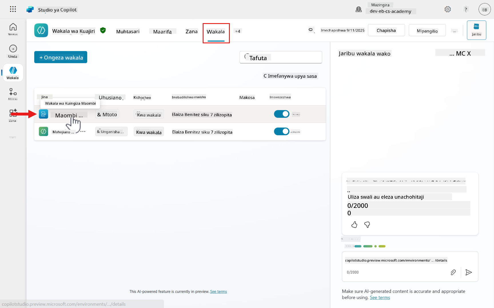

1. Katika sehemu ya **Details** ya wakala, tutasasisha sehemu ya **Description**. Nakili yafuatayo na bandika mwishoni mwa maandishi ya maelezo.

       ```text
       na pia kuarifu chaneli ya Teams Applicant
       ```

       

1. Kisha, tutaongeza mtiririko wa wakala kama zana. Shuka chini na chagua **+ Add**.

       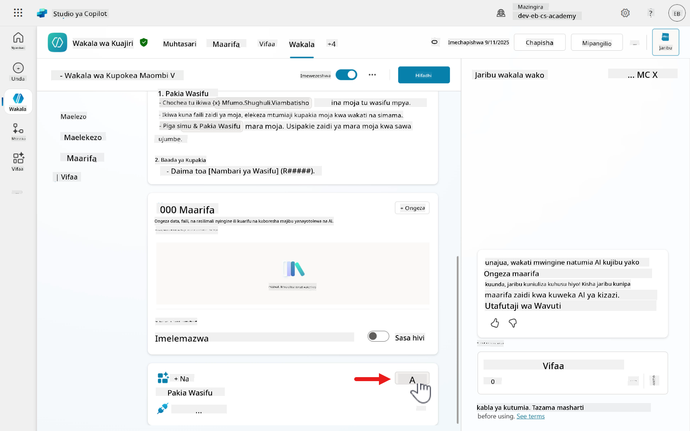

1. Chagua mtiririko wa wakala ulioundwa awali, **Notify Teams Applicant Channel**.

       

1. Chagua **Add and configure** kisha.

       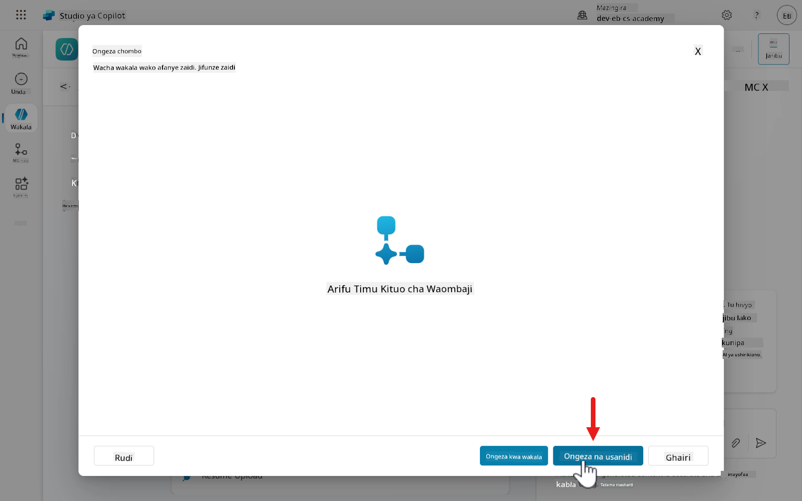

1. Katika sehemu ya **Inputs** ya mtiririko wa wakala, pembejeo tatu tulizosanidi awali katika mtiririko wa wakala zinaonekana. Kwa chaguo-msingi, usanidi wa **Fill using** umewekwa kwa **Dynamically fill with AI**. Tutahifadhi mpangilio huu kama ulivyo kwa kuwa maelekezo kutoka kwa kichocheo cha tukio (katika hatua ya mwisho, **Sends a prompt to the specified copilot for processing** - hii ni hatua za 38-44 za **Lab 3.1 - Automate uploading resumes to Dataverse received by email**) yatakuwa na maadili ya kipengele ambacho AI itachambua.

       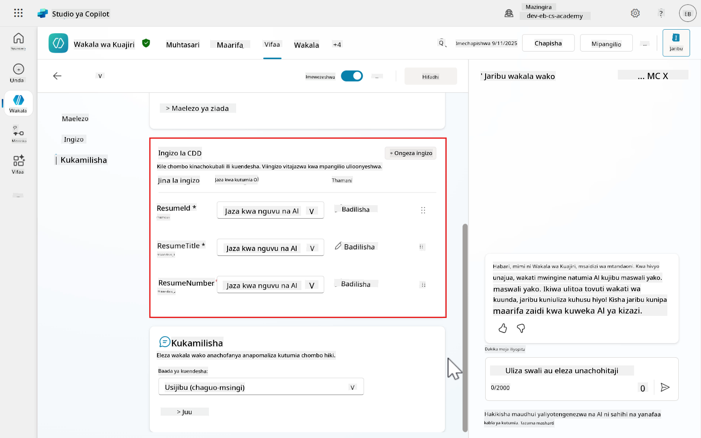

1. Sasa kwa kuwa zana imeongezwa kwenye **Application Intake Agent**, maelekezo ya wakala yanahitaji kusasishwa. Chagua ikoni ya **back arrow** kurudi kwenye orodha ya mawakala.

       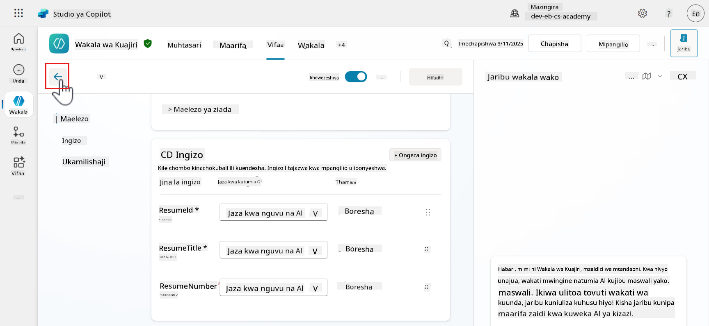

1. Chagua **Application Intake Agent** katika kichupo cha **Agents** cha **Hiring Agent**.

       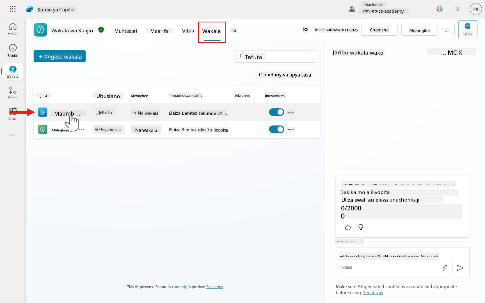

1. Katika sehemu ya **Instructions**, ingiza mstari mpya baada ya maelekezo ya `2.Post-Upload`. Nakili na bandika maelekezo yafuatayo.

       ```text
       Mchakato wa Kupakia Resume kupitia Barua Pepe
       1. Unapopokea ujumbe, **Tuma [ResumeId (text)] = "1680265f-5793-f011-b41b-7c1e525be9f7" na [ResumeTitle (text_1)] = "TAYLOR TESTPERSON (FICTITIOUS).pdf" na [ResumeNumber (text_2)]= "R01026" kwa Zana "Notify Teams Applicant channel"** katika wakala wa mtoto "Application Intake Agent", piga [AGENT FLOW PLACEHOLDER]
       ```

       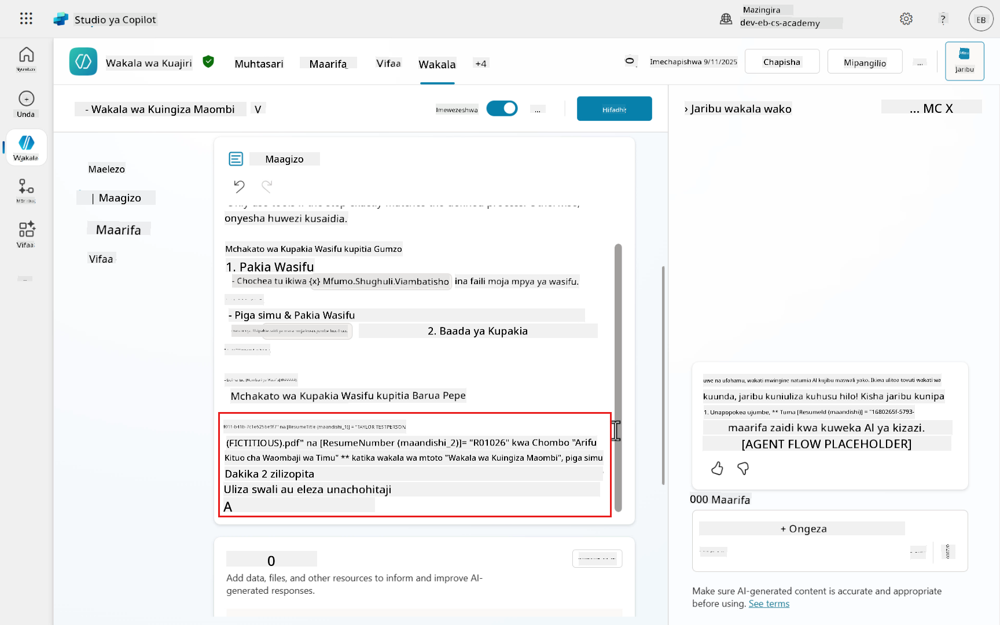

1. Toa mwangaza kwa maandishi `[AGENT FLOW PLACEHOLDER`.

       

1. Ingiza herufi ya mbele, `/`, na uchague zana ya **Notify Teams Applicant Channel**.

       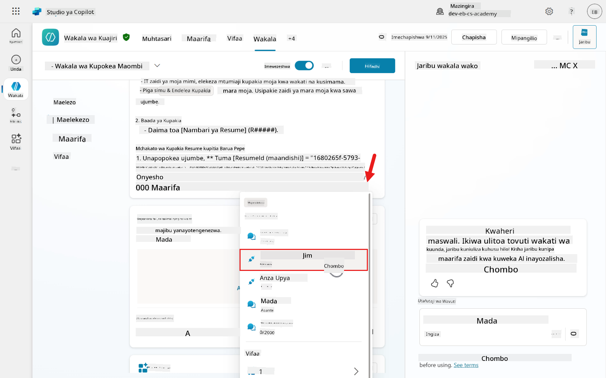
1. Mtiririko wa wakala sasa utaanzishwa na **Application Intake Agent** kulingana na maelekezo, baada ya hatua ya mwisho (**Kutuma maelekezo kwa copilot maalum kwa ajili ya usindikaji**) katika kichocheo cha tukio kutuma maelekezo yanayojumuisha thamani za vigezo kurudi kwa wakala.

      Chagua **Hifadhi** ili kuhifadhi maelekezo yaliyosasishwa kwa **Application Intake Agent**.

       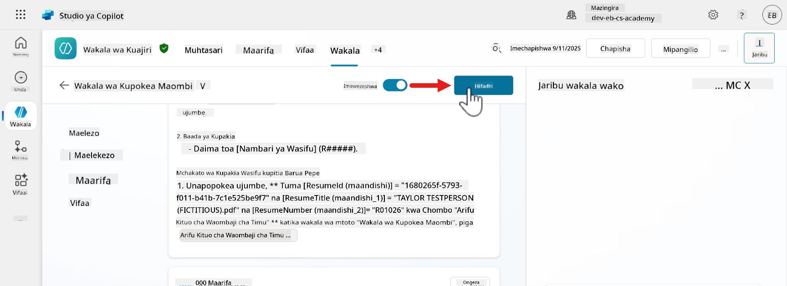

1. Maelekezo sasa yatasasishwa mara tu wakala atakapohifadhiwa.

       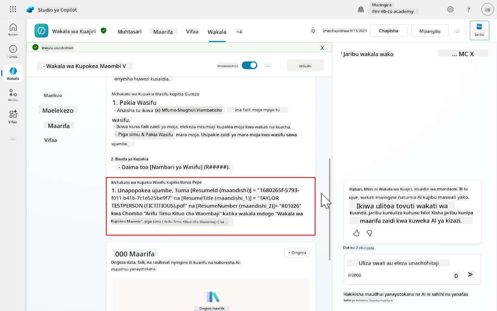

1. Sasa tunahitaji **Kuchapisha** **Hiring Agent**. Chagua **Chapisha** kwenye kona ya juu kulia, na kwenye _modal ya Chapisha wakala huyu_ itakayoonekana, chagua **Chapisha**.

       

1. Mara tu imechapishwa, ujumbe wa uthibitisho utaonekana kwamba wakala amechapishwa.

       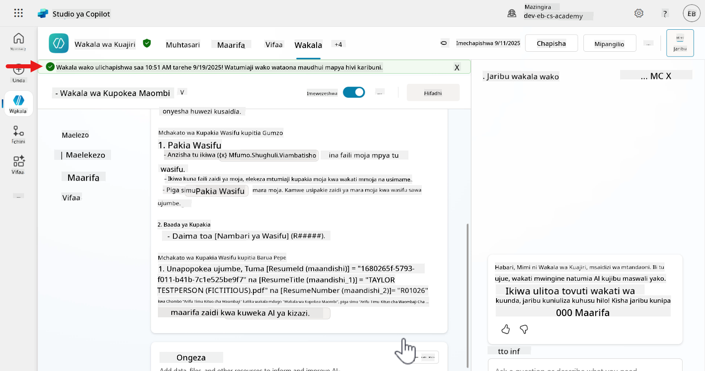

Sasa tunaweza kujaribu wakala!

### Maabara 3.3 - Jaribu kichocheo cha tukio

1. Ili kutekeleza kichocheo cha tukio, barua pepe inahitaji kutumwa ikiwa na faili ya pdf ya Wasifu. Katika Outlook, andika ujumbe mpya wa barua pepe.

     | Sehemu ya Barua Pepe | Maelezo |
     |----------|------------|
     | **Kwa mpokeaji** | Tumia akaunti yako uliyoingia kama thamani |
     | **Kiambatisho cha Faili** | Pakia faili ya [TAYLOR TESTPERSON (FICTITIOUS)](../../../../../docs/operative-preview/test-data/resumes/TAYLOR%20TESTPERSON%20(FICTITIOUS).pdf)  |
     | **Mwili** | Nakili na ubandike maandishi yafuatayo kama mwili wa barua pepe  |

       ```text
       Mheshimiwa Meneja wa Ajira,

       Ninaandika kuelezea nia yangu ya kujiunga na nafasi ya Mhandisi Mwandamizi wa Power Platform katika shirika lako. Kwa uzoefu wa zaidi ya miaka tisa wa kutoa suluhisho salama na linaloweza kupanuka kwenye majukwaa ya wingu ya Microsoft, nina uhakika wa uwezo wangu wa kuchangia kwa ufanisi katika timu yako.

       Katika jukumu langu la hivi karibuni kama Mhandisi Kiongozi wa Power Platform, nilitengeneza mfumo wa kiotomatiki wa kuchakata wasifu, kupunguza kazi za mikono na kuboresha uwezo wa kutafuta. Nimewasilisha programu za usimamizi wa kesi za HR, kuanzisha mtiririko wa suluhisho, na kutekeleza ukaguzi wa PR ili kuboresha muda wa utekelezaji. Utaalamu wangu unajumuisha Power Apps, Power Automate, Power Pages, Dataverse, na huduma mbalimbali za Microsoft 365, pamoja na ujumuishaji na Graph/REST APIs na Azure Functions.

       Hapo awali, nilitengeneza idhini za Timu kwa kutumia kadi za adaptive, kupunguza muda wa idhini hadi siku hiyo hiyo, na kuunda mifumo thabiti ya kushughulikia makosa. Historia yangu pia inajumuisha kuhamisha mtiririko wa kazi wa zamani kwenda Power Automate na kujenga milango ya huduma binafsi iliyopokelewa na mamia ya wafanyakazi.

       Nina shahada ya B.Sc. katika Sayansi ya Kompyuta na nimeidhinishwa kama Mendelezaji wa Power Platform (PL-400) na Mbunifu wa Suluhisho (PL-600). Pia nina shauku ya kufundisha na nimejitolea na vikundi vya watengenezaji wa ndani.

       Tafadhali pata CV yangu imeambatanishwa kwa ajili ya kuzingatia kwako. Ningependa fursa ya kujadili jinsi ujuzi na uzoefu wangu unavyolingana na mahitaji yako.

       Asante kwa muda wako na kuzingatia.

       Kwa heshima,
       Taylor Testperson
       ```

       **Tuma** barua pepe mara tu unapomaliza kuiandika.

       

1. Katika lango la Power Automate maker kwa mtiririko wa kichocheo cha tukio, chagua ikoni ya **Sasisha** ili kuona mtiririko wa mtiririko uliofanikiwa kwa barua pepe iliyotumwa.

       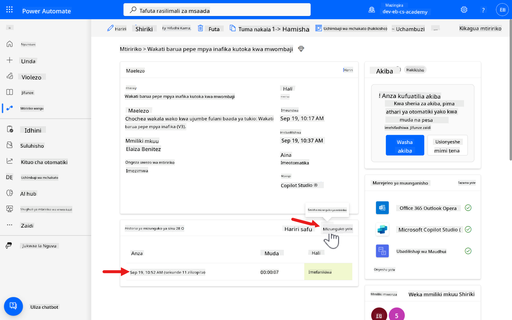

1. Rudi kwenye Copilot Studio katika **Hiring Agent** chagua kichupo cha **Shughuli**.

       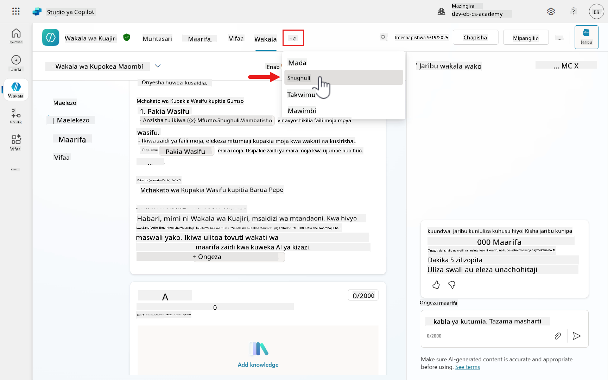

1. Kichupo cha **Shughuli** kitajitokeza ambacho kitaonyesha shughuli zote za **Hiring Agent**. Kutakuwa na shughuli yenye jina la **Automated** ambayo ina hali ya **Imekamilika**. Shughuli hii inawakilisha kichocheo cha tukio na mtiririko wa wakala uliyoanzishwa.

       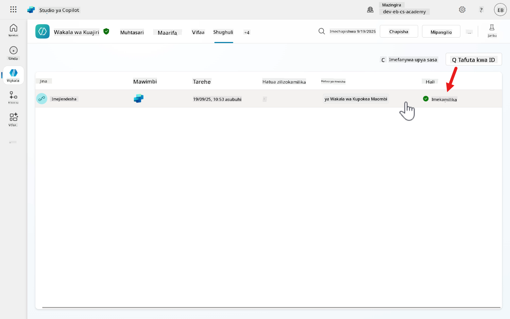

1. Chagua shughuli, na chagua kichocheo cha tukio kwenye ramani ya shughuli. Kwenye paneli ya upande wa kulia, angalia jinsi vigezo vya pembejeo kwenye maelekezo vinavyoshikilia thamani za `Resume Id`, `Resume Title` na `Resume Number` kutoka safu ya **Dataverse** iliyoundwa. Hii ilitokana na thamani za maudhui ya nguvu zilizosanidiwa awali katika hatua za 18 - 27 za **Lab 3.1 - Automate uploading resumes to Dataverse received by email**.

       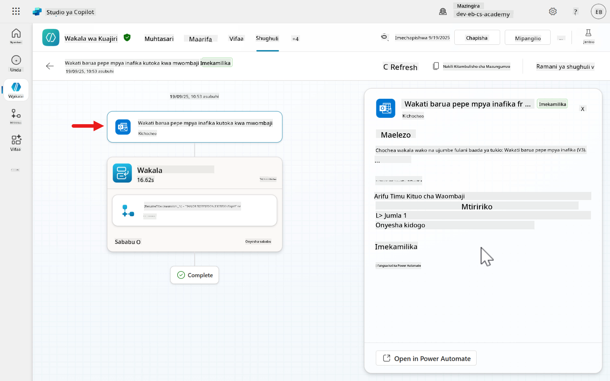

1. Nenda tena kwenye programu ya **Hiring Hub** inayotegemea modeli na katika **Muonekano wa mfumo wa Wasifu**, chagua **Sasisha** ili kusasisha muonekano. Safu mpya ya wasifu iliyotumwa kwa barua pepe sasa itakuwa imeorodheshwa kwani iliundwa kupitia kichocheo cha tukio.

       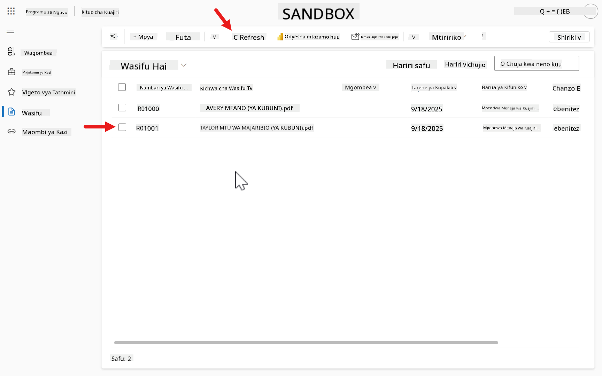

1. Rudi kwenye Copilot Studio na chagua mtiririko wa wakala wa **Notify Teams Applicant Channel** ndani ya **Application Intake Agent** kwenye ramani ya shughuli. Kwenye paneli ya upande wa kulia, angalia jinsi pembejeo zilivyo na thamani kutoka safu ya Dataverse. Hii ilitokana na maelekezo yaliyotumwa na hatua ya mwisho (**Kutuma maelekezo kwa copilot maalum kwa ajili ya usindikaji**) katika kichocheo cha tukio ambacho kina thamani za vigezo kutoka safu mpya ya Dataverse. Hivi ndivyo tunavyoweza kupitisha thamani za vigezo kutoka kwa vichocheo vya tukio kwenda kwa mtiririko wa wakala.

       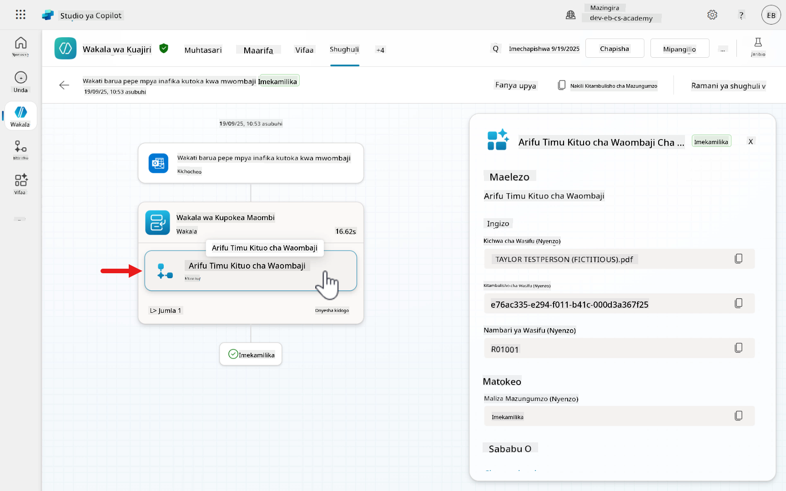

1. Hatimaye, hebu tuangalie kadi ya adaptive iliyochapishwa kwenye chaneli katika **Microsoft Teams**. Kwenye chaneli, tutaona kadi ya adaptive inayoonyesha taarifa kuhusu safu mpya ya Wasifu iliyoundwa katika Dataverse. Peleka kipanya juu ya kiungo mwanzoni mwa kadi ya adaptive, angalia jinsi URL ilivyo URL ya muonekano wa mfumo wa Wasifu ambayo tuliisanidi awali katika payload ya JSON (hatua za 15 - 19 za **Lab 3.2 - Notify a Teams channel using an adaptive card**).

       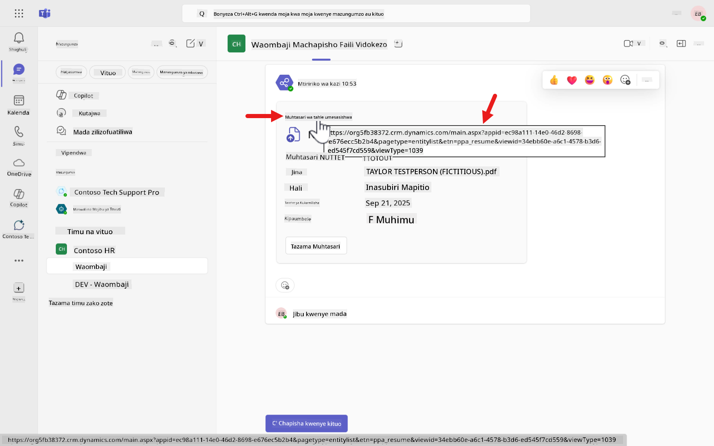

1. Chagua kiungo, na utaelekezwa kwenye muonekano wa mfumo wa Wasifu katika programu ya **Hiring Hub** inayotegemea modeli kwenye kivinjari chako.

       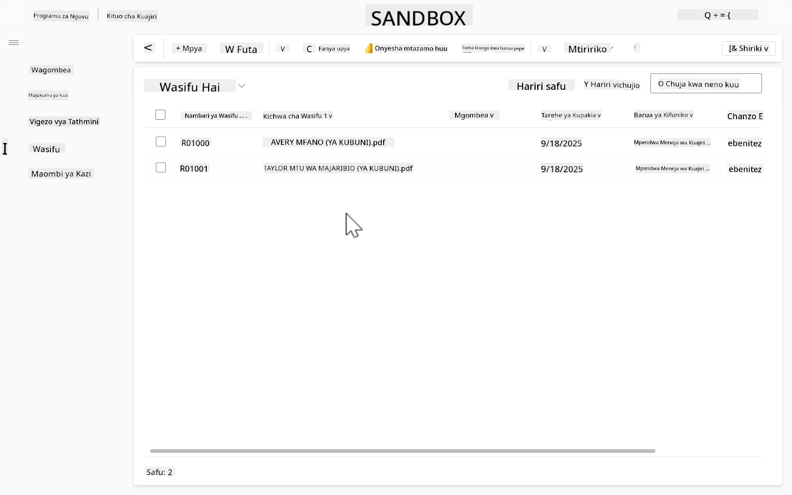

1. Rudi kwenye kadi ya adaptive iliyochapishwa kwenye chaneli katika Microsoft Teams. Wakati huu, peleka kipanya juu ya **View Resume** ambayo ni hatua ya `Action.OpenURL` ya kadi ya adaptive. Angalia jinsi URL ilivyo safu ya Wasifu ambayo tuliisanidi awali katika payload ya JSON (hatua za 30 - 36 za **Lab 3.2 - Notify a Teams channel using an adaptive card**).

       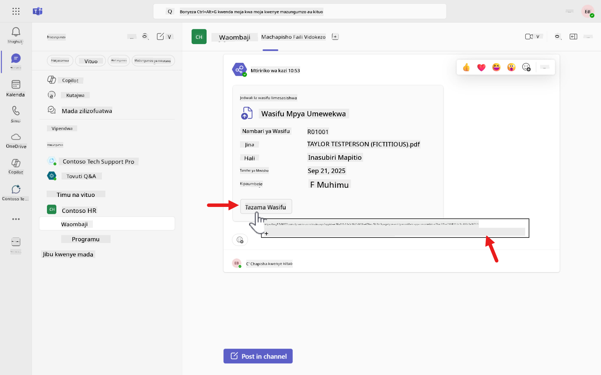

1. Chagua hatua hiyo, na utaelekezwa kwenye fomu ya safu ya Wasifu katika programu ya **Hiring Hub** inayotegemea modeli kwenye kivinjari chako.

       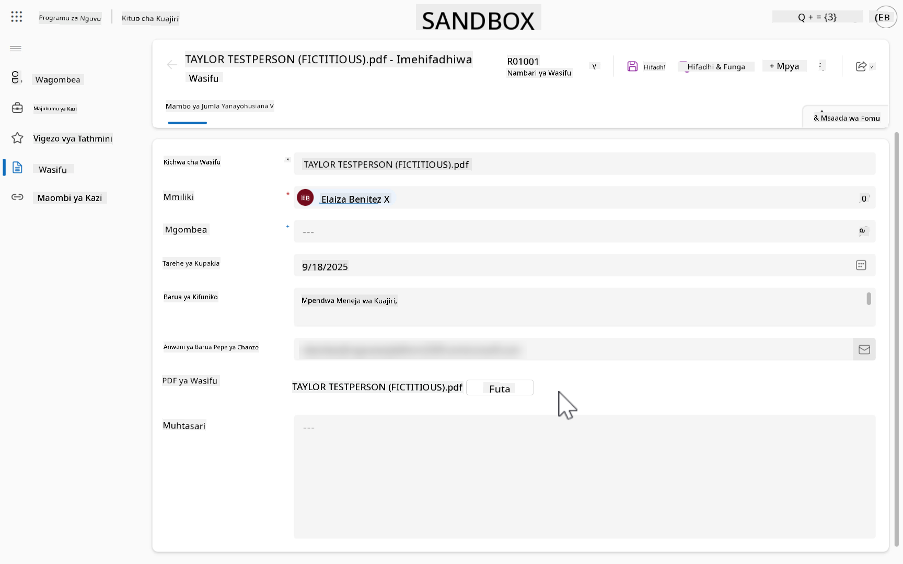

## ✅ Kazi Imekamilika

Hongera! 👏🏻 Kazi nzuri, Operative.

✅ Kichocheo cha tukio: umeunda kichocheo cha tukio kinachopitisha thamani za vigezo vya Dataverse kwa mtiririko wa wakala.  
✅ Umeunda mtiririko wa wakala: unatumia thamani za vigezo vya Dataverse kuchapisha kadi ya adaptive kwenye chaneli katika Microsoft Teams kuwajulisha timu ya uajiri ya HR.  
✅ Umesasisha maelekezo ya wakala wa mtoto: kuanzisha mtiririko mara tu kichocheo cha tukio kinapokamilika.  

Hii inamwezesha **Hiring Agent** kufanya kazi kwa uhuru kila wakati wasifu unapopokelewa kama viambatisho vya barua pepe na kuwajulisha timu ya uajiri ya HR kwa ukaguzi wa mikono.

Hii ni mwisho wa **Lab 03 - Kuendesha barua pepe za maombi ya mgombea kiotomatiki**, chagua kiungo hapa chini ili kuendelea na somo linalofuata.

⏭️ [Nenda kwenye somo la **Kuandika Maelekezo ya Wakala**](../04-agent-instructions/README.md)

## 📚 Rasilimali za Kimbinu

📖 [Fanya wakala wako kuwa wa kujitegemea katika Copilot Studio](https://learn.microsoft.com/training/modules/autonomous-agents-online-workshop/?WT.mc_id=power-188561-ebenitez)  

📖 [Ongeza kichocheo cha tukio](https://learn.microsoft.com/microsoft-copilot-studio/authoring-trigger-event?WT.mc_id=power-188561-ebenitez)  

📖 [Tumia mitiririko ya wakala na wakala wako](https://learn.microsoft.com/microsoft-copilot-studio/advanced-flow?WT.mc_id=power-188561-ebenitez)  

📖 [Utangulizi wa vichocheo vya Power Automate](https://learn.microsoft.com/power-automate/triggers-introduction?WT.mc_id=power-188561-ebenitez)  

📖 [Kutumia mitiririko ya Power Automate na mawakala](https://learn.microsoft.com/microsoft-copilot-studio/advanced-flow-create?WT.mc_id=power-188561-ebenitez)  

📖 [Kuzuia upotevu wa data kwa Copilot Studio](https://learn.microsoft.com/microsoft-copilot-studio/admin-data-loss-prevention?WT.mc_id=power-188561-ebenitez)  

---

**Kanusho**:  
Hati hii imetafsiriwa kwa kutumia huduma ya tafsiri ya AI [Co-op Translator](https://github.com/Azure/co-op-translator). Ingawa tunajitahidi kwa usahihi, tafadhali fahamu kuwa tafsiri za kiotomatiki zinaweza kuwa na makosa au kutokuwa sahihi. Hati ya asili katika lugha yake ya awali inapaswa kuzingatiwa kama chanzo cha mamlaka. Kwa taarifa muhimu, tafsiri ya kitaalamu ya binadamu inapendekezwa. Hatutawajibika kwa kutoelewana au tafsiri zisizo sahihi zinazotokana na matumizi ya tafsiri hii.