<!--
CO_OP_TRANSLATOR_METADATA:
{
  "original_hash": "616d142d4fb5f45d2a168fad6c1f9545",
  "translation_date": "2025-10-20T01:17:24+00:00",
  "source_file": "docs/operative-preview/07-multimodal-prompts/README.md",
  "language_code": "sw"
}
-->
# 🚨 Kazi 07: Kutoa Maudhui ya Wasifu kwa Kutumia Maelekezo ya Multimodal

--8<-- "disclaimer.md"

## 🕵️‍♂️ JINA LA KODI: `UCHAMBUZI WA WASIFU WA NYARAKA`

> **⏱️ Muda wa Operesheni:** `~dakika 45`

## 🎯 Maelezo ya Kazi

Karibu, Opereta. Majukumu yako ya awali yamekupa ujuzi wa kuandaa mawakala wenye nguvu, lakini sasa ni wakati wa kufungua uwezo wa kubadilisha mchezo: **uchambuzi wa nyaraka za multimodal**.

Kazi yako, ikiwa utaamua kuikubali, ni **Uchambuzi wa Wasifu wa Nyaraka** - kutoa data iliyopangwa kutoka kwa nyaraka yoyote kwa usahihi. Ingawa mawakala wako wanaweza kuchakata maandishi kwa urahisi, ulimwengu halisi unahitaji kushughulikia PDF, picha, na nyaraka ngumu kila siku. Wasifu unazidi kuongezeka, ankara zinahitaji kuchakatwa, na fomu zinahitaji kubadilishwa kuwa data ya kidijitali mara moja.

Kazi hii itakubadilisha kutoka kwa mjenzi wa mawakala wa maandishi pekee kuwa **mtaalamu wa multimodal**. Utajifunza jinsi ya kusanidi AI inayosoma na kuelewa nyaraka kama mchambuzi wa kibinadamu - lakini kwa kasi na uthabiti wa AI. Mwishoni mwa kazi hii, utakuwa umeunda mfumo kamili wa uchambuzi wa wasifu unaounganishwa na mtiririko wa kazi wa kuajiri.

Mbinu unazojifunza hapa zitakuwa muhimu kwa operesheni za hali ya juu za msingi wa data katika kazi yako inayofuata.

## 🔎 Malengo

Katika kazi hii, utajifunza:

1. Maelekezo ya multimodal ni nini na wakati wa kutumia mifano tofauti ya AI
1. Jinsi ya kusanidi maelekezo kwa pembejeo za picha na nyaraka
1. Jinsi ya kuunda matokeo ya maelekezo kama JSON kwa uchambuzi wa data iliyopangwa
1. Mbinu bora za uhandisi wa maelekezo kwa uchambuzi wa nyaraka
1. Jinsi ya kuunganisha maelekezo ya multimodal na Mitiririko ya Mawakala

## 🧠 Kuelewa maelekezo ya multimodal

### Nini hufanya maelekezo kuwa "multimodal"?

Maelekezo ya jadi hufanya kazi na maandishi pekee. Lakini maelekezo ya multimodal yanaweza kuchakata aina nyingi za maudhui:

- **Maandishi**: Maelekezo yaliyoandikwa na maudhui
- **Picha**: Picha, skrini, chati, na michoro (.PNG, .JPG, .JPEG)  
- **Nyaraka**: Ankara, wasifu, fomu (.PDF)

Uwezo huu unafungua hali zenye nguvu kama kuchambua wasifu, kuchakata ankara, au kutoa data kutoka kwa fomu.

### Kwa nini multimodal ni muhimu kwa mitiririko yako ya kazi

Kila siku, shirika lako linakutana na changamoto hizi za kuchakata nyaraka:

- **Uchunguzi wa wasifu**: Kusoma wasifu mamia kwa mkono huchukua muda muhimu
- **Uchakataji wa ankara**: Kutoa maelezo ya muuzaji, kiasi, na tarehe kutoka kwa fomati mbalimbali za nyaraka
- **Uchambuzi wa fomu**: Kubadilisha fomu za karatasi kuwa data ya kidijitali

Maelekezo ya multimodal huondoa vikwazo hivi kwa kuunganisha uelewa wa lugha wa AI na uwezo wa uchambuzi wa kuona. Hii inatoa AI yako uwezo wa kuchakata nyaraka kwa ufanisi kama maandishi.

### Hali za kawaida za biashara

Hapa kuna mifano ya jinsi maelekezo ya multimodal yanavyoweza kutumika:

| Hali                   | Kazi                                                                                                                                      | Sehemu za Matokeo Mfano                                                                                   |
|-------------------------|-------------------------------------------------------------------------------------------------------------------------------------------|---------------------------------------------------------------------------------------------------------|
| **Uchunguzi wa wasifu** | Kutoa jina la mgombea, barua pepe, simu, cheo cha sasa, miaka ya uzoefu, na ujuzi muhimu.                                                 | Jina la Mgombea, Anwani ya Barua Pepe, Namba ya Simu, Cheo cha Kazi cha Sasa, Miaka ya Uzoefu, Ujuzi Muhimu         |
| **Uchakataji wa ankara**| Kutoa maelezo ya muuzaji, tarehe ya ankara, kiasi cha jumla, na vipengele vya ankara kutoka kwa ankara hii.                               | Jina la Muuzaji, Tarehe ya Ankara, Kiasi cha Jumla, Vipengele vya Ankara                                             |
| **Uchambuzi wa fomu**   | Changanua fomu hii ya maombi na toa sehemu zote zilizojazwa.                                                                              | Jina la Sehemu (mfano, Jina la Mwombaji), Thamani Iliyoingizwa (mfano, John Doe), ...                                  |
| **Uthibitishaji wa nyaraka za kitambulisho** | Kutoa jina, namba ya kitambulisho, tarehe ya kumalizika muda, na anwani kutoka kwa nyaraka hii ya kitambulisho. Thibitisha kuwa maandishi yote yanasomeka vizuri na weka alama kwa sehemu zozote zisizoeleweka. | Jina Kamili, Namba ya Kitambulisho, Tarehe ya Kumalizika Muda, Anwani, Alama ya Sehemu Zisizoeleweka                        |

## ⚙️ Uchaguzi wa mfano wa AI Builder

AI Builder inatoa mifano tofauti iliyoboreshwa kwa kazi maalum. Kuelewa ni mfano gani wa kutumia ni muhimu kwa mafanikio.

!!! note "Sahihi hadi Septemba 2025"
    Mifano ya AI Builder inasasishwa mara kwa mara, kwa hivyo angalia [hati za mipangilio ya mfano wa AI Builder](https://learn.microsoft.com/ai-builder/prompt-modelsettings) kwa upatikanaji wa mfano wa sasa.

### Ulinganisho wa mifano

Mifano ifuatayo yote inaunga mkono uchakataji wa kuona na nyaraka

| Mfano | 💰Gharama | ⚡Kasi | ✅Bora kwa |
|-------|------|-------|----------|
| **GPT-4.1 mini** | Msingi (gharama nafuu zaidi) | Haraka | Uchakataji wa nyaraka wa kawaida, muhtasari, miradi ya bajeti ya chini |
| **GPT-4.1** | Kawaida | Wastani | Nyaraka ngumu, uundaji wa maudhui ya hali ya juu, mahitaji ya usahihi wa juu |
| **o3** | Premium | Polepole (sababu kwanza) | Uchambuzi wa data, kufikiri kwa kina, utatuzi wa matatizo ya hali ya juu |
| **GPT-5 chat** | Kawaida | Imeimarishwa | Uelewa wa nyaraka wa hivi karibuni, usahihi wa juu zaidi wa majibu |
| **GPT-5 reasoning** | Premium | Polepole (uchambuzi mgumu) | Uchambuzi wa hali ya juu zaidi, upangaji, kufikiri kwa hali ya juu |

### Maelezo ya mipangilio ya joto

Mipangilio ya joto inadhibiti jinsi majibu ya AI yanavyokuwa ya ubunifu au yanayotarajiwa:

- **Joto 0**: Matokeo yanayotarajiwa zaidi, thabiti (bora kwa uchakataji wa data)
- **Joto 0.5**: Usawa wa ubunifu na uthabiti  
- **Joto 1**: Ubunifu wa juu zaidi (bora kwa uundaji wa maudhui)

Kwa uchambuzi wa nyaraka, tumia **joto 0** ili kuhakikisha uchakataji wa data thabiti.

## 📊 Miundo ya matokeo: Maandishi vs JSON

Kuchagua muundo sahihi wa matokeo ni muhimu kwa uchakataji wa baadaye.

### Wakati wa kutumia matokeo ya maandishi

Matokeo ya maandishi yanafaa kwa:

- Muhtasari unaosomeka na binadamu
- Uainishaji rahisi
- Maudhui ambayo hayahitaji uchakataji wa muundo

### Wakati wa kutumia matokeo ya JSON

Matokeo ya JSON ni muhimu kwa:

- Uchakataji wa data iliyopangwa
- Muunganisho na hifadhidata au mifumo
- Uchakataji wa mtiririko wa Power Automate
- Uainishaji wa sehemu thabiti

### Mbinu bora za JSON

1. **Taja majina ya sehemu wazi**: Tumia majina yanayoeleweka, thabiti
1. **Toa mifano**: Jumuisha matokeo ya sampuli na thamani kwa kila sehemu
1. **Taja aina za data**: Jumuisha mifano kwa tarehe, namba, na maandishi
1. **Shughulikia data inayokosekana**: Panga kwa thamani tupu au isiyo na kitu
1. **Thibitisha muundo**: Jaribu na aina mbalimbali za nyaraka

### Mazingatio ya ubora wa nyaraka

- **Azimio**: Hakikisha picha ni wazi na zinasomeka
- **Mwelekeo**: Geuza nyaraka kwa mwelekeo sahihi kabla ya kuchakata
- **Msaada wa fomati**: Jaribu na aina maalum za nyaraka zako (PDF, JPG, PNG)
- **Mipaka ya ukubwa**: Fahamu mipaka ya ukubwa wa faili katika mazingira yako

### Uboreshaji wa utendaji

- **Chagua mifano inayofaa**: Sasisha mifano tu inapohitajika
- **Boresha maelekezo**: Mara nyingi, maelekezo mafupi, wazi hufanya kazi vizuri zaidi
- **Ushughulikiaji wa makosa**: Panga kwa nyaraka ambazo haziwezi kuchakatwa
- **Fuatilia gharama**: Mifano tofauti hutumia kiasi tofauti cha mikopo ya AI Builder

## 🧪 Maabara ya 7: Kujenga mfumo wa uchambuzi wa wasifu

Ni wakati wa kutumia maarifa yako ya multimodal kwa vitendo. Utajenga mfumo wa kina wa uchambuzi wa wasifu unaochambua nyaraka za wagombea na kuzibadilisha kuwa data iliyopangwa kwa mtiririko wa kazi wa kuajiri.

### Mahitaji ya kukamilisha kazi hii

1. Utahitaji **ama**:

    - **Kukamilisha Kazi ya 06** na kuwa na mfumo wako wa kuajiri mawakala tayari, **AU**
    - **Kuagiza suluhisho la kuanzia la Kazi ya 07** ikiwa unaanza upya au unahitaji kufuatilia. [Pakua Suluhisho la Kuanza la Kazi ya 07](https://aka.ms/agent-academy)

1. Nyaraka za sampuli za wasifu kutoka [Wasifu wa Majaribio](https://download-directory.github.io/?url=https://github.com/microsoft/agent-academy/tree/main/operative/sample-data/resumes&filename=operative_sampledata)

!!! note "Uagizaji wa Suluhisho na Data ya Sampuli"
    Ikiwa unatumia suluhisho la kuanzia, rejelea [Kazi ya 01](../01-get-started/README.md) kwa maelezo ya kina kuhusu jinsi ya kuagiza suluhisho na data ya sampuli katika mazingira yako.

### 7.1 Unda maelekezo ya multimodal

Lengo lako la kwanza: unda maelekezo yanayoweza kuchambua nyaraka za wasifu na kutoa data iliyopangwa.

1. Ingia kwenye [Copilot Studio](https://copilotstudio.microsoft.com) na uchague **Vifaa** kutoka kwa urambazaji wa kushoto.

1. Chagua **+ Kifaa kipya**, kisha chagua **Maelekezo**.  
    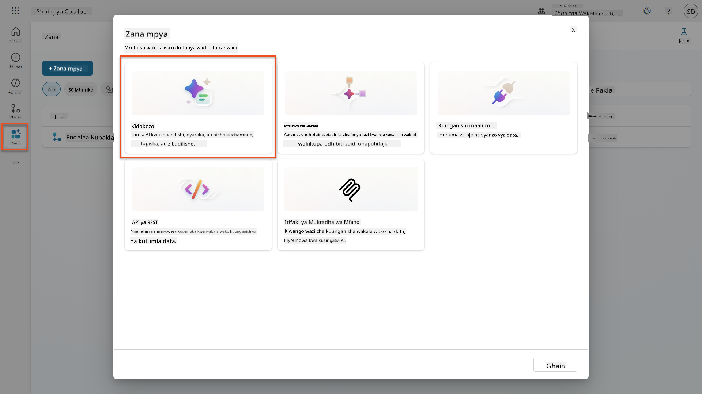

1. **Badilisha jina** la maelekezo kutoka kwa jina la muda chaguo-msingi (Mfano *Maelekezo Maalum 09/04/2025, 04:59:11 PM*) kuwa `Muhtasari wa Wasifu`.

1. Katika sehemu ya Maelekezo, ongeza maelekezo haya:

    ```text
    You are tasked with extracting key candidate information from a resume and cover letter to facilitate matching with open job roles and creating a summary for application review.
    
    Instructions:
    1. Extract Candidate Details:
        - Identify and extract the candidate’s full name.
        - Extract contact information, specifically the email address.
    2. Create Candidate Summary:
        - Summarize the candidate’s profile as multiline text (max 2000 characters) with the following sections:
            - Candidate name
            - Role(s) applied for if present
            - Contact and location
            - One-paragraph summary
            - Experience snapshot (last 2–3 roles with outcomes)
            - Key projects (1–3 with metrics)
            - Education and certifications
            - Top skills (Top 10)
            - Availability and work authorization
    
    Guidelines:
    - Extract information only from the provided resume and cover letter documents.
    - Ensure accuracy in identifying all details such as contact details and skills.
    - The summary should be concise but informative, suitable for quick application review.
    
    Resume: /document
    CoverLetter: /text
    ```

    !!! tip "Tumia msaada wa Copilot"
        Unaweza kutumia "Anza na Copilot" kuunda maelekezo yako kwa kutumia lugha ya kawaida. Jaribu kumuuliza Copilot kuunda maelekezo ya kuhuisha wasifu!

1. **Sanidi** vigezo vya pembejeo:

    | Kigezo | Aina | Jina | Data ya Sampuli |
    |--------|------|------|-----------------|
    | Wasifu | Picha au nyaraka | Wasifu | Pakia wasifu wa sampuli kutoka folda ya data ya majaribio |
    | Barua ya Maombi | Maandishi | Barua ya Maombi | Huu ni Wasifu! |

1. Chagua **Jaribu** kuona matokeo ya maandishi ya awali kutoka kwa maelekezo yako.  
    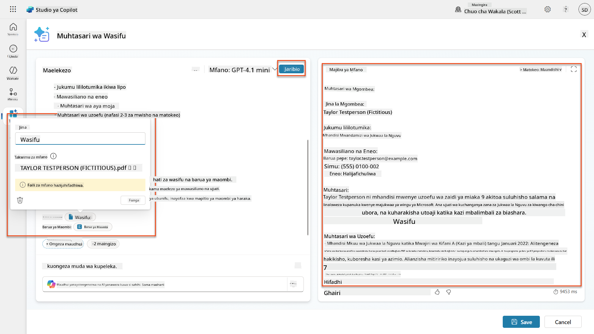

### 7.2 Sanidi matokeo ya JSON

Sasa utabadilisha maelekezo kutoa data iliyopangwa ya JSON badala ya maandishi ya kawaida.

1. Ongeza maelezo haya ya muundo wa JSON mwishoni mwa maelekezo yako:

    ```text
    Output Format:
    Provide the output in valid JSON format with the following structure:
    
    {
        "CandidateName": "string",
        "Email": "string",
        "Summary": "string max 2000 characters",
        "Skills": [ {"item": "Skill 1"}, {"item": "Skill 2"}],
        "Experience": [ {"item": "Experience 1"}, {"item": "Experience 2"}],
    }
    ```

1. Badilisha mpangilio wa **Matokeo** kutoka "Maandishi" hadi **JSON**.

1. Chagua **Jaribu** tena ili kuthibitisha kuwa matokeo sasa yamepangwa kama JSON.  
    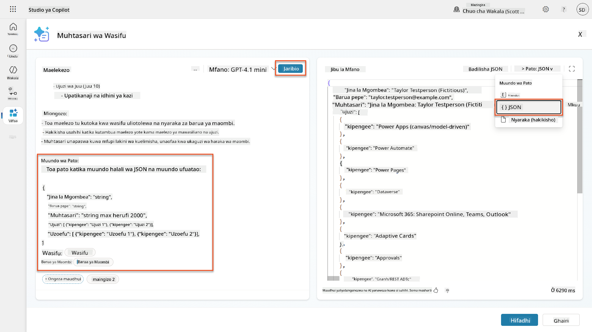

1. **Hiari:** Jaribu mifano tofauti ya AI kuona jinsi matokeo yanavyotofautiana, kisha rudi kwenye mfano chaguo-msingi.

1. Chagua **Hifadhi** kuunda maelekezo.

1. Katika mazungumzo ya **Sanidi kwa matumizi katika Wakala**, chagua **Ghairi**.

    !!! info "Kwa nini hatuongezi hii kama kifaa bado"
        Utatumia maelekezo haya katika Mtiririko wa Wakala badala ya moja kwa moja kama kifaa, ambacho kitakupa udhibiti zaidi juu ya mtiririko wa uchakataji wa data.

### 7.3 Ongeza maelekezo kwenye Mtiririko wa Wakala

Utaunda Mtiririko wa Wakala unaotumia maelekezo yako kuchakata wasifu uliowekwa kwenye Dataverse.

!!! tip "Maneno ya Mtiririko wa Wakala"
    Ni muhimu sana kufuata maelekezo ya kutaja nodi zako na kuingiza maneno kwa usahihi kwa sababu maneno yanarejelea nodi za awali kwa kutumia jina lao! Rejelea [kazi ya Mtiririko wa Wakala katika Kuajiri](../../recruit/09-add-an-agent-flow/README.md#you-mentioned-expressions-what-are-expressions) kwa muhtasari wa haraka!

1. Nenda kwa **Wakala wa Kuajiri** wako ndani ya Copilot Studio

1. Chagua kichupo cha **Mawakala**, na uchague mtoto **Wakala wa Kupokea Maombi**

1. Ndani ya paneli ya **Vifaa**, Chagua **+ Ongeza** → **+ Kifaa kipya** → **Mtiririko wa Wakala**

1. Chagua nodi ya Wakati wakala anapoitisha mtiririko, tumia **+ Ongeza pembejeo** kuongeza kigezo kifuatacho:

    | Aina | Jina | Maelezo |
    |------|------|-------------|
    | Maandishi | Namba ya Wasifu | Hakikisha kutumia [Namba ya Wasifu]. Hii lazima ianze na herufi R |

1. Chagua ikoni ya **+** ya kuingiza hatua chini ya nodi ya kwanza, tafuta **Dataverse**, chagua **Tazama zaidi**, kisha pata hatua ya **Orodhesha safu**.

1. Chagua **alama ya ellipsis (...)** kwenye nodi ya Orodhesha safu, na chagua **Badilisha jina** kuwa `Pata Rekodi ya Wasifu`, kisha weka vigezo vifuatavyo:

    | Mali | Jinsi ya Kuweka | Thamani |
    |------|-----------------|---------|
    | **Jina la Jedwali** | Chagua | Wasifu |
    | **Chuja safu** | Data ya nguvu (ikoni ya radi) | `ppa_resumenumber eq 'Namba ya Wasifu'` Badilisha **Namba ya Wasifu** na **Wakati wakala anapoitisha mtiririko** → **Namba ya Wasifu** |
    | **Idadi ya safu** | Ingiza | 1 |

    !!! tip "Boresha maswali hayo!"
        Unapotumia mbinu hii katika uzalishaji, unapaswa kila mara kupunguza safu zinazochaguliwa kwa zile tu zinazohitajika na Mtiririko wa Wakala.

    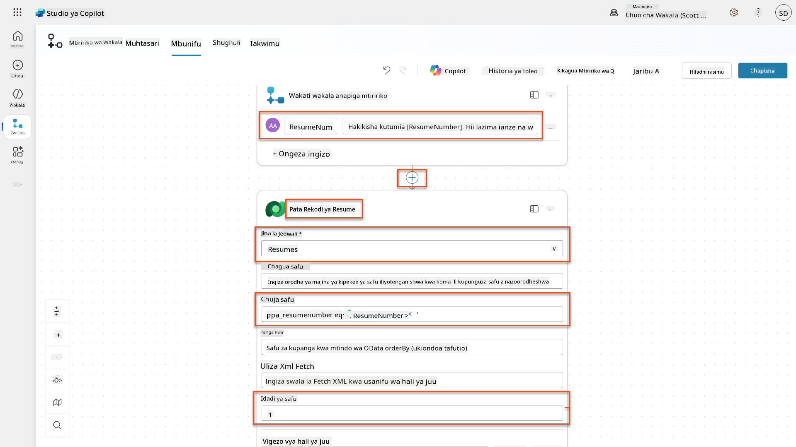

1. Chagua ikoni ya **+** ya kuingiza hatua chini ya nodi ya Pata Rekodi ya Wasifu, tafuta **Dataverse**, chagua **Tazama zaidi**, kisha pata hatua ya **Pakua faili au picha**.

    !!! tip "Chagua hatua sahihi!"
        Hakikisha usichague hatua inayomalizika na "kutoka kwa mazingira yaliyochaguliwa"

1. Kama awali, badilisha jina la hatua kuwa `Pakua Wasifu`, kisha weka vigezo vifuatavyo:

    | Mali | Jinsi ya Kuweka | Thamani |
    |------|-----------------|---------|
    | **Jina la Jedwali** | Chagua | Wasifu |
    | **ID ya Safu** | Maneno (ikoni ya fx) | `first(body('Pata_Rekodi_
| **Swali** | Chagua | Muhtasari wa Wasifu |
| **Barua ya Maombi** | Maelezo (alama ya fx) | `first(body('Get_Resume_Record')?['value'])?['ppa_coverletter']` |
| **Wasifu** | Data ya nguvu (alama ya radi) | Pakua Wasifu → Faili au maudhui ya picha |

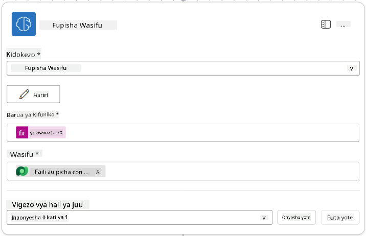

!!! tip "Vigezo vya Swali"
Angalia jinsi vigezo unavyoweka ni sawa na vile ulivyosanidi kama vigezo vya kuingiza ulipounda swali lako.

### 7.4 Unda rekodi ya mgombea

Sasa, unahitaji kuchukua taarifa ambayo Swali limekupa na kuunda rekodi mpya ya mgombea ikiwa haipo tayari.

1. Chagua ikoni ya **+** ya Ingiza kitendo chini ya nodi ya Muhtasari wa Wasifu, tafuta **Dataverse**, chagua **Tazama zaidi**, kisha tafuta kitendo cha **Orodhesha safu**

1. Badilisha jina la nodi kuwa `Pata Mgombea Aliyepo`, kisha weka vigezo vifuatavyo:

| Mali | Jinsi ya Kuweka | Thamani |
|------|-----------------|---------|
| **Jina la Jedwali** | Chagua | Wagombea |
| **Chuja safu** | Data ya nguvu (alama ya radi) | `ppa_email eq 'Email'`  **Badilisha** `Email` na **Muhtasari wa Wasifu → Email** |
| **Idadi ya safu** | Weka | 1 |

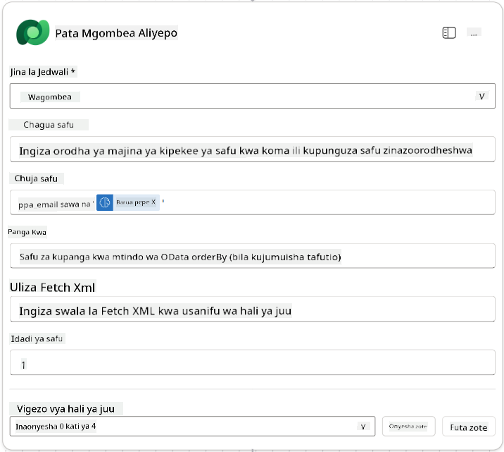

1. Chagua ikoni ya **+** ya Ingiza kitendo chini ya nodi ya Pata Mgombea Aliyepo, tafuta **Udhibiti**, chagua **Tazama zaidi**, kisha tafuta kitendo cha **Hali**

1. Katika mali za hali, weka hali ifuatayo:

| Hali | Opereta | Thamani |
|------|---------|---------|
| Maelezo (alama ya fx): `length(outputs('Get_Existing_Candidate')?['body/value'])` | ni sawa na | 0 |

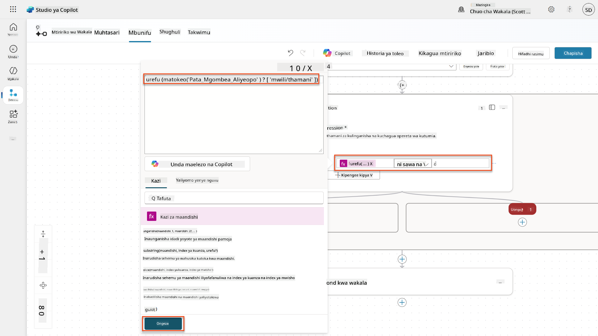

1. Chagua ikoni ya **+** ya Ingiza kitendo katika tawi la **Kweli**, tafuta **Dataverse**, chagua **Tazama zaidi**, kisha tafuta kitendo cha **Ongeza safu mpya**.

1. Badilisha jina la nodi kuwa `Ongeza Mgombea Mpya`, kisha weka vigezo vifuatavyo:

| Mali | Jinsi ya Kuweka | Thamani |
|------|-----------------|---------|
| **Jina la Jedwali** | Chagua | Wagombea |
| **Jina la Mgombea** | Data ya nguvu (alama ya radi) | Muhtasari wa Wasifu → `CandidateName` |
| **Email** | Data ya nguvu (alama ya radi) | Muhtasari wa Wasifu → `Email` |

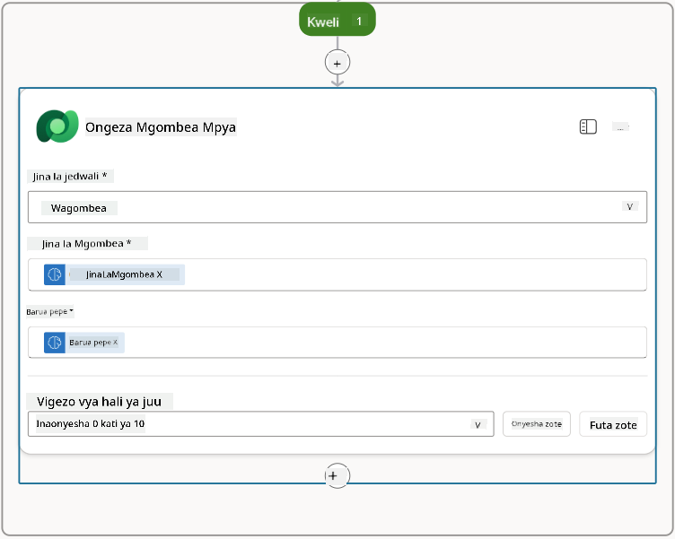

### 7.5 Sasisha wasifu na sanidi matokeo ya mtiririko

Kamilisha mtiririko kwa kusasisha rekodi ya wasifu na kusanidi data ya kurudisha kwa wakala wako.

1. Chagua ikoni ya **+** ya Ingiza kitendo chini ya hali, tafuta **Dataverse**, chagua **Tazama zaidi**, kisha tafuta kitendo cha **Sasisha safu**

1. Chagua kichwa kubadilisha jina la nodi kuwa `Sasisha Wasifu`, chagua **Onyesha yote**, kisha weka vigezo vifuatavyo:

| Mali | Jinsi ya Kuweka | Thamani |
|------|-----------------|---------|
| **Jina la Jedwali** | Chagua | Wasifu |
| **ID ya Safu** | Maelezo (alama ya fx) | `first(body('Get_Resume_Record')?['value'])?['ppa_resumeid']` |
| **Muhtasari** | Data ya nguvu (alama ya radi) | Muhtasari wa Wasifu → Maandishi |
| **Mgombea (Wagombea)** | Maelezo (alama ya fx) | `if(equals(length(outputs('Get_Existing_Candidate')?['body/value']), 1), first(outputs('Get_Existing_Candidate')?['body/value'])?['ppa_candidateid'], outputs('Add_a_New_Candidate')?['body/ppa_candidateid'])` |

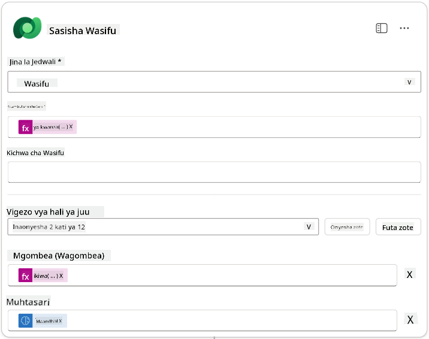

1. Chagua nodi ya **Jibu kwa wakala** kisha tumia **+ Ongeza matokeo** kusanidi:

| Aina | Jina              | Jinsi ya Kuweka                      | Thamani                                                        | Maelezo                                            |
| ---- | ----------------- | ------------------------------------- | -------------------------------------------------------------- | ------------------------------------------------- |
| Maandishi | `CandidateName`   | Data ya nguvu (alama ya radi) | Muhtasari wa Wasifu → Tazama zaidi → CandidateName              | [CandidateName] iliyotolewa kwenye Wasifu         |
| Maandishi | `CandidateEmail`  | Data ya nguvu (alama ya radi) | Muhtasari wa Wasifu → Tazama zaidi → Email                      | [CandidateEmail] iliyotolewa kwenye Wasifu        |
| Maandishi | `CandidateNumber` | Maelezo (alama ya fx)            | `concat('ppa_candidates/', if(equals(length(outputs('Get_Existing_Candidate')?['body/value']), 1), first(outputs('Get_Existing_Candidate')?['body/value'])?['ppa_candidateid'], outputs('Add_a_New_Candidate')?['body/ppa_candidateid']) )` | [CandidateNumber] wa mgombea mpya au aliyepo      |
| Maandishi | `ResumeSummary`   | Data ya nguvu (alama ya radi) | Muhtasari wa Wasifu → Tazama zaidi → body/responsev2/predictionOutput/structuredOutput | Muhtasari wa wasifu na maelezo katika mfumo wa JSON |

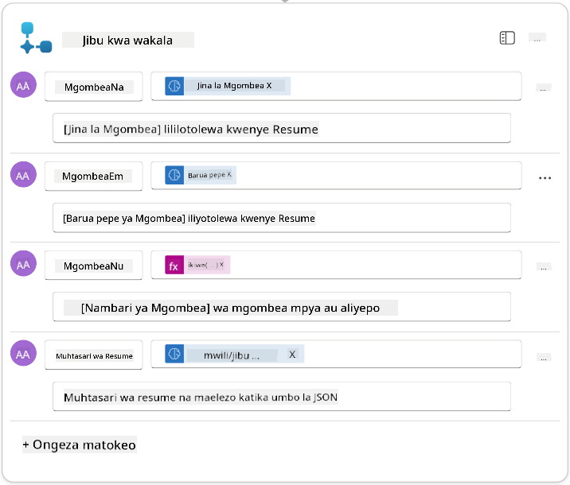

1. Chagua **Hifadhi rasimu** juu kulia. Mtiririko wa Wakala wako unapaswa kuonekana kama ifuatavyo  
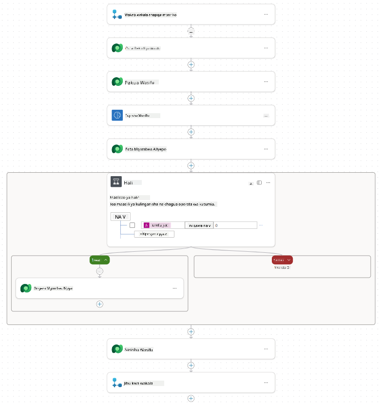

1. Chagua kichupo cha **Muhtasari**, Chagua **Hariri** kwenye paneli ya **Maelezo**

    1. **Jina la Mtiririko**:`Muhtasari wa Wasifu`
    1. **Maelezo**:

        ```text
        Summarize an existing Resume stored in Dataverse using a [ResumeNumber] as input, return the [CandidateNumber], and resume summary JSON
        ```

1. Chagua **Hifadhi**

1. Chagua tena kichupo cha **Mchoro**, na chagua **Chapisha**.

### 7.6 Unganisha mtiririko na wakala wako

Sasa utaongeza mtiririko kama zana na kusanidi wakala wako kuitumia.

1. Fungua **Wakala wa Kuajiri** ndani ya Copilot Studio

1. Chagua kichupo cha **Wakala**, na fungua **Wakala wa Maombi ya Kuajiri**

1. Chagua paneli ya **Zana**, na Chagua **+ Ongeza zana** - > **Mtiririko** -> **Muhtasari wa Wasifu** **(Mtiririko wa Wakala)**

1. Chagua **Ongeza na sanidi**

1. Sanidi mipangilio ya zana kama ifuatavyo:

| Mpangilio | Thamani |
|-----------|---------|
| **Maelezo** | Fanya muhtasari wa Wasifu uliopo uliowekwa kwenye Dataverse ukitumia [ResumeNumber] kama ingizo, rudisha [CandidateNumber], na muhtasari wa wasifu katika JSON |
| **Wakati zana hii inaweza kutumika** | Ni wakati tu inarejelewa na mada au mawakala |

1. Chagua **Hifadhi**  
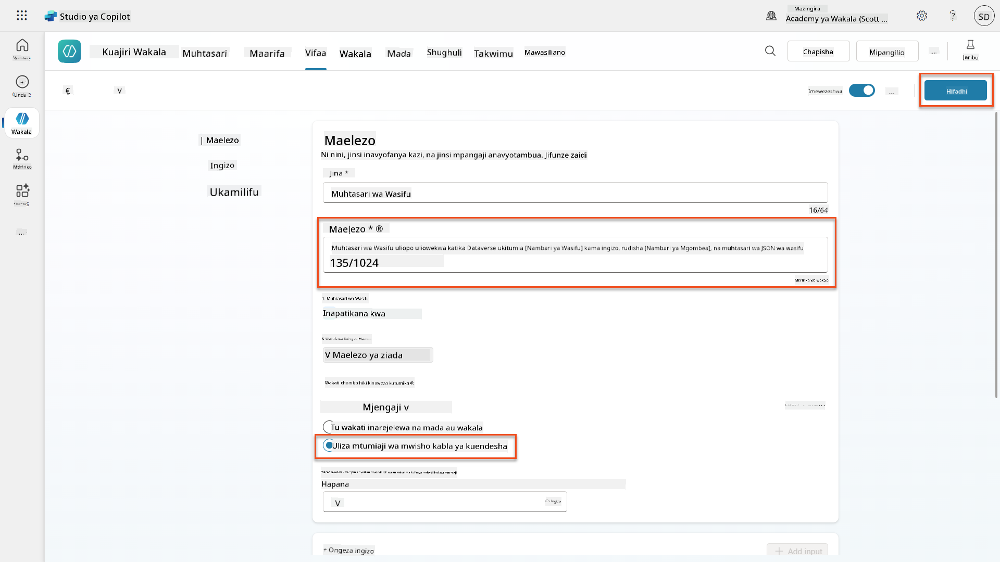

1. Ukichagua Zana ndani ya Wakala wa Kuajiri, sasa utaona zana zetu zote mbili zikionyesha kuwa zinatumika na **Wakala wa Maombi ya Kuajiri**.  
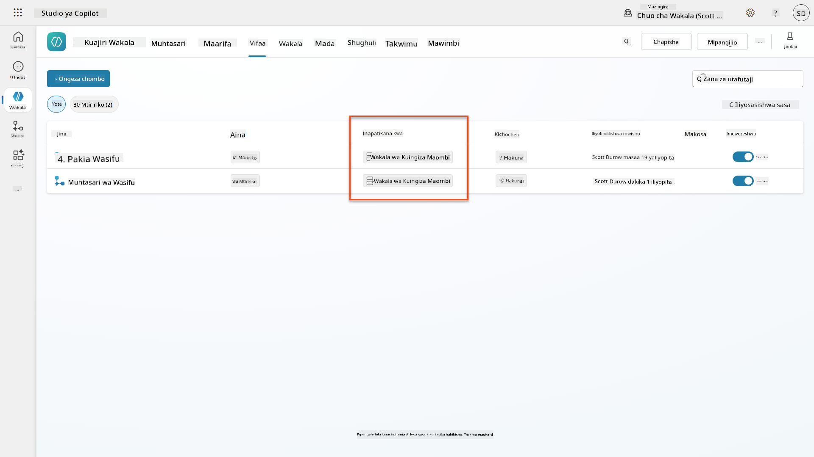

1. Nenda kwenye maelekezo ya wakala wa **Mtoto wa Maombi ya Kuajiri**, na badilisha hatua ya **Baada ya Kupakia** kuwa ifuatayo:

    ```text
    2. Post-Upload Processing  
        - After uploading, be sure to also output the [ResumeNumber] in all messages
        - Pass [ResumeNumber] to /Summarize Resume  - Be sure to use the correct value that will start with the letter R.
        - Be sure to also output the [CandidateNumber] in all messages
        - Use the [ResumeSummary] to output a summary of the processed Resume and candidate
    ```

Badilisha `/Muhtasari wa Wasifu` kwa kuingiza rejeleo la mtiririko wa wakala wa **Muhtasari wa Wasifu** kwa kuandika alama ya mbele (`/)` au kuchagua `/Muhtasari` kuingiza rejeleo.  
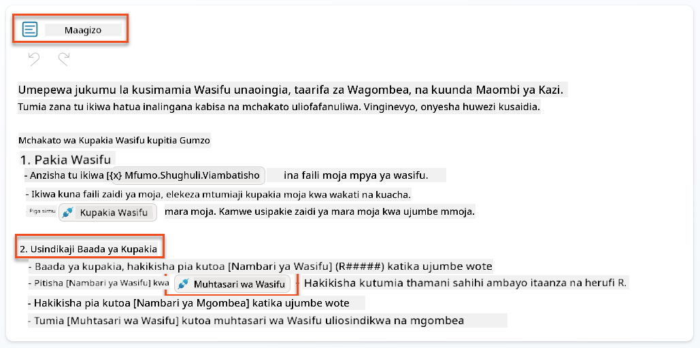

1. Chagua **Hifadhi**.

### 7.7 Jaribu wakala wako

Jaribu mfumo wako wa multimodal kamili ili kuhakikisha kila kitu kinafanya kazi vizuri.

1. **Anza majaribio**:

    - Chagua **Jaribu** kufungua paneli ya majaribio
    - Andika: `Hapa kuna Wasifu wa mgombea`

    - Pakia moja ya wasifu wa sampuli kutoka [Wasifu wa Majaribio](https://download-directory.github.io/?url=https://github.com/microsoft/agent-academy/tree/main/operative/sample-data/resumes&filename=operative_sampledata)

1. **Thibitisha matokeo**:
    - Mara tu unapotoa ujumbe na wasifu, hakikisha unapokea Nambari ya Wasifu (muundo: R#####)
    - Thibitisha unapata Nambari ya Mgombea na muhtasari
    - Tumia ramani ya shughuli kuona zana ya kupakia Wasifu na zana ya Muhtasari wa Wasifu ikifanya kazi, na matokeo ya Swali la Muhtasari yanapokelewa na wakala:  
        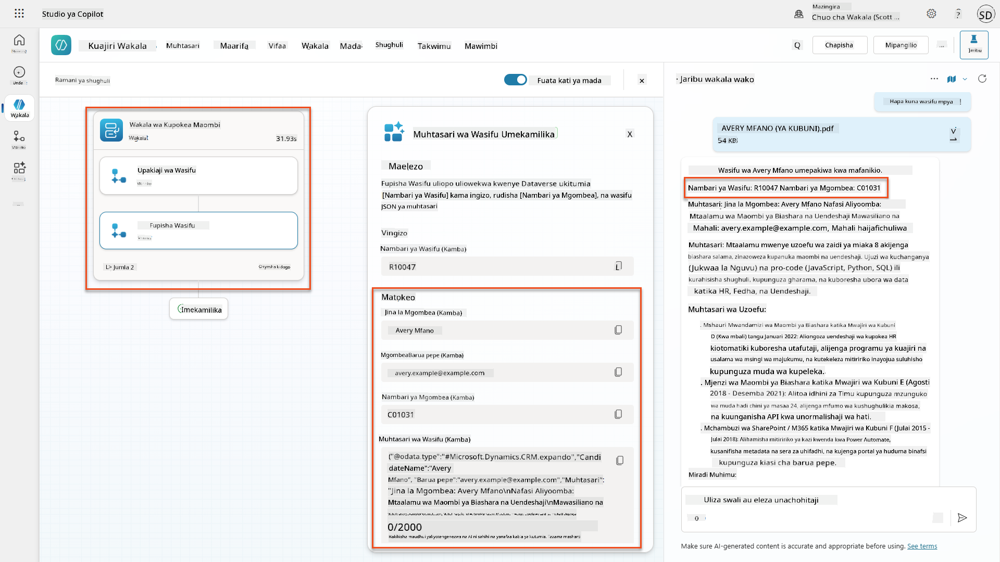

1. **Angalia uhifadhi wa data**:
    - Nenda kwenye [Power Apps](https://make.powerapps.com)
    - Fungua **Apps** → **Hiring Hub** → **Cheza**
    - Nenda kwenye **Wasifu** kuthibitisha wasifu ulipakiwa na kusindika. Unapaswa kuwa na taarifa ya muhtasari na rekodi ya mgombea inayohusiana.
    - Angalia **Wagombea** kuona taarifa ya mgombea iliyotolewa  
        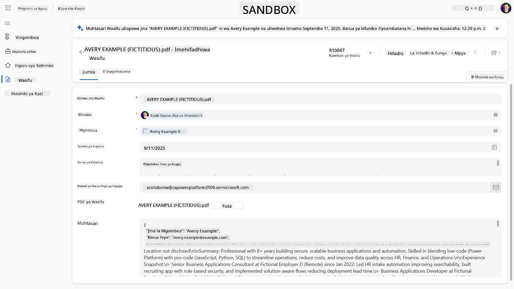
    - Unapokimbia mchakato tena, unapaswa kutumia Mgombea aliyepo (aliyeunganishwa na barua pepe iliyotolewa kutoka kwa wasifu) badala ya kuunda mpya.

!!! tip "Utatuzi wa matatizo"
    - **Wasifu haujasindika**: Hakikisha faili ni PDF na iko chini ya mipaka ya ukubwa
    - **Hakuna mgombea aliyeundwa**: Angalia kwamba barua pepe ilitolewa kwa usahihi kutoka kwa wasifu
    - **Makosa ya muundo wa JSON**: Thibitisha maelekezo ya swali lako yanajumuisha muundo halisi wa JSON
    - **Makosa ya mtiririko**: Angalia kwamba miunganisho yote ya Dataverse na maelezo yamesanidiwa kwa usahihi

### Utayari wa uzalishaji

Ingawa si sehemu ya misheni hii, ili kufanya mtiririko wa wakala huu uwe tayari kwa uzalishaji unaweza pia kuzingatia yafuatayo:

1. **Ushughulikiaji wa makosa** - Ikiwa Nambari ya Wasifu haikupatikana, au swali limeshindwa kuchambua hati, usimamizi wa makosa unapaswa kuongezwa ili kurudisha kosa wazi kwa wakala.
1. **Kusasisha Wagombea waliopo** - Mgombea anapatikana kwa kutumia barua pepe, basi jina linaweza kusasishwa kulingana na lililo kwenye wasifu.
1. **Kugawanya muhtasari wa Wasifu na uundaji wa Mgombea** - Utendaji huu unaweza kugawanywa katika mtiririko mdogo wa wakala ili kuufanya uwe rahisi kudumisha, kisha wakala apewe maelekezo ya kuutumia kwa zamu.

## 🎉 Misheni Imekamilika

Kazi nzuri, Operative! **Uchambuzi wa Nyaraka za Wasifu** sasa umekamilika. Umefanikiwa kumiliki maswali ya multimodal na sasa unaweza kutoa data iliyopangwa kutoka kwa hati yoyote kwa usahihi.

Haya ndiyo uliyoyakamilisha katika misheni hii:

**✅ Ustadi wa maswali ya multimodal**  
Sasa unaelewa maswali ya multimodal ni nini na wakati wa kutumia mifano tofauti ya AI kwa matokeo bora.

**✅ Utaalamu wa usindikaji wa nyaraka**  
Umejifunza kusanidi maswali na pembejeo za picha na nyaraka, na kuunda matokeo kama JSON kwa uchimbaji wa data iliyopangwa.

**✅ Mfumo wa uchimbaji wa wasifu**  
Umeunda mfumo kamili wa uchimbaji wa wasifu unaosindika nyaraka za mgombea na kuunganishwa na mtiririko wa kazi wa kuajiri.

**✅ Utekelezaji wa mbinu bora**  
Umetumia mbinu bora za uhandisi wa maswali na uchambuzi wa nyaraka na kuunganisha maswali ya multimodal na Mtiririko wa Wakala.

**✅ Msingi wa usindikaji wa hali ya juu**  
Uwezo wako wa kuboresha uchambuzi wa nyaraka sasa uko tayari kwa vipengele vya msingi vya data vya hali ya juu tutakavyoongeza katika misheni ijayo.

🚀 **Kinachofuata:** Katika Misheni ya 08, utagundua jinsi ya kuboresha maswali yako kwa data ya wakati halisi kutoka Dataverse, na kuunda suluhisho za AI zinazobadilika kulingana na mahitaji ya biashara yanayobadilika.

⏩ [Nenda kwenye Misheni ya 08: Maswali yaliyoboreshwa na msingi wa Dataverse](../08-dataverse-grounding/README.md)

## 📚 Rasilimali za Kimbinu

📖 [Unda swali](https://learn.microsoft.com/ai-builder/create-a-custom-prompt?WT.mc_id=power-power-182762-scottdurow)

📖 [Ongeza maandishi, picha, au pembejeo ya nyaraka kwenye swali lako](https://learn.microsoft.com/ai-builder/add-inputs-prompt?WT.mc_id=power-182762-scottdurow)

📖 [Sindika majibu na matokeo ya JSON](https://learn.microsoft.com/ai-builder/process-responses-json-output?WT.mc_id=power-182762-scottdurow)

📖 [Uchaguzi wa mfano na mipangilio ya joto](https://learn.microsoft.com/ai-builder/prompt-modelsettings?WT.mc_id=power-182762-scottdurow)

📖 [Tumia swali lako katika Power Automate](https://learn.microsoft.com/ai-builder/use-a-custom-prompt-in-flow?WT.mc_id=power-182762-scottdurow)

📺 [AI Builder: Matokeo ya JSON katika mjenzi wa swali](https://www.youtube.com/watch?v=F0fGnWrRY_I)

---

**Kanusho**:  
Hati hii imetafsiriwa kwa kutumia huduma ya tafsiri ya AI [Co-op Translator](https://github.com/Azure/co-op-translator). Ingawa tunajitahidi kwa usahihi, tafadhali fahamu kuwa tafsiri za kiotomatiki zinaweza kuwa na makosa au kutokuwa sahihi. Hati ya asili katika lugha yake ya asili inapaswa kuzingatiwa kama chanzo cha mamlaka. Kwa taarifa muhimu, tafsiri ya kitaalamu ya binadamu inapendekezwa. Hatutawajibika kwa kutoelewana au tafsiri zisizo sahihi zinazotokana na matumizi ya tafsiri hii.