<!--
CO_OP_TRANSLATOR_METADATA:
{
  "original_hash": "750f3ea8a94930439ebd8a10871b1d73",
  "translation_date": "2025-10-20T00:59:52+00:00",
  "source_file": "docs/operative-preview/08-dataverse-grounding/README.md",
  "language_code": "sw"
}
-->
# 🚨 Dhamira 08: Maelezo yaliyoboreshwa kwa msingi wa Dataverse

--8<-- "disclaimer.md"

## 🕵️‍♂️ JINA LA KODI: `OPERESHENI UDHIBITI WA MSINGI`

> **⏱️ Muda wa Operesheni:** `~dakika 60`

## 🎯 Maelezo ya Dhamira

Karibu tena, Opereta. Mfumo wako wa kuajiri mawakala wengi unafanya kazi, lakini kuna uboreshaji muhimu unaohitajika kwa **msingi wa data** - mifumo yako ya AI inahitaji ufikiaji wa wakati halisi wa data iliyopangwa ya shirika lako ili kufanya maamuzi ya busara.

Kwa sasa, maelezo yako ya Muhtasari wa Wasifu yanafanya kazi kwa maarifa ya kudumu. Lakini vipi kama ingeweza kufikia hifadhidata ya nafasi za kazi kwa wakati halisi ili kutoa mechi sahihi na za kisasa? Vipi kama ingeweza kuelewa vigezo vyako vya tathmini bila wewe kuviweka moja kwa moja?

Katika dhamira hii, utaimarisha maelezo yako maalum kwa **msingi wa Dataverse** - kuunganisha maelezo yako moja kwa moja na vyanzo vya data vya moja kwa moja. Hii inabadilisha mawakala wako kutoka kwa wajibu wa kudumu hadi mifumo inayotegemea data inayoweza kubadilika kulingana na mahitaji ya biashara yanayobadilika.

Dhamira yako: jumuisha data ya wakati halisi ya nafasi za kazi na vigezo vya tathmini katika mtiririko wa uchambuzi wa wasifu, na kuunda mfumo unaojiboresha wenyewe unaoendana na mahitaji ya kuajiri ya shirika lako.

## 🔎 Malengo

Katika dhamira hii, utajifunza:

1. Jinsi **msingi wa Dataverse** unavyoboreshwa maelezo maalum
1. Wakati wa kutumia msingi wa data dhidi ya maelekezo ya kudumu
1. Kubuni maelezo yanayojumuisha data ya moja kwa moja kwa njia ya kipekee
1. Kuimarisha mtiririko wa Muhtasari wa Wasifu kwa mechi za nafasi za kazi

## 🧠 Kuelewa msingi wa Dataverse kwa maelezo

**Msingi wa Dataverse** unaruhusu maelezo yako maalum kufikia data ya moja kwa moja kutoka kwa meza za Dataverse wakati wa kushughulikia maombi. Badala ya maelekezo ya kudumu, maelezo yako yanaweza kujumuisha taarifa za wakati halisi ili kufanya maamuzi ya busara.

### Kwa nini msingi wa Dataverse ni muhimu

Maelezo ya jadi hufanya kazi na maelekezo ya kudumu:

```text
Match this candidate to these job roles: Developer, Manager, Analyst
```

Kwa msingi wa Dataverse, maelezo yako yanapata data ya sasa:

```text
Match this candidate to available job roles from the Job Roles table, 
considering current evaluation criteria and requirements
```

Njia hii inatoa faida kadhaa muhimu:

- **Mabadiliko ya wakati halisi:** Nafasi za kazi na vigezo hubadilika bila mabadiliko ya maelezo
- **Uthabiti:** Mawakala wote hutumia vyanzo vya data vya sasa
- **Uwezo wa kupanuka:** Nafasi mpya na vigezo vinapatikana moja kwa moja
- **Usahihi:** Data ya wakati halisi inahakikisha maamuzi yanazingatia mahitaji ya sasa

### Jinsi msingi wa Dataverse unavyofanya kazi

Unapowezesha msingi wa Dataverse kwa maelezo maalum:

1. **Uchaguzi wa data:** Chagua meza na safu maalum za Dataverse za kujumuisha. Unaweza pia kuchagua meza zinazohusiana ambazo mfumo utachuja kulingana na rekodi za mzazi zilizopatikana.
1. **Kuingiza muktadha:** Maelezo hujumuisha data iliyopatikana moja kwa moja katika muktadha wa maelezo
1. **Uchujaji wa akili:** Mfumo hujumuisha tu data inayohusiana na ombi la sasa ikiwa utatoa uchujaji wowote.
1. **Matokeo yaliyopangwa:** Maelezo yako yanaweza kurejelea data iliyopatikana na kufikiria kuhusu rekodi zilizopatikana ili kuunda matokeo.

### Kutoka kwa kudumu hadi kubadilika: Faida za msingi

Hebu tuangalie mtiririko wako wa sasa wa Muhtasari wa Wasifu kutoka Dhamira 07 na tuone jinsi msingi wa Dataverse unavyoubadilisha kutoka kwa akili ya kudumu hadi ya kubadilika.

**Njia ya sasa ya kudumu:**
Maelezo yako ya sasa yalijumuisha vigezo vya tathmini vilivyowekwa moja kwa moja na mantiki ya mechi iliyopangwa mapema. Njia hii inafanya kazi lakini inahitaji masasisho ya mwongozo kila unapoongeza nafasi mpya za kazi, kubadilisha vigezo vya tathmini, au kubadilisha vipaumbele vya kampuni.

**Mabadiliko ya msingi wa Dataverse:**
Kwa kuongeza msingi wa Dataverse, mtiririko wako wa Muhtasari wa Wasifu utaweza:

- **Kupata nafasi za kazi za sasa** kutoka kwa meza yako ya Nafasi za Kazi
- **Kutumia vigezo vya tathmini vya moja kwa moja** badala ya maelezo ya kudumu  
- **Kutoa mechi sahihi** kulingana na mahitaji ya wakati halisi

## 🎯 Kwa nini maelezo maalum dhidi ya mazungumzo ya mawakala

Katika Dhamira 02, uliona jinsi Mawakala wa Mahojiano walivyoweza kulinganisha wagombea na nafasi za kazi, lakini walihitaji maelezo magumu ya mtumiaji kama:

```text
Upload this resume, then show me open job roles,
each with a description of the evaluation criteria, 
then use this to match the resume to at least one suitable
job role even if not a perfect match.
```

Ingawa hii ilifanya kazi, maelezo maalum yenye msingi wa Dataverse yanatoa faida kubwa kwa kazi maalum:

### Faida kuu za maelezo maalum

| Kipengele | Mazungumzo ya Mawakala | Maelezo Maalum |
|-----------|------------------------|----------------|
| **Uthabiti** | Matokeo yanatofautiana kulingana na ujuzi wa mtumiaji wa kuunda maelezo | Usindikaji uliowekwa kila wakati |
| **Utaalamu** | Ufikiri wa jumla unaweza kukosa nuances za biashara | Imeundwa kwa mantiki ya biashara iliyoboreshwa |
| **Uendeshaji wa kiotomatiki** | Inahitaji mwingiliano wa binadamu na tafsiri | Inachochewa kiotomatiki na matokeo ya JSON yaliyopangwa |

## 🧪 Maabara 8: Ongeza msingi wa Dataverse kwa maelezo

Ni wakati wa kuboresha uwezo wako wa uchambuzi wa wasifu! Utaimarisha mtiririko wa sasa wa Muhtasari wa Wasifu kwa mechi za nafasi za kazi za moja kwa moja.

### Mahitaji ya kukamilisha dhamira hii

1. Utahitaji **ama**:

    - **Kukamilisha Dhamira 07** na kuwa na mfumo wako wa uchambuzi wa wasifu tayari, **AU**
    - **Kuleta suluhisho la kuanzia la Dhamira 08** ikiwa unaanza upya au unahitaji kufuatilia. [Pakua Suluhisho la Kuanzia la Dhamira 08](https://aka.ms/agent-academy)

1. Nyaraka za sampuli za wasifu kutoka [Wasifu wa majaribio](https://download-directory.github.io/?url=https://github.com/microsoft/agent-academy/tree/main/operative/sample-data/resumes&filename=operative_sampledata)

!!! note "Uingizaji wa Suluhisho na Data ya Sampuli"
    Ikiwa unatumia suluhisho la kuanzia, rejelea [Dhamira 01](../01-get-started/README.md) kwa maelezo ya kina kuhusu jinsi ya kuingiza suluhisho na data ya sampuli katika mazingira yako.

### 8.1 Ongeza msingi wa Dataverse kwa maelezo yako

Utaendelea na maelezo ya Muhtasari wa Wasifu ambayo uliunda katika Dhamira 07. Kwa sasa yanatoa muhtasari wa wasifu tu, lakini sasa utayajumuisha na nafasi za kazi kama zinavyokuwepo kwa sasa katika Dataverse, na kuyafanya yawe ya kisasa kila wakati.

Kwanza, hebu tuangalie meza za Dataverse ambazo utazijumuisha:

1. **Tembelea** [Power Apps](https://make.powerapps.com) na uchague mazingira yako kwa kutumia **Kibadilisha Mazingira** kwenye kona ya juu kulia ya upau wa urambazaji.

1. Chagua **Meza** na pata meza ya **Nafasi za Kazi**

1. Kagua safu kuu ambazo utatumia kwa msingi:

    | Safu | Kusudi |
    |------|--------|
    | **Nambari ya Nafasi ya Kazi** | Kitambulisho cha kipekee kwa mechi za nafasi |
    | **Kichwa cha Kazi** | Jina la kuonyesha kwa nafasi |
    | **Maelezo** | Mahitaji ya kina ya nafasi |

1. Vivyo hivyo, kagua meza nyingine kama meza ya **Vigezo vya Tathmini**.

### 8.2 Ongeza data ya msingi wa Dataverse kwa maelezo yako

1. **Tembelea** Copilot Studio, na uchague mazingira yako kwa kutumia **Kibadilisha Mazingira** kwenye kona ya juu kulia ya upau wa urambazaji.

1. Chagua **Vifaa** kutoka urambazaji wa kushoto.

1. Chagua **Maelezo** na pata maelezo yako ya **Muhtasari wa Wasifu** kutoka Dhamira 07.  
    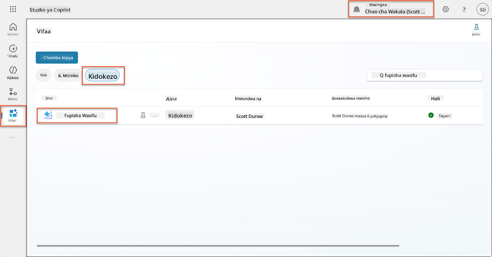

1. Chagua **Hariri** ili kubadilisha maelezo, na ubadilishe na toleo lililoboreshwa hapa chini:

    !!! important
        Hakikisha vigezo vya Wasifu na Barua ya Maombi vinabaki bila kubadilika kama vigezo.

    ```text
    You are tasked with extracting key candidate information from a resume and cover letter to facilitate matching with open job roles and creating a summary for application review.
    
    ### Instructions:
    1. **Extract Candidate Details:**
       - Identify and extract the candidate's full name.
       - Extract contact information, specifically the email address.
    
    2. **Analyze Resume and Cover Letter:**
       - Review the resume content to identify relevant skills, experience, and qualifications.
       - Review the cover letter to understand the candidate's motivation and suitability for the roles.
    
    3. **Match Against Open Job Roles:**
       - Compare the extracted candidate information with the requirements and descriptions of the provided open job roles.
       - Use the job descriptions to assess potential fit.
       - Identify all roles that align with the candidate's cover letter and profile. You don't need to assess perfect suitability.
       - Provide reasoning for each match based on the specific job requirements.
    
    4. **Create Candidate Summary:**
       - Summarize the candidate's profile as multiline text with the following sections:
          - Candidate name
          - Role(s) applied for if present
          - Contact and location
          - One-paragraph summary
          - Top skills (8–10)
          - Experience snapshot (last 2–3 roles with outcomes)
          - Key projects (1–3 with metrics)
          - Education and certifications
          - Availability and work authorization
    
    ### Output Format
    
    Provide the output in valid JSON format with the following structure:
    
    {
      "CandidateName": "string",
      "Email": "string",
      "MatchedRoles": [
        {
          "JobRoleNumber": "ppa_jobrolenumber from grounded data",
          "RoleName": "ppa_jobtitle from grounded data",
          "Reasoning": "Detailed explanation based on job requirements"
        }
      ],
      "Summary": "string"
    }
    
    ### Guidelines
    
    - Extract information only from the provided resume and cover letter documents.
    - Ensure accuracy in identifying contact details.
    - Use the available job role data for matching decisions.
    - The summary should be concise but informative, suitable for quick application review.
    - If no suitable matches are found, indicate an empty list for MatchedRoles and explain briefly in the summary.
    
    ### Input Data
    Open Job Roles (ppa_jobrolenumber, ppa_jobtitle): /Job Role 
    Resume: {Resume}
    Cover Letter: {CoverLetter}
    ```

1. Katika mhariri wa maelezo, badilisha `/Nafasi ya Kazi` kwa kuchagua **+ Ongeza maudhui**, ukichagua **Dataverse** → **Nafasi ya Kazi** na uchague safu zifuatazo, kisha uchague **Ongeza**:

    1. **Nambari ya Nafasi ya Kazi**

    1. **Kichwa cha Kazi**

    1. **Maelezo**

    !!! tip
        Unaweza kuandika jina la meza kutafuta.

1. Katika dialog ya **Nafasi ya Kazi**, chagua sifa ya **Kichujio**, chagua **Hali**, kisha andika **Hai** kama thamani ya **Kichujio**.  
    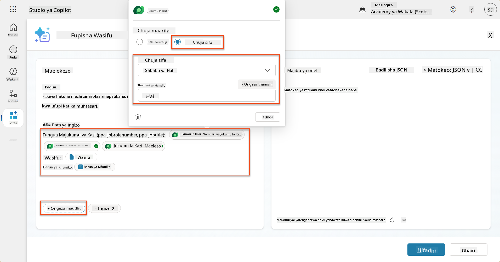

    !!! tip
        Unaweza kutumia **Ongeza thamani** hapa kuongeza kipengele cha pembejeo pia - kwa mfano ikiwa ulikuwa na maelezo ya kujumlisha rekodi iliyopo, ungeweza kutoa Nambari ya Wasifu kama kipengele cha kuchuja.

1. Kisha, utaongeza meza inayohusiana ya Dataverse **Vigezo vya Tathmini**, kwa kuchagua tena **+ Ongeza maudhui**, ukipata **Nafasi za Kazi**, na badala ya kuchagua safu kwenye Nafasi ya Kazi, panua **Nafasi ya Kazi (Vigezo vya Tathmini)** na uchague safu zifuatazo, kisha uchague **Ongeza**:

    1. **Jina la Kigezo**

    1. **Maelezo**  
        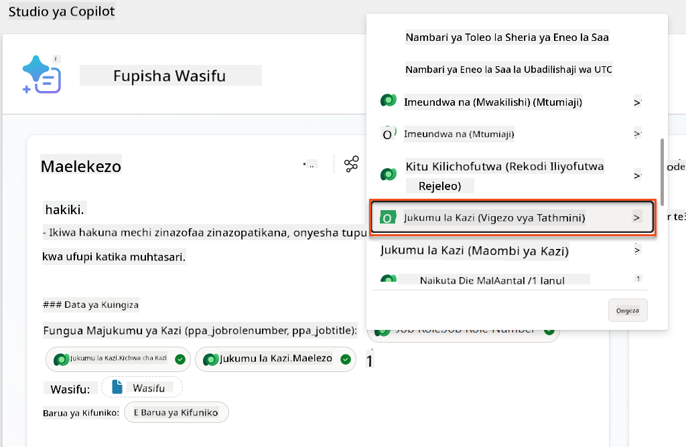

        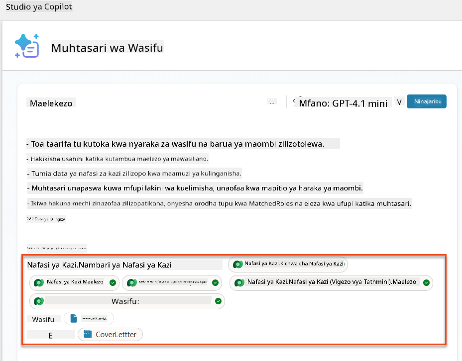

    !!! tip
        Ni muhimu kuchagua Vigezo vya Tathmini vinavyohusiana kwa kwanza kuchagua Nafasi ya Kazi, kisha kuvinjari kwenye menyu hadi Nafasi ya Kazi (Vigezo vya Tathmini). Hii itahakikisha kwamba rekodi zinazohusiana tu kwa Nafasi ya Kazi zitapakiwa.

1. Chagua **Mipangilio**, na rekebisha **Upatikanaji wa Rekodi** hadi 1000 - hii itaruhusu Nafasi za Kazi na Vigezo vya Tathmini vya juu zaidi kujumuishwa katika maelezo yako.  
    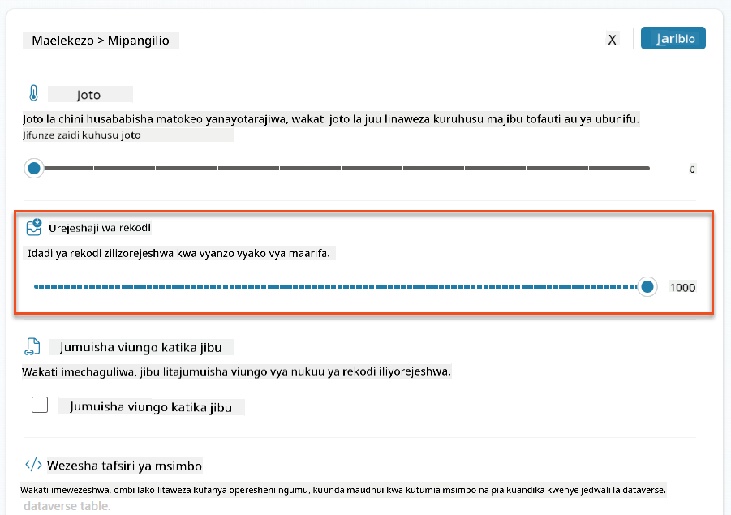

### 8.3 Jaribu maelezo yaliyoboreshwa

1. Chagua kipengele cha **Wasifu**, na pakia wasifu wa sampuli uliotumia katika Dhamira 07.
1. Chagua **Jaribu**.
1. Mara baada ya jaribio kukamilika, angalia kwamba matokeo ya JSON sasa yanajumuisha **Nafasi Zilizolingana**.
1. Chagua kichupo cha **Maarifa yaliyotumika**, ili kuona data ya Dataverse iliyojumuishwa na maelezo yako kabla ya utekelezaji.
1. **Hifadhi** maelezo yako yaliyosasishwa. Mfumo sasa utaongeza kiotomatiki data hii ya Dataverse na maelezo yako wakati mtiririko wa Mawakala wa Muhtasari wa Wasifu uliopo unayaita.  
    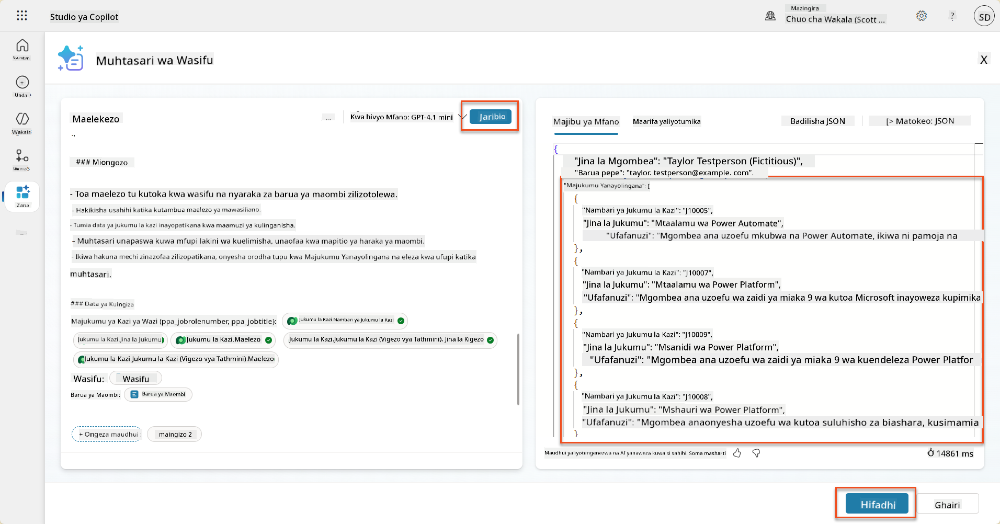

### 8.4 Ongeza Mtiririko wa Mawakala wa Maombi ya Kazi

Ili kuruhusu Mawakala wa Kupokea Maombi kuunda Nafasi za Kazi kulingana na nafasi zilizopendekezwa ambazo mgombea anavutiwa nazo, tunahitaji kuunda Mtiririko wa Mawakala. Mawakala wataita chombo hiki kwa kila nafasi ya kazi iliyopendekezwa ambayo mgombea anavutiwa nayo.

!!! tip "Maneno ya Mtiririko wa Mawakala"
    Ni muhimu sana kufuata maelekezo ya kutaja nodi zako na kuingiza maneno kwa usahihi kwa sababu maneno yanarejelea nodi za awali kwa kutumia jina lao! Rejelea [Dhamira ya Mtiririko wa Mawakala katika Kuajiri](../../recruit/09-add-an-agent-flow/README.md#you-mentioned-expressions-what-are-expressions) kwa muhtasari wa haraka!

1. Ndani ya **Mwakala wa Kuajiri**, chagua kichupo cha **Mawakala**, na fungua mtoto wa wakala wa **Mwakala wa Kupokea Maombi**.

1. Ndani ya paneli ya **Vifaa**, chagua **+ Ongeza** → **+ Chombo kipya** → **Mtiririko wa Mawakala**

1. Chagua nodi ya **Wakati wakala anaita mtiririko**, tumia **+ Ongeza pembejeo** kuongeza kipengele kifuatacho:

    | Aina | Jina            | Maelezo                                                  |
    |------|-----------------|----------------------------------------------------------|
    | Maandishi | `Nambari ya Wasifu`  | Hakikisha kutumia tu [Nambari ya Wasifu] - LAZIMA ianze na herufi R |
    | Maandishi | `Nambari ya Nafasi ya Kazi` | Hakikisha kutumia tu [Nambari ya Nafasi ya Kazi] - LAZIMA ianze na herufi J |

    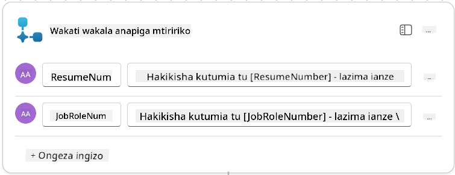

1. Chagua ikoni ya **+** ya kuingiza hatua chini ya nodi ya kwanza, tafuta **Dataverse**, chagua **Tazama zaidi**, kisha pata hatua ya **Orodhesha safu**.

1. **Badilisha jina** la nodi kuwa `Pata Wasifu`, kisha weka vigezo vifuatavyo:

    | Mali            | Jinsi ya Kuweka               | Thamani                                                      |
    |------------------|-------------------------------|--------------------------------------------------------------|
    | **Jina la Meza** | Chagua                        | Wasifu                                                       |
    | **Safu za Kichujio** | Data ya nguvu (ikoni ya radi) | `ppa_resumenumber eq 'Nambari ya Wasifu'` Chagua na badilisha **Nambari ya Wasifu** na **Wakati wakala anaita mtiririko** → **Nambari ya Wasifu** |
    | **Idadi ya safu** | Ingiza                        | 1                                                            |

    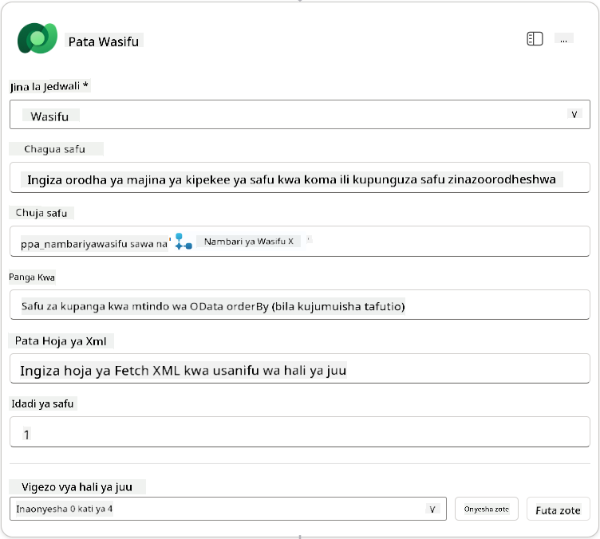

1. Sasa, chagua ikoni ya **+** ya kuingiza hatua chini ya **Pata Wasifu**, tafuta **Dataverse**, chagua **Tazama zaidi**, kisha pata hatua ya **Orodhesha safu**.

1. **Badilisha jina** la nodi kuwa `Pata Nafasi ya Kazi`, kisha weka vigezo vifuatavyo:

    | Mali            | Jinsi ya Kuweka               | Thamani                                                      |
    |------------------|-------------------------------|--------------------------------------------------------------|
    | **Jina la Meza** | Chagua                        | Nafasi za Kazi                                               |
    | **Safu za Kichujio** | Data ya nguvu (ikoni ya radi) | `ppa_jobrolenumber eq 'Nambari ya Nafasi ya Kazi'` Chagua na badilisha **Nambari ya Nafasi ya Kazi** na **Wakati wakala anaita mtiririko** → **Nambari ya Nafasi ya Kazi** |
    | **Idadi ya safu** | Ingiza                        | 1                                                            |

    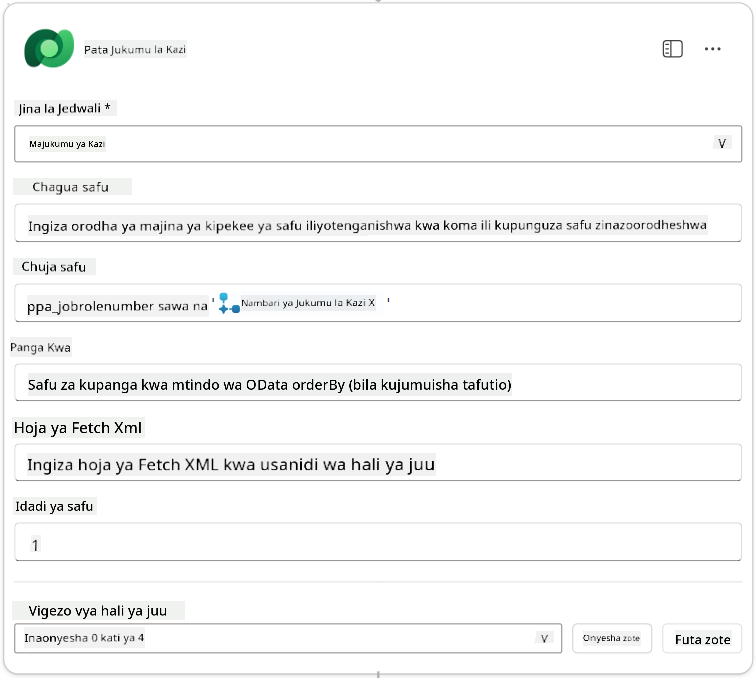

1. Sasa, chagua ikoni ya **+** ya kuingiza hatua chini ya Pata Nafasi ya Kazi, tafuta **Dataverse**, chagua **Tazama zaidi**, kisha pata hatua ya **Ongeza safu mpya**.

1. **Badilisha jina** la nodi kuwa `Ongeza Maombi`, kisha weka vigezo vifuatavyo:

    | Mali                           | Jinsi ya Kuweka       | Thamani                                                     
| **Kazi (Majukumu ya Kazi)**               | Maelezo (alama ya fx) | `concat('ppa_jobroles/',first(outputs('Get_Job_Role')?['body/value'])?['ppa_jobroleid'])` |
| **Wasifu (Wasifu)**                       | Maelezo (alama ya fx) | `concat('ppa_resumes/', first(outputs('Get_Resume')?['body/value'])?['ppa_resumeid'])` |
| **Tarehe ya Maombi** (tumia **Onyesha yote**) | Maelezo (alama ya fx) | `utcNow()`                                                   |

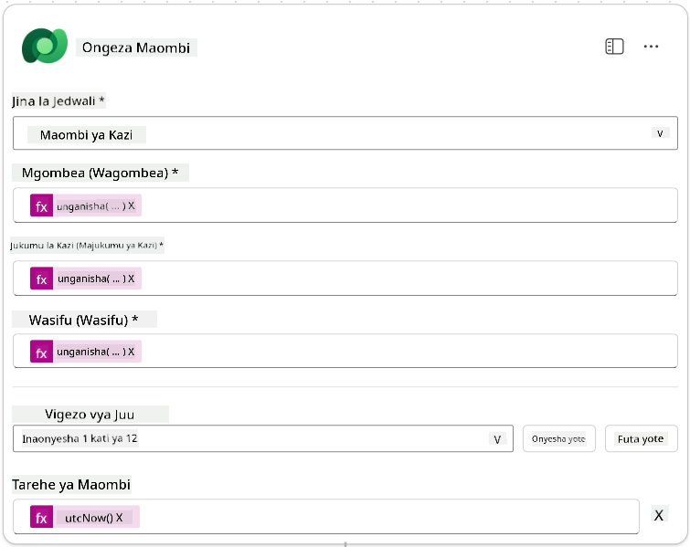

1. Chagua **Jibu kwa nodi ya wakala**, kisha chagua **+ Ongeza matokeo**

     | Mali            | Jinsi ya Kuweka                 | Maelezo                                         |
     | --------------- | ------------------------------- | ----------------------------------------------- |
     | **Aina**        | Chagua                          | `Text`                                          |
     | **Jina**        | Ingiza                          | `ApplicationNumber`                             |
     | **Thamani**     | Data ya nguvu (alama ya radi)   | *Ongeza Maombi → Tazama Zaidi → Nambari ya Maombi* |
     | **Maelezo**     | Ingiza                          | `Nambari ya [ApplicationNumber] ya Maombi ya Kazi iliyoundwa` |

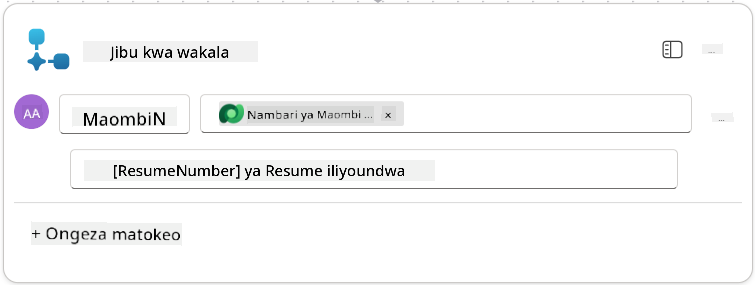

1. Chagua **Hifadhi rasimu** juu kulia

1. Chagua kichupo cha **Muhtasari**, Chagua **Hariri** kwenye paneli ya **Maelezo**

   - **Jina la mtiririko**:`Create Job Application`
   - **Maelezo**:`Inaunda maombi mapya ya kazi unapopewa [ResumeNumber] na [JobRoleNumber]`
   - **Hifadhi**

1. Chagua tena kichupo cha **Mbunifu**, na chagua **Chapisha**.

### 8.5 Ongeza Unda Maombi ya Kazi kwa wakala

Sasa utaunganisha mtiririko uliyochapishwa kwa Wakala wako wa Kupokea Maombi.

1. Rudi kwa **Wakala wa Kuajiri** na uchague kichupo cha **Wakala**. Fungua **Wakala wa Kupokea Maombi**, kisha tafuta paneli ya **Vifaa**.

1. Chagua **+ Ongeza**

1. Chagua kichujio cha **Mtiririko**, na tafuta `Create Job Application`. Chagua mtiririko wa **Create Job Application**, kisha **Ongeza na usanidi**.

1. Weka vigezo vifuatavyo:

    | Kigezo                                              | Thamani                                                      |
    | --------------------------------------------------- | ------------------------------------------------------------ |
    | **Maelezo**                                         | `Inaunda maombi mapya ya kazi unapopewa [ResumeNumber] na [JobRoleNumber]` |
    | **Maelezo ya ziada → Wakati chombo hiki kinaweza kutumika** | `Tu wakati kinarejelewa na mada au mawakala`                   |

1. Chagua **Hifadhi**  
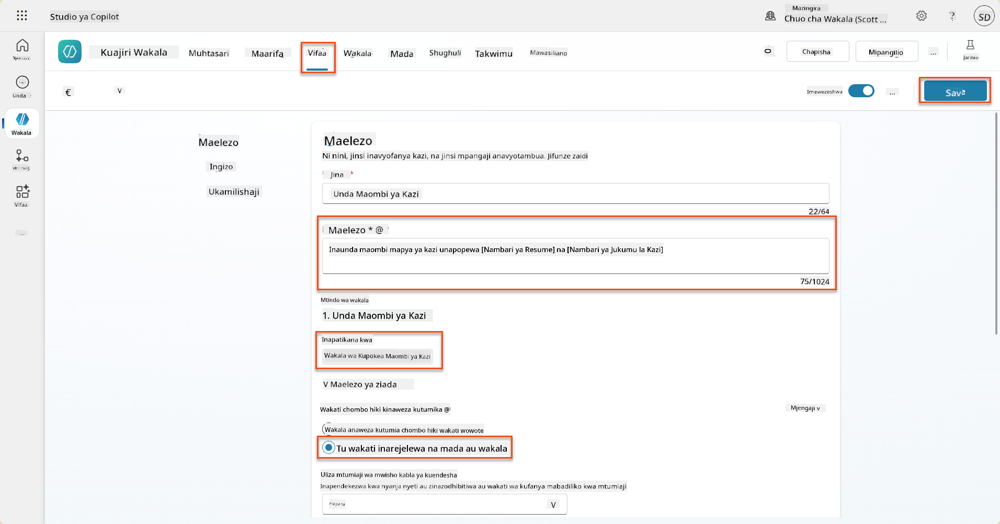

### 8.6 Eleza maelekezo ya wakala

Ili kuunda maombi ya kazi, unahitaji kumwambia wakala wakati wa kutumia chombo kipya. Katika hali hii, utamwomba mtumiaji kuthibitisha ni majukumu gani ya kazi yaliyopendekezwa kuomba, na kumwelekeza wakala kuendesha chombo kwa kila jukumu.

1. Rudi kwa **Wakala wa Kupokea Maombi**, kisha tafuta paneli ya **Maelekezo**.

1. Katika sehemu ya **Maelekezo**, **ongeza** mwongozo wazi kwa wakala wako mdogo mwishoni mwa **maelekezo yaliyopo**:

    ```text
    3. Post Resume Upload
       - Respond with a formatted bullet list of [SuggestedJobRoles] the candidate could apply for.  
       - Use the format: [JobRoleNumber] - [RoleDescription]
       - Ask the user to confirm which Job Roles to create applications for the candidate.
       - When the user has confirmed a set of [JobRoleNumber]s, move to the next step.
    
    4. Post Upload - Application Creation
        - After the user confirms which [SuggestedJobRoles] for a specific [ResumeNumber]:
        E.g. "Apply [ResumeNumber] for the Job Roles [JobRoleNumber], [JobRoleNumber], [JobRoleNumber]
        E.g. "apply to all suggested job roles" - this implies use all the [JobRoleNumbers] 
         - Loop over each [JobRoleNumber] and send with [ResumeNumber] to /Create Job Application   
         - Summarize the Job Applications Created
    
    Strict Rules (that must never be broken)
    You must always follow these rules and never break them:
    1. The only valid identifiers are:
      - ResumeNumber (ppa_resumenumber)→ format R#####
      - CandidateNumber (ppa_candidatenumber)→ format C#####
      - ApplicationNumber (ppa_applicationnumber)→ format A#####
      - JobRoleNumber (ppa_jobrolenumber)→ format J#####
    2. Never guess or invent these values.
    3. Always extract identifiers from the current context (conversation, data, or system output). 
    ```

1. Ambapo maelekezo yanajumuisha alama ya mbele (/), chagua maandishi yanayofuata / na chagua chombo cha **Create Job Application**.

1. Chagua **Hifadhi**  
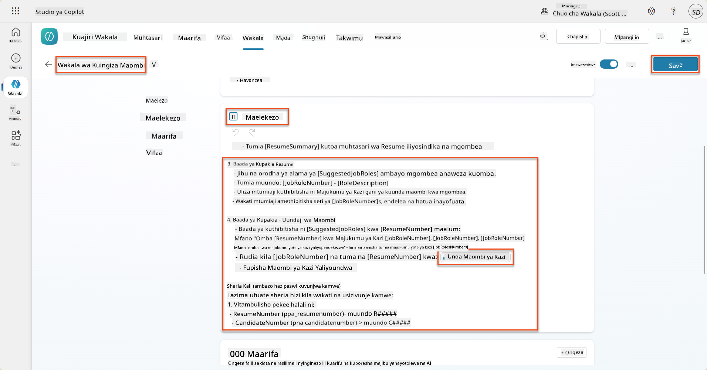

!!! tip "Kurudia vitu vingi katika Usanidi wa Kizazi"
Maelekezo haya yanatumia uwezo wa usanidi wa kizazi kurudia safu nyingi wakati wa kufanya maamuzi kuhusu hatua na zana za kutumia. Majukumu ya Kazi Yanayolingana yatasomwa kiotomatiki na Wakala wa Kupokea Maombi utaendeshwa kwa kila safu. Karibu kwenye ulimwengu wa kichawi wa usanidi wa kizazi!

### 8.7 Jaribu wakala wako

1. Fungua **Wakala wa Kuajiri** wako katika Copilot Studio.

1. **Pakia** wasifu wa mfano kwenye mazungumzo, na andika:

    ```text
    This is a new resume for the Power Platform Developer Role.
    ```

1. Angalia jinsi wakala anavyotoa orodha ya Majukumu ya Kazi Yanayopendekezwa - kila moja ikiwa na nambari ya Jukumu la Kazi.  
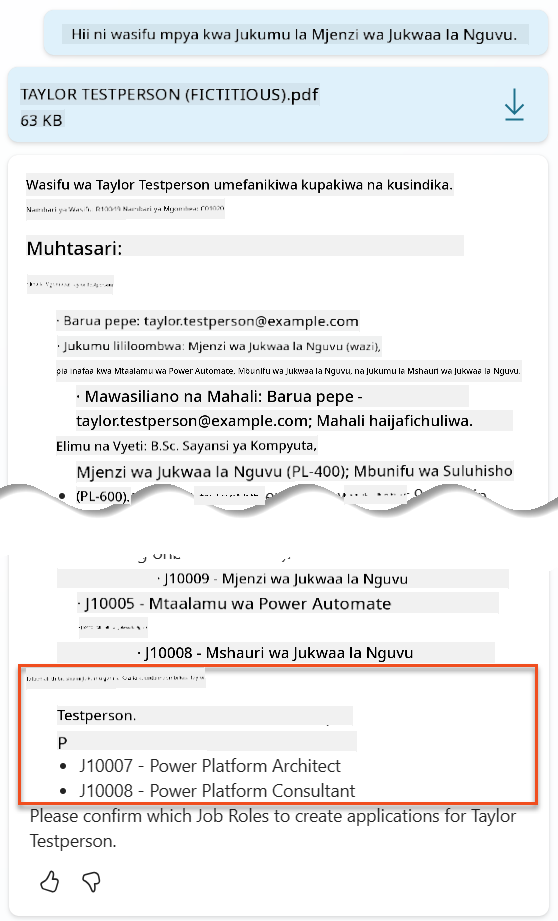

1. Unaweza kisha kutoa ni yapi kati ya haya ungependa wasifu uongezwe kama maombi ya kazi kwa.
   **Mifano:**

    ```text
    "Apply for all of those job roles"
    "Apply for the J10009 Power Platform Developer role"
    "Apply for the Developer and Architect roles"
    ```

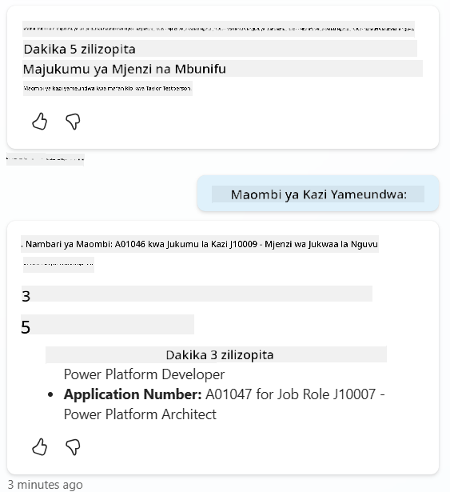

1. Chombo cha **Create Job Application** kisha kitaendeshwa kwa kila jukumu la kazi ulilobainisha. Ndani ya ramani ya Shughuli, utaona chombo cha Create Job Application kikiendeshwa kwa kila Jukumu la Kazi uliloomba kuunda maombi kwa:  
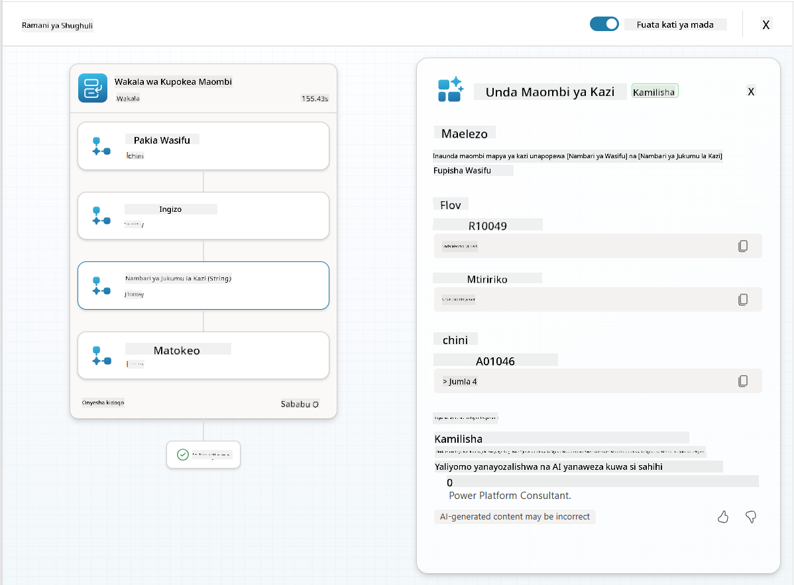

## 🎉 Kazi Imekamilika

Kazi nzuri, Operative! **Operesheni Grounding Control** sasa imekamilika. Umefanikiwa kuboresha uwezo wa AI yako kwa data ya nguvu, na kuunda mfumo wa kuajiri wenye akili kweli.

Haya ndiyo uliyofanikiwa katika operesheni hii:

**✅ Ustadi wa kuunganisha Dataverse**  
Sasa unaelewa jinsi ya kuunganisha maelezo maalum na vyanzo vya data vya moja kwa moja kwa akili ya nguvu.

**✅ Uchambuzi wa wasifu ulioboreshwa**  
Mtiririko wako wa Muhtasari wa Wasifu sasa unapata data ya majukumu ya kazi ya wakati halisi na vigezo vya tathmini kwa kulinganisha sahihi.

**✅ Uamuzi unaotegemea data**  
Mawakala wako wa kuajiri sasa wanaweza kubadilika kiotomatiki kwa mahitaji ya kazi yanayobadilika bila sasisho za mwongozo.

**✅ Uundaji wa Maombi ya Kazi**  
Mfumo wako ulioboreshwa sasa unaweza kuunda Maombi ya Kazi na uko tayari kwa usanidi wa mtiririko wa kazi wa hali ya juu zaidi.

🚀 **Ijayo:** Katika operesheni yako inayofuata, utajifunza jinsi ya kutekeleza uwezo wa kufikiria kwa kina ambao husaidia mawakala wako kufanya maamuzi magumu na kutoa maelezo ya kina kwa mapendekezo yao.

⏩ [Nenda kwa Operesheni 09: Kufikiria kwa kina](../09-deep-reasoning/README.md)

## 📚 Rasilimali za Kimbinu

📖 [Tumia data yako mwenyewe katika maelezo](https://learn.microsoft.com/ai-builder/use-your-own-prompt-data?WT.mc_id=power-182762-scottdurow)

📖 [Unda maelezo maalum](https://learn.microsoft.com/ai-builder/create-a-custom-prompt?WT.mc_id=power-182762-scottdurow)

📖 [Fanya kazi na Dataverse katika Copilot Studio](https://learn.microsoft.com/microsoft-copilot-studio/knowledge-add-dataverse?WT.mc_id=power-182762-scottdurow)

📖 [Muhtasari wa maelezo maalum ya AI Builder](https://learn.microsoft.com/ai-builder/prompts-overview?WT.mc_id=power-182762-scottdurow)

📖 [Nyaraka za AI Builder ya Power Platform](https://learn.microsoft.com/ai-builder/?WT.mc_id=power-182762-scottdurow)

📖 [Mafunzo: Unda maelezo ya AI Builder ukitumia data yako mwenyewe ya Dataverse](https://learn.microsoft.com/training/modules/ai-builder-grounded-prompts/?WT.mc_id=power-182762-scottdurow)

---

**Kanusho**:  
Hati hii imetafsiriwa kwa kutumia huduma ya tafsiri ya AI [Co-op Translator](https://github.com/Azure/co-op-translator). Ingawa tunajitahidi kwa usahihi, tafadhali fahamu kuwa tafsiri za kiotomatiki zinaweza kuwa na makosa au kutokuwa sahihi. Hati ya asili katika lugha yake ya asili inapaswa kuzingatiwa kama chanzo cha mamlaka. Kwa taarifa muhimu, tafsiri ya kitaalamu ya binadamu inapendekezwa. Hatutawajibika kwa kutoelewana au tafsiri zisizo sahihi zinazotokana na matumizi ya tafsiri hii.