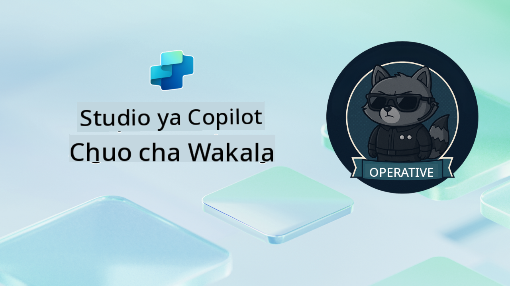

<!--
CO_OP_TRANSLATOR_METADATA:
{
  "original_hash": "24fcbe9a57d3439e05f8866e550c0a84",
  "translation_date": "2025-10-20T00:58:38+00:00",
  "source_file": "docs/operative-preview/README.md",
  "language_code": "sw"
}
-->
# Karibu Operative

**Karibu, Operative.**  
Dhamira yako ya hali ya juu—ikiwa utaamua kuikubali—ni kujifunza sanaa ya kujenga **mifumo ya mawakala wa kiwango cha biashara** kwa kutumia **Microsoft Copilot Studio**.

Mafunzo haya ya kina yatakuchukua zaidi ya uundaji wa mawakala wa msingi hadi ulimwengu wa hali ya juu wa **uratibu wa mawakala wengi**: kuanzia kiotomatiki cha kuajiri hadi usalama wa AI, utajifunza jinsi ya kujenga, kuratibu, na kupeleka mifumo ya mawakala wenye akili kwa kutumia hali halisi za biashara.

--8<-- "disclaimer.md"

---

## 🎯 Lengo la Dhamira

Kwa kukamilisha programu ya Agent Academy Operative, utaweza:

- Kubuni na kutekeleza **mifumo ya mawakala wengi** kwa hali ngumu za biashara
- Kumiliki **uratibu wa mawakala** na mifumo ya ushirikiano
- Kutekeleza **usalama wa AI na usimamizi wa maudhui** katika mifumo ya uzalishaji
- Kujenga **maelekezo ya aina nyingi** kwa usindikaji na uchambuzi wa nyaraka
- Kupeleka **mawakala waliotayarishwa kwa biashara** kwa usimamizi sahihi na majaribio

---

## 🧪 Mahitaji ya Awali

Ili kukamilisha dhamira zote, utahitaji:

- Kukamilisha mafunzo ya **Agent Academy Recruit**
- Mazingira ya Microsoft Power Platform yenye leseni ya **Copilot Studio**
- Ufikiaji wa **Microsoft Dataverse**
- Ruhusa za kiutawala za kuunda suluhisho na mawakala

---

## 🧬 Kwa Nani Mafunzo Haya

Kozi hii ya hali ya juu ni bora kwa:

- **Wasanifu wa suluhisho** wanaobuni mifumo ya AI ya biashara
- **Watengenezaji** wanaojenga suluhisho za mawakala tayari kwa uzalishaji
- **Wataalamu wa IT** wanaotekeleza usimamizi na usalama wa AI
- **Wachambuzi wa biashara** wanaounda mtiririko wa kazi wa kiotomatiki wa hali ngumu
- Yeyote aliye tayari **kuinua kiwango** kutoka kwa mawakala wa msingi hadi mifumo ya biashara

---

## 🧭 Muhtasari wa Mtaala

Academy hii imeundwa kama mfululizo wa operesheni za hatua kwa hatua—kila dhamira inajenga juu ya ile ya awali ili kuunda mfumo wa kiotomatiki wa kuajiri.

| Dhamira | Kichwa | Maelezo ya Operesheni |
|---------|-------|-----------------------|
| `01` | 🚨 [Anza na Mawakala wa Kuajiri](./01-get-started/README.md) | Peleka miundombinu ya msingi na unda wakala wako mkuu wa uratibu |
| `02` | 🎭 [Fanya wakala wako kuwa tayari kwa mawakala wengi na mawakala waliounganishwa](./02-multi-agent/README.md) | Badilisha wakala mmoja kuwa mfumo wa mawakala wengi ulio na uratibu |
| `03` | ⚡ [Fanya wakala wako kuwa wa kiotomatiki kwa Vichochezi](./03-automate-triggers/README.md) | Tekeleza tabia za wakala wa kiotomatiki kwa vichochezi vinavyotegemea matukio |
| `04` | 📝 [Kuandika Maelekezo ya Mawakala](./04-agent-instructions/README.md) | Miliki mawasiliano sahihi ya wakala na udhibiti wa tabia |
| `05` | 💬 [Kubinafsisha Majibu ya Mawakala](./05-agent-responses/README.md) | Badilisha majibu ya wakala kwa athari na ushirikiano wa juu |
| `06` | 🛡️ [Misingi ya Usimamizi wa Maudhui na Usalama wa AI](./06-ai-safety/README.md) | Tekeleza hatua za usalama na uzingatiaji wa kiwango cha biashara |
| `07` | 🎨 [Kuchambua Maudhui ya Wasifu kwa Maelekezo ya Aina Nyingi](./07-multimodal-prompts/README.md) | Shughulikia nyaraka na picha kwa uwezo wa hali ya juu wa AI |
| `08` | 🗄️ [Maelekezo - Msingi wa Dataverse](./08-dataverse-grounding/README.md) | Weka mawakala katika data ya biashara kwa majibu sahihi |
| `09` | 🧠 [Kutumia Uamuzi wa Kina Kutathmini Ustahiki wa Mgombea na Maandalizi ya Mahojiano](./09-deep-reasoning/README.md) | Tekeleza uamuzi wa hali ya juu wa AI kwa maamuzi magumu |
| `10` | 📄 [Tengeneza Nyaraka za Mahojiano za Mgombea Maalum kwa Maelekezo](./10-generate-documents/README.md) | Unda nyaraka za kipekee kulingana na uchambuzi wa wakala |
| `11` | 📊 [Pata Maoni ya Mtumiaji kwa Kadi Zinazobadilika](./11-obtain-user-feedback/README.md) | Kusanya na kushughulikia maoni ya mtumiaji kwa uboreshaji endelevu |
| `12` | 🌐 [Kuchapisha Mawakala Wako kwenye Tovuti ya Demo kwa Upimaji wa Wadau](./12-demo-website/README.md) | Peleka suluhisho kamili kwa maonyesho na upimaji wa wadau |

!!! note
    ✅ Kukamilisha mtaala huu kunakupatia beji ya **Operative**.  
    🔓 **Commander** itafunguliwa katika awamu zijazo.

<!-- markdownlint-disable-next-line MD033 -->

---

**Kanusho**:  
Hati hii imetafsiriwa kwa kutumia huduma ya tafsiri ya AI [Co-op Translator](https://github.com/Azure/co-op-translator). Ingawa tunajitahidi kwa usahihi, tafadhali fahamu kuwa tafsiri za kiotomatiki zinaweza kuwa na makosa au kutokuwa sahihi. Hati ya asili katika lugha yake ya awali inapaswa kuzingatiwa kama chanzo cha mamlaka. Kwa taarifa muhimu, tafsiri ya kitaalamu ya binadamu inapendekezwa. Hatutawajibika kwa kutoelewana au tafsiri zisizo sahihi zinazotokana na matumizi ya tafsiri hii.