<!--
CO_OP_TRANSLATOR_METADATA:
{
  "original_hash": "d9cd8cd1a4fbd8915171a2ed972cc322",
  "translation_date": "2025-10-20T00:38:29+00:00",
  "source_file": "docs/recruit/00-course-setup/README.md",
  "language_code": "sw"
}
-->
# 🚨 Kazi 00: Kuandaa Kozi

## 🕵️‍♂️ JINA LA KODI: `OPERESHENI TAYARI KWA UTEKELEZAJI`

> **⏱️ Muda wa Operesheni:** `~Dakika 30`  

## 🎯 Maelezo ya Kazi

Karibu kwenye kazi ya kwanza ya mafunzo yako kama Wakala wa Copilot Studio.  
Kabla ya kuanza kujenga wakala wako wa kwanza wa AI, unahitaji kuanzisha **mazingira ya maendeleo yaliyo tayari kwa kazi**.

Maelezo haya yanaelezea mifumo, hati za ufikiaji, na hatua za kuanzisha zinazohitajika ili kufanikisha operesheni katika mfumo wa Microsoft 365.

## 🔎 Malengo

Kazi yako inajumuisha:

1. Kupata akaunti ya Microsoft 365  
1. Kupata ufikiaji wa Microsoft Copilot Studio  
1. (Hiari) Kupata leseni ya Microsoft 365 Copilot kwa ajili ya kuchapisha uzalishaji  
1. Kuunda mazingira ya maendeleo kama mazingira yako ya Copilot Studio ya kujenga ndani yake  
1. Kuunda tovuti ya SharePoint itakayotumika kama chanzo cha data katika kazi zijazo

---

## 🔍 Mahitaji ya Awali

Kabla ya kuanza, hakikisha una:

1. **Barua pepe ya kazi au shule** (barua pepe za kibinafsi @outlook.com, @gmail.com, nk., hazikubaliki).
1. Ufikiaji wa mtandao na kivinjari cha kisasa (Edge, Chrome, au Firefox kinapendekezwa).  
1. Uelewa wa msingi wa Microsoft 365 (kwa mfano, kuingia kwenye programu za Office au Teams).  
1. (Hiari) Kadi ya mkopo au njia ya malipo ikiwa unapanga kununua leseni za kulipia.

---

## Hatua ya 1: Pata Akaunti ya Microsoft 365

Copilot Studio iko ndani ya Microsoft 365, kwa hivyo unahitaji akaunti ya Microsoft 365 ili kuipata. Unaweza kutumia akaunti iliyopo ikiwa unayo au fuata hatua hizi kupata leseni inayofaa:

1. **Pata Usajili wa Biashara wa Microsoft 365 wa Kulipia**  
   1. Nenda kwenye [Ukurasa wa Mipango na Bei za Biashara wa Microsoft 365](https://www.microsoft.com/microsoft-365/business/microsoft-365-plans-and-pricing)
   1. Chaguo la bei rahisi zaidi la kuanza ni mpango wa Microsoft 365 Business Basic. Chagua `Jaribu bure` na fuata fomu iliyoelekezwa kujaza maelezo ya usajili na akaunti yako pamoja na maelezo ya malipo.
   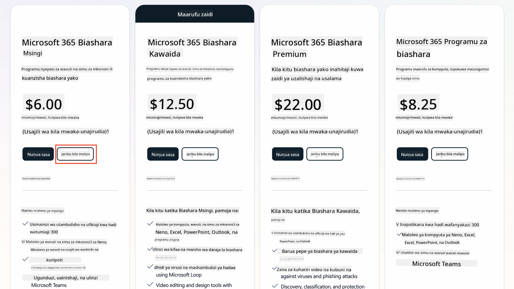
   1. Mara baada ya kupata akaunti yako mpya, ingia.

    !!! Tip
        Ikiwa unapanga kuchapisha mawakala katika Microsoft 365 Copilot Chat au kuunganisha na data ya shirika (SharePoint, OneDrive, Dataverse), leseni ya Microsoft 365 Copilot inahitajika. Hii ni leseni ya nyongeza ambayo unaweza kujifunza zaidi kuhusu [kwenye tovuti ya leseni](https://www.microsoft.com/microsoft-365/copilot#plans)

---

## Hatua ya 2: Anzisha Jaribio la Copilot Studio

Mara baada ya kuwa na Microsoft 365 Tenant, unahitaji kupata ufikiaji wa Copilot Studio. Unaweza kupata jaribio la bure la siku 30 kwa kufuata hatua hizi:

1. Tembelea [aka.ms/TryCopilotStudio](https://aka.ms/TryCopilotStudio).  
1. Ingiza barua pepe kutoka akaunti mpya uliyosajili katika hatua ya awali na uchague `Next`.  

1. Inapaswa kutambua akaunti yako. Chagua `Sign In`.
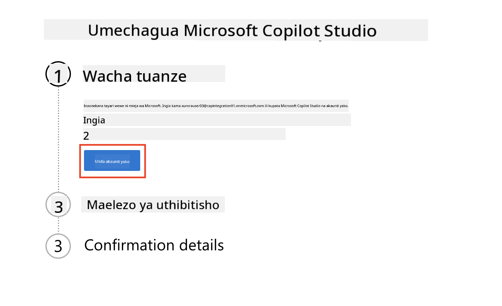  
1. Chagua `Start Free Trial`.
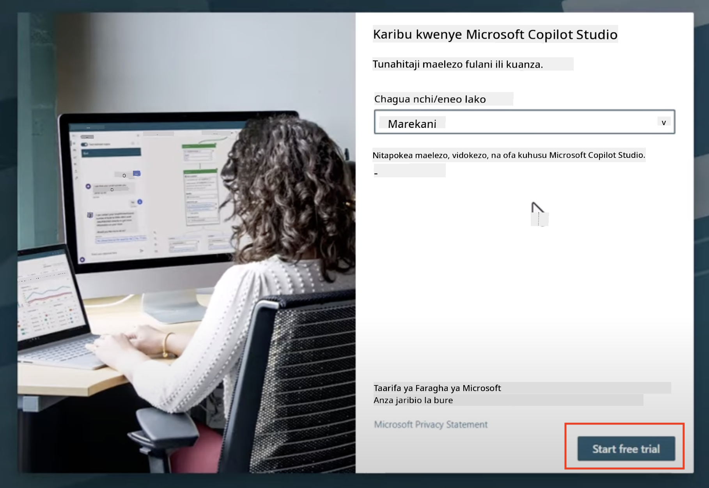

!!! info "Maelezo ya Jaribio"  
     1. Jaribio la bure linatoa **uwezo kamili wa Copilot Studio**.
     1. Utapokea arifa za barua pepe kuhusu muda wa jaribio lako kuisha. Unaweza kuongeza muda wa jaribio kwa vipindi vya siku 30 (hadi siku 90 za muda wa wakala).  
     1. Ikiwa msimamizi wa tenant yako amezima usajili wa huduma binafsi, utaona hitilafu—wasiliana na msimamizi wako wa Microsoft 365 ili kuirejesha.

---

## Hatua ya 3: Unda mazingira mapya ya maendeleo

### Jisajili kwa Mpango wa Maendeleo wa Power Apps

Kwa kutumia tenant sawa ya Microsoft 365 katika Hatua ya 1, jisajili kwa Mpango wa Maendeleo wa Power Apps ili kuunda mazingira ya maendeleo ya bure ya kujenga na kujaribu na Copilot Studio.

1. Jisajili kwenye [tovuti ya Mpango wa Maendeleo wa Power Apps](https://aka.ms/PowerAppsDevPlan).

    - Ingiza barua pepe yako
    - Weka alama kwenye kisanduku
    - Chagua **Start free**

    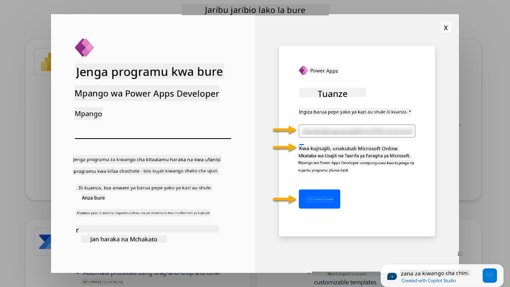

1. Baada ya kujisajili kwa Mpango wa Maendeleo, utaelekezwa kwenye [Power Apps](https://make.powerapps.com/). Mazingira hutumia jina lako, kwa mfano **Mazingira ya Adele Vance**. Ikiwa tayari kuna mazingira yenye jina hilo, mazingira mapya ya maendeleo yatapewa jina **Mazingira ya Adele Vance (1)**.

    Tumia mazingira haya ya maendeleo katika Copilot Studio unapoendelea na maabara.

!!! Note
    Ikiwa unatumia akaunti iliyopo ya Microsoft 365 na hukutengeneza moja katika Hatua ya 1, kwa mfano - ukitumia akaunti yako mwenyewe katika shirika lako la kazi, msimamizi wako wa IT (au timu inayofanana) inayosimamia tenant/mazingira yako inaweza kuwa imezima mchakato wa usajili. Katika hali hii, tafadhali wasiliana na msimamizi wako, au tengeneza tenant ya majaribio kama ilivyoelezwa katika Hatua ya 1.

---

## Hatua ya 4: Unda tovuti mpya ya SharePoint

Tovuti mpya ya SharePoint inahitaji kuundwa ambayo itatumika katika [Somo la 06 - Unda wakala maalum kwa kutumia uzoefu wa mazungumzo na Copilot na kuimarisha kwa data yako](../06-create-agent-from-conversation/README.md#62-add-an-internal-knowledge-source-using-a-sharepoint-site).

1. Chagua ikoni ya waffle upande wa juu kushoto wa Microsoft Copilot Studio ili kuona menyu. Chagua SharePoint kutoka kwenye menyu.

    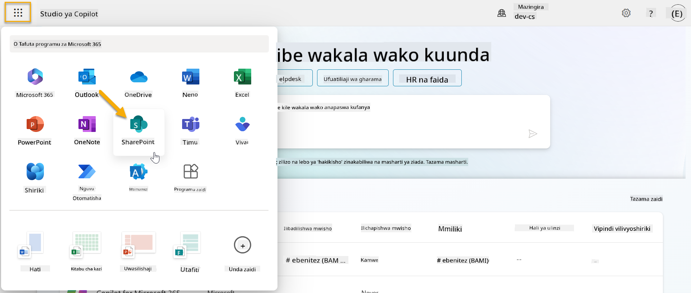

1. SharePoint itapakia. Chagua **+ Create site** kuunda tovuti mpya ya SharePoint.

    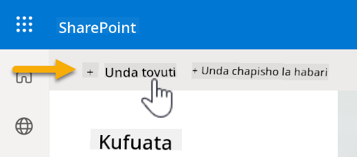

1. Dialog itaonekana kuongoza katika kuunda tovuti mpya ya SharePoint. Chagua **Team site**.

    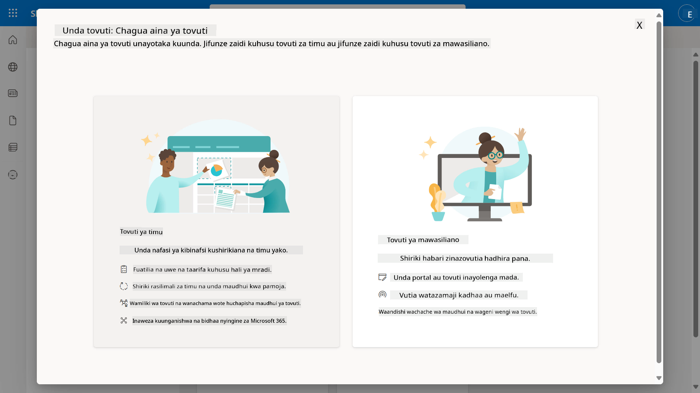

1. Katika hatua inayofuata, orodha ya templates za Microsoft itapakia kwa default. Tembea chini na uchague template ya **IT help desk**.

    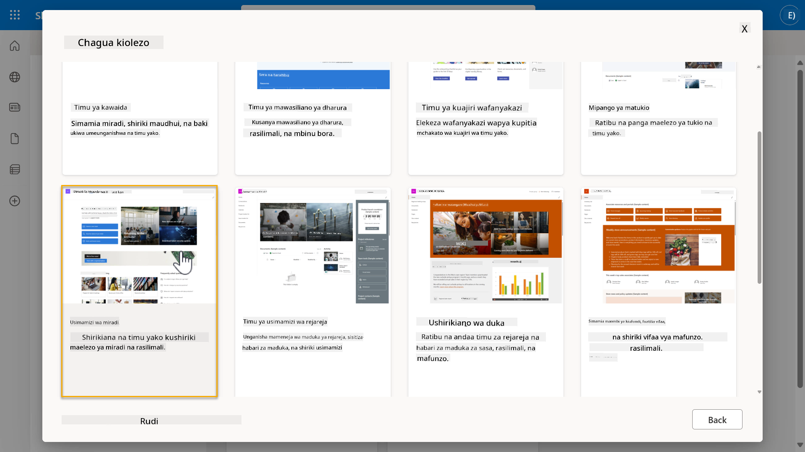

1. Chagua **Use template** kuunda tovuti mpya ya SharePoint kwa kutumia template ya IT help desk.

    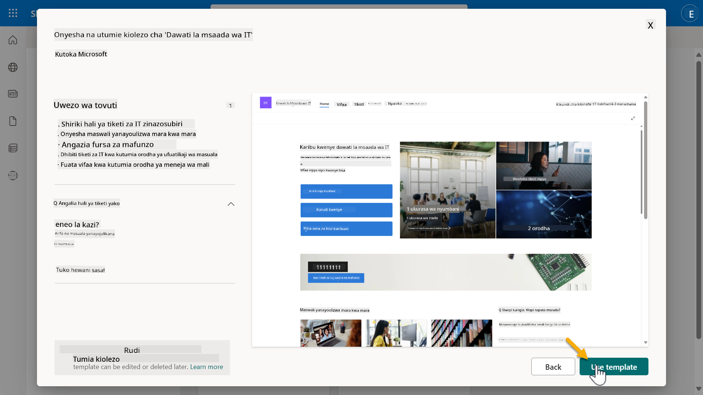

1. Ingiza maelezo ya tovuti yako. Mfano ni kama ifuatavyo:

    | Sehemu | Thamani |
    | --- | --- |
    | Jina la Tovuti | Contoso IT |
    | Maelezo ya Tovuti | Copilot Studio kwa Wanaoanza |
    | Anwani ya Tovuti | ContosoIT |

    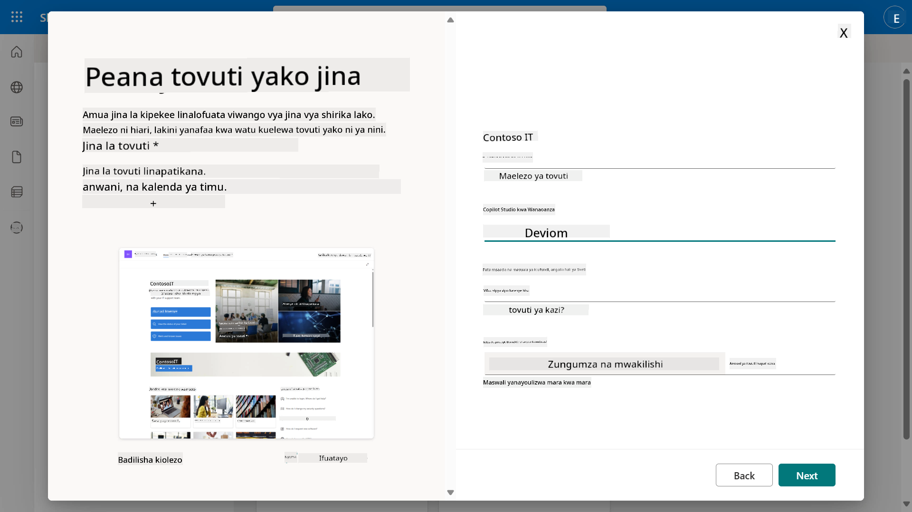

1. Katika hatua ya mwisho, lugha inaweza kuchaguliwa kwa ajili ya tovuti ya SharePoint. Kwa default itakuwa **Kiingereza**. Acha Lugha ikiwa **Kiingereza** na chagua **Create site**.

    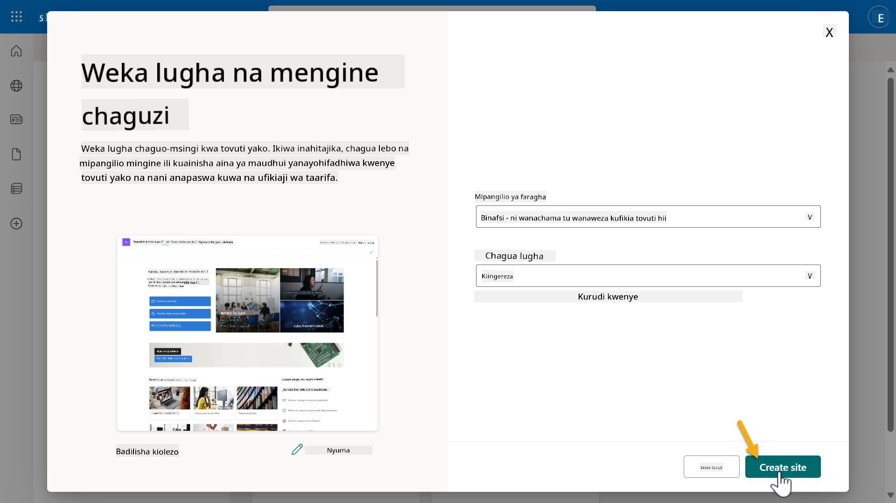

1. Tovuti ya SharePoint itatengenezwa kwa sekunde chache zijazo. Wakati huo, unaweza kuchagua kuongeza watumiaji wengine kwenye tovuti yako kwa kuingiza barua pepe zao kwenye sehemu ya **Add members**. Baada ya kumaliza, chagua **Finish**.

    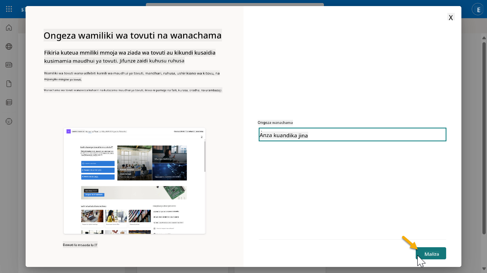

1. Ukurasa wa nyumbani wa tovuti ya SharePoint utapakia. **Nakili** URL ya tovuti ya SharePoint.

1. Template hii inatoa kurasa zenye data ya mfano kuhusu sera mbalimbali za IT na orodha mbili za mfano (Tickets na Devices).

### Tumia Orodha ya Vifaa ya SharePoint

Tutatumia orodha ya **Devices** katika [Kazi ya 07 - Ongeza mada mpya na trigger na nodes](../07-add-new-topic-with-trigger/README.md#73-add-a-tool-using-a-connector).

### Ongeza safu mpya

Tembea hadi upande wa kulia kabisa kwenye orodha na uchague kitufe cha **+ Add column**. Chagua aina ya **hyperlink**, ingiza **Image** kwa jina la safu, na uchague kuongeza.

### Unda data ya mfano katika orodha ya Vifaa ya SharePoint

Unahitaji kuhakikisha kuwa umejaza orodha hii na angalau vitu 4 vya data ya mfano na kuongeza safu moja ya ziada kwenye orodha hii.  

Unapoongeza data ya mfano, hakikisha kuwa sehemu zifuatazo zimejazwa:

- Picha ya kifaa - tumia picha kutoka [folda ya picha za vifaa](https://github.com/microsoft/agent-academy/tree/main/docs/recruit/00-course-setup/images/device-images)
- Kichwa
- Hali
- Mtengenezaji
- Modeli
- Aina ya Mali
- Rangi
- Namba ya Serial
- Tarehe ya Ununuzi
- Bei ya Ununuzi,
- Namba ya Agizo
- Picha - tumia viungo vifuatavyo

|Kifaa  |URL  |
|---------|---------|
|Surface Laptop 13     | [https://raw.githubusercontent.com/microsoft/agent-academy/refs/heads/main/docs/recruit/00-course-setup/images/device-images/Surface-Laptop-13.png](https://raw.githubusercontent.com/microsoft/agent-academy/refs/heads/main/docs/recruit/00-course-setup/images/device-images/Surface-Laptop-13.png)        |
|Surface Laptop 15     | [https://raw.githubusercontent.com/microsoft/agent-academy/refs/heads/main/docs/recruit/00-course-setup/images/device-images/Surface-Laptop-15.png](https://raw.githubusercontent.com/microsoft/agent-academy/refs/heads/main/docs/recruit/00-course-setup/images/device-images/Surface-Laptop-15.png)        |
|Surface Pro    | [https://raw.githubusercontent.com/microsoft/agent-academy/refs/heads/main/docs/recruit/00-course-setup/images/device-images/Surface-Pro-12.png](https://raw.githubusercontent.com/microsoft/agent-academy/refs/heads/main/docs/recruit/00-course-setup/images/device-images/Surface-Pro-12.png)        |
|Surface Studio    | [https://raw.githubusercontent.com/microsoft/agent-academy/refs/heads/main/docs/recruit/00-course-setup/images/device-images/Surface-Studio.png](https://raw.githubusercontent.com/microsoft/agent-academy/refs/heads/main/docs/recruit/00-course-setup/images/device-images/Surface-Studio.png)        |

---

## ✅ Kazi Imekamilika

Umefanikiwa:

- Kuanzisha mazingira ya maendeleo ya Microsoft 365  
- Kuanzisha jaribio la Copilot Studio  
- Kuunda tovuti ya SharePoint kwa ajili ya kuimarisha mawakala  
- Kujaza orodha ya Vifaa kwa matumizi katika kazi zijazo

Umeruhusiwa rasmi kuanza mafunzo yako ya **Wakala wa Kiwango cha Kuanza** katika [Somo la 01](../01-introduction-to-agents/README.md).  

<!-- markdownlint-disable-next-line MD033 -->

---

**Kanusho**:  
Hati hii imetafsiriwa kwa kutumia huduma ya tafsiri ya AI [Co-op Translator](https://github.com/Azure/co-op-translator). Ingawa tunajitahidi kwa usahihi, tafadhali fahamu kuwa tafsiri za kiotomatiki zinaweza kuwa na makosa au kutokuwa sahihi. Hati ya asili katika lugha yake ya asili inapaswa kuzingatiwa kama chanzo cha mamlaka. Kwa taarifa muhimu, tafsiri ya kitaalamu ya binadamu inapendekezwa. Hatutawajibika kwa kutoelewana au tafsiri zisizo sahihi zinazotokana na matumizi ya tafsiri hii.