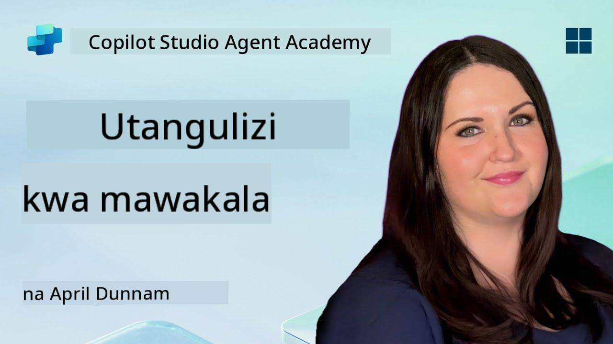

<!--
CO_OP_TRANSLATOR_METADATA:
{
  "original_hash": "d6706e107678264168d77b2e107710b1",
  "translation_date": "2025-10-20T00:53:35+00:00",
  "source_file": "docs/recruit/01-introduction-to-agents/README.md",
  "language_code": "sw"
}
-->
# 🚨 Misheni 01: Utangulizi wa Mawakala

## 🕵️‍♂️ JINA LA KODI: `OPERESHENI AI AGENT DECODE`

> **⏱️ Muda wa Operesheni:** `~dakika 30 – taarifa tu, hakuna kazi ya uwanja inayohitajika`

🎥 **Tazama Mwongozo**

## 🎯 Maelezo ya Misheni

Karibu, Rekruti. Kabla ya kuanza kujenga mawakala, unahitaji kuelewa vizuri dhana za AI zinazowawezesha. Misheni hii itakupa maarifa ya msingi kuhusu AI ya mazungumzo, mifano mikubwa ya lugha (LLMs), kizazi kilichoongezwa na urejeshaji (RAG), na aina za mawakala unayoweza kuunda katika Copilot Studio.

## 🔎 Malengo

Katika misheni hii, utajifunza:

1. AI ya mazungumzo ni nini na kwa nini ni muhimu  
1. Jinsi Mifano Mikubwa ya Lugha (LLMs) inavyowezesha uzoefu wa mazungumzo  
1. Nini kizazi kilichoongezwa na urejeshaji (RAG) kinachotoa  
1. Tofauti kati ya mawakala wa mazungumzo na mawakala wa kujitegemea  
1. Jinsi mawakala katika Copilot Studio wanavyotumia dhana hizi  

Twende kazi!

---

## AI ya Mazungumzo ni Nini?

AI ya mazungumzo inahusu mfumo wowote unaoweza kuelewa, kuchakata, na kujibu lugha ya binadamu – iwe maandishi au sauti – kwa njia inayohisi kuwa ya asili. Fikiria chatbots kwenye dawati la msaada au wasaidizi wa kibinafsi wa kidijitali kwenye programu zako unazopenda. Kwa ndani, AI nyingi za kisasa za mazungumzo zinategemea Mifano Mikubwa ya Lugha (LLMs), ambayo tutazungumzia baadaye.

### Kwa Nini Ni Muhimu

- **Uzoefu wa Mtumiaji:** Mienendo ya mazungumzo mara nyingi ni rahisi zaidi kuliko kubofya menyu.  
- **Uwezo wa Kupanuka:** Wakala mmoja anaweza kushughulikia mazungumzo mengi kwa wakati mmoja.  
- **Ufanisi:** Badala ya kujenga maandishi maalum ya sheria, mawakala wanaotumia LLM hubadilika haraka kulingana na maingiliano ya mtumiaji.  
- **Uwezo wa Kuongezeka:** Kwa muundo sahihi, mawakala wanaweza kufikia hifadhidata za maarifa, kuunganishwa na API, au kufanya kazi kama “wafanyakazi wa kidijitali” ndani ya mtiririko wa kazi za biashara.

---

## Mifano Mikubwa ya Lugha (LLMs) 101

Katika msingi wa mifumo mingi ya AI ya mazungumzo kuna **Mifano Mikubwa ya Lugha** – mitandao ya neva iliyofunzwa kwa maandishi makubwa. Zinajifunza mifumo ya takwimu ya lugha ili ziweze kuunda sentensi zenye maana, kujibu maswali, au hata kutoa mawazo. Mambo muhimu ya kuelewa:

1. **Data ya Mafunzo:** LLMs zinachukua terabaiti za maandishi (kurasa za wavuti, vitabu, makala). Maarifa haya ya “ulimwengu” huwasaidia kujibu mada nyingi.  
1. **Tokenization:** Maandishi yanagawanywa katika vitengo vidogo vinavyoitwa tokeni (maneno, sehemu za maneno, au herufi). Mfano unatoa utabiri wa tokeni moja kwa wakati mmoja.  
1. **Dirisha la Muktadha:** Kila LLM ina kikomo cha tokeni ngapi inaweza “kuona” kwa wakati mmoja. Zaidi ya kikomo hicho, tokeni za awali zinakatwa.  
1. **Kutoa Maelekezo:** Unawasiliana na LLM kwa kutuma maelekezo. Kadri maelekezo yako yanavyokuwa bora, ndivyo majibu yanavyokuwa sahihi na yanayolenga.  
1. **Zero-shot vs. Fine-tuning:** Zero-shot inamaanisha kutumia LLM kama ilivyo (bila marekebisho). Fine-tuning inamaanisha kurekebisha mfano kwa data maalum ya uwanja ili kujibu kwa usahihi zaidi kwa mahitaji yako.

!!! Tip "Ushauri wa Wataalamu"
    Mfano wa kawaida ni kwamba LLM ni kama “autocomplete yenye akili nyingi.” Haielewi maana kama ubongo wa binadamu, lakini ni nzuri sana katika kutabiri neno bora linalofuata (au kifungu) katika mfululizo.

---

## Kizazi Kilichoongezwa na Urejeshaji (RAG)

Wakati LLMs zinapojitegemea data ya mafunzo ya kudumu, zinaweza kutoa majibu yasiyo sahihi au yaliyopitwa na wakati. RAG inashughulikia hili kwa kuruhusu mfano “kutafuta” taarifa mpya kabla ya kuunda jibu. Kwa kiwango cha juu, RAG hufanya kazi hivi:

1. **Swali la Mtumiaji:** Mtumiaji anauliza swali (mfano, “Nini kipya kuhusu mapato ya robo ya Contoso?”).  
1. **Hatua ya Urejeshaji:** Mfumo unatafuta chanzo cha maarifa (hati, hifadhidata za ndani, maktaba za SharePoint, n.k.) ili kupata sehemu zinazofaa.  
1. **Kuongeza:** Sehemu zilizorejeshwa zinaongezwa au kuambatanishwa kabla ya maelekezo ya LLM.  
1. **Kizazi:** LLM inachukua swali la mtumiaji na muktadha uliorejeshwa, kisha inazalisha jibu lililo na msingi wa data ya kisasa.  

Kwa kutumia RAG, wakala wako anaweza kufikia wikis za kampuni ya ndani, API za programu-jalizi, au kutafuta hifadhidata ya maswali yanayoulizwa mara kwa mara—na kurudisha majibu ambayo hayajazuiliwa na vigezo vya mfano vilivyochapishwa.

---

## Mawakala wa Mazungumzo vs. Mawakala wa Kujitegemea

Katika muktadha wa Copilot Studio, neno **wakala** linaweza kumaanisha aina mbalimbali za wasaidizi wa AI. Ni muhimu kutofautisha kati ya:

**Mawakala wa Mazungumzo:**

- Kazi yao kuu ni mazungumzo ya pande mbili.  
- Wanahifadhi muktadha katika mizunguko mingi ya mazungumzo.  
- Kwa kawaida huendeshwa kupitia mtiririko au vichocheo vilivyotangulia (mfano, “Ikiwa mtumiaji atasema X, jibu na Y”).  
- Inafaa kwa msaada wa wateja, maswali yanayoulizwa mara kwa mara, maingiliano ya kuongozwa, kupanga ratiba, au maswali na majibu rahisi.  
  - Mifano:  
    - Chatbot ya Teams inayojibu maswali ya sera za HR.  
    - Bot ya Power Virtual Agents kwenye ukurasa wa SharePoint kuongoza watumiaji kupitia fomu.  

**Mawakala wa Kujitegemea:**

- Zaidi ya mazungumzo ya pande mbili; wanaweza **kuchukua hatua** kwa niaba ya mtumiaji.  
- Wanatumia mizunguko ya kufikiri ya LLM (fikiria “panga → tenda → angalia → panga tena”) kukamilisha majukumu.  
- Wanajumuisha zana za nje au API (mfano, kuendesha mtiririko wa Power Automate, kutuma mialiko ya kalenda, kudhibiti data katika Dataverse).  
- Hufanya kazi bila maelekezo ya mara kwa mara ya binadamu—wakati wakichochewa, wanaweza kushughulikia michakato ya hatua nyingi kwa kujitegemea.  
  - Mifano:  
    - Wakala anayezalisha ratiba ya safari, kuhifadhi tiketi za ndege, na kutuma barua pepe za uthibitisho.  
    - Wakala wa “Muhtasari wa Mkutano” anayeshiriki simu ya Teams, kuandika mazungumzo kwa wakati halisi, na kuandika muhtasari wa utendaji kwenye OneNote.  

!!! Info "Tofauti Muhimu"
    Mawakala wa mazungumzo husubiri maingiliano ya mtumiaji na hushikilia mtiririko wa mazungumzo. Mawakala wa kujitegemea hupanga na kutekeleza mfululizo wa hatua kwa kutumia ufikiaji mpana wa zana.

---

## Mawakala katika Copilot Studio

**Copilot Studio** inaunganisha hali zote za mazungumzo na kujitegemea chini ya mfumo mmoja. Hivi ndivyo Copilot Studio inavyokusaidia kujenga mawakala:

1. **Mbunifu wa Wakala wa Kielelezo:** Sehemu ya kanvasi ya msimbo mdogo ya kufafanua maelekezo, kumbukumbu, na zana kwa mtiririko wa mazungumzo na hatua.  
1. **Marekebisho ya LLM:** Chagua kutoka kwa mifano mbalimbali ya OpenAI au GPT ya daraja la biashara ya Microsoft ili kufanikisha mahitaji yako ya utendaji na gharama.  
1. **Viunganishi vya Urejeshaji:** Muunganisho uliotengenezwa tayari kwa SharePoint, OneDrive, Azure Cognitive Search, na Dataverse, kuwezesha RAG moja kwa moja.  
1. **Zana na Kazi Maalum:** Fafanua vitendo vya HTTP maalum au mtiririko wa Power Automate ambao wakala wako anaweza kutumia kwa kujitegemea.  
1. **Msaada wa Njia Nyingi:** Zaidi ya maandishi, mawakala wa Copilot Studio wanaweza kuchukua picha, faili, au data iliyopangwa ili kuimarisha muktadha.  
1. **Uchapishaji na Usambazaji:** Mara wakala wako anapokuwa tayari, unaweza kuuchapisha kwa Microsoft 365 Copilot (ili watumiaji wauwasilishe katika Teams, SharePoint, Outlook, n.k.) au kuuweka kama wijeti ya mazungumzo pekee kwenye ukurasa wa wavuti.

---

## 🎉 Misheni Imekamilika

Sasa umekamilisha utangulizi wako wa mawakala na dhana za msingi za AI. Unaelewa:

1. **LLMs = “Ubongo” wa Wakala Wako**  
   - Wajibu wa kuelewa lugha na kizazi.  
   - Tokeni zaidi = muktadha tajiri, lakini pia gharama kubwa kwa kila simu.  

1. **RAG = Muunganisho wa Maarifa ya Wakati Halisi**  
   - Inaziba pengo kati ya LLM ya kudumu na vyanzo vya data vinavyobadilika kila wakati.  
   - Inarejesha na kuingiza hati au rekodi zinazofaa katika maelekezo ya LLM.  

1. **Mazungumzo vs. Kujitegemea**  
   - **Mazungumzo:** Kuzingatia mtiririko wa mazungumzo na kuhifadhi muktadha (mfano, “Kumbukumbu ya Kikao”).  
   - **Kujitegemea:** Ongeza “Vizuizi vya Hatua” vinavyoruhusu wakala kufikia zana za nje au huduma.

---
Hatua inayofuata, utachunguza [misingi ya Copilot Studio](../02-copilot-studio-fundamentals/README.md)!

Endelea kuwa makini, Rekruti - safari yako ya AI ndiyo imeanza tu!

## 📚 Rasilimali za Kijeshi

🔗 [Nyumbani kwa Nyaraka za Copilot Studio](https://learn.microsoft.com/microsoft-copilot-studio/)

---

<!-- markdownlint-disable-next-line MD033 -->

---

**Kanusho**:  
Hati hii imetafsiriwa kwa kutumia huduma ya tafsiri ya AI [Co-op Translator](https://github.com/Azure/co-op-translator). Ingawa tunajitahidi kwa usahihi, tafadhali fahamu kuwa tafsiri za kiotomatiki zinaweza kuwa na makosa au kutokuwa sahihi. Hati asilia katika lugha yake ya asili inapaswa kuzingatiwa kama chanzo cha mamlaka. Kwa taarifa muhimu, tafsiri ya kitaalamu ya binadamu inapendekezwa. Hatutawajibika kwa kutoelewana au tafsiri zisizo sahihi zinazotokana na matumizi ya tafsiri hii.