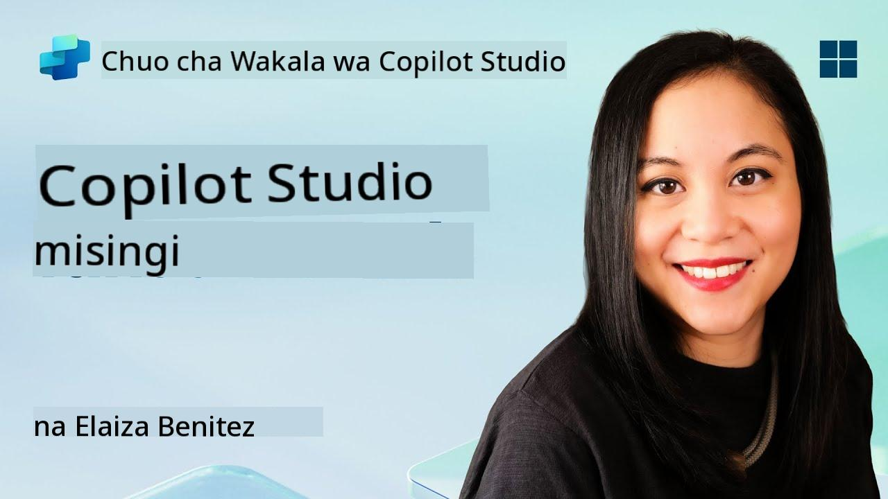
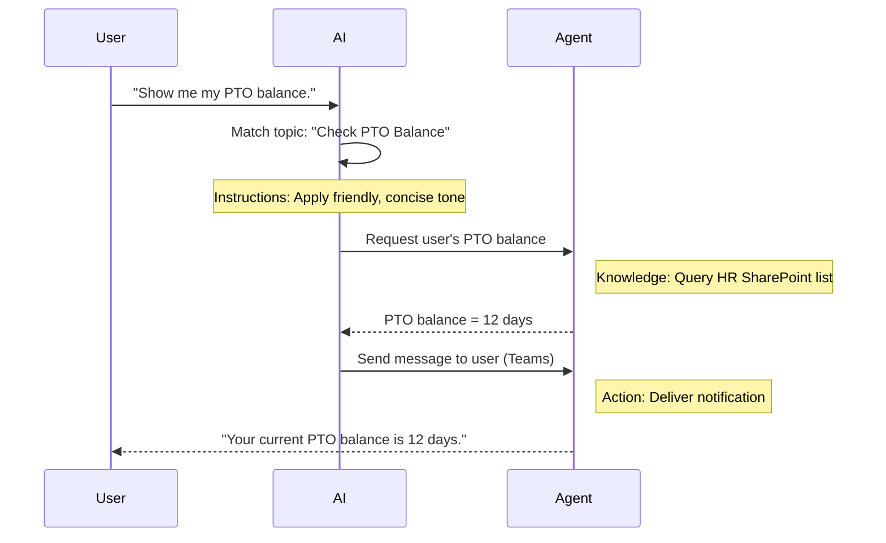

<!--
CO_OP_TRANSLATOR_METADATA:
{
  "original_hash": "90a3c5122f5687bbc8cc819990f175d4",
  "translation_date": "2025-10-20T00:54:45+00:00",
  "source_file": "docs/recruit/02-copilot-studio-fundamentals/README.md",
  "language_code": "sw"
}
-->
# 🚨 Kazi 02: Misingi ya Copilot Studio

## 🕵️‍♂️ JINA LA KODI: `OPERESHENI PROTOKALI YA MSINGI`

> **⏱️ Muda wa Operesheni:** `~dakika 30 – taarifa tu, hakuna kazi ya uwanja inayohitajika`  

🎥 **Tazama Mwongozo**

[](https://www.youtube.com/watch?v=x4OCwDRGeLE "Tazama mwongozo kwenye YouTube")

## 🎯 Maelezo ya Kazi

Karibu, Rekruti. Kazi hii itakupa taarifa za msingi za kuelewa jinsi Copilot Studio inavyofanya kazi, na jinsi ya kujenga mawakala wenye akili wanaotoa thamani halisi ya biashara.

Kabla ya kujenga wakala wako wa kwanza, unahitaji kuelewa vipengele vinne muhimu vinavyounda kila wakala wa AI maalum: Maarifa, Zana, Mada, na Maelekezo. Pia utajifunza jinsi vipengele hivi vinavyofanya kazi pamoja katika mpangaji wa Copilot Studio.

## 🔎 Malengo

Katika kazi hii, utajifunza:

- **Kujua Copilot Studio ni nini**  
- **Kujua ni lini na kwa nini utumie mawakala**  
- **Kuchunguza vipengele vinne vya ujenzi wa mawakala**  
      - **Maarifa**  
      - **Zana**  
      - **Mada**  
      - **Maelekezo**  
- **Kuelewa jinsi vipengele hivi vinavyofanya kazi pamoja** kuunda wakala mwenye akili, wa kiotomatiki  

---

## Mawakala ni Nini katika Copilot Studio?

**Wakala** ni msaidizi wa AI maalum unayebuni kushughulikia kazi au maswali maalum. Tofauti na chatbot ya matumizi ya jumla, wakala wako:

- **Anajua data maalum ya kampuni** (sera, nyaraka, hifadhidata)  
- **Hufanya kazi za ulimwengu halisi** (kutuma ujumbe, kuunda matukio ya kalenda, kusasisha rekodi)  
- **Hudumisha muktadha wa mazungumzo** ili aweze kufuatilia maswali ya awali  

Kwa sababu Copilot Studio ni ya kiwango cha chini cha msimbo, unaweza kuburuta na kuachia vipengele vilivyotengenezwa tayari—hakuna ujuzi wa kina wa programu unaohitajika. Mara wakala wako anapojengwa, watu wanaweza kumtumia ndani ya Teams, Slack, au hata kwenye ukurasa wa wavuti maalum kupata majibu au kuanzisha mtiririko wa kazi kiotomatiki.

---

## Ni Lini na Kwa Nini Utumie Copilot Studio

Wakati Microsoft 365 Copilot inatoa msaada wa AI wa jumla katika programu za Office, utahitaji wakala maalum wakati:

### Unahitaji maarifa ya kikoa maalum

- Copilot ya kawaida inaweza isijue taratibu za ndani za kampuni yako au data. Wakala anaweza kuuliza tovuti za SharePoint, hifadhidata, au vyanzo maalum ili kutoa majibu sahihi, ya kisasa.  

### Unataka kuendesha mtiririko wa kazi wa hatua nyingi kiotomatiki

- Kwa mfano: "Mtu anapowasilisha gharama, itume kwa idhini, sasisha rekodi ya fedha, na kumjulisha meneja." Wakala maalum anaweza kushughulikia kila hatua, ikianzishwa na amri moja au tukio.  

### Unahitaji uzoefu wa muktadha, ndani ya zana  

- Fikiria wakala wa Kuajiri Wafanyakazi Wapya katika Teams ambaye anaongoza wafanyakazi wa HR kupitia kila sera, kutuma fomu zinazohitajika, na kupanga mikutano ya mafunzo—ndani ya jukwaa lako la ushirikiano lililopo.  

---

## Vipengele Vinne vya Ujenzi wa Wakala

Kila wakala wa Copilot Studio unajengwa kutoka kwa vipengele vinne vya msingi:

1. **Maarifa**  
1. **Zana (Vitendo)**  
1. **Mada**  
1. **Maelekezo**

Hapa chini, tutafafanua kila kipengele cha ujenzi na kuonyesha jinsi vinavyofanya kazi pamoja kuunda wakala mzuri.

### 1. Maarifa

**Maarifa** ni data na muktadha ambao wakala wako hutumia kujibu maswali kwa usahihi. Ina sehemu mbili:

#### Maelekezo Maalum & Muktadha

- Unaandika maelezo mafupi ya madhumuni na mtindo wa wakala. Kwa mfano:  

    ```text
    You are an IT support agent. You help employees troubleshoot common software issues, provide troubleshooting steps, and escalate urgent tickets.
    ```

- Wakati wa mazungumzo, wakala anakumbuka mizunguko ya awali ili aweze kurejelea kile kilichojadiliwa tayari (kwa mfano, ikiwa mtumiaji anasema kwanza, "Printa yangu haifanyi kazi," kisha baadaye anauliza, "Je, ulitazama kiwango cha wino?" wakala anakumbuka muktadha wa printa).

#### Vyanzo vya Maarifa (Data ya Msingi)

- Unaunganisha wakala wako na vyanzo vingi vya data—maktaba za SharePoint, tovuti za nyaraka, wikis, au hifadhidata nyingine.  
- Mtumiaji anapouliza swali, wakala huchukua sehemu husika kutoka kwa vyanzo hivyo ili majibu yawe **yamejikita** katika sera halisi za shirika lako, miongozo ya bidhaa, au taarifa yoyote ya kipekee.  
- Unaweza hata kumlazimisha wakala kujibu tu kwa taarifa kutoka kwa vyanzo hivyo, kuzuia kubahatisha au kutoa majibu yasiyo sahihi.

!!! mfano
    Wakala wa "Msaidizi wa Sera" anaweza kuunganishwa na tovuti yako ya HR ya SharePoint. Ikiwa mtumiaji atauliza, "Kiwango chetu cha kukusanya PTO ni kipi?" wakala atachukua maandishi halisi kutoka kwa nyaraka za sera za HR badala ya kutegemea jibu la AI la jumla.

---

### 2. Zana (Vitendo)

**Zana (Vitendo)** hufafanua kile wakala anaweza kufanya zaidi ya kuzungumza. Kila kitendo ni kazi ambayo wakala hufanya kiotomatiki, kama:

- Kutuma barua pepe au ujumbe wa Teams  
- Kuunda au kusasisha tukio la kalenda  
- Kuongeza au kuhariri rekodi katika hifadhidata (mfano, orodha ya SharePoint au meza ya Dataverse)  
- Kuita mtiririko wa Power Automate au REST API  

#### Jinsi Vitendo Vinavyofanya Kazi

- **Fafanua Ingizo & Matokeo**  
      - Kwa mfano, kitendo cha Kutuma Barua Pepe kinaweza kuhitaji:  
        - `RecipientEmailAddress`  
        - `SubjectLine`  
        - `EmailBody`  

- **Unganisha Vitendo katika Mtiririko wa Kazi**  
      - Mara nyingi, kutimiza ombi la mtumiaji kunahusisha hatua nyingi.  
      - Unaweza kupanga vitendo ili:  
             1. Wakala achukue data kutoka kwa orodha ya SharePoint.  
             2. Atengeneze muhtasari kwa kutumia LLM.  
             3. Atume ujumbe wa Teams na muhtasari huo.  

- **Unganisha na Mifumo ya Nje**  
      - Ikiwa unahitaji kusasisha CRM au kuita API ya ndani, unda kitendo maalum kushughulikia hilo.  
      - Copilot Studio inaweza kuunganishwa na Power Platform au kituo chochote kinachotegemea HTTP.

!!! mfano "Wakala wa "Msaidizi wa Gharama" anaweza:"  
    1. Kusikiliza ombi la "Wasilisha Gharama."  
    2. Kuchukua maelezo ya gharama ya mtumiaji kutoka kwa fomu.  
    3. Kutumia kitendo cha "Ongeza kwenye Orodha ya SharePoint" kuhifadhi data.  
    4. Kuanzisha kitendo cha "Tuma Barua Pepe" kumjulisha mthibitishaji.  

---

### 3. Mada

**Mada** hufafanua vichocheo vya mazungumzo au sehemu za kuingilia kwa wakala wako. Kila mada inahusiana na kipengele cha utendaji au aina ya swali.

#### Vichocheo vya Mazungumzo  

- Mada inaweza kuwa "Wasilisha Tiketi ya IT," "Angalia Salio la Likizo," au "Unda Ripoti ya Mauzo."  
- Chini ya pazia, Copilot Studio hutumia **mpangilio wa kizazi**: badala ya kutegemea maneno halisi, AI hufasiri nia ya mtumiaji na kuchagua mada sahihi kulingana na maelezo mafupi unayotoa.  

#### Maelezo ya Mada  

- Katika kila mada, unaandika maelezo wazi, mafupi ya kile mada hiyo inashughulikia.

!!! mfano "Mfano wa maelezo ya mada"
    Mada hii husaidia watumiaji kuwasilisha tiketi ya msaada wa IT kwa kukusanya maelezo ya tatizo, kipaumbele, na mawasiliano.

- AI hutumia maelezo hayo kuamua ni lini yaweze kuanzisha mada hii, hata kama maneno ya mtumiaji hayalingani kabisa.

#### Kuunganisha Mada na Vitendo  

- Kila mada imeunganishwa na kitendo kimoja au zaidi au hatua za kuchukua data.  
- AI inapochagua mada, inaongoza mazungumzo kupitia mlolongo ulioweka (kuuliza maswali ya kufuatilia, kuita vitendo, kurudisha matokeo).

!!! mfano
    Ikiwa mtumiaji atasema, "Nahitaji msaada wa kuanzisha kompyuta yangu mpya," AI inaweza kulinganisha nia hiyo na mada ya "Wasilisha Tiketi ya IT." Wakala kisha huuliza kuhusu mfano wa kompyuta, maelezo ya mtumiaji, na kutuma tiketi moja kwa moja kwenye mfumo wa msaada wa kiufundi.

---

### 4. Maelekezo

**Maelekezo** (wakati mwingine huitwa "Vichocheo" au "Ujumbe wa Mfumo") huongoza mtindo, sauti, na mipaka ya LLM. Yanaunda jinsi wakala anavyojibu katika hali yoyote.

#### Jukumu & Nafasi  

- Unamwambia AI yeye ni nani (mfano, "Wewe ni wakala wa huduma kwa wateja wa Contoso Retail").  
- Hii huweka sauti—rafiki, mafupi, rasmi, au ya kawaida—kulingana na matumizi yako.

#### Miongozo ya Kujibu  

- Eleza sheria zozote ambazo wakala lazima azifuate, kama:  
      - "Daima toa muhtasari wa taarifa za sera kwa kutumia alama za risasi."  
      - "Ikiwa hujui jibu, sema ‘Samahani, sina taarifa hiyo.’"  
      - "Usiwahi kujumuisha data ya siri nje ya muktadha."

#### Sheria za Kumbukumbu & Muktadha

- Unaweza kumwelekeza wakala ni mizunguko mingapi ya mazungumzo ya kukumbuka.  
- Kwa mfano: "Kumbuka maelezo kutoka kwa maombi ya mtumiaji huyu kwa maswali ya kufuatilia hadi matatu."

!!! mfano "Katika wakala wa "Mshauri wa Faida," unaweza kujumuisha:"
    "Daima rejelea kitabu cha hivi karibuni cha HR wakati wa kujibu maswali. Ikiulizwa kuhusu tarehe za kujiandikisha, toa tarehe maalum kutoka kwa sera. Weka majibu chini ya maneno 150."

---

## Jinsi Vipengele Vinne Vinavyofanya Kazi Pamoja

Unapounganisha **Maarifa**, **Zana**, **Mada**, na **Maelekezo**, mpangaji wa AI wa Copilot Studio huunda wakala ambaye:

1. **Husikiliza Mada husika** (inayoongozwa na maelezo ya mada yako).  
1. **Hutumika Maelekezo** kuweka sauti yake, kuamua ni lini yaulize maswali ya kufuatilia, na kutekeleza sheria.  
1. **Hutumia Vyanzo vya Maarifa** kuimarisha majibu yake kwa data ya shirika lako.  
1. **Huita Zana (Vitendo)** inapohitajika kufanya kazi—kutuma ujumbe, kusasisha rekodi, au kuita APIs.  

Chini ya pazia, mpangaji hutumia mbinu ya **mpangilio wa kizazi**: huamua hatua gani za kuchukua, kwa mpangilio gani, kutimiza ombi la mtumiaji. Ikiwa kitendo kitashindwa (kwa mfano, barua pepe haiwezi kutumwa), wakala hufuata miongozo yako ya kushughulikia hali ya dharura (kuuliza swali la kufafanua au kuripoti kosa). Kwa sababu LLM inabadilika kulingana na muktadha wa mazungumzo, wakala anaweza kudumisha kumbukumbu kwa mizunguko mingi na kujumuisha taarifa mpya kadri mazungumzo yanavyoendelea.

**Mfano wa Mtiririko wa Kazi:**  
<!--
1. **Mtumiaji:** "Nionyeshe salio langu la PTO."
1. **AI (Mada):** Inalinganisha mada ya "Angalia Salio la PTO."  
1. **AI (Maelekezo):** Inatumia sauti ya kirafiki, mafupi.  
1. **Wakala (Maarifa):** Inatafuta orodha ya SharePoint ya HR kwa salio la mtumiaji.  
1. **Wakala (Vitendo):** Inachukua thamani na kutuma ujumbe wa Teams:  
   > "Salio lako la sasa la PTO ni siku 12."  
-->



---

## 🎉 Kazi Imekamilika

Umefanikiwa kukamilisha mafunzo ya misingi. Sasa umejifunza vipengele vinne muhimu vya wakala yeyote katika Copilot Studio:

1. **Maarifa** – Ambapo wakala hutafuta taarifa za ukweli na kudumisha kumbukumbu ya mazungumzo.  
1. **Zana** – Kazi ambazo wakala anaweza kufanya ili kutekeleza mambo kiotomatiki.  
1. **Mada** – Jinsi wakala anavyotambua nia ya mtumiaji na kuamua mtiririko gani wa kazi wa kuendesha.  
1. **Maelekezo** – Sheria, sauti, na mipaka inayouongoza kila jibu.

Kwa vipengele hivi vikiwa tayari, unaweza kujenga wakala wa msingi anayejibu maswali na kutekeleza mtiririko rahisi wa kazi. Katika somo linalofuata, tutapitia mafunzo ya hatua kwa hatua kuunda wakala wa "Huduma ya Dawati"—kuanzia kuunganisha chanzo chako cha kwanza cha maarifa hadi kufafanua mada na kuunganisha kitendo.

Kinachofuata: Utajenga [wakala wako wa kwanza wa maelezo kwa M365 Copilot](../03-create-a-declarative-agent-for-M365Copilot/README.md).

<!-- markdownlint-disable-next-line MD033 -->


---

**Kanusho**:  
Hati hii imetafsiriwa kwa kutumia huduma ya tafsiri ya AI [Co-op Translator](https://github.com/Azure/co-op-translator). Ingawa tunajitahidi kwa usahihi, tafadhali fahamu kuwa tafsiri za kiotomatiki zinaweza kuwa na makosa au kutokuwa sahihi. Hati ya asili katika lugha yake ya awali inapaswa kuzingatiwa kama chanzo cha mamlaka. Kwa taarifa muhimu, tafsiri ya kitaalamu ya binadamu inapendekezwa. Hatutawajibika kwa kutoelewana au tafsiri zisizo sahihi zinazotokana na matumizi ya tafsiri hii.