<!--
CO_OP_TRANSLATOR_METADATA:
{
  "original_hash": "0c51aabca81d6256990caf4c015e6195",
  "translation_date": "2025-10-20T00:46:13+00:00",
  "source_file": "docs/recruit/04-creating-a-solution/README.md",
  "language_code": "sw"
}
-->
# 🚨 Misheni 04: Kuunda Suluhisho kwa Ajenti Wako

## 🕵️‍♂️ JINA LA KODI: `OPERESHENI CTRL-ALT-PACKAGE`

> **⏱️ Muda wa Operesheni:** `~dakika 45`

🎥 **Tazama Mwongozo**

[](https://www.youtube.com/watch?v=1iATbkgfcpU "Tazama mwongozo kwenye YouTube")

## 🎯 Maelezo ya Misheni

Mtengenezaji wa Ajenti, karibu kwenye operesheni yako ya kimkakati inayofuata. Katika misheni hii, utajifunza jinsi ya kuunda Suluhisho - chombo rasmi cha kupeleka Ajenti wako wa Msaada wa IT kilichojengwa na Microsoft Copilot Studio. Fikiria hili kama kuunda mkoba wa kidijitali unaobeba ajenti wako na vifaa vyake.

Kila ajenti anahitaji makazi yaliyojengwa vizuri. Hicho ndicho suluhisho la Power Platform linatoa - mpangilio, uhamaji, na utayari wa uzalishaji.

Tuendelee.

## 🔎 Malengo

Katika misheni hii, utajifunza:

1. Kuelewa suluhisho za Power Platform ni nini na nafasi yao katika maendeleo ya ajenti
1. Kujifunza faida za kutumia suluhisho kwa kupanga na kupeleka ajenti
1. Kuchunguza wachapishaji wa suluhisho na umuhimu wao katika usimamizi wa vipengele
1. Kuelewa mzunguko wa maisha wa suluhisho la Power Platform kutoka maendeleo hadi uzalishaji
1. Kuunda mchapishaji wa suluhisho wako mwenyewe na suluhisho maalum kwa Ajenti wako wa Msaada wa IT

## 🕵🏻‍♀️ Suluhisho? Ni nini hicho?

Katika Microsoft Power Platform, suluhisho ni kama vyombo au vifurushi vinavyoshikilia sehemu zote za programu zako au ajenti - hizi zinaweza kuwa meza, fomu, mtiririko, na mantiki maalum. Suluhisho ni muhimu kwa Usimamizi wa Mzunguko wa Maisha wa Programu (ALM), zinakuruhusu kusimamia programu na ajenti zako kutoka wazo hadi maendeleo, majaribio, kupeleka, na masasisho.

Katika Copilot Studio, kila ajenti unayounda huhifadhiwa katika suluhisho la Power Platform. Kwa kawaida, ajenti huundwa katika suluhisho la Default, isipokuwa ukitengeneza suluhisho jipya maalum la kuunda ajenti wako ndani yake. Hili ndilo tutakalojifunza 🤓 katika somo hili na maabara ya vitendo.

Suluhisho kwa kawaida huundwa katika **portal ya watengenezaji wa Power Apps** - kiolesura cha wavuti ambapo unaweza kujenga na kubinafsisha programu, Dataverse, mtiririko, kuchunguza vipengele vya AI na zaidi.

   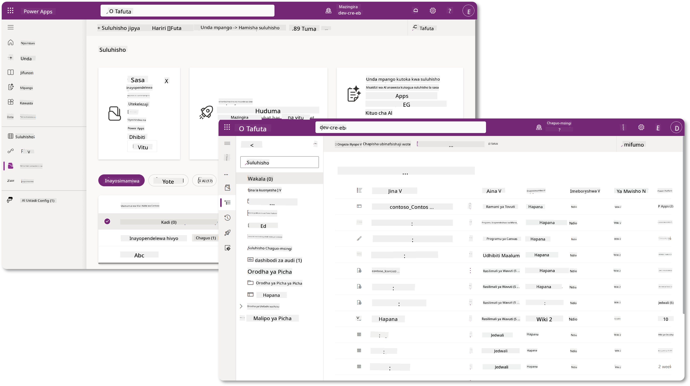

Katika Copilot Studio, sasa kuna **Solution Explorer** ambapo unaweza kusimamia suluhisho zako moja kwa moja. Huhitaji tena kubadilisha kwenda kwenye portal ya watengenezaji wa Power Apps kusimamia suluhisho zako, inaweza kufanyika moja kwa moja ndani ya Copilot Studio 🪄

Hii inamaanisha unaweza kufanya kazi za kawaida zinazohusiana na suluhisho:

- **Kuunda suluhisho** - suluhisho maalum huruhusu ajenti kuhamishwa na kuingizwa kati ya mazingira.
- **Kuweka suluhisho unalopendelea** - chagua suluhisho ambalo ajenti, programu, n.k. zitaundwa ndani yake kwa chaguo-msingi.
- **Kuongeza au kuondoa vipengele** - ajenti wako anaweza kuwa anarejelea vipengele vingine kama vile vigezo vya mazingira au mtiririko wa wingu. Kwa hivyo vipengele hivi vinahitaji kujumuishwa katika suluhisho.
- **Kuhamisha suluhisho** - kuhamisha suluhisho kwenda kwenye mazingira mengine.
- **Kuleta suluhisho** - kuleta suluhisho lililoundwa mahali pengine, ikiwa ni pamoja na kuboresha au kusasisha suluhisho.
- **Kuunda na kusimamia njia za suluhisho** - kuendesha kiotomatiki kupeleka suluhisho kati ya mazingira.
- **Muunganisho wa Git** - huruhusu watengenezaji kuunganisha suluhisho na hifadhi za Git kwa udhibiti wa toleo, ushirikiano na ALM. Inakusudiwa kutumika tu katika mazingira ya watengenezaji.

   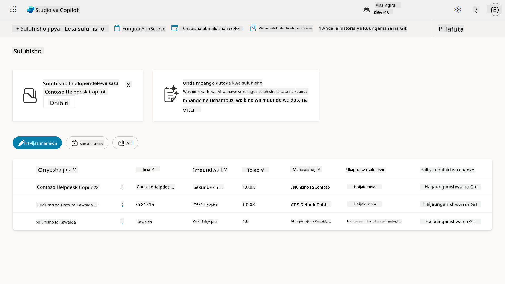

Kuna aina mbili za suluhisho:

- **Suluhisho zisizosimamiwa** - hutumika wakati wa maendeleo. Unaweza kuhariri na kubinafsisha kwa uhuru kadri inavyohitajika.
- **Suluhisho zinazosimamiwa** - hutumika wakati uko tayari kupeleka programu yako kwa majaribio au uzalishaji. Hizi zimefungwa ili kuzuia mabadiliko ya bahati mbaya.

## 🤔 Kwa nini _napaswa_ kutumia Suluhisho kwa ajenti wangu?

Fikiria Suluhisho kama _kifaa cha zana_. Unapohitaji kutengeneza au kujenga kitu (ajenti) katika eneo tofauti (mazingira), unakusanya zana zote muhimu (vipengele) na kuzitia kwenye kifaa chako cha zana (Suluhisho). Kisha unaweza kubeba kifaa hiki cha zana kwenda eneo jipya (mazingira) na kutumia zana (vipengele) kukamilisha kazi yako, au kuongeza zana mpya (vipengele) kubinafsisha ajenti wako au mradi unaojenga.

!!! quote "Elaiza, wakili wako wa wingu mwenye urafiki akijitokeza hapa 🙋🏻‍♀️ kushiriki maneno:"
    Tuna msemo huko New Zealand, "Kuwa Kiwi msafi!" ambayo ni wito wa kuchukua hatua kwa Wazelanders 🥝 kuwajibika kwa mazingira yao kwa kutupa takataka ipasavyo na kuweka maeneo ya umma safi. Tunaweza kutumia muktadha huo huo kwa ajenti kwa kuweka kila kitu kinachohusiana na ajenti wako kikiwa kimepangwa na kinachoweza kuhamishwa, na itakusaidia kudumisha mazingira safi.

Ni mazoea mazuri kuunda ajenti katika suluhisho maalum katika chanzo chako (mazingira ya watengenezaji). Hapa kuna sababu za thamani za suluhisho:

🧩 **Maendeleo yaliyopangwa**

- Unahifadhi ajenti wako tofauti na suluhisho la Default ambalo lina kila kitu katika mazingira. Vipengele vyote vya ajenti wako viko mahali pamoja 🎯

- Kila kitu unachohitaji kwa ajenti wako kiko katika suluhisho, na kufanya iwe rahisi kuhamisha na kuingiza kwenye mazingira lengwa 👉🏻 hii ni tabia nzuri ya ALM.

🧩 **Upelekaji salama**

- Unaweza kuhamisha programu au ajenti wako kama suluhisho lililosimamiwa na kupeleka kwenye mazingira mengine lengwa (kama vile majaribio au uzalishaji) bila kuhatarisha mabadiliko ya bahati mbaya.

🧩 **Udhibiti wa toleo**

- Unaweza kuunda viraka (marekebisho ya lengo), masasisho (mabadiliko makubwa zaidi) au maboresho (kubadilisha suluhisho - kwa kawaida mabadiliko makubwa na kuanzisha vipengele vipya).

- Husaidia kutoa mabadiliko kwa njia iliyodhibitiwa.

🧩 **Usimamizi wa utegemezi**

- Suluhisho hufuatilia ni sehemu zipi zinategemea nyingine. Hii inazuia kuvunja vitu unavyofanya mabadiliko.

🧩 **Ushirikiano wa timu**

- Watengenezaji na watengenezaji wanaweza kufanya kazi pamoja wakitumia suluhisho zisizosimamiwa katika maendeleo, kisha kuwasilisha suluhisho lililosimamiwa kwa upelekaji.

## 🪪 Kuelewa Wachapishaji wa Suluhisho

Mchapishaji wa Suluhisho katika Power Platform ni kama lebo au chapa inayotambulisha ni nani aliyeunda au kumiliki suluhisho. Ni sehemu ndogo lakini muhimu ya kusimamia programu zako, ajenti na ubinafsishaji wa mtiririko, hasa wakati wa kufanya kazi katika timu au katika mazingira tofauti.

Unapounda suluhisho, lazima uchague mchapishaji. Mchapishaji huyu hufafanua:

- Kiambishi awali kinachoongezwa kwa vipengele vyote maalum (fikiria meza, sehemu, na mtiririko).

- Jina na maelezo ya mawasiliano ya shirika au mtu anayemiliki suluhisho.

### 🤔 Kwa nini ni muhimu?

1. **Utambulisho rahisi** - kiambishi awali (Mfano - `new_` au `abc_`) hukusaidia kutambua haraka ni vipengele vipi vinavyohusiana na suluhisho au timu gani.

1. **Kuepuka migongano** - ikiwa timu mbili zinaunda safu inayoitwa hali, viambishi vyao (`teamA_status`, `teamB_status`) huzuia migongano ya majina.

1. **Inasaidia ALM** - wakati wa kuhamisha suluhisho kati ya mazingira (Maendeleo → Majaribio → Uzalishaji), mchapishaji husaidia kufuatilia umiliki na kudumisha uthabiti.

### ✨ Mfano

Tuseme unaunda mchapishaji anayeitwa Contoso Solutions na kiambishi awali `cts_`.

Ikiwa utaongeza safu maalum inayoitwa _Kipaumbele_, itahifadhiwa kama `cts_Priority` katika suluhisho.

Yeyote atakayekutana na safu hiyo katika kiwango cha suluhisho bila kujali yuko katika mazingira gani, anaweza kuitambua kwa urahisi kama safu inayohusiana na Contoso Solutions.

## 🧭 Mzunguko wa maisha wa Suluhisho la Power Platform

Sasa unaelewa madhumuni ya Suluhisho, hebu tujifunze kuhusu mzunguko wa maisha.

**1. Unda Suluhisho katika mazingira ya Maendeleo** - anza kwa kuunda suluhisho jipya katika mazingira yako ya Maendeleo.

**2. Ongeza Vipengele** - ongeza programu, mtiririko, meza, na vipengele vingine kwenye suluhisho lako.

**3. Hamisha kama suluhisho lililosimamiwa** - pakia suluhisho lako kwa upelekaji kwa kuhamisha kama suluhisho lililosimamiwa.

**4. Leta kwenye mazingira ya Majaribio** - jaribu suluhisho lako katika mazingira tofauti ya Majaribio ili kuhakikisha kila kitu kinafanya kazi kama inavyotarajiwa.

**5. Leta kwenye mazingira ya Uzalishaji** - peleka suluhisho lililojaribiwa kwenye mazingira yako ya moja kwa moja ya Uzalishaji.

**6. Tumia Viraka, Masasisho au Maboresho** - fanya maboresho au marekebisho ukitumia viraka, masasisho, au maboresho. 🔁 Rudia mzunguko!

### ✨ Mfano

Fikiria unajenga ajenti wa msaada wa IT kusaidia wafanyakazi na masuala kama matatizo ya kifaa, utatuzi wa mtandao, usanidi wa printa na zaidi.

- Unaanza katika mazingira ya Maendeleo ukitumia suluhisho lisilosimamiwa.

- Mara tu linapokuwa tayari, unalihamisha kama suluhisho lililosimamiwa na kuleta kwenye mazingira lengwa kama vile Majaribio ya Mfumo au Majaribio ya Kukubalika na Mtumiaji (UAT).

- Baada ya majaribio, unalihamisha kwenye mazingira ya Uzalishaji - yote bila kugusa toleo la awali la maendeleo.

## 🧪 Maabara 04: Unda Suluhisho Jipya

Sasa tunakwenda kujifunza

- [4.1 Jinsi ya kuunda mchapishaji wa Suluhisho](../../../../../docs/recruit/04-creating-a-solution)
- [4.2 Jinsi ya kuunda Suluhisho](../../../../../docs/recruit/04-creating-a-solution)

Tutafuata mfano kutoka awali, ambapo tutaunda suluhisho katika mazingira maalum ya Copilot Studio ili kujenga ajenti wetu wa msaada wa IT ndani yake.

Tuanzishe!

### Mahitaji ya awali

#### Jukumu la usalama

Katika Copilot Studio, kile unachoweza _kufanya_ katika Solution Explorer kinategemea jukumu lako la usalama wa mtumiaji.
Ikiwa huna ruhusa ya kusimamia suluhisho katika kituo cha usimamizi cha Power Apps, hutaweza kufanya kazi hizo katika Copilot Studio pia.

Ili kuhakikisha kila kitu kinafanya kazi vizuri, hakikisha una majukumu sahihi ya usalama na ruhusa. Au ikiwa husimamia mazingira katika shirika lako, omba msimamizi wako wa IT (au timu inayofanana) inayosimamia mazingira/tenant yako.

Haya ni majukumu ya usalama yanayowezesha watumiaji kuunda suluhisho katika mazingira yao.

| Jukumu la usalama    | Maelezo |
| ---------- | ---------- |
| Mtengenezaji wa Mazingira | Hutoa ruhusa muhimu za kuunda, kubinafsisha, na kusimamia rasilimali ndani ya mazingira maalum, ikiwa ni pamoja na suluhisho  |
| Mbadilishaji wa Mfumo  | Ruhusa pana zaidi kuliko Mtengenezaji wa Mazingira, ikiwa ni pamoja na uwezo wa kubinafsisha mazingira na kusimamia majukumu ya usalama |
| Msimamizi wa Mfumo   | Kiwango cha juu zaidi cha ruhusa na anaweza kusimamia vipengele vyote vya mazingira, ikiwa ni pamoja na kuunda na kupeana majukumu ya usalama     |

#### Mazingira ya watengenezaji

Hakikisha unabadilisha kwenda kwenye mazingira yako maalum ya watengenezaji, rejelea [Somo 00 - Usanidi wa Kozi - Hatua ya 3: Unda mazingira mapya ya watengenezaji](../00-course-setup/README.md#step-3-create-new-developer-environment).

1. Kwenye kona ya juu kulia, chagua ikoni ya **Gurudumu la Cog** na ubadilishe kutoka kwenye mazingira ya chaguo-msingi kwenda kwenye mazingira yako, kwa mfano **Mazingira ya Adele Vance**.

    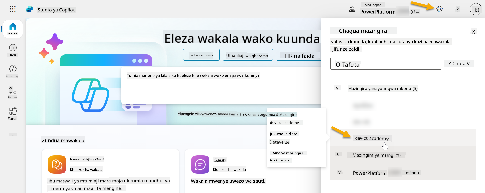

### 4.1 Unda mchapishaji wa Suluhisho

1. Ukizingatia mazingira yale yale ya Copilot Studio yaliyotumika katika somo la awali, chagua ikoni ya **alama ya nukta tatu (. . .)** kwenye menyu ya upande wa kushoto katika Copilot Studio. Chagua **Suluhisho** chini ya kichwa cha **Chunguza**.

    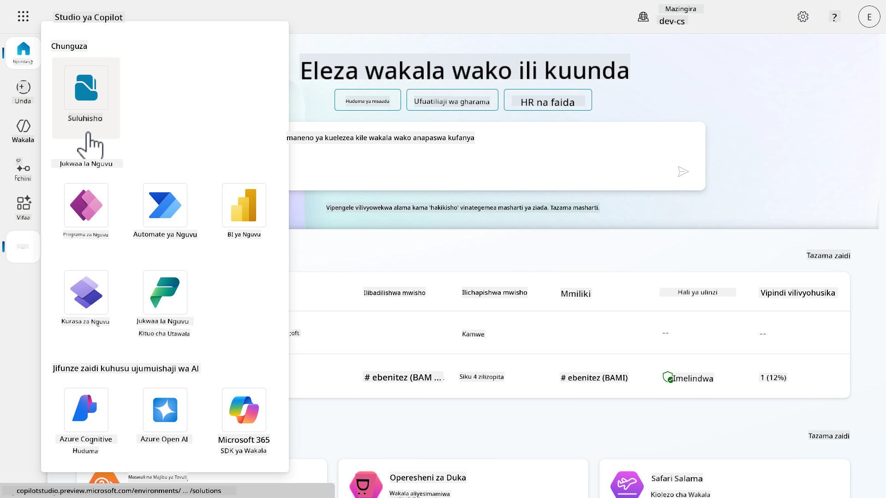

1. **Solution Explorer** katika Copilot Studio itapakia. Chagua **+ Suluhisho Jipya**

    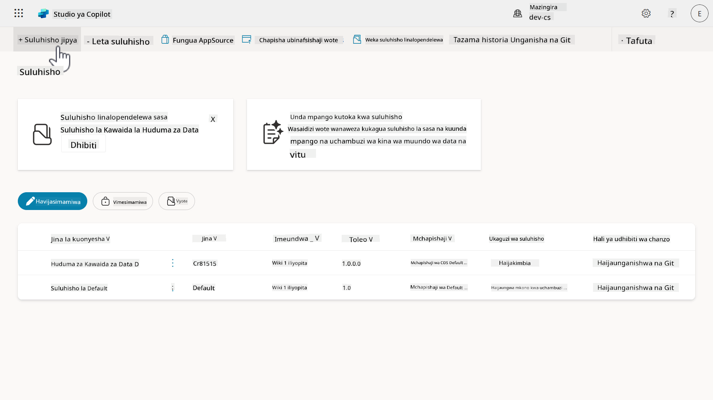

1. Kidirisha cha **Suluhisho Jipya** kitaonekana ambapo tunaweza kufafanua maelezo ya suluhisho letu. Kwanza, tunahitaji kuunda mchapishaji mpya. Chagua **+ Mchapishaji Mpya**.

    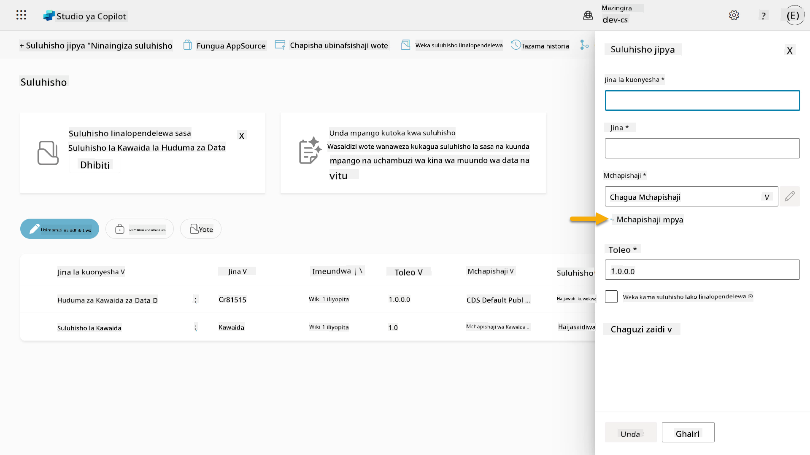  

1. Kichupo cha **Mali** cha kidirisha cha **Mchapishaji Mpya** kitaonekana na sehemu zinazohitajika na zisizohitajika za kujazwa katika kichupo cha **Mali**. Hapa ndipo tunaweza kuelezea maelezo ya mchapishaji ambayo yatatumika kama lebo au chapa inayotambulisha ni nani aliyeunda au kumiliki suluhisho.

    | Mali    | Maelezo | Inahitajika |
    | ---------- | ---------- | :----------: |
    | Jina la Kuonyesha | Jina la kuonyesha kwa mchapishaji | Ndiyo   |
    | Jina  | Jina la kipekee na jina la schema kwa mchapishaji  | Ndiyo    |
    | Maelezo   | Inaelezea madhumuni ya suluhisho    | Hapana     |
    | Kiambishi awali    | Kiambishi awali cha mchapishaji ambacho kitatumika kwa vipengele vipya vilivyoundwa   | Ndiyo      |
    | Kiambishi awali cha thamani ya chaguo   | Hutengeneza namba kulingana na kiambishi awali cha mchapishaji. Namba hii hutumika unapoongeza chaguo kwa chaguo na hutoa kiashiria cha suluhisho kilichotumika kuongeza chaguo.   | Ndiyo      |

    Nakili na ubandike yafuatayo kama **Jina la Kuonyesha**,

    ```text
    Contoso Solutions
    ```

    Nakili na ubandike yafuatayo kama **Jina**,

    ```text
    ContosoSolutions
    ```

    Nakili na ubandike yafuatayo kama **Maelezo**,

    ```text
    Copilot Studio Agent Academy
    ```

    Nakili na ubandike yafuatayo kwa **Kiambishi awali**,

    ```text
    cts
    ```

    Kwa chaguo-msingi, **Kiambishi cha thamani ya chaguo** kitaonyesha thamani ya namba. Sasisha thamani hii ya namba hadi elfu ya karibu zaidi. Kwa mfano, katika picha yangu hapa chini, awali ilikuwa `77074`. Sasisha hii kutoka `77074` hadi `77000`.

    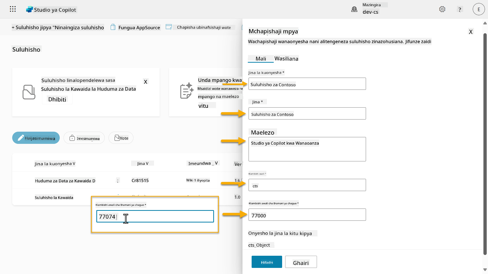  

1. Ikiwa unataka kutoa maelezo ya mawasiliano kwa Suluhisho, chagua kichupo cha **Mawasiliano** na ujaze safu zifuatazo zilizoonyeshwa.

    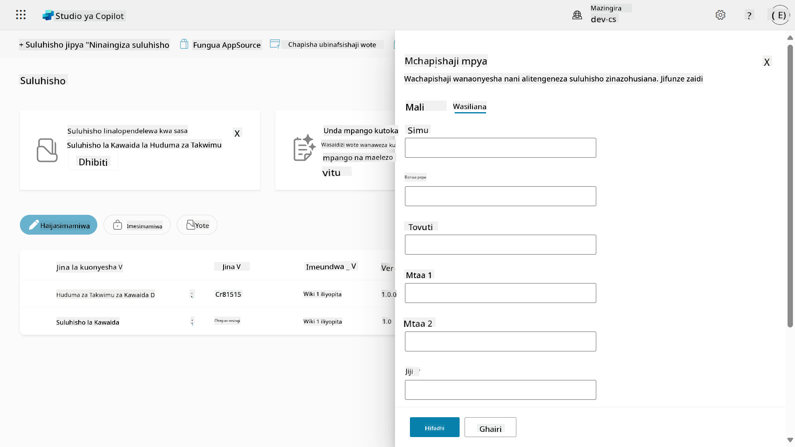

1. Chagua kichupo cha **
1. Dirisha la **Mchapishaji Mpya** litafungwa na utarudishwa kwenye dirisha la **Suluhisho Jipya** na Mchapishaji ulioumbwa hivi punde ukiwa umechaguliwa.

    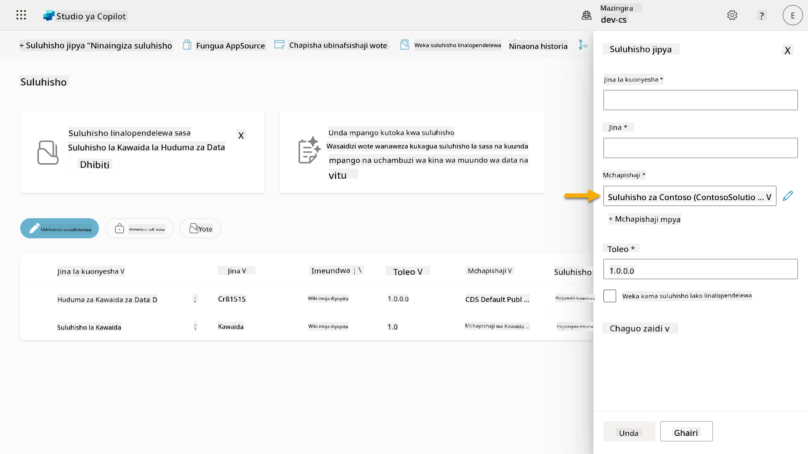  

Hongera, sasa umeunda Mchapishaji wa Suluhisho! 🙌🏻 Sasa tutajifunza jinsi ya kuunda suluhisho jipya la kawaida.

### 4.2 Unda Suluhisho Jipya

1. Sasa kwa kuwa tumeunda wachapishaji wetu, tunaweza kukamilisha sehemu iliyobaki kwenye dirisha la **Suluhisho Jipya**.

    Nakili na ubandike yafuatayo kama **Jina la Kuonyesha**,

    ```text
    Contoso Helpdesk Agent
    ```

    Nakili na ubandike yafuatayo kama **Jina**,

    ```text
    ContosoHelpdeskAgent
    ```

    Kwa kuwa tunaunda suluhisho jipya, [**Nambari ya Toleo**](https://learn.microsoft.com/power-apps/maker/data-platform/update-solutions#understanding-version-numbers-for-updates/?WT.mc_id=power-172615-ebenitez) kwa chaguo-msingi itakuwa `1.0.0.0`.

    Weka tiki kwenye kisanduku cha **Weka kama suluhisho unalopendelea**.

    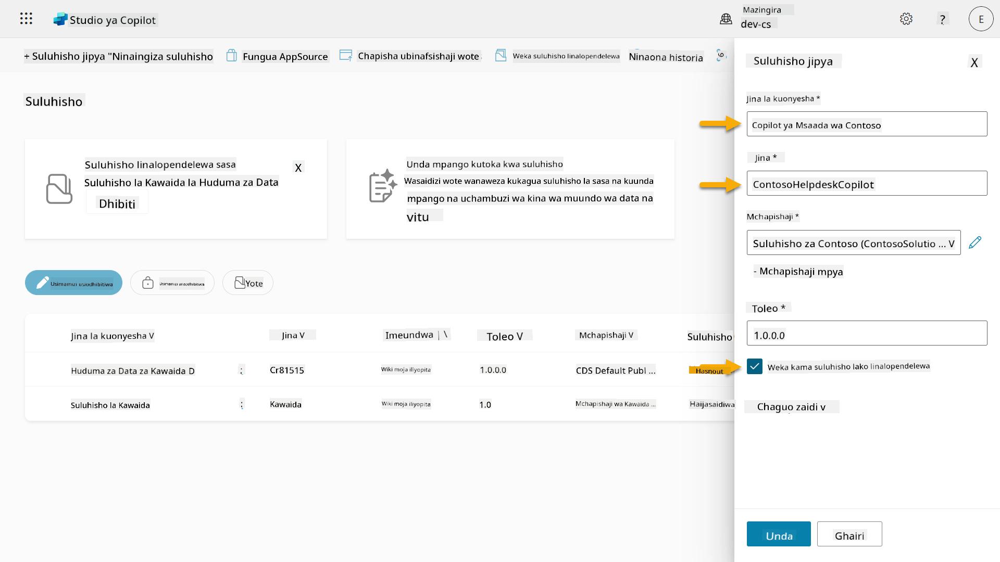  

1. Panua sehemu ya **Chaguo Zaidi** ili kuona maelezo ya ziada yanayoweza kutolewa kwenye suluhisho.

    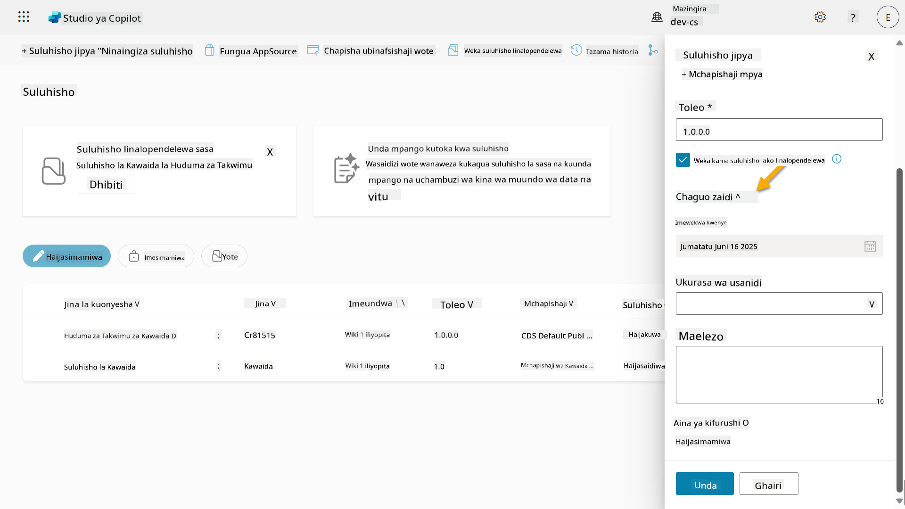

1. Utaona yafuatayo,

    - **Imewekwa tarehe** - tarehe ambayo Suluhisho liliwekwa.

    - **Ukurasa wa usanidi** - watengenezaji huanzisha rasilimali ya wavuti ya HTML kusaidia watumiaji kuingiliana na programu yao, wakala au zana ambapo itaonekana kama ukurasa wa wavuti katika sehemu ya Taarifa ikiwa na maelekezo au vitufe. Hii hutumiwa zaidi na makampuni au watengenezaji wanaojenga na kushiriki suluhisho na wengine.

    - **Maelezo** - inaelezea suluhisho au maelezo ya jumla ya ukurasa wa usanidi.

    Tutaacha haya yakiwa tupu kwa mafunzo haya.

    Chagua **Unda**.

    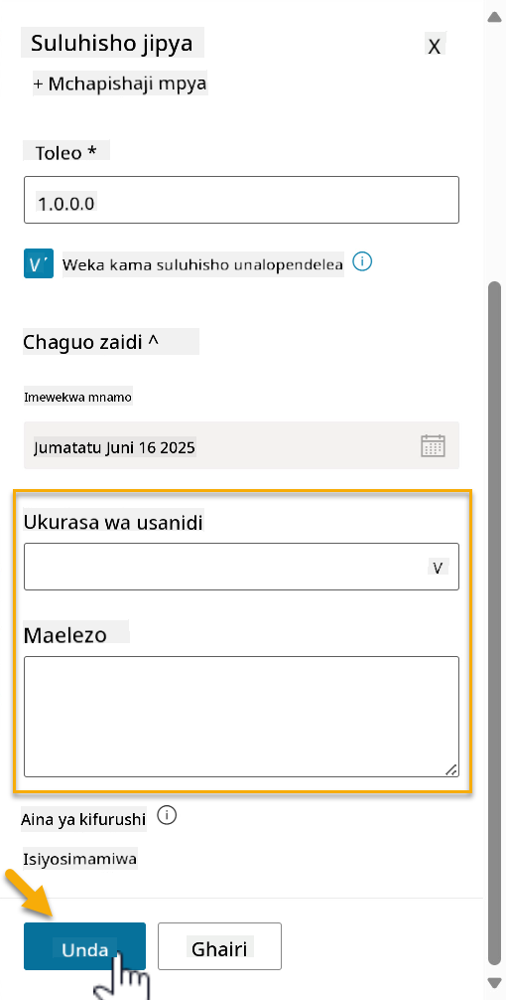

1. Suluhisho la Contoso Helpdesk Agent sasa limeundwa. Hakutakuwa na vipengele vyovyote hadi tutakapounda wakala katika Copilot Studio.

    Chagua ikoni ya **mshale wa kurudi nyuma** ili kurudi kwenye Kichunguzi cha Suluhisho.

    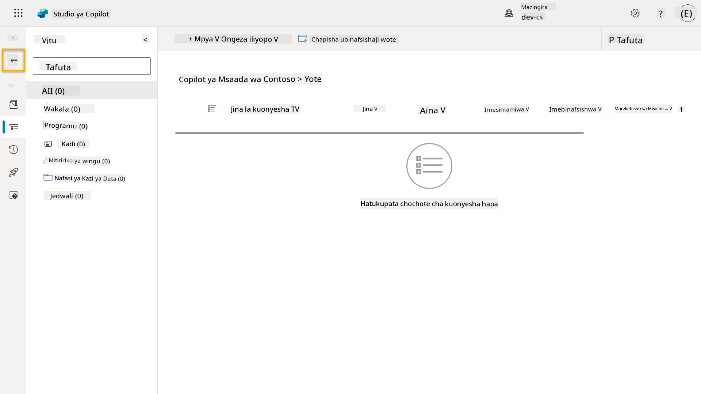

1. Angalia jinsi Contoso Helpdesk Agent sasa inaonyeshwa kama **Suluhisho Unalopendelea kwa Sasa** kwa sababu tuliweka tiki kwenye kisanduku cha **Weka kama suluhisho unalopendelea** hapo awali.

    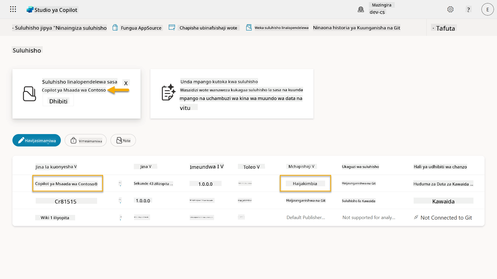

## ✅ Kazi Imekamilika

Hongera! 👏🏻 Umeunda Mchapishaji na kuutumia katika Suluhisho lako jipya ili kujenga wakala wako!

Kazi nzuri, Mtengenezaji wa Wakala. Hatua ya kwanza ya kuwa na ufanisi kwa kiwango kikubwa ni kuwa na alama safi ya kidijitali. Sasa una zana na mtazamo wa maendeleo endelevu ya wakala wa kiwango cha biashara.

Hii ni mwisho wa **Mafunzo 04 - Kuunda Suluhisho**, chagua kiungo kilicho hapa chini ili kuendelea na somo linalofuata. Suluhisho lako lililoundwa katika mafunzo haya litatumika katika mafunzo ya somo linalofuata.

⏭️ [Nenda kwenye somo la **Anza haraka na mawakala waliotengenezwa tayari**](../05-using-prebuilt-agents/README.md)

## 📚 Rasilimali za Kimbinu

🔗 [Unda suluhisho](https://learn.microsoft.com/power-apps/maker/data-platform/create-solution/?WT.mc_id=power-172615-ebenitez)

🔗 [Unda na simamia suluhisho katika Copilot Studio](https://learn.microsoft.com/microsoft-copilot-studio/authoring-solutions-overview/?WT.mc_id=power-172615-ebenitez)

🔗 [Shiriki mawakala na watumiaji wengine](https://learn.microsoft.com/microsoft-copilot-studio/admin-share-bots/?WT.mc_id=power-172615-ebenitez)

🔗 [Muhtasari wa rasilimali zinazopatikana kwa majukumu ya usalama yaliyotangulia kufafanuliwa](https://learn.microsoft.com/power-platform/admin/database-security#summary-of-resources-available-to-predefined-security-roles/?WT.mc_id=power-172615-ebenitez)

🔗 [Boresha au sasisha suluhisho](https://learn.microsoft.com/power-apps/maker/data-platform/update-solutions/?WT.mc_id=power-172615-ebenitez)

🔗 [Muhtasari wa mabomba katika Power Platform](https://learn.microsoft.com/power-platform/alm/pipelines/?WT.mc_id=power-172615-ebenitez)

🔗 [Muhtasari wa ujumuishaji wa Git katika Power Platform](https://learn.microsoft.com/power-platform/alm/git-integration/overview/?WT.mc_id=power-172615-ebenitez)


---

**Kanusho**:  
Hati hii imetafsiriwa kwa kutumia huduma ya tafsiri ya AI [Co-op Translator](https://github.com/Azure/co-op-translator). Ingawa tunajitahidi kwa usahihi, tafadhali fahamu kuwa tafsiri za kiotomatiki zinaweza kuwa na makosa au kutokuwa sahihi. Hati ya asili katika lugha yake ya awali inapaswa kuzingatiwa kama chanzo cha mamlaka. Kwa taarifa muhimu, tafsiri ya kitaalamu ya binadamu inapendekezwa. Hatutawajibika kwa kutoelewana au tafsiri zisizo sahihi zinazotokana na matumizi ya tafsiri hii.