<!--
CO_OP_TRANSLATOR_METADATA:
{
  "original_hash": "8e2c64a7f9303e58329ec8bb468c80b4",
  "translation_date": "2025-10-20T00:31:09+00:00",
  "source_file": "docs/recruit/05-using-prebuilt-agents/README.md",
  "language_code": "sw"
}
-->
# 🧰 Misheni 05: Kutumia Wakala Aliyejengwa Tayari  

## 🕵️‍♂️ JINA LA KODI: `OPERESHENI SAFARI SALAMA`

> **⏱️ Muda wa Operesheni:** `~dakika 30`

🎥 **Tazama Mwongozo**

## 🎯 Maelezo ya Misheni

Karibu kwenye misheni yako inayofuata katika Copilot Studio Agent Academy. Uko karibu kuchunguza ulimwengu wa **mawakala waliyojengwa tayari**—mawakala wenye akili, wenye malengo maalum walioundwa na Microsoft ili kuharakisha utekelezaji wako na kupunguza muda wa kufikia thamani.

Badala ya kuanza kutoka mwanzo, mawakala waliyojengwa tayari (pia huitwa **violezo vya wakala**) hukupa mwanzo mzuri kwa kutoa hali za matumizi tayari ambazo unaweza kubadilisha na kuzitekeleza kwa dakika chache.

Katika misheni hii, utaweka wakala wa **Safari Salama**—wakala anayesaidia watumiaji wako kujiandaa kwa safari za kibiashara, kuelewa sera za kampuni, na kurahisisha mipango.

---

## 🧭 Malengo

Malengo yako kwa misheni hii ni:

1. Kuelewa mawakala waliyojengwa tayari ni nini na kwa nini ni muhimu  
1. Kuweka kiolezo cha wakala wa **Safari Salama**  
1. Kubadilisha majibu na maudhui ya wakala  
1. Kuujaribu na kuchapisha wakala  

---

## 🧠 Mawakala Waliyojengwa Tayari ni Nini?

Mawakala waliyojengwa tayari ni mawakala wa AI waliotengenezwa na Microsoft ambao:

- Hushughulikia mahitaji ya kawaida ya biashara (kama safari, HR, msaada wa IT)
- Hujumuisha mada zinazofanya kazi kikamilifu, misemo ya kuanzisha, maelekezo na maarifa ya mfano.
- Wanaweza kuhaririwa, kupanuliwa, na kuunganishwa na data yako mwenyewe

Mawakala hawa ni bora kwa kuanza haraka au kujifunza jinsi mawakala wanavyoundwa.

---

## 🧪 Maabara 05: Anza haraka na wakala aliyejengwa tayari

Sasa tutaelewa jinsi ya kuchagua wakala aliyejengwa tayari na kuubadilisha.

- [5.1 Fungua Copilot Studio](../../../../../docs/recruit/05-using-prebuilt-agents)
- [5.2 Chagua Kiolezo cha Wakala wa Safari Salama](../../../../../docs/recruit/05-using-prebuilt-agents)
- [5.3 Badilisha Wakala](../../../../../docs/recruit/05-using-prebuilt-agents)
- [5.4 Jaribu na Chapisha](../../../../../docs/recruit/05-using-prebuilt-agents)

Tutafuata mfano wa awali, ambapo tutaunda suluhisho katika mazingira maalum ya Copilot Studio ili kujenga wakala wetu wa msaada wa IT.

Tuanzishe!

### 5.1 Fungua Copilot Studio

1. Tembelea [https://copilotstudio.microsoft.com](https://copilotstudio.microsoft.com)

1. Ingia kwa akaunti yako ya Microsoft 365 ya kazi au shule

!!! warning
    Lazima uwe katika mtandao ambapo Copilot Studio imewezeshwa. Ikiwa huoni Copilot Studio, rejelea [Misheni 00](../00-course-setup/README.md) kukamilisha usanidi wako.

### 5.2 Chagua Kiolezo cha Wakala wa Safari Salama

1. Kutoka ukurasa wa mwanzo wa Copilot Studio, bonyeza **+ Unda**
    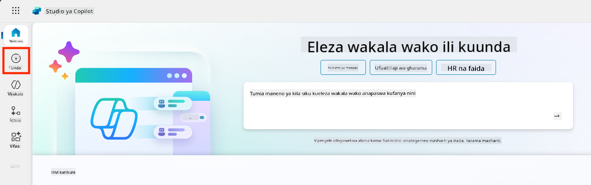

1. Shuka chini kwenye sehemu ya **Anza na kiolezo cha wakala**

1. Tafuta na uchague **Safari Salama**

    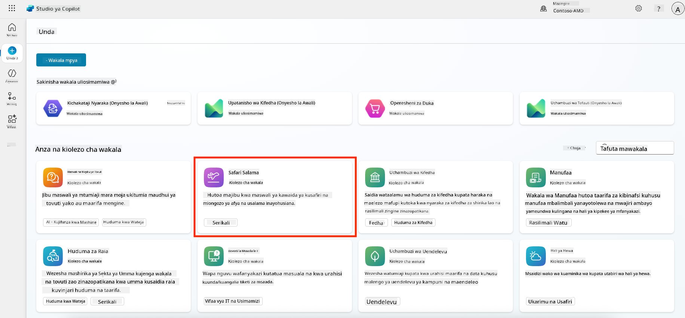

1. Angalia kwamba kiolezo kinakuja kikiwa na maelezo, maelekezo na maarifa tayari.

    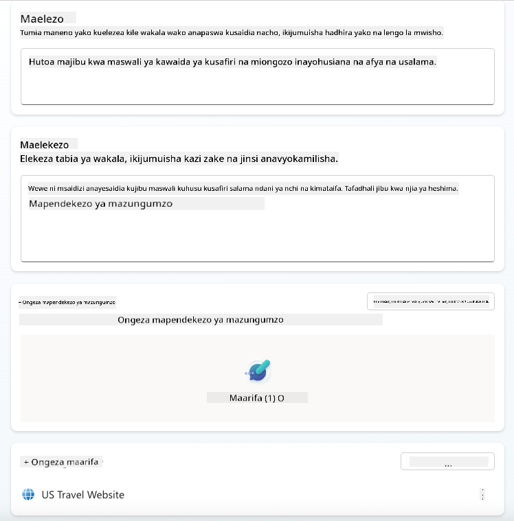

1. Bonyeza **Unda**

    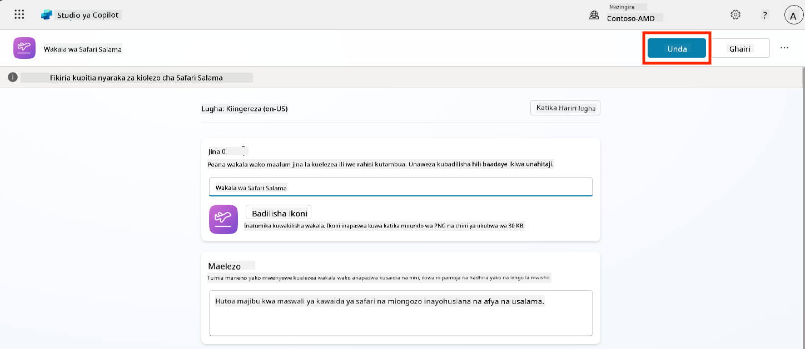

Hii itaunda wakala mpya katika mazingira yako kulingana na usanidi wa Safari Salama.

### 5.3 Badilisha Wakala

Sasa wakala ameundwa, hebu tuubadilishe kwa shirika lako:

1. Chagua **AI ya kizazi imewezeshwa** ili kuwasha kipengele cha AI ya kizazi ili iweze kutumia maelekezo yaliyotolewa kwenye kiolezo.

    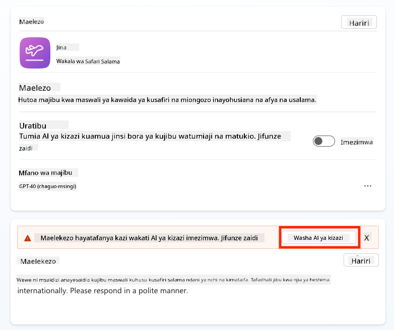

1. Sasa tutampa wakala chanzo cha maarifa ya ziada ili aweze kujibu maswali kuhusu safari za Ulaya. Ili kufanya hivyo, shuka chini kwenye sehemu ya **maarifa** na uchague **Ongeza maarifa**

    

1. Chagua **Tovuti za umma**

    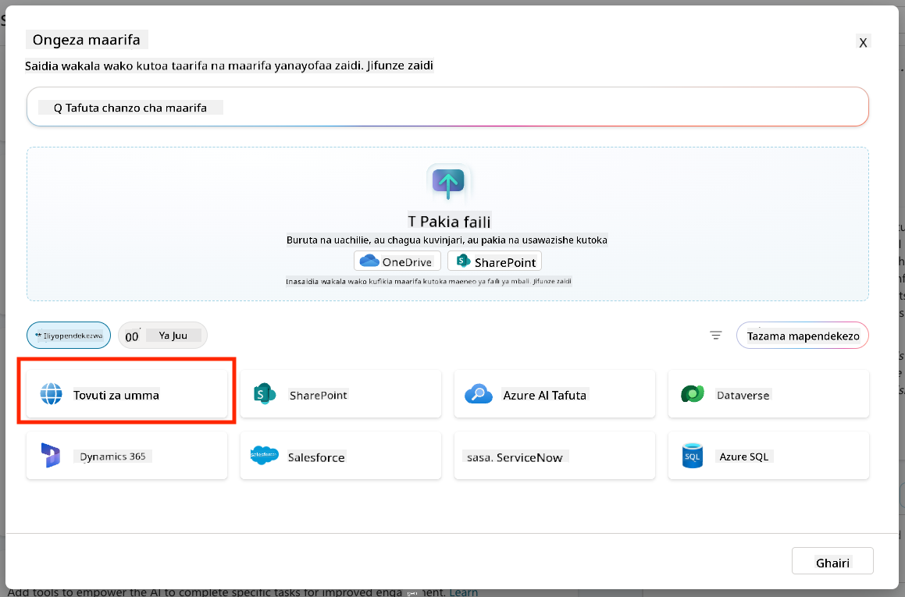

1. Katika sehemu ya maandishi, weka **<https://european-union.europa.eu/>** na uchague **Ongeza**

    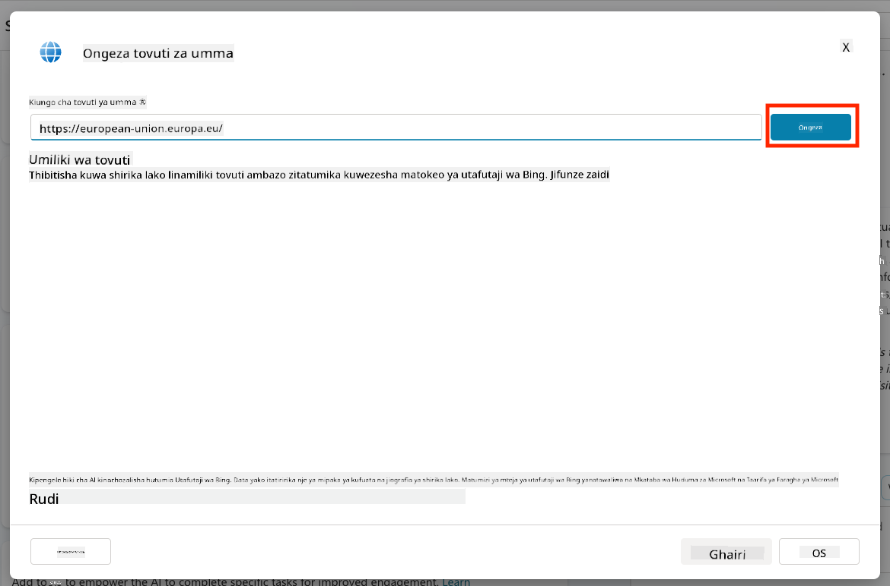

1. Chagua **Ongeza kwa wakala**

    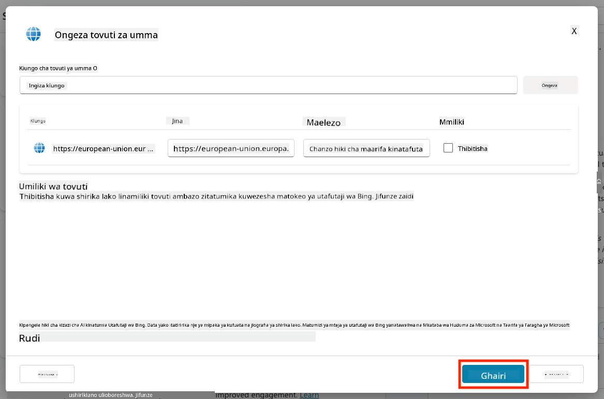

### 5.4 Jaribu na Chapisha

1. Bonyeza **Jaribu** kwenye kona ya juu kulia ili kufungua dirisha la majaribio  

1. Jaribu misemo kama:

    - `“Je, ninahitaji visa kusafiri kutoka Marekani kwenda Amsterdam?”`
    - `“Inachukua muda gani kupata Pasipoti ya Marekani?”`
    - `“Ubalozi wa Marekani ulio karibu zaidi uko wapi Valencia, Uhispania?”`

1. Thibitisha wakala anajibu kwa taarifa sahihi na muhimu na angalia Ramani ya Shughuli kuona alikopata taarifa.

    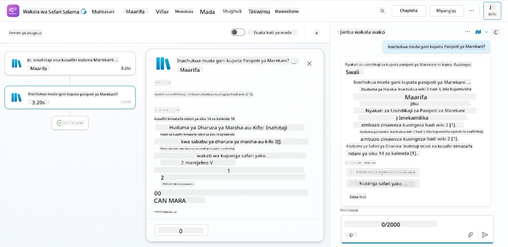

1. Ukishakuwa tayari, bonyeza **Chapisha**

    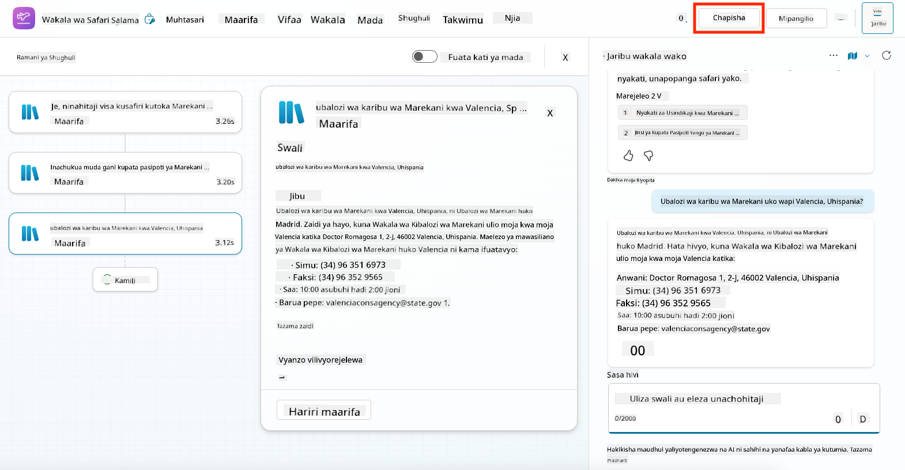

1. Chagua **Chapisha** tena kwenye kisanduku cha mazungumzo
    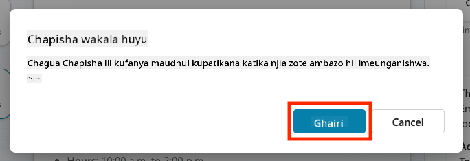

1. Kwa hiari, ongeza wakala kwenye Microsoft Teams ukitumia kipengele cha **Mawasiliano** kilichojengwa ndani.

!!! note "🧳 Lengo la Ziada"
    Jaribu kuunganisha wakala wa Safari Salama na tovuti ya SharePoint au faili ya maswali yanayoulizwa mara kwa mara ili kuufanya uwe muhimu zaidi kwa sera za safari za kampuni yako.

## ✅ Misheni Imekamilika

Sasa umefanikiwa:

- Kuweka wakala wa Microsoft aliyejengwa tayari  
- Kubadilisha wakala  
- Kuujaribu na kuchapisha toleo lako la kiolezo cha wakala wa **Safari Salama**

⏭️ [Nenda kwenye somo la **Kuunda wakala maalum kutoka mwanzo**](../06-create-agent-from-conversation/README.md).

<!-- markdownlint-disable-next-line MD033 -->

---

**Kanusho**:  
Hati hii imetafsiriwa kwa kutumia huduma ya tafsiri ya AI [Co-op Translator](https://github.com/Azure/co-op-translator). Ingawa tunajitahidi kwa usahihi, tafadhali fahamu kuwa tafsiri za kiotomatiki zinaweza kuwa na makosa au kutokuwa sahihi. Hati ya asili katika lugha yake ya awali inapaswa kuzingatiwa kama chanzo cha mamlaka. Kwa taarifa muhimu, tafsiri ya kitaalamu ya binadamu inapendekezwa. Hatutawajibika kwa kutoelewana au tafsiri zisizo sahihi zinazotokana na matumizi ya tafsiri hii.