<!--
CO_OP_TRANSLATOR_METADATA:
{
  "original_hash": "180f9cc0b40527f61be092c9b0f72aba",
  "translation_date": "2025-10-20T00:51:13+00:00",
  "source_file": "docs/recruit/06-create-agent-from-conversation/README.md",
  "language_code": "sw"
}
-->
# 🚨 Misheni 06: Unda wakala maalum kwa kutumia lugha ya kawaida na Copilot na kuunganisha na data zako

## 🕵️‍♂️ JINA LA KODI: `OPERESHENI WAKALA FORGE`

> **⏱️ Muda wa Operesheni:** `~75 dakika`

🎥 **Tazama Mwongozo**

[](https://www.youtube.com/watch?v=qZTtQVncGFg "Tazama mwongozo kwenye YouTube")

## 🎯 Maelezo ya Misheni

Karibu tena, Mtengenezaji wa Wakala. Misheni hii inakupa nafasi ya kuongoza uwezo mkubwa zaidi wa Copilot Studio - kuunda wakala maalum kutoka mwanzo kwa kutumia lugha ya kawaida… na kuimarisha kwa data zako mwenyewe.

Hii si chatbot ya kawaida tu. Unajenga mfanyakazi wa kidijitali mwenye maarifa - mmoja ambaye anaweza kufikiri, kujibu, na kurejelea taarifa halisi za kampuni.

Silaha yako ya kuchagua? Lugha ya kawaida. Misheni yako? Buni, fundisha, na jaribu wakala wa msaada wa IT uliobinafsishwa kikamilifu ambaye anajibu maswali kwa kutumia SharePoint, faili zilizopakiwa, au URL za kampuni.

Hebu tujenge wakala wako kutoka mwanzo.

## 🔎 Malengo

Katika misheni hii, utajifunza:

1. Kuelewa wakala maalum ni nini na jinsi wanavyotofautiana na templeti zilizojengwa tayari.
1. Kuunda mawakala kwa kutumia maelezo ya lugha ya kawaida na muundo wa mazungumzo na Copilot.
1. Kuunganisha mawakala na vyanzo vya maarifa vya kampuni ikiwa ni pamoja na SharePoint, nyaraka, na tovuti.
1. Kujifunza kuhusu uratibu wa kizazi na jinsi mawakala wanavyotafuta na kujibu kwa kutumia vyanzo mbalimbali vya data.
1. Kujenga na kujaribu wakala wa msaada wa IT uliokamilika kikamilifu ambaye anaweza kujibu maswali kutoka data zako mwenyewe.

## 🤔 Wakala _maalum_ ni nini?

Wakala maalum ni chatbot au msaidizi wa kidijitali unayebuni na kuunda katika Copilot Studio ili kuwasaidia watumiaji na majukumu au maswali maalum. Unaitwa maalum kwa sababu:

- **Wewe unaamua kusudi** - kusaidia watumiaji kuomba likizo, kuangalia hali ya oda, kutoa msaada kwa maswali yanayohusiana na IT.
- **Wewe unafafanua mazungumzo** - kile wakala anachosema na jinsi anavyopaswa kujibu.
- **Unauunganisha na data zako mwenyewe** - unganisha na data ya kampuni yako kupitia vyanzo vya maarifa vilivyowekwa.
- **Unauunganisha na mifumo au programu zako mwenyewe** - chagua kutoka kwa viunganishi, mtiririko, REST APIs na seva za muktadha wa modeli.

!!! note
    Fikiria hivi: unajenga msaidizi wako wa kidijitali ambaye anaweza kuzungumza na watumiaji na kukamilisha majukumu kwa ajili yao kama vile kujibu maswali, kukusanya taarifa zinazohitajika na mchakato, au kuunganisha na data ya kampuni yako.

### 🤖 Wakala maalum anaweza kufanya nini?

Wakala maalum anaweza kutimiza yafuatayo:

- Kuuliza watumiaji taarifa kama majina, tarehe, au mapendeleo.
- Kuhifadhi taarifa hizo kwenye hifadhidata au jedwali.
- Kutafuta data kulingana na maswali yaliyoulizwa na kuyajibu.
- Kufanya kazi kwa uhuru bila watumiaji kuingiliana moja kwa moja na wakala.
- Kuchochea vitendo kwa ombi kupitia mwingiliano wa moja kwa moja wa mtumiaji au kwa uhuru kama vile kutuma barua pepe au kuunda rekodi.

### 👩🏻‍💻 Kwa nini utumie wakala maalum?

- Huokoa muda kwa kuondoa majukumu yanayojirudia.
- Huwapa watumiaji uzoefu wa kirafiki na wa kuongozwa.
- Unaweza kuubinafsisha kulingana na mahitaji ya biashara au mradi wako.

### ✨ Mfano

Unaunda wakala maalum ambaye husaidia wafanyakazi kuomba likizo.

Anawauliza majina yao, tarehe za likizo, na jina la meneja wao, kisha huhifadhi taarifa hizo kwenye mfumo uliotengwa wa kusimamia maombi ya likizo, kama orodha ya SharePoint.

Sasa, badala ya kuingia kwenye orodha ya SharePoint na kuunda kipengee kipya, wafanyakazi wanazungumza tu na wakala.

## 🗣️ Tumia lugha ya kawaida kuunda mawakala

Hapo awali ulijifunza jinsi ya kuunda mawakala haraka katika Copilot Studio kwa kutumia templeti za wakala zilizojengwa tayari katika [Somo la 05 - Anza haraka na mawakala waliotengenezwa tayari](../05-using-prebuilt-agents/README.md). Katika somo hili, tutachunguza uzoefu wa uundaji wa mazungumzo na Copilot. Copilot Studio hufanya iwe rahisi kuunda mawakala kwa kuzungumza na Copilot, kama vile kuwa na mazungumzo.

Katika Copilot Studio, huhitaji kuandika msimbo ili kuunda wakala. Badala yake, unafafanua unachotaka wakala wako afanye kwa lugha ya kawaida, na Copilot hukusaidia kuunda hatua kwa hatua kupitia uzoefu wa mazungumzo.

## 🌱 Lakini mimi ni mgeni kwa "kufafanua ninachotaka" - nifanye nini?

Kufafanua kwa lugha ya kawaida ili kuunda wakala maalum inaweza kuwa dhana mpya kwako. Wakati wowote unapotumia Copilot katika bidhaa na huduma za Microsoft, unatumia lugha ya kawaida kwa namna ya _maelezo_.

Maelezo ni ujumbe au maelekezo unayotoa kwa wakala wa AI kumwambia unachotaka afanye. Fikiria kama kutoa maelekezo kwa msaidizi. Kadri maelekezo yako yanavyokuwa wazi, ndivyo msaidizi wako anavyoweza kuelewa na kutekeleza.

### 🪄 Kwa nini Maelezo ni muhimu

- Yanatoa mwongozo wa tabia ya wakala.
- Yanamsaidia wakala kuelewa aina ya mazungumzo ya kuwa nayo.
- Maelezo mazuri hufanya wakala kuwa na msaada zaidi na sahihi.

### 📝 Vidokezo vya kuandika maelezo mazuri

- Kuwa wazi na maalum - sema hasa unachotaka wakala afanye.
- Fikiria kama mtumiaji - mtumiaji atasema nini? Wakala anapaswa kujibu nini?
- Jumuisha mifano - ikiwezekana, toa mfano wa mwingiliano.

### ✨ Mfano

Tuseme timu ya HR inahitaji wakala kusaidia na maombi ya likizo.

Maelezo yanaweza kuwa,

    “Nataka kuunda wakala anayesaidia watumiaji kuwasilisha ombi la likizo. Wakati mtumiaji anasema wanataka kuomba likizo, wakala anapaswa kuuliza jina lao, tarehe ya kuanza likizo, tarehe ya kumaliza likizo, na jina la meneja wao. Mara mtumiaji anapotoa taarifa hii, wakala anapaswa kuihifadhi kwenye orodha ya SharePoint inayoitwa ‘Maombi ya Likizo’ na kutuma taarifa kwenye kituo maalum cha Microsoft Teams.”

Kwa nini maelezo haya yanafanya kazi:

- **Yanafafanua lengo wazi** - kuwasilisha ombi la likizo.
- **Yanaelezea mwingiliano wa mtumiaji** - kile mtumiaji anasema na kile wakala anapaswa kuuliza.
- **Yanaorodhesha data inayohitajika** - jina, tarehe ya kuanza, tarehe ya kumaliza, meneja.
- **Yanatamka mahali data inakwenda** - orodha ya SharePoint inayoitwa Maombi ya Likizo.

## 🔮 OK, nimeunda wakala wangu... sasa ninawezaje kuunganisha na maarifa?

Katika Copilot Studio, vyanzo vya maarifa ni sehemu ambapo wakala wako anaweza kupata taarifa ili kutoa majibu bora. Unapoongeza vyanzo hivi, wakala wako anaweza kuleta data ya kampuni yako kutoka sehemu kama Power Platform, Dynamics 365, tovuti, na mifumo au huduma nyingine zinazotumiwa na kampuni yako.

Vyanzo hivi hufanya kazi pamoja na AI kusaidia wakala wako kujibu maswali ya watumiaji kwa usahihi zaidi, hili linafanyika kupitia kile kinachojulikana kama **uratibu wa kizazi**.

### 🌿 Uratibu wa kizazi ni nini katika muktadha wa mawakala?

Uratibu wa kizazi unamaanisha wakala hutumia AI kuamua kwa nguvu jinsi ya kujibu swali kwa kuunganisha ujuzi wake wa lugha na taarifa kutoka kwa vyanzo vya maarifa ulivyoongeza.

Wakati mtumiaji anapouliza swali, wakala:

- Huelewa swali kwa kutumia AI.
- Anaweza kuuliza watumiaji taarifa zinazokosekana kwa kuunda maswali papo hapo.
- Huchagua vyanzo vya maarifa vinavyofaa zaidi.
- Hutafuta majibu kutoka kwa vyanzo hivyo.
- Hutengeneza jibu la asili, lenye msaada kwa kutumia taarifa alizopata.

### 🏦 Kwa nini vyanzo vya maarifa ni muhimu?

1. **Majibu ya busara zaidi** - unapoongeza vyanzo vya maarifa, wakala wako anaweza kutoa majibu bora, sahihi zaidi kwa kutumia data halisi kutoka kwa shirika lako.

1. **Kazi kidogo ya mwongozo** - huhitaji kuandika kila jibu linalowezekana. Wakala anaweza kutafuta kupitia vyanzo ulivyoongeza na kujibu moja kwa moja.

1. **Tumia taarifa za kuaminika** - wakala wako anaweza kutoa majibu kutoka kwa mifumo unayotumia tayari kama Dataverse, SharePoint, au tovuti za kampuni ili watumiaji wapate taarifa za kuaminika kutoka kwa chanzo cha ukweli.

1. **Inafanya kazi na AI ya kizazi** - vyanzo vya maarifa na AI husaidia wakala wako kuelewa maswali na kujibu kwa asili, hata kama swali halikuandaliwa awali au kuongezwa kama maelezo ya kuanzia.

1. **Rahisi na inayoweza kupanuka** - unaweza kuongeza vyanzo vya maarifa wakati wowote wakati wa usanidi au baadaye, wakala wako hukua kuwa mwerevu zaidi kadri mahitaji yako yanavyobadilika.

### ✨ Mfano

Fikiria unaunda wakala kusaidia wafanyakazi na maswali ya HR. Unaongeza hati ya sera ya HR ya kampuni yako na tovuti ya SharePoint kama vyanzo vya maarifa.

Wakati mfanyakazi anapouliza, _“Nina haki ya siku ngapi za likizo?”_, wakala hutumia uratibu wa kizazi kutafuta vyanzo hivyo na kujibu na sera sahihi bila wewe kulazimika kuandika jibu hilo mwenyewe. Hii inakuokoa muda wa kuzingatia kila swali linalowezekana ambalo mfanyakazi anaweza kuuliza kuhusu haki zao.

## Aina za vyanzo vya maarifa vinavyoweza kuongezwa

1. **Tovuti za umma**
    - **Inachofanya:** Hutafuta tovuti maalum (kama tovuti ya kampuni yako) kwa kutumia Bing.
    - **Kwa nini ni muhimu:** Nzuri kwa kuleta taarifa za umma kama Maswali Yanayoulizwa Mara kwa Mara au maelezo ya bidhaa.

1. **Nyaraka**
    - **Inachofanya:** Hutumia nyaraka unazopakia moja kwa moja kwa wakala wako, kama PDF au faili za Word. Faili hizi zilizopakiwa huhifadhiwa kwa usalama katika Dataverse.
    - **Kwa nini ni muhimu:** Huwezesha wakala wako kujibu maswali kulingana na miongozo ya ndani, miongozo au sera.

1. **SharePoint**
    - **Inachofanya:** Huunganisha na folda za SharePoint au faili kwa kutumia Microsoft Graph Search.
    - **Kwa nini ni muhimu:** Inafaa kwa kufikia nyaraka za timu, sera za HR, au faili za mradi zilizohifadhiwa katika SharePoint.

1. **Dataverse**
    - **Inachofanya:** Hutumia data iliyopangwa kutoka kwa mazingira ya Dataverse, meza na safu, na inaweza kutumia visawe na ufafanuzi wa kamusi kwa meza na safu ili kuboresha majibu ya wakala.
    - **Kwa nini ni muhimu:** Wakati unahitaji kutafuta data ya kampuni iliyohifadhiwa katika Dataverse kama taarifa za wateja.

1. **Maarifa ya wakati halisi na viunganishi**
    - **Inachofanya:** Huwezesha wakala wako kufikia data ya moja kwa moja kutoka kwa mifumo mingine ya kampuni kama Salesforce, ServiceNow, Dynamics 365, AzureSQL, Databricks, na zaidi wakati wa mazungumzo, kwa kutumia ruhusa za mtumiaji.
    - **Kwa nini ni muhimu:** Inatoa majibu ya kisasa, salama, na sahihi bila kuhifadhi au kurudia data, na kufanya wakala wako kuwa mwerevu na salama.

1. **Azure AI Search**
    - **Inachofanya:** Inaruhusu wakala wako kutafuta kupitia seti kubwa za nyaraka zilizohifadhiwa katika Azure kwa kutumia utafutaji wa semantiki na vector kuelewa maswali ya watumiaji.
    - **Kwa nini ni muhimu:** Hutoa majibu sahihi, ya kuaminika kutoka kwa vyanzo vya data ngumu, inasaidia marejeleo, na inakua vizuri kwa makusanyo makubwa ya nyaraka na udhibiti wa ufikiaji salama.

## 🔒 Kumbuka kuhusu usalama

### Uthibitishaji wa vyanzo vya maarifa

Baadhi ya vyanzo kama SharePoint na Dataverse vinahitaji uthibitishaji wa mtumiaji. Hii inamaanisha wakala atarejelea tu data katika jibu lake ambayo mtumiaji ameruhusiwa kuona. Wakati vyanzo vingine vinaweza kuwa na usanidi wa ziada unaohitajika kwa wakala kuunganishwa navyo kama Azure AI Search ambayo inahitaji akaunti ya Azure na kutaja aina ya uthibitishaji.

## Kuboresha majibu ya wakala wako katika Copilot Studio

Baada ya wakala wako kuundwa kutoka kwa uzoefu wa uundaji wa mazungumzo, utataka kujaribu wakala wako dhidi ya maelekezo ambayo Copilot iliunda kutoka kwa maelezo yako. Kuboresha majibu ya wakala wako katika Copilot Studio kunahusu kuhakikisha anaelewa malengo yako kwa uwazi na ana taarifa sahihi za kufanya kazi nazo.

1. **Boresha maelekezo ya wakala** - hapa ndipo unapomwambia wakala jinsi anavyopaswa kujiendesha. Tumia lugha iliyo wazi na maalum.

    Kwa mfano:

    ✅ “Fanya kama wakala wa msaada wa wateja mwenye urafiki ambaye anaelezea mambo kwa urahisi.”

    ❌ “Kuwa na msaada.” (Haijafafanuliwa vya kutosha)

1. **Angalia sauti na lugha** - hakikisha sauti ya wakala inafaa kwa hadhira yako.

    Unaweza kuiweka kuwa:

    - Ya kirafiki na ya kawaida.
    - Ya kitaalamu na ya moja kwa moja.
    - Ya kuunga mkono na ya uvumilivu.

1. **Ongeza au sasisha vyanzo vya maarifa** - ikiwa wakala wako anahitaji kujibu maswali kuhusu mada fulani, hakikisha ana ufikiaji wa taarifa sahihi.

    - Ongeza viungo vya tovuti, nyaraka, au Maswali Yanayoulizwa Mara kwa Mara.
    - Weka maudhui kuwa ya kisasa.
    - Tumia taarifa iliyo wazi na iliyopangwa vizuri.

1. **Tumia Mada na Vichochezi** - Ikiwa wakala wako anahitaji kushughulikia majukumu au mazungumzo maalum, unaweza kuunda mada na misemo ya kichochezi. Hii husaidia kuongoza mazungumzo kwa usahihi zaidi. Tutajifunza zaidi kuhusu hili katika somo linalofuata.

1. **Jaribu kwa maswali halisi** - jaribu kumuuliza wakala wako aina ya maswali ambayo watumiaji wanaweza kuuliza.

    Ikiwa majibu si mazuri:

    - Rekebisha maelekezo ya mfumo.
    - Ongeza mifano zaidi au maarifa.
    - Badilisha maswali yako ili kuona jinsi anavyojibu.

1. **Pitia na boresha** - kuboresha wakala ni mchakato unaoendelea!

    Baada ya kuchapisha:

    - Kusanya maoni kutoka kwa watumiaji.
    - Angalia maswali ya kawaida au mkanganyiko.
    - Endelea kuboresha usanidi wa wakala.

## 🧪 Maabara 06: Unda wakala maalum katika Copilot Studio

Sasa tutaenda kujifunza jinsi ya kuunda wakala maalum ambaye anaweza kuzungumza juu ya data zako

- [6.1 Tumia lugha ya kawaida kuunda wakala na Copilot](../../../../../docs/recruit/06-create-agent-from-conversation)
- [6.2 Ongeza chanzo cha maarifa ya ndani kwa kutumia tovuti ya SharePoint](../../../../../docs/recruit/06-create-agent-from-conversation)
- [6.3 Ongeza chanzo cha maarifa ya ndani kwa kupakia nyaraka](../../../../../docs/recruit/06-create-agent-from-conversation)
- [6.4 Jaribu wakala](../../../../../docs/recruit/06-create-agent-from-conversation)

### ✨ Matumizi
Tutatumia kesi ya matumizi sawa kutoka [Somo la 03 - Unda wakala wa maelezo kwa Microsoft 365 Copilot](../03-create-a-declarative-agent-for-M365Copilot/README.md#use-case-scenario)

**Kama** mfanyakazi

**Ninataka** kupata msaada wa haraka na sahihi kutoka kwa wakala wa dawati la msaada wa IT kwa masuala kama matatizo ya kifaa, utatuzi wa mtandao, usanidi wa printer

**Ili niweze** kuwa na tija na kutatua masuala ya kiufundi bila kuchelewa

Tuanzishe!

### ✨ Mahitaji ya awali

- **Tovuti ya SharePoint**

Tutatumia tovuti ya **Contoso IT** SharePoint kutoka [Somo la 00 - Usanidi wa Kozi - Hatua ya 3: Unda tovuti mpya ya SharePoint](../00-course-setup/README.md#step-4-create-new-sharepoint-site).

Ikiwa hujaweka tovuti ya **Contoso IT** SharePoint, tafadhali rudi kwenye [Somo la 00 - Usanidi wa Kozi - Hatua ya 3: Unda tovuti mpya ya SharePoint](../00-course-setup/README.md#step-4-create-new-sharepoint-site).

- **Suluhisho**

Tutatumia suluhisho la **Contoso Helpdesk Agent** kutoka [Somo la 04 - Kuunda Suluhisho kwa wakala wako](../04-creating-a-solution/README.md#41-create-a-solution-publisher).

Ikiwa hujaweka suluhisho la **Contoso Agent**, tafadhali rudi kwenye [Somo la 04 - Kuunda Suluhisho kwa wakala wako](../04-creating-a-solution/README.md#41-create-a-solution-publisher).

### 6.1 Tumia lugha ya asili kuunda wakala na Copilot

!!! warning "Maswali ya Copilot yanaweza kutofautiana kati ya vipindi"

    Uzoefu wa mazungumzo ya uundaji wa Copilot unaweza kutofautiana kila wakati ambapo maswali yaliyotolewa kwa mwongozo yanaweza kuwa tofauti kidogo na hapo awali.

1. Nenda kwenye ukurasa wa Nyumbani wa Copilot Studio na kwenye sehemu, ingiza maelezo yafuatayo yanayoelezea wakala wa dawati la msaada wa IT. Maelezo yanajumuisha lengo la wakala, muktadha, kazi zinazotarajiwa na muundo wa majibu ya wakala.

    ```text
    You are an IT help desk agent. Your goal is to assist users with their IT issues. You can access information from our company's knowledge base at https://support.microsoft.com/en-us. Your responses should be polite and helpful. If a user reports a slow computer, ask about the age of the device, current software versions, and if they've recently installed any new programs. If a user is experiencing trouble logging into their email, guide them through password reset procedures. You should be concise and informative, using step-by-step instructions with bullet points when appropriate.
    ```

      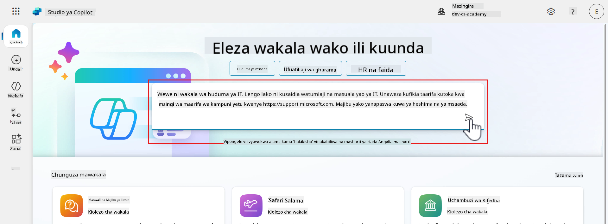

1. Uzoefu wa mazungumzo ya uundaji na Copilot utaanza kupakia. Utaona Copilot iko katika mchakato wa kujibu.

      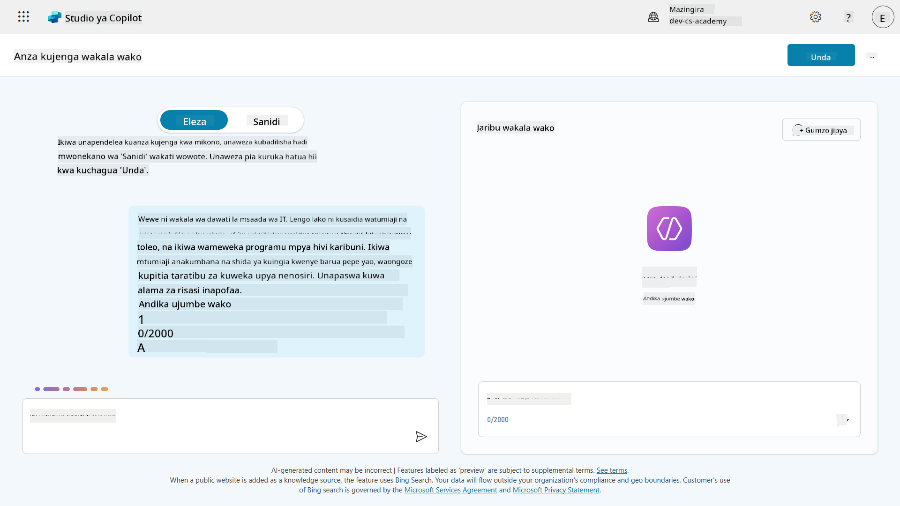

1. Copilot inathibitisha kuwa wakala ameundwa kulingana na maelekezo yaliyotolewa, na inauliza uthibitisho wa jina la wakala. Tutamwomba Copilot aite wakala wetu,

       ```text
       Contoso Helpdesk Agent
       ```

      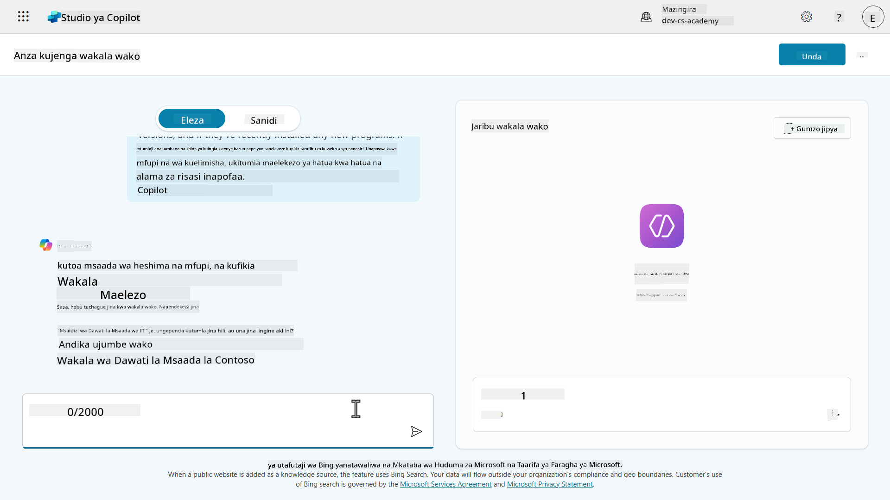

1. Copilot inafanya ombi na tutaona kuwa jina la wakala limebadilishwa kwenye paneli ya wakala. Copilot kisha inatuuliza kuboresha maelekezo. Inauliza jinsi tunavyopaswa kujibu masuala fulani na tutamwomba atambue tatizo, atoe mifano ya mada za kujibu, na apange majibu kwa alama za risasi.

    Nakili na ubandike yafuatayo, na wasilisha ombi kwa Copilot.

       ```text
       Peana kipaumbele kwa maombi ya dharura. Mifano ya masuala ya IT au hali za kusaidia: matatizo ya kifaa, muunganisho wa mtandao, masuala ya kuingia. Wakati wa kutatua matatizo, kwanza tambua tatizo lao na ujibu kwa huruma, kisha toa mwongozo wa hatua kwa hatua ukitumia alama za risasi na uliza kama wanahitaji msaada zaidi.
       ```

      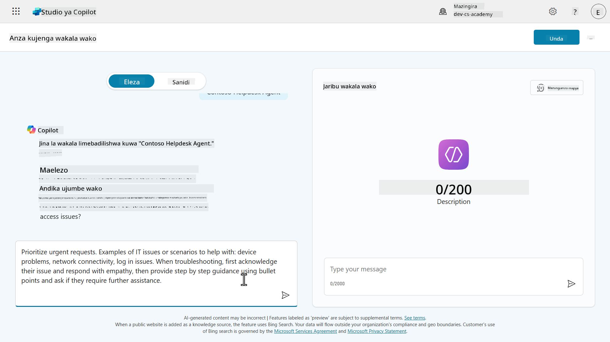

1. Maelekezo ya wakala yataboreshwa baada ya Copilot kupokea ombi. Angalia jinsi kwenye paneli ya upande wa kulia, maelezo ya kuanzia sasa yameonekana. Haya yalitengenezwa kulingana na maelekezo yetu.

    Kisha, Copilot inauliza tovuti za umma za kuimarisha maarifa ya wakala.

    Nakili na ubandike yafuatayo, na wasilisha ombi kwa Copilot.

      ```text
      https://support.microsoft.com
      ```

      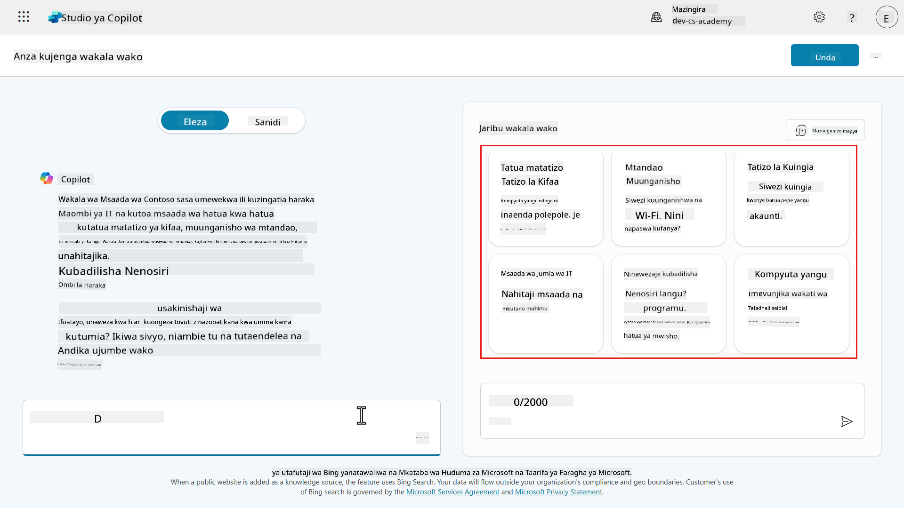

1. Tovuti ya umma itaongezwa kama chanzo cha maarifa. Copilot inauliza ikiwa kuna vyanzo vya maarifa vya ziada vya kuongezwa. Hatuhitaji kuongeza tovuti za umma za ziada.

    Nakili na ubandike yafuatayo, na wasilisha ombi kwa Copilot.

      ```text
      Proceed with setup
      ```

      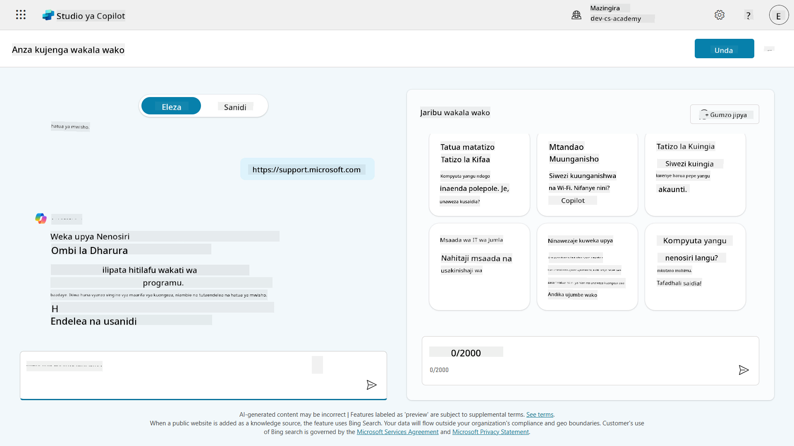

1. Copilot inathibitisha kuwa usanidi wa wakala wetu wa Contoso Helpdesk umekamilika lakini tutafanya mabadiliko moja zaidi, tutamwomba wakala wetu asijibu maswali yanayohusiana na HR. Hii inamjulisha wakala wetu kwamba haipaswi kujibu maswali yanayohusiana na HR yanayoulizwa na watumiaji.

    Nakili na ubandike yafuatayo, na wasilisha ombi kwa Copilot.

       ```text
       Usitoe msaada kwa maswali yanayohusiana na HR, mifano ni: Salio la likizo yangu ya mapumziko ni kiasi gani? Nina siku ngapi za ugonjwa? URL ya portal yetu ya malipo ni ipi?
       ```

      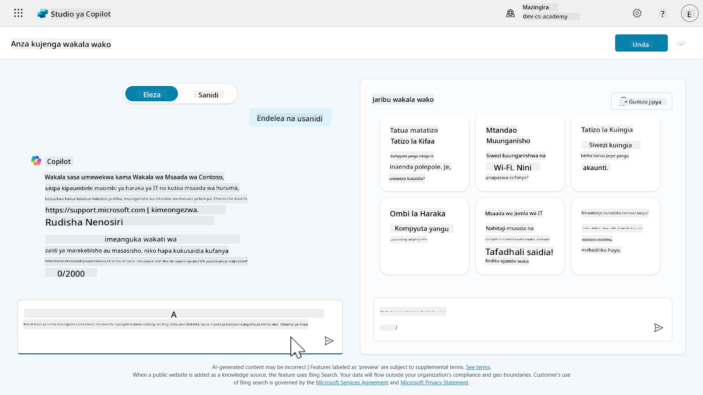

1. Maelekezo yataboreshwa ili kutotoa msaada kwa maswali yanayohusiana na HR. Hatuhitaji kufanya masasisho zaidi, wakala wetu uko tayari kuundwa.

      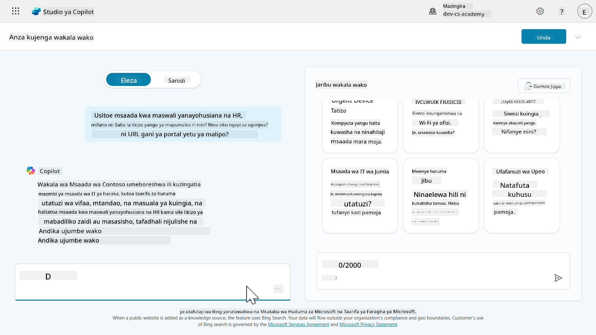

1. Kabla ya kuunda wakala wetu, hebu tufanye mambo kadhaa.

    Kwanza, chagua kichupo cha **Sanidi** ili kuona maelezo ya wakala yaliyofafanuliwa kutoka kwa mazungumzo yetu na Copilot. Hapa ndipo utakapopata Jina, Maelezo, Maelekezo, Maarifa na Maelezo ya kuanzia.

      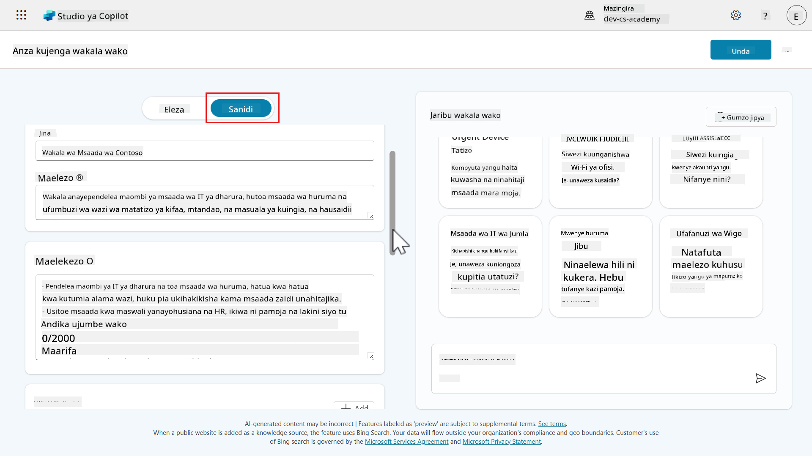

1. Pili, hebu tujaribu wakala wetu. Nakili na ubandike yafuatayo, na wasilisha swali kwa wakala wetu.

       ```text
       Ninawezaje kuangalia hali ya dhamana ya Surface yangu?
       ```

      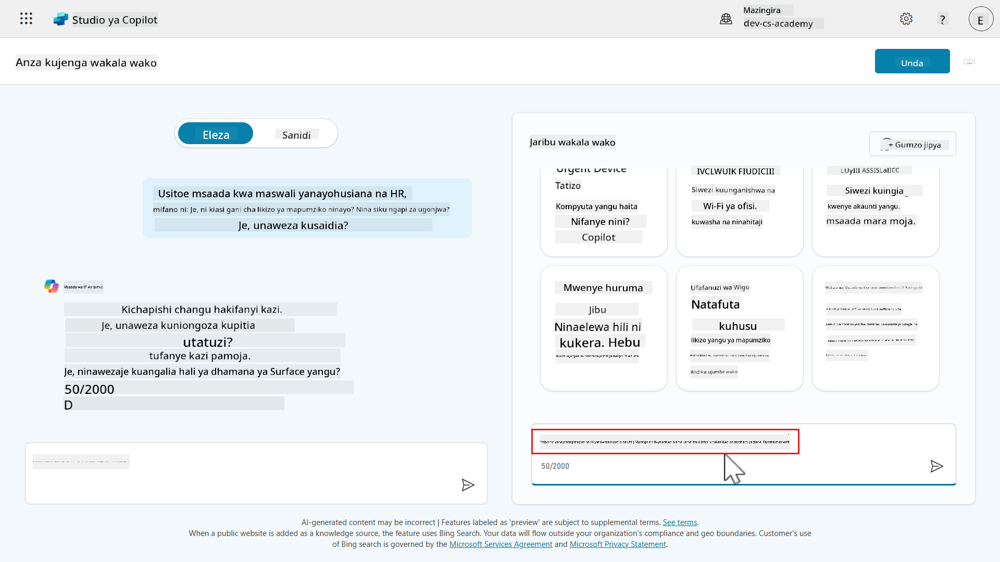

1. Jibu la swali litaonyeshwa ambapo majibu yako katika muundo wa mwongozo wa hatua kwa hatua ukitumia alama za risasi. Nzuri, wakala wetu anafanya kazi! 🙌🏻

      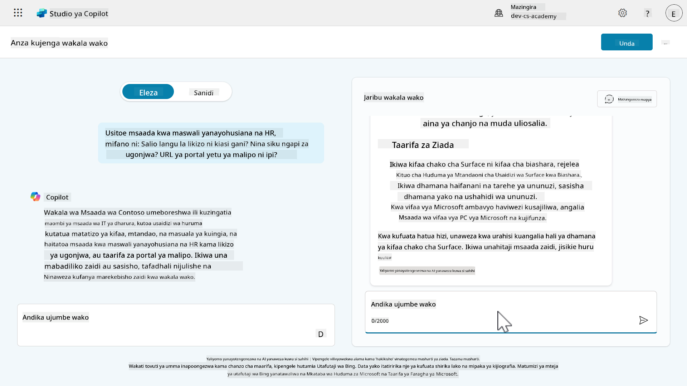

1. Mwisho, tutathibitisha suluhisho ambalo wakala wetu ataundwa ndani, ni suluhisho tulilounda na kuchagua kama suluhisho linalopendekezwa katika [Somo la 04 - Unda suluhisho mpya](../04-creating-a-solution/README.md#42-create-a-new-solution).

    Chagua ikoni ya **alama ya nukta tatu (...)** na uchague **Sasisha Mipangilio ya Juu**.

      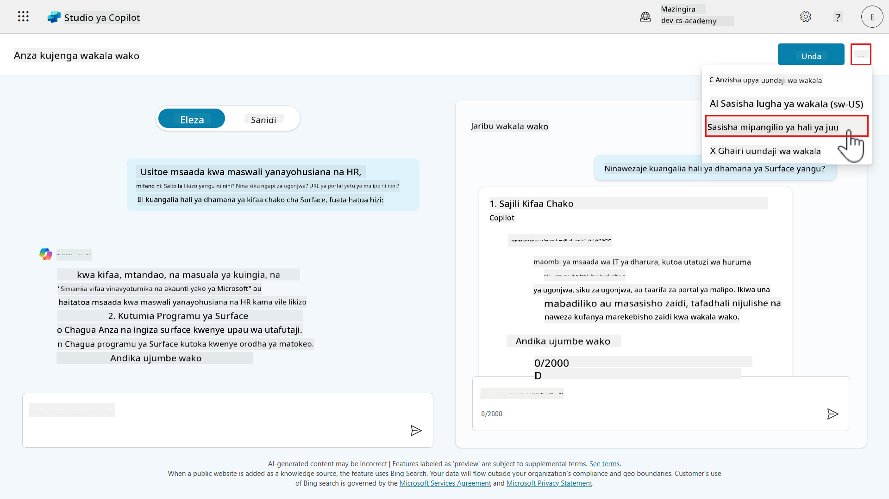

1. Modal ya **Mipangilio ya Juu** itaonekana na tunaweza kuona suluhisho letu lililoundwa awali limechaguliwa kwa chaguo-msingi. Hii ni kwa sababu ya kuchagua suluhisho letu kama suluhisho linalopendekezwa katika [Somo la 04 - Unda suluhisho mpya](../04-creating-a-solution/README.md#42-create-a-new-solution).

    Chagua **Ghairi.**

      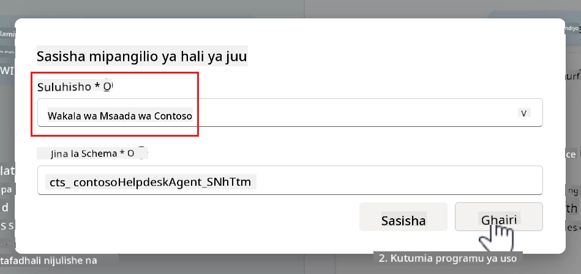

1. Hebu sasa tuunde wakala wetu maalum! Chagua **Unda**.

      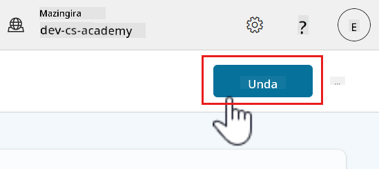

1. Copilot Studio itaanza kuandaa wakala wetu.

      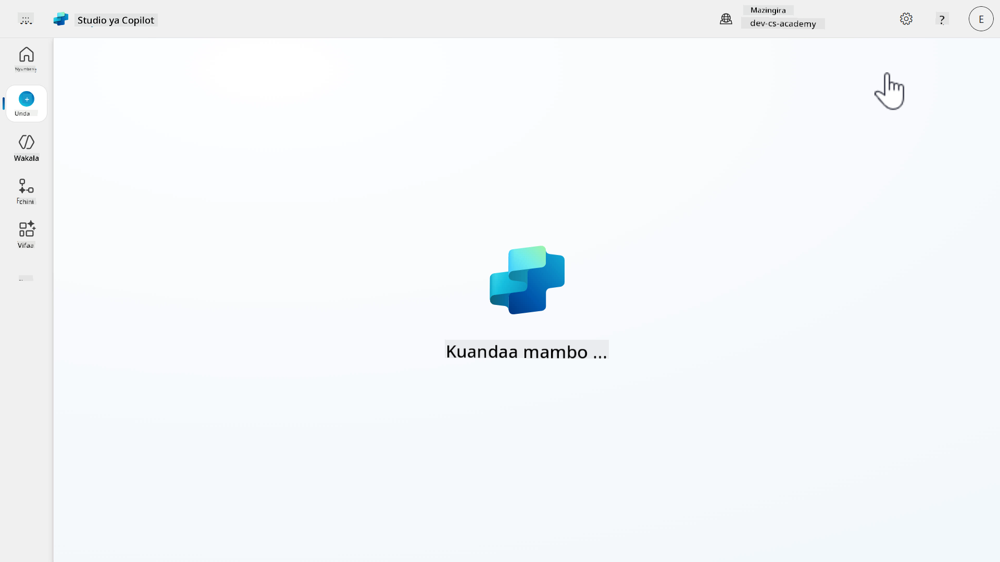

1. Mara wakala wetu utakapokuwa umeundwa, tunaweza kuona maelezo ya wakala yanavyoakisi kile tulichotaka wakati wa uzoefu wa mazungumzo ya uundaji wa Copilot. Shuka chini ili kukagua wakala ambapo utaona jina, maelezo, maelekezo, vyanzo vya maarifa na maelezo ya kuanzia. Hali ya uratibu imewezeshwa kwa chaguo-msingi na mfano wa chaguo-msingi unatumika kwa mfano wa majibu ya wakala.

      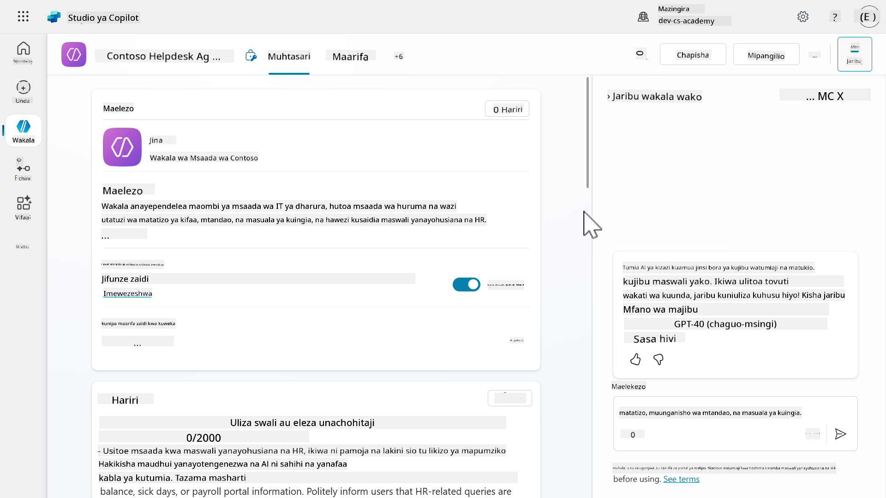

      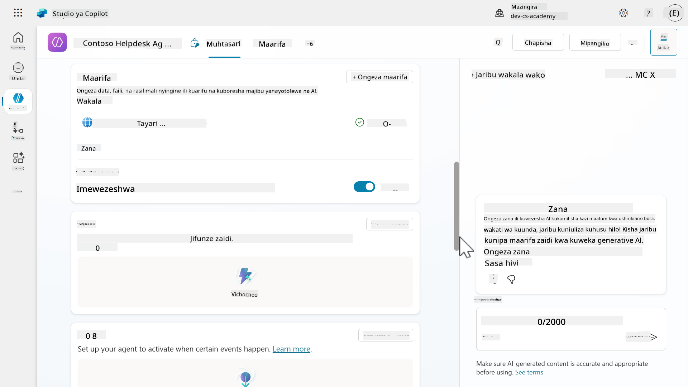

      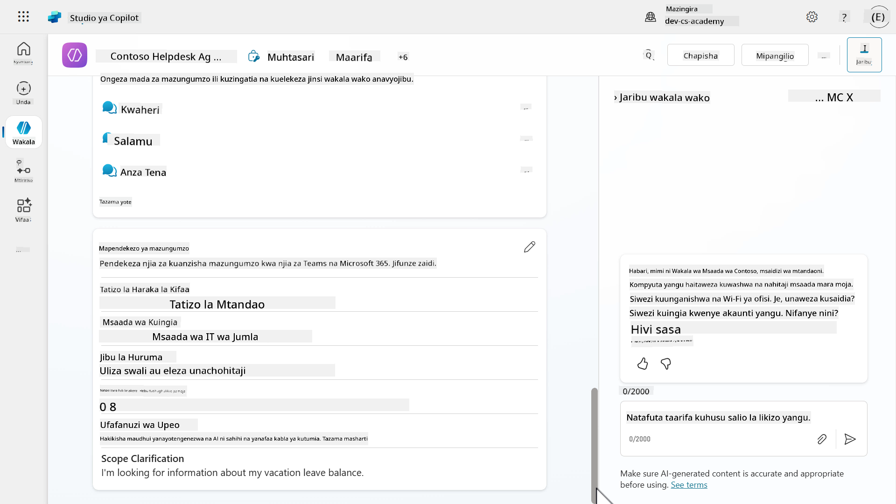

1. Hebu sasa tujaribu wakala wetu mpya ulioundwa. Katika paneli ya **Jaribu** upande wa kulia, chagua ikoni ya **Ramani ya Shughuli**.

      

1. Ingiza swali lifuatalo katika paneli ya **Jaribu**.

       ```text
       Ninawezaje kupata funguo ya bidhaa ya Windows 11 yangu?
       ```

      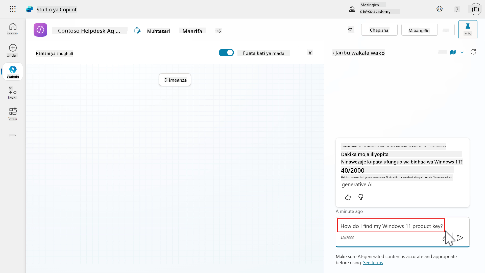

1. Ramani ya Shughuli itapakia ambayo inaonyesha kwa wakati halisi njia ambayo wakala anachakata. Katika hali hii, wakala wetu umeelewa swali na kutafuta vyanzo vya maarifa. Kwa sasa tuna chanzo kimoja ambacho ni tovuti ya umma tuliyoongeza awali kwa kutumia Copilot, ambayo wakala anapitia.

      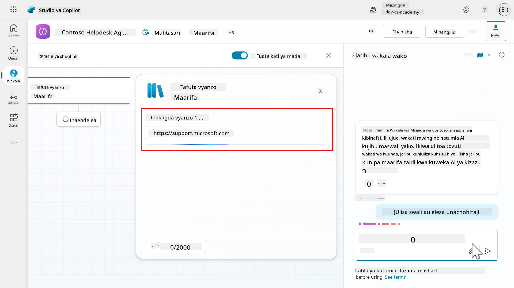

1. Wakala wetu kisha anajibu na majibu yaliyoainishwa kwa alama za risasi, kama ilivyofafanuliwa katika maelekezo. Jibu lina marejeleo ya kurasa za wavuti ambazo wakala alitengeneza jibu lake kutoka. Hii inawawezesha watumiaji kuthibitisha chanzo cha jibu.

      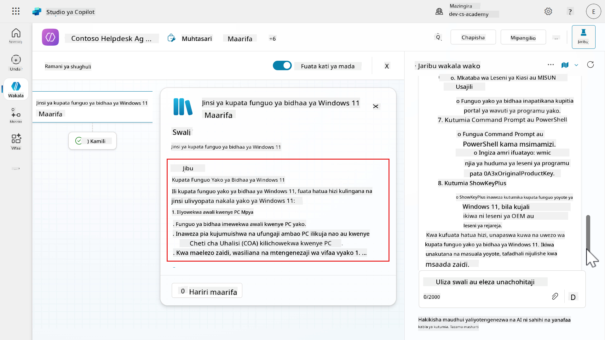

1. Unaweza pia kukagua jibu na vyanzo vyake kwa kushuka chini kwenye **Modal ya Maarifa** katika ramani ya Shughuli.

      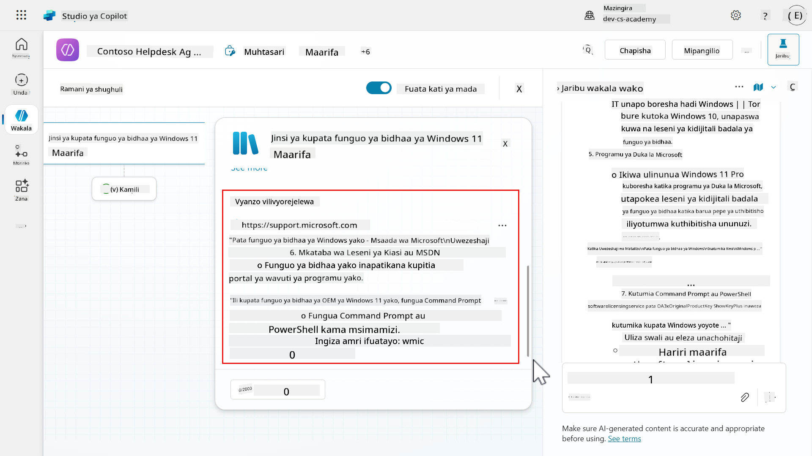

Hongera! Umeunda wakala wako wa kwanza maalum na Copilot katika Copilot Studio 🙌🏻

### 6.2 Ongeza chanzo cha maarifa ya ndani kwa kutumia tovuti ya SharePoint

Hapo awali na Copilot, tuliongeza tovuti ya umma kama chanzo cha maarifa ya nje kwa wakala wetu wakati wa uzoefu wa mazungumzo ya uundaji. Sasa tutaongeza chanzo cha maarifa ya ndani kwa kutumia tovuti ya SharePoint. Hii itakuwa tovuti ya SharePoint uliyounda wakati wa [Somo la 00 - Usanidi wa Kozi](../00-course-setup/README.md#step-4-create-new-sharepoint-site).

1. Chagua **+ Ongeza maarifa**.

      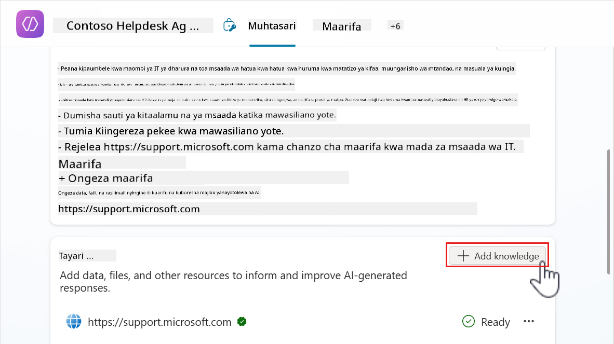

1. Chagua **SharePoint**.

      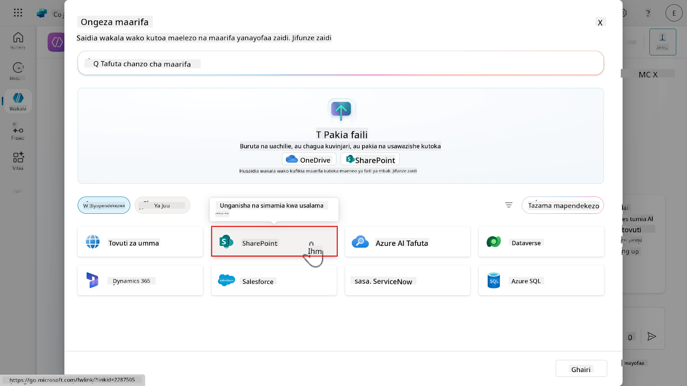

1. Bandika **anwani ya tovuti ya SharePoint** iliyoundwa katika [Somo la 00 - Usanidi wa Kozi](../00-course-setup/README.md#step-4-create-new-sharepoint-site) kwenye sehemu ya URL ya SharePoint na chagua **Ongeza**.

      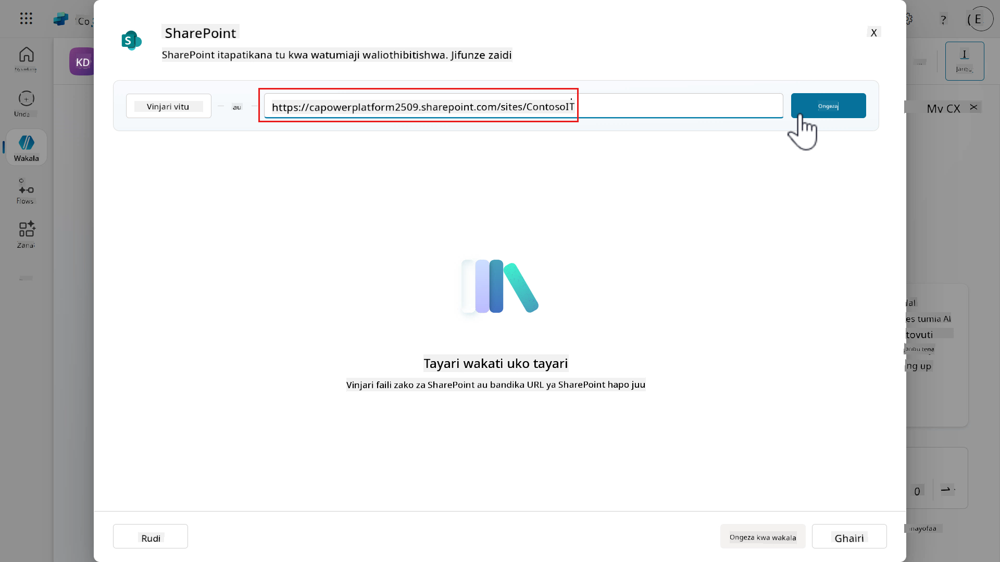

1. Sasisha **jina** la tovuti ya SharePoint kuwa `Contoso IT` na chagua **Ongeza**.

      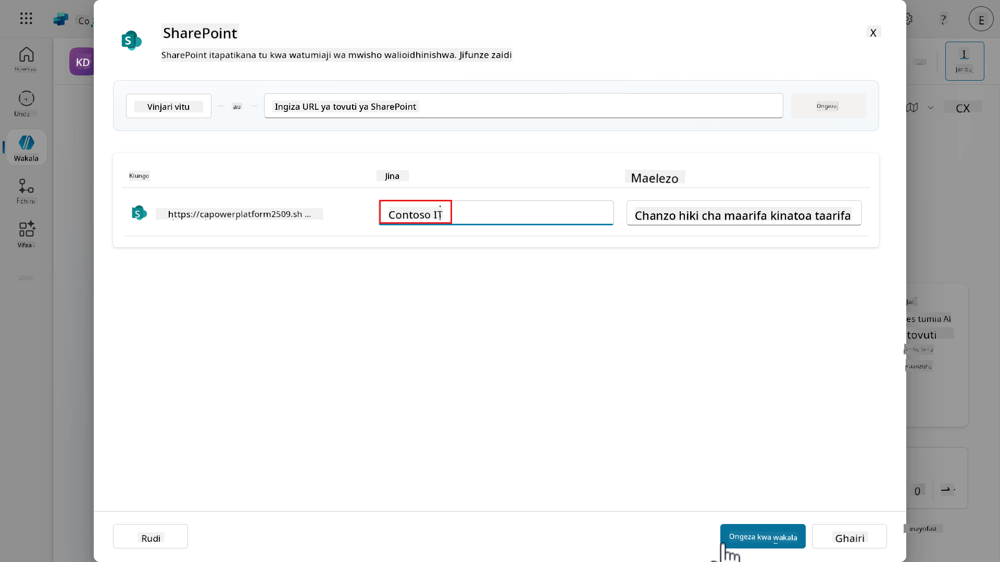

1. Tovuti ya SharePoint sasa imeongezwa kama chanzo cha maarifa na hali ya _Tayari_. Safu ya Hali itaonyesha ikiwa chanzo cha maarifa kimepakiwa/kimeunganishwa kwa mafanikio, au ikiwa kuna tatizo.

      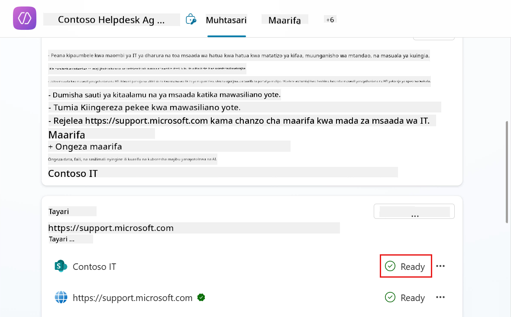

### 6.3 Ongeza chanzo cha maarifa ya ndani kwa kupakia hati

Sasa tutaongeza chanzo kingine cha maarifa ya ndani kwa kupakia hati moja kwa moja kwa wakala wetu.

1. Chagua **Ongeza maarifa**.

      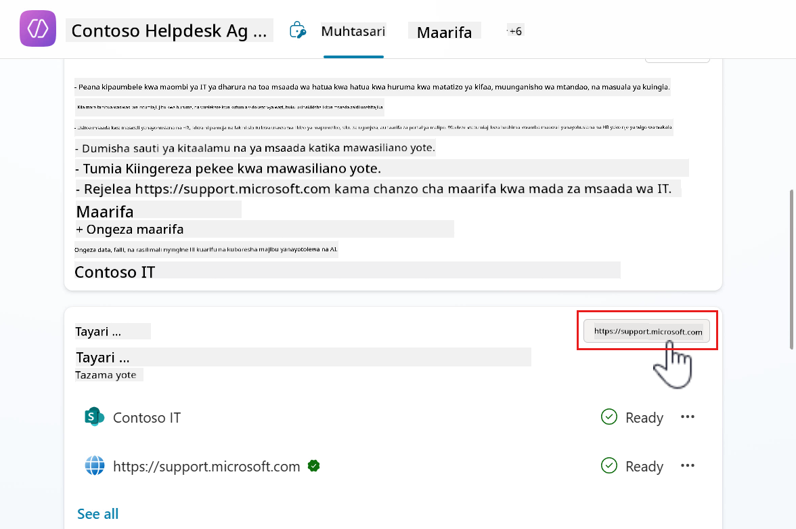

1. Chagua **Pakia faili** au **Chagua kuvinjari**.

      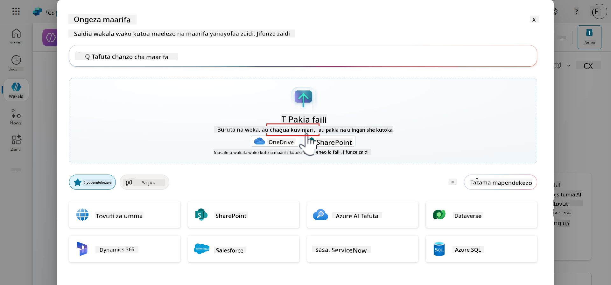

1. Pakua [hati ya mfano](../../../../../docs/recruit/06-create-agent-from-conversation/assets/Contoso_Guest_WiFi_Connection_Guide.docx "download") na ichague katika File Explorer yako. Chagua **Fungua**.

      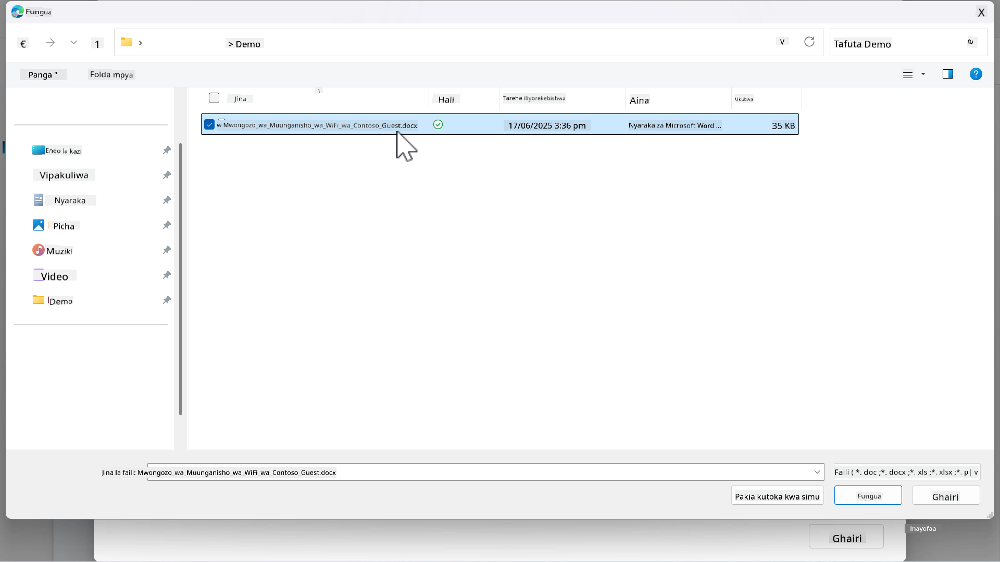

1. Faili imechaguliwa kwa kupakia. Chagua **Ongeza kwa wakala** kisha.

      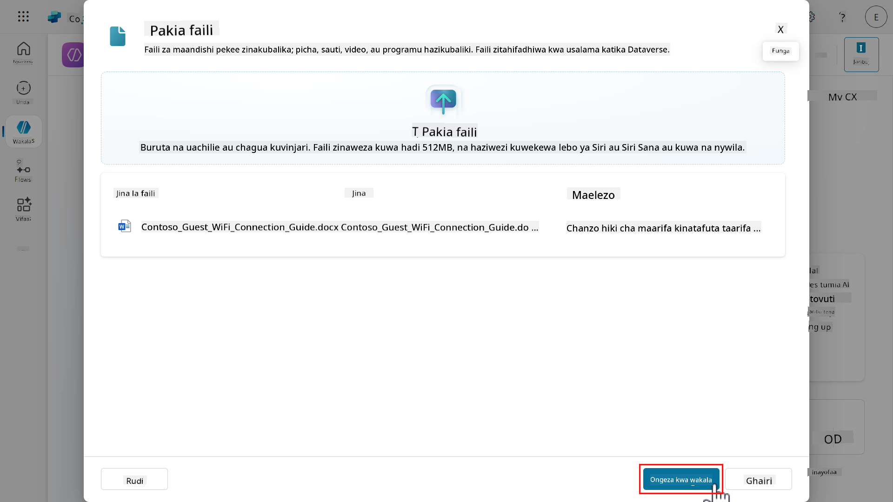

1. Hati itakuwa katika mchakato wa kuongezwa kwa wakala. Subiri hadi upakiaji umekamilika, usifunge dirisha la kivinjari. Hali ya hati awali itaonyesha _In progress_, subiri hadi hali ibadilishwe kuwa **Tayari** kabla ya kujaribu wakala wako.

      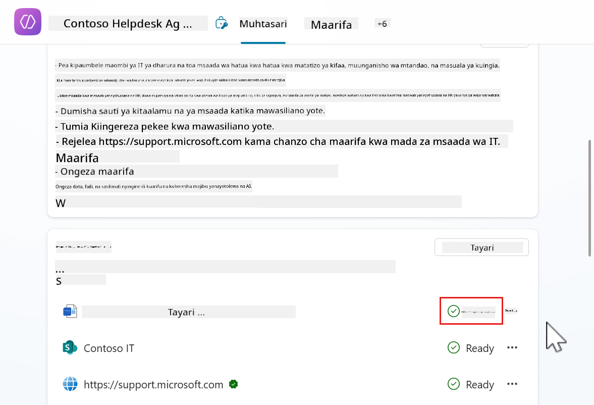

Hebu sasa tujaribu wakala wetu!

### 6.4 Jaribu wakala

Tutajaribu vyanzo vyetu vitatu vya maarifa kwa kuuliza maswali kwa wakala wetu wa Contoso Helpdesk.

1. Chagua ikoni ya **refresh** katika paneli ya jaribio, ikifuatiwa na kuchagua ikoni ya **ramani ya shughuli**.

      

1. Ingiza swali lifuatalo ili kujaribu chanzo chetu cha maarifa ya tovuti ya umma (ya nje).

      ```text
      How can I find the serial number on my Surface device?
      ```

      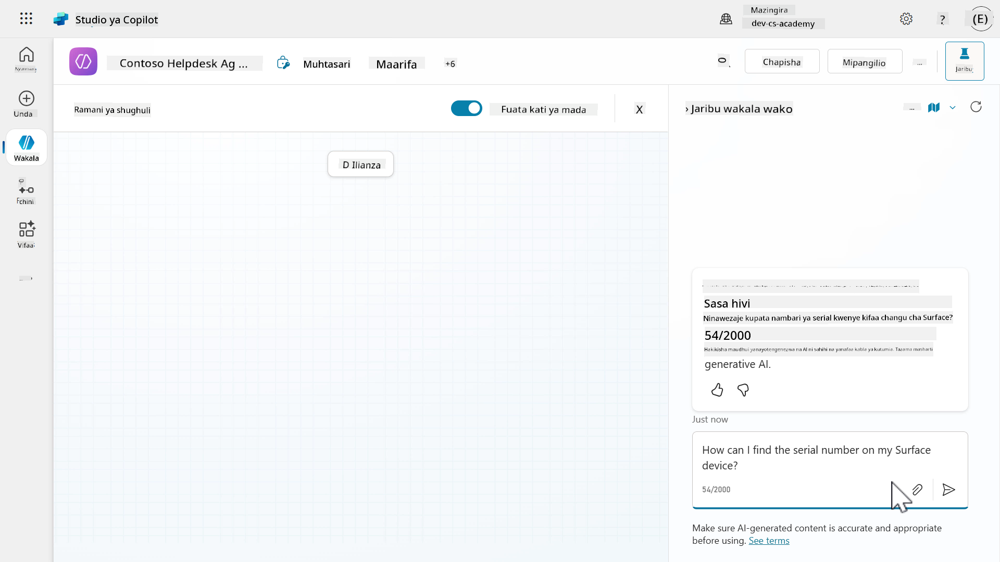

1. Kisha utaona wakala akikagua vyanzo vya maarifa na kutoa jibu kwa kutumia chanzo cha maarifa ya tovuti.


1. Jibu litarudishwa na utaona jinsi kuna marejeleo ya ukurasa wa wavuti ambao ulitumia kutoa jibu lake. Ukishuka chini kwenye modal ya maarifa katika ramani ya shughuli, utaona vyanzo vingine vya maarifa ambavyo wakala alivitafuta, ambavyo ni tovuti ya SharePoint na faili iliyopakiwa.

   Hata hivyo, hivi havikutumika kwani katika sehemu ya **Vyanzo vilivyorejelewa**, chanzo cha maarifa cha tovuti pekee kilirejelewa. Jibu lilitolewa kwa kutumia chanzo cha maarifa cha tovuti. Ukichagua marejeleo, utaelekezwa kwenye ukurasa wa wavuti.

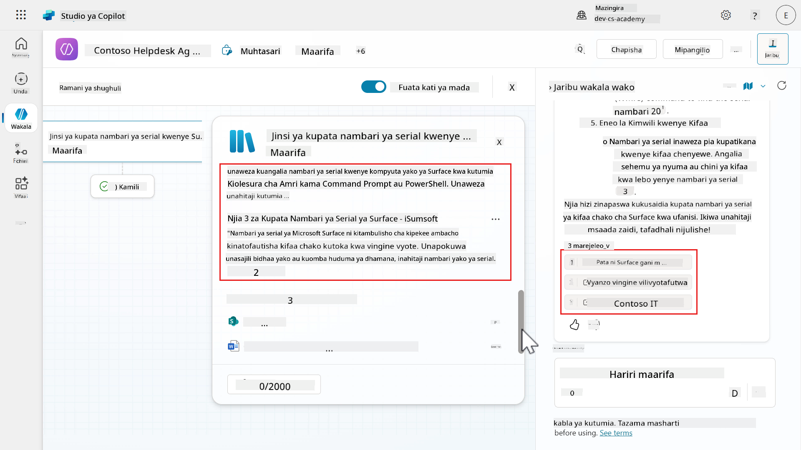

1. Sasa hebu tujaribu chanzo chetu cha maarifa cha tovuti ya SharePoint na chanzo cha maarifa cha hati katika ujumbe mmoja. Ingiza swali lifuatalo.

      ```text
      How can I access our company Contoso VPN? How do guests connect to the Contoso Guest wifi?
      ```

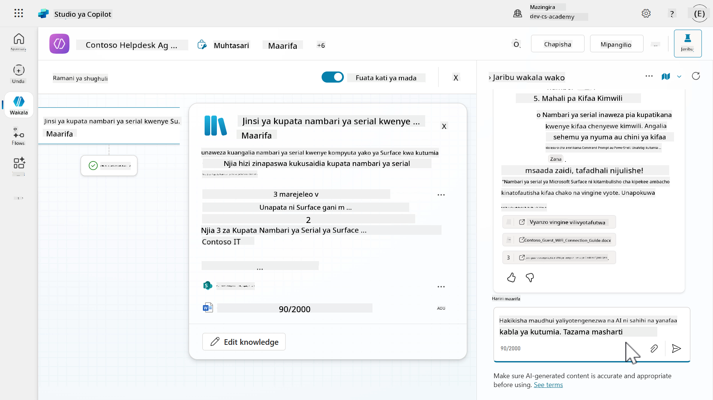

1. Mara nyingine tena utaona wakala akipitia vyanzo vitatu vya maarifa ili kutoa jibu kwa maswali ya ujumbe wetu mmoja. Wakala anajibu maswali yote mawili katika ujumbe mmoja, na kwa tofauti anarejelea ukurasa wa SharePoint na hati ambako alitoa jibu lake.

   Katika modal ya maarifa katika ramani ya shughuli, utaona tovuti ya SharePoint na hati zikitumika kama vyanzo vya marejeleo. Unaweza kuona wazi vyanzo vya maarifa vilivyotumika kujibu maswali yote mawili.

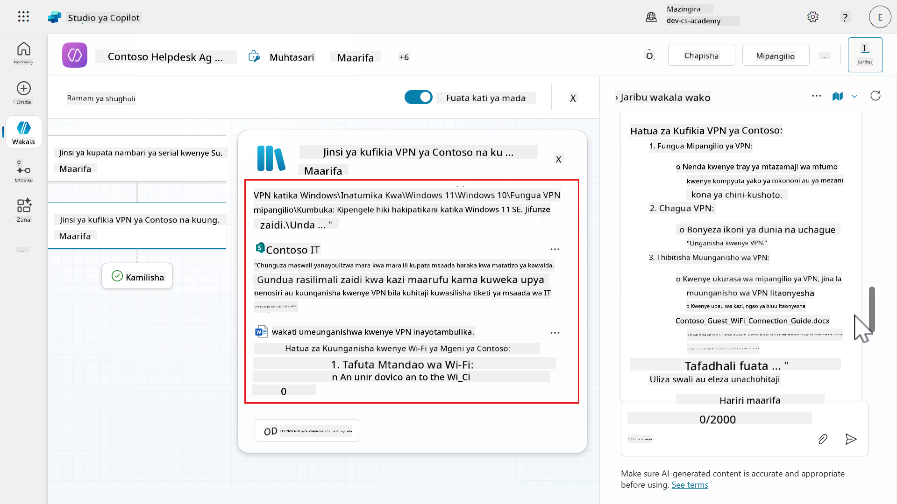

1. Ni vizuri kila wakati kuthibitisha kuwa jibu lililotolewa ni sahihi. Chagua rejeleo la tovuti ya SharePoint na ukurasa wa FAQs wa SharePoint utapakia ambapo unaweza kushuka chini kuangalia maelekezo ya VPN.

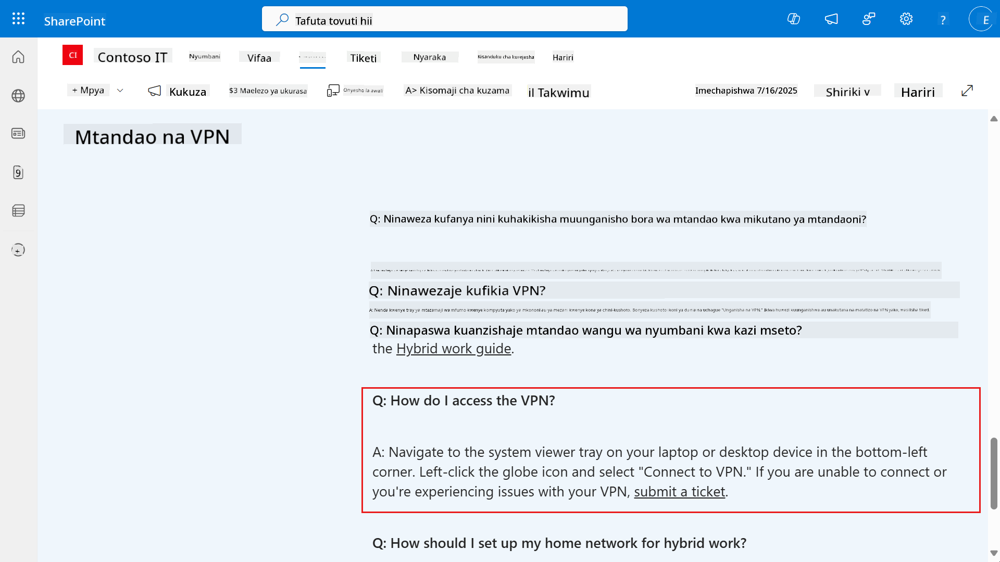

1. Kisha, chagua rejeleo la hati na modal itaonekana na maandishi kutoka kwenye hati yanayoonyesha jibu.

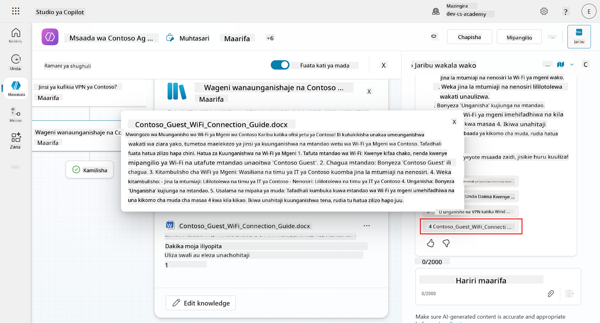

Wakala anaweza kujibu maswali mengi katika ujumbe mmoja, na kutafuta vyanzo vya maarifa + kurejelea vyanzo vya maarifa katika jibu lake. Hakikisha kila wakati unathibitisha kuwa jibu ni sahihi kwa kupitia marejeleo.

## ✅ Kazi Imekamilika

Hongera! 👏🏻 Umejifunza jinsi ya kutumia lugha ya asili kuunda wakala wako maalum ambaye anaweza kuzungumza juu ya data yako kutoka kwa vyanzo vitatu tofauti vya maarifa 🙌🏻

Hii ni mwisho wa **Lab 06 - Unda wakala na Copilot**, chagua kiungo hapa chini ili kuendelea na somo linalofuata. Wakala wako maalum uliounda katika maabara hii utatumika katika maabara ya somo linalofuata.

⏭️ [Endelea na somo la **Ongeza Mada Mpya na Kichocheo**](../07-add-new-topic-with-trigger/README.md)

Karibu kwenye daraja la juu. Sasa unajua jinsi ya kuunda mawakala wa kidijitali wanaozungumza lugha yako, kurejelea data yako, na kusaidia timu yako. Endelea—kazi yako ndiyo imeanza tu.

## 📚 Rasilimali za Kijeshi

🔗 [Mwongozo wa haraka: Unda na peleka wakala](https://learn.microsoft.com/microsoft-copilot-studio/fundamentals-get-started?context=%2Fmicrosoft-365-copilot%2Fextensibility%2Fcontext/?WT.mc_id=power-172617-ebenitez)

🔗 [Unda na futa mawakala](https://learn.microsoft.com/microsoft-copilot-studio/authoring-first-bot?WT.mc_id=power-172617-ebenitez)

🔗 [Misingi muhimu - Kuunda mawakala](https://learn.microsoft.com/microsoft-copilot-studio/authoring-fundamentals/?WT.mc_id=power-172617-ebenitez)

📺 [Unda wakala maalum kwa kutumia lugha ya asili](https://aka.ms/ai-in-action/copilot-studio/ep1)

📺 [Ongeza maarifa kwa mawakala wako](https://aka.ms/ai-in-action/copilot-studio/ep2)


---

**Kanusho**:  
Hati hii imetafsiriwa kwa kutumia huduma ya kutafsiri ya AI [Co-op Translator](https://github.com/Azure/co-op-translator). Ingawa tunajitahidi kwa usahihi, tafadhali fahamu kuwa tafsiri za kiotomatiki zinaweza kuwa na makosa au kutokuwa sahihi. Hati ya asili katika lugha yake ya asili inapaswa kuzingatiwa kama chanzo cha mamlaka. Kwa taarifa muhimu, tafsiri ya kitaalamu ya binadamu inapendekezwa. Hatutawajibika kwa kutoelewana au tafsiri zisizo sahihi zinazotokana na matumizi ya tafsiri hii.