<!--
CO_OP_TRANSLATOR_METADATA:
{
  "original_hash": "cc4afa4a5a11c9d03896decfbcbd4060",
  "translation_date": "2025-10-20T00:40:26+00:00",
  "source_file": "docs/recruit/09-add-an-agent-flow/README.md",
  "language_code": "sw"
}
-->
# 🚨 Misheni 09: Ongeza mtiririko wa wakala kwenye Mada yako kwa ajili ya kiotomatiki

## 🕵️‍♂️ JINA LA KODI: `OPERESHENI NGUVU YA KIOTOMATIKI`

> **⏱️ Muda wa Operesheni:** `~dakika 30`  

🎥 **Tazama Mwongozo**

[](https://www.youtube.com/watch?v=vtLZJT3eBXg "Tazama mwongozo kwenye YouTube")

## 🎯 Maelezo ya Misheni

Wakala wako sasa anaweza kuzungumza na watumiaji na kutoa taarifa, lakini ubora wa kweli wa operesheni unahitaji wakala wako kuchukua hatua. Misheni hii itabadilisha wakala wako wa mazungumzo kuwa nguvu ya kiotomatiki kwa kumwezesha na mtiririko wa wakala.

Mwisho wa misheni, utakuwa umeunda kiotomatiki cha ombi la kifaa kutoka mwanzo hadi mwisho ambacho kinakamata maoni ya mtumiaji kupitia kadi ya kubadilika, kinapata data kutoka SharePoint, kinatuma arifa kwa mameneja kupitia barua pepe, na kinatoa maoni ya mtumiaji bila matatizo - vyote vikisimamiwa na wakala wako kupitia mtiririko wa kazi wa akili.

## 🔎 Malengo

Katika misheni hii, utajifunza:

1. Kuelewa mtiririko wa wakala ni nini na jinsi unavyotofautiana na mtiririko wa wingu wa Power Automate kwa kiotomatiki
1. Kujifunza vipengele muhimu vinavyofanya mtiririko wa wakala kuwa na nguvu ikiwa ni pamoja na vitendo vya AI na uandishi wa lugha asilia
1. Kuchunguza mbunifu wa mtiririko wa wakala na jinsi ya kutumia maelezo kwa kushughulikia data kwa njia ya nguvu
1. Kuunda kiotomatiki kamili cha ombi la kifaa kinachojumuisha data ya SharePoint na arifa za barua pepe

## 🤔 Mtiririko wa wakala ni nini?

Mtiririko wa wakala ni njia yenye nguvu ya kuotomatisha kazi za kurudia na kuunganisha programu na huduma zako. Fikiria kama mtiririko wa hatua kwa hatua ambao wakala wako anaweza kutekeleza ili kuotomatisha kazi au kuunganishwa na programu na huduma nyingine. Unaweza kufikiria kama mtiririko mdogo unaosaidia wakala wako kufanya mambo kama kutuma arifa, kusasisha rekodi, au kujibu matukio.

Tofauti na mawakala wa kujitegemea wanaotumia AI kufanya maamuzi papo hapo, mtiririko wa wakala ni **mtiririko wa kazi wa kimaamuzi** - maana yake hufuata njia ile ile kila wakati, kuhakikisha matokeo thabiti na ya kuaminika.

Kwa maneno rahisi:

- Husaidia wakala wako _kufanya mambo_, si tu _kusema mambo_ kwa watumiaji.
- Ni rahisi kutumia katika mada na mawakala mbalimbali, na inaweza kuanzishwa na ujumbe wa mtumiaji, matukio, au programu na huduma nyingine.

## 🙋🏽 Ndio, lakini inatofautianaje na mtiririko wa wingu wa Power Automate?

Mtiririko wa wakala na mtiririko wa wingu wa Power Automate husaidia kuotomatisha kazi. Zimeundwa kwa madhumuni tofauti na hufanya kazi kwa njia tofauti.

### 🤖 Mtiririko wa wakala katika Copilot Studio

**Kile wanachofanya:**

- Imeundwa kwa mawakala wa mazungumzo na wa kujitegemea (kupitia maelekezo ya wakala) katika Copilot Studio.
- Inalenga kiotomatiki cha akili kinachoshirikiana na mifumo ya biashara.

**Kwa nini ni muhimu:**

- Rahisi kujenga na kusimamia moja kwa moja katika Copilot Studio.
- Nzuri kwa kuotomatisha kazi zinazotokea _wakati wa mazungumzo_ na watumiaji kama vile kuwasilisha ombi la likizo.
- Huhitaji leseni tofauti ya Power Automate kwani malipo yanategemea matumizi ndani ya Copilot Studio. Hii inaweza kuokoa muda na gharama kwa timu za biashara.

**Mapungufu:**

- Huwezi kushiriki, kunakili, au kupeana wamiliki wa pamoja.
- Mtiririko wa wakala unaonekana na unatumika tu ndani ya Copilot Studio.
- Kwa sasa, vichocheo vya matukio kwa mawakala vinaweza kuhaririwa katika portal ya Power Automate maker.

### ☁️ Mtiririko wa wingu wa Power Automate

**Kile wanachofanya:**

- Imeundwa kwa kiotomatiki cha madhumuni ya jumla katika programu na huduma nyingi.
- Inaweza kuendeshwa kwa kujitegemea au kufanya kazi sambamba na mtiririko wa wakala.

**Kwa nini ni muhimu:**

- Inatoa anuwai ya viunganishi.
- Inafaa kwa kuotomatisha michakato nje ya mawakala.
- Inaweza kushirikiwa, kutumika tena, na kusimamiwa katika timu.

**Mahitaji:**

- Unahitaji leseni ya Power Automate kuitumia.

### 📗 Muhtasari

| Tumia hii | Unapotaka |
| :- | :- |
| Mtiririko wa wakala | Kuotomatisha kazi ndani ya wakala, kutumia AI, na kuweka kila kitu ndani ya Copilot Studio |  
| Mtiririko wa wingu wa Power Automate | Kuotomatisha katika programu na huduma, au kujenga mtiririko nje ya mawakala |

## 👍🏻 Kwa nini utumie mtiririko wa wakala

Mtiririko wa wakala hufuata njia iliyowekwa - hufanya kitu kile kile kila wakati unapotoa pembejeo ile ile.

Hii inawafanya:

- **Kuaminika** - unaweza kuamini kwamba watatenda kwa njia ile ile kila wakati.
- **Kutabirika** - unajua matokeo ya kutarajia mtiririko unapoendeshwa.
- **Kulingana na sheria** - hufuata hatua unazofafanua.

Faida nyingine ni:

- **Kiotomatiki** - huwezesha wakala wako kushughulikia kazi za kurudia kama vile kuwasilisha fomu au kutuma arifa.
- **Kuunganishwa** - unganisha na viunganishi zaidi ya 1400 kama ServiceNow, SharePoint, Salesforce. Vinginevyo unaweza kujenga kiunganishi chako mwenyewe.
- **Kuunganishwa kwa karibu** - mtiririko wa wakala ni sehemu ya mantiki ya wakala, huanzishwa moja kwa moja na ujumbe wa mtumiaji au vitendo katika mazungumzo.
- **Uwezo wa kupanuka** - tumia tena mtiririko katika mawakala au hali mbalimbali.
- **Hakuna msimbo au msimbo mdogo** - unaweza kujenga mtiririko kwa kutumia lugha asilia au mbunifu wa kuona.
- **Jukwaa moja** - unaweza kubuni, kujaribu na kupeleka mtiririko wa wakala mahali pamoja - Copilot Studio. Hakuna haja ya kubadilisha kati ya majukwaa.

## 🏄🏻‍♂️ Mtiririko wa wakala unavyoboreshaje wakala wako?

Mtiririko wa wakala huongeza kile wakala wako anaweza kufanya zaidi ya "kuzungumza" na watumiaji. Unamruhusu kuchukua hatua na kuingiliana na mifumo.

Tuseme unafanya kazi katika idara ya fedha na unapokea ankara nyingi kutoka kwa wauzaji. Kwa kawaida, mtu lazima asome kila ankara, atoe maelezo muhimu - kiasi, tarehe, ni nani ametuma, na ahakikishe kila kitu kinapatana na rekodi zako. Kisha kuituma kwa mtu sahihi kwa idhini. Hii inachukua muda na juhudi.

Kwa mtiririko wa wakala katika Copilot Studio, unaweza kuotomatisha mchakato huu. Mara tu ankara inapoingia, wakala:

1. Husoma hati kwa kutumia usindikaji wa hati za akili ili kupata maelezo muhimu.
1. Hukagua maelezo dhidi ya data ya biashara yako ili kuhakikisha kila kitu kinaonekana sahihi.
1. Hupeleka kwa idhini kwa mtu sahihi.

Hii huokoa muda, hupunguza makosa na hufanya mchakato mzima kuwa laini zaidi.

### Fikiria kwa njia hii

- **Mawakala**: watoa maamuzi wenye akili
- **Mtiririko wa wakala**: watekelezaji wa kuaminika

### Kwa nini ni muhimu

- Unapata bora wa pande zote mbili: kiotomatiki cha kuaminika na AI inayobadilika.
- Ni rahisi kujenga na kusasisha mtiririko kadri mahitaji ya biashara yako yanavyobadilika.
- Unaweza kupanua kiotomatiki katika timu.

## 🔌 Vipengele muhimu vinavyofanya mtiririko wa wakala kuwa na nguvu

1. **Uandishi wa lugha asilia**
    - Unaweza kuelezea unachotaka mtiririko ufanye kwa Kiingereza rahisi.
    - Copilot inaelewa nia yako na kujenga mtiririko kwa ajili yako.
    - Hakuna haja ya kuandika msimbo - eleza wazo lako.

1. **Vitendo vya AI**

    Tumia AI kufanya:

    - Kusoma na kuelewa hati au picha.
    - Kufupisha maudhui marefu kuwa majibu mafupi na yenye manufaa.
    - Kutoa mapendekezo au maamuzi ya akili.

1. **Vitendo vya kizazi**
    - Hivi huruhusu mtiririko kubadilika papo hapo.
    - Wakala anaweza kupanga na kurekebisha hatua kulingana na taarifa zinazobadilika.

1. **Vitendo vya muunganisho**
    - Unganisha mtiririko wako na zana nyingine kama Outlook, Microsoft Teams, ServiceNow, SharePoint na programu na huduma nyingine, kupitia viunganishi zaidi ya 1400 vilivyojengwa au kutoka kwa kiunganishi chako mwenyewe.
    - Hii husaidia wakala wako kufanya kazi na programu ambazo timu yako tayari inatumia.

1. **Binadamu katika mchakato**
    - Ongeza hatua za idhini ambapo mtu anahitaji kukagua au kuthibitisha kitu.
    - [Idhini za hali ya juu](https://learn.microsoft.com/microsoft-copilot-studio/flows-advanced-approvals?WT.mc_id=power-172621-ebenitez) zinaunga mkono vikumbusho, uidhinishaji, na idhini za hatua nyingi.

## ⚙️ Jinsi zinavyofanya kazi

1. **Kichocheo**

    Tukio linaanzisha mtiririko - kama vile mtumiaji kuuliza swali, kuanzisha mtiririko kutoka mada, wakati uliopangwa, au tukio linalotokea katika mfumo mwingine.

1. **Vitendo**

    Hizi ni hatua ambazo wakala hufuata baadaye - kutuma barua pepe, kupiga API, kusasisha tiketi katika ServiceNow.

## 🧶 Jinsi ya kuunda mtiririko wa wakala

1. **Lugha asilia**: eleza unachotaka wakala afanye, na Copilot hujenga kwa ajili yako.
1. **Canvas ya mbunifu**: buruta na weka vitendo, masharti, na mizunguko katika mbunifu wa mtiririko wa wakala ili kujenga mtiririko wako.

## 🎨 Mbunifu wa mtiririko wa wakala ni nini?

Ni zana ya kuona katika Copilot Studio inayokusaidia kujenga, kuhariri, na kusimamia mtiririko wa wakala unaotoa maelekezo ya hatua kwa hatua ambayo wakala wako hufuata kukamilisha kazi. Imeundwa kuwa rahisi kutumia, hata kama wewe ni mpya kwa mtiririko wa wakala.

### Vipengele muhimu vya mbunifu wa mtiririko wa wakala

1. **Canvas ya kuona**
    - Unaweza kuona mtiririko wako wote ukiwekwa kama mchoro.
    - Rahisi kuzoom ndani/nje, kutosheleza mtazamo au kutumia ramani ndogo kuvinjari mtiririko mkubwa.

1. **Ongeza na ondoa vitendo**
    - Bonyeza _alama ya plus (+)_ kuongeza kitendo kipya kama vile kutuma ujumbe au kusasisha kipengee katika orodha ya SharePoint.
    - Unaweza kutafuta vitendo kutoka viunganishi, na kuviweka kupitia mipangilio yake.
    - Ili kuondoa kitendo, bonyeza _alama ya nukta tatu (⋮)_ na uchague _Futa_.

1. **Angalia vigezo**
    - Bonyeza kitendo chochote ili kuona au kuhariri mipangilio yake inayoitwa _vigezo_.
    - Unaweza kuingiza thamani kwa mkono au kutumia _maelezo_ kuyafanya ya nguvu.

1. **Historia ya toleo**
    - Kila wakati unapohifadhi mtiririko wako, toleo linarekodiwa.
    - Unaweza kurudi na kuona au kurejesha toleo la awali ikiwa inahitajika.

1. **Ukaguzi wa makosa**
    - _Kikagua Mtiririko_ kinaonyesha makosa yoyote.
    - Makosa yote yanahitaji kutatuliwa kabla ya kuchapisha mtiririko wako.

1. **Chapisha na jaribu**
    - Mara mtiririko wako unapokuwa bila makosa, chapisha ili kuufanya uwe hai.
    - Tumia kipengele cha _Jaribu_ kuendesha mtiririko wako kwa mkono au kiotomatiki, na uhakikishe kama unafanya kazi kama inavyotarajiwa.

### Kwa nini utumie mbunifu wa mtiririko wa wakala?

- **Kuona na rahisi kuelewa** - unaweza kujenga mtiririko kwa kuburuta na kubonyeza.
- **Salama kujaribu** - historia ya toleo hukuruhusu kubatilisha mabadiliko.
- **Jaribio lililojengwa ndani** - hukusaidia kuhakikisha kila kitu kinafanya kazi kabla ya kuwa hai.

## 🔤 Umetaja _maelezo_ - maelezo ni nini?

Maelezo ni fomula ndogo au amri zinazosaidia mtiririko wa wakala kufanya kazi na data. Unazitumia kuhesabu thamani, kuunda maandishi, kufanya maamuzi, au kutoa taarifa maalum kutoka pembejeo.

### Kwa nini utumie maelezo?

Maelezo hukuruhusu:

- **Kubinafsisha jinsi data inavyoshughulikiwa** - unganisha majina, unda tarehe.
- **Kufanya maamuzi** - ikiwa thamani ni kubwa kuliko 10, fanya kitu.
- **Kubadilisha data** - badilisha maandishi kuwa herufi ndogo, toa sehemu ya mfuatano wa maandishi.
- **Kuotomatisha mantiki** - bila kuandika msimbo kamili.

### Maelezo yanaonekanaje?

Maelezo hutumia kazi. Nitanukuu maelezo ya kazi kutoka kwa aliyekuwa Microsoft MVP, Jerry Weinstock.

!!! nukuu
    Kazi ni mantiki iliyojengwa ndani ya kubadilisha data yako kupitia operesheni rahisi au ngumu katika maelezo yako.

Kazi hukuwezesha kujenga maelezo bila kuhitaji kuandika msimbo wowote.

Njia ninayopenda kuelezea, ni kwamba kazi katika mtiririko wa wakala ni sawa na kazi za Excel. Unaweza kufanya operesheni kwenye data kubadilisha kuwa matokeo unayotaka. Unapojenga fomula yako katika Excel unachagua thamani ya pembejeo kutoka seli katika jedwali au safu, kisha unatumia kazi kubadilisha matokeo ya data. Mfano ni kutumia kazi ya `COUNT` kuhesabu idadi ya seli zinazojumuisha namba kutoka safu.

Katika mtiririko wa wakala, badala ya kurejelea data kutoka seli katika jedwali, unarejelea matokeo ya data kutoka kichocheo au vitendo unapoandika maelezo yako. Ukiendelea na mfano wa awali, tumia kazi ya `length` kupata idadi ya vitu vilivyorudishwa kutoka kwa kitendo cha kiunganishi cha _Get items_ cha SharePoint.

### Kwa nini kazi ni muhimu?

Kutumia kazi kunafanya mtiririko wa wakala wako:

- **Mwerevu** - unaweza kujibu pembejeo au masharti tofauti.
- **Rahisi kubadilika** - unaweza kubinafsisha jinsi data inavyoshughulikiwa.
- **Ufanisi** - unakwepa hatua za mikono kwa kuotomatisha mantiki.

### Kazi muhimu zaidi

Zifuatazo ni kazi za kawaida zinazotumika katika mtiririko wa wakala. Kwa orodha kamili ya kazi, tembelea [mwongozo wa marejeleo](https://learn.microsoft.com/azure/logic-apps/workflow-definition-language-functions-reference?WT.mc_id=power-172621-ebenitez).

#### 🔡 Maandishi

- `concat()` - Inaunganisha vipande viwili au zaidi vya maandishi pamoja.
      - Mfano: `concat('Hello ', firstName)` → “Hello John”

- `toLower()` / `toUpper()` - Hubadilisha maandishi kuwa herufi ndogo au kubwa.
      - Inafaa kwa kusawazisha pembejeo.

- `substring()` - Hutolea sehemu ya mfuatano wa maandishi.
      - Mfano: Pata herufi 3 za kwanza za jina.

- `trim()` - Huondoa nafasi kutoka mwanzo na mwisho wa maandishi.

#### 🔢 Hesabu na namba

- `add()`, `sub()`, `mul()`, `div()` - Operesheni za hesabu za msingi.
      - Mfano: `add(5, 3)` - matokeo ni 8

#### 📅 Tarehe na muda

- `utcNow()` - Hupata tarehe na muda wa sasa katika UTC.
      - Nzuri kwa al
- Mfano: `addDays(utcNow(), 7)` matokeo ni siku 7 kutoka sasa.

- `formatDateTime()` - Huunda tarehe kuwa maandishi yanayosomeka.
      - Mfano: Jumatatu, Julai 7, 2025

#### ✅ Mantiki

- `if()` - Hufanya thamani moja ikiwa ni kweli, nyingine ikiwa ni uongo.
      - Mfano: `if(score > 50, 'Pass', 'Fail')`

- `equals()` - Hukagua kama thamani mbili ni sawa.

- `and()`, `or()`, `not()` - Kuunganisha masharti mengi.

#### 🪣 Kazi nyingine za msaada

- `coalesce()` - Hurejesha thamani ya kwanza isiyo tupu.
      - Inafaa kwa thamani za akiba/kawaida.

- `guid()` - Hutengeneza kitambulisho cha kipekee.
      - Inafaa kwa kufuatilia au kuandika kumbukumbu.

- `length()` - Huhesabu idadi ya herufi au vitu vilivyomo kwenye maandishi au orodha.

## ⭐ Mazoea Bora

Hapa kuna mazoea bora ya kujenga mtiririko wa wakala katika Copilot Studio.

1. **Anza kwa urahisi na ujenge hatua kwa hatua**

    - Anza na kazi ndogo, iliyo wazi kama kutuma ujumbe.
    - Ongeza hatua zaidi baada ya kujaribu msingi wa otomatiki yako.

1. **Tumia majina ya hatua yaliyo wazi na ya kueleweka**

    - Weka alama kila hatua kwa uwazi ili wewe na timu yako muelewe inachofanya.
    - Mfano: badala ya jina la default "Sasisha kipengee" kwa hatua ya kiunganishi cha SharePoint, iite jina linaloelezea inachofanya, kama "Sasisha hali ya kifaa."

1. **Kagua makosa kabla ya kuchapisha**

    - Tumia **kagua mtiririko** ili kutambua na kurekebisha masuala yoyote.
    - Huwezi kuchapisha mtiririko ikiwa kuna makosa, kwa hivyo jaribu kuyatatua yanapotokea.

1. **Jaribu mtiririko wako kwa kina**

    - Kwa sababu tu imehifadhiwa na kuchapishwa, haimaanishi inafanya kazi kama inavyotarajiwa.
    - Tumia kipengele cha _Jaribu_ kuendesha mtiririko wako kwa mikono au kiotomatiki, na angalia matokeo.

1. **Tumia Historia ya Toleo**

    - Hifadhi mtiririko wako mara kwa mara ili uweze kurudi kwenye matoleo ya awali ikiwa inahitajika.
    - Unaweza kuona na kurejesha matoleo ya awali ukitumia paneli ya _Historia ya Toleo_.

1. **Tumia vigezo na maelezo kwa busara**

    - Unapoweka hatua, tumia vigezo kufanya mtiririko wako uwe wa kubadilika.
    - Unaweza kuingiza thamani kwa mkono au kutumia maelezo kuhesabu, au kuunganisha na thamani kutoka hatua za awali kwa kutumia kipengele cha _uchaguaji wa maudhui ya nguvu_.

1. **Futa hatua zisizotumika**

    - Ikiwa unaongeza hatua na baadaye unaamua kuwa hauihitaji, iondoe ili kuweka mtiririko wako safi.

## 🧪 Maabara 09 - Ongeza mtiririko wa wakala kwa otomatiki na kuboresha uwezo wa mada

Sasa tutaelewa jinsi ya kuboresha mada yetu kwa kadi za kubadilika na kutumia utendaji wa hali ya juu wa mada na nodi.

- [9.1 Unda mtiririko wa wakala](../../../../../docs/recruit/09-add-an-agent-flow)
- [9.2 Ongeza mtiririko wa wakala kwenye mada](../../../../../docs/recruit/09-add-an-agent-flow)
- [9.3 Sasisha mada ya Ombi la kifaa na nodi kadhaa kwa uzoefu bora wa mtumiaji](../../../../../docs/recruit/09-add-an-agent-flow)
- [9.4 Jaribu wakala kwa kutumia hali kadhaa](../../../../../docs/recruit/09-add-an-agent-flow)

### ✨ Matumizi

**Kama** meneja wa mfanyakazi

**Ninataka** kupokea maombi ya vifaa

**Ili** niweze kukagua kifaa kilichoombwa na mfanyakazi.

Tuanzishe!

### Mahitaji ya awali

1. **Orodha ya SharePoint**

    Tutatumia orodha ya **Vifaa** ya SharePoint kutoka [Somo 00 - Usanidi wa Kozi - Hatua ya 3: Unda tovuti mpya ya SharePoint](../00-course-setup/README.md#step-4-create-new-sharepoint-site).

    Ikiwa hujaweka orodha ya **Vifaa** ya SharePoint, tafadhali rudi kwenye [Somo 00 - Usanidi wa Kozi - Hatua ya 3: Unda tovuti mpya ya SharePoint](../00-course-setup/README.md#step-4-create-new-sharepoint-site).

1. **Wakala wa Msaada wa Contoso**

    Tutatumia wakala yule yule aliyeundwa hapo awali katika [Somo 06 - Unda wakala maalum kwa kutumia lugha ya asili na Copilot na kuunganisha na data yako](../06-create-agent-from-conversation/README.md).

### 9.1 Unda mtiririko wa wakala

Katika zoezi hili, tutaunda mtiririko wa wakala ambao utachukua kipengee cha SharePoint cha kifaa kilichochaguliwa na kutuma barua pepe kwa meneja na maelezo ya kifaa.

1. Katika mada ya **Ombi la kifaa**, shuka chini hadi nodi ya **Uliza kwa kadi ya kubadilika** na ongeza nodi mpya. Chagua **Ongeza zana** na katika kichupo cha **Zana za Msingi** cha paneli ya kuruka, chagua **Mtiririko Mpya wa Wakala**.

    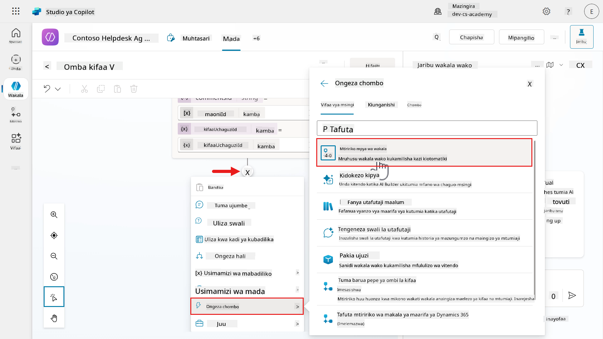

1. Mtiririko wa Wakala **Mbunifu** utapakia na kichochezi na hatua.

    - **Kichochezi** - Wakati wakala anapoitisha mtiririko
        - Hii itachochea mtiririko kutoka kwa wakala wa Copilot Studio.

    - **Hatua** - Jibu kwa wakala
        - Hii inatuma jibu ambalo linaweza kuwa na thamani za matokeo kurudi kwa wakala wa Copilot Studio.

    Chagua kichochezi.

    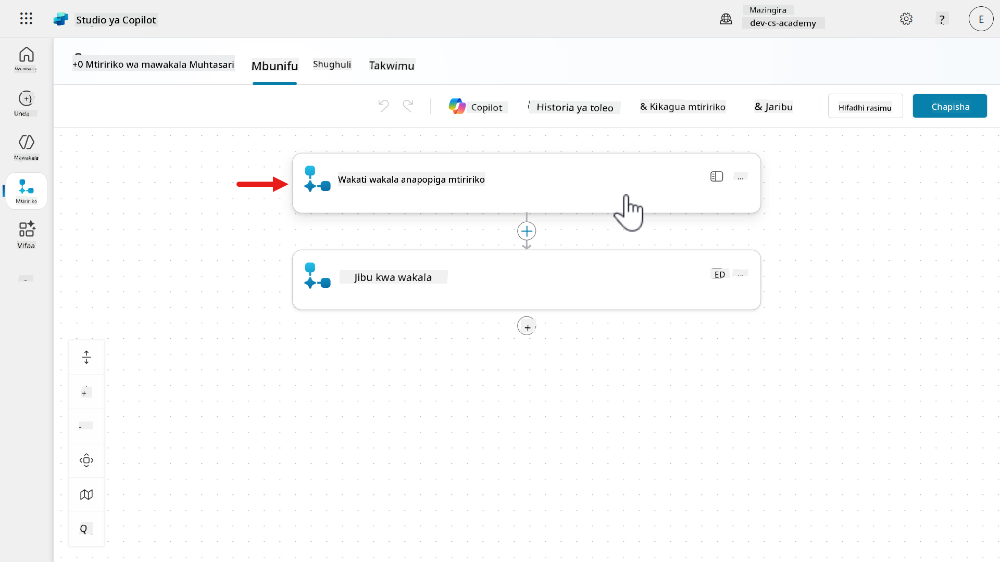

1. Kisha, tutaongeza pembejeo kadhaa kwa mtiririko wa wakala.

    - `DeviceSharePointId` - hii itahifadhi thamani, ID, ya kipengee cha SharePoint. Thamani ya ID ni matokeo kutoka nodi ya Uliza kwa kadi ya kubadilika ambapo mtumiaji alichagua kifaa.

    - `User` - hii itakuwa jina la mtumiaji ambalo litakuwa kutoka kwa mfumo wa wakala.

    - `AdditionalComments` - hii itakuwa maoni yaliyoingizwa na mtumiaji, ambayo ni matokeo kutoka nodi ya Uliza kwa kadi ya kubadilika.

    Kwanza tutaongeza `DeviceSharePointId` kama pembejeo kwa kichochezi chetu. Chagua **+ Ongeza pembejeo**.

    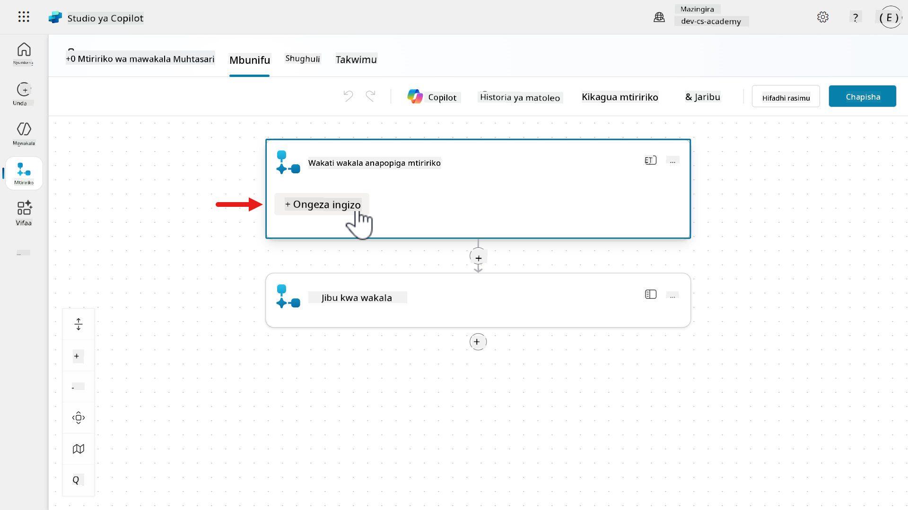

1. Kwa aina ya pembejeo ya mtumiaji, chagua **Maandishi**.

    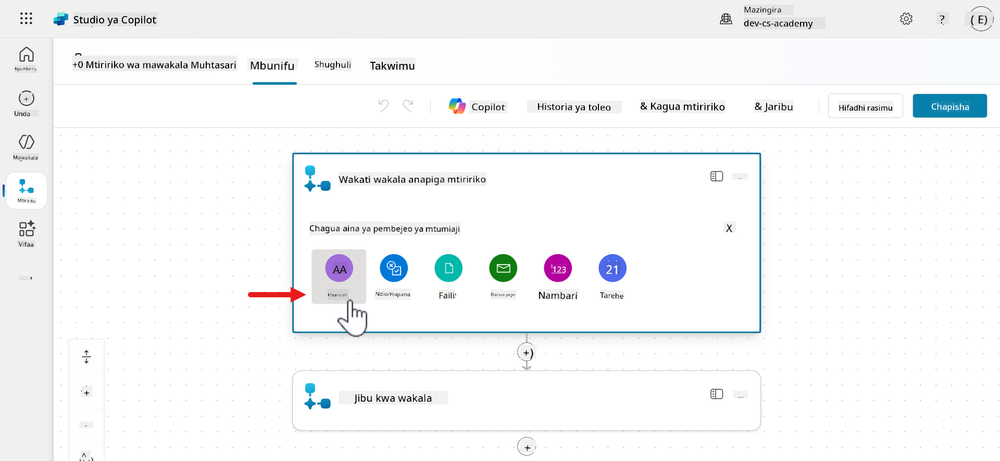

1. Kwa jina la pembejeo, ingiza yafuatayo.

    ```text
    DeviceSharePointId
    ```

    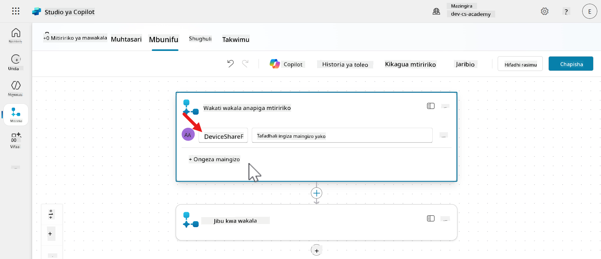

1. Sasa tutaongeza pembejeo ya pili, `User`. Rudia hatua zile zile, chagua **+ Ongeza pembejeo** na chagua **Maandishi**.

    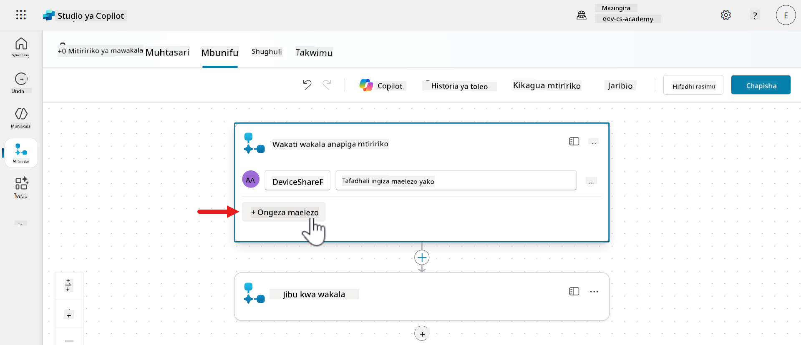

1. Kwa jina la pembejeo, ingiza yafuatayo.

    ```text
    User
    ```

    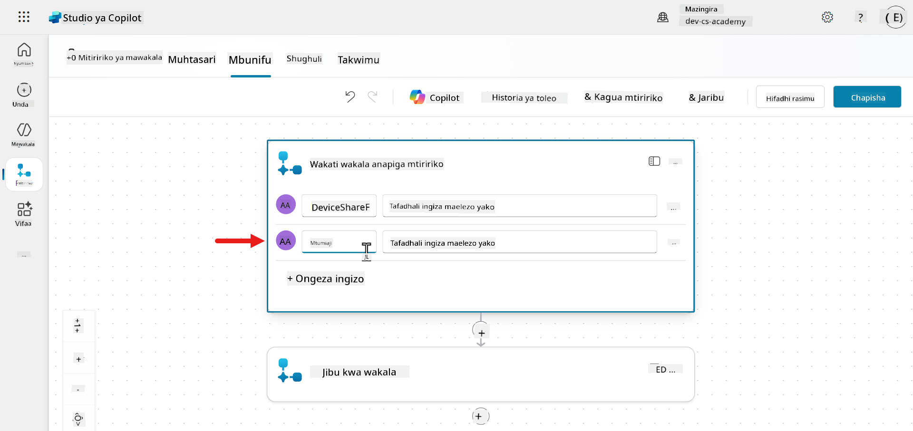

1. Sasa tutaongeza pembejeo ya tatu, `AdditionalComments`. Rudia hatua zile zile, chagua **+ Ongeza pembejeo** na chagua **Maandishi**.

    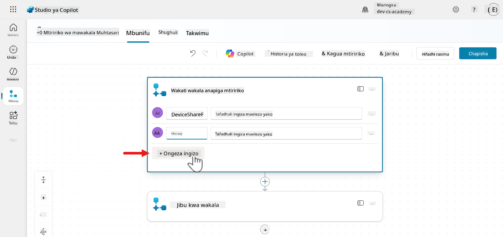

1. Kwa jina la pembejeo, ingiza yafuatayo.

    ```text
    AdditionalComments
    ```

    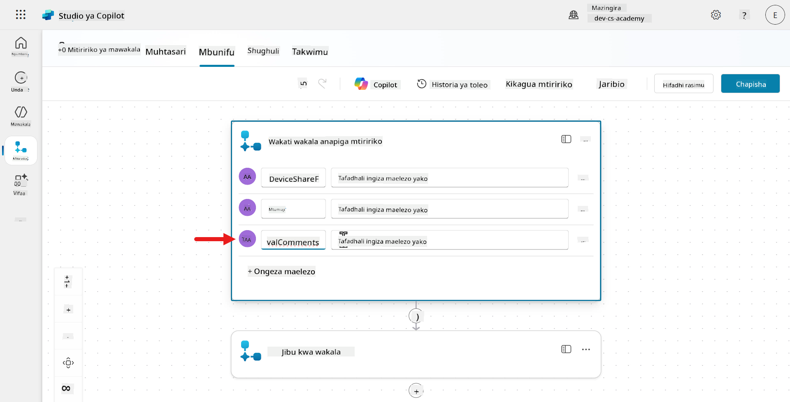

1. Kwa pembejeo ya `AdditionalComments`, tutaiboresha ili iwe ya hiari. Chagua **alama ya ellipsis (...)** na chagua **Fanya sehemu iwe ya hiari**.

    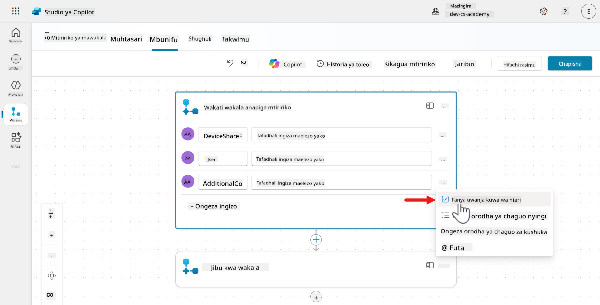

1. Kazi nzuri! Kichochezi sasa kimewekwa, tuendelee. Chagua **alama ya plus +** chini ya kichochezi ili kuingiza hatua mpya.

    

1. Paneli ya **Hatua** itaonekana ambapo unaweza kuona hatua kutoka kwa viunganishi vilivyojengwa ndani zaidi ya 1400 kwa huduma za Microsoft na za watu wengine. Katika **sehemu ya utafutaji** ingiza yafuatayo,

    ```text
    Get item
    ```

    Orodha ya hatua itaonyeshwa katika matokeo ya utafutaji. Chagua hatua ya **Pata kipengee** kutoka kiunganishi cha **SharePoint**.

    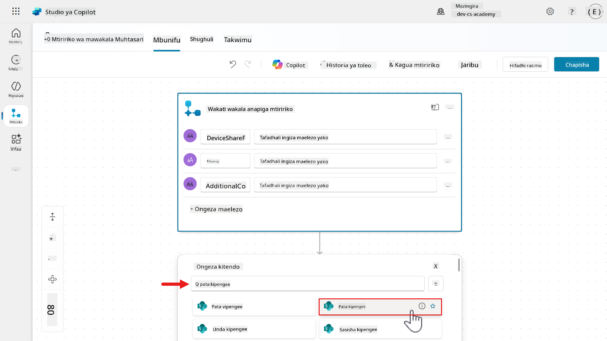

1. Sasa tunaweza kuanza kusanidi hatua ya **Pata kipengee**.

    Chagua **Ellipsis (...)** kwenye hatua ya **Pata kipengee**.

    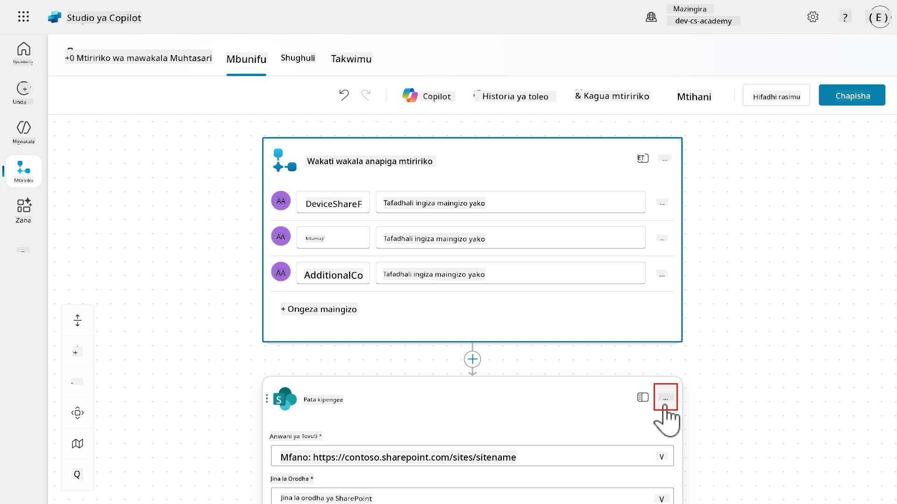

1. Chagua **Badilisha jina**.

    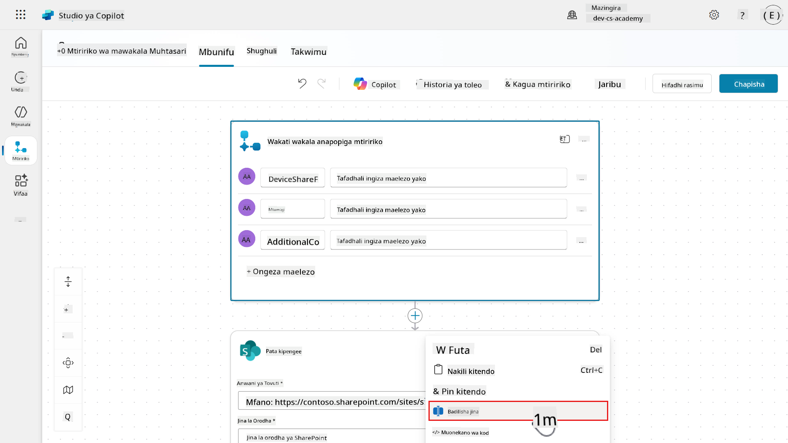

1. Badilisha jina la hatua kuwa,

    ```text
    Get Device
    ```

    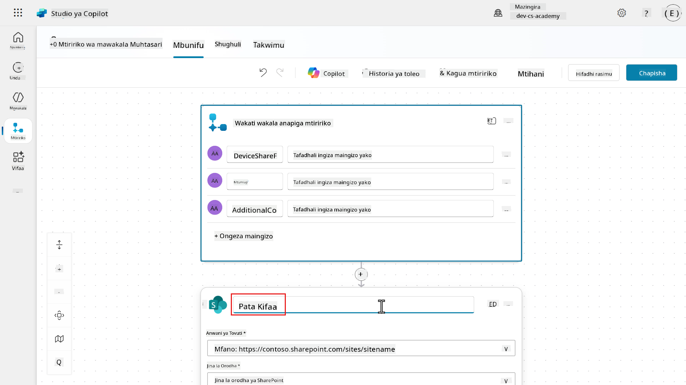

1. Katika sehemu ya **Anwani ya Tovuti**, chagua **Anwani ya tovuti** ya tovuti ya SharePoint ya Contoso IT iliyoundwa katika [Somo 00 - Usanidi wa Kozi - Hatua ya 3: Unda tovuti mpya ya SharePoint](../00-course-setup/README.md#step-4-create-new-sharepoint-site).

    Katika sehemu ya **Jina la Orodha**, chagua orodha ya SharePoint ya **Vifaa**.

    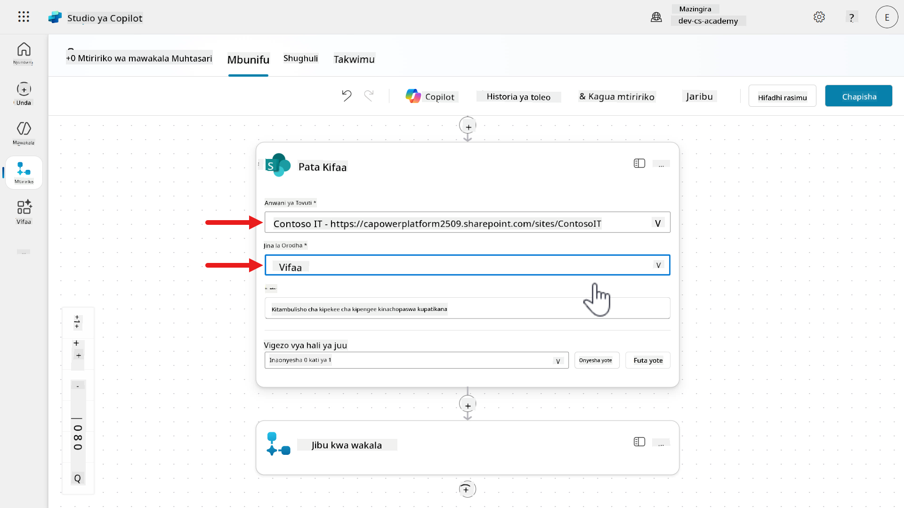

1. Katika sehemu ya **Id**, chagua **alama ya radi** au **alama ya fx** upande wa kulia.

    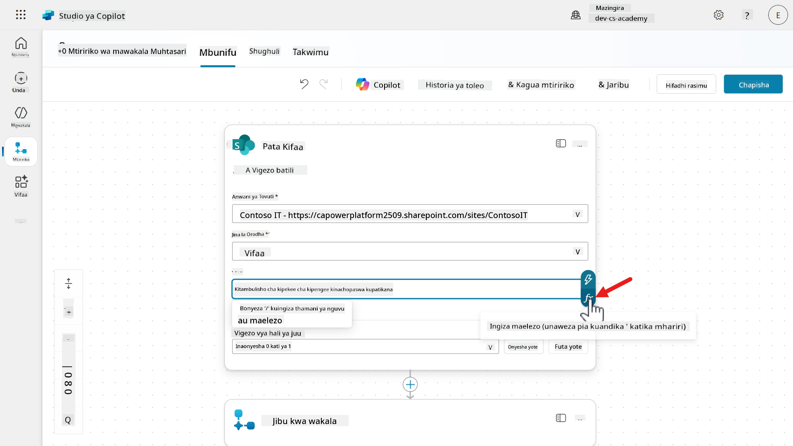

1. Katika kichupo cha **Maudhui ya nguvu** cha paneli ya kuruka, ingiza yafuatayo,

    ```text
    sharepoint
    ```

    Matokeo ya utafutaji yataonyesha pembejeo za vigezo zinazolingana na thamani iliyotafutwa. Chagua kipengele cha **DeviceSharePointId** kutoka kwa kichochezi.

    Kisha, chagua **Ongeza** ili kuongeza pembejeo la maudhui ya nguvu katika sehemu ya **Id** ya hatua.

    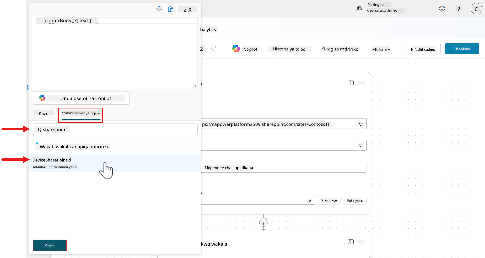

1. Pembejeo la maudhui ya nguvu kutoka kwa kichochezi sasa limerejelewa katika sehemu ya **Id** ya hatua. Sasa tutaongeza moja ya vigezo vya hali ya juu. Chagua **Onyesha yote** ili kuona vigezo vya hali ya juu.

    

1. Kigezo cha **Punguza Safu kwa Mtazamo** kitaonyeshwa na kwa default kimewekwa kwa **Tumia safu zote (Usipunguze)**. Tutabadilisha thamani hii kuwa mtazamo ili kupunguza safu zinazorejeshwa katika majibu ya hatua. Chagua kigezo cha **Punguza Safu kwa Mtazamo** ili kuona orodha ya mitazamo.

    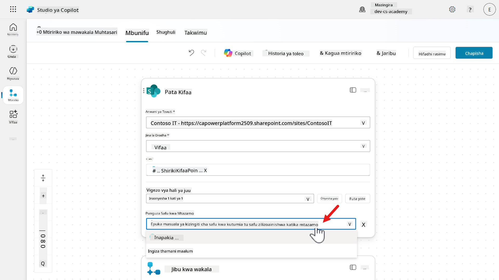

1. Chagua mtazamo wa **Vitu Vyote**.

    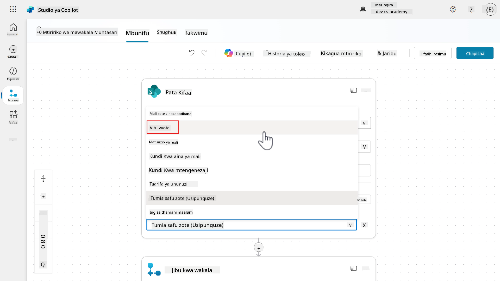

1. Chagua **alama ya plus +** chini ya hatua ya _Pata Kifaa_ ili kuingiza hatua mpya.

    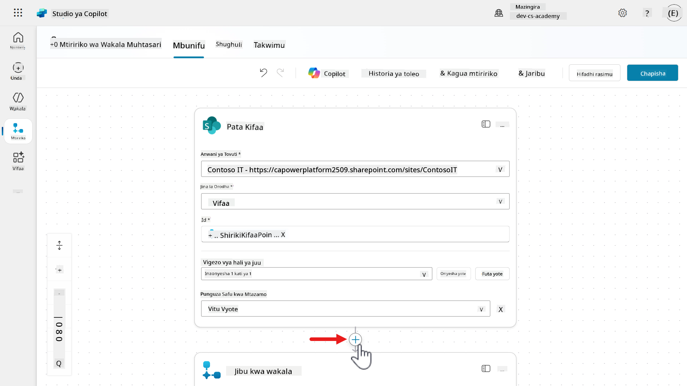

1. Katika sehemu ya utafutaji ingiza yafuatayo,

    ```text
    send an email
    ```

    Orodha ya hatua itaonyeshwa katika matokeo ya utafutaji. Chagua hatua ya **Tuma barua pepe (V2)** kutoka kiunganishi cha **Office 365 Outlook**.

    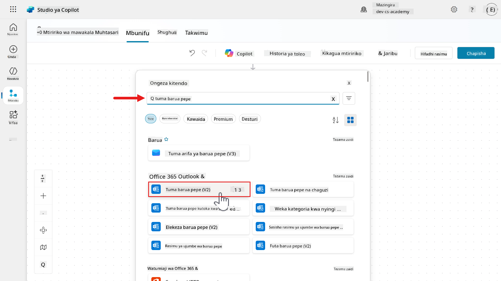

1. Tunahitaji kuunda muunganisho kwa hatua ya kiunganishi. Chagua **Ingia**.

    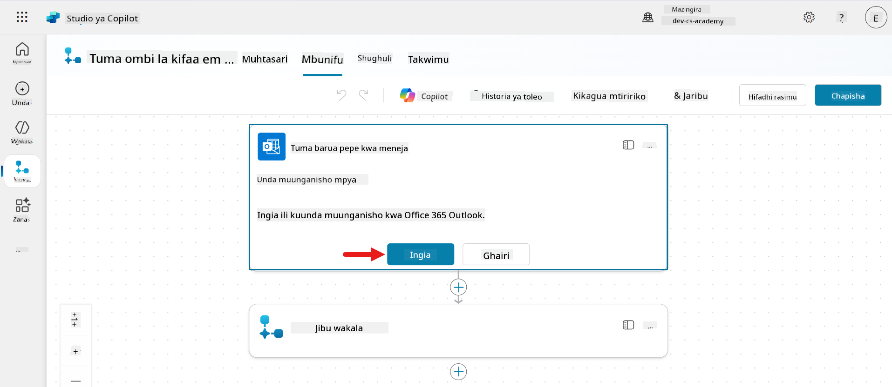

1. Chagua akaunti yako ya mtumiaji iliyosainiwa.

    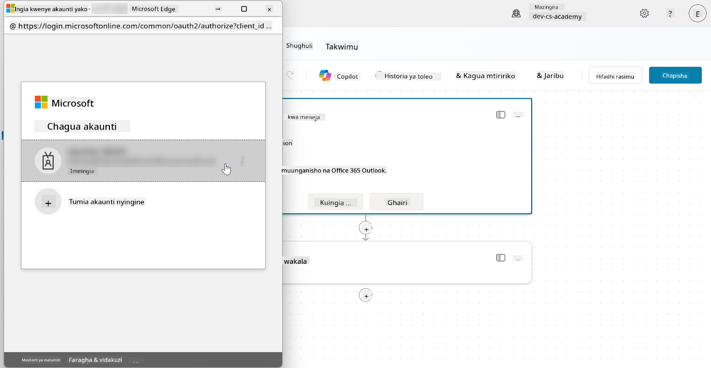

1. Chagua **Ruhusu ufikiaji**. Muunganisho sasa umeundwa.

    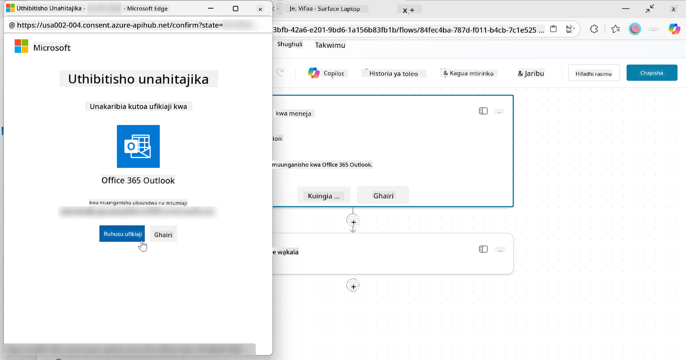

1. Badilisha jina la hatua kuwa yafuatayo,

    ```text
    Send an email to manager
    ```

    Sasa tuweke vigezo vya pembejeo vya hatua yetu.

    Kwa kigezo cha pembejeo cha **Kwa**, chagua wewe mwenyewe. Kwa kawaida hii ingekuwa meneja wako au tungetumia hatua nyingine inayochukua meneja wako kulingana na wasifu wako wa Entra ID lakini kwa madhumuni ya somo hili, chagua wewe mwenyewe.

    Kwa kigezo cha pembejeo cha **Mada**, ingiza yafuatayo,

    ```text
    Request type: new device
    ```

    Kwa kigezo cha pembejeo cha **Mwili**, ingiza yafuatayo,

    ```text
    Hi,

    New device requested from

    Manufacturer:
    Model:
    Link to item in SharePoint
    Additional comments from:

    This is an automated email from Contoso Helpdesk Copilot
    ```

    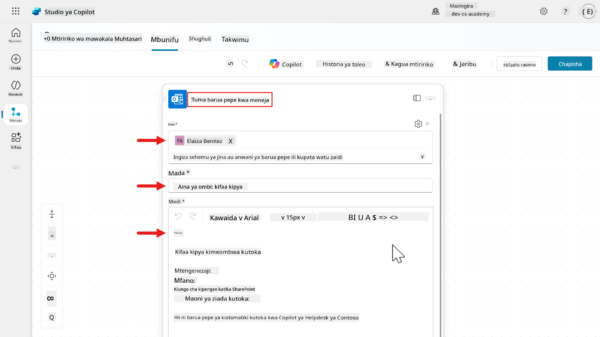

1. Kisha, tutaongeza kigezo cha pembejeo cha **Mwili** na marejeleo ya maudhui ya nguvu kutoka kwa **kichochezi** au hatua ya **Pata kipengee**. Ingiza nafasi baada ya mstari wa pili ili tuingize jina la mtumiaji kutoka kwa pembejeo la kichochezi, **User**.

    Chagua **alama ya radi** au **alama ya fx** upande wa kulia.

    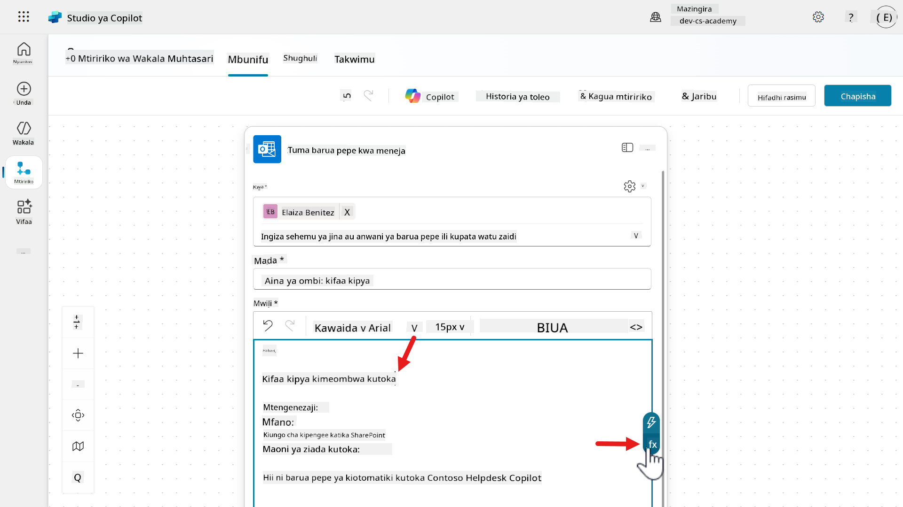

1. Katika kichupo cha **Maudhui ya nguvu** cha paneli ya kuruka, chagua pembejeo la **User** kutoka kwa kichochezi.

    Chagua **Ongeza** ili kuongeza pembejeo la maudhui ya nguvu **User** katika kigezo cha pembejeo cha **Mwili** cha hatua.

    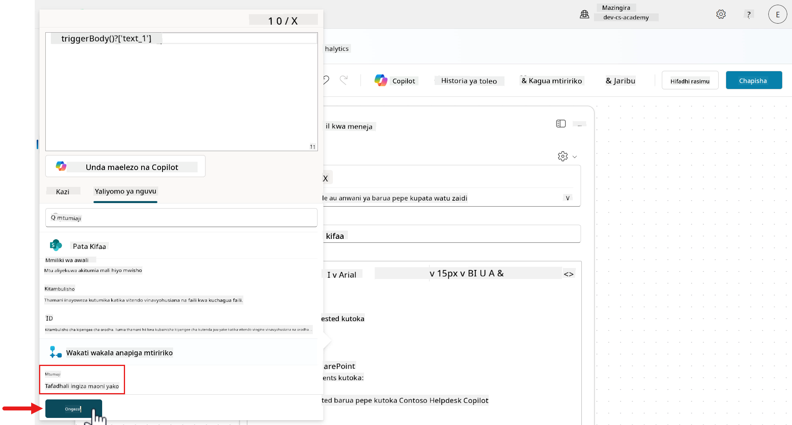
1. Maudhui ya nguvu kutoka kwa kichochezi sasa yanarejelewa katika parameta ya **Mwili** ya hatua. Tutarudia mchakato huo kwa mistari iliyobaki katika mwili wa ujumbe wa barua pepe.

    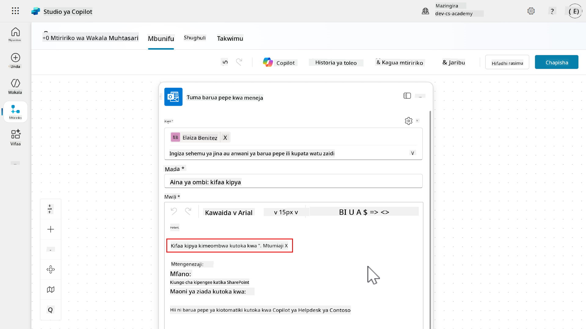

1. Bonyeza kwenye nafasi karibu na `Manufacturer:`. Chagua **alama ya radi** au **alama ya fx** upande wa kulia.

    Katika kichupo cha **Maudhui ya Nguvu** kwenye dirisha linalojitokeza, ingiza yafuatayo kwenye uwanja wa utafutaji,

    ```text
    manufacturer
    ```

    Chagua ingizo la **Manufacturer value** kutoka kwa kichochezi na uchague **Ongeza**.

    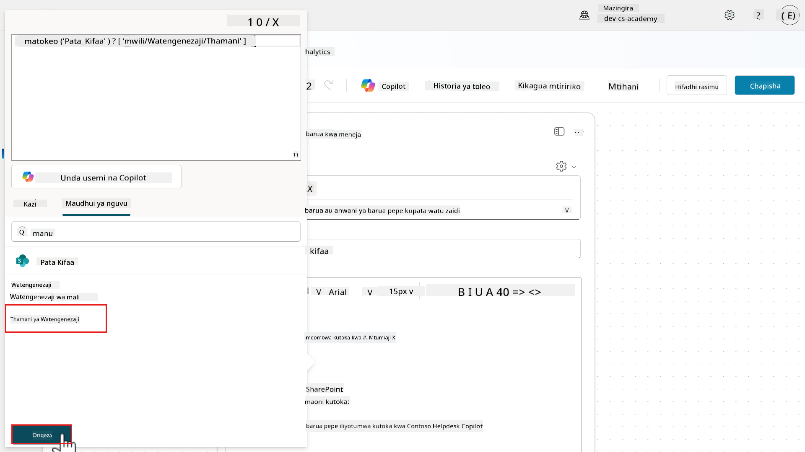

1. Bonyeza kwenye nafasi karibu na `Model:`. Chagua **alama ya radi** au **alama ya fx** upande wa kulia.

    Katika kichupo cha **Maudhui ya Nguvu** kwenye dirisha linalojitokeza, ingiza yafuatayo kwenye uwanja wa utafutaji,

    ```text
    model
    ```

    Chagua ingizo la **Model** kutoka kwa hatua ya **Get item** na uchague **Ongeza**.

    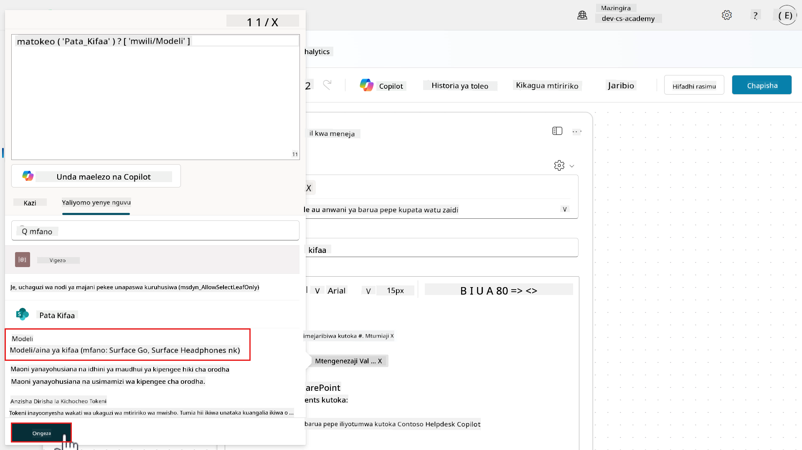

1. Kwa maandishi ya `Link to item in SharePoint`, tutasasisha hili kuwa kiungo cha mtandao katika mwili wa ujumbe wa barua pepe. Bonyeza mwanzoni mwa mstari na uchague **alama ya radi** au **alama ya fx** upande wa kulia.

    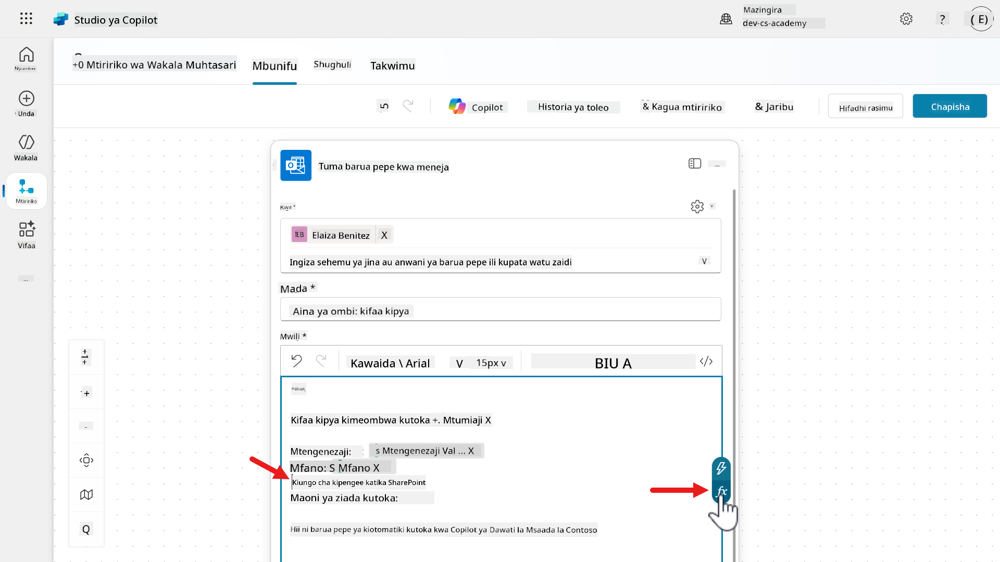

1. Bonyeza baada ya tagi ya HTML ya kiungo na uchague **alama ya radi** au **alama ya fx** upande wa kulia.

    Katika kichupo cha **Maudhui ya Nguvu** kwenye dirisha linalojitokeza, ingiza yafuatayo kwenye uwanja wa utafutaji,

    ```text
    link to item
    ```

    Chagua ingizo la **Link to item** kutoka kwa hatua ya **Get item** na uchague **Ongeza**.

    

1. Tunahitaji kubadilisha hadi mhariri wa HTML kwa kuchagua ikoni ya **&lt;/&gt;**.

    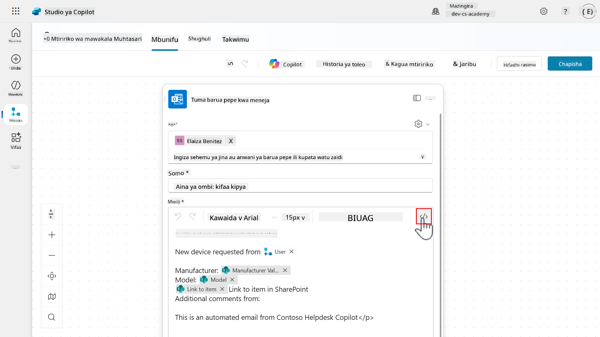

1. Mhariri wa HTML sasa umewezeshwa. Bonyeza kabla ya maandishi ya `Link to item in SharePoint`, ongeza tagi ya HTML ya kiungo ili kuunda kiungo cha mtandao. Nakili na ubandike yafuatayo.

    ```text
    <a href="
    ```

    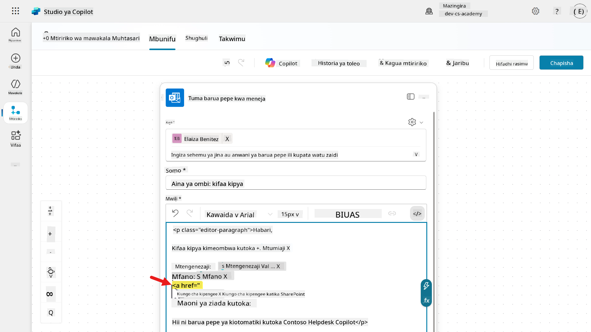

1. Ingizo la maudhui ya nguvu la **Link to item** sasa linarejelewa katika parameta ya **Mwili**. Bonyeza baada ya ingizo la **Link to item**, nakili na ubandike yafuatayo.

    ```text
    ">
    ```

    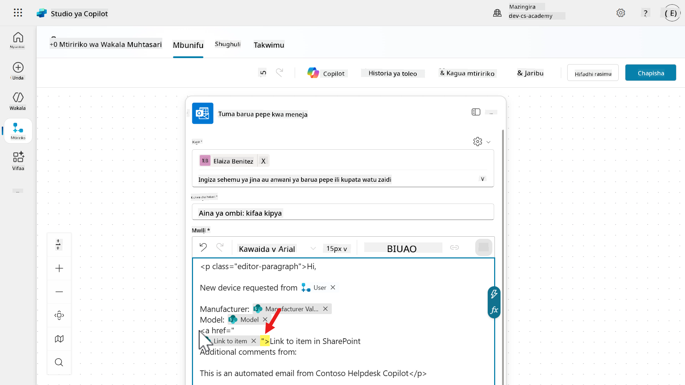

1. Bonyeza baada ya maandishi ya `Link to item in SharePoint`, funga tagi ya kiungo cha html. Nakili na ubandike yafuatayo.

    ```text
    </a>
    ```

    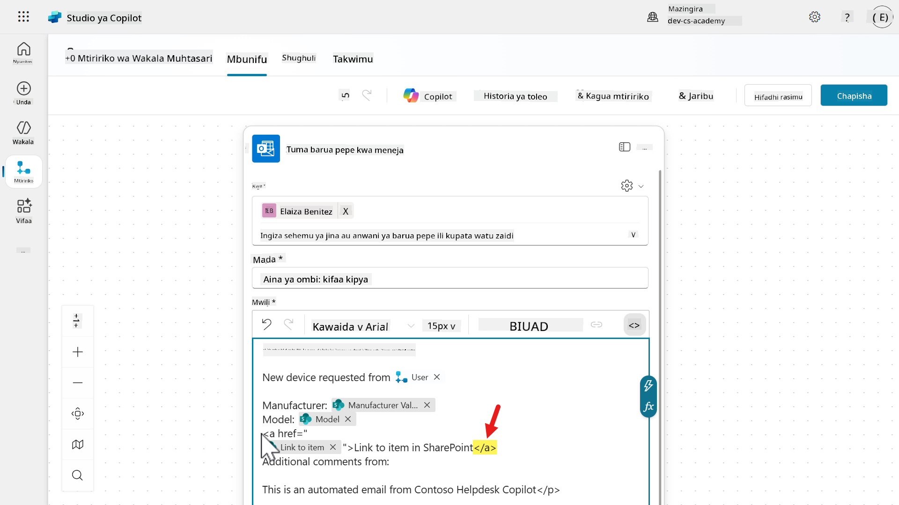

1. Chagua ikoni ya **&lt;/&gt;** ili kubadilisha mtazamo wa msimbo.

    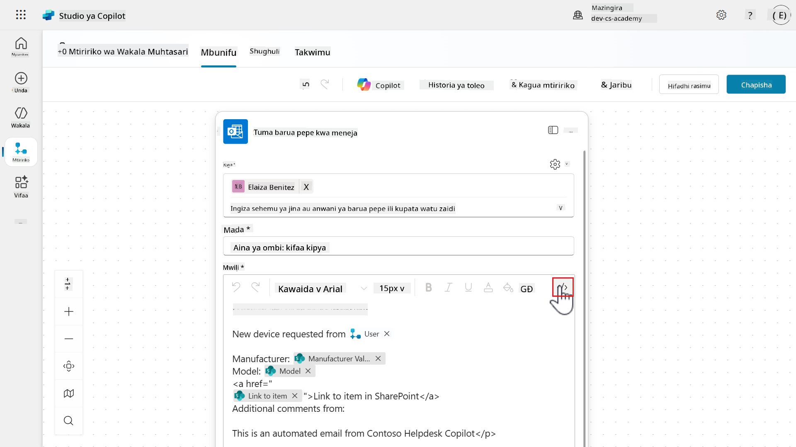

1. Kisha chagua tena ikoni ya **&lt;/&gt;** ili kubadilisha mtazamo wa msimbo tena.

    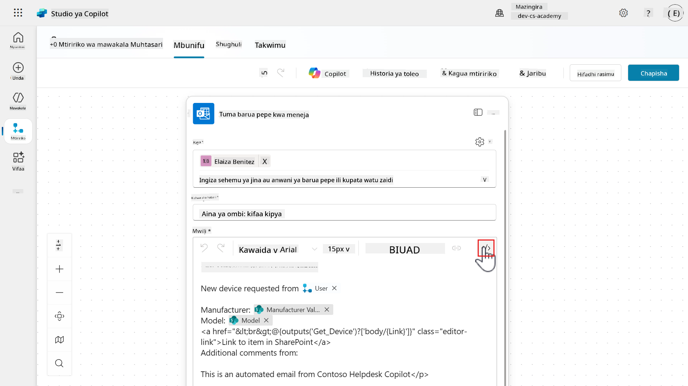

1. Angalia jinsi kuna herufi kadhaa za ziada `&lt;br&gt;`. Futa herufi hizi.

    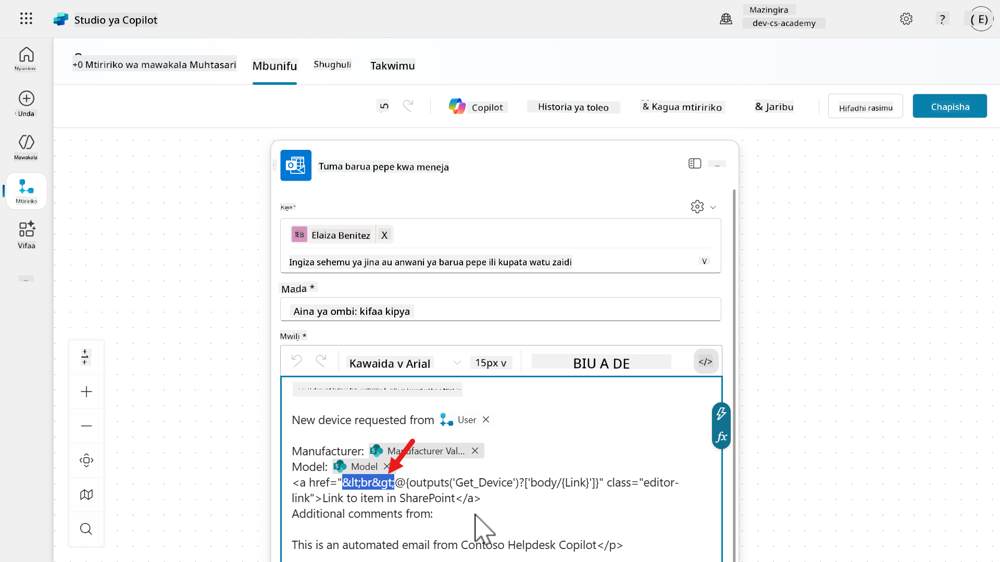

1. Tumemaliza kuongeza kiungo cha mtandao kwenye mwili wa ujumbe wa barua pepe 😎 Chagua ikoni ya **&lt;/&gt;** ili kubadilisha mtazamo wa msimbo.

    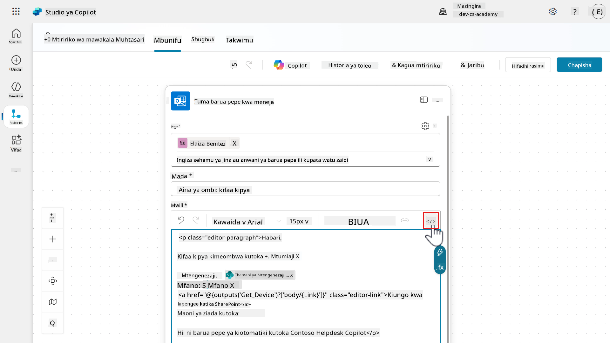

1. Bonyeza baada ya maandishi ya `Additional comments from` kabla ya herufi ya kolon na uchague **alama ya radi** au **alama ya fx** upande wa kulia.

    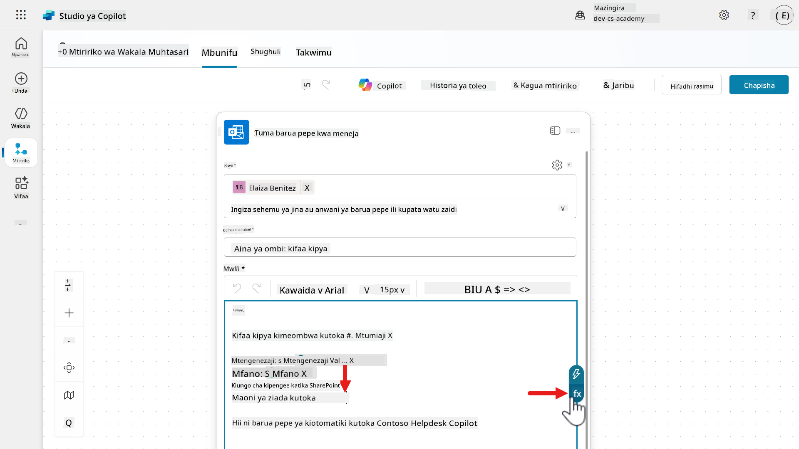

1. Katika kichupo cha **Maudhui ya Nguvu** kwenye dirisha linalojitokeza, ingiza yafuatayo kwenye uwanja wa utafutaji,

    ```text
    user
    ```

    Chagua parameta ya **User** kutoka kwa kichochezi na uchague **Ongeza**.

    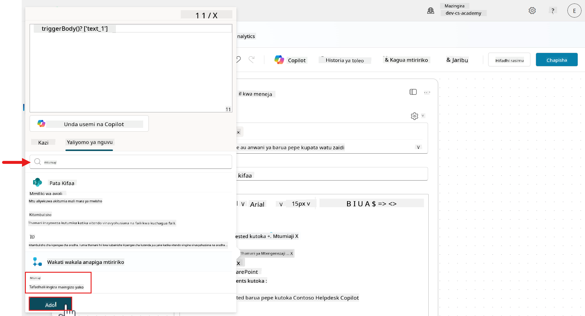

1. Sasa tutaingiza usemi ambao utaonyesha thamani ya Maoni ya Ziada ikiwa yametolewa na mtumiaji katika nodi ya **Ask an adaptive card**, vinginevyo itaonyesha "None" ikiwa mtumiaji hajatoa maoni yoyote.

    Bonyeza baada ya kolon na uchague **alama ya radi** au **alama ya fx** upande wa kulia.

    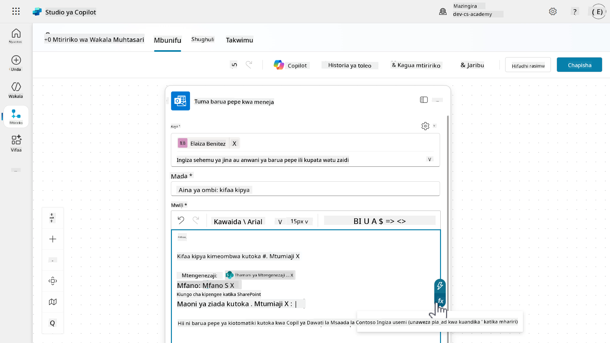

1. Katika kichupo cha **Kazi** cha dirisha linalojitokeza na katika uwanja wa usemi juu, ingiza yafuatayo,

    ```text
    if(empty())
    ```

    Usemi huu unatumia kazi ya `if` kwa kauli ya if-else.

    Kazi inayofuata inayotumika ni `empty` ambayo inakagua ikiwa thamani ipo au la katika parameta ya kamba. Parameta ya kamba inayorejelewa ni thamani ya parameta ya ingizo la `AdditionalComments` kutoka kwa kichochezi.

    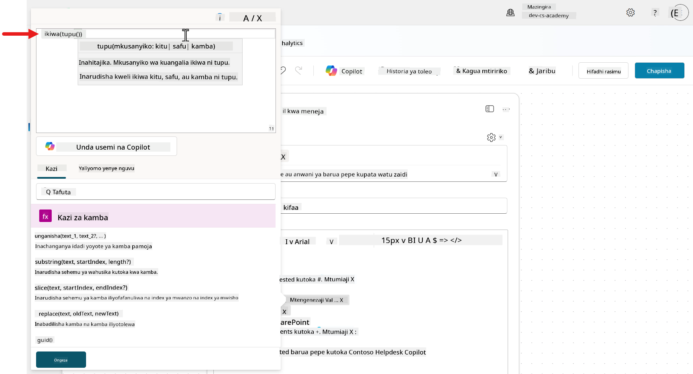

1. Kisha, bonyeza **ndani ya mabano** baada ya kazi ya `empty`. Tutaingiza parameta ya ingizo la `AdditionalComments` kutoka kwa kichochezi.

    Chagua kichupo cha **Maudhui ya Nguvu**. Ingiza yafuatayo kwenye uwanja wa utafutaji,

    ```text
    Additional
    ```

    Shuka chini kwenye dirisha na uchague ingizo la **AdditionalComments** kutoka kwa kichochezi. Parameta sasa itaongezwa kama parameta ya kamba katika usemi.

    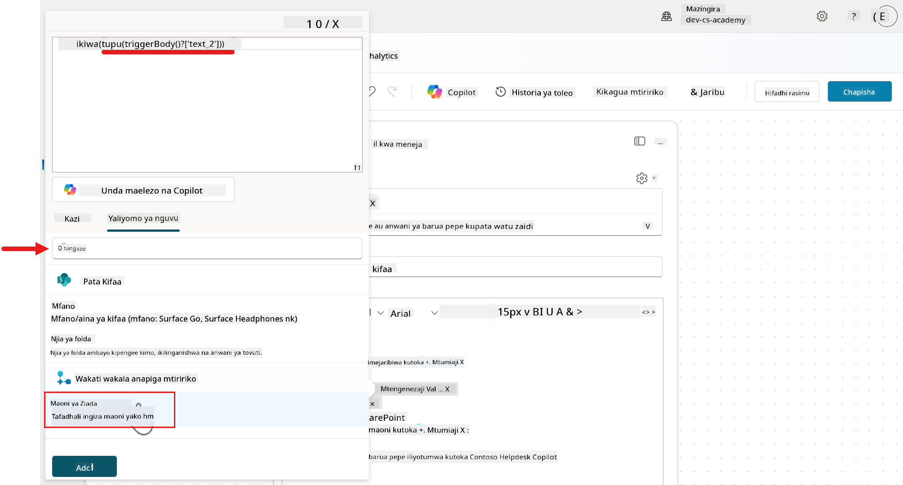

1. Kisha tutaelezea mantiki ya **_kweli_**, ambapo ikiwa parameta ya kamba ya `AdditionalComments` ni tupu, basi tunataka kuonyesha kamba (maandishi) ya `None`.

    Baada ya mabano yanayofunga parameta ya kamba, ingiza yafuatayo,

    ```text
    , 'None',
    ```

    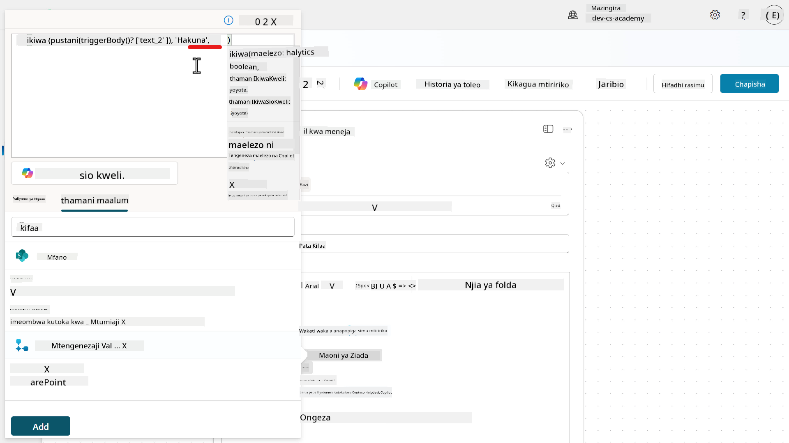

1. Hatimaye tutaelezea mantiki ya **_uongo_**, ambapo ikiwa parameta ya kamba ya `AdditionalComments` siyo tupu, basi tunataka kuonyesha thamani ya parameta ya ingizo la **AdditionalComments** kutoka kwa kichochezi chetu.

    > Kumbuka thamani hii itatoka kwenye uwanja wa Maoni ya Ziada wa kadi ya adaptive katika nodi ya **Ask with adaptive card** kwenye mada ya **Request device**.

    Baada ya koma baada ya mantiki yetu ya **_kweli_**, chagua kichupo cha **Maudhui ya Nguvu**. Ingiza yafuatayo kwenye uwanja wa utafutaji,

    ```text
    Additional
    ```

    Shuka chini kwenye dirisha na uchague ingizo la **AdditionalComments** kutoka kwa kichochezi. Parameta sasa itaongezwa kama parameta ya kamba katika usemi.

    Sasa iongeze kwenye parameta yetu ya **Mwili** kwa kuchagua **Ongeza**.

    

1. Nzuri, usemi wetu umekamilika! Usemi sasa umeongezwa kwenye parameta ya **Mwili**. Hatimaye, fanya mstari wa mwisho kuwa katika Italiki.

    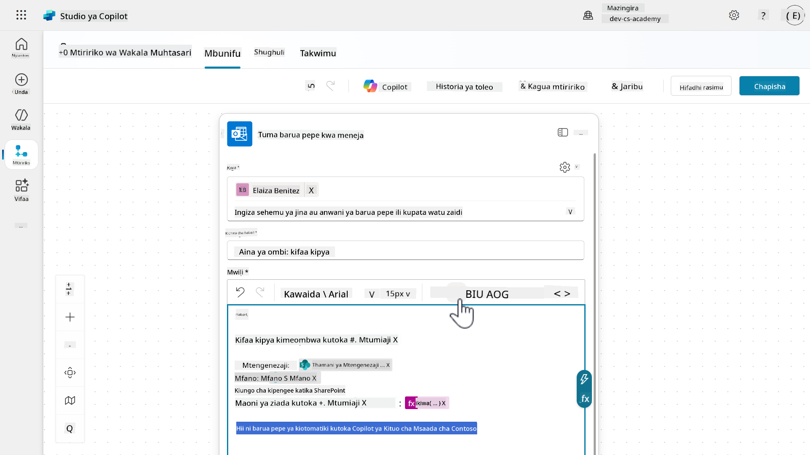

1. Sasa tutaongeza hatua ya **Respond to the agent** ili kutuma thamani ya parameta ya **Model value** kutoka kwa hatua ya **Get item** kurudi kwa wakala.

    Shikilia kitufe cha kushoto cha panya yako na songa juu ndani ya mbunifu ili kuona hatua ya **Respond to the agent**.

    Chagua hatua ya **Respond to the agent** na uchague **Text** kama aina.

    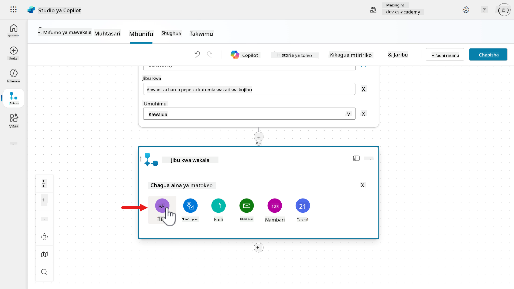

1. Ingiza yafuatayo kama jina la output.

    ```text
    ModelValue
    ```

    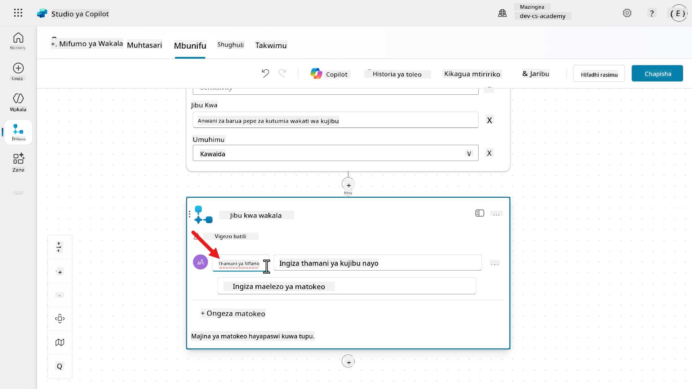

1. Chagua uwanja wa thamani na uchague **alama ya radi** au **alama ya fx** upande wa kulia.

    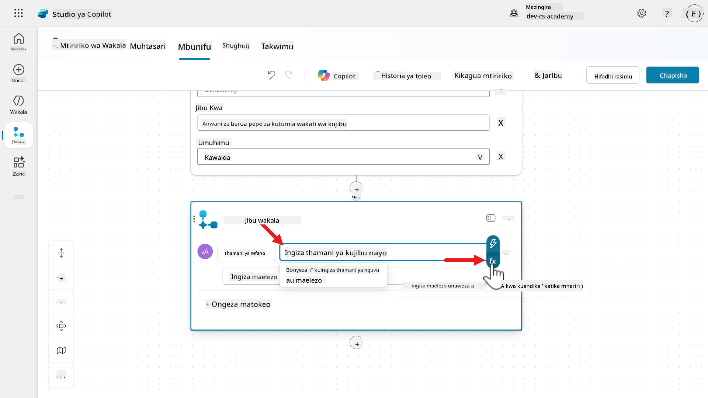

1. Katika kichupo cha **Maudhui ya Nguvu** kwenye dirisha linalojitokeza, ingiza yafuatayo kwenye uwanja wa utafutaji,

    ```text
    model
    ```

    Chagua parameta ya **Model** kutoka kwa hatua ya **Get item** na uchague **Ongeza**.

    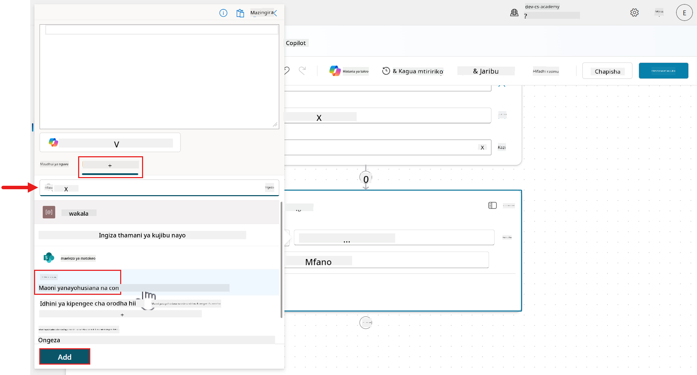

1. Parameta ya **Model** sasa ni thamani ya output ya maandishi. Chagua **Save draft** kuhifadhi mtiririko wa wakala wetu.

    Tumekamilisha mtiririko wa wakala wetu 👏🏻

    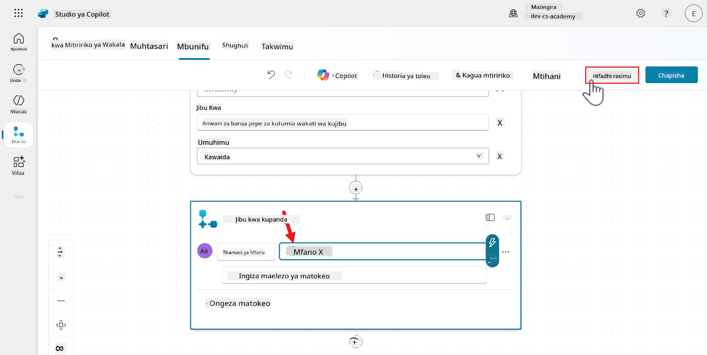

1. Hebu tufanye sasisho moja zaidi kwenye mtiririko wa wakala wetu kabla ya kuchapisha. Chagua kichupo cha **Overview** na uchague **Edit**.

    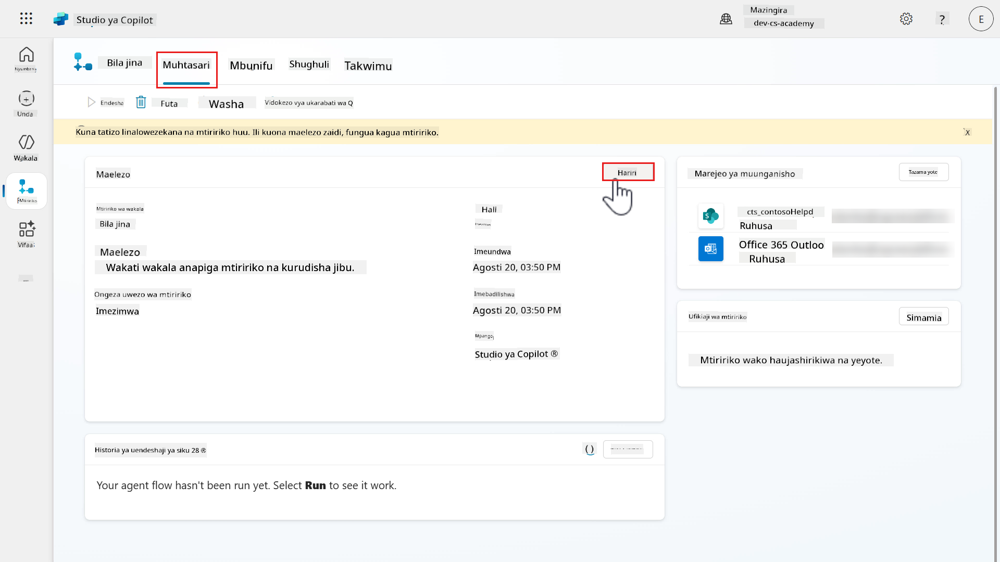

1. Kwa jina la **Flow name**, nakili na ubandike yafuatayo.

    ```text
    Send device request email
    ```

    Kwa **Maelezo**, chagua **ikoni ya upya** kutumia AI kuunda maelezo kiotomatiki kulingana na kichochezi na hatua katika mtiririko wa wakala.

    Chagua **Save** kuhifadhi jina lililosasishwa na maelezo ya mtiririko wa wakala.

    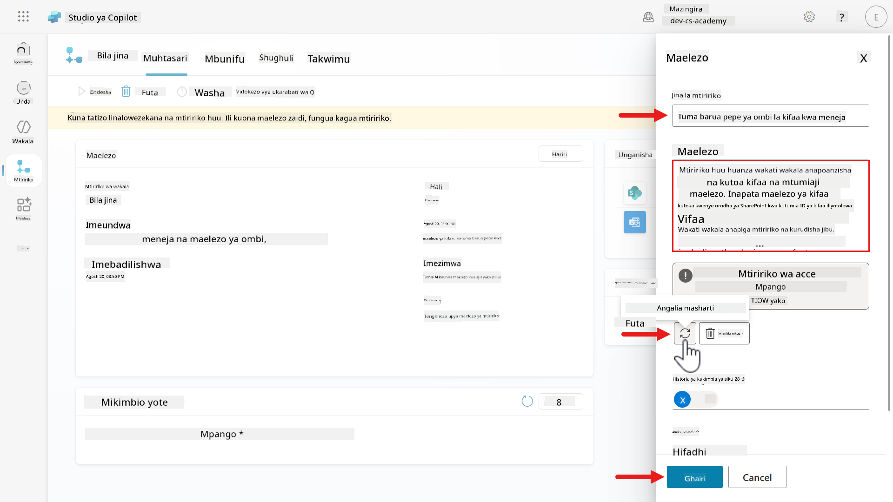

1. Chagua kichupo cha **Designer** na uchague **Publish** kuchapisha mtiririko wa wakala ili uweze kuongezwa kama nodi katika mada ya **Request device**.

    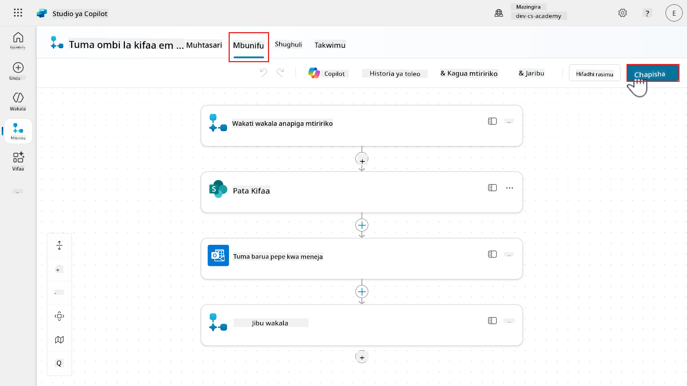

1. Ujumbe wa uthibitisho utaonekana hivi karibuni kuthibitisha kuwa mtiririko wa wakala umechapishwa.

    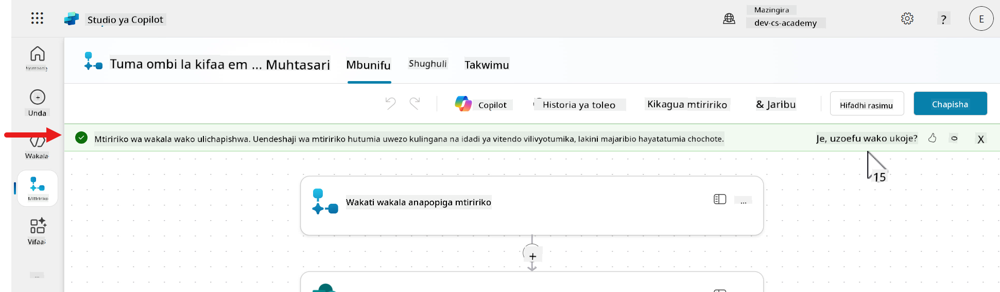

### 9.2 Ongeza mtiririko wa wakala kwenye mada

Sasa tuongeze mtiririko wa wakala kwenye mada ya **Request device**.

1. Chagua **Agents** kwenye menyu ya upande wa kushoto na uchague **Contoso Helpdesk Agent**.

    

1. Chagua kichupo cha **Topics**.

    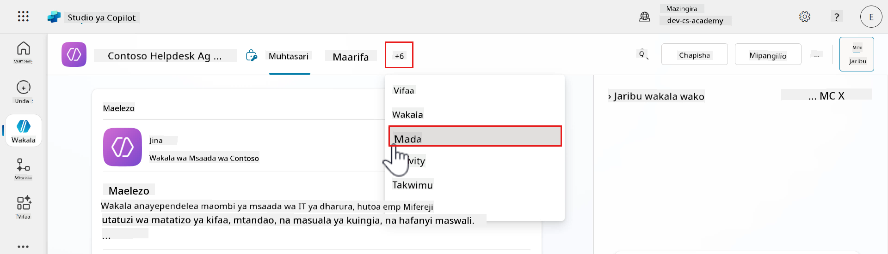

1. Chagua mada ya **Request device**.

    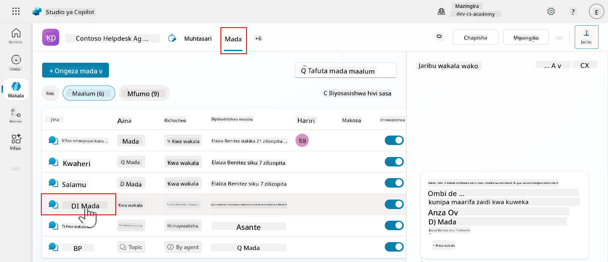

1. Shuka chini kwenye nodi ya **Ask with adaptive card** na ongeza nodi mpya.

    Chagua **Add a tool** na katika kichupo cha **Basic tools** cha dirisha linalojitokeza, chagua mtiririko wa wakala wa **Send device request email** ambao tumeunda na kuchapisha hivi karibuni.

    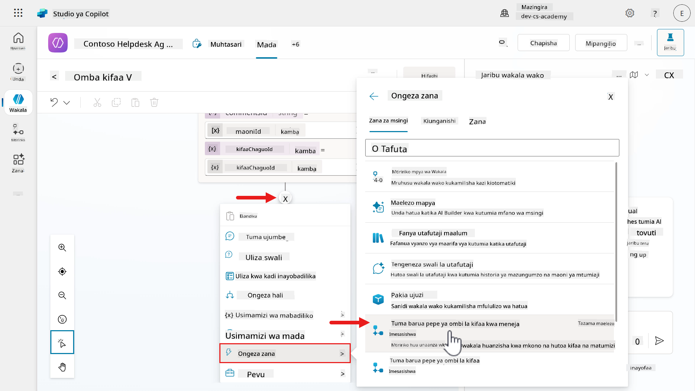

1. Kwa vichochezi vya ingizo vya mtiririko wetu wa wakala, tunahitaji kuchagua matokeo ya mabadiliko kutoka kwa nodi ya **Ask with adaptive card**.

    Chagua **ikoni ya ellipsis (...)** kwa ingizo la **DeviceSharePointId**.

    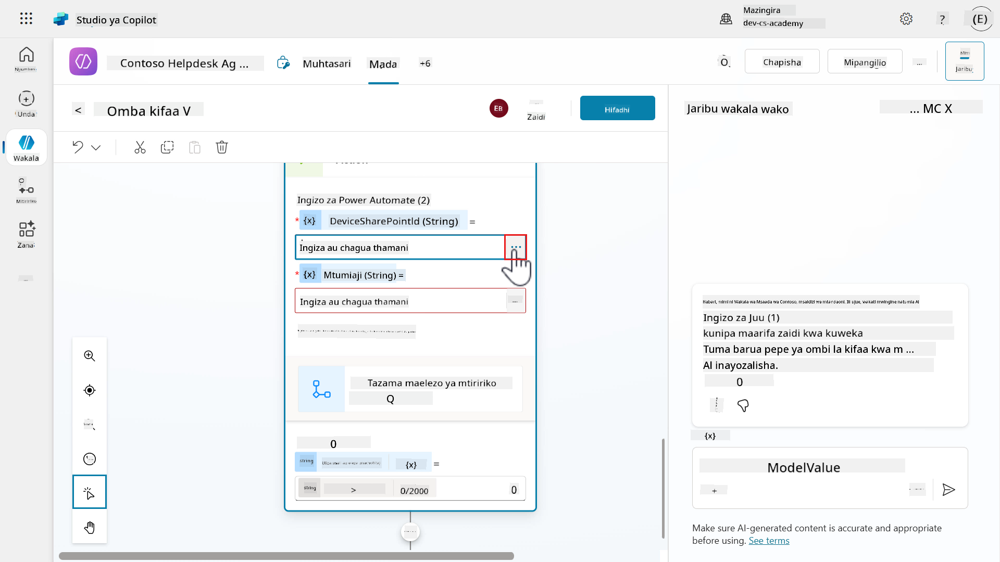

1. Chagua mabadiliko ya **deviceSelectionId** ambayo ni moja ya matokeo yaliyofafanuliwa katika nodi ya **Ask with adaptive card**.

    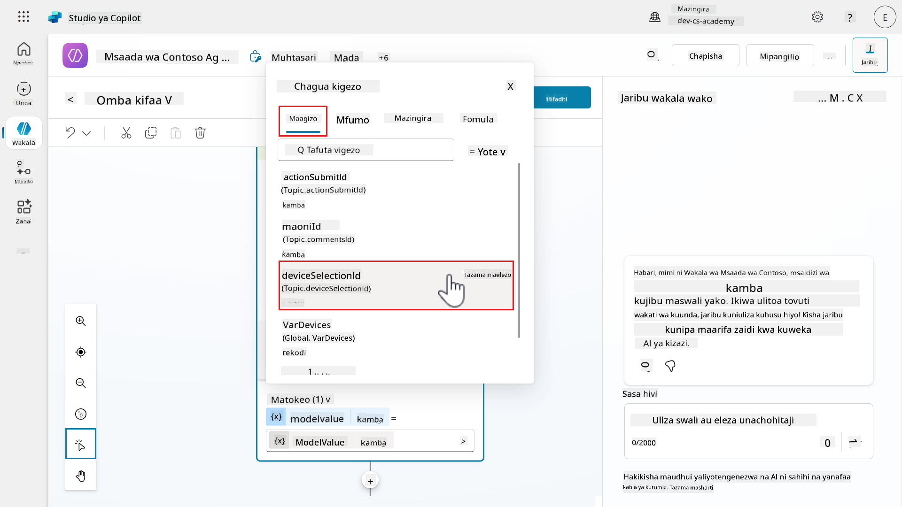

1. Kisha, chagua **ikoni ya ellipsis (...)** kwa ingizo la **User**.

    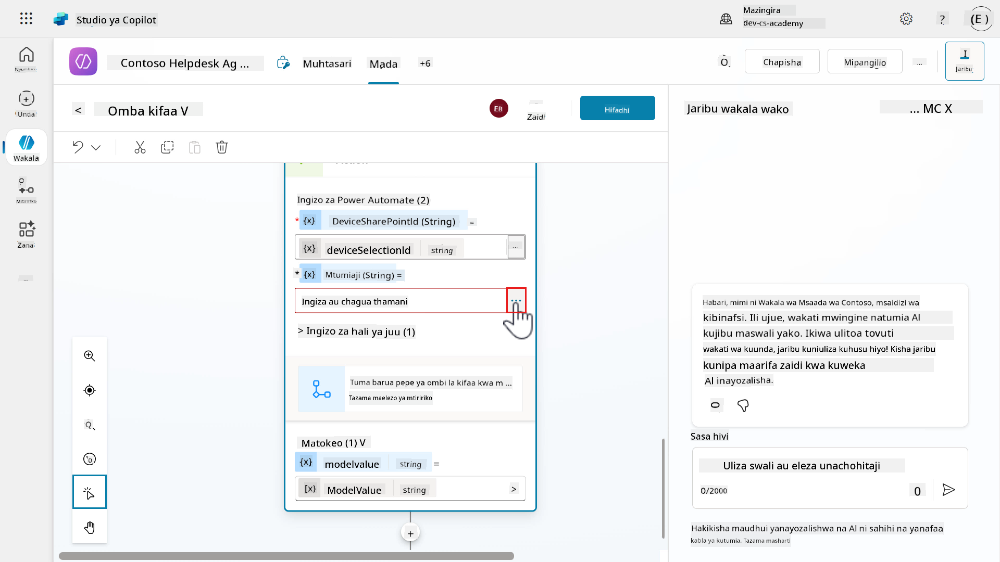

1. Chagua kichupo cha **System** kwenye dirisha la mabadiliko linalojitokeza na uchague **User.DisplayName**. Mabadiliko haya yanahifadhi jina la kuonyesha la mtumiaji wa ndani anayeshirikiana na wakala.

    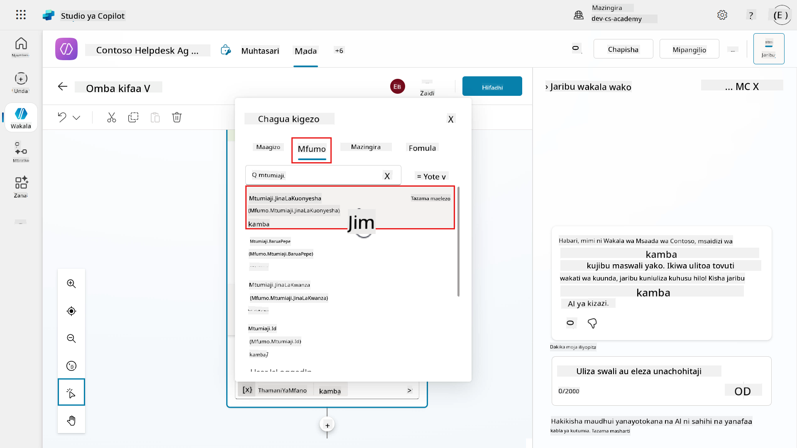

1. Kisha, chagua **ikoni ya kubwa kuliko** kwa **Advanced inputs** ili kupanua na kuona ingizo la **AdditionalComments**.

    

1. Chagua **ikoni ya ellipsis (...)** kwa ingizo la AdditionalComments.

    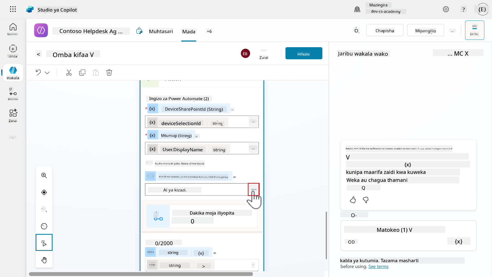

1. Chagua kichupo cha **Formula** na ikoni ya kupanua kwenye dirisha la mabadiliko linalojitokeza kwani tutatumia usemi wa Power Fx.

    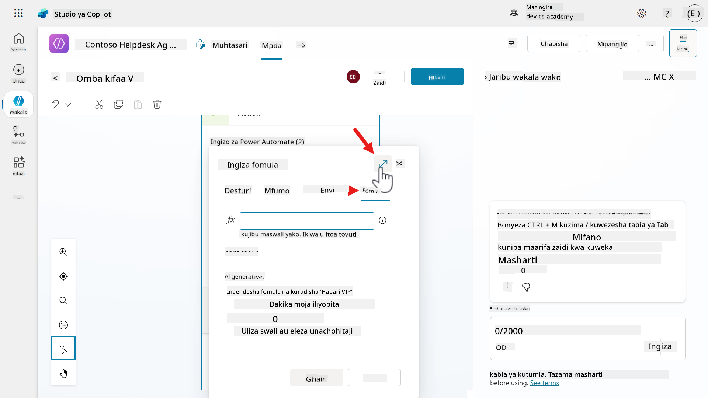

1. Sawa na usemi katika mtiririko wa wakala ambao hufanya ukaguzi wa masharti kwa kutumia kazi ya _if_, lakini wakati huu
    - kutumia kazi za Power Fx,
    - na kuingiza ama thamani ya sifuri, au thamani ya mabadiliko ya `commentsId` kutoka kwa nodi ya **Ask with adaptive card**.

    Ingiza kazi zifuatazo katika uwanja wa Power Fx,

    ```text
    If(IsBlank())
    ```

Maelezo haya yanatumia kazi ya `If` kwa kauli ya ikiwa-vinginevyo.

Kazi inayofuata inayotumika ni `IsBlank` ambayo hukagua kama thamani ipo au haipo katika parameter ya kamba. Parameter ya kamba inayorejelewa ni variable ya matokeo `commentsId` kutoka kwa nodi ya **Uliza kwa kadi ya adaptive**.

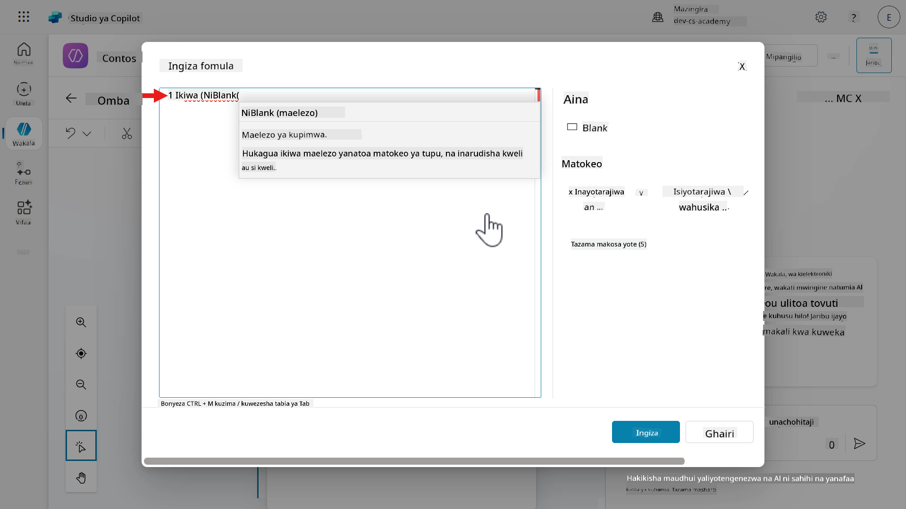

1. Kisha, bonyeza **ndani ya mabano** baada ya kazi ya `IsBlank`. Tutaingiza variable ya matokeo ya `commentsId` kutoka kwa nodi ya **Uliza kwa kadi ya adaptive**.

Ingiza yafuatayo ndani ya mabano,

    ```text
    Topic.commentsId
    ```

Na ongeza koma baada ya mabano.

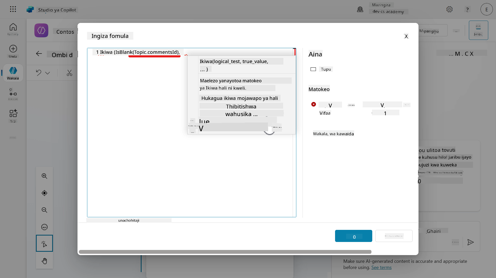

1. Sasa tutaelezea mantiki

   - wakati **_kweli_** - ikiwa parameter ya kamba ya `Topic.commentsId` ni tupu, basi tunataka kuingiza thamani ya sifuri.
   - wakati **_siyo kweli_** - ikiwa parameter ya kamba ya `Topic.commentsId` siyo tupu, basi ingiza thamani ya variable ya commentsId.

Baada ya mabano yanayofunga parameter ya kamba, ingiza yafuatayo,

    ```text
    "", Topic.commentsId)
    ```

Maelezo ya Power Fx yanapaswa kuwa yafuatayo,

    ```text
    If(IsBlank(Topic.commentsId), "", Topic.commentsId)
    ```

Kazi nzuri, maelezo yetu yamekamilika! 🙌🏻 Sasa chagua **Weka** ili kuweka parameter ya ingizo ya mtiririko wa wakala kwa maelezo ya Power Fx.

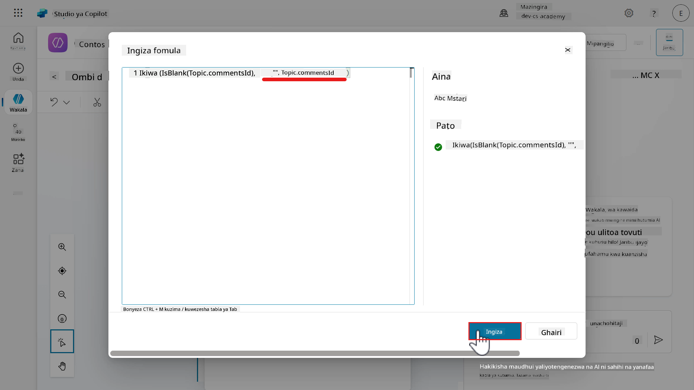

1. **Hifadhi** mada.

### 9.3 Sasisha mada ya Ombi la kifaa kwa nodi kadhaa kwa uzoefu bora wa mtumiaji

Sasa tutaongeza nodi mbili zaidi:

- **Tuma ujumbe** - hii itafanya kazi kama ujumbe wa uthibitisho unaorejelea kifaa kilichochaguliwa na kwamba ombi lao limewasilishwa.

- **Usimamizi wa mada** - kufunga mazungumzo, tutaelekeza kwenye nodi ya **Mwisho wa mazungumzo**.

Tuanzishe!

1. Chagua **alama ya plus +** chini ya nodi ya mtiririko wa wakala na chagua nodi ya **Tuma ujumbe**.

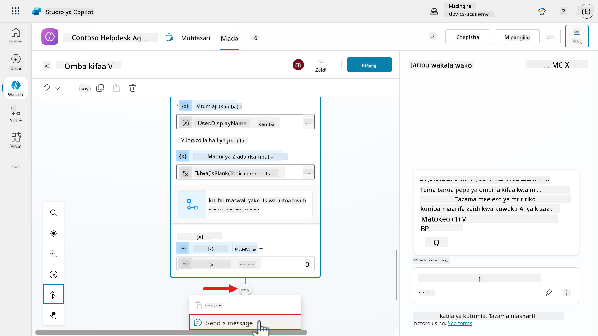

1. Ingiza yafuatayo chini ya sehemu ya ujumbe,

    ```text
    Thanks
    ```

Kisha chagua **Weka variable** kwani tutarejelea jina la mtumiaji.

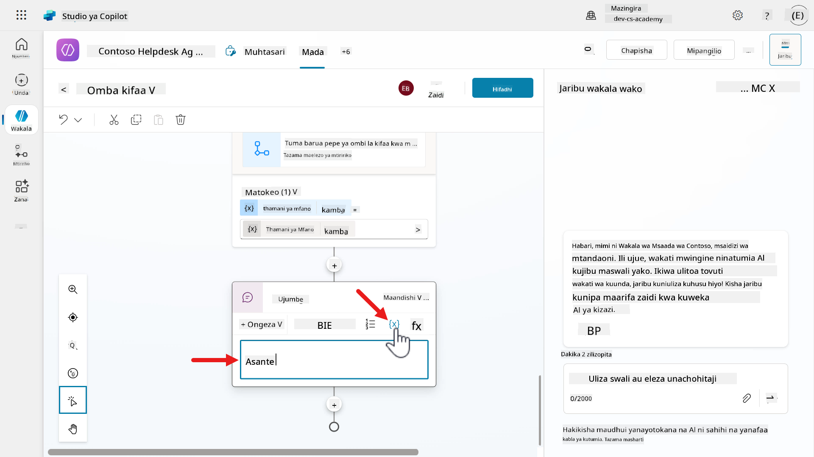

1. Chagua kichupo cha **Mfumo** na tafuta `User` katika sehemu ya utafutaji. Chagua variable ya **User.DisplayName**.

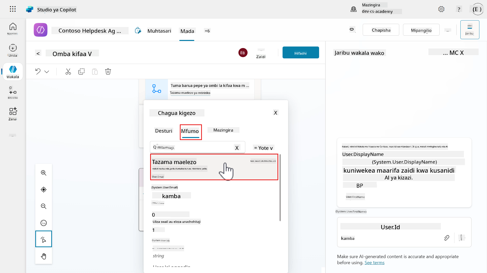

1. Ingiza yafuatayo chini ya sehemu ya ujumbe,

    ```text
    . Your selected device,
    ```

Kisha chagua **Weka variable** na wakati huu katika kichupo cha **Maalum**, chagua variable ya **ModelValue**.

Kisha ingiza yafuatayo chini ili kukamilisha ujumbe.

    ```text
    , has been submitted and will be reviewed by your manager.
    ```

Ujumbe unapaswa kuonekana kama ifuatavyo.

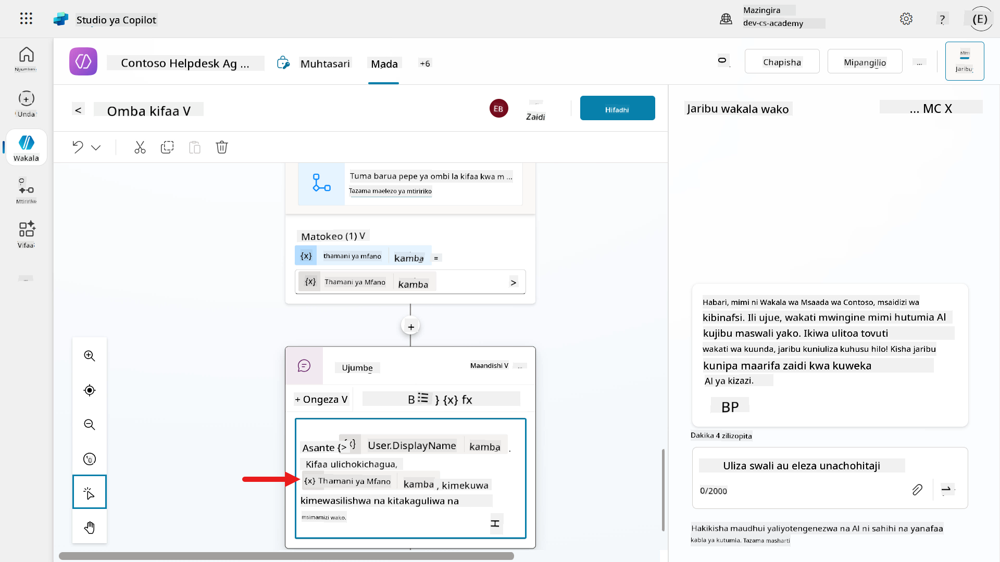

1. Mwisho, chagua **alama ya plus +** chini ya nodi ya **Tuma ujumbe** na chagua **Usimamizi wa mada**, ikifuatiwa na **Nenda kwenye mada nyingine** na chagua **Mwisho wa Mazungumzo**.

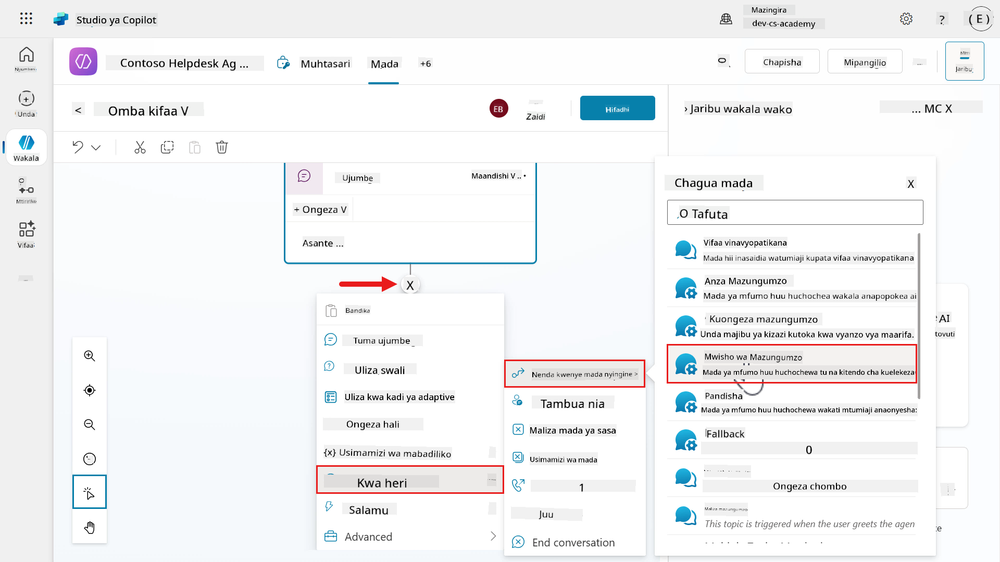

1. **Hifadhi** mada.

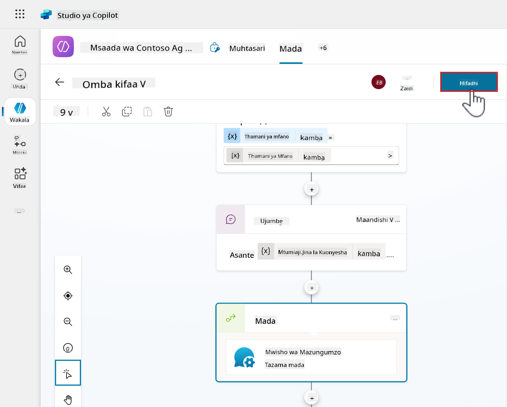

### 9.4 Jaribu wakala kwa hali kadhaa

Kazi nzuri!!! 😁 Sasa tunaweza kujaribu wakala wetu.

#### 9.4.1 Omba kifaa na ingiza maoni katika kadi ya adaptive

1. **Fanya upya** paneli ya majaribio, chagua ikoni ya **ramani ya shughuli** na ingiza yafuatayo kama ujumbe kwa wakala.

    ```text
    I need a laptop
    ```

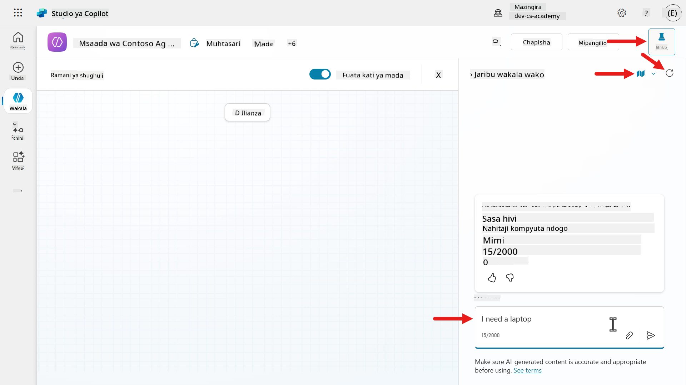

1. Wakala anachochea **Vifaa vinavyopatikana** na kujibu na orodha ya vifaa vinavyopatikana. Tutaingiza yafuatayo kama jibu la swali la ikiwa tungependa kuomba kifaa.

    ```text
    Yes
    ```

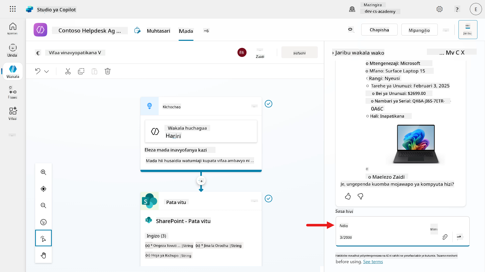

1. Angalia jinsi wakala alivyoanzisha **Ombi la kifaa** kulingana na maagizo ya wakala na kwamba kadi ya adaptive sasa inaonyeshwa katika ujumbe wa wakala.

Chagua kifaa cha **Surface Laptop 15** na ongeza yafuatayo kama maoni.

    ```text
    I need 16GB of RAM please
    ```

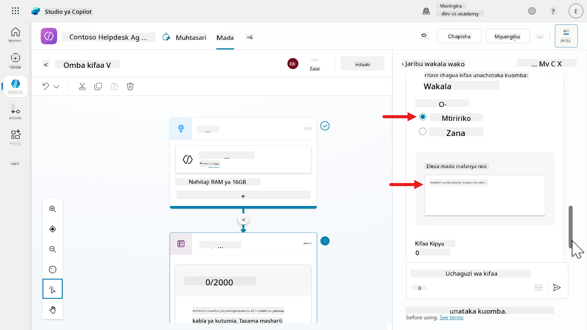

1. Shuka chini hadi uone kitufe cha **Wasilisha Ombi** na uchague ili kuwasilisha kadi ya adaptive kwa wakala.

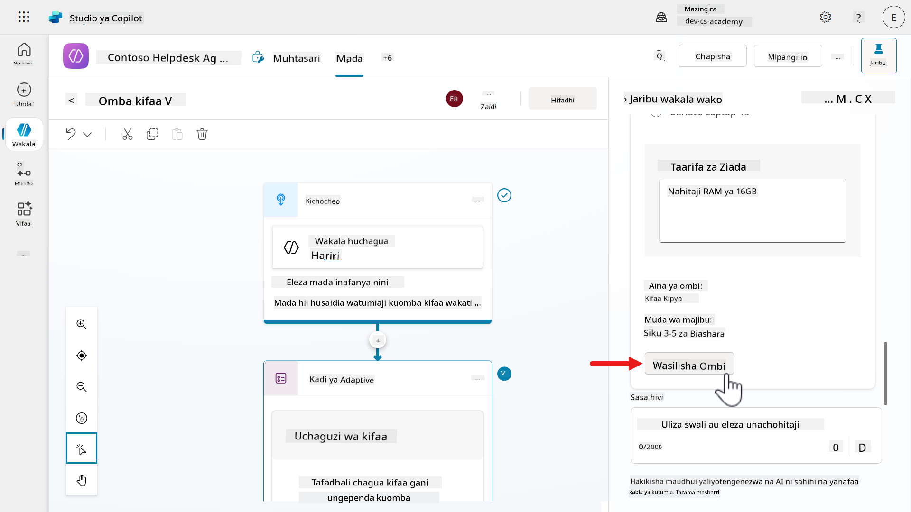

1. Chagua **Ruhusu** kwa wakala kutumia maelezo yako ya kuingia kwa uthibitisho wa muunganisho wa vitendo viwili vya kiunganishi.

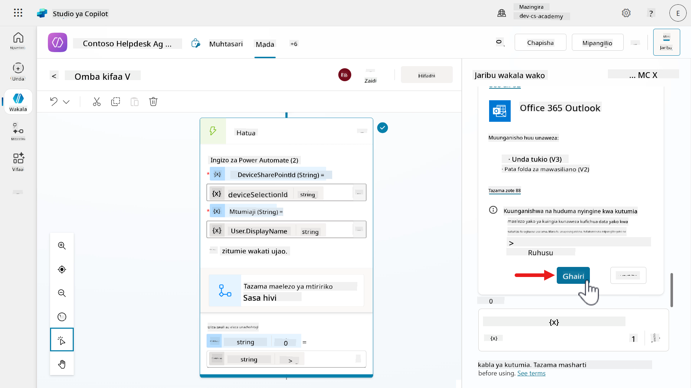

1. Wakala kisha ataonyesha ujumbe wa uthibitisho unaojumuisha modeli iliyochaguliwa, ikifuatiwa na kuelekeza kwenye mada ya **Mwisho wa Mazungumzo**. Nzuri!

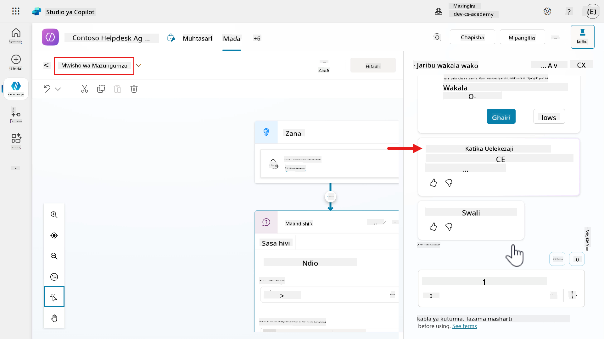

1. Chagua **Ndio** kuthibitisha sehemu nyingine ya mada ya **Mwisho wa Mazungumzo**.

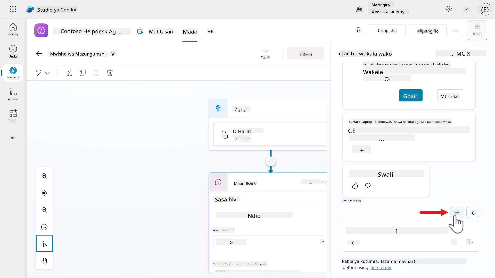

1. Kisha, pima uzoefu kwa kuchagua mojawapo ya nyota kwenye kadi ya kiwango cha ukadiriaji.

Wakala kisha ataendelea kwenye nodi ya mwisho ya **Swali** katika mada ya **Mwisho wa Mazungumzo**. Chagua **Hapana**.


1. Mada kisha itakamilika na ujumbe wa mwisho utaonyeshwa kwenye paneli ya majaribio.

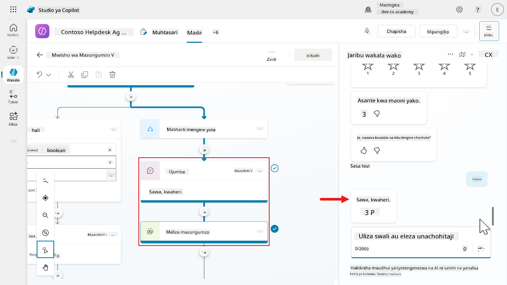

1. Angalia Inbox ya akaunti yako ya barua pepe ili kukagua barua pepe iliyotumwa kwa meneja na mtiririko wa wakala. Unaweza kuona maelezo ya kifaa kilichochaguliwa, na maelezo yaliyoingizwa katika kadi ya adaptive.

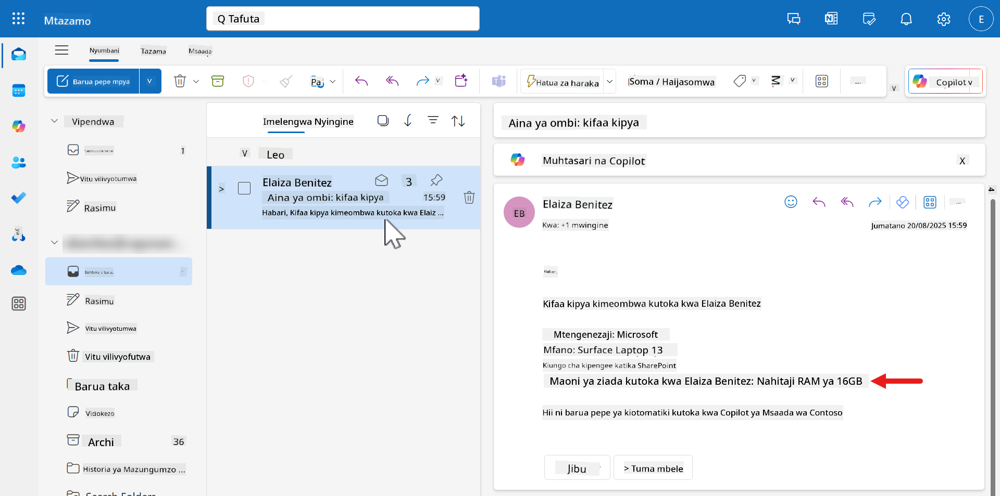

1. Bonyeza kiungo na kivinjari kinapaswa kupakia kipengee cha SharePoint cha kifaa. Nzuri sana!

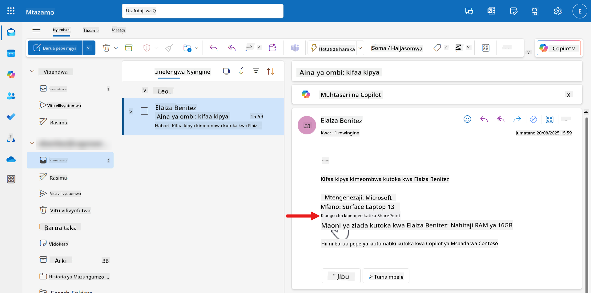

#### 9.4.2 Omba kifaa na usiingize maoni katika kadi ya adaptive

Sasa jaribu hali ambapo maoni hayajaingizwa.

1. Rudia hatua zile zile za

   - **Fanya upya** paneli ya majaribio na chagua ikoni ya **ramani ya shughuli**
   - Ingiza ujumbe, `Nahitaji laptop`
   - Jibu na `Ndio` kwa swali la kuomba kifaa

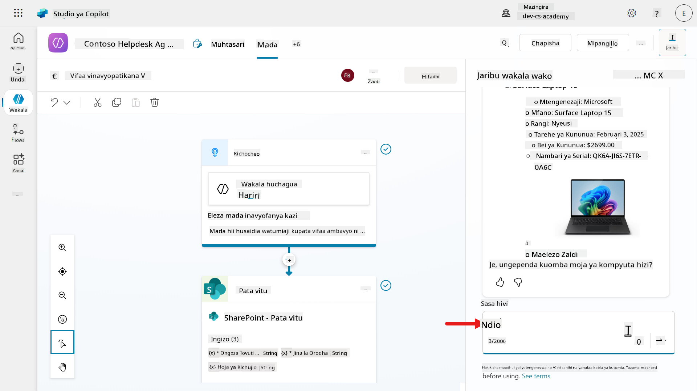

1. Wakati huu chagua **Surface Laptop 13** kama kifaa na usiingize maoni.

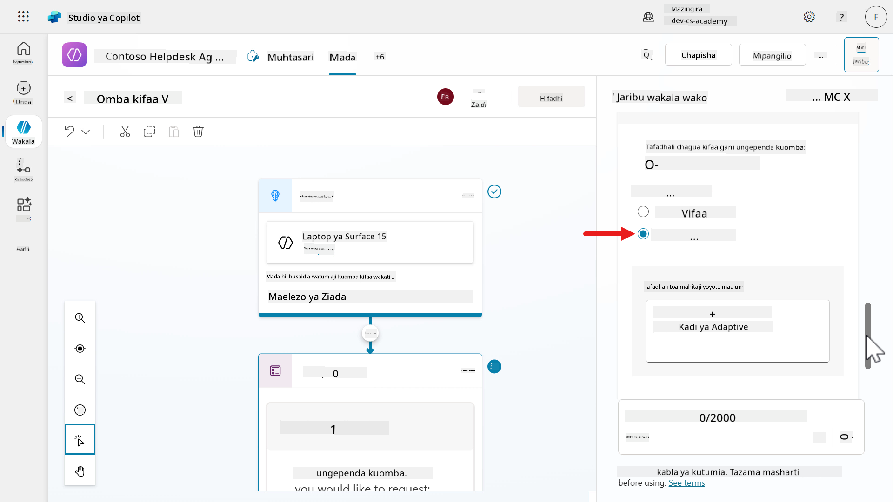

1. **Wasilisha** ombi kwa kuchagua kitufe cha **Wasilisha Ombi**.

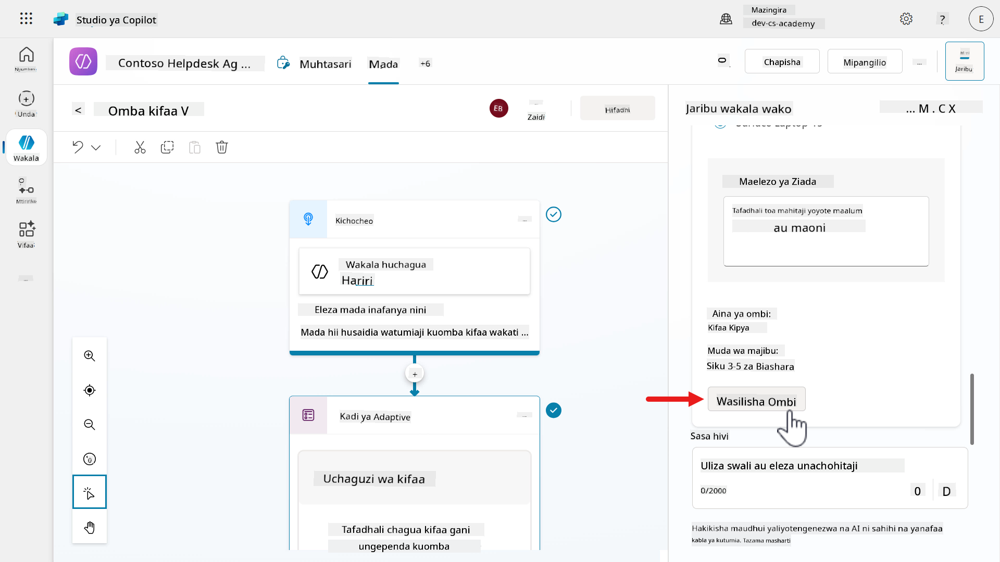

1. Wakati huu barua pepe iliyopokelewa katika Inbox yako itaonyesha **Hakuna** kama maoni.

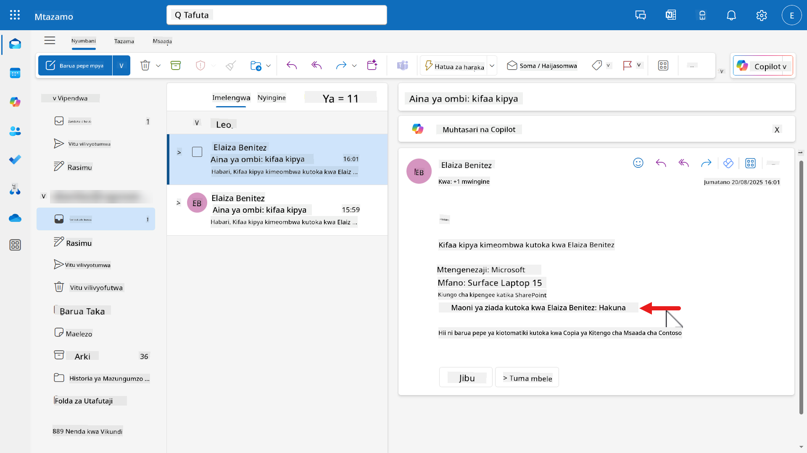

#### 9.4.3 Usiiombe kifaa

Sasa jaribu hali ya mwisho ambayo ni kutoiomba kifaa, na mada ya **Kwaheri** inapaswa kuanzishwa kulingana na maagizo ya wakala.

1. Rudia hatua zile zile za

   - **Fanya upya** paneli ya majaribio na chagua ikoni ya **ramani ya shughuli**
   - Ingiza ujumbe, `Nahitaji laptop`
   - Wakati huu jibu na `Hapana` kwa swali la kuomba kifaa


1. Wakala aliianzisha mada ya **Kwaheri** na swali kama ilivyofafanuliwa katika mada limeulizwa.

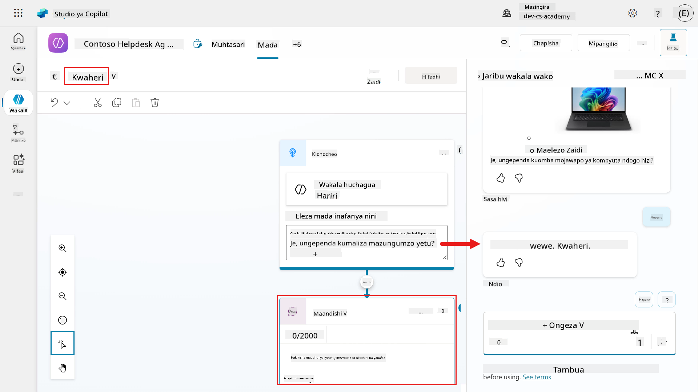

## ✅ Kazi Imekamilika

Hongera! 👏🏻 Umejifunza jinsi ya kujenga mtiririko wa wakala wako na kuiongeza kwenye mada yetu ya sasa ya **Ombi la kifaa**, na jinsi ya kuelekeza wakala kwenye mada nyingine.

Hii ni mwisho wa **Maabara ya 09 - Ongeza mtiririko wa wakala kwa otomatiki na kuboresha uwezo wa mada**, chagua kiungo hapa chini ili kuhamia somo linalofuata. Tutapanua matumizi ya maabara hii katika somo la maabara linalofuata.

⏭️ [Hamia kwenye somo la **Ongeza Vichocheo vya Tukio - Wezesha uwezo wa wakala wa kujitegemea**](../10-add-event-triggers/README.md)

## 📚 Rasilimali za Kijeshi

🔗 [Utangulizi wa mtiririko wa wakala: Kubadilisha otomatiki na mitiririko ya kazi ya AI](https://www.microsoft.com/microsoft-copilot/blog/copilot-studio/introducing-agent-flows-transforming-automation-with-ai-first-workflows/)

🔗 [Muhtasari wa mitiririko ya wakala](https://learn.microsoft.com/microsoft-copilot-studio/flows-overview?WT.mc_id=power-172621-ebenitez)

🔗 [Tumia mitiririko ya wakala na wakala wako](https://learn.microsoft.com/microsoft-copilot-studio/advanced-flow?WT.mc_id=power-172621-ebenitez)

🔗 [Orodha ya kazi katika mwongozo wa marejeleo](https://learn.microsoft.com/azure/logic-apps/workflow-definition-language-functions-reference?WT.mc_id=power-172621-ebenitez)

📺 [Mtiririko wa Wakala katika Copilot Studio](https://www.youtube.com/watch?v=VJTKyk3Pr7s)


---

**Kanusho**:  
Hati hii imetafsiriwa kwa kutumia huduma ya tafsiri ya AI [Co-op Translator](https://github.com/Azure/co-op-translator). Ingawa tunajitahidi kwa usahihi, tafadhali fahamu kuwa tafsiri za kiotomatiki zinaweza kuwa na makosa au kutokuwa sahihi. Hati ya asili katika lugha yake ya asili inapaswa kuzingatiwa kama chanzo cha mamlaka. Kwa taarifa muhimu, tafsiri ya kitaalamu ya binadamu inapendekezwa. Hatutawajibika kwa kutoelewana au tafsiri zisizo sahihi zinazotokana na matumizi ya tafsiri hii.