<!--
CO_OP_TRANSLATOR_METADATA:
{
  "original_hash": "cd99a76bcb7372ac2771b6ae178b023d",
  "translation_date": "2025-10-20T00:57:00+00:00",
  "source_file": "docs/recruit/10-add-event-triggers/README.md",
  "language_code": "sw"
}
-->
# 🚨 Dhamira ya 10: Ongeza Vichochezi vya Tukio - Wezesha Uwezo wa Wakala wa Kujitegemea

## 🕵️‍♂️ JINA LA KODI: `OPERESHENI RATIBA YA KIVULI`

> **⏱️ Muda wa Operesheni:** `~Dakika 45`

🎥 **Tazama Mwongozo**

[](https://www.youtube.com/watch?v=ZgwHL8PQ1nY "Tazama mwongozo kwenye YouTube")

## 🎯 Muhtasari wa Dhamira

Ni wakati wa kuinua wakala wako kutoka msaidizi wa mazungumzo hadi opereta wa kujitegemea. Dhamira yako ni kuwezesha wakala wako kuchukua hatua bila kuitwa - kujibu ishara kutoka kwa mfumo wako wa kidijitali kwa usahihi na kasi.

Kwa Vichochezi vya Tukio, utamfundisha wakala wako kufuatilia mifumo ya nje kama SharePoint, Teams, na Outlook, na kutekeleza vitendo vya akili mara tu ishara inapopokelewa. Operesheni hii inabadilisha wakala wako kuwa chombo kamili cha uwanja - kimya, chenye kasi, na daima kinatazama.

Mafanikio yanamaanisha kujenga mawakala wanaoanzisha thamani - si tu kuitikia.

## 🔎 Malengo

📖 Somo hili litashughulikia:

- Kuelewa Vichochezi vya Tukio na jinsi vinavyowezesha tabia ya wakala wa kujitegemea
- Kujifunza tofauti kati ya vichochezi vya tukio na vichochezi vya mada, ikiwa ni pamoja na mtiririko wa vichochezi na mzigo wa data
- Kuchunguza hali za kawaida za Vichochezi vya Tukio
- Kuelewa uthibitishaji, usalama, na masuala ya uchapishaji kwa mawakala wanaoendeshwa na tukio
- Kujenga wakala wa kujitegemea wa Dawati la Msaada wa IT anayejibu matukio ya SharePoint na kutuma barua pepe za kuthibitisha

## 🤔 Kichochezi cha Tukio ni nini?

**Kichochezi cha Tukio** ni utaratibu unaomruhusu wakala wako kuchukua hatua kwa kujitegemea kwa kujibu matukio ya nje, bila kuhitaji pembejeo ya moja kwa moja kutoka kwa mtumiaji. Fikiria kama kumfanya wakala wako "kutazama" matukio maalum na kuchukua hatua moja kwa moja matukio hayo yanapotokea.

Tofauti na vichochezi vya mada, ambavyo vinahitaji watumiaji kuandika kitu ili kuanzisha mazungumzo, vichochezi vya tukio vinaanzishwa kulingana na mambo yanayotokea katika mifumo yako iliyounganishwa. Mfano:

- Wakati faili mpya inaundwa katika SharePoint au OneDrive for Business
- Wakati rekodi inaundwa katika Dataverse
- Wakati kazi inakamilika katika Planner
- Wakati majibu mapya ya Microsoft Form yanawasilishwa
- Wakati ujumbe mpya wa Microsoft Teams unaongezwa
- Kulingana na ratiba ya mara kwa mara (kama vikumbusho vya kila siku)  


### Kwa nini Vichochezi vya Tukio ni muhimu kwa mawakala wa kujitegemea

Vichochezi vya tukio vinabadilisha wakala wako kutoka msaidizi wa kujibu hadi msaidizi wa kujitegemea, mwenye uwezo wa kuchukua hatua:

1. **Operesheni ya kujitegemea** - wakala wako anaweza kufanya kazi masaa 24/7 bila uingiliaji wa binadamu, akijibu matukio yanapotokea.
    - *Mfano:* Kuwakaribisha wanachama wapya wa timu moja kwa moja wanapoongezwa kwenye timu.

1. **Ujibu wa papo hapo** - badala ya kusubiri watumiaji kuuliza maswali, wakala wako hujibu mara moja kwa matukio yanayofaa.
    - *Mfano*: Kuwaarifu timu ya IT wakati hati ya SharePoint inabadilishwa.

1. **Uendeshaji wa mtiririko wa kazi** - kuunganisha vitendo vingi kulingana na tukio moja la kichochezi.
    - *Mfano:* Wakati tiketi mpya ya msaada inaundwa, unda kazi, mjulishe meneja, na sasisha dashibodi ya ufuatiliaji.

1. **Michakato thabiti** - hakikisha hatua muhimu hazikosiwi kwa kuendesha majibu ya matukio muhimu.
    - *Mfano:* Kila mfanyakazi mpya anapata moja kwa moja vifaa vya kujiunga na maombi ya upatikanaji.

1. **Vitendo vinavyotegemea data** - tumia taarifa kutoka tukio la kichochezi kufanya maamuzi ya busara na kuchukua hatua zinazofaa.
    - *Mfano:* Elekeza tiketi za dharura kwa wafanyakazi waandamizi kulingana na kiwango cha kipaumbele katika mzigo wa data wa kichochezi.

## ⚙️ Vichochezi vya Tukio vinafanyaje kazi?

Vichochezi vya tukio vinafanya kazi kupitia mtiririko wa hatua tatu unaomwezesha wakala wako kujibu matukio ya nje kwa kujitegemea:

### Mtiririko wa kichochezi

1. **Ugunduzi wa Tukio** - Tukio maalum linatokea katika mfumo uliounganishwa (SharePoint, Teams, Outlook, nk.)
1. **Uanzishaji wa Kichochezi** - Kichochezi cha tukio kinagundua tukio hili na kutuma mzigo wa data kwa wakala wako kupitia Power Automate Cloud Flow.
1. **Jibu la Wakala** - Wakala wako hupokea mzigo wa data na kutekeleza maagizo uliyoyafafanua

### Tofauti kati ya vichochezi vya Tukio na Mada

Kuelewa tofauti kati ya aina hizi mbili za vichochezi ni muhimu:

| **Vichochezi vya Tukio** | **Vichochezi vya Mada** |
|-------------------|-------------------|
| Vinachochezwa na matukio ya mfumo wa nje | Vinachochezwa na pembejeo/maneno ya mtumiaji |
| Huwezesha tabia ya wakala wa kujitegemea | Huwezesha majibu ya mazungumzo |
| Hutumia uthibitishaji wa mtengenezaji | Chaguo la uthibitishaji wa mtumiaji |
| Huendesha bila mwingiliano wa mtumiaji | Huhitaji mtumiaji kuanzisha mazungumzo |
| Mifano: Faili imeundwa, barua pepe imepokelewa | Mfano: "Hali ya hewa ikoje?" |

## 📦 Kuelewa mzigo wa data wa kichochezi

Wakati tukio linatokea, kichochezi hutuma **mzigo wa data** kwa wakala wako unaojumuisha taarifa kuhusu tukio na maagizo ya jinsi ya kujibu.

### Mzigo wa data wa kawaida vs maalum

Kila aina ya kichochezi huja na muundo wa mzigo wa data wa kawaida, lakini unaweza kuubadilisha:

**Mzigo wa data wa kawaida** - Hutumia muundo wa kawaida kama `Tumia maudhui kutoka {Mwili}`

- Unajumuisha taarifa za msingi za tukio
- Hutumia maagizo ya usindikaji wa jumla
- Nzuri kwa hali rahisi

**Mzigo wa data maalum** - Ongeza maagizo maalum na muundo wa data

- Jumuisha maelekezo ya kina kwa wakala wako
- Eleza hasa ni data gani ya kutumia na jinsi ya kuitumia
- Bora kwa mtiririko wa kazi tata

### Maagizo ya wakala vs maagizo ya mzigo wa data maalum

Una sehemu mbili za kuongoza tabia ya wakala wako na vichochezi vya tukio:

**Maagizo ya Wakala** (Kwa Ujumla)

- Mwongozo mpana unaotumika kwa vichochezi vyote
- Mfano: "Wakati wa kusindika tiketi, daima angalia nakala kwanza"
- Bora kwa mifumo ya tabia ya jumla

**Maagizo ya Mzigo wa Data** (Maalum kwa Kichochezi)

- Maelekezo maalum kwa aina za kichochezi binafsi  
- Mfano: "Kwa sasisho hili la SharePoint, tuma muhtasari kwa kituo cha mradi"
- Bora kwa mawakala tata wenye vichochezi vingi

💡 **Ushauri wa kitaalamu**: Epuka maagizo yanayokinzana kati ya viwango hivi viwili, kwani hii inaweza kusababisha tabia isiyotarajiwa.

## 🎯 Hali za kawaida za Kichochezi cha Tukio

Hapa kuna mifano ya vitendo ya jinsi vichochezi vya tukio vinavyoweza kuboresha wakala wako:

### Wakala wa Dawati la Msaada wa IT

- **Kichochezi**: Kipengee kipya cha orodha ya SharePoint (tiketi ya msaada)
- **Kitendo**: Kategoriza moja kwa moja, weka kipaumbele, na mjulishe wanachama wa timu wanaofaa

### Wakala wa Kujiunga na Wafanyakazi

- **Kichochezi**: Mtumiaji mpya ameongezwa kwenye Dataverse
- **Kitendo**: Tuma ujumbe wa kukaribisha, unda kazi za kujiunga, na toa upatikanaji

### Wakala wa Usimamizi wa Mradi

- **Kichochezi**: Kazi imekamilika katika Planner
- **Kitendo**: Sasisha dashibodi ya mradi, mjulishe wadau, na angalia vizuizi

### Wakala wa Usimamizi wa Nyaraka

- **Kichochezi**: Faili imepakiwa kwenye folda maalum ya SharePoint
- **Kitendo**: Toa metadata, weka lebo, na mjulishe wamiliki wa nyaraka

### Wakala wa Msaidizi wa Mikutano

- **Kichochezi**: Tukio la kalenda limeundwa
- **Kitendo**: Tuma vikumbusho vya kabla ya mkutano na ajenda, weka rasilimali

## ⚠️ Masuala ya uchapishaji na uthibitishaji

Kabla ya wakala wako kutumia vichochezi vya tukio katika uzalishaji, unahitaji kuelewa masuala ya uthibitishaji na usalama.

### Uthibitishaji wa mtengenezaji

Vichochezi vya tukio hutumia **maelezo ya kuingia ya muundaji wa wakala** kwa uthibitishaji wote:

- Wakala wako unapata mifumo kwa kutumia ruhusa zako
- Watumiaji wanaweza kufikia data kupitia maelezo yako ya kuingia
- Vitendo vyote vinafanywa "kama wewe" hata watumiaji wanaposhirikiana na wakala

### Mazoea bora ya ulinzi wa data

Ili kudumisha usalama wakati wa kuchapisha mawakala wenye vichochezi vya tukio:

1. **Pitia upatikanaji wa data** - Kagua mifumo na data ambayo vichochezi vyako vinaweza kufikia
1. **Jaribu kwa kina** - Elewa taarifa gani vichochezi vinajumuisha katika mzigo wa data
1. **Punguza wigo wa kichochezi** - Tumia vigezo maalum kupunguza matukio yanayochochea vichochezi
1. **Kagua data ya mzigo wa data** - Hakikisha vichochezi havifichui taarifa nyeti
1. **Fuatilia matumizi** - Fuata shughuli za kichochezi na matumizi ya rasilimali

## ⚠️ Utatuzi wa matatizo na vikwazo

Kumbuka masuala haya muhimu unapofanya kazi na vichochezi vya tukio:

### Athari za kiwango na gharama

- Kila uanzishaji wa kichochezi huhesabiwa kuelekea matumizi ya ujumbe wako
- Vichochezi vya mara kwa mara (kama kurudia kila dakika) vinaweza kutumia kiwango haraka
- Fuatilia matumizi ili kuepuka kuzuiliwa

### Mahitaji ya kiufundi

- Inapatikana tu kwa mawakala wenye uratibu wa kizazi uliowezeshwa
- Inahitaji kushiriki mtiririko wa wingu unaojua suluhisho uwezeshwe katika mazingira yako

### Kuzuia Upotevu wa Data (DLP)

- Sera za DLP za shirika lako zinaamua ni vichochezi vipi vinavyopatikana
- Wasimamizi wanaweza kuzuia vichochezi vya tukio kabisa
- Wasiliana na msimamizi wako ikiwa vichochezi vinavyotarajiwa havipatikani

## 🧪 Maabara ya 10 - Ongeza Vichochezi vya Tukio kwa tabia ya wakala wa kujitegemea

### 🎯 Matumizi

Utabooresha wakala wako wa Dawati la Msaada wa IT kujibu moja kwa moja maombi mapya ya msaada. Wakati mtu anapounda kipengee kipya katika orodha ya tiketi za msaada za SharePoint, wakala wako atafanya yafuatayo:

1. Kuchochea kwa kujitegemea wakati tiketi ya SharePoint inaundwa
1. Kutoa maelezo ya tiketi na maagizo ya hatua unazotaka ichukue
1. Kuthibitisha tiketi moja kwa moja kwa mwasilishaji kupitia barua pepe iliyotengenezwa na AI

Maabara hii inaonyesha jinsi vichochezi vya tukio vinavyowezesha tabia ya wakala wa kujitegemea.

### Mahitaji ya awali

Kabla ya kuanza maabara hii, hakikisha una:

- ✅ Umekamilisha maabara ya awali (hasa Maabara ya 6-8 kwa wakala wa Dawati la Msaada wa IT)
- ✅ Ufikiaji wa tovuti ya SharePoint yenye orodha ya tiketi za msaada wa IT
- ✅ Mazingira ya Copilot Studio yenye vichochezi vya tukio vilivyowezeshwa
- ✅ Wakala wako ana uratibu wa kizazi uliowezeshwa
- ✅ Ruhusa zinazofaa katika SharePoint na mazingira yako ya Copilot Studio

### 10.1 Wezesha AI ya Kizazi na unda kichochezi cha uundaji wa kipengee cha SharePoint

1. Fungua **Wakala wako wa Dawati la Msaada wa IT** katika **Copilot Studio**

1. Kwanza, hakikisha **AI ya Kizazi** imewezeshwa kwa wakala wako:
   - Nenda kwenye kichupo cha **Muhtasari**
   - Chini ya sehemu ya Uratibu, Washa **Uratibu wa kizazi** hadi **On** ikiwa bado haijawashwa  
     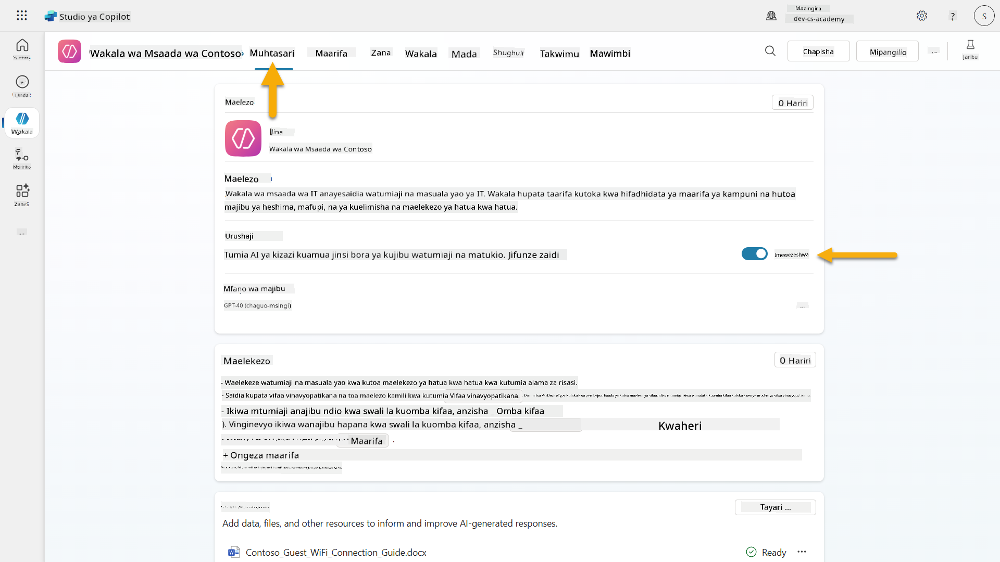

1. Nenda kwenye kichupo cha **Muhtasari** na pata sehemu ya **Vichochezi**

1. Bonyeza **+ Ongeza kichochezi** kufungua maktaba ya vichochezi  
    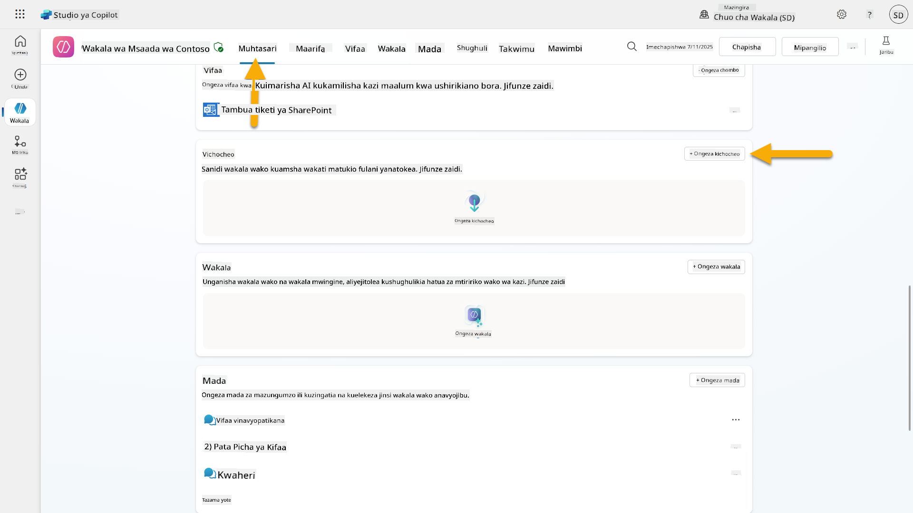

1. Tafuta na chagua **Wakati kipengee kinaundwa** (SharePoint)  
    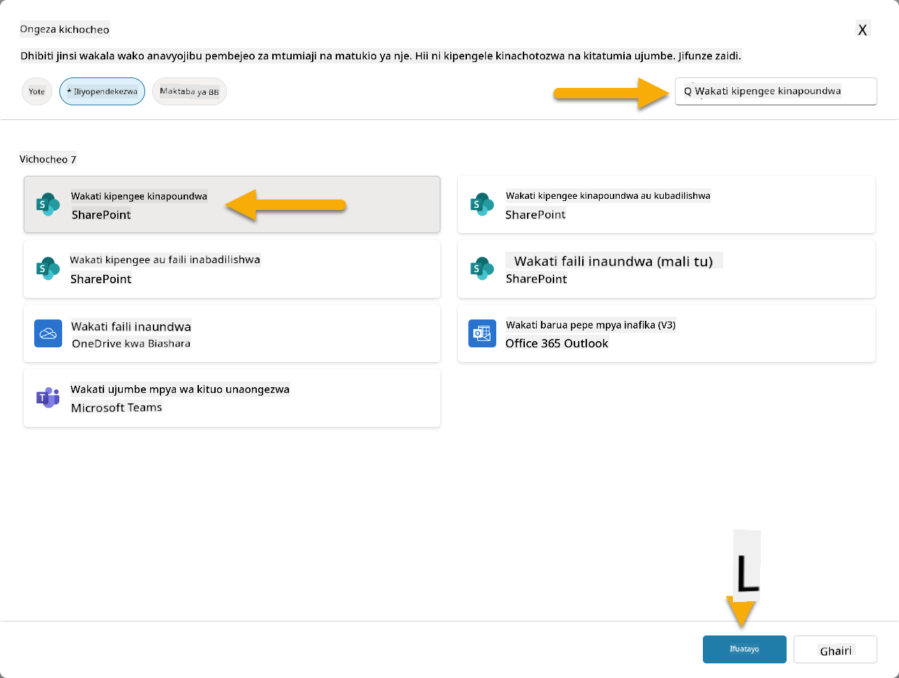

1. Sanidi jina la kichochezi na miunganisho:

   - **Jina la kichochezi:** Tiketi Mpya ya Msaada Imeundwa katika SharePoint

1. Subiri miunganisho isanidiwe, na uchague **Inayofuata** kuendelea.  
   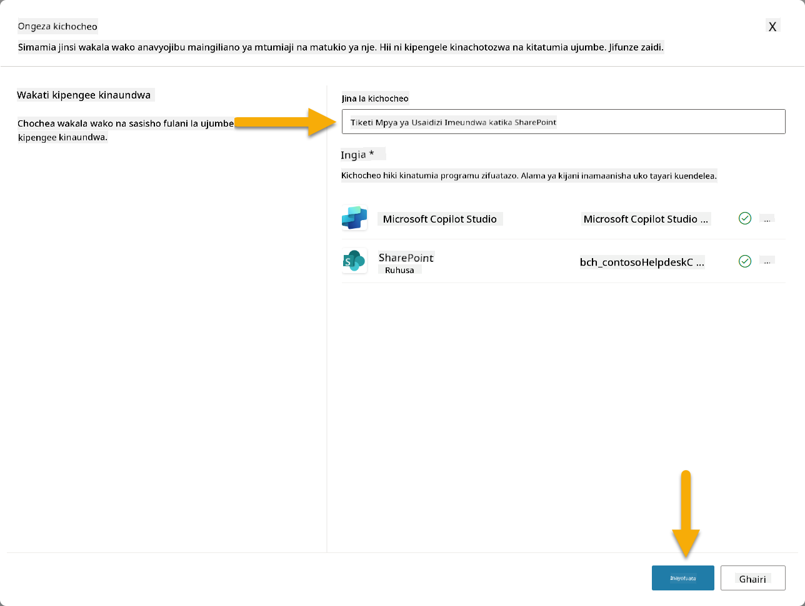

1. Sanidi vigezo vya kichochezi:

   - **Anwani ya Tovuti**: Chagua tovuti yako ya SharePoint "Contoso IT"

   - **Jina la Orodha**: Chagua orodha yako ya "Tiketi"

   - **Maagizo ya ziada kwa wakala wakati kichochezi kinachochezwa:**

     ```text
     New Support Ticket Created in SharePoint: {Body}
     
     Use the 'Acknowledge SharePoint Ticket' tool to generate the email body automatically and respond.
     
     IMPORTANT: Do not wait for any user input. Work completely autonomously.
     ```

     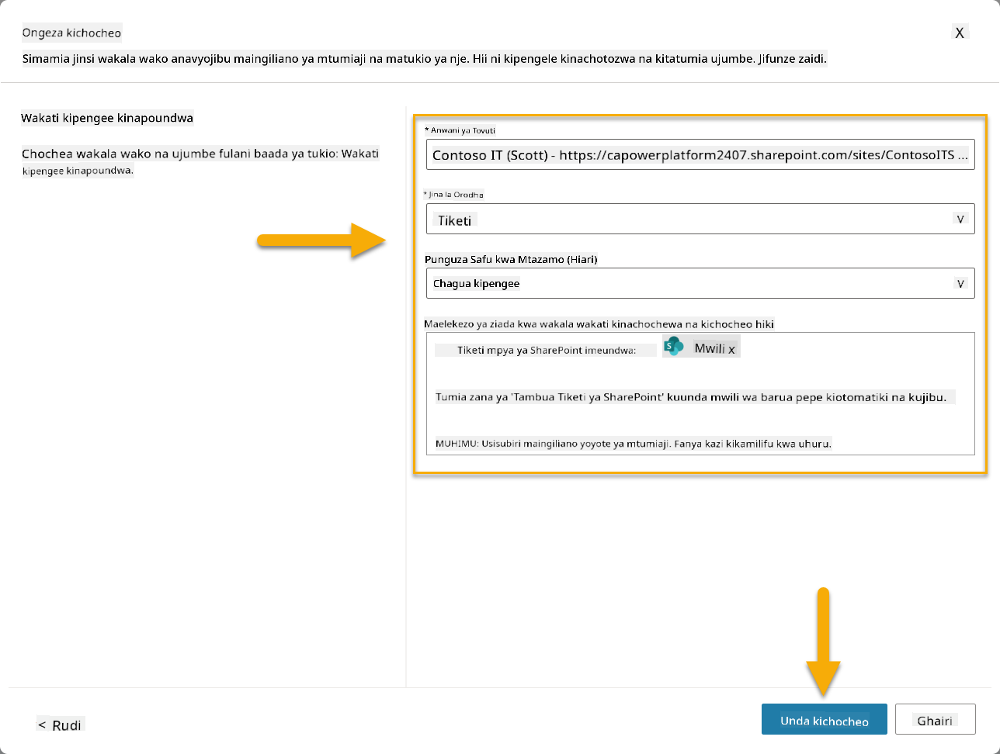

1. Chagua **Unda kichochezi** kukamilisha uundaji wa kichochezi. Mtiririko wa Wingu wa Power Automate unaundwa moja kwa moja ili kuchochea wakala kwa kujitegemea.

1. Chagua **Funga**.

### 10.2 Hariri Kichochezi

1. Ndani ya sehemu ya **Vichochezi** ya kichupo cha **Muhtasari**, Chagua menyu ya **...** kwenye kichochezi cha **Tiketi Mpya ya Msaada Imeundwa katika SharePoint**

1. Chagua **Hariri katika Power Automate**  
   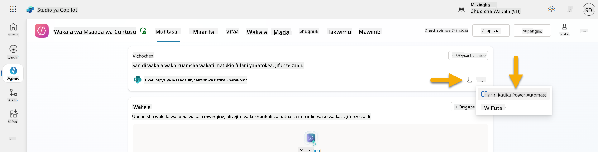

1. Chagua nodi ya **Inatuma mwongozo kwa copilot maalum kwa usindikaji**

1. Katika sehemu ya **Mwili/ujumbe**, ondoa maudhui ya Mwili, **bonyeza kitufe cha mbele cha mwelekeo** (/) na chagua **Ingiza Mwelekeo**  
   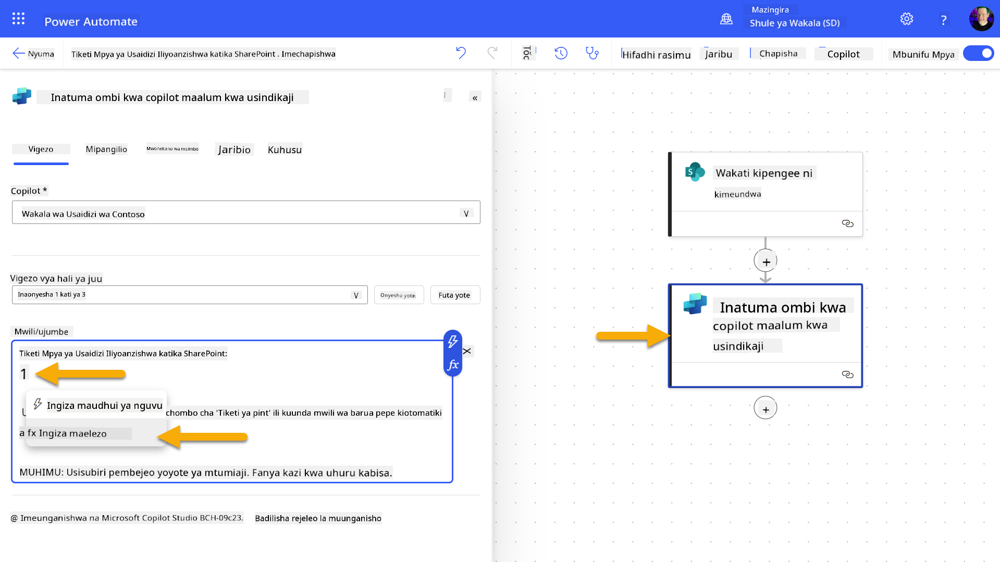

1. Ingiza mwelekeo ufuatao ili kumpa wakala maelezo maalum kuhusu tiketi:

    ```text
    concat('Submitted By Name: ', first(triggerOutputs()?['body/value'])?['Author/DisplayName'], '\nSubmitted By Email: ', first(triggerOutputs()?['body/value'])?['Author/Email'], '\nTitle: ', first(triggerOutputs()?['body/value'])?['Title'], '\nIssue Description: ', first(triggerOutputs()?['body/value'])?['Description'], '\nPriority: ', first(triggerOutputs()?['body/value'])?['Priority/Value'],'\nTicket ID : ', first(triggerOutputs()?['body/value'])?['ID'])
    ```

1. Chagua **Ongeza**  
   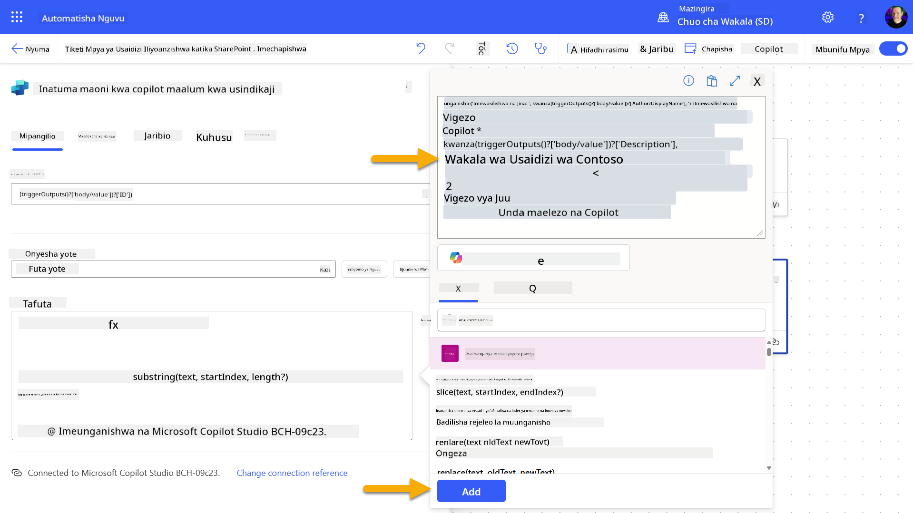

1. Chagua **Chapisha** kwenye upau wa zana wa juu kulia.

### 10.3 Unda chombo cha kuthibitisha barua pepe

1. **Rudi** kwa Wakala wako katika Copilot
1. Fungua kichupo kipya cha kivinjari na nenda kwenye **Orodha ya Tiketi za Usaidizi wa IT ya SharePoint**
1. Bonyeza **+ Ongeza kipengee kipya** ili kuunda tiketi ya majaribio:
   - **Kichwa**: "Imeshindwa kuunganishwa na VPN"
   - **Maelezo**: "Imeshindwa kuunganishwa na mtandao wa WIFI wa kampuni baada ya sasisho la hivi karibuni"
   - **Kipaumbele**: "Kawaida"

1. **Hifadhi** kipengee cha SharePoint  
    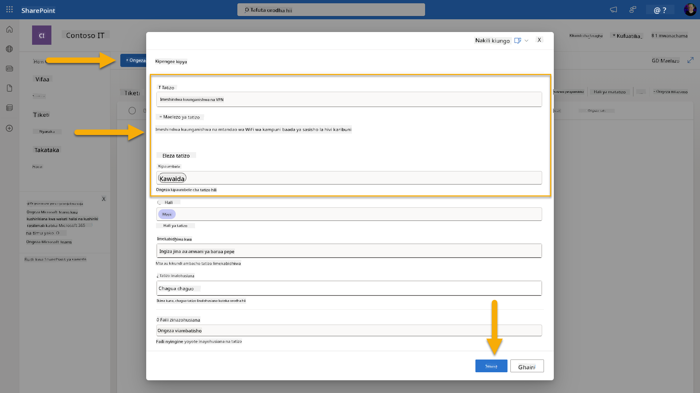
1. Rudi kwenye **Copilot Studio** na fuatilia paneli ya **Jaribu kichocheo chako** kwa ajili ya uanzishaji wa kichocheo. Tumia ikoni ya **Sasisha** kupakia tukio la kichocheo, hii inaweza kuchukua dakika chache.  
    
1. Mara kichocheo kinapoonekana, chagua **Anza kujaribu**
1. Chagua **Ikoni ya Ramani ya Shughuli** juu ya paneli ya **Jaribu wakala wako**
1. Hakikisha kwamba wakala wako:
   - Amepokea mzigo wa kichocheo
   - Ameita zana ya "Kuthibitisha tiketi ya SharePoint"  
     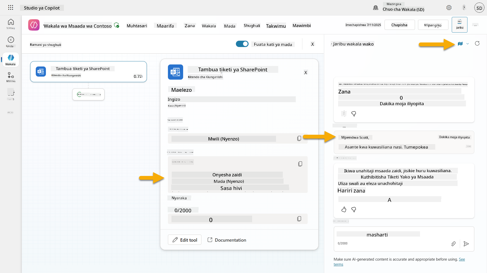
1. Angalia kikasha barua pepe cha mwasilishaji ili kuthibitisha barua pepe ya kuthibitisha ilitumwa  
    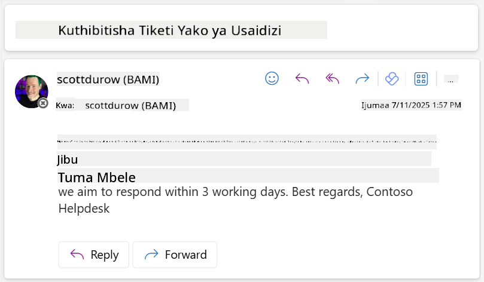
1. Kagua kichupo cha **Shughuli** katika Copilot Studio ili kuona kichocheo kamili na utekelezaji wa zana

## ✅ Kazi Imekamilika

🎉 **Hongera!** Umefanikiwa kutekeleza vichocheo vya matukio kwa kutumia zana za kiunganishi ambazo zinamwezesha wakala wako kufanya kazi kwa uhuru, kutuma barua pepe za kuthibitisha moja kwa moja na kushughulikia tiketi za usaidizi bila uingiliaji wa mtumiaji. Mara wakala wako atakapochapishwa, atafanya kazi kwa uhuru kwa niaba yako.

🚀 **Kinachofuata**: Katika somo letu linalofuata, utajifunza jinsi ya [kuchapisha wakala wako](../11-publish-your-agent/README.md) kwenye Microsoft Teams na Microsoft 365 Copilot, na kuufanya upatikane kwa shirika lako lote!

⏭️ [Nenda kwenye somo la **Chapisha wakala wako**](../11-publish-your-agent/README.md)

## 📚 Rasilimali za Kimbinu

Uko tayari kuchunguza zaidi kuhusu vichocheo vya matukio na mawakala wa kujitegemea? Angalia rasilimali hizi:

- **Microsoft Learn**: [Mfanye wakala wako kuwa wa kujitegemea katika Copilot Studio](https://learn.microsoft.com/training/modules/autonomous-agents-online-workshop/?WT.mc_id=power-177340-scottdurow)
- **Nyaraka**: [Ongeza kichocheo cha tukio](https://learn.microsoft.com/microsoft-copilot-studio/authoring-trigger-event?WT.mc_id=power-177340-scottdurow)
- **Mbinu Bora**: [Utangulizi wa vichocheo vya Power Automate](https://learn.microsoft.com/power-automate/triggers-introduction?WT.mc_id=power-177340-scottdurow)
- **Mazingira ya Juu**: [Kutumia mtiririko wa Power Automate na mawakala](https://learn.microsoft.com/microsoft-copilot-studio/advanced-flow-create?WT.mc_id=power-177340-scottdurow)
- **Usalama**: [Kuzuia upotevu wa data kwa Copilot Studio](https://learn.microsoft.com/microsoft-copilot-studio/admin-data-loss-prevention?WT.mc_id=power-177340-scottdurow)

<!-- markdownlint-disable-next-line MD033 -->


---

**Kanusho**:  
Hati hii imetafsiriwa kwa kutumia huduma ya tafsiri ya AI [Co-op Translator](https://github.com/Azure/co-op-translator). Ingawa tunajitahidi kwa usahihi, tafadhali fahamu kuwa tafsiri za kiotomatiki zinaweza kuwa na makosa au kutokuwa sahihi. Hati ya asili katika lugha yake ya awali inapaswa kuzingatiwa kama chanzo cha mamlaka. Kwa taarifa muhimu, tafsiri ya kitaalamu ya binadamu inapendekezwa. Hatutawajibika kwa kutoelewana au tafsiri zisizo sahihi zinazotokana na matumizi ya tafsiri hii.