<!--
CO_OP_TRANSLATOR_METADATA:
{
  "original_hash": "9dceeba2eae2bb73e328602a060eddab",
  "translation_date": "2025-10-20T00:44:21+00:00",
  "source_file": "docs/recruit/11-publish-your-agent/README.md",
  "language_code": "sw"
}
-->
# 🚨 Misheni ya 11: Chapisha Wakala Wako

## 🕵️‍♂️ JINA LA KODI: `OPERESHENI CHAPISHA CHAPISHA CHAPISHA`

> **⏱️ Muda wa Operesheni:** `~dakika 30`  

🎥 **Tazama Mwongozo**

## 🎯 Maelezo ya Misheni

Baada ya kukamilisha moduli kadhaa zenye changamoto, Mtengenezaji Wakala, sasa uko tayari kwa hatua yako muhimu zaidi: kuchapisha wakala wako. Ni wakati wa kufanya uumbaji wako upatikane kwa watumiaji kote Microsoft Teams na Microsoft 365 Copilot.

Wakala wako—akiwa na lengo wazi, zana zenye nguvu, na ufikiaji wa vyanzo muhimu vya maarifa—yuko tayari kuhudumu. Kwa kutumia Microsoft Copilot Studio, unamuweka wakala wako ili aweze kuanza kusaidia watumiaji halisi, pale wanapofanya kazi.

Hebu tuzindue wakala wako kazini.

## 🔎 Malengo

📖 Somo hili linashughulikia:

1. Kwa nini ni muhimu kuchapisha wakala wako
1. Nini kinatokea unapochapisha wakala wako
1. Jinsi ya kuongeza kituo (Microsoft Teams & Microsoft 365 Copilot)
1. Jinsi ya kuongeza wakala katika Microsoft Teams
1. Jinsi ya kufanya wakala upatikane katika Microsoft Teams kwa shirika lako lote

## 🚀 Chapisha wakala

Kila wakati unapofanya kazi kwenye wakala katika Copilot Studio unaweza kuuboresha kwa kuongeza maarifa au zana. Unapokuwa tayari na mabadiliko yote, na umeyajaribu kwa kina, uko tayari kuchapisha. Kuchapisha kunahakikisha kwamba masasisho ya hivi karibuni yako hai. Unapoboresha wakala wako kwa zana mpya, na hujabonyeza kitufe cha kuchapisha, bado haitapatikana kwa watumiaji wa mwisho.

Hakikisha kila wakati unabonyeza kitufe cha kuchapisha unapohitaji kusukuma masasisho kwa watumiaji wa wakala wako. Wakala wako anaweza kuwa na vituo vilivyoongezwa kwake na unapobonyeza kuchapisha masasisho yanapatikana kwa vituo vyote ulivyoongeza kwa wakala.

## ⚙️ Sanidi vituo

Vituo vinaamua wapi watumiaji wako wanaweza kufikia na kuingiliana na wakala wako. Baada ya kuchapisha wakala wako, unaweza kufanya upatikane katika vituo vingi. Kila kituo kinaweza kuonyesha maudhui ya wakala wako kwa njia tofauti.

Unaweza kuongeza wakala wako kwenye vituo vifuatavyo:

- **Microsoft Teams na Microsoft 365 Copilot** - Fanya wakala wako upatikane katika mazungumzo ya Teams na mikutano, na ndani ya uzoefu wa Microsoft 365 Copilot ([Jifunze zaidi](https://learn.microsoft.com/microsoft-copilot-studio/publication-add-bot-to-microsoft-teams))
- **Tovuti ya majaribio** - Jaribu wakala wako kwenye tovuti ya majaribio inayotolewa na Copilot Studio ([Jifunze zaidi](https://learn.microsoft.com/microsoft-copilot-studio/publication-connect-bot-to-web-channels))
- **Tovuti maalum** - Weka wakala wako moja kwa moja kwenye tovuti yako mwenyewe ([Jifunze zaidi](https://learn.microsoft.com/microsoft-copilot-studio/publication-connect-bot-to-web-channels))
- **Programu ya simu** - Jumuisha wakala wako katika programu maalum ya simu ([Jifunze zaidi](https://learn.microsoft.com/microsoft-copilot-studio/publication-connect-bot-to-custom-application))
- **SharePoint** - Ongeza wakala wako kwenye tovuti za SharePoint kwa msaada wa nyaraka na tovuti ([Jifunze zaidi](https://learn.microsoft.com/microsoft-copilot-studio/publication-add-bot-to-sharepoint))
- **Facebook Messenger** - Unganisha na watumiaji kupitia jukwaa la ujumbe la Facebook ([Jifunze zaidi](https://learn.microsoft.com/microsoft-copilot-studio/publication-add-bot-to-facebook))
- **Power Pages** - Jumuisha wakala wako katika tovuti za Power Pages ([Jifunze zaidi](https://learn.microsoft.com/microsoft-copilot-studio/publication-connect-bot-to-power-pages))
- **Vituo vya Azure Bot Service** - Fikia vituo vya ziada ikiwa ni pamoja na Slack, Telegram, Twilio SMS, na zaidi ([Jifunze zaidi](https://learn.microsoft.com/microsoft-copilot-studio/publication-connect-bot-to-azure-bot-service-channels))

Ili kuongeza kituo, nenda kwenye kichupo cha **Vituo** katika wakala wako na uchague kituo unachotaka kusanidi. Kila kituo kina mahitaji maalum ya usanidi na kinaweza kuhitaji uthibitisho wa ziada au hatua za usanidi.

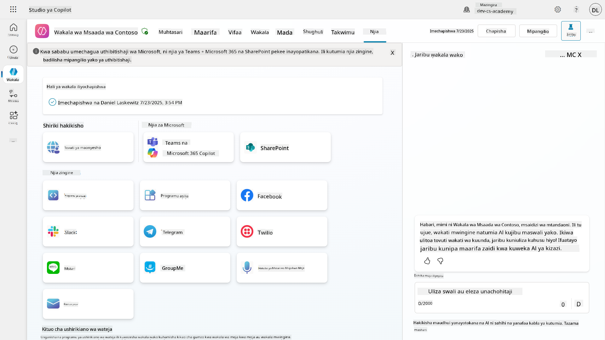

## 📺 Uzoefu wa vituo

Vituo tofauti vina uzoefu tofauti wa watumiaji. Unapojenga wakala kwa vituo vingi, hakikisha unajua tofauti za kila kituo. Ni mkakati mzuri kila wakati kujaribu wakala wako katika vituo vingi ili kuona kama unafanya kile ulichokusudia.

| Uzoefu                          | Tovuti         | Teams na Microsoft 365 Copilot         | Facebook                 | Dynamics Omnichannel kwa Huduma ya Wateja                   |
| ------------------------------- | -------------- | --------------------------------------- | ------------------------ | ----------------------------------------------------------- |
| [Utafiti wa kuridhika kwa mteja][1] | Kadi ya Adaptive | Maandishi pekee                          | Maandishi pekee          | Maandishi pekee                                             |
| [Chaguo nyingi][1]              | Inasaidiwa     | [Inasaidiwa hadi sita (kama kadi ya shujaa)][4] | [Inasaidiwa hadi 13][6]  | [Inasaidiwa kwa sehemu][8]                                  |
| [Markdown][2]                   | Inasaidiwa     | [Inasaidiwa kwa sehemu][5]               | [Inasaidiwa kwa sehemu][7] | [Inasaidiwa kwa sehemu][9]                                  |
| [Ujumbe wa kukaribisha][1]      | Inasaidiwa     | Inasaidiwa                               | Haijaungwa mkono         | Inasaidiwa kwa [Mazungumzo][10]. Haijaungwa mkono kwa vituo vingine. |
| [Je-Ulimaanisha][3]             | Inasaidiwa     | Inasaidiwa                               | Inasaidiwa               | Inasaidiwa kwa [Microsoft Teams][11], [Mazungumzo][10], Facebook, na vituo vya maandishi pekee (ujumbe mfupi wa maandishi (SMS) kupitia [TeleSign][12] na [Twilio][13], [WhatsApp][14], [WeChat][15], na [Twitter][16]). Hatua zilizopendekezwa zinawasilishwa kama orodha ya maandishi pekee; watumiaji lazima waandike tena chaguo ili kujibu. |

[1]: https://learn.microsoft.com/microsoft-copilot-studio/authoring-create-edit-topics
[2]: https://daringfireball.net/projects/markdown/
[3]: https://learn.microsoft.com/microsoft-copilot-studio/advanced-ai-features
[4]: https://learn.microsoft.com/microsoftteams/platform/concepts/cards/cards-reference#hero-card
[5]: https://learn.microsoft.com/microsoftteams/platform/bots/how-to/format-your-bot-messages#text-only-messages
[6]: https://developers.facebook.com/docs/messenger-platform/send-messages/quick-replies/
[7]: https://www.facebook.com/help/147348452522644?helpref=related
[8]: https://learn.microsoft.com/dynamics365/customer-service/asynchronous-channels#suggested-actions-support
[9]: https://learn.microsoft.com/dynamics365/customer-service/asynchronous-channels#preview-support-for-formatted-messages
[10]: https://learn.microsoft.com/dynamics365/customer-service/set-up-chat-widget
[11]: https://learn.microsoft.com/dynamics365/customer-service/configure-microsoft-teams
[12]: https://learn.microsoft.com/dynamics365/customer-service/configure-sms-channel
[13]: https://learn.microsoft.com/dynamics365/customer-service/configure-sms-channel-twilio
[14]: https://learn.microsoft.com/dynamics365/customer-service/configure-whatsapp-channel
[15]: https://learn.microsoft.com/dynamics365/customer-service/configure-wechat-channel
[16]: https://learn.microsoft.com/dynamics365/customer-service/configure-twitter-channel

> [!NOTE]
> Kuna mifano ya jinsi unavyoweza kutumia mantiki tofauti kwa vituo tofauti. Mfano wa hili unaweza kupatikana katika hifadhi ya Power Platform Snippets:
>
> Henry Jammes alishiriki mfano wa jinsi ya kuonyesha kadi ya adaptive tofauti wakati kituo ni Microsoft Teams. ([Kiungo cha mfano](https://github.com/pnp/powerplatform-snippets/blob/main/copilot-studio/multiple-topics-matched-topic/source/multiple-topics-matched.yaml#L40))

## 🧪 Maabara ya 11: Chapisha wakala wako kwa Teams na Microsoft 365 Copilot

### 🎯 Matumizi

Wakala wako wa Msaada wa IT wa Contoso sasa umewekwa kikamilifu na uwezo wa nguvu—unaweza kufikia vyanzo vya maarifa vya SharePoint, kuunda tiketi za msaada, kutuma arifa za proaktif, na kujibu kwa akili maswali ya watumiaji. Hata hivyo, vipengele vyote hivi kwa sasa vinapatikana tu katika mazingira ya maendeleo ambapo ulivitengeneza.

**Changamoto:** Watumiaji wa mwisho hawawezi kufaidika na uwezo wa wakala wako hadi utakapochapishwa ipasavyo na kufanywa kupatikana kupitia vituo ambavyo wanatumia kwa kweli.

**Suluhisho:** Kuchapisha wakala wako kunahakikisha kwamba toleo la hivi karibuni—pamoja na masasisho yako ya hivi karibuni, mada mpya, vyanzo vya maarifa vilivyoboreshwa, na mtiririko uliosanidiwa—linapatikana kwa watumiaji halisi. Bila kuchapisha, watumiaji bado wangeingiliana na toleo la zamani la wakala wako ambalo linaweza kukosa utendaji muhimu.

Kuongeza kituo cha Teams na Microsoft 365 Copilot ni muhimu sana kwa sababu:

- **Muunganiko wa Teams**: Wafanyakazi wa shirika lako hutumia muda mwingi katika Microsoft Teams kwa ushirikiano, mikutano, na mawasiliano. Kwa kuongeza wakala wako kwenye Teams, watumiaji wanaweza kupata msaada wa IT bila kuacha mazingira yao ya kazi ya msingi.

- **Microsoft 365 Copilot**: Watumiaji wanaweza kufikia wakala wako maalum wa msaada wa IT moja kwa moja ndani ya uzoefu wao wa Microsoft 365 Copilot, na kuifanya iwe sehemu ya kazi yao ya kila siku katika programu za Ofisi.

- **Ufikiaji wa Kati**: Badala ya kukumbuka tovuti au programu tofauti, watumiaji wanaweza kufikia msaada wa IT kupitia majukwaa wanayotumia tayari, kupunguza vikwazo na kuongeza matumizi.

Misheni hii inabadilisha kazi yako ya maendeleo kuwa suluhisho tayari kwa uzalishaji ambalo linatoa thamani halisi kwa watumiaji wa mwisho wa shirika lako.

### Mahitaji ya awali

Kabla ya kuanza maabara hii, hakikisha una:

- ✅ Umekamilisha maabara za awali na una Wakala wa Msaada wa Contoso uliosanidiwa kikamilifu
- ✅ Wakala wako umejaribiwa na uko tayari kwa matumizi ya uzalishaji
- ✅ Ruhusa katika mazingira yako ya Copilot Studio kuchapisha mawakala
- ✅ Ufikiaji wa Microsoft Teams katika shirika lako

### 11.1 Chapisha wakala wako

Sasa kwa kuwa kazi yetu yote kwenye wakala imekamilika, tunapaswa kuhakikisha kazi yetu yote inapatikana kwa watumiaji wa mwisho ambao watautumia wakala wetu. Ili kuhakikisha maudhui yanapatikana kwa watumiaji wote, tunahitaji kuchapisha wakala wetu.

1. Nenda kwa Wakala wa Msaada wa Contoso katika Copilot Studio (kupitia [portal ya watengenezaji ya Copilot Studio](https://copilotstudio.microsoft.com))

    Katika Copilot Studio, ni rahisi kuchapisha wakala wako. Unaweza tu kuchagua kitufe cha kuchapisha juu ya muhtasari wa wakala.

    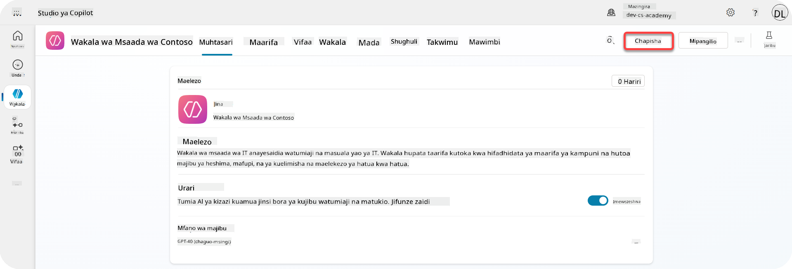

1. Chagua kitufe cha **Chapisha** katika wakala wako

    Hii inafungua dirisha la kuchapisha - kuthibitisha kwamba unataka kuchapisha wakala wako.

    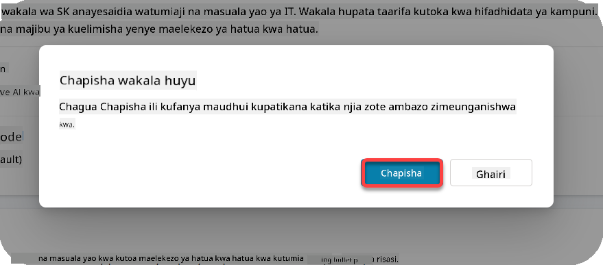

1. Chagua **Chapisha** kuthibitisha kuchapisha wakala wako

    Sasa ujumbe unaonyesha kwamba wakala wako unachapishwa. Huna haja ya kuweka dirisha hilo wazi. Utapokea arifa wakati wakala umekamilika kuchapishwa.

    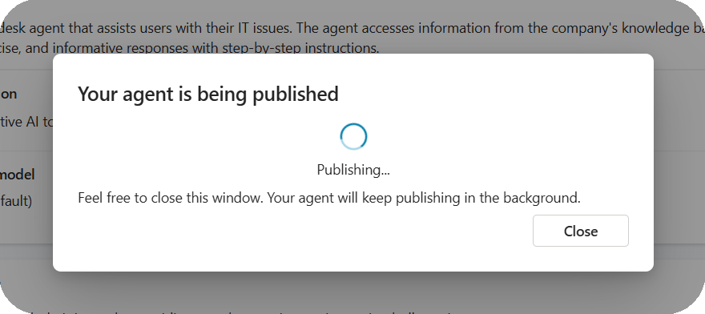

    Wakati wakala umekamilika kuchapishwa, utaona arifa juu ya ukurasa wa wakala.

    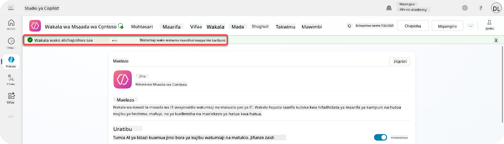

Lakini - tumemchapisha tu wakala, hatujamwongeza kwenye kituo bado, kwa hivyo hebu tusuluhishe hilo sasa!

### 11.2 Ongeza kituo cha Teams na Microsoft 365 Copilot

1. Ili kuongeza kituo cha Teams na Microsoft 365 Copilot kwa wakala wetu, tunahitaji kuchagua **Kituo** katika urambazaji wa juu wa wakala

    

    Hapa tunaweza kuona vituo vyote tunavyoweza kuongeza kwa wakala huyu.

1. Chagua **Teams na Microsoft 365**

    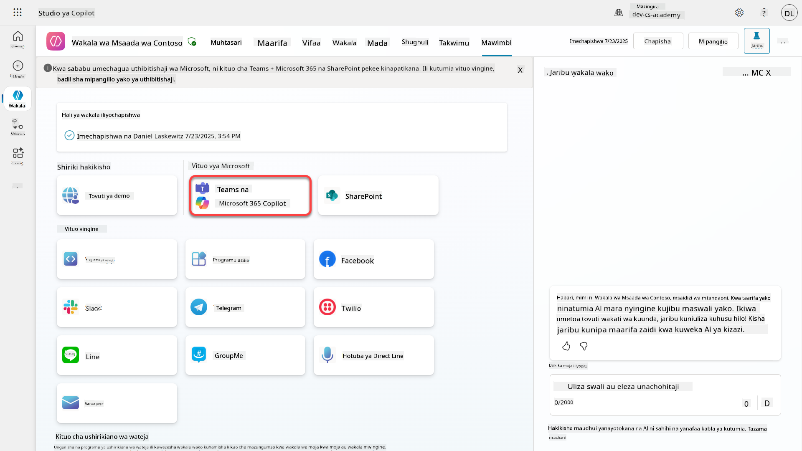

1. Chagua **Ongeza kituo** kukamilisha mwongozo na kuongeza kituo kwa wakala

    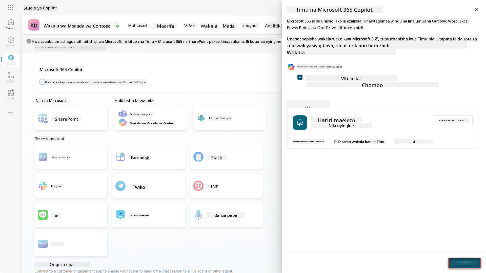

    Itachukua muda kidogo hadi kiongezwe. Baada ya kuongezwa, arifa ya kijani itaonekana juu ya upau wa pembeni.

    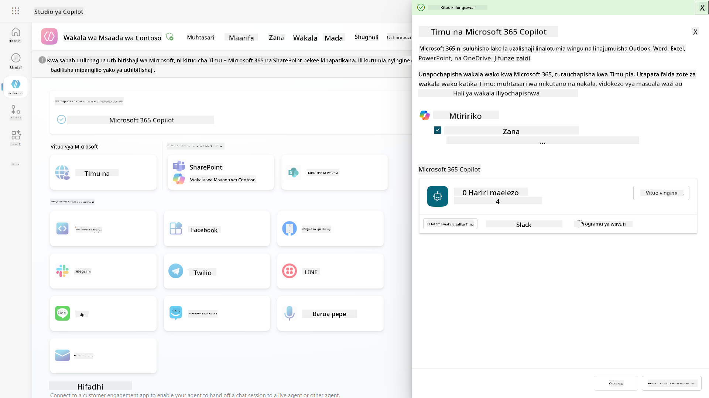

1. Chagua **Tazama wakala katika Teams** kufungua kichupo kipya

    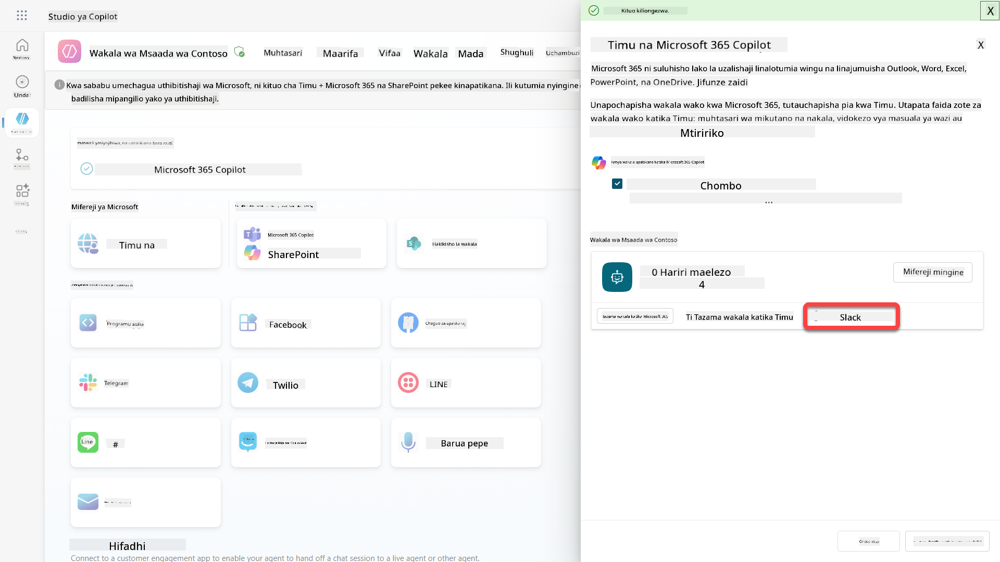

1. Chagua **Ongeza** kuongeza Wakala wa Msaada wa Contoso kwa Teams

    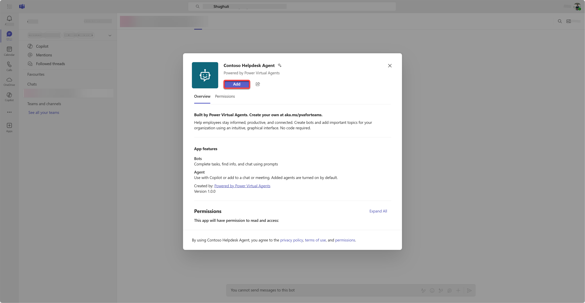

    Hii inapaswa kuchukua muda kidogo. Baada ya hapo inapaswa kuonyesha skrini ifuatayo:

    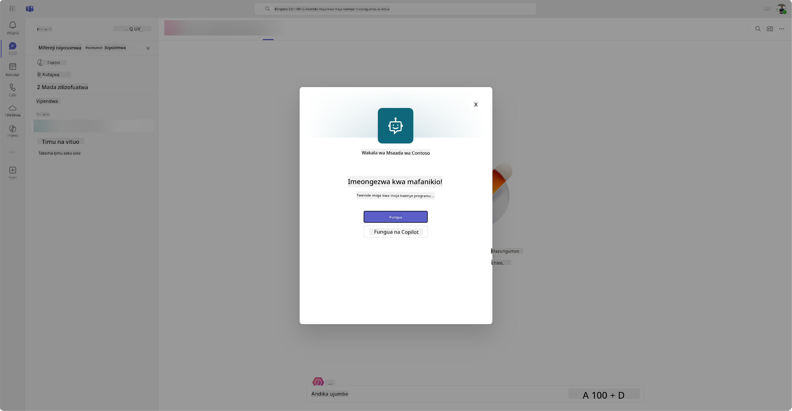

1. Chagua **Fungua** kufungua wakala katika Teams

    Hii itafungua wakala katika Teams kama programu ya Teams

    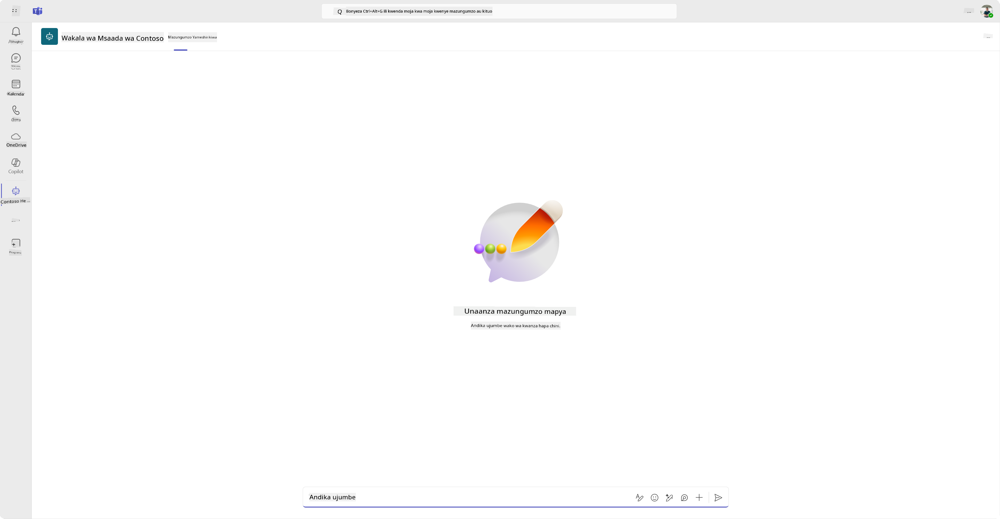

Sasa tumemchapisha wakala kufanya kazi kwako katika Microsoft Teams, lakini unaweza kutaka kufanya hii ipatikane kwa watu zaidi.

### 11.3 Fanya wakala upatikane kwa watumiaji wote katika shirika

1. Funga kichupo cha kivinjari ambapo Wakala wa Msaada wa Contoso umefunguliwa

    Hii inapaswa kukurudisha kwenye Copilot Studio ambapo paneli ya pembeni ya Teams na Microsoft 365 Copilot bado iko wazi. Tumefungua tu wakala katika Teams sasa, lakini tunaweza kufanya mengi zaidi hapa. Tunaweza kuhariri maelezo ya wakala, tunaweza kupeleka wakala kwa watumiaji zaidi na zaidi.

1. Chagua **Hariri maelezo**

    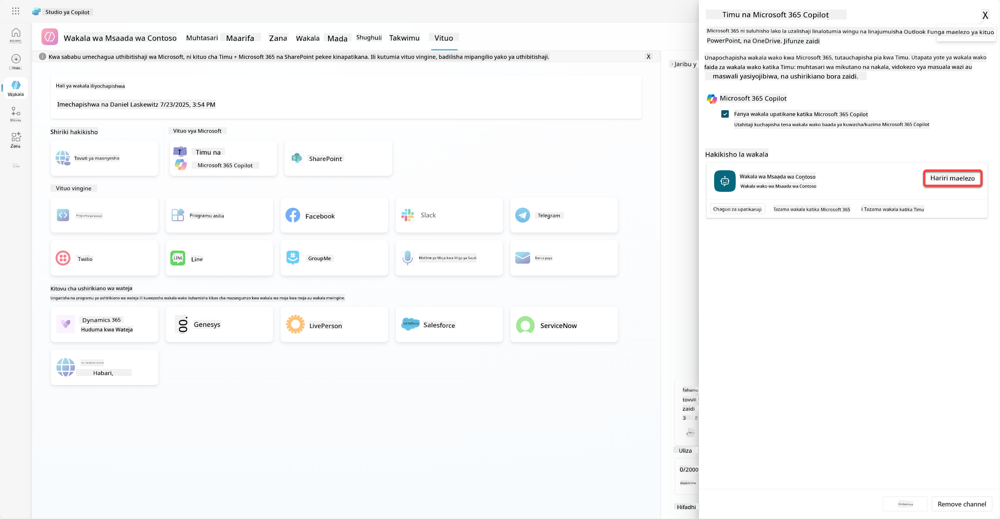
Hii itafungua paneli ambapo tunaweza kubadilisha maelezo na mipangilio mbalimbali ya wakala. Tunaweza kubadilisha maelezo ya msingi kama ikoni, rangi ya mandharinyuma ya ikoni na maelezo. Pia tunaweza kubadilisha mipangilio ya Teams (kwa mfano kuruhusu mtumiaji kuongeza wakala kwenye timu, au kuruhusu kutumia wakala huyu katika mazungumzo ya kikundi na mikutano) hapa. Unapochagua *zaidi*, unaweza pia kubadilisha maelezo ya msanidi programu kama jina la msanidi programu, tovuti, taarifa ya faragha na masharti ya matumizi.

1. Chagua **Ghairi** kufunga paneli ya Hariri maelezo

1. Chagua **Chaguo za upatikanaji**

Hii itafungua paneli ya chaguo za upatikanaji, ambapo unaweza kunakili kiungo cha kutuma kwa watumiaji ili kutumia wakala huyu (kumbuka, unahitaji kushiriki wakala na mtumiaji pia) na unaweza kupakua faili ya kuongeza wakala wako kwenye duka la Microsoft Teams au Microsoft 365. Ili kuonyesha wakala kwenye duka, una chaguo zingine pia: unaweza kuonyesha kwa wenzako na watumiaji waliogawana (kuonyesha katika sehemu ya *Imejengwa na Power Platform*) au unaweza kuonyesha kwa kila mtu katika shirika lako (hii inahitaji idhini ya msimamizi).

1. Chagua **Onyesha kwa kila mtu katika shirika langu**

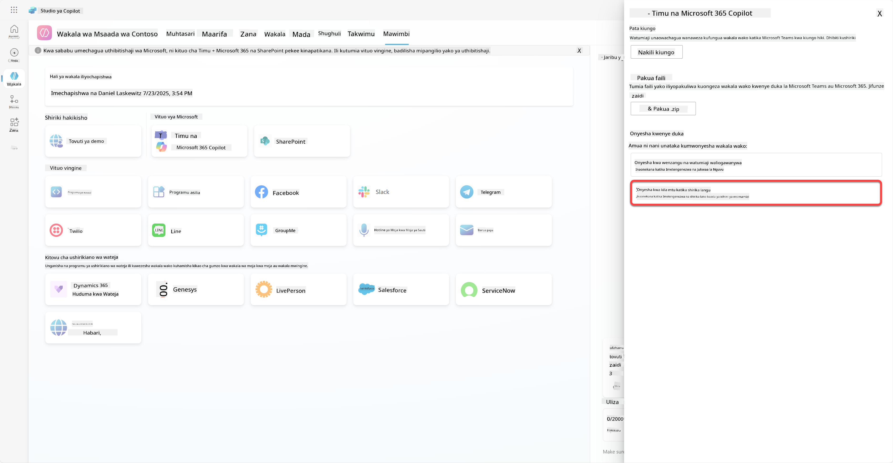

1. Chagua **Wasilisha kwa idhini ya msimamizi**

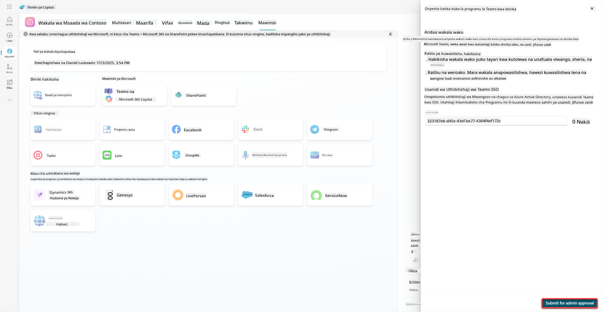

Sasa, msimamizi wako lazima aidhinishe uwasilishaji wa wakala wako. Wanaweza kufanya hivyo kwa kwenda kwenye Kituo cha Usimamizi wa Teams na kutafuta Contoso Helpdesk Agent katika Programu. Katika picha unaweza kuona kile msimamizi angeona katika Kituo cha Usimamizi wa Teams.

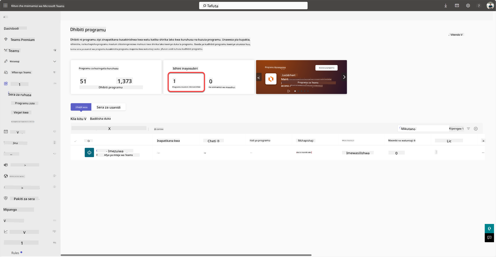

Msimamizi lazima achague Contoso Helpdesk Agent na achague *Chapisha* ili kuchapisha Contoso Helpdesk Agent kwa kila mtu.

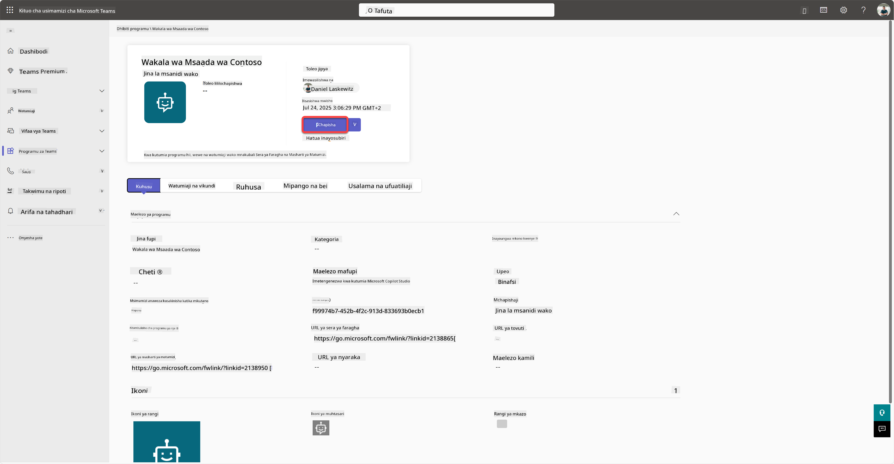

Wakati msimamizi amechapisha uwasilishaji wa wakala, utaweza kusasisha Copilot Studio na unapaswa kuona bango la *linapatikana katika duka la programu* katika chaguo za upatikanaji.

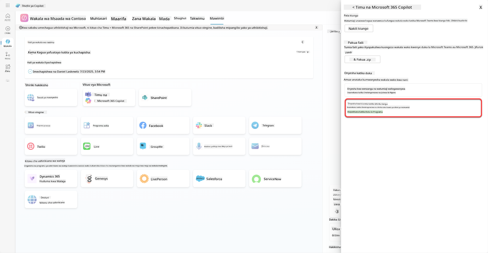

Kuna uwezekano zaidi hapa. Msimamizi wako anaweza kubadilisha sera ya usanidi wa kimataifa na kusakinisha kiotomatiki Contoso Helpdesk Agent kwa kila mtu katika mtandao. Zaidi ya hayo - unaweza kuweka Contoso Helpdesk Agent kwenye reli ya kushoto ili kila mtu aweze kuipata kwa urahisi.

## ✅ Kazi Imekamilika

🎉 **Hongera!** Umefanikiwa kuchapisha wakala wako na kuiongeza kwenye Teams na Microsoft 365 Copilot! Hatua inayofuata ni misheni ya mwisho ya kozi: Kuelewa leseni.

⏭️ [Nenda kwenye somo la **Kuelewa leseni**](../12-understanding-licensing/README.md)

## 📚 Rasilimali za Kimbinu

🔗 [Nyaraka za kuchapisha njia](https://learn.microsoft.com/microsoft-copilot-studio/publication-fundamentals-publish-channels)

---

**Kanusho**:  
Hati hii imetafsiriwa kwa kutumia huduma ya tafsiri ya AI [Co-op Translator](https://github.com/Azure/co-op-translator). Ingawa tunajitahidi kwa usahihi, tafadhali fahamu kuwa tafsiri za kiotomatiki zinaweza kuwa na makosa au kutokuwa sahihi. Hati ya asili katika lugha yake ya kiasili inapaswa kuzingatiwa kama chanzo cha mamlaka. Kwa taarifa muhimu, tafsiri ya kitaalamu ya binadamu inapendekezwa. Hatutawajibika kwa kutoelewana au tafsiri zisizo sahihi zinazotokana na matumizi ya tafsiri hii.