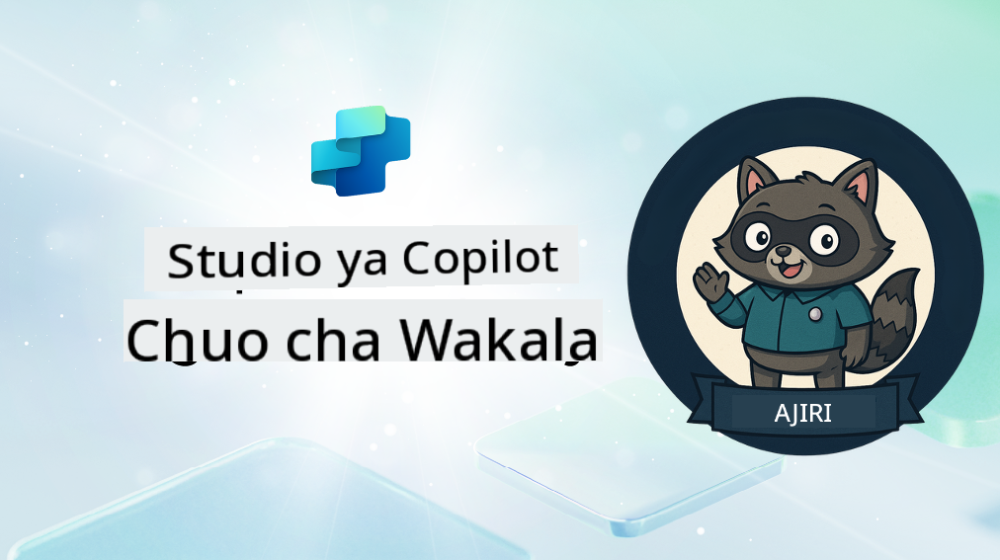

<!--
CO_OP_TRANSLATOR_METADATA:
{
  "original_hash": "8b5ecad9d5d073ea3f4c2b844e80f2e5",
  "translation_date": "2025-10-20T00:30:33+00:00",
  "source_file": "docs/recruit/README.md",
  "language_code": "sw"
}
-->
# Karibu Rekruti

**Karibu, Rekruti.**  
Dhamira yako—ikiwa utaamua kuikubali—ni kujifunza sanaa ya kujenga mawakala kwa kutumia **Microsoft Copilot Studio**.

Mafunzo haya ya vitendo ni njia yako ya kuingia katika **ulimwengu wa mawakala**: kuanzia maelekezo ya msingi hadi Kadi za Adaptive na mtiririko wa mawakala, utajifunza jinsi ya kujenga, kupanua, na kupeleka mawakala wenye akili kwa kutumia zana na mifano halisi.

---

## 🎯 Lengo la Dhamira

Kwa kukamilisha Agent Academy, utaweza:

- Kuelewa mawakala ni nini katika muktadha wa Microsoft Copilot Studio
- Kuchunguza jinsi Large Language Models (LLMs), kizazi kilichoongezwa na urejeshaji (RAG), na uratibu vinavyoshirikiana katika wakala
- Kujenga mawakala wa **maelezo** na **mawakala maalum**
- Kuboresha mawakala kwa kutumia **Mada**, **Kadi za Adaptive**, na **Mtiririko wa Mawakala**
- Kupeleka mawakala kwenye **Microsoft Teams** na **Microsoft 365 Copilot**

---

## 🧪 Mahitaji ya Awali

Ili kukamilisha dhamira zote, utahitaji:

- Akaunti ya msanidi programu wa Microsoft 365 (ikiwa na SharePoint imewezeshwa)
- Ufikiaji wa **Microsoft Copilot Studio** (jaribio au leseni)
- Hiari: Maarifa ya msingi ya SharePoint, Power Platform, au Power Fx

---

## 🧬 Kwa Nani Mafunzo Haya

Kozi hii ni bora kwa:

- Watengenezaji na waendelezaji wanaochunguza **Copilot Studio**
- Wataalamu wa IT wanaojenga **viendelezi vya Microsoft 365 Copilot**
- Wapenzi wa Power Platform wanaotaka **kuimarisha ujuzi wao** na mawakala wenye akili
- Yeyote anayependelea kujifunza kwa **vitendo**

---

## 🧭 Muhtasari wa Mtaala

Academy hii imegawanywa katika masomo ya hatua kwa hatua—kila moja imeundwa kama dhamira ya shamba ili kuboresha ujuzi wako wa kujenga mawakala.

| Somo | Kichwa | Maelezo ya Dhamira |
|------|--------|--------------------|
| `00` | 🧰 [Kuandaa Kozi](./00-course-setup/README.md) | Tengeneza mazingira yako ya msanidi programu, jaribio la Copilot Studio, na tovuti ya SharePoint |
| `01` | 🧠 [Utangulizi wa Mawakala](./01-introduction-to-agents/README.md) | Elewa dhana za AI ya mazungumzo, LLMs, na mawakala wa kujitegemea dhidi ya mawakala wa maelezo |
| `02` | 🛠️ [Misingi ya Copilot Studio](./02-copilot-studio-fundamentals/README.md) | Jifunze vipengele vya msingi: maarifa, ujuzi, uhuru |
| `03` | 👩‍💻 [Unda Wakala wa Maelezo](./03-create-a-declarative-agent-for-M365Copilot/README.md) | Ongeza wakala wako mwenyewe kwenye Microsoft 365 Copilot, ukizingatia maelekezo |
| `04` | 🧩 [Kuunda Suluhisho](./04-creating-a-solution/README.md) | Fanya wakala wako kuwa suluhisho linaloweza kutumika tena kwa usimamizi wa mazingira |
| `05` | 🚀 [Anza na Mawakala Walioandaliwa](./05-using-prebuilt-agents/README.md) | Tumia na ubadilishe wakala wa kiolezo ili kuharakisha usanidi |
| `06` | ✍️ [Jenga Wakala Maalum](./06-create-agent-from-conversation/README.md) | Unda Copilot mpya inayotegemea vyanzo vya maarifa |
| `07` | 🧠 [Ongeza Mada na Vichochezi](./07-add-new-topic-with-trigger/README.md) | Tumia Mada kufafanua njia za maswali/jibu maalum |
| `08` | 🪪 [Boresha kwa Kadi za Adaptive](./08-add-adaptive-card/README.md) | Unda Kadi ya Adaptive kwa kutumia Power Fx na SharePoint |
| `09` | 🔁 [Automatisha kwa Mtiririko wa Mawakala](./09-add-an-agent-flow/README.md) | Tumia pembejeo ya Kadi ya Adaptive kuanzisha mtiririko wa nyuma |
| `10` | 🧭 [Ongeza Vichochezi vya Matukio](./10-add-event-triggers/README.md) | Wezesha wakala wako kuchukua hatua kwa uhuru kwa kutumia mantiki ya msingi wa matukio |
| `11` | 📢 [Chapisha Wakala Wako](./11-publish-your-agent/README.md) | Peleka wakala wako kwenye Microsoft Teams na Microsoft 365 Copilot |
| `12` | 🪪 [Kuelewa Leseni](./12-understanding-licensing/README.md) | Jifunze jinsi leseni na malipo yanavyofanya kazi na Copilot Studio |
| `13` | 🚨 [Kupata Beji Yako ya Rekruti](./course-completion-badges-recruit/README.md) | Pata beji yako na thibitisha mafanikio yako! |

!!! note
    ✅ Kukamilisha mtaala huu kunakupatia beji ya **Rekruti**.  
    🔓 **Operative** na **Commander** zitafunguliwa katika awamu zijazo.

<!-- markdownlint-disable-next-line MD033 -->

---

**Kanusho**:  
Hati hii imetafsiriwa kwa kutumia huduma ya tafsiri ya AI [Co-op Translator](https://github.com/Azure/co-op-translator). Ingawa tunajitahidi kwa usahihi, tafadhali fahamu kuwa tafsiri za kiotomatiki zinaweza kuwa na makosa au kutokuwa sahihi. Hati ya asili katika lugha yake ya awali inapaswa kuzingatiwa kama chanzo cha mamlaka. Kwa taarifa muhimu, tafsiri ya kitaalamu ya binadamu inapendekezwa. Hatutawajibika kwa kutoelewana au tafsiri zisizo sahihi zinazotokana na matumizi ya tafsiri hii.