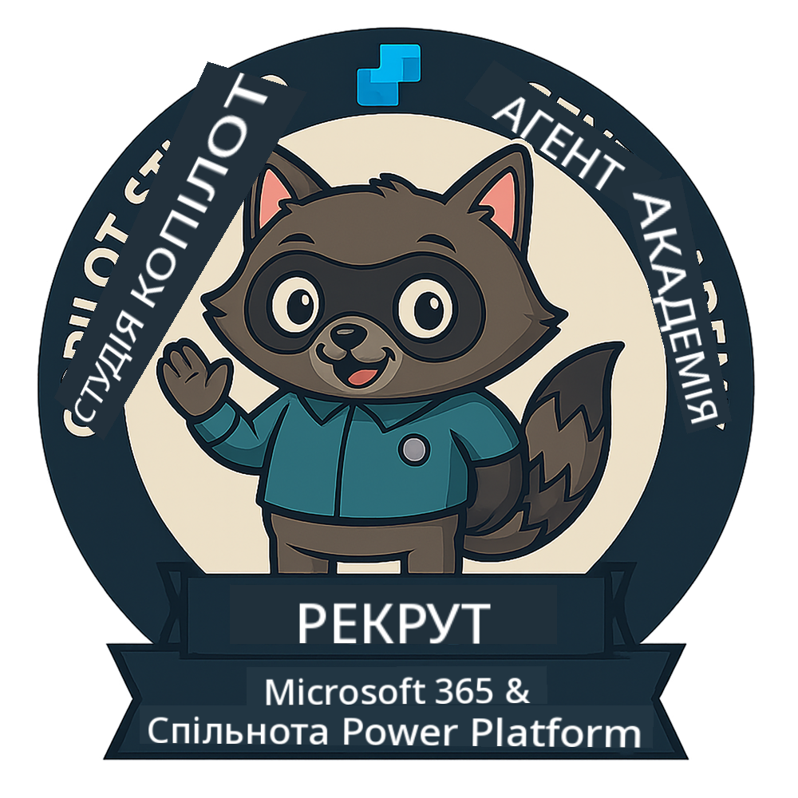
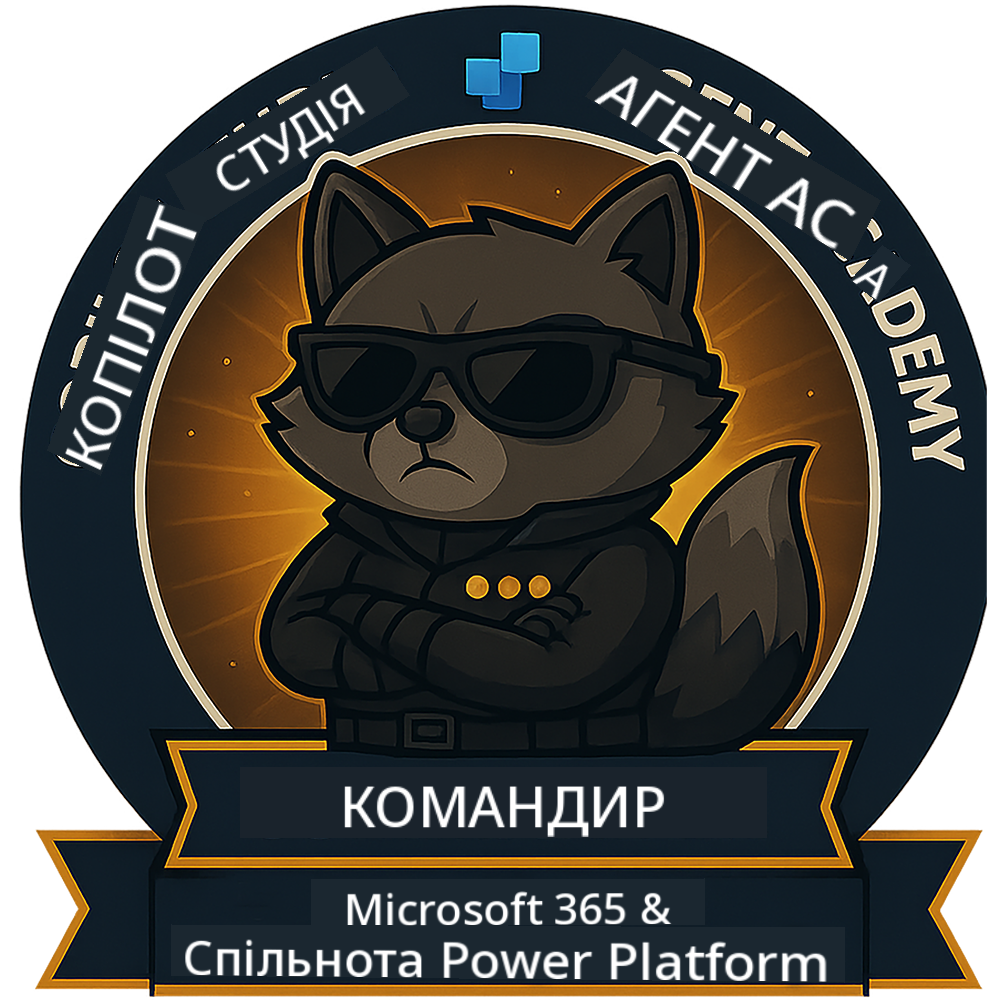

<!--
CO_OP_TRANSLATOR_METADATA:
{
  "original_hash": "15e57e059ce7689d602d7853187235cd",
  "translation_date": "2025-10-21T17:35:09+00:00",
  "source_file": "docs/index.md",
  "language_code": "uk"
}
-->
---
hide:
- navigation
---

# Академія агентів Copilot Studio

**Ласкаво просимо до Академії агентів Copilot Studio.**  

Ваша місія — якщо ви вирішите її прийняти — опанувати мистецтво створення агентів за допомогою **Microsoft Copilot Studio**.

Це практичне навчання стане вашим стартом у **світі агентів**: від створення запитів до адаптивних карток і потоків агентів, ви навчитеся створювати, масштабувати та впроваджувати інтелектуальних агентів, використовуючи реальні інструменти та приклади.

---

## 🏅 Прогрес рангів

**Академія агентів Copilot Studio** — це багатофазова програма навчання, яка допоможе вам розвинути свої навички через три ранги агентів. Кожен рівень включає значок і зростаючі обов'язки:

| Ранг             | Рівень | Візуалізація |
|------------------|:-----:|--------------|
| 🟢 **Новобранець**  [🚀 Почати](https://aka.ms/agent-academy-recruit){ .md-button .md-button--primary }     | •     | { width="300" }     |
| 🔵 **Оперативник** (Незабаром)   | ••    | { width="300" } |
| 🟡 **Командир** (Незабаром)    | •••   | { width="300" } |

Кожен рівень базується на попередньому. Завершіть місію новобранця та слідкуйте за оновленнями, щоб підвищити свої агентські навички.

---

## 🎒 Інші курси

Ознайомтеся з іншими курсами, щоб продовжити навчання про AI та агентів:

- [Microsoft Copilot Studio <3 MCP Lab](https://aka.ms/mcsmcplab)
- [Copilot Developer Camp](https://microsoft.github.io/copilot-camp/)
- [AI Agents for Beginners](https://microsoft.github.io/ai-agents-for-beginners/)
- [Model Context Protocol (MCP) For Beginners](https://github.com/microsoft/mcp-for-beginners)

---

## 🚑 Проблеми

Ми дуже цінуємо ваші відгуки! Будь ласка, скористайтеся [списком проблем](https://github.com/microsoft/agent-academy/issues), щоб поділитися своїми коментарями та проблемами. Дякуємо!

---

## 📜 Кодекс поведінки

Цей проєкт прийняв [Кодекс поведінки Microsoft Open Source](https://opensource.microsoft.com/codeofconduct/).

!!! info "Ресурси:"

    - [Кодекс поведінки Microsoft Open Source](https://opensource.microsoft.com/codeofconduct/)
    - [FAQ щодо Кодексу поведінки Microsoft](https://opensource.microsoft.com/codeofconduct/faq/)
    - Зв'яжіться з [opencode@microsoft.com](mailto:opencode@microsoft.com) з питаннями або занепокоєннями

---

[⭐️ Поставте зірочку нашому репозиторію](https://github.com/microsoft/agent-academy){ .md-button .md-button--primary }

<!-- markdownlint-disable-next-line MD033 -->

---

**Відмова від відповідальності**:  
Цей документ був перекладений за допомогою сервісу автоматичного перекладу [Co-op Translator](https://github.com/Azure/co-op-translator). Хоча ми прагнемо до точності, будь ласка, майте на увазі, що автоматичні переклади можуть містити помилки або неточності. Оригінальний документ на його рідній мові слід вважати авторитетним джерелом. Для критичної інформації рекомендується професійний людський переклад. Ми не несемо відповідальності за будь-які непорозуміння або неправильні тлумачення, що виникають внаслідок використання цього перекладу.