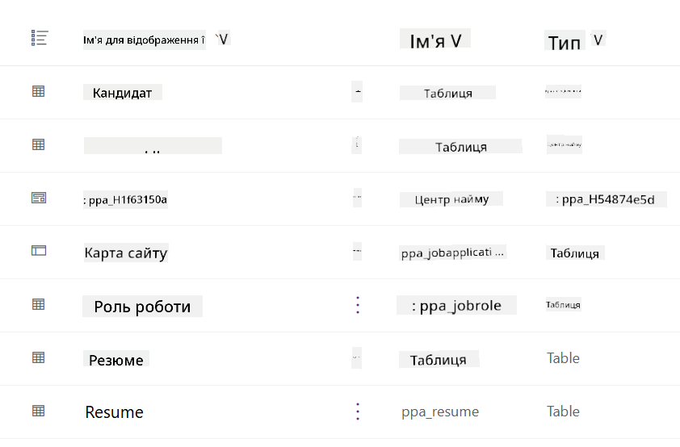
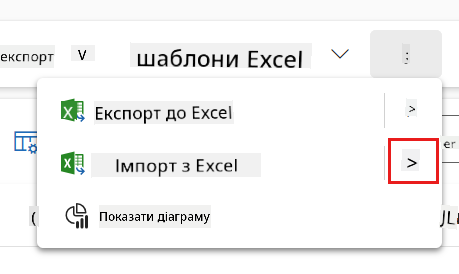
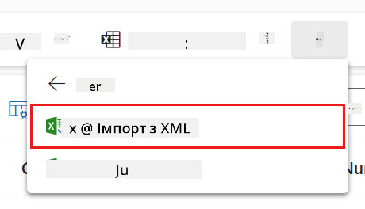
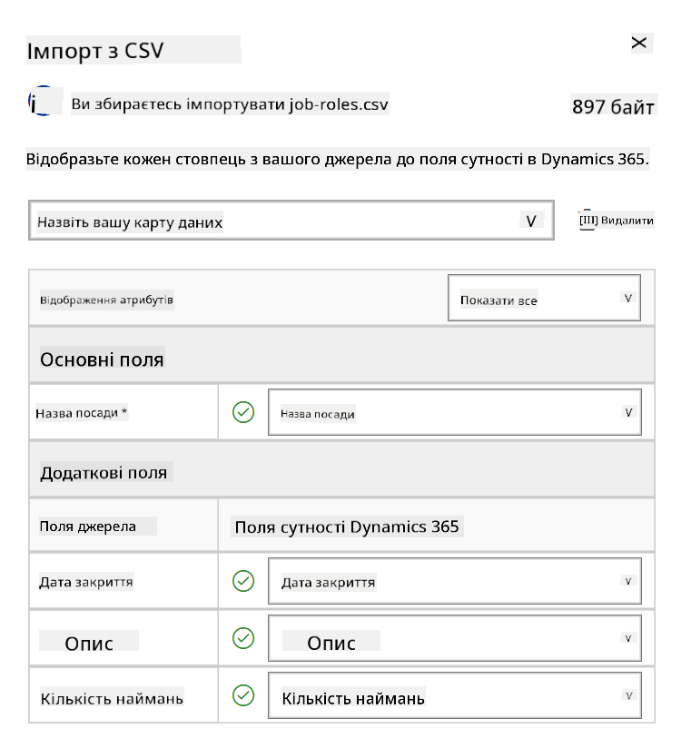
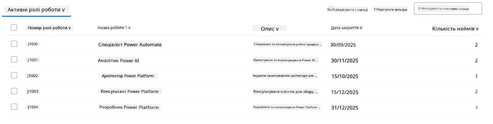
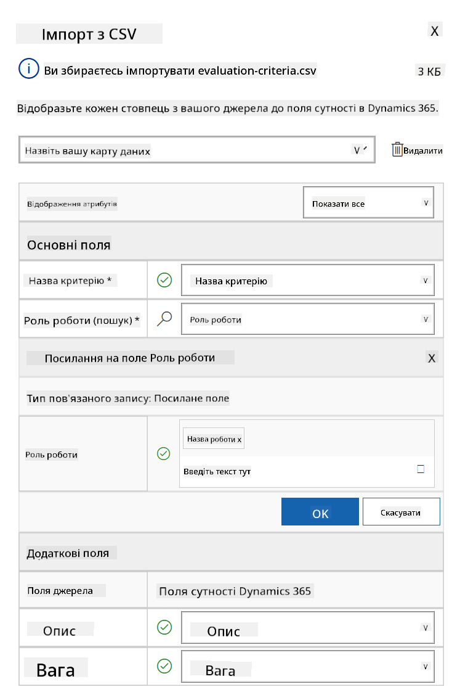
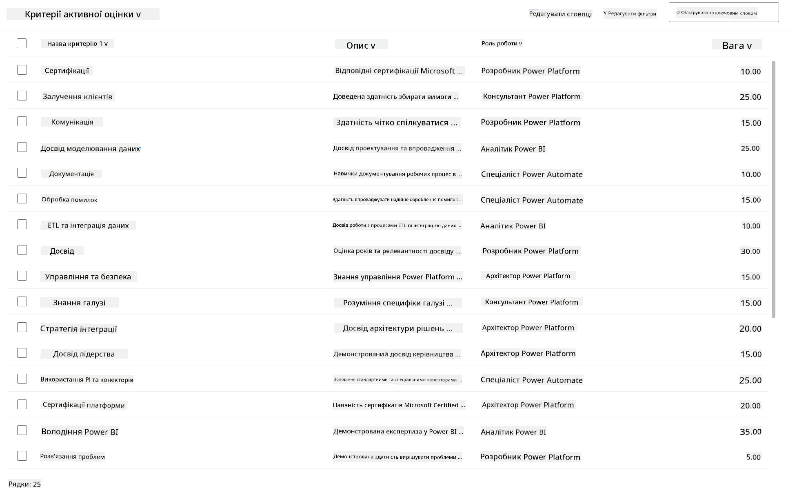

<!--
CO_OP_TRANSLATOR_METADATA:
{
  "original_hash": "2620cf9eaf09a3fc6be7fa31a3a62956",
  "translation_date": "2025-10-21T18:03:14+00:00",
  "source_file": "docs/operative-preview/01-get-started/README.md",
  "language_code": "uk"
}
-->
# 🚨 Місія 01: Початок роботи з Hiring Agent

--8<-- "disclaimer.md"

## 🕵️‍♂️ КОДОВА НАЗВА: `ОПЕРАЦІЯ ТАЛАНТ СКАУТ`

> **⏱️ Час виконання операції:** `~45 хвилин`

## 🎯 Короткий опис місії

Вітаємо, Агенте. Ваше перше завдання - **Операція Талант Скаут** - створення базової інфраструктури для системи рекрутингу на основі штучного інтелекту, яка змінить спосіб, у який організації знаходять і наймають найкращих фахівців.

Ваша місія, якщо ви вирішите її прийняти, полягає у розгортанні та налаштуванні комплексної системи управління наймом за допомогою Microsoft Copilot Studio. Ви імпортуєте готове рішення, яке містить усі необхідні структури даних, а потім створите свого першого AI-агента - **Hiring Agent**, який стане центральним координатором для всіх майбутніх операцій з найму.

Це початкове розгортання створює командний центр, який ви будете вдосконалювати протягом програми Agent Academy Operative. Вважайте це вашою базою операцій - основою, на якій ви побудуєте цілу мережу спеціалізованих агентів у наступних місіях.

---

## 🔎 Цілі

Виконавши цю місію, ви:

- **Розуміння сценарію**: Отримаєте всебічне знання про виклики та рішення автоматизації найму
- **Розгортання рішення**: Успішно імпортуєте та налаштуєте основи системи управління наймом
- **Створення агента**: Побудуєте Hiring Agent, який стане початком сценарію, який ви будете розробляти як оперативний агент Академії

---

## 🔍 Передумови

Перед початком цієї місії переконайтеся, що у вас є:

- Ліцензія Copilot Studio
- Доступ до середовища Microsoft Power Platform
- Адміністративні права для створення рішень та агентів

---

## 🏢 Розуміння сценарію автоматизації найму

Цей сценарій демонструє, як компанія може використовувати Microsoft Copilot Studio для покращення та автоматизації процесу найму. Він представляє систему агентів, які працюють разом для виконання завдань, таких як перегляд резюме, рекомендація посад, підготовка матеріалів для співбесід та оцінка кандидатів.

### Бізнес-цінність

Рішення допомагає командам HR економити час і приймати кращі рішення завдяки:

- Автоматичній обробці резюме, отриманих електронною поштою.
- Рекомендаціям відповідних посад на основі профілів кандидатів.
- Створенню заявок на роботу та посібників для співбесід, адаптованих до кожного кандидата.
- Забезпеченню справедливих і відповідних практик найму завдяки вбудованим функціям безпеки та модерації.
- Збиранню відгуків для покращення рішення.

### Як це працює

- Центральний **Hiring Agent** координує процес і зберігає дані в Microsoft Dataverse.
- **Application Intake Agent** читає резюме та створює заявки на роботу.
- **Interview Prep Agent** генерує питання для співбесіди та документи на основі досвіду кандидата.
- Систему можна опублікувати на демонстраційному вебсайті, дозволяючи зацікавленим сторонам взаємодіяти з нею.

Цей сценарій ідеально підходить для організацій, які прагнуть модернізувати свої робочі процеси найму за допомогою автоматизації на основі штучного інтелекту, зберігаючи прозорість, справедливість і ефективність.

---

## 🧪 Лабораторія: Налаштування Hiring Agent

У цій практичній лабораторії ви створите основу для вашої системи автоматизації найму. Ви почнете з імпорту готового рішення, яке містить усі необхідні таблиці Dataverse та структуру даних для управління кандидатами, посадами та робочими процесами найму. Далі ви заповните ці таблиці зразковими даними, які підтримуватимуть ваше навчання протягом цього модуля та забезпечать реалістичні сценарії для тестування. Нарешті, ви створите Hiring Agent у Copilot Studio, налаштувавши базовий інтерфейс для спілкування, який стане основою для всіх інших функцій, які ви додасте в майбутніх місіях.

### 🧪 Лабораторія 1.1: Імпорт рішення

1. Перейдіть до **[Copilot Studio](https://copilotstudio.microsoft.com)**
1. Виберіть **...** у лівій навігації та виберіть **Solutions**
1. Натисніть кнопку **Import Solution** у верхній частині
1. **[Завантажте](https://raw.githubusercontent.com/microsoft/agent-academy/refs/heads/main/docs/operative-preview/01-get-started/assets/Operative_1_0_0_0.zip)** підготовлене рішення
1. Виберіть **Browse** і виберіть завантажене рішення з попереднього кроку
1. Натисніть **Next**
1. Натисніть **Import**

!!! success
    У разі успіху ви побачите зелену панель сповіщень із таким повідомленням:  
    "Solution "Operative" imported successfully."

Коли рішення імпортовано, перегляньте, що ви імпортували, вибравши відображуване ім'я рішення (`Operative`).



Імпортовані наступні компоненти:

| Відображуване ім'я | Тип | Опис |
|--------------------|-----|------|
| Candidate | Таблиця | Інформація про кандидата |
| Evaluation Criteria | Таблиця | Критерії оцінки для посади |
| Hiring Hub | Додаток на основі моделі | Додаток для управління процесом найму |
| Hiring Hub | Карта сайту | Структура навігації для додатку Hiring Hub |
| Job Application | Таблиця | Заявки на роботу |
| Job Role | Таблиця | Посади |
| Resume | Таблиця | Резюме кандидатів |

Як останнє завдання для цієї лабораторії, натисніть кнопку **Publish all customizations** у верхній частині сторінки.

### 🧪 Лабораторія 1.2: Імпорт зразкових даних

У цій лабораторії ви додасте зразкові дані до деяких таблиць, які ви імпортували в лабораторії 1.1.

#### Завантаження файлів для імпорту

1. **[Завантажте](https://raw.githubusercontent.com/microsoft/agent-academy/refs/heads/main/docs/operative-preview/01-get-started/assets/evaluation-criteria.csv)** CSV-файл із критеріями оцінки
1. **[Завантажте](https://raw.githubusercontent.com/microsoft/agent-academy/refs/heads/main/docs/operative-preview/01-get-started/assets/job-roles.csv)** CSV-файл із посадами

#### Імпорт зразкових даних для посад

1. Поверніться до рішення, яке ви щойно імпортували в останній лабораторії
1. Виберіть **Hiring Hub** Model-Driven App, натиснувши галочку перед рядком
1. Натисніть кнопку **Play** у верхній частині

    !!! warning
        Можливо, вам доведеться увійти знову. Переконайтеся, що ви це зробили. Після цього ви повинні побачити додаток Hiring Hub.

1. Виберіть **Job Roles** у лівій навігації
1. Натисніть **More** (три крапки одна під одною) у командній панелі
1. Натисніть **стрілку вправо** поруч із *Import from Excel*

    

1. Виберіть **Import from CSV**

    

1. Натисніть кнопку **Choose File**, виберіть файл **job-roles.csv**, який ви щойно завантажили, і натисніть **Open**
1. Натисніть **Next**
1. Залиште наступний крок без змін і натисніть **Review Mapping**

    

1. Переконайтеся, що відповідність правильна, і натисніть **Finish Import**

    !!! info
        Це розпочне імпорт, і ви зможете відстежувати прогрес або завершити процес негайно, натиснувши **Done**

1. Натисніть **Done**

Це може зайняти трохи часу, але ви можете натиснути кнопку **Refresh**, щоб перевірити, чи імпорт завершився успішно.



#### Імпорт зразкових даних для критеріїв оцінки

1. Виберіть **Evaluation Criteria** у лівій навігації
1. Натисніть **More** (три крапки одна під одною) у командній панелі
1. Натисніть **стрілку вправо** поруч із *Import from Excel*

    

1. Виберіть **Import from CSV**

    

1. Натисніть кнопку **Choose File**, виберіть файл **evaluation-criteria.csv**, який ви щойно завантажили, і натисніть **Open**
1. Натисніть **Next**
1. Залиште наступний крок без змін і натисніть **Review Mapping**

    

1. Тепер нам потрібно зробити трохи більше роботи для відповідності. Натисніть значок лупи (🔎) поруч із полем Job Role
1. Переконайтеся, що тут вибрано **Job Title**, і якщо ні - додайте його
1. Натисніть **OK**
1. Переконайтеся, що решта відповідності також правильна, і натисніть **Finish Import**

    !!! info
        Це знову розпочне імпорт, і ви зможете відстежувати прогрес або завершити процес негайно, натиснувши **Done**

1. Натисніть **Done**

Це може зайняти трохи часу, але ви можете натиснути кнопку **Refresh**, щоб перевірити, чи імпорт завершився успішно.



### 🧪 Лабораторія 1.3: Створення Hiring Agent

Тепер, коли ви завершили налаштування передумов, час для основної роботи! Давайте спочатку додамо нашого Hiring Agent!

1. Перейдіть до **[Copilot Studio](https://copilotstudio.microsoft.com)** і переконайтеся, що ви перебуваєте в тому ж середовищі, де ви імпортували рішення та дані
1. Виберіть **Agents** у лівій навігації
1. Натисніть **New Agent**
1. Натисніть **Configure**
1. У полі **Name** введіть:

    ```text
    Hiring Agent
    ```

1. У полі **Description** введіть:

    ```text
    Central orchestrator for all hiring activities
    ```

1. Натисніть **...** поруч із кнопкою *Create* у верхньому правому куті
1. Виберіть **Update advanced settings**
1. Як **Solution**, виберіть `Operative`
1. Натисніть **Update**
1. Натисніть **Create** у верхньому правому куті

Це створить Hiring Agent для вас, якого ви будете використовувати протягом цього курсу Operative.

---

## 🎉 Місія завершена

Місія 01 завершена! Тепер ви опанували наступні навички:

✅ **Розуміння сценарію**: Всебічне знання викликів та рішень автоматизації найму  
✅ **Розгортання рішення**: Успішно імпортували та налаштували основи системи управління наймом  
✅ **Створення агента**: Створили Hiring Agent, який є початком сценарію, який ви будете розробляти як оперативний агент Академії  

Далі [Місія 02](../02-multi-agent/README.md): Зробіть вашого агента готовим до роботи з кількома агентами, підключивши їх.

---

## 📚 Тактичні ресурси

📖 [Microsoft Copilot Studio - Створення агента](https://learn.microsoft.com/microsoft-copilot-studio/authoring-first-bot)  
📖 [Документація Microsoft Dataverse](https://learn.microsoft.com/power-apps/maker/data-platform)

---

**Відмова від відповідальності**:  
Цей документ був перекладений за допомогою сервісу автоматичного перекладу [Co-op Translator](https://github.com/Azure/co-op-translator). Хоча ми прагнемо до точності, будь ласка, майте на увазі, що автоматичні переклади можуть містити помилки або неточності. Оригінальний документ на його рідній мові слід вважати авторитетним джерелом. Для критичної інформації рекомендується професійний людський переклад. Ми не несемо відповідальності за будь-які непорозуміння або неправильні тлумачення, що виникають внаслідок використання цього перекладу.