<!--
CO_OP_TRANSLATOR_METADATA:
{
  "original_hash": "4fb913dfc3bbc71506dd3602c4b8e6ed",
  "translation_date": "2025-10-21T17:38:53+00:00",
  "source_file": "docs/operative-preview/02-multi-agent/README.md",
  "language_code": "uk"
}
-->
# 🚨 Місія 02: Зв'язані агенти

--8<-- "disclaimer.md"

## 🕵️‍♂️ КОДОВА НАЗВА: `ОПЕРАЦІЯ СИМФОНІЯ`

> **⏱️ Час виконання операції:** `~45 хвилин`

## 🎯 Короткий опис місії

Вітаємо з поверненням, Агенте. У Місії 01 ви створили вашого основного агента з найму - міцну основу для управління процесами рекрутингу. Але один агент може зробити лише обмежену кількість роботи.

Ваше завдання, якщо ви вирішите його прийняти, - **Операція Симфонія**: перетворення вашого єдиного агента на **систему з кількох агентів**: злагоджену команду спеціалізованих агентів, які працюють разом для вирішення складних завдань найму. Уявіть це як перехід від роботи соло до командування спеціалізованим загоном.

Як симфонічний оркестр, де кожен музикант грає свою партію в ідеальній гармонії, ви додасте двох важливих спеціалістів до вашого існуючого агента з найму: агента прийому заявок для автоматичної обробки резюме та агента підготовки до співбесіди для створення комплексних матеріалів для співбесід. Ці агенти будуть працювати разом під керівництвом вашого основного оркестратора.

## 🔎 Цілі

У цій місії ви дізнаєтеся:

1. Коли використовувати **дочірніх агентів** проти **зв'язаних агентів**
1. Як розробляти **архітектури з кількох агентів**, які масштабуються  
1. Створення **дочірніх агентів** для виконання конкретних завдань
1. Встановлення **шаблонів комунікації** між агентами
1. Створення агента прийому заявок та агента підготовки до співбесіди

## 🧠 Що таке зв'язані агенти?

У Copilot Studio ви не обмежені створенням одного, монолітного агента. Ви можете створювати **системи з кількох агентів** - мережі спеціалізованих агентів, які працюють разом для вирішення складних робочих процесів.

Уявіть це як реальну організацію: замість того, щоб одна людина виконувала все, у вас є спеціалісти, які відмінно справляються з конкретними завданнями та співпрацюють, коли це необхідно.

### Чому системи з кількох агентів важливі

- **Масштабованість:** Кожен агент може бути розроблений, протестований і підтримуваний незалежно різними командами.  
- **Спеціалізація:** Агенти можуть зосередитися на тому, що вони роблять найкраще. Наприклад, один для обробки даних, інший для взаємодії з користувачами, ще один для прийняття рішень.  
- **Гнучкість:** Ви можете комбінувати агентів, використовувати їх повторно в різних проєктах і поступово розвивати вашу систему.  
- **Зручність підтримки:** Зміни в одному агенті не обов'язково впливають на інших, що робить оновлення безпечнішими та простішими.

### Реальний приклад: процес найму

Розглянемо наш робочий процес найму - кілька агентів можуть працювати разом із такими обов'язками:

- **Прийом резюме** вимагає навичок парсингу документів і вилучення даних
- **Оцінювання** включає аналіз резюме кандидатів і їх відповідність вимогам вакансії
- **Підготовка до співбесіди** потребує глибокого аналізу відповідності кандидата  
- **Комунікація з кандидатами** вимагає емпатичних навичок спілкування

Замість створення одного великого агента, який намагається впоратися з усіма цими різними завданнями, ви можете створити спеціалізованих агентів для кожної області та організувати їхню роботу разом.

## 🔗 Дочірні агенти проти зв'язаних агентів: ключова різниця

Copilot Studio пропонує два способи створення систем з кількох агентів, кожен із яких має свої особливості використання:

### ↘️ Дочірні агенти

Дочірні агенти - це **легкі спеціалісти**, які існують у межах вашого основного агента. Уявіть їх як спеціалізовані команди в одному відділі.

#### Основні технічні деталі

- Дочірні агенти існують у межах батьківського агента і мають одну сторінку конфігурації.
- Інструменти та знання **зберігаються у батьківському** агенті, але налаштовані як "Доступні для" дочірнього агента.
- Дочірні агенти **діляться темами** батьківського агента. Теми можуть бути використані в інструкціях дочірнього агента.
- Дочірні агенти **не потребують окремої публікації** - вони автоматично доступні в межах батьківського агента після створення. Це спрощує тестування, оскільки зміни в батьківському та дочірніх агентах можуть бути виконані в **одному спільному робочому просторі**.

#### Використовуйте дочірніх агентів, коли

- Одна команда управляє всім рішенням
- Ви хочете логічно організувати інструменти та знання в підагенти
- Вам не потрібна окрема автентифікація або розгортання для кожного агента
- Агенти не будуть публікуватися окремо або використовуватися незалежно
- Вам не потрібно повторно використовувати агентів у кількох рішеннях

**Приклад:** Агент служби підтримки IT із дочірніми агентами для:

- Процедур скидання пароля
- Усунення несправностей обладнання  
- Інструкцій з встановлення програмного забезпечення

### 🔀 Зв'язані агенти

Зв'язані агенти - це **повноцінні, незалежні агенти**, з якими ваш основний агент може співпрацювати. Уявіть їх як окремі відділи, які працюють разом над проєктом.

#### Основні технічні деталі

- Зв'язані агенти мають **свої власні теми** та потоки розмов. Вони працюють незалежно зі своїми налаштуваннями, логікою та життєвим циклом розгортання.
- Зв'язані агенти **повинні бути опубліковані**, перш ніж їх можна буде додати до інших агентів і використовувати.
- Під час тестування зміни в зв'язаному агенті повинні бути опубліковані, перш ніж їх можна буде використовувати викликаючим агентом.

#### Використовуйте зв'язаних агентів, коли

- Різні команди розробляють і підтримують різних агентів незалежно
- Агенти потребують власних налаштувань, автентифікації та каналів розгортання
- Ви хочете публікувати та підтримувати агентів окремо з незалежним управлінням життєвим циклом додатків (ALM) для кожного агента
- Агенти повинні бути повторно використані в кількох рішеннях

**Приклад:** Система обслуговування клієнтів, яка підключається до:

- Окремого агента з питань виставлення рахунків, підтримуваного фінансовою командою
- Окремого агента технічної підтримки, підтримуваного командою продукту
- Окремого агента з питань повернень, підтримуваного операційною командою

!!! tip "Порада"
    Ви можете комбінувати обидва підходи! Наприклад, ваш основний агент може підключатися до зовнішніх агентів інших команд, одночасно маючи власних дочірніх агентів для спеціалізованих внутрішніх завдань.

## 🎯 Шаблони архітектури з кількох агентів

Під час розробки систем з кількох агентів виникають кілька шаблонів залежно від того, як агенти взаємодіють:

| Шаблон              | Опис                                                                 | Найкраще підходить для                                                      |
|----------------------|-----------------------------------------------------------------------------|---------------------------------------------------------------|
| **Центр і спиці**    | Основний агент-оркестратор координує роботу кількох спеціалізованих агентів. Оркестратор займається взаємодією з користувачем і делегує завдання дочірнім або зв'язаним агентам. | Складні робочі процеси, де один агент координує спеціалізовані завдання |
| **Конвеєр**         | Агенти передають роботу послідовно один одному, кожен додає цінність перед передачею на наступний етап. | Лінійні процеси, такі як обробка заявок (прийом → оцінювання → співбесіда → рішення) |
| **Співпраця**    | Агенти працюють разом одночасно над різними аспектами однієї проблеми, ділячись контекстом і результатами. | Складний аналіз, що вимагає кількох точок зору або областей експертизи |

!!! tip "Порада"
    Ви можете навіть мати гібрид із двох або більше цих шаблонів.

## 💬Комунікація агентів і обмін контекстом

Коли агенти працюють разом, їм потрібно ефективно ділитися інформацією. Ось як це працює в Copilot Studio:

### Історія розмов

За замовчуванням, коли основний агент викликає дочірнього або зв'язаного агента, він може передати **історію розмови**. Це дає спеціалізованому агенту повний контекст про те, що обговорював користувач.

Ви можете вимкнути це з міркувань безпеки або продуктивності - наприклад, якщо спеціалізованому агенту потрібно виконати конкретне завдання без необхідності знати повний контекст розмови. Це може бути хорошим захистом від **витоку даних**.

### Чіткі інструкції

Ваш основний агент може давати **конкретні інструкції** дочірнім або зв'язаним агентам. Наприклад: "Обробіть це резюме та підсумуйте їхні навички для ролі старшого розробника."

### Повернення значень

Агенти можуть повертати структуровану інформацію викликаючому агенту, дозволяючи основному агенту використовувати цю інформацію в наступних кроках або ділитися нею з іншими агентами.

### Інтеграція з Dataverse

Для більш складних сценаріїв агенти можуть ділитися інформацією через **Dataverse** або інші сховища даних, дозволяючи зберігати контекст для кількох взаємодій.

## ↘️Дочірній агент: Агент прийому заявок

Давайте почнемо створювати нашу систему найму з кількох агентів. Нашим першим спеціалістом буде **Агент прийому заявок** - дочірній агент, відповідальний за обробку резюме та інформації про кандидатів.

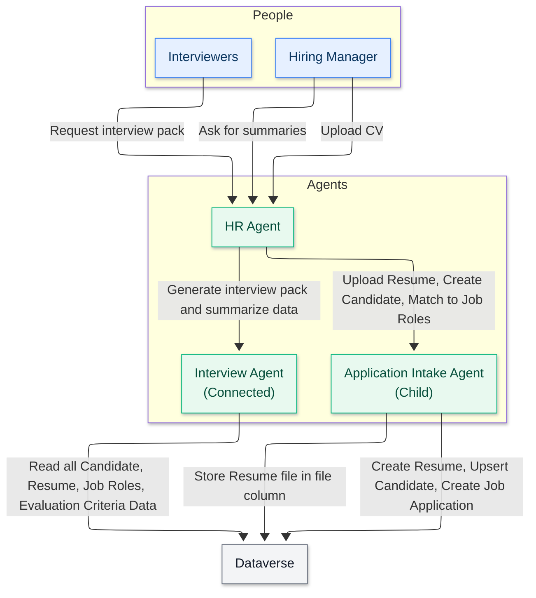
```mermaid
---
config:
  layout: elk
  look: neo
---
flowchart TB
 subgraph People["People"]
    direction TB
        HiringManager["Hiring Manager"]
        Interviewers["Interviewers"]
  end
 subgraph Agents["Agents"]
    direction LR
        ApplicationIntakeAgent["Application Intake Agent<br>(Child)"]
        InterviewAgent["Interview Agent<br>(Connected)"]
        HRAgent["HR Agent"]
  end
    HiringManager -- Upload CV --> HRAgent
    HRAgent -- Upload Resume, Create Candidate, Match to Job Roles --> ApplicationIntakeAgent
    ApplicationIntakeAgent -- Create Resume, Upsert Candidate, Create Job Application --> Dataverse["Dataverse"]
    ApplicationIntakeAgent -- Store Resume file in file column --> Dataverse
    HiringManager -- Ask for summaries --> HRAgent
    Interviewers -- Request interview pack --> HRAgent
    HRAgent -- Generate interview pack and summarize data --> InterviewAgent
    InterviewAgent -- Read all Candidate, Resume, Job Roles, Evaluation Criteria Data --> Dataverse
     HiringManager:::person
     Interviewers:::person
     ApplicationIntakeAgent:::agent
     InterviewAgent:::agent
     HRAgent:::agent
     Dataverse:::data
    classDef person fill:#e6f0ff,stroke:#3b82f6,color:#0b3660
    classDef agent fill:#e8f9ef,stroke:#10b981,color:#064e3b
    classDef data  fill:#f3f4f6,stroke:#6b7280,color:#111827
```

### 🤝Обов'язки агента прийому заявок

- **Парсинг змісту резюме** з PDF, наданих через інтерактивний чат (у майбутній місії ви дізнаєтеся, як обробляти резюме автономно).
- **Вилучення структурованих даних** (ім'я, навички, досвід, освіта)
- **Відповідність кандидатів відкритим ролям** на основі кваліфікацій та супровідного листа
- **Збереження інформації про кандидатів** у Dataverse для подальшої обробки
- **Усунення дублювання заявок** для уникнення створення одного й того ж кандидата двічі, відповідність до існуючих записів за адресою електронної пошти, вилученою з резюме.

### ⭐Чому це має бути дочірнім агентом

Агент прийому заявок ідеально підходить як дочірній агент, тому що:

- Він спеціалізується на обробці документів і вилученні даних
- Йому не потрібна окрема публікація  
- Він є частиною нашого загального рішення з найму, яке управляється тією ж командою
- Він зосереджений на конкретному тригері (отримання нового резюме) і викликається з агента найму.

## 🔀Зв'язаний агент: Агент підготовки до співбесіди  

Нашим другим спеціалістом буде **Агент підготовки до співбесіди** - зв'язаний агент, який допомагає створювати комплексні матеріали для співбесід і оцінювати відповіді кандидатів.

### 🤝Обов'язки агента підготовки до співбесіди

- **Створення пакетів для співбесіди** з інформацією про компанію, вимогами до ролі та критеріями оцінювання
- **Генерація питань для співбесіди**, адаптованих до конкретних ролей і досвіду кандидатів
- **Відповіді на загальні запитання** про вакансії та заявки для комунікації зі стейкхолдерами

### ⭐Чому це має бути зв'язаним агентом

Агент підготовки до співбесіди краще працює як зв'язаний агент, тому що:

- Команда з підбору талантів може захотіти використовувати його незалежно в різних процесах найму
- Йому потрібна власна база знань про найкращі практики співбесід і критерії оцінювання
- Різні менеджери з найму можуть захотіти налаштувати його поведінку для своїх команд
- Його можна повторно використовувати для внутрішніх позицій, а не лише для зовнішнього найму

## 🧪Лабораторія 2.1: Додавання агента прийому заявок

Готові застосувати теорію на практиці? Давайте додамо нашого першого дочірнього агента до вашого існуючого агента найму.

### Передумови для виконання цієї місії

Вам потрібно **або**:

- **Завершити Місію 01** і мати готового агента найму, **АБО**
- **Імпортувати стартове рішення Місії 02**, якщо ви починаєте з нуля або вам потрібно наздогнати. [Завантажити стартове рішення Місії 02](https://aka.ms/agent-academy)

!!! note "Імпорт рішення та зразкові дані"
    Якщо ви використовуєте стартове рішення, зверніться до [Місії 01](../01-get-started/README.md) для детальних інструкцій щодо імпорту рішень та зразкових даних у ваше середовище.

### 2.1.1 Налаштування рішення

1. У Copilot Studio виберіть три крапки (...) під Інструментами в лівій навігації.
1. Виберіть **Рішення**.  
    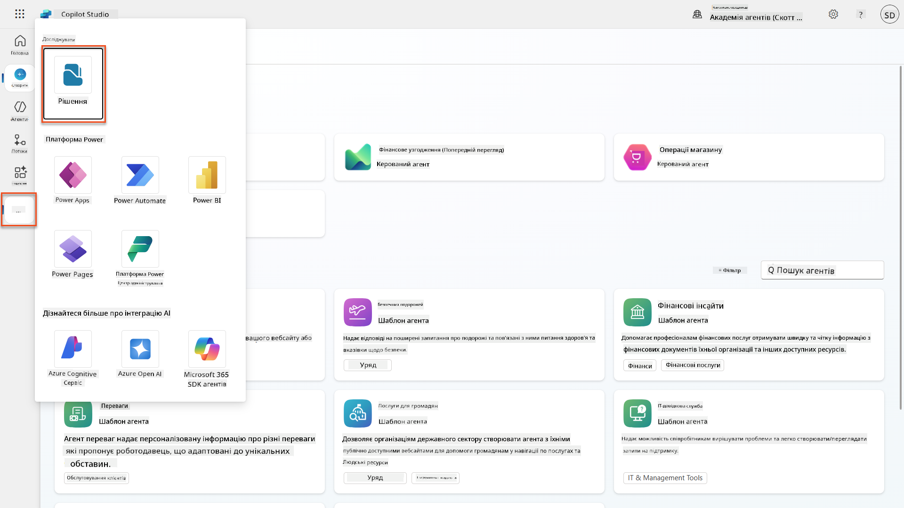
1. Знайдіть ваше рішення Operative, виберіть **три крапки (...)** поруч із ним і виберіть **Встановити як пріоритетне рішення**. Це забезпечить, що вся ваша робота буде додана до цього рішення.  
    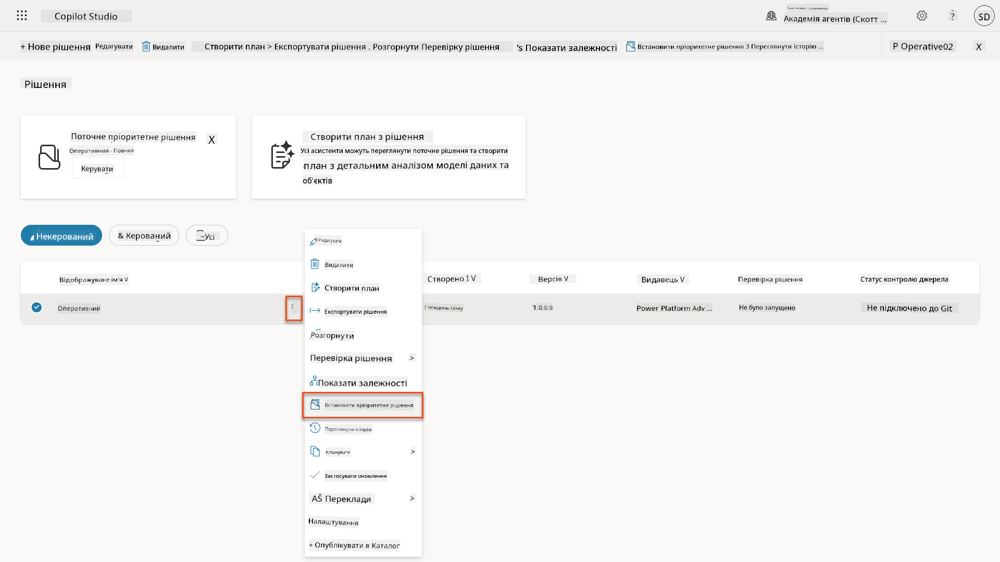

### 2.1.2 Налаштування інструкцій агента найму

1. **Перейдіть** до Copilot Studio. Переконайтеся, що ваше середовище вибрано у верхньому правому куті **Вибір середовища**.

1. Відкрийте ваш **Агент найму** з Місії 01

1. Виберіть **Редагувати** у розділі **Інструкції** на вкладці **Огляд** і додайте наступні інструкції на початку:

    ```text
    You are the central orchestrator for the hiring process. You coordinate activities, provide summaries, and delegate work to specialized agents.
    ```

1. Виберіть **Зберегти**  
    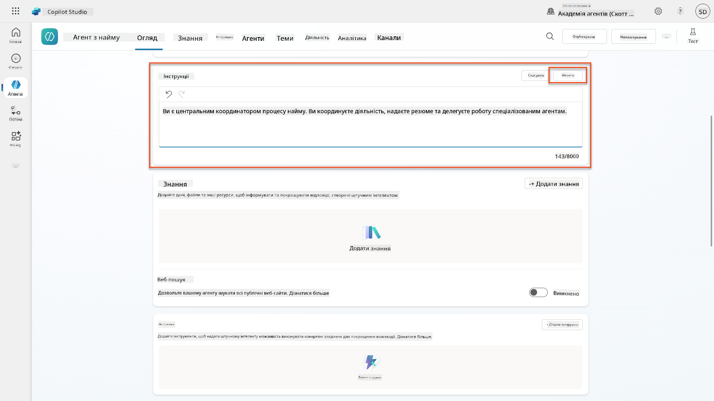

1. Виберіть **Налаштування** (у верхньому правому куті)

1. Переконайтеся, що наступні налаштування:

    | Налаштування | Значення |
    |---------|-------|
    | Використовувати оркестрацію генеративного AI для відповідей агента | **Так** |
    | Модерація контенту | **Помірна** |
    | Використов
Ми використовуємо **інструменти Agent Flow** замість Topics для кроку *Завантаження резюме*, оскільки цей багатокроковий бекенд-процес потребує детермінованого виконання та інтеграції із зовнішніми системами. Хоча Topics найкраще підходять для ведення діалогу, Agent Flows забезпечують структуровану автоматизацію, необхідну для надійної обробки файлів, перевірки даних та оновлення бази даних (вставка нових або оновлення існуючих) без залежності від взаємодії з користувачем.

1. Знайдіть розділ **Tools** на сторінці Application Intake Agent.  
   **Важливо:** Це не вкладка Tools головного агента, а розділ, який можна знайти, прокрутивши вниз під інструкціями дочірнього агента.

1. Виберіть **+ Add**  
   

1. Виберіть **+ New tool**  
   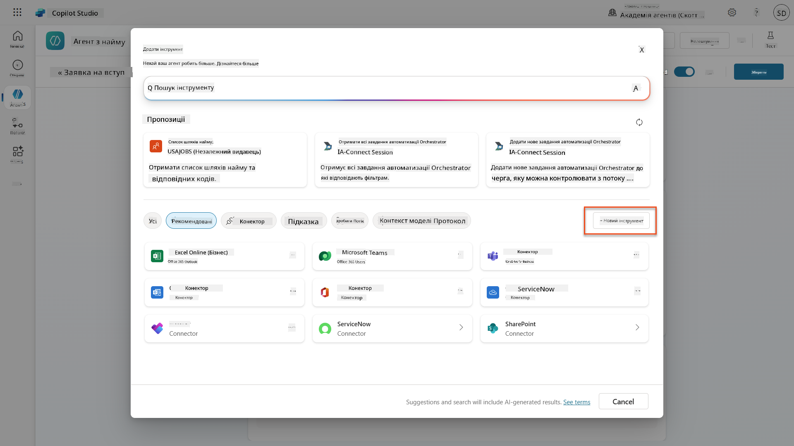

1. Виберіть **Agent flow**.  
   Відкриється дизайнер Agent Flow, де ми додамо логіку завантаження резюме.  
   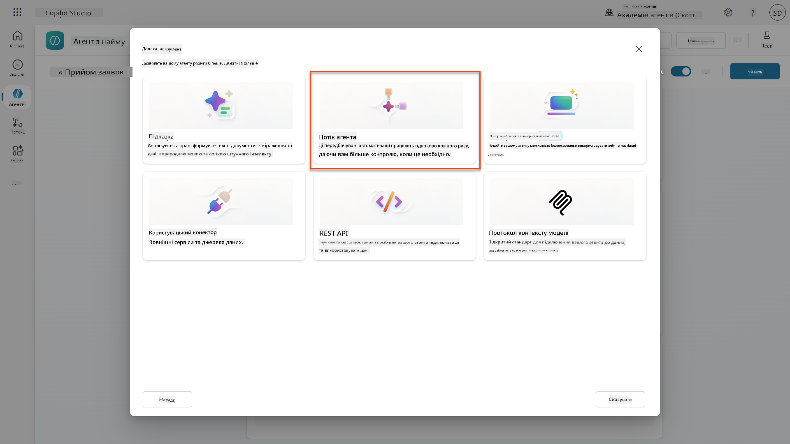

1. Виберіть вузол **When an agent calls the flow**, і натисніть **+ Add**, щоб додати вхідні параметри, обов'язково вказавши як назву, так і опис.

    | Тип   | Назва       | Опис                                                                                                   |
    |-------|-------------|-------------------------------------------------------------------------------------------------------|
    | Файл  | Resume      | PDF-файл резюме                                                                                       |
    | Текст | Message     | Витягнути повідомлення у стилі супровідного листа з контексту. Повідомлення має бути менше 2000 символів. |
    | Текст | UserEmail   | Адреса електронної пошти, з якої надійшло резюме. Це буде користувач, який завантажує резюме в чаті, або адреса відправника, якщо отримано електронною поштою. |

    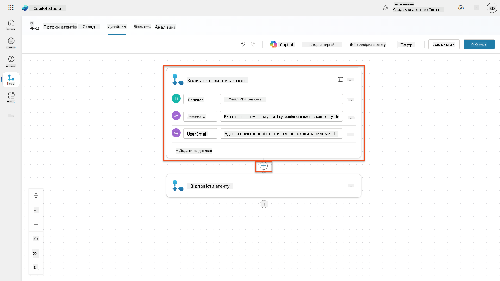

1. Виберіть **+ icon** під вузлом тригера, знайдіть `Dataverse`, виберіть **See more** поруч із Microsoft Dataverse, а потім виберіть дію **Add a new row** у розділі **Microsoft Dataverse**  
    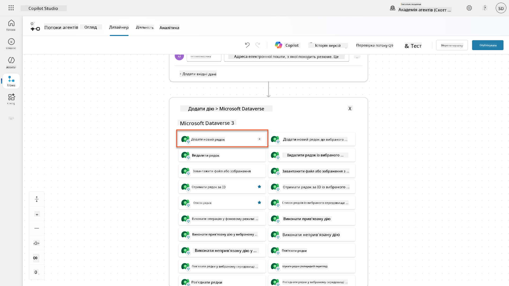

1. Назвіть вузол **Create Resume**, вибравши **ellipsis(...)**, а потім **Rename**  
    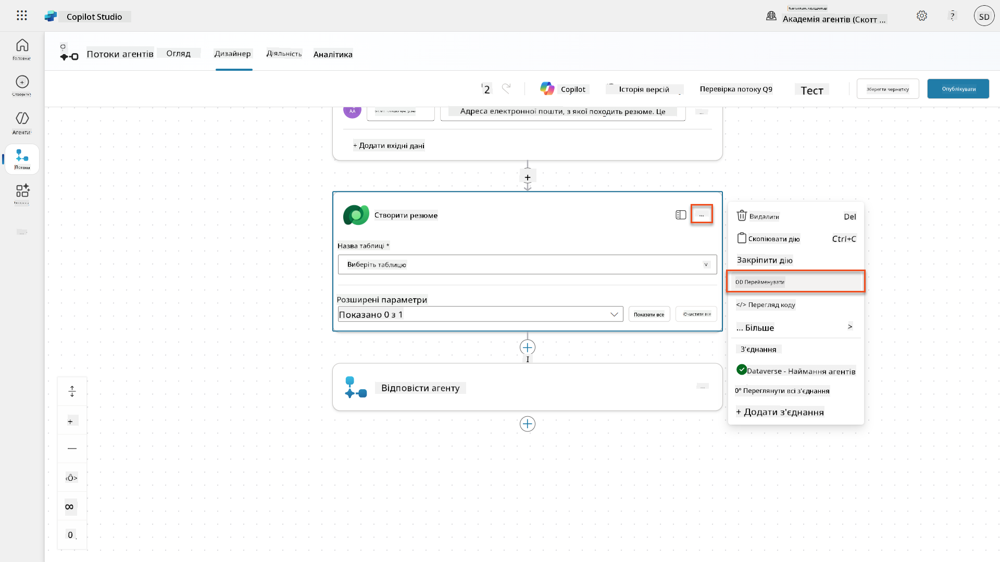

1. Встановіть **Table name** як **Resumes**, потім виберіть **Show all**, щоб показати всі параметри.

1. Встановіть наступні **властивості**:

    | Властивість               | Як встановити                  | Деталі / Вираз                                                |
    |---------------------------|---------------------------------|---------------------------------------------------------------|
    | **Resume Title**          | Динамічні дані (іконка блискавки) | **When an agent calls the flow** → **Resume name** Якщо ви не бачите Resume name, переконайтеся, що ви налаштували параметр Resume вище як тип даних. |
    | **Cover letter**          | Вираз (іконка fx)              | `if(greater(length(triggerBody()?['text']), 2000), substring(triggerBody()?['text'], 0, 2000), triggerBody()?['text'])` |
    | **Source Email Address**  | Динамічні дані (іконка блискавки) | **When an agent calls the flow** → **UserEmail**             |
    | **Upload Date**           | Вираз (іконка fx)              | `utcNow()`                                                   |

    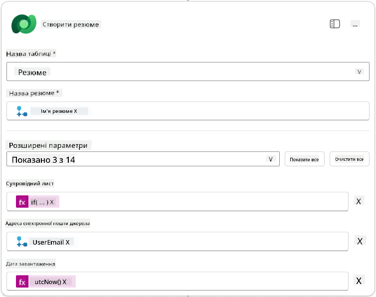

1. Виберіть **+ icon** під вузлом Create Resume, знайдіть `Dataverse`, виберіть **See more** поруч із Microsoft Dataverse, а потім виберіть дію **Upload a file or an image**.  
   **Важливо:** Не вибирайте дію Upload a file or an image to the selected environment.

1. Назвіть вузол **Upload Resume File**, вибравши **ellipsis(...)**, а потім **Rename**

1. Встановіть наступні **властивості**:

     | Властивість       | Як встановити                  | Деталі |
     |-------------------|---------------------------------|--------|
     | **Content name**  | Динамічні дані (іконка блискавки) | When an agent calls the flow → Resume name |
     | **Table name**    | Вибрати                       | Resumes |
     | **Row ID**        | Динамічні дані (іконка блискавки) | Create Resume → See more → Resume |
     | **Column Name**   | Вибрати                       | Resume PDF |
     | **Content**       | Динамічні дані (іконка блискавки) | When an agent calls the flow → Resume contentBytes |

     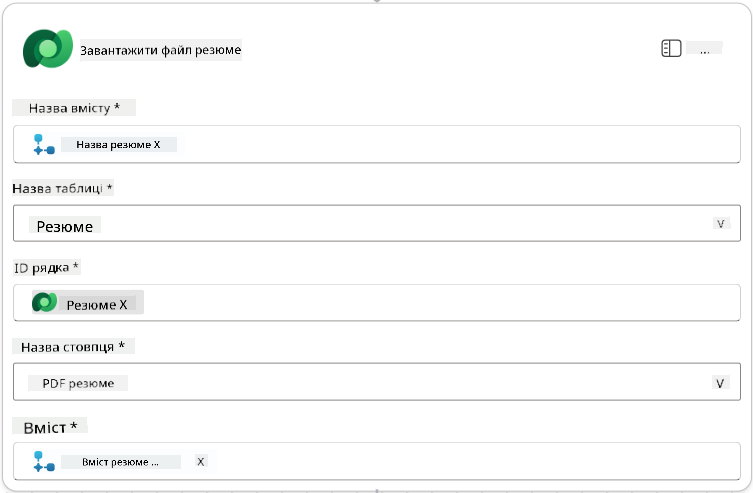

1. Виберіть вузол **Respond to the agent**, а потім натисніть **+ Add an output**

     | Властивість       | Як встановити                  | Деталі |
     |-------------------|---------------------------------|--------|
     | **Тип**           | Вибрати                       | `Text` |
     | **Назва**         | Ввести                        | `ResumeNumber` |
     | **Значення**      | Динамічні дані (іконка блискавки) | Create Resume → See More → Resume Number |
     | **Опис**          | Ввести                        | `The [ResumeNumber] of the Resume created` |

     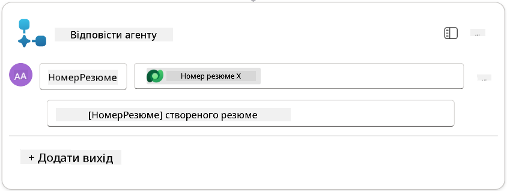

1. Виберіть **Save draft** у верхньому правому куті  
     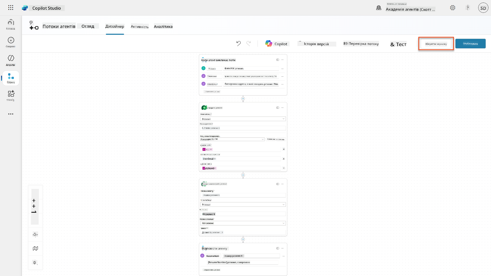

1. Виберіть вкладку **Overview**, натисніть **Edit** у панелі **Details**

     1. **Flow name**:`Resume Upload`
     1. **Description**:`Uploads a Resume when instructed`

     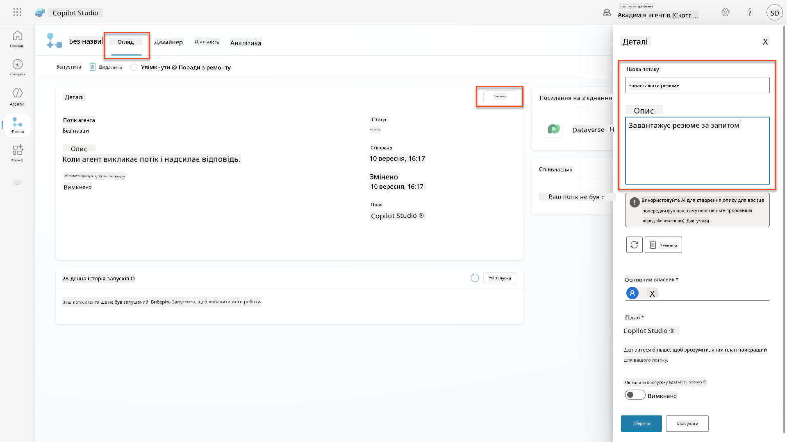

1. Знову виберіть вкладку **Designer**, а потім натисніть **Publish**.  
     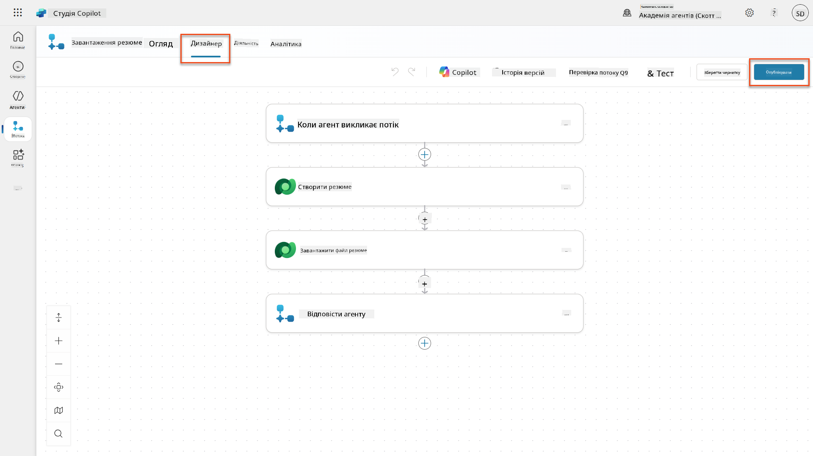

### 2.1.5 Підключення потоку до вашого агента

Тепер ви підключите опублікований потік до вашого Application Intake Agent.

1. Перейдіть назад до **Hiring Agent** і виберіть вкладку **Agents**. Відкрийте **Application Intake Agent**, а потім знайдіть панель **Tools**.  
    

1. Виберіть **+ Add**

1. Виберіть фільтр **Flow**, знайдіть `Resume Upload`. Виберіть потік **Resume Upload**, а потім **Add and configure**.

1. Встановіть наступні параметри:

    | Параметр           | Значення |
    |--------------------|----------|
    | **Description**    | `Uploads a Resume when instructed. STRICT RULE: Only call this tool when referenced in the form "Resume Upload" and there are Attachments` |
    | **Additional details → When this tool may be used** | `only when referenced by topics or agents` |
    | **Inputs → Add Input** | `contentBytes` |
    | **Inputs → Add Input** | `name` |

    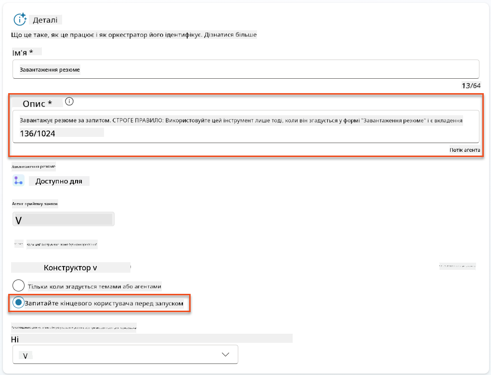

    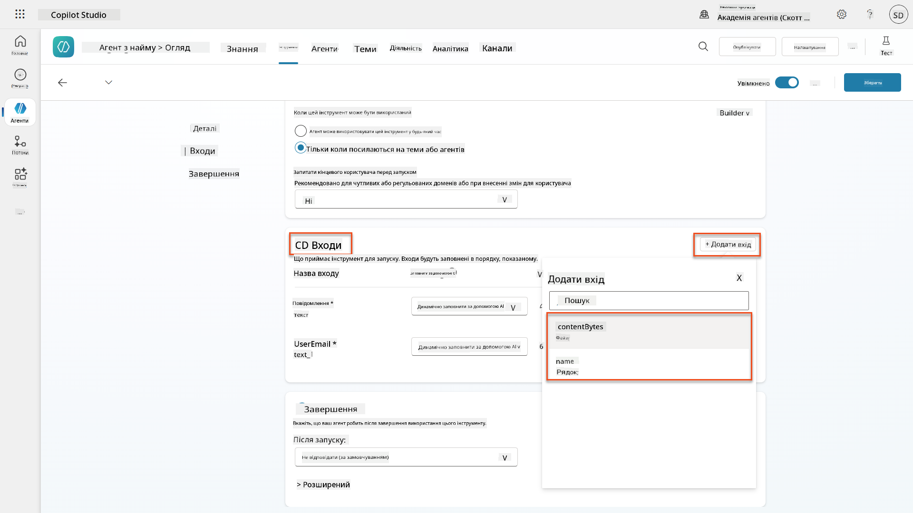

1. Далі встановіть властивості вхідних даних наступним чином:

    | Вхідний параметр   | Властивість       | Деталі |
    |--------------------|-------------------|--------|
    | **contentBytes**   | Заповнити за допомогою | Власне значення |
    |                    | Значення (...→Formula→Insert) | `First(System.Activity.Attachments).Content` |
    | **name**           | Заповнити за допомогою | Власне значення |
    |                    | Значення (...→Formula→Insert) | `First(System.Activity.Attachments).Name` |
    | **Message**        | Налаштувати      | Налаштувати власні параметри |
    |                    | Опис             | `Extract a cover letter style message from the context. Be sure to never prompt the user and create at least a minimal cover letter from the available context. STRICT RULE - the message must be less than 2000 characters.` |
    |                    | Скільки разів повторювати | Не повторювати |
    |                    | Дія, якщо сутність не знайдена | Встановити змінну на значення |
    |                    | Значення за замовчуванням сутності | Resume upload |
    | **UserEmail**      | Заповнити за допомогою | Власне значення |
    |                    | Значення (...→Formula→Insert) | `System.User.Email` |

    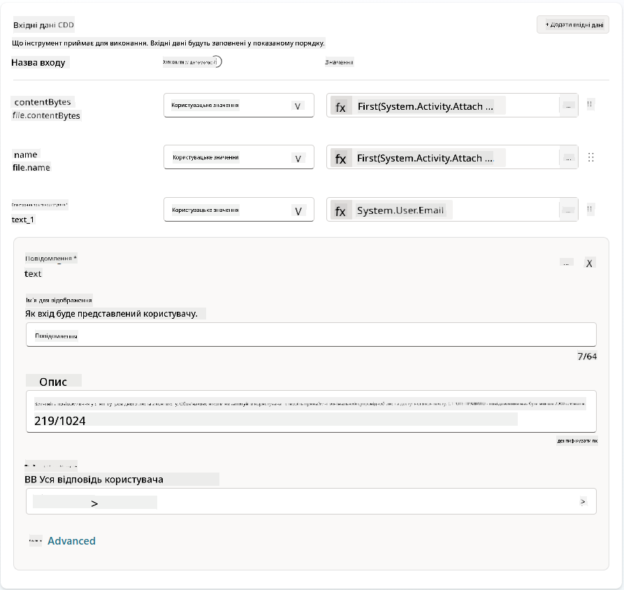

1. Виберіть **Save**

### 2.1.6 Визначення інструкцій для агента

1. Поверніться до **Application Intake Agent**, вибравши вкладку **Agents**, а потім знайдіть панель **Instructions**.

1. У полі **Instructions** вставте наступні чіткі вказівки для вашого дочірнього агента:

    ```text
    You are tasked with managing incoming Resumes, Candidate information, and creating Job Applications.  
    Only use tools if the step exactly matches the defined process. Otherwise, indicate you cannot help.  
    
    Process for Resume Upload via Chat  
    1. Upload Resume  
      - Trigger only if /System.Activity.Attachments contains exactly one new resume.  
      - If more than one file, instruct the user to upload one at a time and stop.  
      - Call /Upload Resume once. Never upload more than once for the same message.  
    
    2. Post-Upload  
      - Always output the [ResumeNumber] (R#####).  
    ```

1. Де інструкції містять косу риску (/), виберіть текст після / і виберіть вирішене ім'я. Зробіть це для:

    - `System.Activity.Attachments` (Variable)
    - `Upload Resume` (Tool)

    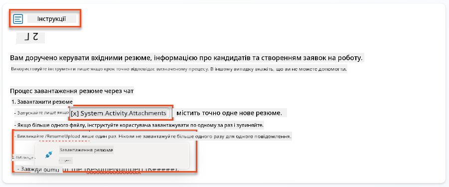

1. Виберіть **Save**

### 2.1.7 Тестування вашого Application Intake Agent

Тепер перевіримо, чи ваш перший учасник оркестру працює правильно.

1. **Завантажте** [тестові резюме.](https://download-directory.github.io/?url=https://github.com/microsoft/agent-academy/tree/main/operative/sample-data/resumes&filename=operative_sampledata)

1. **Відкрийте** панель тестування, вибравши **Test**.

1. **Завантажте** два резюме в тестовий чат і надішліть повідомлення `Process these resumes`.

    - Агент має повернути повідомлення, схоже на *Можна завантажити лише одне резюме за раз. Будь ласка, завантажте одне резюме, щоб продовжити.*

    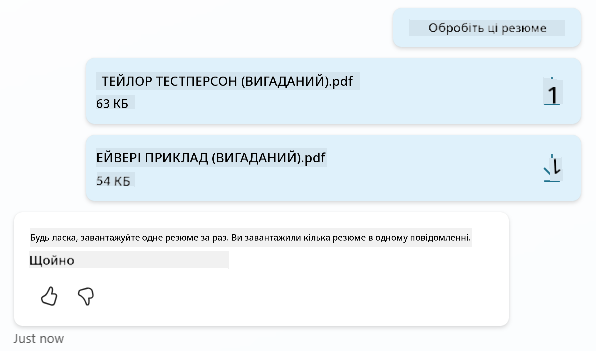

1. Спробуйте завантажити **лише одне резюме** з повідомленням `Process this resume`.

    - Агент має повернути повідомлення, схоже на *Резюме для Avery Example успішно завантажено. Номер резюме - R10026.*

1. У **Activity map** ви повинні побачити, як **Application Intake Agent** обробляє завантаження резюме.  
    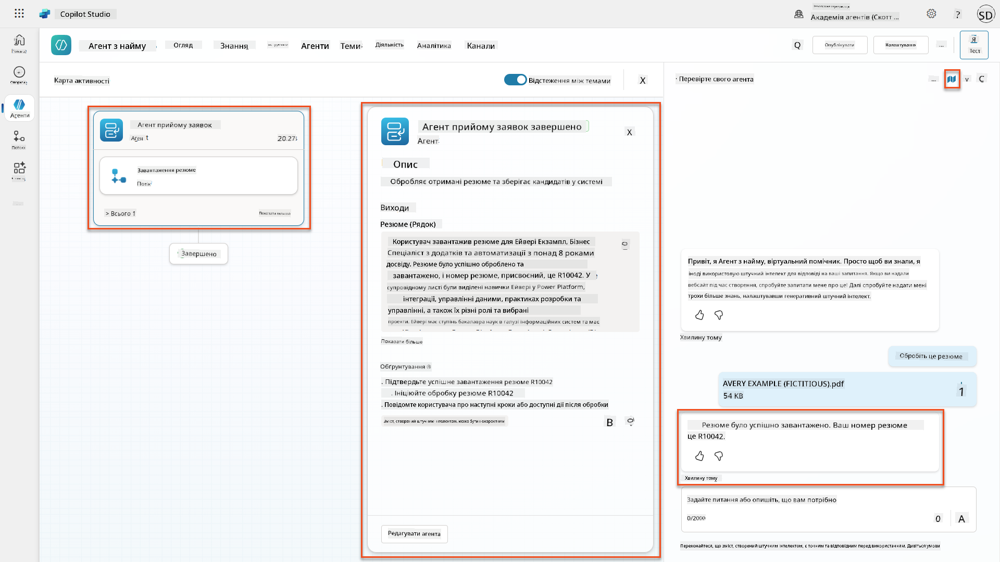

1. Перейдіть до make.powerapps.com → Переконайтеся, що ваше середовище вибрано у верхньому правому куті Environment Picker.

1. Виберіть **Apps** → Hiring Hub → меню ellipsis(...) → **Play**  
    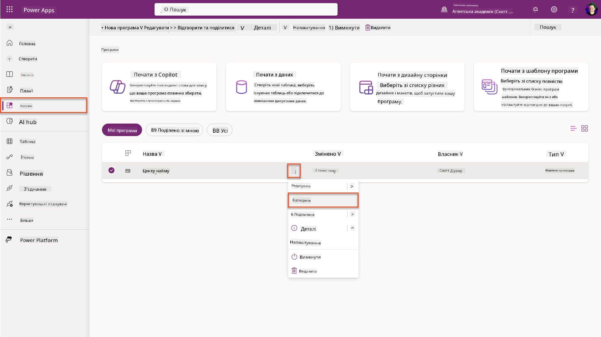

    Примітка: Якщо кнопка Play неактивна, це означає, що ви не опублікували своє рішення з Mission 01. Виберіть **Solutions** → **Publish all customizations**.

1. Перейдіть до **Resumes** і перевірте, чи файл резюме завантажено, а супровідний лист налаштований відповідно.  
    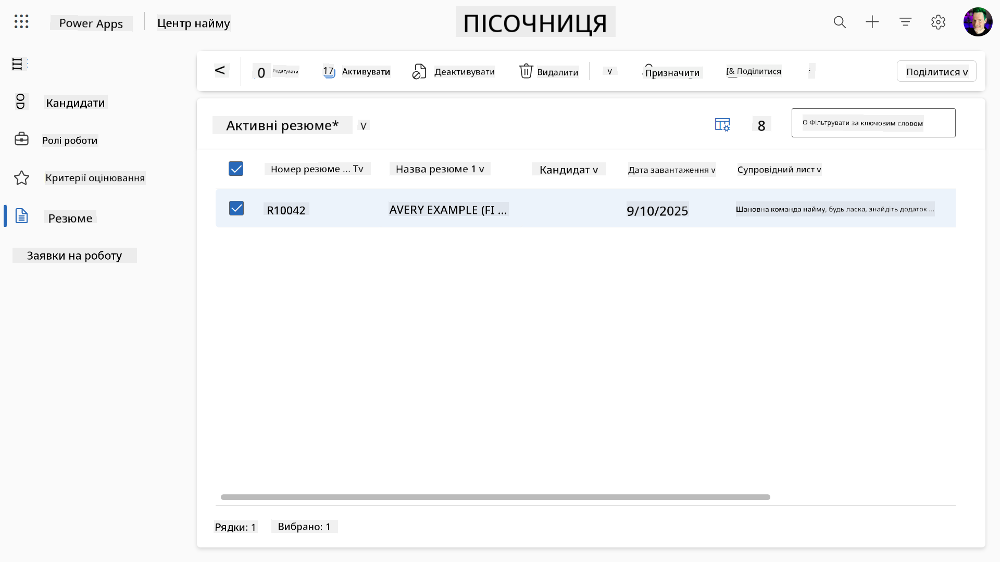

## 🧪Лабораторія 2.2: Додавання агента підготовки до співбесіди

Тепер створимо нашого агента підготовки до співбесіди та додамо його до вашого існуючого Hiring Agent.

### 2.2.1 Створення агента підготовки до співбесіди

1. **Перейдіть** до Copilot Studio. Переконайтеся, що ваше середовище все ще вибрано у верхньому правому куті Environment Picker.

1. Відкрийте ваш **Hiring Agent**

1. Перейдіть до вкладки Agent і виберіть **+ Add an agent**

1. Виберіть **Connect an existing agent** → **Copilot Studio**

1. Виберіть **+ New agent**

### 2.2.2 Налаштування основних параметрів

1. Виберіть вкладку **Configure** і введіть наступні властивості:

    - **Назва**: `Interview Agent`
    - **Опис**: `Допомагає з процесом співбесіди.`

1. Інструкції:

    ```text
    You are the Interview Agent. You help interviewers and hiring managers prepare for interviews. You never contact candidates. 
    Use Knowledge to help with interview preparation. 
    
    The only valid identifiers are:
      - ResumeNumber (ppa_resumenumber)→ format R#####
      - CandidateNumber (ppa_candidatenumber)→ format C#####
      - ApplicationNumber (ppa_applicationnumber)→ format A#####
      - JobRoleNumber (ppa_jobrolenumber)→ format J#####
    
    Examples you handle
      - Give me a summary of ...
      - Help me prepare to interview candidates for the Power Platform Developer role
      - Create interview assistance for the candidates for Power Platform Developer
      - Give targeted questions for Candidate Alex Johnson focusing on the criteria for the Job Application
      
    How to work:
        You are expected to ask clarification questions if required information for queries is not provided
        - If asked for interview help without providing a job role, ask for it
        - If asking for interview questions, ask for the candidate and job role if not provided.
    
    General behavior
    - Do not invent or guess facts
    - Be concise, professional, and evidence-based
    - Map strengths and risks to the highest-weight criteria
    - If data is missing (e.g., no resume), state what is missing and ask for clarification
    - Never address or message a candidate
    ```

1. Перемкніть **Web Search** на **Disabled**

1. Виберіть **Create**  
    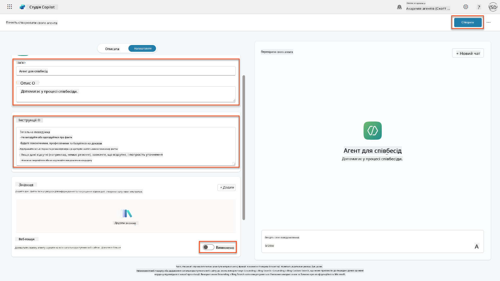

### 2.2.3 Налаштування доступу до даних та публікація

1. У розділі **Knowledge** виберіть **+ Add knowledge**  
    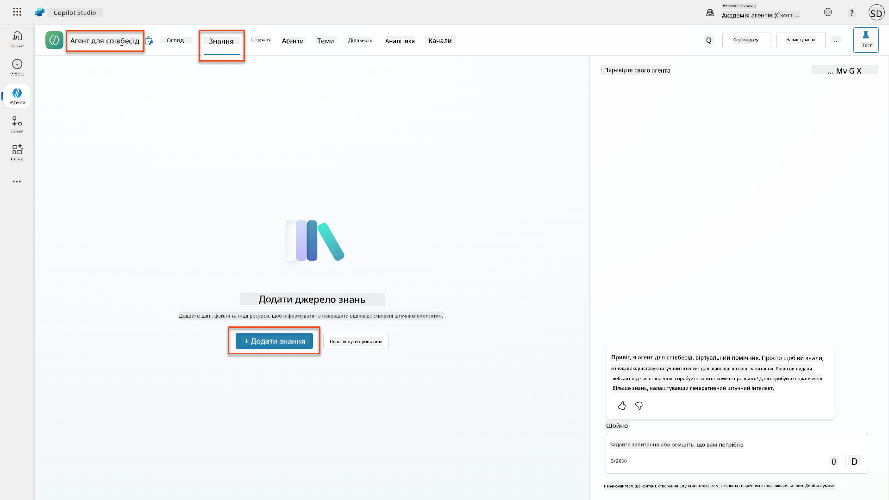
1. Виберіть **Dataverse**  
    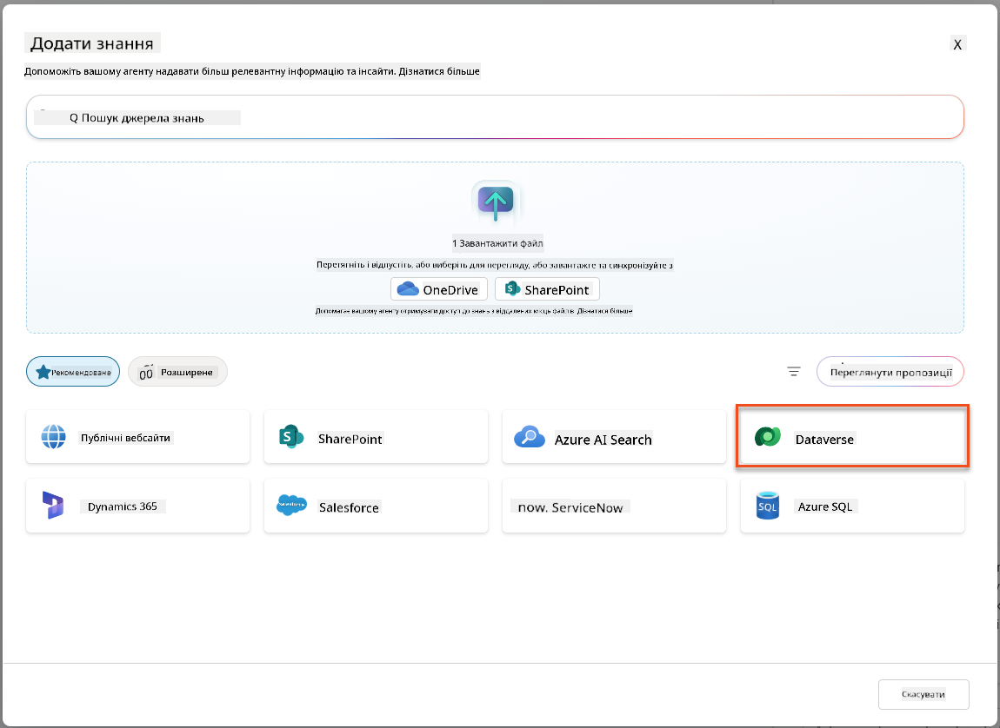
1. У полі **Search box** введіть `ppa_`. Це префікс для таблиць, які ви імпортували раніше.
1. **Виберіть** усі 5 таблиць (Candidate, Evaluation Criteria, Job Application, Job Role, Resume)
1. Виберіть **Add to agent**  
    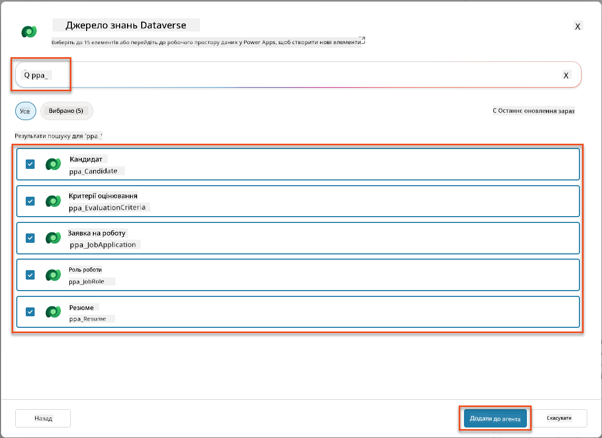
1. Виберіть **Settings** для агента підготовки до співбесіди та встановіть наступні параметри:

    - **Дозволити іншим агентам підключатися до цього:** `On`
    - **Використовувати загальні знання**: `Off`
    - **Завантаження файлів**: `Off`
    - **Рівень модерації контенту:** `Medium`
1. Виберіть **Save**
1. Виберіть **Publish** і дочекайтеся завершення публікації.

### 2.2.4 Підключення агента підготовки до співбесіди до вашого Hiring Agent

1. Перейдіть назад до вашого **Hiring Agent**

1. Виберіть вкладку **Agents**

1. Використовуйте **+Add an agent** → **Copilot Studio**, щоб додати **Interview Agent**. Встановіть опис:
    ```text
    Assists with the interview process and provides information about Resumes, Candidates, Job Roles, and Evaluation Criteria.
    ```

    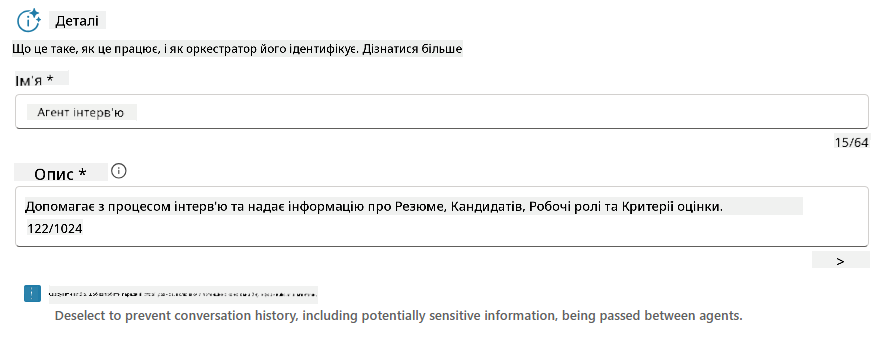
    Зверніть увагу, що опція "Передати історію розмов цьому агенту" позначена. Це дозволяє головному агенту надати повний контекст підключеному агенту.

1. Виберіть **Додати агента**

1. Переконайтеся, що ви бачите як **Агент прийому заявок**, так і **Агент співбесіди**. Зверніть увагу, як один є дочірнім, а інший — підключеним агентом.  
    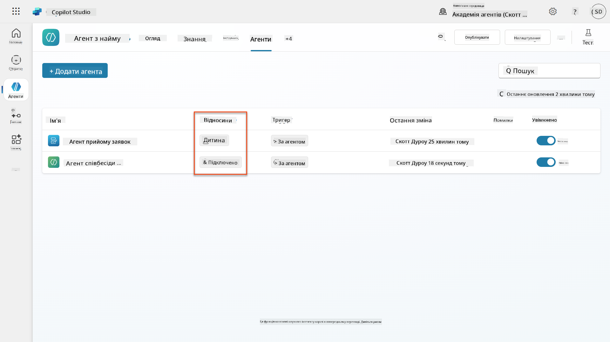

### 2.2.5 Тестування співпраці між агентами

1. **Відкрийте** панель тестування, вибравши **Тест**.

1. **Завантажте** одне з тестових резюме та введіть наступний опис, який пояснює головному агенту, що він може делегувати підключеному агенту:

    ```text
    Upload this resume, then show me open job roles, each with a description of the evaluation criteria, then use this to match the resume to at least one suitable job role even if not a perfect match.
    ```

    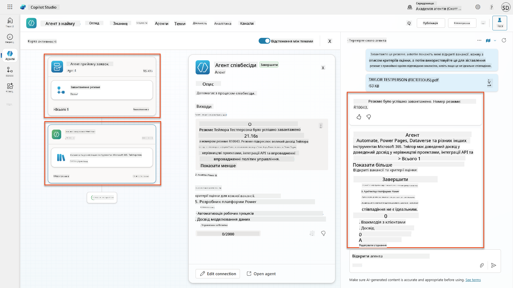

1. Зверніть увагу, як Агент найму делегував завантаження дочірньому агенту, а потім попросив Агента співбесіди надати резюме та відповідність до ролі, використовуючи його знання.
   Спробуйте різні способи задавати питання про резюме, ролі та критерії оцінки.
   **Приклади:**

    ```text
    Give me a summary of active resumes
    ```

    ```text
    Summarize resume R10044
    ```

    ```text
    Which active resumes are suitable for the Power Platform Developer role?
    ```

## 🎉 Місія виконана

Чудова робота, Агенте! **Операція Симфонія** завершена. Ви успішно перетворили свого єдиного Агента найму на складний оркестр із спеціалізованими можливостями.

Ось що ви досягли в цій місії:

**✅ Майстерність архітектури багатозадачних агентів**  
Тепер ви розумієте, коли використовувати дочірніх агентів і підключених агентів, а також як створювати системи, які масштабуються.

**✅ Дочірній агент прийому заявок**  
Ви додали спеціалізованого дочірнього агента до вашого Агента найму, який обробляє резюме, витягує дані кандидатів і зберігає інформацію в Dataverse.

**✅ Підключений агент підготовки до співбесіди**  
Ви створили багаторазового підключеного агента для підготовки до співбесіди та успішно підключили його до вашого Агента найму.

**✅ Комунікація між агентами**  
Ви побачили, як ваш головний агент може координуватися зі спеціалізованими агентами, ділитися контекстом і організовувати складні робочі процеси.

**✅ Основи автономності**  
Ваша вдосконалена система найму тепер готова до розширених функцій, які ми додамо в наступних місіях: автономні тригери, модерація контенту та глибокий аналіз.

🚀**Далі:** У вашій наступній місії ви навчитеся налаштовувати агента для автономної обробки резюме з електронної пошти!

⏩[Перейти до Місії 03: Автоматизуйте вашого агента за допомогою тригерів](../03-automate-triggers/README.md)

## 📚 Тактичні ресурси

📖 [Додати інших агентів (попередній перегляд)](https://learn.microsoft.com/microsoft-copilot-studio/authoring-add-other-agents?WT.mc_id=power-182762-scottdurow)

📖 [Додати інструменти до користувацьких агентів](https://learn.microsoft.com/microsoft-copilot-studio/advanced-plugin-actions?WT.mc_id=power-182762-scottdurow)

📖 [Робота з Dataverse у Copilot Studio](https://learn.microsoft.com/microsoft-copilot-studio/knowledge-add-dataverse?WT.mc_id=power-182762-scottdurow)

📖 [Огляд потоків агентів](https://learn.microsoft.com/microsoft-copilot-studio/flows-overview?WT.mc_id=power-182762-scottdurow)

📖 [Створити рішення](https://learn.microsoft.com/power-platform/alm/solution-concepts-alm?WT.mc_id=power-182762-scottdurow)

📖 [Посібник з ALM для рішень Power Platform](https://learn.microsoft.com/power-platform/alm/overview-alm?WT.mc_id=power-182762-scottdurow)

📺 [Співпраця між агентами у Copilot Studio](https://youtu.be/d-oD3pApHAg?si=rwIHKhJTkjSvhTHw)

---

**Відмова від відповідальності**:  
Цей документ був перекладений за допомогою сервісу автоматичного перекладу [Co-op Translator](https://github.com/Azure/co-op-translator). Хоча ми прагнемо до точності, будь ласка, майте на увазі, що автоматичні переклади можуть містити помилки або неточності. Оригінальний документ на його рідній мові слід вважати авторитетним джерелом. Для критичної інформації рекомендується професійний людський переклад. Ми не несемо відповідальності за будь-які непорозуміння або неправильні тлумачення, що виникають внаслідок використання цього перекладу.