<!--
CO_OP_TRANSLATOR_METADATA:
{
  "original_hash": "616d142d4fb5f45d2a168fad6c1f9545",
  "translation_date": "2025-10-21T17:56:24+00:00",
  "source_file": "docs/operative-preview/07-multimodal-prompts/README.md",
  "language_code": "uk"
}
-->
# 🚨 Місія 07: Витягування змісту резюме за допомогою мультимодальних підказок

--8<-- "disclaimer.md"

## 🕵️‍♂️ КОДОВА НАЗВА: `АНАЛІЗ РЕЗЮМЕ ДОКУМЕНТІВ`

> **⏱️ Час виконання операції:** `~45 хвилин`

## 🎯 Короткий опис місії

Вітаємо, Оперативник. Ваші попередні місії навчили вас потужним навичкам оркестрації агентів, але тепер настав час розкрити революційну можливість: **аналіз мультимодальних документів**.

Ваше завдання, якщо ви вирішите його прийняти, — це **Аналіз резюме документів** — точне витягування структурованих даних з будь-якого документа. Хоча ваші агенти легко обробляють текст, реальний світ вимагає щоденної роботи з PDF, зображеннями та складними документами. Резюме накопичуються, рахунки потребують обробки, а форми — миттєвої оцифровки.

Ця місія перетворить вас із творця агентів, що працюють лише з текстом, на **експерта мультимодального аналізу**. Ви навчитеся налаштовувати AI, який читає та розуміє документи, як людський аналітик, але з швидкістю та точністю AI. До кінця місії ви створите повну систему витягування резюме, яка інтегрується у ваш процес найму.

Техніки, які ви тут освоїте, будуть необхідні для проведення складних операцій з обробки даних у вашій наступній місії.

## 🔎 Цілі

У цій місії ви навчитеся:

1. Що таке мультимодальні підказки і коли використовувати різні моделі AI
1. Як налаштувати підказки з використанням зображень і документів
1. Як форматувати результати підказок у форматі JSON для витягування структурованих даних
1. Найкращі практики створення підказок для аналізу документів
1. Як інтегрувати мультимодальні підказки з Agent Flows

## 🧠 Розуміння мультимодальних підказок

### Що робить підказку "мультимодальною"?

Традиційні підказки працюють лише з текстом. Але мультимодальні підказки можуть обробляти кілька типів контенту:

- **Текст**: Письмові інструкції та контент
- **Зображення**: Фото, скріншоти, графіки та діаграми (.PNG, .JPG, .JPEG)  
- **Документи**: Рахунки, резюме, форми (.PDF)

Ця можливість відкриває потужні сценарії, такі як аналіз резюме, обробка рахунків або витягування даних з форм.

### Чому мультимодальність важлива для ваших робочих процесів

Щодня ваша організація стикається з такими викликами обробки документів:

- **Скринінг резюме**: Ручне читання сотень резюме займає багато часу
- **Обробка рахунків**: Витягування даних про постачальників, сум, дат із різних форматів документів
- **Аналіз форм**: Перетворення паперових форм у цифрові дані

Мультимодальні підказки усувають ці вузькі місця, поєднуючи мовне розуміння AI з можливостями візуального аналізу. Це дає вашому AI здатність обробляти документи так само ефективно, як і текст.

### Типові бізнес-сценарії

Ось кілька прикладів застосування мультимодальних підказок:

| Сценарій                | Завдання                                                                                                                                      | Приклад вихідних полів                                                                                   |
|-------------------------|-------------------------------------------------------------------------------------------------------------------------------------------|---------------------------------------------------------------------------------------------------------|
| **Скринінг резюме**    | Витягування імені кандидата, електронної пошти, телефону, поточної посади, років досвіду та ключових навичок.                                                 | Ім'я кандидата, електронна адреса, номер телефону, поточна посада, роки досвіду, ключові навички         |
| **Обробка рахунків**  | Витягування інформації про постачальника, дату рахунку, загальної суми та позицій рахунку.                                                 | Ім'я постачальника, дата рахунку, загальна сума, позиції рахунку                                             |
| **Аналіз форм**       | Аналіз цієї форми заявки та витягування всіх заповнених полів.                                                                              | Назва поля (наприклад, Ім'я заявника), Введене значення (наприклад, Джон Доу), ...                                  |
| **Перевірка документів ID** | Витягування імені, номера ID, дати закінчення терміну дії та адреси з цього документа ідентифікації. Перевірка, чи весь текст чітко читається, і позначення будь-яких нечітких розділів. | Повне ім'я, Номер ідентифікації, Дата закінчення терміну дії, Адреса, Позначення нечітких розділів                        |

## ⚙️ Вибір моделі в AI Builder

AI Builder пропонує різні моделі, оптимізовані для конкретних завдань. Розуміння, яку модель використовувати, є ключовим для успіху.

!!! note "Актуально станом на вересень 2025 року"
    Моделі AI Builder регулярно оновлюються, тому перевіряйте останню [документацію налаштувань моделей AI Builder](https://learn.microsoft.com/ai-builder/prompt-modelsettings) для актуальної інформації про доступність моделей.

### Порівняння моделей

Усі наведені нижче моделі підтримують обробку зображень і документів

| Модель | 💰Вартість | ⚡Швидкість | ✅Найкраще для |
|-------|------|-------|----------|
| **GPT-4.1 mini** | Базова (найекономніша) | Швидка | Стандартна обробка документів, узагальнення, проекти з обмеженим бюджетом |
| **GPT-4.1** | Стандартна | Помірна | Складні документи, створення контенту високого рівня, потреби у високій точності |
| **o3** | Преміум | Повільна (спочатку аналіз) | Аналіз даних, критичне мислення, складне вирішення проблем |
| **GPT-5 chat** | Стандартна | Покращена | Найновіше розуміння документів, найвища точність відповідей |
| **GPT-5 reasoning** | Преміум | Повільна (складний аналіз) | Найскладніший аналіз, планування, розширене мислення |

### Пояснення налаштувань температури

Температура контролює, наскільки творчими або передбачуваними будуть відповіді AI:

- **Температура 0**: Найбільш передбачувані, послідовні результати (найкраще для витягування даних)
- **Температура 0.5**: Баланс між творчістю та послідовністю  
- **Температура 1**: Максимальна творчість (найкраще для створення контенту)

Для аналізу документів використовуйте **температуру 0**, щоб забезпечити послідовне витягування даних.

## 📊 Формати вихідних даних: Текст vs JSON

Вибір правильного формату вихідних даних є критичним для подальшої обробки.

### Коли використовувати текстовий вихід

Текстовий вихід добре працює для:

- Зрозумілих для людини резюме
- Простих класифікацій
- Контенту, який не потребує структурованої обробки

### Коли використовувати вихід JSON

Вихід JSON є необхідним для:

- Витягування структурованих даних
- Інтеграції з базами даних або системами
- Обробки потоків Power Automate
- Послідовного відображення полів

### Найкращі практики JSON

1. **Визначте чіткі назви полів**: Використовуйте описові, послідовні назви
1. **Надайте приклади**: Включіть зразки вихідних даних і значень для кожного поля
1. **Вкажіть типи даних**: Включіть приклади для дат, чисел і тексту
1. **Обробляйте відсутні дані**: Плануйте для null або порожніх значень
1. **Перевіряйте структуру**: Тестуйте з різними типами документів

### Розгляди якості документів

- **Роздільна здатність**: Переконайтеся, що зображення чіткі та читабельні
- **Орієнтація**: Поверніть документи до правильної орієнтації перед обробкою
- **Підтримка формату**: Тестуйте з вашими конкретними типами документів (PDF, JPG, PNG)
- **Обмеження розміру**: Звертайте увагу на обмеження розміру файлів у вашому середовищі

### Оптимізація продуктивності

- **Вибирайте відповідні моделі**: Оновлюйте моделі лише за необхідності
- **Оптимізуйте підказки**: Часто коротші, чіткіші інструкції працюють краще
- **Обробка помилок**: Плануйте для документів, які не можуть бути оброблені
- **Контролюйте витрати**: Різні моделі споживають різну кількість кредитів AI Builder

## 🧪 Лабораторія 7: Створення системи витягування резюме

Час застосувати ваші знання про мультимодальність на практиці. Ви створите комплексну систему витягування резюме, яка аналізує документи кандидатів і перетворює їх у структуровані дані для вашого процесу найму.

### Передумови для завершення місії

1. Вам потрібно **або**:

    - **Завершити Місію 06** і мати готову систему найму з кількома агентами, **АБО**
    - **Імпортувати стартове рішення Місії 07**, якщо ви починаєте з нуля або потребуєте наздогнати. [Завантажити стартове рішення Місії 07](https://aka.ms/agent-academy)

1. Зразки документів резюме з [Тестових резюме](https://download-directory.github.io/?url=https://github.com/microsoft/agent-academy/tree/main/operative/sample-data/resumes&filename=operative_sampledata)

!!! note "Імпорт рішення та зразкові дані"
    Якщо ви використовуєте стартове рішення, зверніться до [Місії 01](../01-get-started/README.md) для детальних інструкцій щодо імпорту рішень і зразкових даних у ваше середовище.

### 7.1 Створення мультимодальної підказки

Ваш перший об'єкт: створити підказку, здатну аналізувати документи резюме та витягувати структуровані дані.

1. Увійдіть до [Copilot Studio](https://copilotstudio.microsoft.com) і виберіть **Інструменти** у лівій навігації.

1. Виберіть **+ Новий інструмент**, потім виберіть **Підказка**.  
    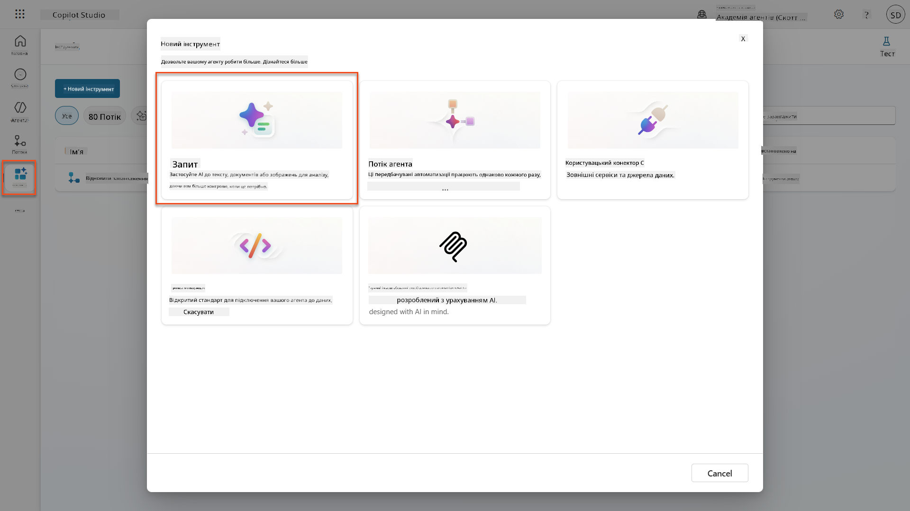

1. **Перейменуйте** підказку з назви за замовчуванням (наприклад, *Custom prompt 09/04/2025, 04:59:11 PM*) на `Summarize Resume`.

1. У полі Інструкції додайте цю підказку:

    ```text
    You are tasked with extracting key candidate information from a resume and cover letter to facilitate matching with open job roles and creating a summary for application review.
    
    Instructions:
    1. Extract Candidate Details:
        - Identify and extract the candidate’s full name.
        - Extract contact information, specifically the email address.
    2. Create Candidate Summary:
        - Summarize the candidate’s profile as multiline text (max 2000 characters) with the following sections:
            - Candidate name
            - Role(s) applied for if present
            - Contact and location
            - One-paragraph summary
            - Experience snapshot (last 2–3 roles with outcomes)
            - Key projects (1–3 with metrics)
            - Education and certifications
            - Top skills (Top 10)
            - Availability and work authorization
    
    Guidelines:
    - Extract information only from the provided resume and cover letter documents.
    - Ensure accuracy in identifying all details such as contact details and skills.
    - The summary should be concise but informative, suitable for quick application review.
    
    Resume: /document
    CoverLetter: /text
    ```

    !!! tip "Використовуйте допомогу Copilot"
        Ви можете використовувати "Почати з Copilot", щоб створити вашу підказку за допомогою природної мови. Спробуйте попросити Copilot створити підказку для узагальнення резюме!

1. **Налаштуйте** параметри введення:

    | Параметр | Тип | Назва | Зразкові дані |
    |-----------|------|------|-------------|
    | Резюме | Зображення або документ | Резюме | Завантажте зразок резюме з папки тестових даних |
    | Супровідний лист | Текст | Супровідний лист | Ось резюме! |

1. Виберіть **Тест**, щоб побачити початковий текстовий вихід вашої підказки.  
    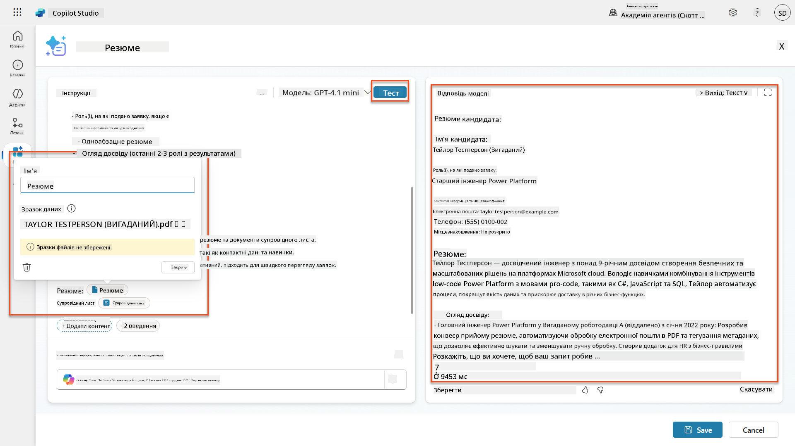

### 7.2 Налаштування виходу JSON

Тепер ви перетворите підказку на вихід структурованих даних JSON замість простого тексту.

1. Додайте цю специфікацію формату JSON до кінця інструкцій вашої підказки:

    ```text
    Output Format:
    Provide the output in valid JSON format with the following structure:
    
    {
        "CandidateName": "string",
        "Email": "string",
        "Summary": "string max 2000 characters",
        "Skills": [ {"item": "Skill 1"}, {"item": "Skill 2"}],
        "Experience": [ {"item": "Experience 1"}, {"item": "Experience 2"}],
    }
    ```

1. Змініть налаштування **Вихід** з "Текст" на **JSON**.

1. Виберіть **Тест** ще раз, щоб переконатися, що вихід тепер форматований як JSON.  
    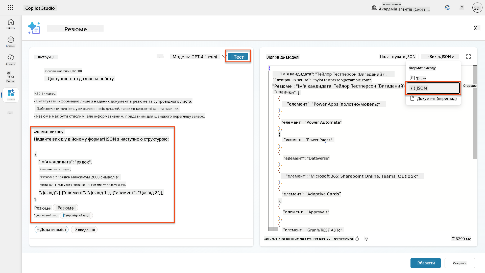

1. **Опціонально:** Експериментуйте з різними моделями AI, щоб побачити, як змінюються виходи, потім поверніться до моделі за замовчуванням.

1. Виберіть **Зберегти**, щоб створити підказку.

1. У діалоговому вікні **Налаштування для використання в агенті** виберіть **Скасувати**.

    !!! info "Чому ми не додаємо це як інструмент зараз"
        Ви будете використовувати цю підказку в Agent Flow, а не безпосередньо як інструмент, що дає вам більше контролю над робочим процесом обробки даних.

### 7.3 Додавання підказки до Agent Flow

Ви створите Agent Flow, який використовує вашу підказку для обробки резюме, збережених у Dataverse.

!!! tip "Вирази Agent Flow"
    Дуже важливо, щоб ви точно дотримувалися інструкцій щодо називання вузлів і введення виразів, оскільки вирази посилаються на попередні вузли за їх назвою! Зверніться до [місії Agent Flow у Recruit](../../recruit/09-add-an-agent-flow/README.md#you-mentioned-expressions-what-are-expressions) для швидкого повторення!

1. Перейдіть до вашого **Агента найму** всередині Copilot Studio

1. Виберіть вкладку **Агенти**, і виберіть дочірнього **Агента прийому заявок**

1. Всередині панелі **Інструменти** виберіть **+ Додати** → **+ Новий інструмент** → **Agent flow**

1. Виберіть вузол "Коли агент викликає потік", використовуйте **+ Додати введення**, щоб додати наступний параметр:

    | Тип | Назва | Опис |
    |------|------|-------------|
    | Текст | Номер резюме | Переконайтеся, що використовуєте [Номер резюме]. Це завжди має починатися з літери R |

1. Виберіть **+** значок вставки дії під першим вузлом, знайдіть **Dataverse**, виберіть **Дивитися більше**, а потім знайдіть дію **Список рядків**

1. Виберіть **три крапки (...)** на вузлі Список рядків, і виберіть **Перейменувати** на `Отримати запис резюме`, а потім встановіть наступні параметри:

    | Властивість | Як встановити | Значення |
    |----------|------------|-------|
    | **Назва таблиці** | Вибрати | Резюме |
    | **Фільтрувати рядки** | Динамічні дані (значок блискавки) | `ppa_resumenumber eq 'Номер резюме'` Замініть **Номер резюме** на **Коли агент викликає потік** → **Номер резюме** |
    | **Кількість рядків** | Ввести | 1 |

    !!! tip "Оптимізуйте ці запити!"
        Використовуючи цю техніку в продакшені, завжди обмежуйте вибір колонок лише тими, які потрібні для Agent Flow.

    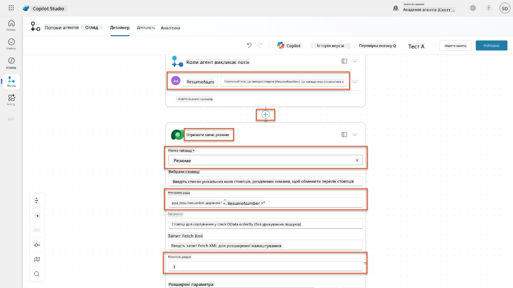

1. Виберіть **+** значок вставки дії під
| **Запит** | Вибрати | Резюмувати резюме |
| **Супровідний лист** | Вираз (іконка fx) | `first(body('Get_Resume_Record')?['value'])?['ppa_coverletter']` |
| **Резюме** | Динамічні дані (іконка блискавки) | Завантажити резюме → Вміст файлу або зображення |

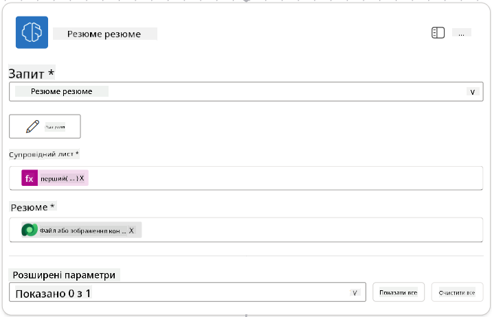

!!! tip "Параметри запиту"
    Зверніть увагу, що параметри, які ви заповнюєте, є тими самими, які ви налаштували як вхідні параметри під час створення запиту.

### 7.4 Створення запису кандидата

Далі потрібно взяти інформацію, яку надав запит, і створити новий запис кандидата, якщо він ще не існує.

1. Виберіть **+** Іконку додавання дії під вузлом "Резюмувати резюме", знайдіть **Dataverse**, виберіть **Дивитися більше**, а потім знайдіть дію **Список рядків**.

1. Перейменуйте вузол як `Get Existing Candidate`, а потім встановіть наступні параметри:

    | Властивість | Як налаштувати | Значення |
    |-------------|----------------|----------|
    | **Назва таблиці** | Вибрати | Candidates |
    | **Фільтрувати рядки** | Динамічні дані (іконка блискавки) | `ppa_email eq 'Email'`  **Замінити** `Email` на **Summarize Resume → Email** |
    | **Кількість рядків** | Ввести | 1 |

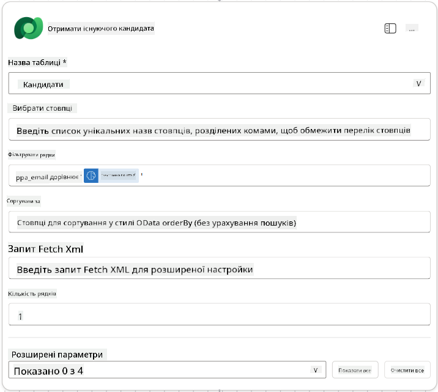

1. Виберіть **+** Іконку додавання дії під вузлом "Отримати існуючого кандидата", знайдіть **Control**, виберіть **Дивитися більше**, а потім знайдіть дію **Condition**.

1. У властивостях умови встановіть наступну умову:

    | Умова | Оператор | Значення |
    |-------|----------|----------|
    | Вираз (іконка fx): `length(outputs('Get_Existing_Candidate')?['body/value'])` | дорівнює | 0 |

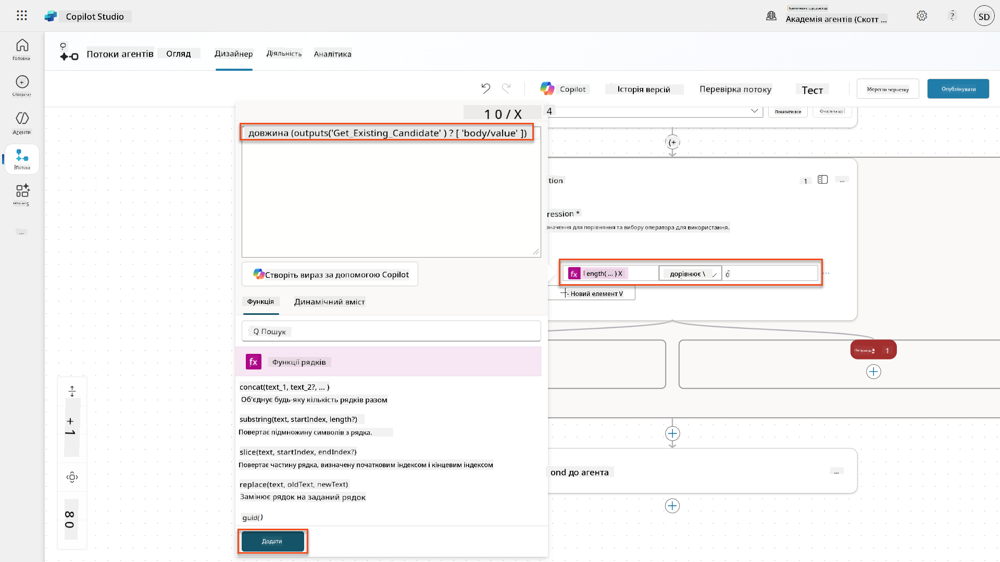

1. Виберіть **+** Іконку додавання дії в гілці **True**, знайдіть **Dataverse**, виберіть **Дивитися більше**, а потім знайдіть дію **Add a new row**.

1. Перейменуйте вузол як `Add a New Candidate`, а потім встановіть наступні параметри:

    | Властивість | Як налаштувати | Значення |
    |-------------|----------------|----------|
    | **Назва таблиці** | Вибрати | Candidates |
    | **Ім'я кандидата** | Динамічні дані (іконка блискавки) | Summarize Resume → `CandidateName` |
    | **Електронна пошта** | Динамічні дані (іконка блискавки) | Summarize Resume → `Email` |

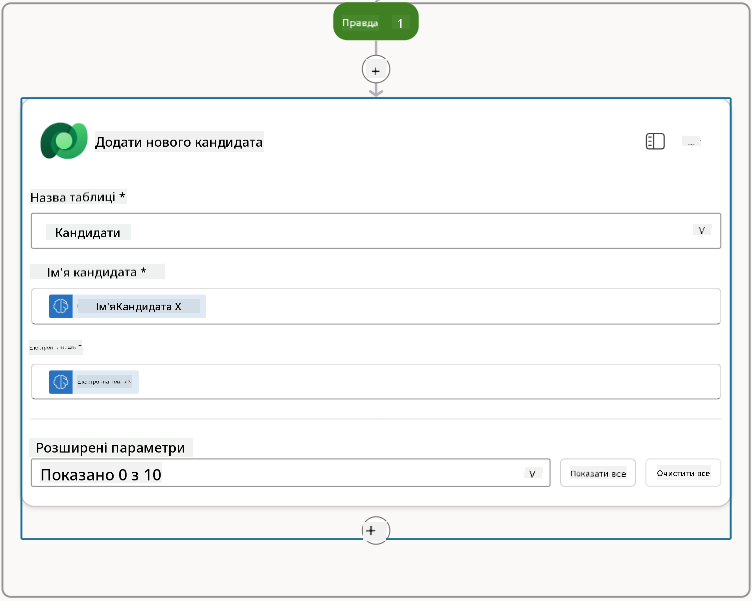

### 7.5 Оновлення резюме та налаштування вихідних даних потоку

Завершіть потік, оновивши запис резюме та налаштувавши, які дані повернути агенту.

1. Виберіть **+** Іконку додавання дії під умовою, знайдіть **Dataverse**, виберіть **Дивитися більше**, а потім знайдіть дію **Update a row**.

1. Виберіть заголовок, щоб перейменувати вузол як `Update Resume`, виберіть **Показати все**, а потім встановіть наступні параметри:

    | Властивість | Як налаштувати | Значення |
    |-------------|----------------|----------|
    | **Назва таблиці** | Вибрати | Resumes |
    | **ID рядка** | Вираз (іконка fx) | `first(body('Get_Resume_Record')?['value'])?['ppa_resumeid']` |
    | **Резюме** | Динамічні дані (іконка блискавки) | Summarize Resume → Text |
    | **Кандидат (Candidates)** | Вираз (іконка fx) | `if(equals(length(outputs('Get_Existing_Candidate')?['body/value']), 1), first(outputs('Get_Existing_Candidate')?['body/value'])?['ppa_candidateid'], outputs('Add_a_New_Candidate')?['body/ppa_candidateid'])` |

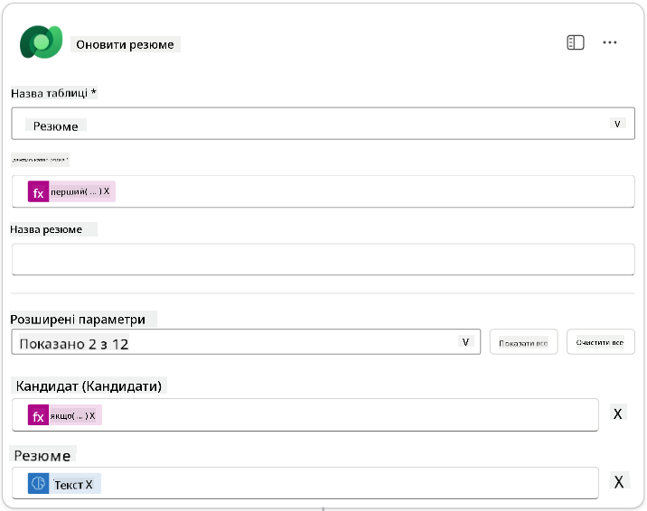

1. Виберіть вузол **Respond to the agent** і використовуйте **+ Add an output**, щоб налаштувати:

    | Тип | Назва              | Як налаштувати                  | Значення                                                    | Опис                                              |
    |-----|--------------------|---------------------------------|------------------------------------------------------------|--------------------------------------------------|
    | Текст | `CandidateName`   | Динамічні дані (іконка блискавки) | Summarize Resume → Дивитися більше → CandidateName          | [CandidateName], зазначене в резюме              |
    | Текст | `CandidateEmail`  | Динамічні дані (іконка блискавки) | Summarize Resume → Дивитися більше → Email                  | [CandidateEmail], зазначене в резюме             |
    | Текст | `CandidateNumber` | Вираз (іконка fx)              | `concat('ppa_candidates/', if(equals(length(outputs('Get_Existing_Candidate')?['body/value']), 1), first(outputs('Get_Existing_Candidate')?['body/value'])?['ppa_candidateid'], outputs('Add_a_New_Candidate')?['body/ppa_candidateid']) )` | [CandidateNumber] нового або існуючого кандидата |
    | Текст | `ResumeSummary`   | Динамічні дані (іконка блискавки) | Summarize Resume → Дивитися більше → body/responsev2/predictionOutput/structuredOutput | Резюме та деталі у форматі JSON                  |

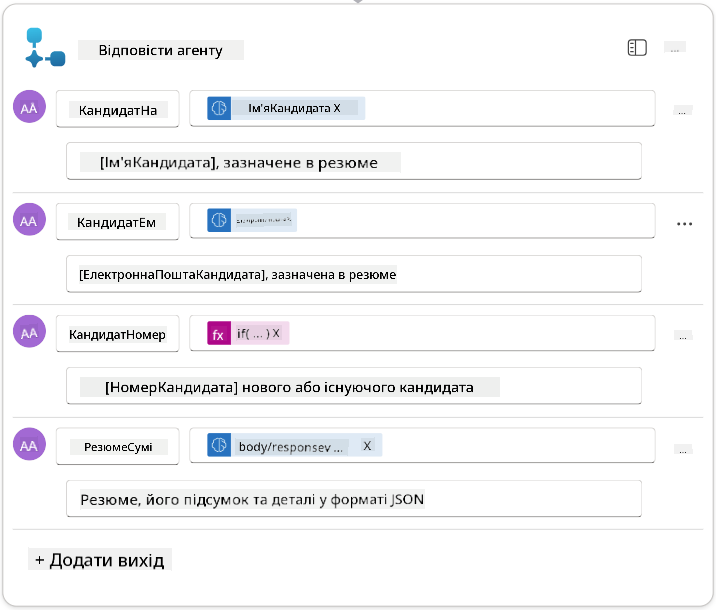

1. Виберіть **Зберегти чернетку** у верхньому правому куті. Ваш потік агента має виглядати наступним чином  


1. Виберіть вкладку **Огляд**, виберіть **Редагувати** у панелі **Деталі**

    1. **Назва потоку**:`Summarize Resume`
    1. **Опис**:

        ```text
        Summarize an existing Resume stored in Dataverse using a [ResumeNumber] as input, return the [CandidateNumber], and resume summary JSON
        ```

1. Виберіть **Зберегти**

1. Знову виберіть вкладку **Дизайнер** і виберіть **Опублікувати**.

### 7.6 Підключення потоку до вашого агента

Тепер ви додасте потік як інструмент і налаштуєте вашого агента для його використання.

1. Відкрийте ваш **Hiring Agent** у Copilot Studio

1. Виберіть вкладку **Агенти** і відкрийте **Application Intake Agent**

1. Виберіть панель **Інструменти** і виберіть **+ Додати інструмент** - > **Flow** -> **Summarize Resume** **(Agent Flow)**

1. Виберіть **Додати та налаштувати**

1. Налаштуйте параметри інструменту наступним чином:

    | Налаштування | Значення |
    |--------------|----------|
    | **Опис** | Резюмувати існуюче резюме, збережене в Dataverse, використовуючи [ResumeNumber] як вхідні дані, повернути [CandidateNumber] і резюме у форматі JSON |
    | **Коли цей інструмент може бути використаний** | Тільки коли посилається на теми або агентів |

1. Виберіть **Зберегти**  
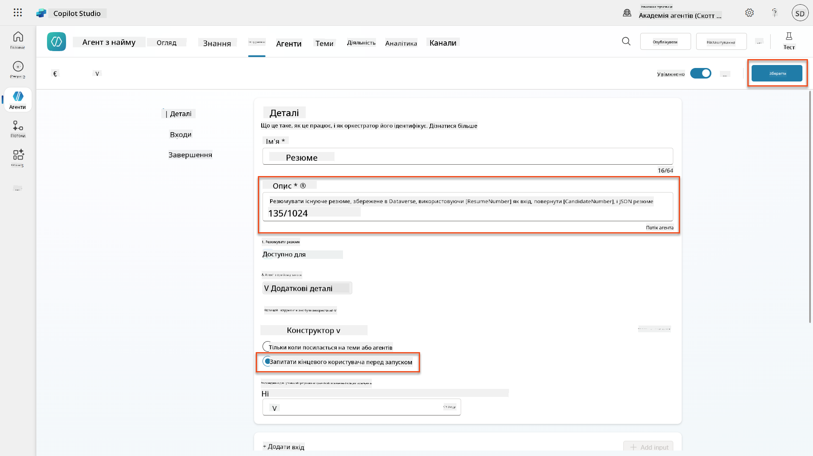

1. Якщо ви виберете Інструменти всередині Hiring Agent, тепер ви побачите обидва наші інструменти, які доступні для **Application Intake Agent**.  
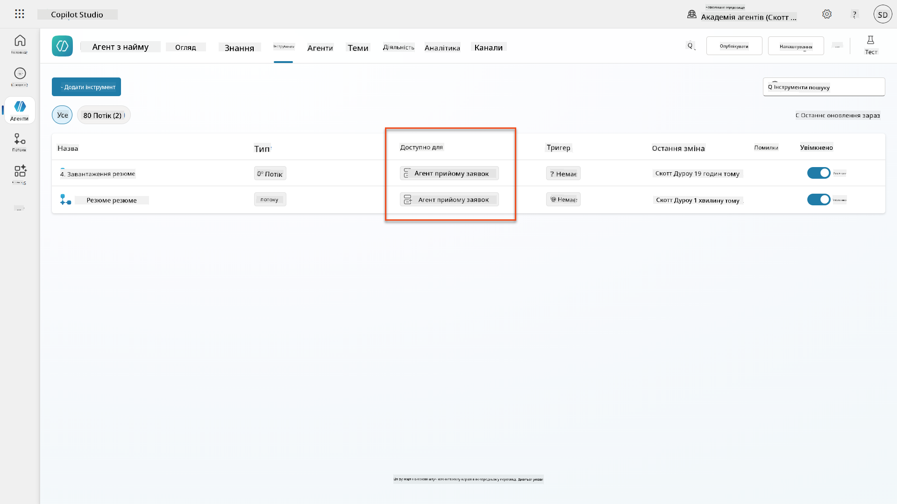

1. Перейдіть до інструкцій агента **Application Intake Child** і змініть крок **Post-Upload** на наступний:

    ```text
    2. Post-Upload Processing  
        - After uploading, be sure to also output the [ResumeNumber] in all messages
        - Pass [ResumeNumber] to /Summarize Resume  - Be sure to use the correct value that will start with the letter R.
        - Be sure to also output the [CandidateNumber] in all messages
        - Use the [ResumeSummary] to output a summary of the processed Resume and candidate
    ```

    Замініть `/Summarize Resume`, вставивши посилання на **Summarize Resume agent flow**, ввівши косу риску (`/)` або вибравши `/Summarize`, щоб вставити посилання.  
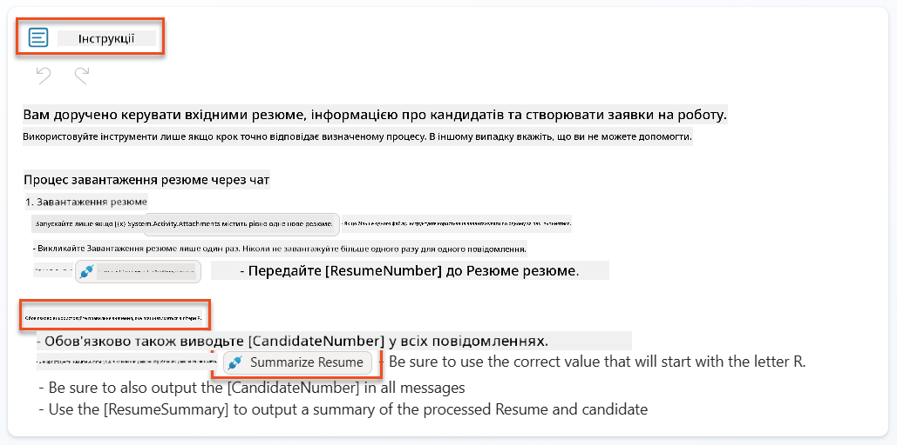

1. Виберіть **Зберегти**.

### 7.7 Тестування вашого агента

Протестуйте вашу повну мультимодальну систему, щоб переконатися, що все працює правильно.

1. **Почати тестування**:

    - Виберіть **Тест**, щоб відкрити панель тестування
    - Введіть: `Here is a candidate Resume`

    - Завантажте одне з зразкових резюме з [Test Resumes](https://download-directory.github.io/?url=https://github.com/microsoft/agent-academy/tree/main/operative/sample-data/resumes&filename=operative_sampledata)

1. **Перевірте результати**:
    - Після того, як ви надішлете повідомлення та резюме, перевірте, чи отримали ви номер резюме (формат: R#####)
    - Перевірте, чи отримали ви номер кандидата та резюме
    - Використовуйте карту активності, щоб побачити, як працюють інструмент завантаження резюме та інструмент резюмування резюме, і як агент отримує вихідні дані запиту:  
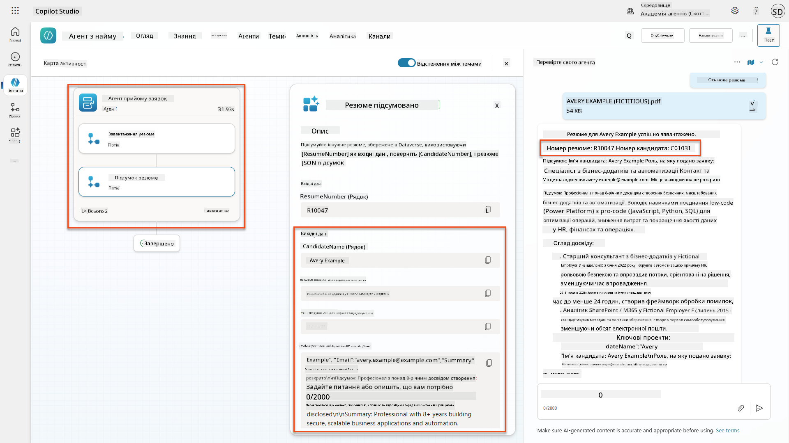

1. **Перевірка збереження даних**:
    - Перейдіть до [Power Apps](https://make.powerapps.com)
    - Відкрийте **Apps** → **Hiring Hub** → **Play**
    - Перейдіть до **Resumes**, щоб перевірити, чи резюме було завантажено та оброблено. Воно повинно містити інформацію про резюме та пов'язаний запис кандидата.
    - Перевірте **Candidates**, щоб побачити витягнуту інформацію про кандидата  
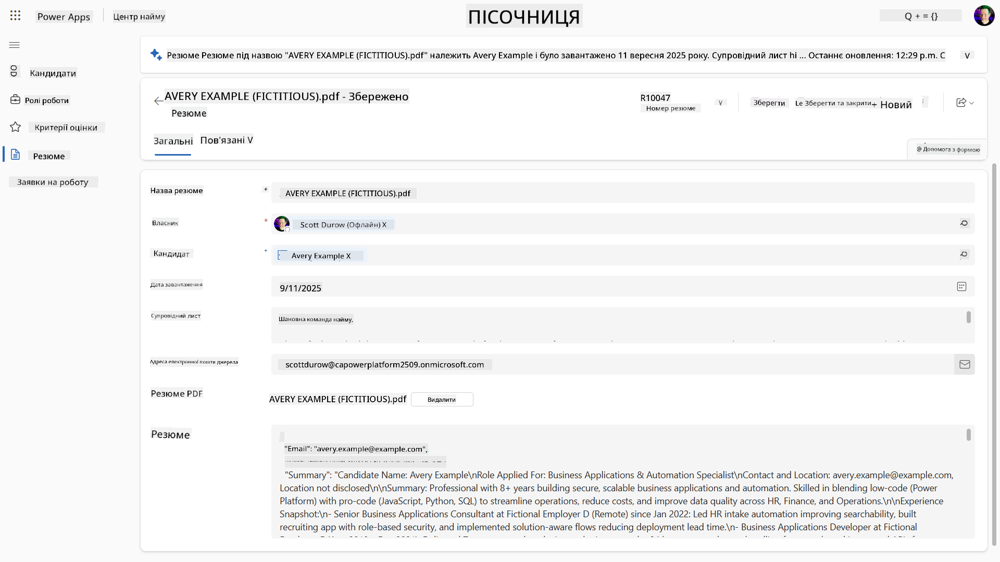
    - Коли ви запустите процес знову, він повинен використовувати існуючого кандидата (збіг за електронною поштою, витягнутою з резюме), замість створення нового.

!!! tip "Усунення несправностей"
    - **Резюме не обробляється**: Переконайтеся, що файл є PDF і відповідає обмеженням за розміром
    - **Кандидат не створений**: Перевірте, чи електронна пошта була правильно витягнута з резюме
    - **Помилки формату JSON**: Переконайтеся, що ваші інструкції запиту включають точну структуру JSON
    - **Помилки потоку**: Перевірте, чи всі з'єднання Dataverse та вирази налаштовані правильно

### Готовність до виробництва

Хоча це не є частиною цієї місії, щоб зробити цей потік агента готовим до виробництва, ви можете також розглянути наступне:

1. **Обробка помилок** - Якщо номер резюме не знайдено або запит не зміг розібрати документ, слід додати обробку помилок, щоб повернути агенту чітку помилку.
1. **Оновлення існуючих кандидатів** - Кандидат знаходиться за електронною поштою, тоді ім'я може бути оновлено відповідно до резюме.
1. **Розділення резюмування резюме та створення кандидата** - Цю функціональність можна розділити на менші потоки агента, щоб їх було легше підтримувати, а потім дати агенту інструкції використовувати їх по черзі.

## 🎉 Місія завершена

Чудова робота, Оперативе! **Document Resume Recon** завершено. Ви успішно освоїли мультимодальні запити і тепер можете витягувати структуровані дані з будь-якого документа з точністю.

Ось що ви досягли в цій місії:

**✅ Майстерність мультимодальних запитів**  
Ви тепер розумієте, що таке мультимодальні запити і коли використовувати різні AI моделі для оптимальних результатів.

**✅ Експертиза обробки документів**  
Ви навчилися налаштовувати запити з використанням текстових, графічних та документальних даних, а також форматувати вихідні дані як JSON для витягування структурованих даних.

**✅ Система витягування резюме**  
Ви створили повну систему витягування резюме, яка обробляє документи кандидатів та інтегрується з вашим процесом найму.

**✅ Впровадження найкращих практик**  
Ви застосували найкращі практики для інженерії запитів з аналізу документів та інтегрували мультимодальні запити з потоками агента.

**✅ Основи для розширеної обробки**  
Ваші вдосконалені можливості аналізу документів тепер готові до розширених функцій прив'язки даних, які ми додамо в наступних місіях.

🚀 **Далі:** У Місії 08 ви дізнаєтеся, як покращити ваші запити за допомогою реальних даних з Dataverse, створюючи динамічні AI рішення, які адаптуються до змін бізнес-вимог.

⏩ [Перейти до Місії 08: Покращені запити з прив'язкою до Dataverse](../08-dataverse-grounding/README.md)

## 📚 Тактичні ресурси

📖 [Створення запиту](https://learn.microsoft.com/ai-builder/create-a-custom-prompt?WT.mc_id=power-power-182762-scottdurow)

📖 [Додавання тексту, зображення або документа до запиту](https://learn.microsoft.com/ai-builder/add-inputs-prompt?WT.mc_id=power-182762-scottdurow)

📖 [Обробка відповідей з виходом у форматі JSON](https://learn.microsoft.com/ai-builder/process-responses-json-output?WT.mc_id=power-182762-scottdurow)

📖 [Вибір моделі та налаштування температури](https://learn.microsoft.com/ai-builder/prompt-modelsettings?WT.mc_id=power-182762-scottdurow)

📖 [Використання запиту в Power Automate](https://learn.microsoft.com/ai-builder/use-a-custom-prompt-in-flow?WT.mc_id=power-182762-scottdurow)

📺 [AI Builder: JSON outputs in prompt builder](https://www.youtube.com/watch?v=F0fGnWrRY_I)

---

**Відмова від відповідальності**:  
Цей документ був перекладений за допомогою сервісу автоматичного перекладу [Co-op Translator](https://github.com/Azure/co-op-translator). Хоча ми прагнемо до точності, будь ласка, майте на увазі, що автоматичні переклади можуть містити помилки або неточності. Оригінальний документ на його рідній мові слід вважати авторитетним джерелом. Для критичної інформації рекомендується професійний людський переклад. Ми не несемо відповідальності за будь-які непорозуміння або неправильні тлумачення, що виникають внаслідок використання цього перекладу.