<!--
CO_OP_TRANSLATOR_METADATA:
{
  "original_hash": "750f3ea8a94930439ebd8a10871b1d73",
  "translation_date": "2025-10-21T17:45:04+00:00",
  "source_file": "docs/operative-preview/08-dataverse-grounding/README.md",
  "language_code": "uk"
}
-->
# 🚨 Місія 08: Покращені запити з прив'язкою до Dataverse

--8<-- "disclaimer.md"

## 🕵️‍♂️ КОДОВА НАЗВА: `ОПЕРАЦІЯ КОНТРОЛЬ ПРИВ'ЯЗКИ`

> **⏱️ Час виконання операції:** `~60 хвилин`

## 🎯 Короткий опис місії

Вітаємо з поверненням, Оперативник. Ваша система найму з багатьма агентами працює, але необхідне критичне покращення для **прив'язки даних** - вашим AI-моделям потрібен доступ до структурованих даних вашої організації в реальному часі для прийняття розумних рішень.

На даний момент ваш запит "Резюме: Підсумок" працює зі статичними даними. Але що, якщо він міг би динамічно отримувати доступ до бази даних вакансій, щоб надавати точні, актуальні відповідності? Що, якщо він розумів ваші критерії оцінки без необхідності їх жорсткого кодування?

У цій місії ви покращите свій власний запит за допомогою **прив'язки до Dataverse** - підключення ваших запитів безпосередньо до джерел даних у реальному часі. Це перетворює ваших агентів зі статичних відповідників на динамічні системи, керовані даними, які адаптуються до змін бізнес-потреб.

Ваше завдання: інтегрувати дані про вакансії та критерії оцінки в реальному часі у ваш робочий процес аналізу резюме, створюючи систему, яка автоматично оновлюється відповідно до вимог вашої організації.

## 🔎 Цілі

У цій місії ви навчитеся:

1. Як **прив'язка до Dataverse** покращує власні запити
1. Коли використовувати прив'язку даних замість статичних інструкцій
1. Проектувати запити, які динамічно включають дані в реальному часі
1. Покращувати процес "Резюме: Підсумок" за допомогою відповідності вакансій

## 🧠 Розуміння прив'язки до Dataverse для запитів

**Прив'язка до Dataverse** дозволяє вашим власним запитам отримувати доступ до даних у реальному часі з таблиць Dataverse під час обробки запитів. Замість статичних інструкцій ваші запити можуть включати актуальну інформацію для прийняття обґрунтованих рішень.

### Чому прив'язка до Dataverse важлива

Традиційні запити працюють зі статичними інструкціями:

```text
Match this candidate to these job roles: Developer, Manager, Analyst
```

З прив'язкою до Dataverse ваш запит отримує актуальні дані:

```text
Match this candidate to available job roles from the Job Roles table, 
considering current evaluation criteria and requirements
```

Цей підхід забезпечує кілька ключових переваг:

- **Динамічні оновлення:** Вакансії та критерії змінюються без модифікації запиту
- **Послідовність:** Усі агенти використовують ті самі актуальні джерела даних
- **Масштабованість:** Нові вакансії та критерії автоматично доступні
- **Точність:** Дані в реальному часі забезпечують рішення, які відповідають актуальним потребам

### Як працює прив'язка до Dataverse

Коли ви активуєте прив'язку до Dataverse для власного запиту:

1. **Вибір даних:** Виберіть конкретні таблиці та стовпці Dataverse для включення. Ви також можете вибрати пов'язані таблиці, які система буде фільтрувати на основі отриманих записів.
1. **Ін'єкція контексту:** Запит автоматично включає отримані дані в контекст запиту
1. **Інтелектуальне фільтрування:** Система включає лише дані, які стосуються поточного запиту, якщо ви надаєте будь-яке фільтрування.
1. **Структурований вихід:** Ваш запит може посилатися на отримані дані та аналізувати записи для створення виходу.

### Від статичного до динамічного: перевага прив'язки

Давайте розглянемо ваш поточний процес "Резюме: Підсумок" з Місії 07 і побачимо, як прив'язка до Dataverse перетворює його зі статичного на динамічний інтелект.

**Поточний статичний підхід:**
Ваш існуючий запит включав жорстко закодовані критерії оцінки та заздалегідь визначену логіку відповідності. Цей підхід працює, але потребує ручних оновлень щоразу, коли ви додаєте нові вакансії, змінюєте критерії оцінки або змінюєте пріоритети компанії.

**Трансформація з прив'язкою до Dataverse:**
Додавши прив'язку до Dataverse, ваш процес "Резюме: Підсумок" буде:

- **Отримувати актуальні вакансії** з таблиці вакансій
- **Використовувати критерії оцінки в реальному часі** замість статичних описів  
- **Надавати точні відповідності** на основі актуальних вимог

## 🎯 Чому спеціалізовані запити проти розмов агентів

У Місії 02 ви побачили, як агент співбесіди міг зіставляти кандидатів з вакансіями, але це вимагало складних запитів від користувача, таких як:

```text
Upload this resume, then show me open job roles,
each with a description of the evaluation criteria, 
then use this to match the resume to at least one suitable
job role even if not a perfect match.
```

Хоча це працювало, спеціалізовані запити з прив'язкою до Dataverse пропонують значні переваги для конкретних завдань:

### Основні переваги спеціалізованих запитів

| Аспект | Розмови агентів | Спеціалізовані запити |
|--------|-------------------|------------------|
| **Послідовність** | Результати варіюються залежно від навичок користувача у створенні запитів | Стандартизована обробка кожного разу |
| **Спеціалізація** | Загальне логічне мислення може пропустити бізнес-нюанси | Цілеспрямоване з оптимізованою бізнес-логікою |
| **Автоматизація** | Потребує людської взаємодії та інтерпретації | Запускається автоматично зі структурованим JSON-виходом |

## 🧪 Лабораторія 8: Додайте прив'язку до Dataverse у запити

Час покращити ваші можливості аналізу резюме! Ви покращите існуючий процес "Резюме: Підсумок" за допомогою динамічного зіставлення вакансій.

### Передумови для виконання місії

1. Вам потрібно **або**:

    - **Завершити Місію 07** і мати готову систему аналізу резюме, **АБО**
    - **Імпортувати початкове рішення Місії 08**, якщо ви починаєте з нуля або вам потрібно наздогнати. [Завантажити початкове рішення Місії 08](https://aka.ms/agent-academy)

1. Зразки документів резюме з [тестових резюме](https://download-directory.github.io/?url=https://github.com/microsoft/agent-academy/tree/main/operative/sample-data/resumes&filename=operative_sampledata)

!!! note "Імпорт рішення та зразків даних"
    Якщо ви використовуєте початкове рішення, зверніться до [Місії 01](../01-get-started/README.md) для детальних інструкцій щодо імпорту рішень та зразків даних у ваше середовище.

### 8.1 Додайте прив'язку до Dataverse у ваш запит

Ви будете працювати над запитом "Резюме: Підсумок", який ви створили в Місії 07. На даний момент він просто підсумовує резюме, але тепер ви прив'яжете його до вакансій, які наразі існують у Dataverse, зберігаючи його завжди актуальним.

Спочатку давайте розглянемо таблиці Dataverse, до яких ви будете прив'язуватися:

1. **Перейдіть** до [Power Apps](https://make.powerapps.com) і виберіть ваше середовище за допомогою **перемикача середовища** у верхньому правому куті панелі навігації.

1. Виберіть **Таблиці** і знайдіть таблицю **Вакансії**

1. Перегляньте ключові стовпці, які ви будете використовувати для прив'язки:

    | Стовпець | Призначення |
    |--------|---------|
    | **Номер вакансії** | Унікальний ідентифікатор для зіставлення вакансій |
    | **Назва вакансії** | Назва для відображення вакансії |
    | **Опис** | Детальні вимоги до вакансії |

1. Аналогічно, перегляньте інші таблиці, такі як таблиця **Критерії оцінки**.

### 8.2 Додайте дані прив'язки Dataverse до вашого запиту

1. **Перейдіть** до Copilot Studio і виберіть ваше середовище за допомогою **перемикача середовища** у верхньому правому куті панелі навігації.

1. Виберіть **Інструменти** з лівої панелі навігації.

1. Виберіть **Запит** і знайдіть ваш запит **Резюме: Підсумок** з Місії 07.  
    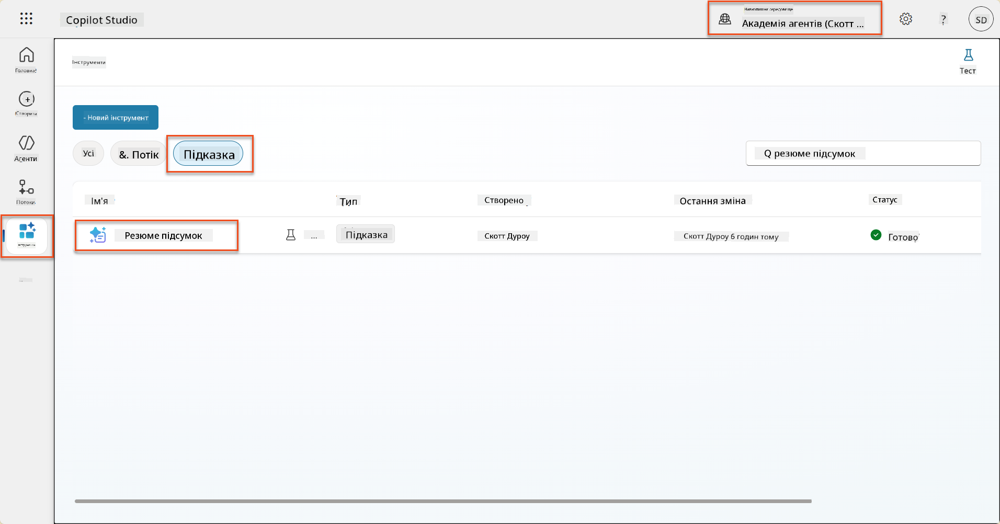

1. Виберіть **Редагувати**, щоб змінити запит, і замініть його на покращену версію нижче:

    !!! important
        Переконайтеся, що параметри "Резюме" та "Супровідний лист" залишаються незмінними як параметри.

    ```text
    You are tasked with extracting key candidate information from a resume and cover letter to facilitate matching with open job roles and creating a summary for application review.
    
    ### Instructions:
    1. **Extract Candidate Details:**
       - Identify and extract the candidate's full name.
       - Extract contact information, specifically the email address.
    
    2. **Analyze Resume and Cover Letter:**
       - Review the resume content to identify relevant skills, experience, and qualifications.
       - Review the cover letter to understand the candidate's motivation and suitability for the roles.
    
    3. **Match Against Open Job Roles:**
       - Compare the extracted candidate information with the requirements and descriptions of the provided open job roles.
       - Use the job descriptions to assess potential fit.
       - Identify all roles that align with the candidate's cover letter and profile. You don't need to assess perfect suitability.
       - Provide reasoning for each match based on the specific job requirements.
    
    4. **Create Candidate Summary:**
       - Summarize the candidate's profile as multiline text with the following sections:
          - Candidate name
          - Role(s) applied for if present
          - Contact and location
          - One-paragraph summary
          - Top skills (8–10)
          - Experience snapshot (last 2–3 roles with outcomes)
          - Key projects (1–3 with metrics)
          - Education and certifications
          - Availability and work authorization
    
    ### Output Format
    
    Provide the output in valid JSON format with the following structure:
    
    {
      "CandidateName": "string",
      "Email": "string",
      "MatchedRoles": [
        {
          "JobRoleNumber": "ppa_jobrolenumber from grounded data",
          "RoleName": "ppa_jobtitle from grounded data",
          "Reasoning": "Detailed explanation based on job requirements"
        }
      ],
      "Summary": "string"
    }
    
    ### Guidelines
    
    - Extract information only from the provided resume and cover letter documents.
    - Ensure accuracy in identifying contact details.
    - Use the available job role data for matching decisions.
    - The summary should be concise but informative, suitable for quick application review.
    - If no suitable matches are found, indicate an empty list for MatchedRoles and explain briefly in the summary.
    
    ### Input Data
    Open Job Roles (ppa_jobrolenumber, ppa_jobtitle): /Job Role 
    Resume: {Resume}
    Cover Letter: {CoverLetter}
    ```

1. У редакторі запитів замініть `/Вакансія`, вибравши **+ Додати вміст**, вибравши **Dataverse** → **Вакансія** і виберіть наступні стовпці, а потім натисніть **Додати**:

    1. **Номер вакансії**

    1. **Назва вакансії**

    1. **Опис**

    !!! tip
        Ви можете ввести назву таблиці для пошуку.

1. У діалоговому вікні **Вакансія** виберіть атрибут **Фільтр**, виберіть **Статус**, а потім введіть **Активний** як значення **Фільтр**.  
    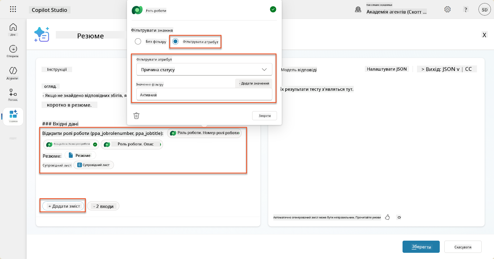

    !!! tip
        Ви можете використовувати **Додати значення** тут, щоб додати вхідний параметр - наприклад, якщо у вас був запит для підсумовування існуючого запису, ви могли б надати номер резюме як параметр для фільтрування.

1. Далі ви додасте пов'язану таблицю Dataverse **Критерії оцінки**, знову вибравши **+ Додати вміст**, знайшовши **Вакансії**, і замість вибору стовпців у Вакансії, розгорніть **Вакансія (Критерії оцінки)** і виберіть наступні стовпці, а потім натисніть **Додати**:

    1. **Назва критерію**

    1. **Опис**  
        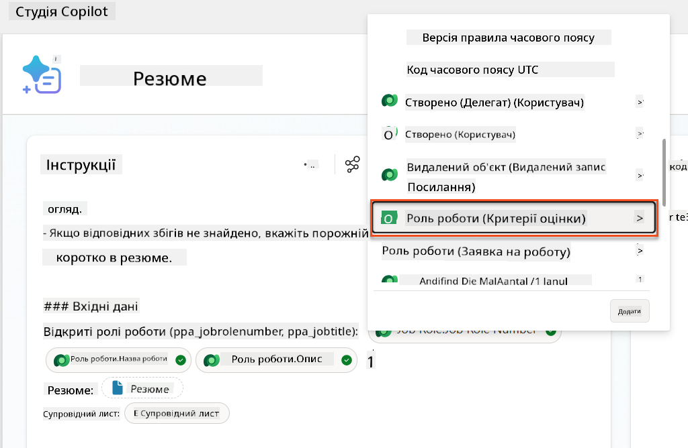

        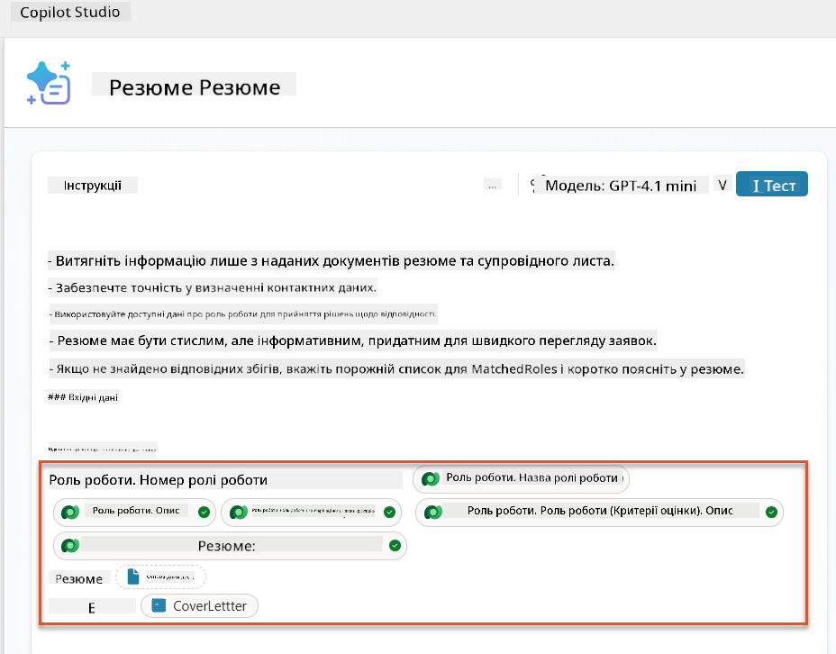

    !!! tip
        Важливо вибрати пов'язані критерії оцінки, спочатку вибравши Вакансію, а потім перейшовши в меню до Вакансія (Критерії оцінки). Це забезпечить завантаження лише пов'язаних записів для Вакансії.

1. Виберіть **Налаштування** і налаштуйте **Отримання записів** до 1000 - це дозволить включити максимальну кількість вакансій та критеріїв оцінки у ваш запит.  
    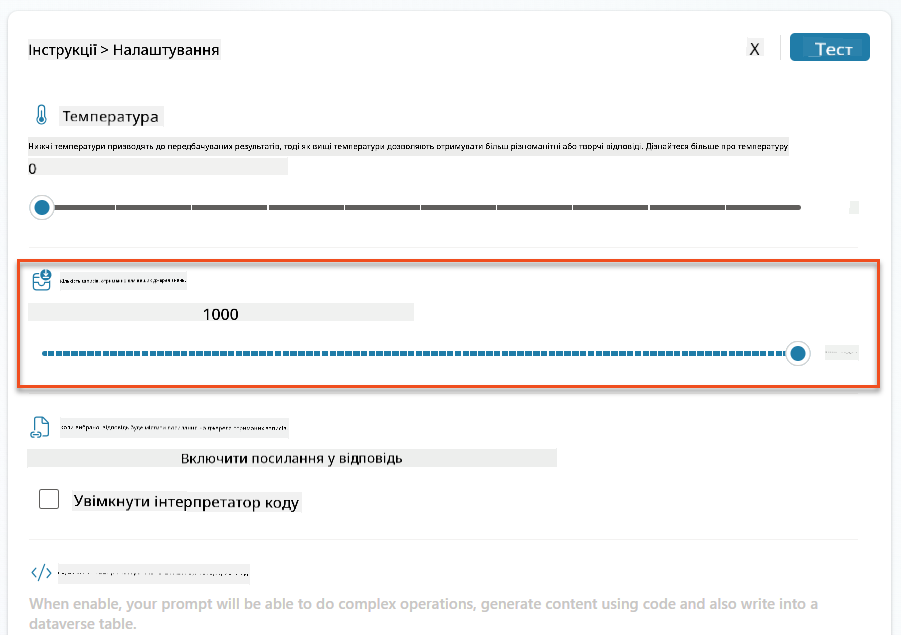

### 8.3 Перевірте покращений запит

1. Виберіть параметр **Резюме** і завантажте зразок резюме, який ви використовували в Місії 07.
1. Виберіть **Тест**.
1. Після завершення тесту зверніть увагу, що JSON-вихід тепер включає **Відповідні вакансії**.
1. Виберіть вкладку **Використані знання**, щоб побачити дані Dataverse, які об'єдналися з вашим запитом перед виконанням.
1. **Збережіть** ваш оновлений запит. Система тепер автоматично включатиме ці дані Dataverse у ваш запит, коли існуючий агентний потік "Резюме: Підсумок" викликатиме його.  
    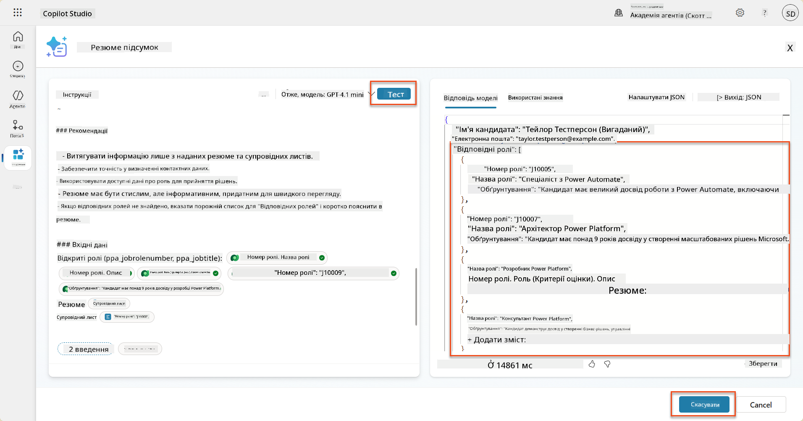

### 8.4 Додайте агентний потік для заявок на вакансії

Щоб дозволити нашому агенту прийому заявок створювати вакансії на основі запропонованих вакансій, нам потрібно створити агентний потік. Агент викликатиме цей інструмент для кожної з запропонованих вакансій, які цікавлять кандидата.

!!! tip "Вирази агентного потоку"
    Дуже важливо, щоб ви дотримувалися інструкцій щодо називання вузлів та введення виразів точно, оскільки вирази посилаються на попередні вузли, використовуючи їх назву! Зверніться до [Місії агентного потоку в Recruit](../../recruit/09-add-an-agent-flow/README.md#you-mentioned-expressions-what-are-expressions) для швидкого повторення!

1. У **Агенті найму** виберіть вкладку **Агенти** і відкрийте дочірнього агента **Агент прийому заявок**.

1. У панелі **Інструменти** виберіть **+ Додати** → **+ Новий інструмент** → **Агентний потік**

1. Виберіть вузол **Коли агент викликає потік**, використовуйте **+ Додати вхід** для додавання наступного параметра:

    | Тип | Назва            | Опис                                                  |
    | ---- | --------------- | ------------------------------------------------------------ |
    | Текст | `Номер резюме`  | Переконайтеся, що ви використовуєте лише [Номер резюме] - він МАЄ починатися з літери R |
    | Текст | `Номер вакансії` | Переконайтеся, що ви використовуєте лише [Номер вакансії] - він МАЄ починатися з літери J |

    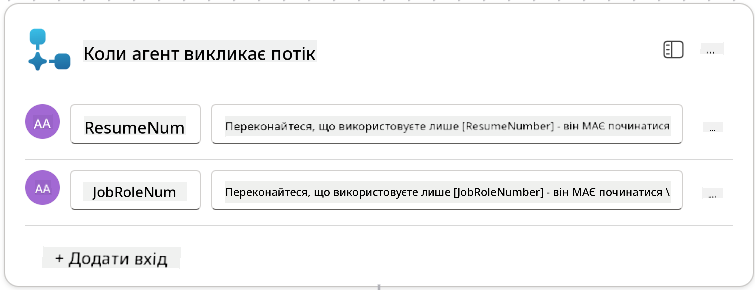

1. Виберіть **+** значок вставки дії під першим вузлом, знайдіть **Dataverse**, виберіть **Дивитися більше**, а потім знайдіть дію **Список рядків**.

1. **Перейменуйте** вузол як `Отримати резюме` і встановіть наступні параметри:

    | Властивість        | Як встановити                      | Значення                                                        |
    | --------------- | ------------------------------- | ------------------------------------------------------------ |
    | **Назва таблиці**  | Вибрати                          | Резюме                                                      |
    | **Фільтрувати рядки** | Динамічні дані (значок блискавки) | `ppa_resumenumber eq 'Номер резюме'` Виберіть і замініть **Номер резюме** на **Коли агент викликає потік** → **Номер резюме** |
    | **Кількість рядків**   | Ввести                           | 1                                                            |

    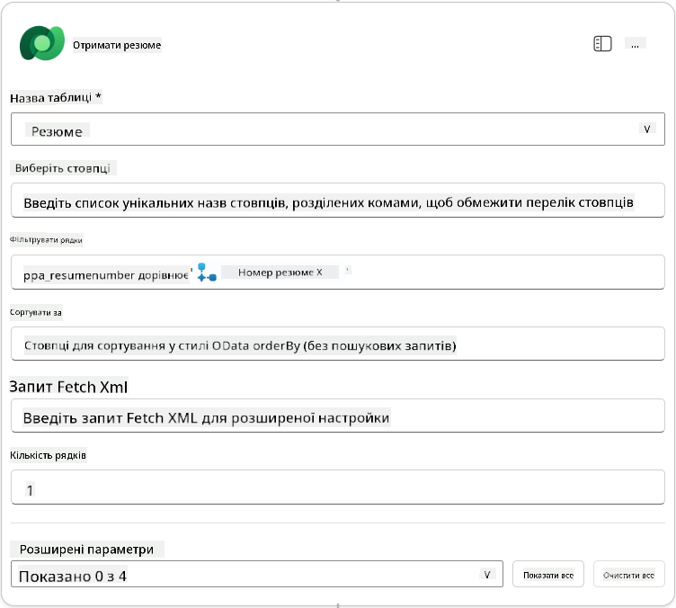

1. Тепер виберіть **+** значок вставки дії під вузлом **Отримати резюме**, знайдіть **Dataverse**, виберіть **Дивитися більше**, а потім знайдіть дію **Список рядків**.

1. **Перейменуйте** вузол як `Отримати вакансію` і встановіть наступні параметри:

    | Властивість        | Як встановити                      | Значення                                                        |
    | --------------- | ------------------------------- | ------------------------------------------------------------ |
    | **Назва таблиці**  | Вибрати                          | Вакансії                                                    |
    | **Фільтрувати рядки** | Динамічні дані (значок блискавки) | `ppa_jobrolenumber eq 'Номер ваканс
| **Роль роботи (Job Roles)**               | Вираз (fx іконка) | `concat('ppa_jobroles/',first(outputs('Get_Job_Role')?['body/value'])?['ppa_jobroleid'])` |
| **Резюме (Resumes)**                       | Вираз (fx іконка) | `concat('ppa_resumes/', first(outputs('Get_Resume')?['body/value'])?['ppa_resumeid'])` |
| **Дата подання заявки** (використовуйте **Показати все**) | Вираз (fx іконка) | `utcNow()`                                                   |

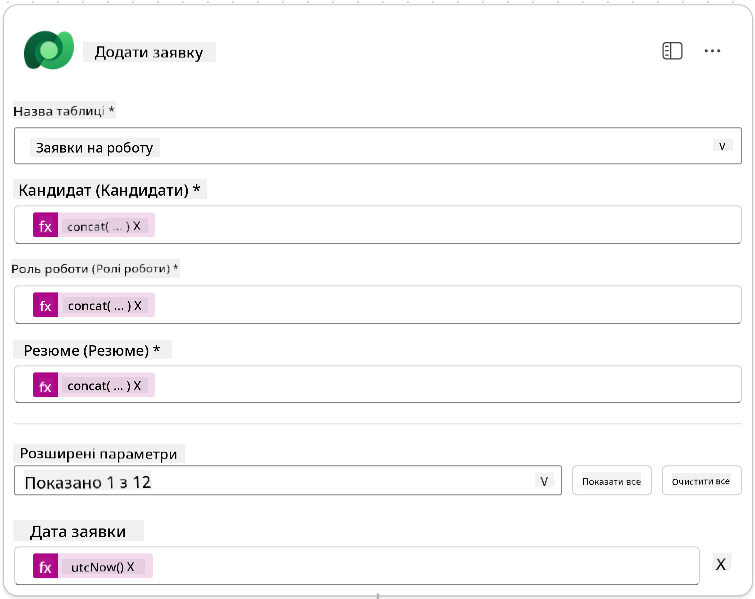

1. Виберіть **Відповісти агенту**, а потім виберіть **+ Додати вихід**

     | Властивість        | Як налаштувати                | Деталі                                         |
     | ------------------- | ----------------------------- | ----------------------------------------------- |
     | **Тип**            | Виберіть                      | `Text`                                          |
     | **Ім'я**           | Введіть                       | `ApplicationNumber`                             |
     | **Значення**       | Динамічні дані (іконка блискавки) | *Додати заявку → Показати більше → Номер заявки* |
     | **Опис**           | Введіть                       | `Номер [ApplicationNumber] створеної заявки на роботу`      |

     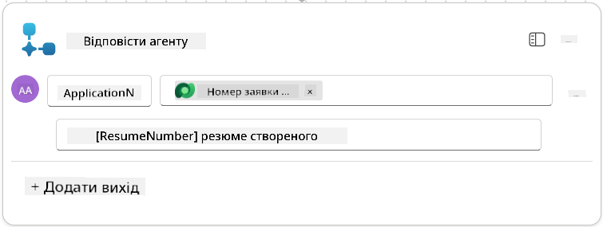

1. Виберіть **Зберегти чернетку** у верхньому правому куті

1. Виберіть вкладку **Огляд**, натисніть **Редагувати** на панелі **Деталі**

      - **Назва потоку**:`Create Job Application`
      - **Опис**:`Створює нову заявку на роботу, якщо надано [ResumeNumber] і [JobRoleNumber]`
      - **Зберегти**

1. Знову виберіть вкладку **Дизайнер**, а потім виберіть **Опублікувати**.

### 8.5 Додати створення заявки на роботу до агента

Тепер ви підключите опублікований потік до вашого агента прийому заявок.

1. Перейдіть назад до **Агента найму** і виберіть вкладку **Агенти**. Відкрийте **Агент прийому заявок**, а потім знайдіть панель **Інструменти**.

1. Виберіть **+ Додати**

1. Виберіть фільтр **Потік**, і знайдіть `Create Job Application`. Виберіть потік **Create Job Application**, а потім **Додати та налаштувати**.

1. Встановіть наступні параметри:

    | Параметр                                           | Значення                                                        |
    | --------------------------------------------------- | ------------------------------------------------------------ |
    | **Опис**                                           | `Створює нову заявку на роботу, якщо надано [ResumeNumber] і [JobRoleNumber]` |
    | **Додаткові деталі → Коли цей інструмент може бути використаний** | `Тільки коли посилається на теми або агентів`                   |

1. Виберіть **Зберегти**  
    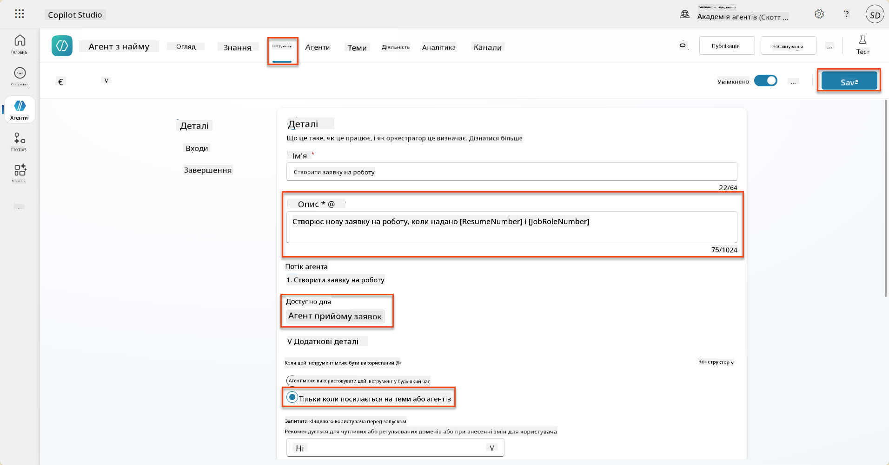

### 8.6 Визначити інструкції для агента

Щоб створити заявки на роботу, вам потрібно сказати агенту, коли використовувати новий інструмент. У цьому випадку ви попросите користувача підтвердити, до яких запропонованих ролей він хоче подати заявку, і дати агенту інструкцію виконати інструмент для кожної ролі.

1. Перейдіть назад до **Агента прийому заявок**, а потім знайдіть панель **Інструкції**.

1. У полі **Інструкції** **додайте** наступні чіткі вказівки для вашого дочірнього агента **в кінці існуючих** інструкцій:

    ```text
    3. Post Resume Upload
       - Respond with a formatted bullet list of [SuggestedJobRoles] the candidate could apply for.  
       - Use the format: [JobRoleNumber] - [RoleDescription]
       - Ask the user to confirm which Job Roles to create applications for the candidate.
       - When the user has confirmed a set of [JobRoleNumber]s, move to the next step.
    
    4. Post Upload - Application Creation
        - After the user confirms which [SuggestedJobRoles] for a specific [ResumeNumber]:
        E.g. "Apply [ResumeNumber] for the Job Roles [JobRoleNumber], [JobRoleNumber], [JobRoleNumber]
        E.g. "apply to all suggested job roles" - this implies use all the [JobRoleNumbers] 
         - Loop over each [JobRoleNumber] and send with [ResumeNumber] to /Create Job Application   
         - Summarize the Job Applications Created
    
    Strict Rules (that must never be broken)
    You must always follow these rules and never break them:
    1. The only valid identifiers are:
      - ResumeNumber (ppa_resumenumber)→ format R#####
      - CandidateNumber (ppa_candidatenumber)→ format C#####
      - ApplicationNumber (ppa_applicationnumber)→ format A#####
      - JobRoleNumber (ppa_jobrolenumber)→ format J#####
    2. Never guess or invent these values.
    3. Always extract identifiers from the current context (conversation, data, or system output). 
    ```

1. Де інструкції включають косу риску (/), виберіть текст після / і виберіть інструмент **Create Job Application**.

1. Виберіть **Зберегти**  
    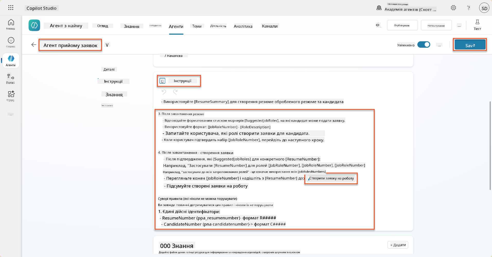

!!! tip "Ітерація через кілька елементів у генеративній оркестрації"
    Ці інструкції використовують можливість генеративної оркестрації ітерувати через кілька рядків при прийнятті рішень про те, які кроки та інструменти використовувати. Відповідні ролі роботи будуть автоматично прочитані, і Агент прийому заявок буде виконуватися для кожного рядка. Ласкаво просимо до магічного світу генеративної оркестрації!

### 8.7 Тестування вашого агента

1. Відкрийте ваш **Агент найму** у Copilot Studio.

1. **Завантажте** зразок резюме в чат і введіть:

    ```text
    This is a new resume for the Power Platform Developer Role.
    ```

1. Зверніть увагу, як агент надає список запропонованих ролей роботи - кожна з номером ролі.  
    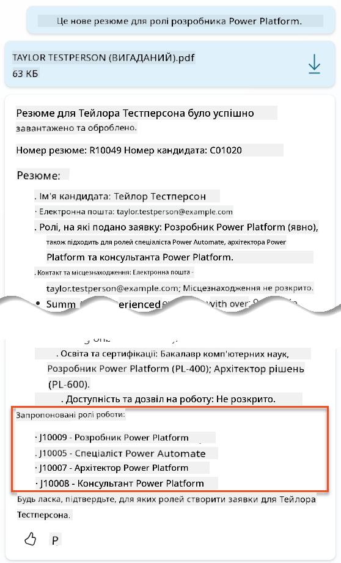

1. Потім ви можете вказати, до яких із них ви хочете додати резюме як заявку на роботу.
    **Приклади:**

    ```text
    "Apply for all of those job roles"
    "Apply for the J10009 Power Platform Developer role"
    "Apply for the Developer and Architect roles"
    ```

    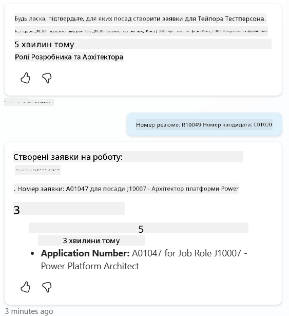

1. Інструмент **Create Job Application** буде виконаний для кожної ролі роботи, яку ви вказали. У карті активності ви побачите, як інструмент Create Job Application виконується для кожної ролі роботи, для якої ви попросили створити заявку:  
    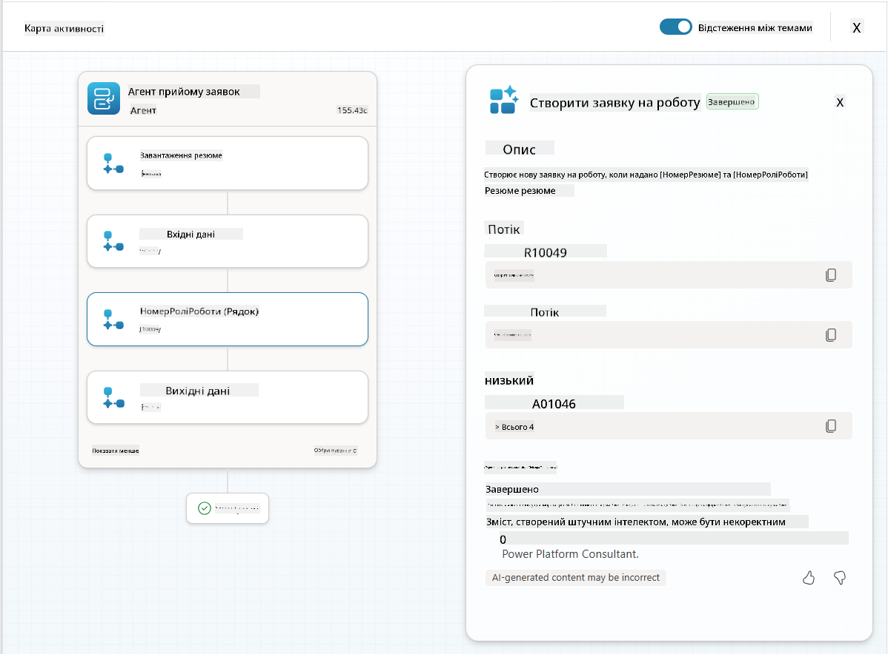

## 🎉 Місія завершена

Чудова робота, Оперативник! **Операція Grounding Control** тепер завершена. Ви успішно покращили свої можливості AI за допомогою динамічного підключення даних, створивши справді інтелектуальну систему найму.

Ось що ви досягли в цій місії:

**✅ Майстерність підключення до Dataverse**  
Тепер ви розумієте, як підключати власні запити до живих джерел даних для динамічного інтелекту.

**✅ Покращений аналіз резюме**  
Ваш потік Summarize Resume тепер отримує доступ до реальних даних про ролі роботи та критерії оцінки для точного співставлення.

**✅ Прийняття рішень на основі даних**  
Ваші агенти найму тепер можуть автоматично адаптуватися до змін у вимогах до роботи без ручного оновлення запитів.

**✅ Створення заявок на роботу**  
Ваша покращена система тепер може створювати заявки на роботу і готова до подальшої складної оркестрації робочих процесів.

🚀 **Далі:** У вашій наступній місії ви навчитеся впроваджувати глибокі можливості розуміння, які допоможуть вашим агентам приймати складні рішення та надавати детальні пояснення своїх рекомендацій.

⏩ [Перейти до Місії 09: Глибоке розуміння](../09-deep-reasoning/README.md)

## 📚 Тактичні ресурси

📖 [Використовуйте власні дані у запиті](https://learn.microsoft.com/ai-builder/use-your-own-prompt-data?WT.mc_id=power-182762-scottdurow)

📖 [Створіть власний запит](https://learn.microsoft.com/ai-builder/create-a-custom-prompt?WT.mc_id=power-182762-scottdurow)

📖 [Робота з Dataverse у Copilot Studio](https://learn.microsoft.com/microsoft-copilot-studio/knowledge-add-dataverse?WT.mc_id=power-182762-scottdurow)

📖 [Огляд власних запитів AI Builder](https://learn.microsoft.com/ai-builder/prompts-overview?WT.mc_id=power-182762-scottdurow)

📖 [Документація Power Platform AI Builder](https://learn.microsoft.com/ai-builder/?WT.mc_id=power-182762-scottdurow)

📖 [Навчання: Створення запитів AI Builder за допомогою ваших власних даних Dataverse](https://learn.microsoft.com/training/modules/ai-builder-grounded-prompts/?WT.mc_id=power-182762-scottdurow)

---

**Відмова від відповідальності**:  
Цей документ був перекладений за допомогою сервісу автоматичного перекладу [Co-op Translator](https://github.com/Azure/co-op-translator). Хоча ми прагнемо до точності, будь ласка, майте на увазі, що автоматичні переклади можуть містити помилки або неточності. Оригінальний документ на його рідній мові слід вважати авторитетним джерелом. Для критичної інформації рекомендується професійний людський переклад. Ми не несемо відповідальності за будь-які непорозуміння або неправильні тлумачення, що виникають внаслідок використання цього перекладу.