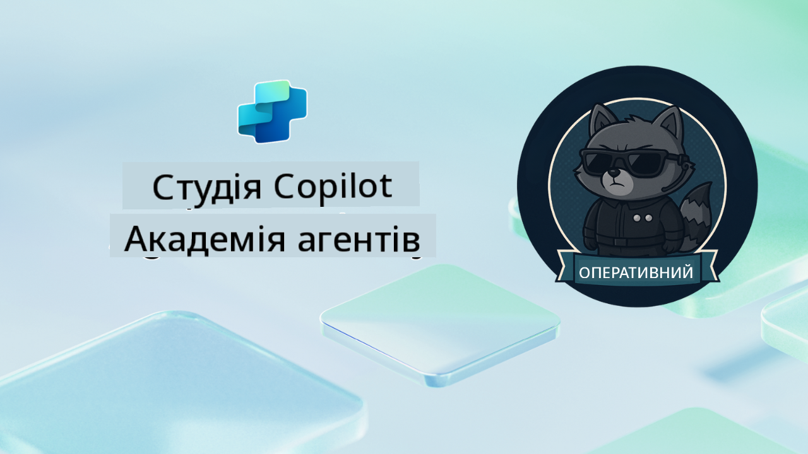

<!--
CO_OP_TRANSLATOR_METADATA:
{
  "original_hash": "24fcbe9a57d3439e05f8866e550c0a84",
  "translation_date": "2025-10-21T17:36:07+00:00",
  "source_file": "docs/operative-preview/README.md",
  "language_code": "uk"
}
-->
# Ласкаво просимо, Оперативник

**Ласкаво просимо, Оперативник.**  
Ваша просунута місія—якщо ви вирішите її прийняти—полягає у тому, щоб опанувати мистецтво створення **систем багатозадачних агентів корпоративного рівня** за допомогою **Microsoft Copilot Studio**.

Це інтенсивне навчання перенесе вас за межі базового створення агентів у складний світ **оркестрації багатозадачних агентів**: від автоматизації найму до безпеки штучного інтелекту, ви навчитеся створювати, координувати та впроваджувати екосистеми інтелектуальних агентів, використовуючи реальні корпоративні сценарії.

--8<-- "disclaimer.md"

---

## 🎯 Мета Місії

Завершивши програму Agent Academy Operative, ви зможете:

- Проєктувати та впроваджувати **системи багатозадачних агентів** для складних бізнес-сценаріїв
- Опанувати **оркестрацію агентів** та шаблони співпраці
- Реалізувати **безпеку штучного інтелекту та модерацію контенту** у виробничих системах
- Створювати **мультимодальні запити** для обробки та аналізу документів
- Впроваджувати **агентів корпоративного рівня** з належним управлінням та тестуванням

---

## 🧪 Попередні умови

Для виконання всіх місій вам знадобиться:

- Завершене навчання **Agent Academy Recruit**
- Середовище Microsoft Power Platform з ліцензією **Copilot Studio**
- Доступ до **Microsoft Dataverse**
- Адміністративні права для створення рішень та агентів

---

## 🧬 Для кого цей курс

Цей просунутий курс ідеально підходить для:

- **Архітекторів рішень**, які проєктують системи штучного інтелекту корпоративного рівня
- **Розробників**, які створюють готові до впровадження рішення агентів
- **ІТ-фахівців**, які впроваджують управління та безпеку штучного інтелекту
- **Бізнес-аналітиків**, які створюють складні автоматизовані робочі процеси
- Усіх, хто готовий **підвищити рівень** від базових агентів до корпоративних систем

---

## 🧭 Огляд навчальної програми

Академія структурована як прогресивна серія польових операцій—кожна місія будується на попередній, щоб створити комплексну систему автоматизації найму.

| Місія | Назва | Оперативний брифінг |
|-------|-------|---------------------|
| `01` | 🚨 [Початок роботи з агентом найму](./01-get-started/README.md) | Розгорніть базову інфраструктуру та створіть центрального оркестратора |
| `02` | 🎭 [Зробіть вашого агента готовим до багатозадачності з підключеними агентами](./02-multi-agent/README.md) | Перетворіть одного агента на координовану систему багатозадачних агентів |
| `03` | ⚡ [Автоматизація агента за допомогою тригерів](./03-automate-triggers/README.md) | Реалізуйте автономну поведінку агента за допомогою тригерів, що реагують на події |
| `04` | 📝 [Створення інструкцій для агента](./04-agent-instructions/README.md) | Опануйте точну комунікацію та контроль поведінки агента |
| `05` | 💬 [Персоналізація відповідей агента](./05-agent-responses/README.md) | Налаштуйте відповіді агента для максимального впливу та залучення |
| `06` | 🛡️ [Основи модерації контенту та безпеки штучного інтелекту](./06-ai-safety/README.md) | Реалізуйте заходи безпеки та відповідності корпоративного рівня |
| `07` | 🎨 [Витягування змісту резюме за допомогою мультимодальних запитів](./07-multimodal-prompts/README.md) | Обробляйте документи та зображення за допомогою передових можливостей штучного інтелекту |
| `08` | 🗄️ [Запити - прив'язка до Dataverse](./08-dataverse-grounding/README.md) | Прив'яжіть агентів до корпоративних даних для точних відповідей |
| `09` | 🧠 [Застосування глибокого аналізу для оцінки відповідності кандидата та підготовки до співбесіди](./09-deep-reasoning/README.md) | Реалізуйте складне логічне мислення штучного інтелекту для прийняття рішень |
| `10` | 📄 [Генерація документів для співбесіди, специфічних для кандидата, за допомогою запитів](./10-generate-documents/README.md) | Створюйте динамічні документи на основі аналізу агента |
| `11` | 📊 [Отримання відгуків користувачів за допомогою адаптивних карток](./11-obtain-user-feedback/README.md) | Збирайте та обробляйте відгуки користувачів для постійного вдосконалення |
| `12` | 🌐 [Публікація ваших агентів на демонстраційному вебсайті для тестування зацікавленими сторонами](./12-demo-website/README.md) | Розгорніть повне рішення для демонстрації та тестування зацікавленими сторонами |

!!! note
    ✅ Завершення цієї навчальної програми дає вам значок **Operative**.  
    🔓 **Commander** буде доступний у майбутніх фазах.

<!-- markdownlint-disable-next-line MD033 -->

---

**Відмова від відповідальності**:  
Цей документ був перекладений за допомогою сервісу автоматичного перекладу [Co-op Translator](https://github.com/Azure/co-op-translator). Хоча ми прагнемо до точності, будь ласка, майте на увазі, що автоматичні переклади можуть містити помилки або неточності. Оригінальний документ на його рідній мові слід вважати авторитетним джерелом. Для критичної інформації рекомендується професійний людський переклад. Ми не несемо відповідальності за будь-які непорозуміння або неправильні тлумачення, що виникають внаслідок використання цього перекладу.