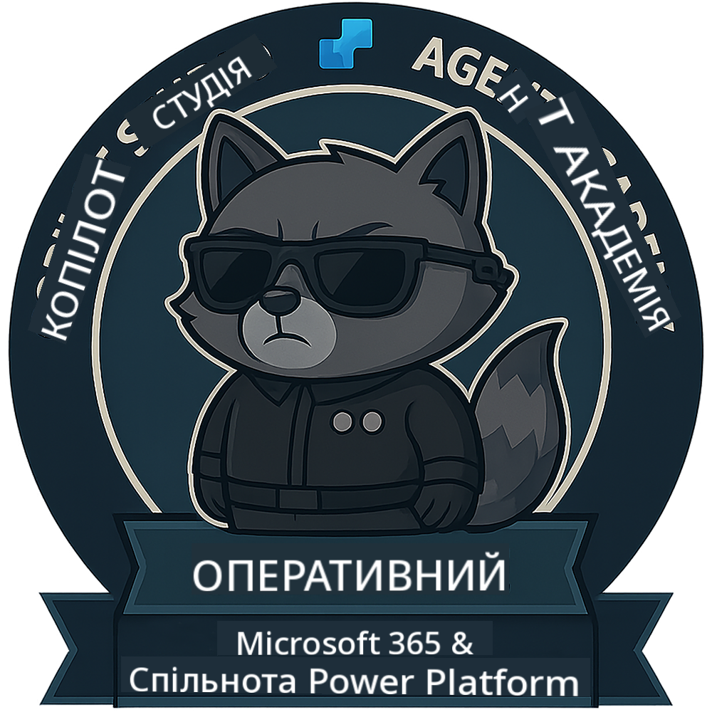

<!--
CO_OP_TRANSLATOR_METADATA:
{
  "original_hash": "1c5c8f18a1c1ec8fcbbb271403cf2ac6",
  "translation_date": "2025-10-21T19:10:21+00:00",
  "source_file": "docs/operative/README.md",
  "language_code": "uk"
}
-->
---
hide:
- navigation
---

# Оперативник (Скоро з'явиться)

Цей курс поки що дуже секретний. Він буде доступний у майбутньому! 🔓

{ width="300" }

<!-- markdownlint-disable-next-line MD033 -->

---

**Відмова від відповідальності**:  
Цей документ був перекладений за допомогою сервісу автоматичного перекладу [Co-op Translator](https://github.com/Azure/co-op-translator). Хоча ми прагнемо до точності, будь ласка, майте на увазі, що автоматичні переклади можуть містити помилки або неточності. Оригінальний документ на його рідній мові слід вважати авторитетним джерелом. Для критичної інформації рекомендується професійний людський переклад. Ми не несемо відповідальності за будь-які непорозуміння або неправильні тлумачення, що виникають внаслідок використання цього перекладу.