<!--
CO_OP_TRANSLATOR_METADATA:
{
  "original_hash": "d9cd8cd1a4fbd8915171a2ed972cc322",
  "translation_date": "2025-10-21T19:08:05+00:00",
  "source_file": "docs/recruit/00-course-setup/README.md",
  "language_code": "uk"
}
-->
# 🚨 Місія 00: Налаштування курсу

## 🕵️‍♂️ КОДОВА НАЗВА: `ОПЕРАЦІЯ ГОТОВНІСТЬ ДО РОЗГОРТАННЯ`

> **⏱️ Час виконання операції:** `~30 хвилин`  

## 🎯 Короткий опис місії

Вітаємо на першій місії вашого навчання як агента Copilot Studio.  
Перед тим як почати створювати свого першого AI-агента, вам потрібно налаштувати **середовище розробки, готове до роботи в полі**.

Цей брифінг описує системи, облікові дані доступу та кроки налаштування, необхідні для успішної роботи в екосистемі Microsoft 365.

## 🔎 Цілі

Ваше завдання включає:

1. Отримання облікового запису Microsoft 365  
1. Доступ до Microsoft Copilot Studio  
1. (Необов’язково) Отримання ліцензії Microsoft 365 Copilot для публікації в продакшн  
1. Створення середовища розробки як вашого середовища Copilot Studio  
1. Створення сайту SharePoint, який буде використовуватися як джерело даних у наступних місіях

---

## 🔍 Передумови

Перед початком переконайтеся, що у вас є:

1. **Робоча або навчальна електронна адреса** (особисті @outlook.com, @gmail.com тощо не підтримуються).
1. Доступ до інтернету та сучасного браузера (рекомендується Edge, Chrome або Firefox).  
1. Базове знайомство з Microsoft 365 (наприклад, вхід до Office-додатків або Teams).  
1. (Необов’язково) Кредитна картка або метод оплати, якщо ви плануєте придбати платні ліцензії.

---

## Крок 1: Отримайте обліковий запис Microsoft 365

Copilot Studio знаходиться в Microsoft 365, тому вам потрібен обліковий запис Microsoft 365 для доступу до нього. Ви можете використовувати існуючий обліковий запис, якщо він у вас є, або виконати наступні кроки для отримання відповідної ліцензії:

1. **Придбайте платну підписку Microsoft 365 для бізнесу**  
   1. Перейдіть на [Сторінку планів і цін Microsoft 365 для бізнесу](https://www.microsoft.com/microsoft-365/business/microsoft-365-plans-and-pricing)
   1. Найдешевший варіант для початку — план Microsoft 365 Business Basic. Виберіть `Спробувати безкоштовно` і пройдіть через форму, щоб заповнити дані підписки, облікового запису та оплати.
   
   1. Після створення нового облікового запису увійдіть до нього.

    !!! Порада
        Якщо ви плануєте публікувати агентів у Microsoft 365 Copilot Chat або підключатися до організаційних даних (SharePoint, OneDrive, Dataverse), потрібна ліцензія Microsoft 365 Copilot. Це додаткова ліцензія, про яку можна дізнатися більше [на сайті ліцензування](https://www.microsoft.com/microsoft-365/copilot#plans)

---

## Крок 2: Почніть пробну версію Copilot Studio

Після створення вашого Microsoft 365 Tenant, вам потрібно отримати доступ до Copilot Studio. Ви можете отримати безкоштовну 30-денну пробну версію, виконавши наступні кроки:

1. Перейдіть на [aka.ms/TryCopilotStudio](https://aka.ms/TryCopilotStudio).  
1. Введіть електронну адресу нового облікового запису, який ви налаштували на попередньому кроці, і виберіть `Далі`.  
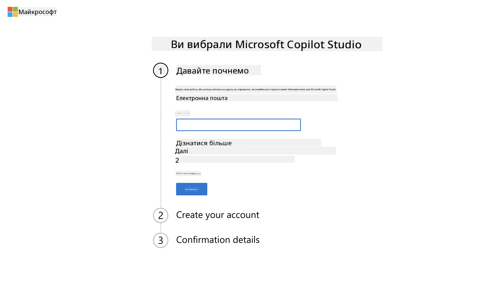
1. Система повинна розпізнати ваш обліковий запис. Виберіть `Увійти`.
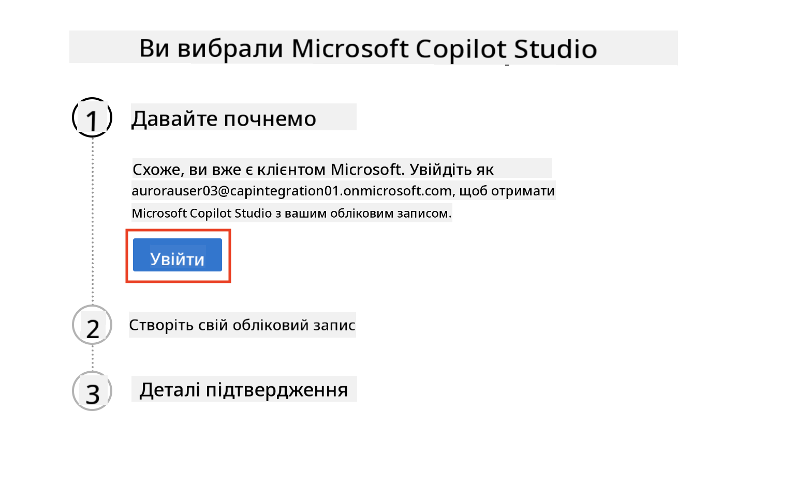  
1. Виберіть `Почати безкоштовну пробну версію`.
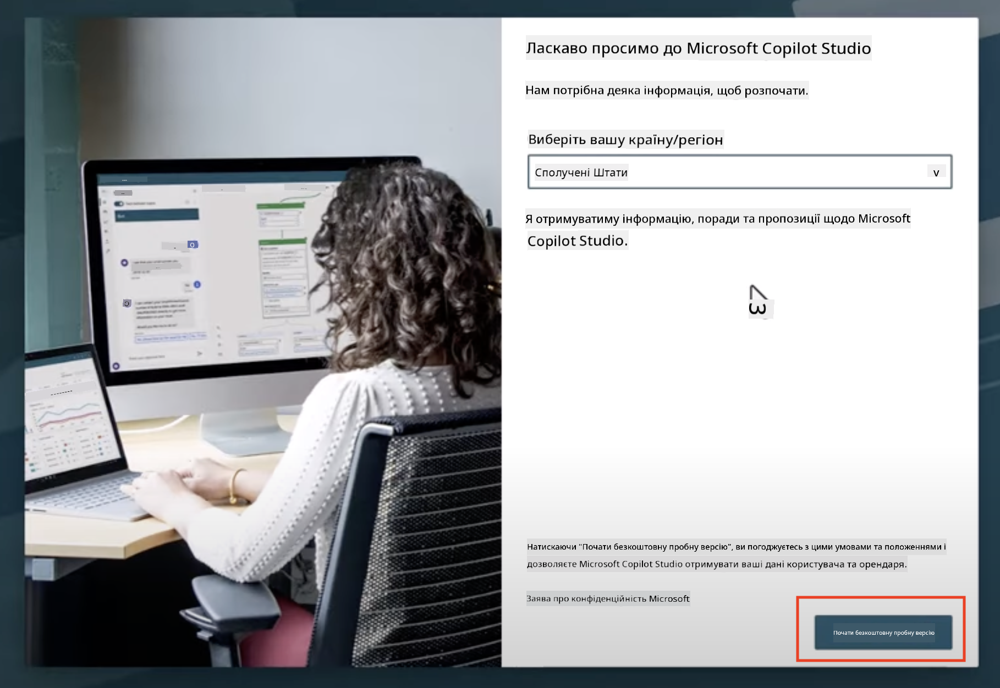

!!! info "Примітки щодо пробної версії"  
     1. Безкоштовна пробна версія надає **повні можливості Copilot Studio**.
     1. Ви будете отримувати електронні повідомлення про закінчення терміну дії пробної версії. Ви можете продовжити пробну версію на 30 днів (до 90 днів роботи агента).  
     1. Якщо адміністратор вашого Tenant вимкнув самостійне підписання, ви побачите помилку — зверніться до адміністратора Microsoft 365, щоб увімкнути цю функцію.

---

## Крок 3: Створіть нове середовище розробки

### Зареєструйтесь у плані розробника Power Apps

Використовуючи той самий Tenant Microsoft 365, створений у Кроці 1, зареєструйтесь у плані розробника Power Apps, щоб створити безкоштовне середовище розробки для створення та тестування в Copilot Studio.

1. Зареєструйтесь на [веб-сайті плану розробника Power Apps](https://aka.ms/PowerAppsDevPlan).

    - Введіть свою електронну адресу
    - Поставте галочку
    - Виберіть **Почати безкоштовно**

    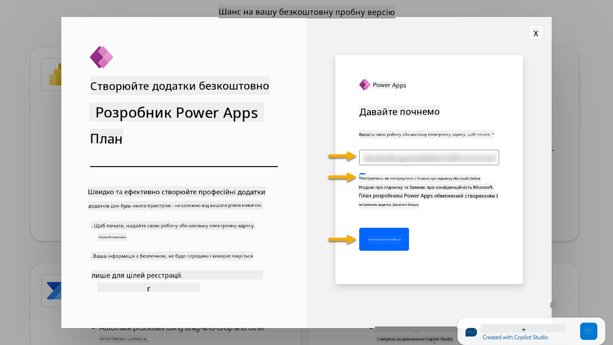

1. Після реєстрації в плані розробника вас буде перенаправлено до [Power Apps](https://make.powerapps.com/). Середовище використовує ваше ім’я, наприклад **Середовище Adele Vance**. Якщо вже існує середовище з таким ім’ям, нове середовище розробника буде називатися **Середовище Adele Vance (1)**.

    Використовуйте це середовище розробника в Copilot Studio під час виконання лабораторних завдань.

!!! Примітка
    Якщо ви використовуєте існуючий обліковий запис Microsoft 365 і не створювали його в Кроці 1, наприклад, використовуючи власний обліковий запис у вашій робочій організації, ваш IT-адміністратор (або еквівалентна команда), яка керує вашим Tenant/середовищами, могла вимкнути процес реєстрації. У цьому випадку, будь ласка, зверніться до адміністратора або створіть тестовий Tenant відповідно до Кроку 1.

---

## Крок 4: Створіть новий сайт SharePoint

Потрібно створити новий сайт SharePoint, який буде використовуватися в [Уроці 06 - Створення користувацького агента за допомогою досвіду створення розмов із Copilot і прив’язки до ваших даних](../06-create-agent-from-conversation/README.md#62-add-an-internal-knowledge-source-using-a-sharepoint-site).

1. Виберіть значок вафлі у верхньому лівому куті Microsoft Copilot Studio, щоб переглянути меню. Виберіть SharePoint у меню.

    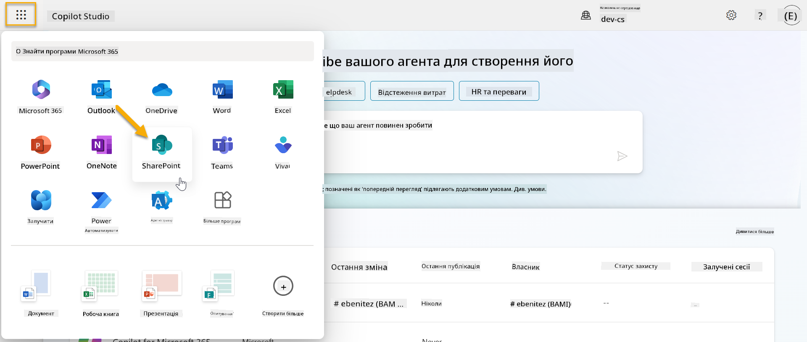

1. SharePoint завантажиться. Виберіть **+ Створити сайт**, щоб створити новий сайт SharePoint.

    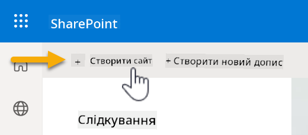

1. З’явиться діалогове вікно, яке допоможе вам створити новий сайт SharePoint. Виберіть **Сайт команди**.

    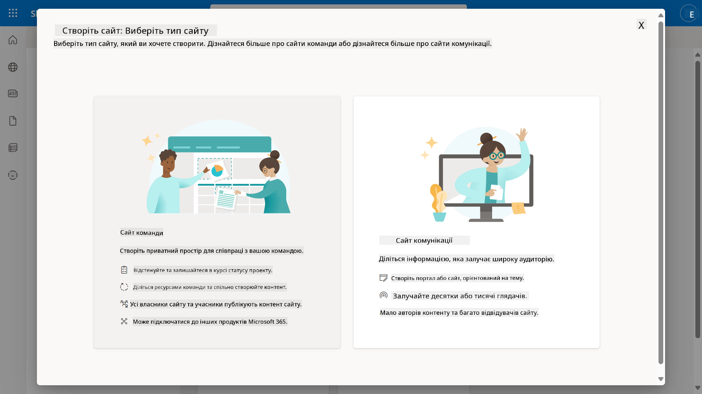

1. На наступному кроці за замовчуванням завантажиться список шаблонів Microsoft. Прокрутіть вниз і виберіть шаблон **IT help desk**.

    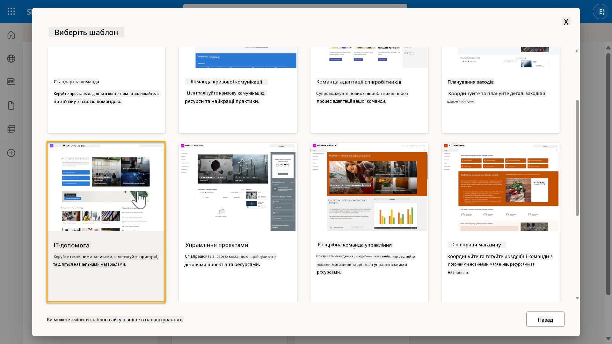

1. Виберіть **Використовувати шаблон**, щоб створити новий сайт SharePoint за допомогою шаблону IT help desk.

    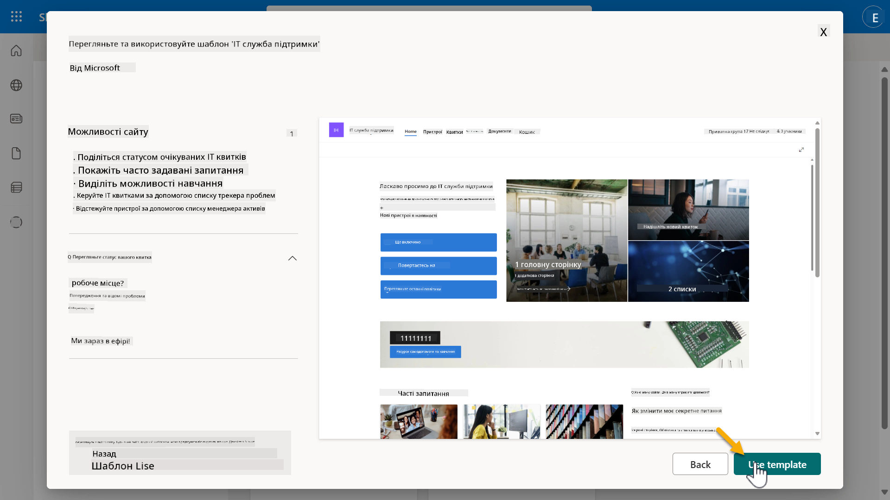

1. Введіть інформацію для вашого сайту. Ось приклад:

    | Поле | Значення |
    | --- | --- |
    | Назва сайту | Contoso IT |
    | Опис сайту | Copilot Studio для початківців |
    | Адреса сайту | ContosoIT |

    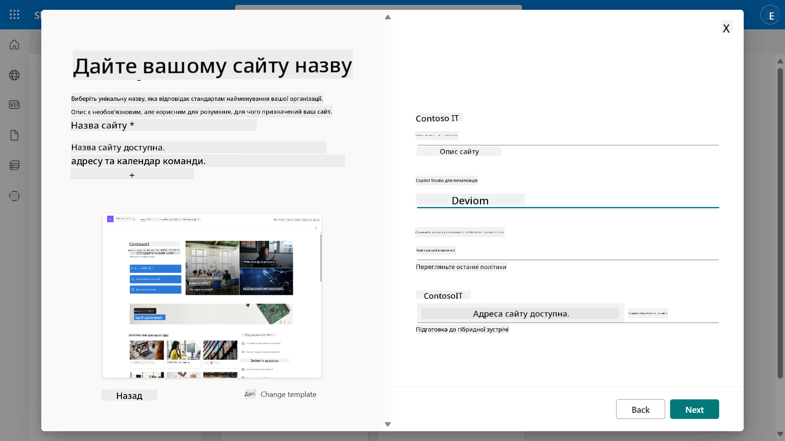

1. На останньому кроці можна вибрати мову для сайту SharePoint. За замовчуванням це буде **Англійська**. Залиште мову як **Англійська** і виберіть **Створити сайт**.

    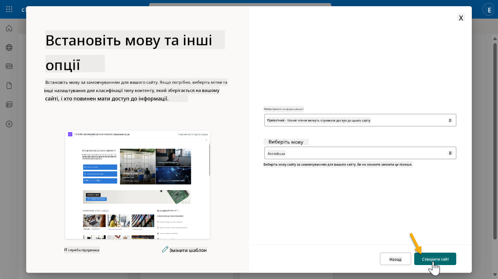

1. Сайт SharePoint буде створюватися протягом кількох секунд. Тим часом ви можете додати інших користувачів на ваш сайт, ввівши їхню електронну адресу в поле **Додати учасників**. Після завершення виберіть **Готово**.

    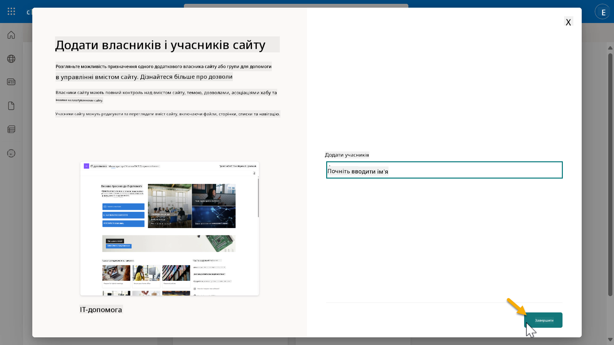

1. Завантажиться головна сторінка сайту SharePoint. **Скопіюйте** URL-адресу сайту SharePoint.

1. Цей шаблон надає сторінки з прикладами даних про різні IT-політики та два приклади списків (Tickets і Devices).

### Використовуйте список Devices SharePoint

Ми будемо використовувати список **Devices** у [Місії 07 - Додати нову тему з тригером і вузлами](../07-add-new-topic-with-trigger/README.md#73-add-a-tool-using-a-connector).

### Додати нову колонку

Прокрутіть до крайнього правого боку списку та виберіть кнопку **+ Додати колонку**. Виберіть тип **гіперпосилання**, введіть **Зображення** як назву колонки та натисніть додати.

### Створіть приклади даних у списку Devices SharePoint

Вам потрібно переконатися, що ви заповнили цей список щонайменше 4 прикладами даних і додали одну додаткову колонку до цього списку.  

При додаванні прикладів даних переконайтеся, що заповнені наступні поля:

- Фото пристрою - використовуйте зображення з [папки зображень пристроїв](https://github.com/microsoft/agent-academy/tree/main/docs/recruit/00-course-setup/images/device-images)
- Назва
- Статус
- Виробник
- Модель
- Тип активу
- Колір
- Серійний номер
- Дата покупки
- Ціна покупки
- Номер замовлення
- Зображення - використовуйте наступні посилання

|Пристрій  |URL  |
|---------|---------|
|Surface Laptop 13     | [https://raw.githubusercontent.com/microsoft/agent-academy/refs/heads/main/docs/recruit/00-course-setup/images/device-images/Surface-Laptop-13.png](https://raw.githubusercontent.com/microsoft/agent-academy/refs/heads/main/docs/recruit/00-course-setup/images/device-images/Surface-Laptop-13.png)        |
|Surface Laptop 15     | [https://raw.githubusercontent.com/microsoft/agent-academy/refs/heads/main/docs/recruit/00-course-setup/images/device-images/Surface-Laptop-15.png](https://raw.githubusercontent.com/microsoft/agent-academy/refs/heads/main/docs/recruit/00-course-setup/images/device-images/Surface-Laptop-15.png)        |
|Surface Pro    | [https://raw.githubusercontent.com/microsoft/agent-academy/refs/heads/main/docs/recruit/00-course-setup/images/device-images/Surface-Pro-12.png](https://raw.githubusercontent.com/microsoft/agent-academy/refs/heads/main/docs/recruit/00-course-setup/images/device-images/Surface-Pro-12.png)        |
|Surface Studio    | [https://raw.githubusercontent.com/microsoft/agent-academy/refs/heads/main/docs/recruit/00-course-setup/images/device-images/Surface-Studio.png](https://raw.githubusercontent.com/microsoft/agent-academy/refs/heads/main/docs/recruit/00-course-setup/images/device-images/Surface-Studio.png)        |

---

## ✅ Місія завершена

Ви успішно:

- Налаштували середовище розробки Microsoft 365  
- Активували пробну версію Copilot Studio  
- Створили сайт SharePoint для прив’язки агентів  
- Заповнили список Devices для використання в майбутніх місіях

Ви офіційно готові розпочати своє **навчання агента рівня Рекрут** у [Уроці 01](../01-introduction-to-agents/README.md).  

<!-- markdownlint-disable-next-line MD033 -->

---

**Відмова від відповідальності**:  
Цей документ був перекладений за допомогою сервісу автоматичного перекладу [Co-op Translator](https://github.com/Azure/co-op-translator). Хоча ми прагнемо до точності, будь ласка, майте на увазі, що автоматичні переклади можуть містити помилки або неточності. Оригінальний документ на його рідній мові слід вважати авторитетним джерелом. Для критичної інформації рекомендується професійний людський переклад. Ми не несемо відповідальності за будь-які непорозуміння або неправильні тлумачення, що виникають внаслідок використання цього перекладу.