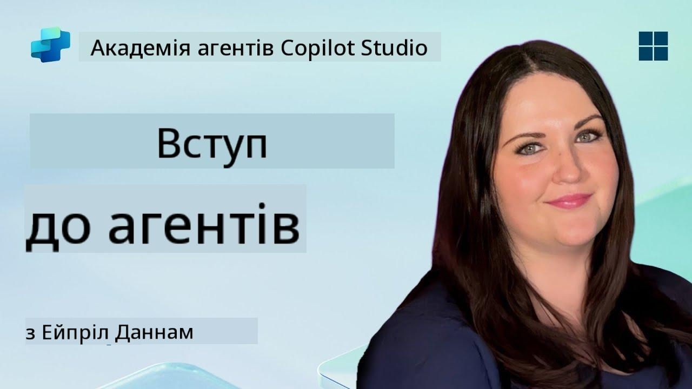

<!--
CO_OP_TRANSLATOR_METADATA:
{
  "original_hash": "d6706e107678264168d77b2e107710b1",
  "translation_date": "2025-10-21T18:28:29+00:00",
  "source_file": "docs/recruit/01-introduction-to-agents/README.md",
  "language_code": "uk"
}
-->
# 🚨 Місія 01: Вступ до агентів

## 🕵️‍♂️ КОДОВЕ ІМ'Я: `ОПЕРАЦІЯ РОЗШИФРУВАННЯ AI АГЕНТА`

> **⏱️ Час виконання операції:** `~30 хвилин – лише інформація, без польових робіт`

🎥 **Перегляньте відео-інструкцію**

## 🎯 Короткий опис місії

Вітаємо, Рекруте. Перш ніж ми перейдемо до створення агентів, вам потрібно добре зрозуміти концепції штучного інтелекту, які їх підтримують. Ця місія забезпечить вас базовими знаннями про розмовний AI, великі мовні моделі (LLMs), генерацію з доповненням пошуку (RAG) та типи агентів, які ви можете створити в Copilot Studio.

## 🔎 Цілі

У цій місії ви дізнаєтесь:

1. Що таке розмовний AI і чому він важливий  
1. Як великі мовні моделі (LLMs) забезпечують роботу чатів  
1. Що приносить генерація з доповненням пошуку (RAG)  
1. Різницю між розмовними агентами та автономними агентами  
1. Як агенти в Copilot Studio використовують ці концепції  

Почнемо!

---

## Що таке розмовний AI?

Розмовний AI – це будь-яка система, яка може розуміти, обробляти та відповідати на людську мову – текстову чи усну – у природний спосіб. Подумайте про чат-ботів у службах підтримки або віртуальних персональних асистентів у ваших улюблених додатках. У більшості сучасних розмовних AI під капотом працюють великі мовні моделі (LLMs), про які ми поговоримо далі.

### Чому це важливо

- **Користувацький досвід:** Розмовні інтерфейси часто більш інтуїтивні, ніж навігація через меню.  
- **Масштабованість:** Один агент може обробляти десятки або сотні одночасних розмов.  
- **Ефективність:** Замість створення спеціальних скриптів на основі правил, агенти на основі LLM адаптуються до введення користувача в реальному часі.  
- **Розширюваність:** З правильним дизайном агенти можуть отримувати доступ до баз знань, підключатися до API або діяти як "цифрові колеги" у бізнес-процесах.

---

## Великі мовні моделі (LLMs) 101

У центрі більшості систем розмовного AI знаходяться **великі мовні моделі** – нейронні мережі, навчені на величезних текстових корпусах. Вони вивчають статистичні закономірності мови, щоб генерувати зв’язні речення, відповідати на запитання або навіть генерувати ідеї. Основні моменти:

1. **Навчальні дані:** LLMs поглинають терабайти тексту (веб-сторінки, книги, статті). Це "знання світу" дозволяє їм відповідати на різні теми.  
1. **Токенізація:** Текст розбивається на менші одиниці, які називаються токенами (слова, підслова або символи). Модель прогнозує один токен за раз.  
1. **Вікно контексту:** Кожна LLM має обмеження на кількість токенів, які вона може "бачити" одночасно. Поза цим обмеженням попередні токени обрізаються.  
1. **Підказки:** Ви взаємодієте з LLM, надсилаючи їй підказку. Чим краще ваша підказка, тим більш сфокусованою та релевантною буде відповідь.  
1. **Zero-shot vs. Fine-tuning:** Zero-shot означає використання LLM як є (лише сирі ваги). Fine-tuning означає налаштування моделі на даних конкретної галузі, щоб вона відповідала точніше вашим потребам.

!!! Tip "Порада"
    Поширена аналогія – LLM схожа на "супер-розумний автозаповнювач". Вона не розуміє значення, як людський мозок, але надзвичайно добре прогнозує наступне найкраще слово (або фразу) в послідовності.

---

## Генерація з доповненням пошуку (RAG)

Коли LLMs покладаються лише на статичні навчальні дані, вони можуть створювати помилкову інформацію або ставати застарілими. RAG вирішує це, дозволяючи моделі "шукати" свіжу інформацію перед створенням відповіді. Загалом, RAG працює так:

1. **Запит користувача:** Користувач задає питання (наприклад, "Які останні дані про квартальні доходи Contoso?").  
1. **Крок пошуку:** Система здійснює запит до джерела знань (документи, внутрішні бази даних, бібліотеки SharePoint тощо), щоб знайти релевантні уривки.  
1. **Доповнення:** Знайдені уривки додаються до або перед підказкою LLM.  
1. **Генерація:** LLM обробляє як питання користувача, так і отриманий контекст, а потім генерує відповідь, засновану на актуальних даних.  

З RAG ваш агент може звертатися до внутрішніх корпоративних вікі, API плагінів або шукати в базі знань FAQ – і повертати відповіді, які не обмежуються статично опублікованими параметрами моделі.

---

## Розмовні vs. Автономні агенти

У контексті Copilot Studio термін **агент** може стосуватися різних типів AI асистентів. Корисно провести межу між:

**Розмовними агентами:**

- Основна увага приділяється двосторонньому діалогу.  
- Зберігають контекст протягом кількох етапів розмови.  
- Зазвичай оркеструються через попередньо визначені потоки або тригери (наприклад, "Якщо користувач каже X, відповісти Y").  
- Ідеально підходять для підтримки клієнтів, FAQ, керованих взаємодій, планування або простих питань-відповідей.  
  - Приклади:  
    - Чат-бот Teams, який відповідає на питання про політику HR.  
    - Бот Power Virtual Agents на сторінці SharePoint, який допомагає користувачам заповнити форму.  

**Автономні агенти:**

- Виходять за межі діалогу; вони можуть **виконувати дії** від імені користувача.  
- Використовують цикли логіки LLM (думайте "план → дія → спостереження → перепланування") для виконання завдань.  
- Підключаються до зовнішніх інструментів або API (наприклад, викликають потік Power Automate, надсилають запрошення на календар, маніпулюють даними в Dataverse).  
- Працюють без постійних підказок від людини – після запуску вони можуть автономно виконувати багатокрокові процеси.  
  - Приклади:  
    - Агент, який створює маршрут подорожі, бронює рейси та надсилає підтвердження електронною поштою.  
    - Агент "Підсумок зустрічі", який приєднується до дзвінка Teams, транскрибує його в реальному часі та пише виконавчий підсумок у OneNote.  

!!! Info "Основна різниця"
    Розмовні агенти чекають введення користувача та зосереджуються на діалозі. Автономні агенти активно планують і виконують послідовність дій, використовуючи ширший доступ до інструментів.

---

## Агенти в Copilot Studio

**Copilot Studio** об'єднує як розмовні, так і автономні сценарії в рамках однієї платформи. Ось як Copilot Studio допомагає створювати агентів:

1. **Візуальний дизайнер агентів:** Платформа з низьким рівнем коду для визначення підказок, пам'яті та інструментів для чатів і робочих процесів дій.  
1. **Конфігурації LLM:** Вибір серед різних моделей OpenAI або корпоративного GPT від Microsoft для відповідності вашим потребам у продуктивності та витратах.  
1. **Конектори пошуку:** Попередньо створені інтеграції для SharePoint, OneDrive, Azure Cognitive Search і Dataverse, що дозволяють використовувати RAG "з коробки".  
1. **Користувацькі інструменти та функції:** Визначення користувацьких HTTP дій або потоків Power Automate, які ваш агент може викликати автономно.  
1. **Підтримка мультимедіа:** Окрім тексту, агенти Copilot Studio можуть обробляти зображення, файли або структуровані дані для збагачення контексту.  
1. **Публікація та розповсюдження:** Коли ваш агент готовий, ви можете опублікувати його в Microsoft 365 Copilot (щоб користувачі могли викликати його в Teams, SharePoint, Outlook тощо) або вбудувати його як окремий чат-виджет на веб-сторінці.

---

## 🎉 Місія завершена

Ви щойно завершили вступ до агентів та основних концепцій AI. Ви зрозуміли:

1. **LLMs = "Мозок" вашого агента**  
   - Відповідає за розуміння мови та генерацію.  
   - Більше токенів = багатший контекст, але також вищі витрати за виклик.  

1. **RAG = Інтеграція актуальних знань**  
   - Заповнює прогалину між статичним LLM і постійно змінюваними джерелами даних.  
   - Знаходить і додає релевантні документи або записи до підказки LLM.  

1. **Розмовні vs. Автономні**  
   - **Розмовні:** Зосереджені на потоці діалогу та збереженні контексту (наприклад, "Пам'ять сесії").  
   - **Автономні:** Додають "Блоки дій", які дозволяють агенту викликати зовнішні інструменти або сервіси.

---
Далі ви дослідите [основи Copilot Studio](../02-copilot-studio-fundamentals/README.md)!

Будьте уважні, Рекруте – ваша подорож у світ AI тільки починається!

## 📚 Тактичні ресурси

🔗 [Головна сторінка документації Copilot Studio](https://learn.microsoft.com/microsoft-copilot-studio/)

---

---

**Відмова від відповідальності**:  
Цей документ був перекладений за допомогою сервісу автоматичного перекладу [Co-op Translator](https://github.com/Azure/co-op-translator). Хоча ми прагнемо до точності, будь ласка, майте на увазі, що автоматичні переклади можуть містити помилки або неточності. Оригінальний документ на його рідній мові слід вважати авторитетним джерелом. Для критичної інформації рекомендується професійний людський переклад. Ми не несемо відповідальності за будь-які непорозуміння або неправильні тлумачення, що виникають внаслідок використання цього перекладу.