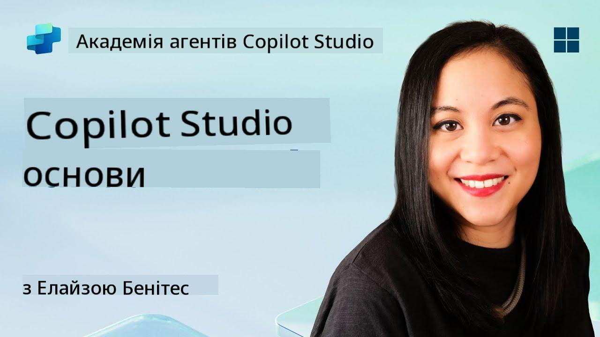
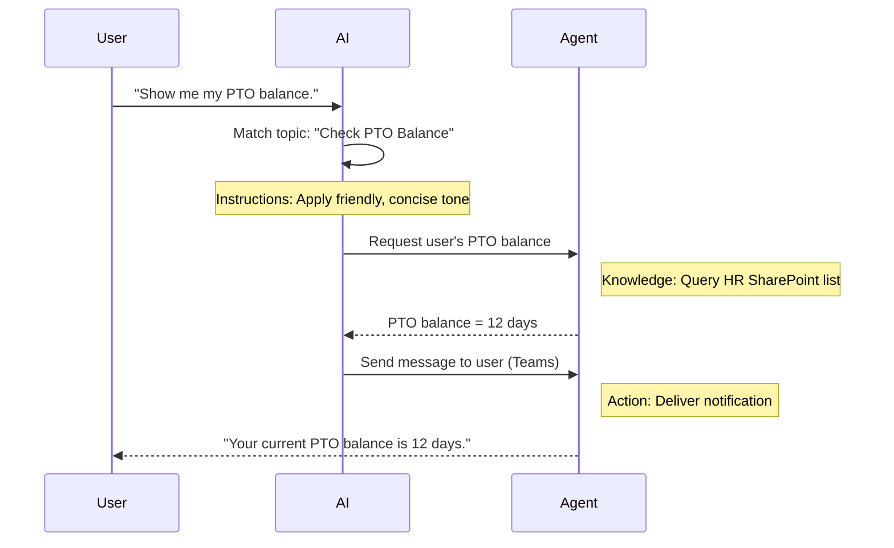

<!--
CO_OP_TRANSLATOR_METADATA:
{
  "original_hash": "90a3c5122f5687bbc8cc819990f175d4",
  "translation_date": "2025-10-21T18:56:24+00:00",
  "source_file": "docs/recruit/02-copilot-studio-fundamentals/README.md",
  "language_code": "uk"
}
-->
# 🚨 Місія 02: Основи Copilot Studio

## 🕵️‍♂️ КОДОВА НАЗВА: `ОПЕРАЦІЯ ОСНОВНИЙ ПРОТОКОЛ`

> **⏱️ Час виконання операції:** `~30 хвилин – лише інформація, без польових робіт`  

🎥 **Перегляньте відео-інструкцію**

[](https://www.youtube.com/watch?v=x4OCwDRGeLE "Перегляньте відео на YouTube")

## 🎯 Короткий опис місії

Вітаємо, Рекруте. Ця місія забезпечить вас базовою інформацією про те, як працює Copilot Studio, і як створювати інтелектуальних агентів, які приносять реальну користь бізнесу.

Перед тим як створити свого першого агента, вам потрібно зрозуміти чотири ключові компоненти, які складають кожного користувацького AI-агента: Знання, Інструменти, Теми та Інструкції. Ви також дізнаєтеся, як ці елементи взаємодіють у оркестраторі Copilot Studio.

## 🔎 Цілі

У цій місії ви:

- **Дізнаєтеся, що таке Copilot Studio**
- **Дізнаєтеся, коли і чому використовувати агентів**
- **Дослідите чотири основні складові агентів**
      - **Знання**
      - **Інструменти**
      - **Теми**
      - **Інструкції**
- **Зрозумієте, як ці компоненти працюють разом**, щоб створити інтелектуального автоматизованого агента

---

## Що таке агенти в Copilot Studio?

**Агент** — це спеціалізований AI-помічник, якого ви створюєте для виконання конкретних завдань або запитів. На відміну від універсального чат-бота, ваш агент:

- **Знає дані вашої компанії** (політики, документи, бази даних)  
- **Виконує реальні завдання** (надсилання повідомлень, створення подій у календарі, оновлення записів)  
- **Зберігає контекст розмови**, щоб продовжувати обговорення попередніх питань  

Оскільки Copilot Studio є платформою з низьким рівнем кодування, ви можете перетягувати готові компоненти — без необхідності глибоких навичок програмування. Після створення агента люди можуть використовувати його в Teams, Slack або навіть на власному веб-сайті, щоб отримувати відповіді чи автоматично запускати робочі процеси.

---

## Коли і чому використовувати Copilot Studio

Хоча Microsoft 365 Copilot забезпечує загальну AI-підтримку в Office-додатках, вам знадобиться користувацький агент, коли:

### Вам потрібні знання у конкретній галузі

- Стандартний Copilot може не знати внутрішніх процедур або даних вашої компанії. Агент може здійснювати запити до ваших сайтів SharePoint, баз даних або користувацьких джерел, щоб надавати точні та актуальні відповіді.  

### Ви хочете автоматизувати багатокрокові робочі процеси

- Наприклад: "Коли хтось подає витрати, відправте їх на затвердження, оновіть фінансовий трекер і повідомте менеджера." Користувацький агент може виконати кожен крок, активований однією командою або подією.  

### Вам потрібен контекстуальний досвід у інструменті  

- Уявіть агента для адаптації нових співробітників у Teams, який допомагає HR-працівникам з усіма політиками, надсилає необхідні форми та планує орієнтаційні зустрічі — прямо у вашій платформі для співпраці.  

---

## Чотири складові агента

Кожен агент Copilot Studio створюється з чотирьох основних компонентів:

1. **Знання**  
1. **Інструменти (Дії)**  
1. **Теми**  
1. **Інструкції**

Нижче ми визначимо кожну складову та покажемо, як вони працюють разом, щоб створити ефективного агента.

### 1. Знання

**Знання** — це дані та контекст, які ваш агент використовує для точного відповіді на запитання. Вони мають дві частини:

#### Користувацькі інструкції та контекст

- Ви пишете короткий опис мети та тону агента. Наприклад:  

    ```text
    You are an IT support agent. You help employees troubleshoot common software issues, provide troubleshooting steps, and escalate urgent tickets.
    ```

- Під час розмови агент запам’ятовує попередні етапи, щоб він міг посилатися на те, що вже було обговорено (наприклад, якщо користувач спочатку каже: "Мій принтер не працює," а потім запитує: "Ви перевірили рівень чорнила?" агент пам’ятає контекст принтера).

#### Джерела знань (дані для обґрунтування)

- Ви підключаєте свого агента до кількох джерел даних — бібліотек SharePoint, сайтів документації, вікі або інших баз даних.  
- Коли користувач задає запитання, агент витягує відповідні уривки з цих джерел, щоб відповіді були **обґрунтовані** фактичними політиками вашої організації, посібниками з продуктів або будь-якою іншою конфіденційною інформацією.  
- Ви навіть можете змусити агента відповідати лише на основі цих джерел, щоб уникнути здогадок або "галюцинацій".

!!! example
    Агент "Помічник з політик" може бути підключений до вашого HR-сайту SharePoint. Якщо користувач запитає: "Який у нас рівень накопичення PTO?" агент витягне точний текст із документа про політику HR, а не покладатиметься на загальну відповідь AI.

---

### 2. Інструменти (Дії)

**Інструменти (Дії)** визначають, що агент може робити, окрім спілкування. Кожна дія — це завдання, яке агент виконує програмно, наприклад:

- Надсилання електронного листа або повідомлення в Teams  
- Створення або оновлення події в календарі  
- Додавання або редагування запису в базі даних (наприклад, у списку SharePoint або таблиці Dataverse)  
- Виклик потоку Power Automate або REST API  

#### Як працюють дії

- **Визначення вхідних та вихідних даних**  
      - Наприклад, дія "Надіслати електронний лист" може вимагати:  
        - `RecipientEmailAddress`  
        - `SubjectLine`  
        - `EmailBody`  

- **Комбінування дій у робочі процеси**  
      - Часто виконання запиту користувача включає кілька етапів.  
      - Ви можете послідовно організувати дії так, щоб:  
             1. Агент отримував дані зі списку SharePoint.  
             2. Генерував резюме за допомогою LLM.  
             3. Надсилав повідомлення в Teams із цим резюме.  

- **Підключення до зовнішніх систем**  
      - Якщо вам потрібно оновити CRM або викликати внутрішній API, створіть користувацьку дію для цього.  
      - Copilot Studio може інтегруватися з Power Platform або будь-яким HTTP-ендпоінтом.

!!! example "Агент "Помічник з витрат" може:"  
    1. Слухати запит "Подати витрати".  
    2. Отримувати деталі витрат користувача з форми.  
    3. Використовувати дію "Додати до списку SharePoint", щоб зберегти дані.  
    4. Викликати дію "Надіслати електронний лист", щоб повідомити затверджувача.  

---

### 3. Теми

**Теми** визначають тригери розмови або точки входу для вашого агента. Кожна тема відповідає певній функціональності або категорії запитань.

#### Тригери розмови  

- Тема може бути "Подати IT-заявку", "Перевірити баланс відпустки" або "Створити звіт про продажі".  
- У Copilot Studio використовується **генеративна оркестрація**: замість того, щоб покладатися на точні ключові слова, AI інтерпретує наміри користувача і вибирає правильну тему на основі короткого опису, який ви надаєте.  

#### Опис тем  

- У кожній темі ви пишете чіткий, лаконічний опис того, що охоплює ця тема.

!!! example "Приклад опису теми"
    Ця тема допомагає користувачам подати заявку на IT-підтримку, збираючи деталі проблеми, пріоритет і контактну інформацію.

- AI використовує цей опис, щоб вирішити, коли активувати цю тему, навіть якщо формулювання користувача не точно збігається.

#### Відображення тем на дії  

- Кожна тема пов’язана з однією або кількома діями або кроками отримання даних.  
- Коли AI вибирає тему, він веде розмову через послідовність, яку ви визначили (ставить уточнюючі запитання, викликає дії, повертає результати).

!!! example
    Якщо користувач каже: "Мені потрібна допомога з налаштуванням нового ноутбука," AI може зіставити цей намір з темою "Подати IT-заявку". Агент потім запитує модель ноутбука, деталі користувача і автоматично створює заявку в системі підтримки.

---

### 4. Інструкції

**Інструкції** (іноді називаються "Підказками" або "Системними повідомленнями") визначають тон, стиль і межі LLM. Вони формують, як агент відповідає в будь-якій ситуації.

#### Роль і персона  

- Ви повідомляєте AI, ким він є (наприклад, "Ви є агентом служби підтримки клієнтів для Contoso Retail").  
- Це встановлює тон — дружній, лаконічний, формальний або невимушений — залежно від вашого випадку використання.

#### Правила відповіді  

- Вкажіть будь-які правила, яких агент повинен дотримуватися, наприклад:  
      - "Завжди узагальнюйте інформацію про політику у вигляді маркованих списків."  
      - "Якщо ви не знаєте відповіді, скажіть: ‘Вибачте, у мене немає цієї інформації.’"  
      - "Ніколи не включайте конфіденційні дані поза контекстом."

#### Правила пам’яті та контексту

- Ви можете інструктувати агента, скільки етапів розмови він повинен запам’ятовувати.  
- Наприклад: "Запам’ятовуйте деталі запитів цього користувача до трьох наступних запитань."

!!! example "У агента "Консультант з пільг" ви можете включити:"
    "Завжди посилайтеся на останній довідник HR при відповіді на запитання. Якщо запитують про терміни реєстрації, надайте конкретні дати з політики. Зберігайте відповіді до 150 слів."

---

## Як чотири складові працюють разом

Коли ви збираєте **Знання**, **Інструменти**, **Теми** та **Інструкції**, оркестратор AI Copilot Studio створює агента, який:

1. **Слухає відповідну тему** (керуючись вашими описами тем).  
1. **Застосовує Інструкції**, щоб встановити тон, вирішити, коли ставити уточнюючі запитання, і дотримуватися правил.  
1. **Використовує Джерела знань**, щоб обґрунтувати відповіді даними вашої організації.  
1. **Викликає Інструменти (Дії)** за потреби для виконання завдань — надсилання повідомлень, оновлення записів або виклику API.  

Під капотом оркестратор використовує підхід **генеративного планування**: він вирішує, які кроки виконати і в якому порядку, щоб виконати запит користувача. Якщо дія не вдається (наприклад, електронний лист не може бути надісланий), агент дотримується ваших інструкцій щодо обробки винятків (ставить уточнююче запитання або повідомляє про помилку). Оскільки LLM адаптується до контексту розмови, агент може зберігати пам’ять протягом кількох етапів і включати нову інформацію в міру розвитку розмови.

**Приклад візуального потоку:**  
<!--
1. **Користувач:** "Покажіть мені мій баланс PTO."
1. **AI (Теми):** Відповідає темі "Перевірити баланс PTO".  
1. **AI (Інструкції):** Використовує дружній, лаконічний тон.  
1. **Агент (Знання):** Здійснює запит до списку HR SharePoint для отримання балансу користувача.  
1. **Агент (Дії):** Отримує значення і надсилає повідомлення в Teams:  
   > "Ваш поточний баланс PTO становить 12 днів."  
-->



---

## 🎉 Місія завершена

Ви успішно завершили ознайомлення з основами. Ви тепер знаєте чотири основні складові будь-якого агента в Copilot Studio:

1. **Знання** – Де агент шукає фактичну інформацію і зберігає пам’ять розмови.  
1. **Інструменти** – Завдання, які агент може виконувати для автоматизації процесів.  
1. **Теми** – Як агент розпізнає наміри користувача і вирішує, який робочий процес запустити.  
1. **Інструкції** – Правила, тон і межі, які керують кожною відповіддю.

З цими компонентами ви можете створити базового агента, який відповідає на запитання і виконує прості робочі процеси. У наступному уроці ми пройдемо покроковий процес створення агента "Служба підтримки" — від підключення першого джерела знань до визначення теми і налаштування дії.

Далі: Ви створите [свого першого декларативного агента для M365 Copilot](../03-create-a-declarative-agent-for-M365Copilot/README.md).

<!-- markdownlint-disable-next-line MD033 -->


---

**Відмова від відповідальності**:  
Цей документ був перекладений за допомогою сервісу автоматичного перекладу [Co-op Translator](https://github.com/Azure/co-op-translator). Хоча ми прагнемо до точності, будь ласка, майте на увазі, що автоматичні переклади можуть містити помилки або неточності. Оригінальний документ на його рідній мові слід вважати авторитетним джерелом. Для критичної інформації рекомендується професійний людський переклад. Ми не несемо відповідальності за будь-які непорозуміння або неправильні тлумачення, що виникають внаслідок використання цього перекладу.