<!--
CO_OP_TRANSLATOR_METADATA:
{
  "original_hash": "0c51aabca81d6256990caf4c015e6195",
  "translation_date": "2025-10-21T18:30:07+00:00",
  "source_file": "docs/recruit/04-creating-a-solution/README.md",
  "language_code": "uk"
}
-->
# 🚨 Місія 04: Створення рішення для вашого агента

## 🕵️‍♂️ КОДОВА НАЗВА: `ОПЕРАЦІЯ CTRL-ALT-PACKAGE`

> **⏱️ Час виконання операції:** `~45 хвилин`

🎥 **Перегляньте відео-інструкцію**

[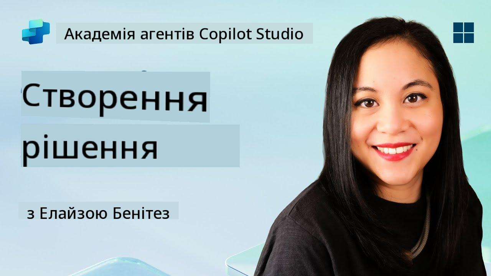](https://www.youtube.com/watch?v=1iATbkgfcpU "Перегляньте відео-інструкцію на YouTube")

## 🎯 Опис місії

Творець агентів, ласкаво просимо до вашої наступної тактичної операції. У цій місії ви навчитеся створювати Рішення - офіційний засіб розгортання для вашого агента служби підтримки IT, створеного за допомогою Microsoft Copilot Studio. Уявіть це як створення цифрового портфеля, який містить вашого агента та його артефакти.

Кожному агенту потрібен добре структурований дім. Саме це забезпечує рішення Power Platform - порядок, портативність і готовність до виробництва.

Давайте почнемо пакування.

## 🔎 Цілі

У цій місії ви навчитеся:

1. Розуміти, що таке рішення Power Platform і їх роль у розробці агентів
1. Дізнатися про переваги використання рішень для організації та розгортання агентів
1. Дослідити видавців рішень і їх важливість у управлінні компонентами
1. Розуміти життєвий цикл рішень Power Platform від розробки до виробництва
1. Створити власного видавця рішень і власне рішення для вашого агента служби підтримки IT

## 🕵🏻‍♀️ Рішення? Що це?

У Microsoft Power Platform рішення - це як контейнери або пакети, які містять усі частини ваших додатків або агентів - це можуть бути таблиці, форми, потоки та власна логіка. Рішення є важливими для управління життєвим циклом додатків (ALM), вони дозволяють вам керувати вашим додатком і агентами від ідеї до розробки, тестування, розгортання та оновлень.

У Copilot Studio кожен агент, якого ви створюєте, зберігається в рішенні Power Platform. За замовчуванням агенти створюються в стандартному рішенні, якщо ви не створите нове власне рішення для створення вашого агента. Це те, чому ми навчимося 🤓 у цьому уроці та практичній лабораторії.

Рішення традиційно створювалися в **порталі розробника Power Apps** - веб-інтерфейсі, де ви можете створювати та налаштовувати додатки, Dataverse, потоки, досліджувати AI-компоненти та багато іншого.

   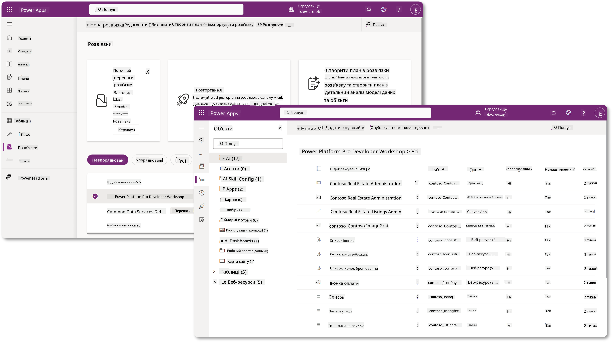

У Copilot Studio тепер є **Solution Explorer**, де ви можете керувати своїми рішеннями безпосередньо. Вам більше не потрібно переходити до порталу розробника Power Apps для управління вашими рішеннями, це можна зробити прямо в Copilot Studio 🪄

Це означає, що ви можете виконувати звичайні завдання, пов'язані з рішеннями:

- **Створити рішення** - власні рішення дозволяють експорт і імпорт агентів між середовищами.
- **Встановити бажане рішення** - виберіть рішення, в якому за замовчуванням будуть створюватися агенти, додатки тощо.
- **Додати або видалити компоненти** - ваш агент може посилатися на інші компоненти, такі як змінні середовища або хмарні потоки. Тому ці компоненти потрібно включити в рішення.
- **Експорт рішень** - для переміщення рішень до іншого цільового середовища.
- **Імпорт рішень** - імпорт рішень, створених в іншому місці, включаючи оновлення або модернізацію рішень.
- **Створення та управління конвеєрами рішень** - автоматизація розгортання рішень між середовищами.
- **Інтеграція з Git** - дозволяє розробникам підключати рішення до репозиторіїв Git для контролю версій, співпраці та ALM. Призначено для використання лише в середовищах розробників.

   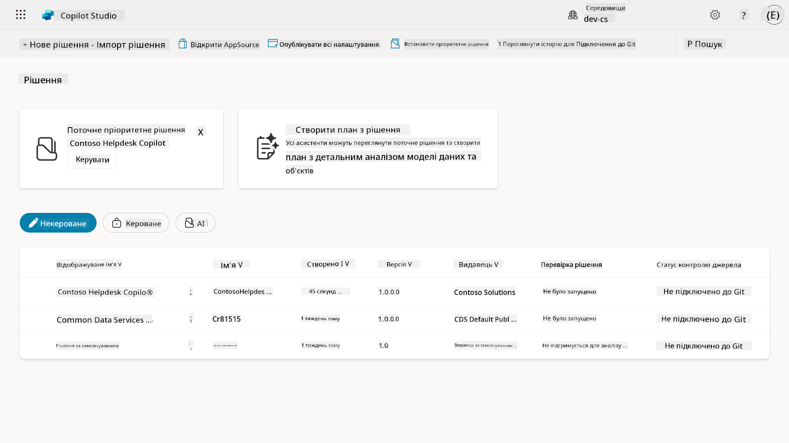

Існує два типи рішень:

- **Некеровані рішення** - використовуються під час розробки. Ви можете вільно редагувати та налаштовувати їх за потреби.
- **Керовані рішення** - використовуються, коли ви готові розгорнути ваш додаток для тестування або виробництва. Вони заблоковані, щоб запобігти випадковим змінам.

## 🤔 Чому _варто_ використовувати рішення для мого агента?

Уявіть рішення як _інструментарій_. Коли вам потрібно виправити або створити щось (агента) в іншому місці (середовищі), ви збираєте всі необхідні інструменти (компоненти) і кладете їх у ваш інструментарій (Рішення). Потім ви можете перенести цей інструментарій до нового місця (середовища) і використовувати інструменти (компоненти) для завершення роботи або додати нові інструменти (компоненти) для налаштування вашого агента або проекту, який ви створюєте.

!!! quote "Елайза, ваш дружній хмарний адвокат, заходить сюди 🙋🏻‍♀️, щоб поділитися кількома словами:"
    У нас в Новій Зеландії є вислів "Будь охайним ківі!", який закликає новозеландців 🥝 брати відповідальність за своє середовище, правильно утилізуючи сміття та підтримуючи чистоту громадських місць. Ми можемо використовувати той самий контекст для агентів, зберігаючи все, що стосується вашого агента, організованим і портативним, і це допоможе вам підтримувати охайне середовище.

Доброю практикою є створення агента у спеціальному рішенні у вашому вихідному (розробницькому) середовищі. Ось чому рішення є цінними:

🧩 **Організована розробка**

- Ви тримаєте вашого агента окремо від стандартного рішення, яке містить усе в середовищі. Усі компоненти вашого агента знаходяться в одному місці 🎯

- Усе, що вам потрібно для вашого агента, знаходиться в рішенні, що полегшує експорт та імпорт до цільового середовища 👉🏻 це здоровий підхід до ALM.

🧩 **Безпечне розгортання**

- Ви можете експортувати ваш додаток або агента як кероване рішення та розгорнути його в інших цільових середовищах (наприклад, тестування або виробництво), не ризикуючи випадковими змінами.

🧩 **Контроль версій**

- Ви можете створювати патчі (цільові виправлення), оновлення (більш комплексні зміни) або модернізації (заміна рішення - зазвичай значні зміни та введення нових функцій).

- Допомагає впроваджувати зміни контрольованим способом.

🧩 **Управління залежностями**

- Рішення відстежують, які частини залежать від інших. Це запобігає порушенню роботи при внесенні змін.

🧩 **Співпраця в команді**

- Розробники та творці можуть працювати разом, використовуючи некеровані рішення під час розробки, а потім передати кероване рішення для розгортання.

## 🪪 Розуміння видавців рішень

Видавець рішень у Power Platform - це як етикетка або бренд, який ідентифікує, хто створив або володіє рішенням. Це невелика, але важлива частина управління вашими додатками, агентами та налаштуваннями потоків, особливо при роботі в командах або між середовищами.

Коли ви створюєте рішення, ви повинні вибрати видавця. Цей видавець визначає:

- Префікс, який додається до всіх власних компонентів (наприклад, таблиць, полів і потоків).

- Ім'я та контактну інформацію організації або особи, яка володіє рішенням.

### 🤔 Чому це важливо?

1. **Легке ідентифікування** - префікс (наприклад, `new_` або `abc_`) допомагає швидко визначити, які компоненти належать до якого рішення або команди.

1. **Запобігання конфліктам** - якщо дві команди створюють колонку з назвою status, їхні префікси (`teamA_status`, `teamB_status`) запобігають конфліктам назв.

1. **Підтримка ALM** - при переміщенні рішень між середовищами (Розробка → Тестування → Виробництво) видавець допомагає відстежувати власність і підтримувати послідовність.

### ✨ Приклад

Уявіть, що ви створюєте видавця під назвою Contoso Solutions з префіксом `cts_`.

Якщо ви додаєте власну колонку під назвою _Priority_, вона буде збережена як `cts_Priority` у рішенні.

Будь-хто, хто зустріне колонку на рівні рішення, незалежно від того, в якому середовищі вони знаходяться, зможе легко визначити, що це колонка, пов'язана з Contoso Solutions.

## 🧭 Життєвий цикл рішення Power Platform

Тепер, коли ви розумієте призначення рішення, давайте дізнаємося про його життєвий цикл.

**1. Створення рішення в середовищі розробки** - почніть зі створення нового рішення у вашому середовищі розробки.

**2. Додайте компоненти** - додайте додатки, потоки, таблиці та інші елементи до вашого рішення.

**3. Експорт як кероване рішення** - упакуйте ваше рішення для розгортання, експортувавши його як кероване рішення.

**4. Імпорт до тестового середовища** - протестуйте ваше рішення в окремому тестовому середовищі, щоб переконатися, що все працює як очікується.

**5. Імпорт до виробничого середовища** - розгорніть протестоване рішення у вашому робочому виробничому середовищі.

**6. Застосуйте патчі, оновлення або модернізації** - внесіть покращення або виправлення за допомогою патчів, оновлень або модернізацій. 🔁 Повторіть цикл!

### ✨ Приклад

Уявіть, що ви створюєте агента служби підтримки IT, щоб допомагати співробітникам з такими проблемами, як проблеми з пристроями, усунення неполадок мережі, налаштування принтера тощо.

- Ви починаєте в середовищі розробки, використовуючи некероване рішення.

- Коли воно готове, ви експортуєте його як кероване рішення та імпортуєте до цільового середовища, такого як Системне тестування або Тестування прийняття користувачем (UAT).

- Після тестування ви переносите його до виробничого середовища - все без змін оригінальної версії розробки.

## 🧪 Лабораторія 04: Створення нового рішення

Зараз ми навчимося:

- [4.1 Як створити видавця рішення](../../../../../docs/recruit/04-creating-a-solution)
- [4.2 Як створити рішення](../../../../../docs/recruit/04-creating-a-solution)

Ми будемо дотримуватися прикладу, наведеного раніше, де ми створимо рішення в спеціальному середовищі Copilot Studio для створення нашого агента служби підтримки IT.

Почнемо!

### Попередні умови

#### Роль безпеки

У Copilot Studio те, що ви _можете робити_ в Solution Explorer, залежить від вашої ролі безпеки користувача.
Якщо у вас немає дозволу на управління рішеннями в центрі адміністрування Power Apps, ви не зможете виконувати ці завдання в Copilot Studio.

Щоб усе працювало гладко, переконайтеся, що у вас є правильні ролі безпеки та дозволи. Або якщо ви не керуєте середовищами у вашій організації, зверніться до вашого IT-адміністратора (або еквівалентної команди), яка керує вашим орендодавцем/середовищами.

Нижче наведені ролі безпеки, які дозволяють користувачам створювати рішення у своєму середовищі.

| Роль безпеки    | Опис |
| ---------- | ---------- |
| Розробник середовища | Надає необхідні дозволи для створення, налаштування та управління ресурсами в конкретному середовищі, включаючи рішення  |
| Системний налаштувальник  | Ширші дозволи, ніж у Розробника середовища, включаючи можливість налаштування середовища та управління ролями безпеки |
| Системний адміністратор   | Найвищий рівень дозволів і може керувати всіма аспектами середовища, включаючи створення та призначення ролей безпеки     |

#### Середовище розробника

Переконайтеся, що ви переключилися на ваше спеціальне середовище розробника, зверніться до [Уроку 00 - Налаштування курсу - Крок 3: Створення нового середовища розробника](../00-course-setup/README.md#step-3-create-new-developer-environment).

1. У верхньому правому куті виберіть значок **Шестерня** і переключіться з середовища за замовчуванням на ваше середовище, наприклад **Середовище Адель Ванс**.

    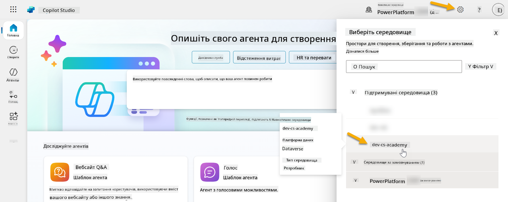

### 4.1 Створення видавця рішення

1. Використовуючи те саме середовище Copilot Studio, яке використовувалося в попередньому уроці, виберіть **значок три крапки (. . .)** у меню зліва в Copilot Studio. Виберіть **Рішення** у розділі **Дослідження**.

    

1. Завантажиться **Solution Explorer** у Copilot Studio. Виберіть **+ Нове рішення**

    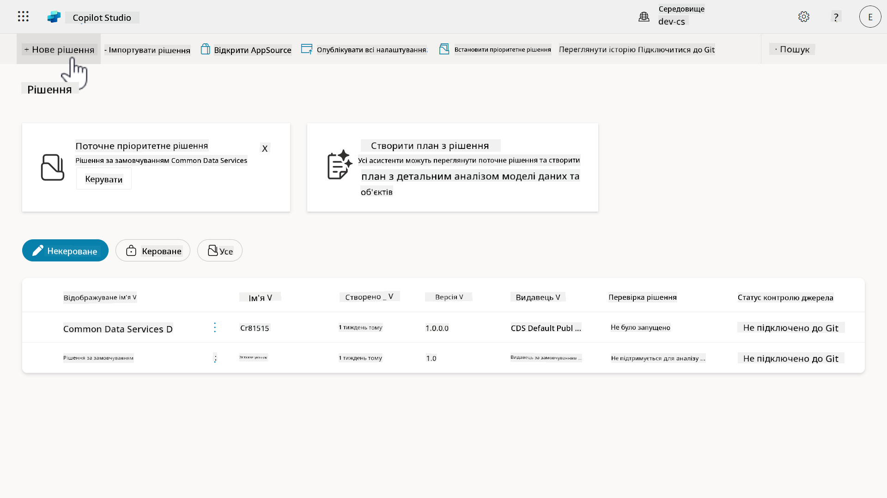

1. З'явиться панель **Нове рішення**, де ми можемо визначити деталі нашого рішення. Спочатку нам потрібно створити нового видавця. Виберіть **+ Новий видавець**.

    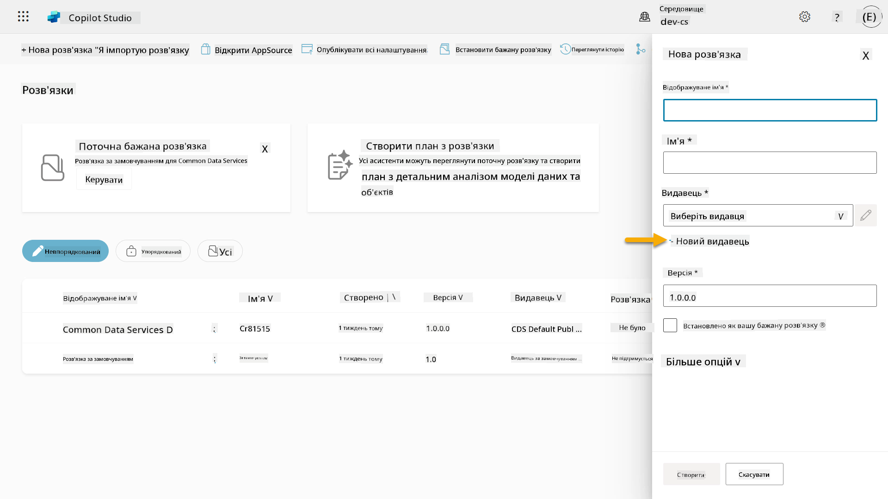  

1. Відкриється вкладка **Властивості** панелі **Новий видавець** з обов'язковими та необов'язковими полями для заповнення у вкладці **Властивості**. Тут ми можемо окреслити деталі видавця, який буде використовуватися як етикетка або бренд, що ідентифікує, хто створив або володіє рішенням.

    | Властивість    | Опис | Обов'язково |
    | ---------- | ---------- | :----------: |
    | Відображуване ім'я | Відображуване ім'я для видавця | Так   |
    | Ім'я  | Унікальне ім'я та ім'я схеми для видавця  | Так    |
    | Опис   | Окреслює мету рішення    | Ні     |
    | Префікс    | Префікс видавця, який буде застосований до новостворених компонентів   | Так      |
    | Префікс значення вибору   | Генерує номер на основі префікса видавця. Цей номер використовується, коли ви додаєте опції до виборів і забезпечує індикатор того, яке рішення було використано для додавання опції.   | Так      |

    Скопіюйте та вставте наступне як **Відображуване ім'я**,

    ```text
    Contoso Solutions
    ```

    Скопіюйте та вставте наступне як **Ім'я**,

    ```text
    ContosoSolutions
    ```

    Скопіюйте та вставте наступне як **Опис**,

    ```text
    Copilot Studio Agent Academy
    ```

    Скопіюйте та вставте наступне для **Преф
1. Панель **Новий видавець** закриється, і ви повернетеся до панелі **Нове рішення**, де буде вибрано щойно створеного Видавця.

    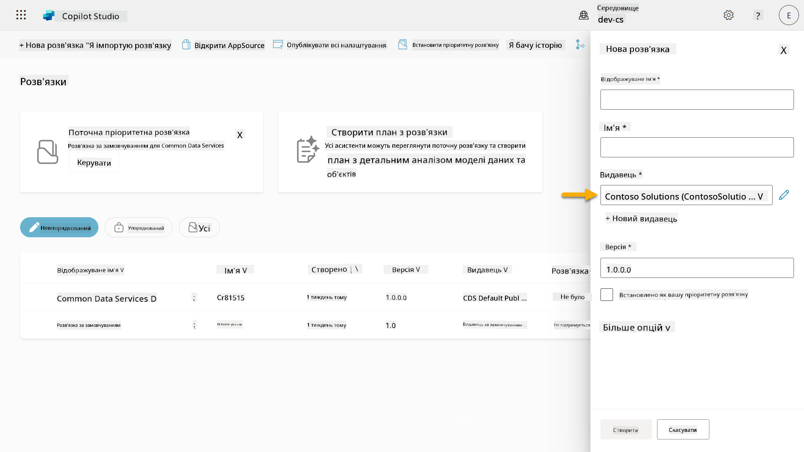  

Вітаю, ви щойно створили Видавця рішень! 🙌🏻 Тепер ми навчимося створювати нове власне рішення.

### 4.2 Створення нового рішення

1. Тепер, коли ми створили наших видавців, можемо заповнити решту форми в панелі **Нове рішення**.

    Скопіюйте та вставте наступне як **Відображуване ім'я**,

    ```text
    Contoso Helpdesk Agent
    ```

    Скопіюйте та вставте наступне як **Ім'я**,

    ```text
    ContosoHelpdeskAgent
    ```

    Оскільки ми створюємо нове рішення, [**Номер версії**](https://learn.microsoft.com/power-apps/maker/data-platform/update-solutions#understanding-version-numbers-for-updates/?WT.mc_id=power-172615-ebenitez) за замовчуванням буде `1.0.0.0`.

    Поставте галочку в полі **Встановити як ваше пріоритетне рішення**.

    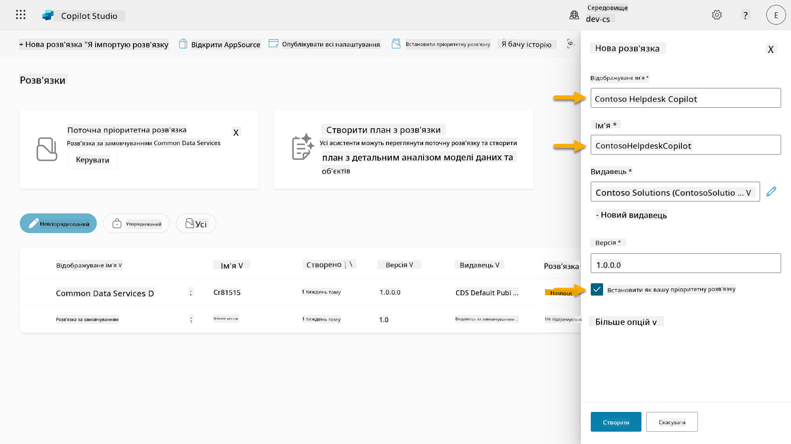  

1. Розгорніть **Додаткові параметри**, щоб побачити додаткові деталі, які можна надати в рішенні.

    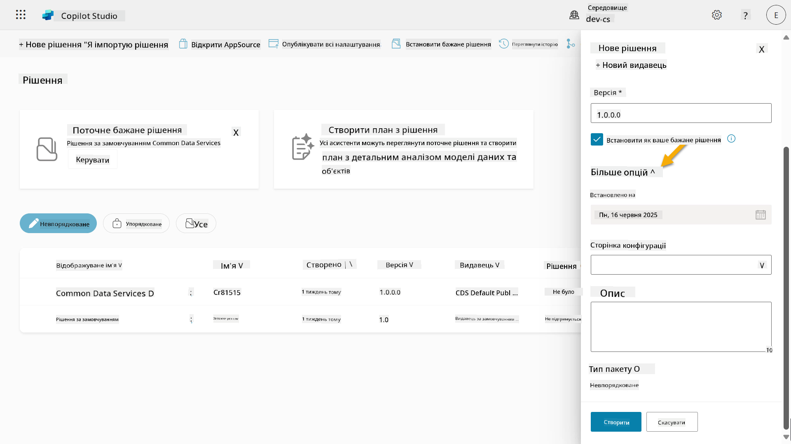

1. Ви побачите наступне:

    - **Встановлено** - дата, коли рішення було встановлено.

    - **Сторінка конфігурації** - розробники налаштовують HTML веб-ресурс, щоб допомогти користувачам взаємодіяти з їх додатком, агентом або інструментом, де він з'являється як веб-сторінка в розділі Інформація з інструкціями або кнопками. Це здебільшого використовується компаніями або розробниками, які створюють і діляться рішеннями з іншими.

    - **Опис** - описує рішення або загальний опис сторінки конфігурації.

    Ми залишимо ці поля порожніми для цього практичного заняття.

    Виберіть **Створити**.

    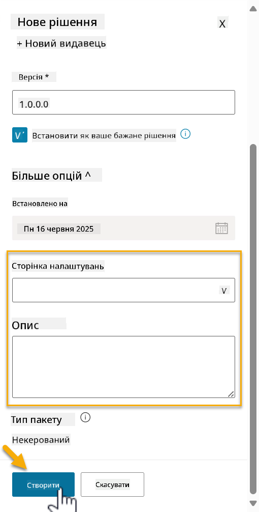

1. Рішення для Contoso Helpdesk Agent тепер створено. Воно не міститиме жодних компонентів, доки ми не створимо агента в Copilot Studio.

    Виберіть значок **стрілки назад**, щоб повернутися до Провідника рішень.

    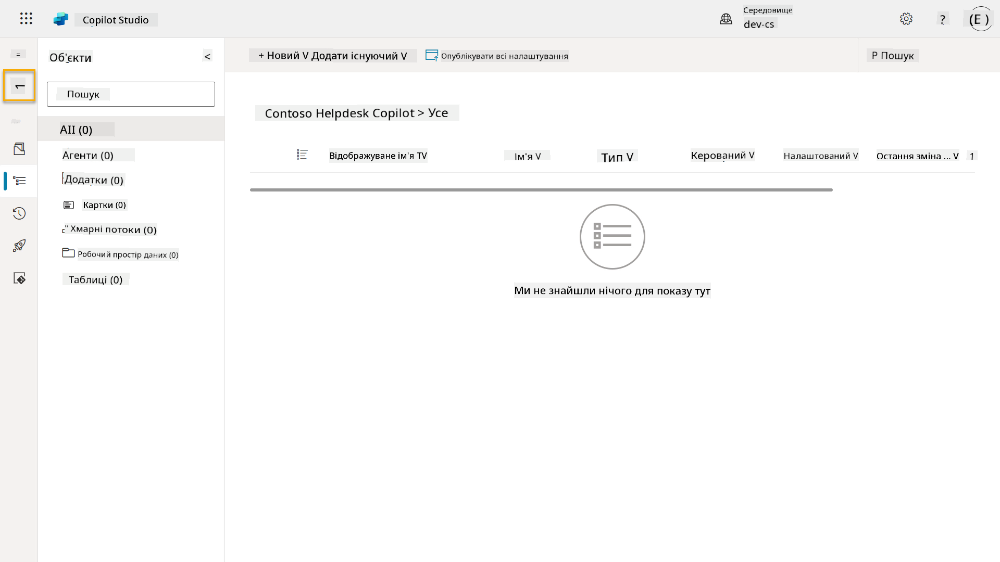

1. Зверніть увагу, що Contoso Helpdesk Agent тепер відображається як **Поточне пріоритетне рішення**, оскільки ми раніше поставили галочку в полі **Встановити як ваше пріоритетне рішення**.

    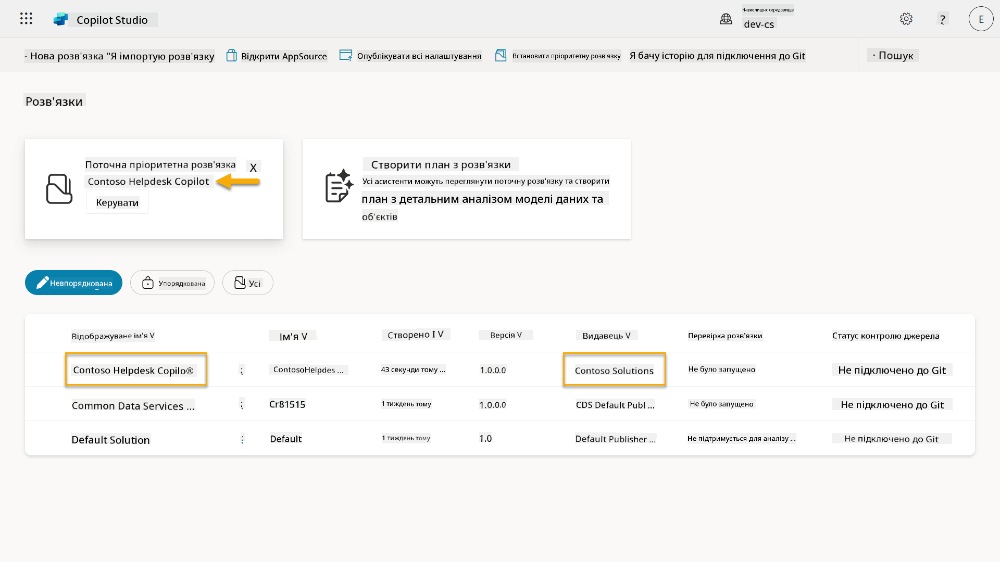

## ✅ Місія виконана

Вітаю! 👏🏻 Ви створили Видавця і використали його у вашому щойно створеному рішенні для створення агента!

Чудова робота, Творцю агентів. Охайний цифровий слід — це перший крок до масштабованої операційної діяльності. Тепер у вас є інструменти та мислення для сталого, готового до підприємства розвитку агентів.

Це кінець **Лабораторії 04 - Створення рішення**, виберіть посилання нижче, щоб перейти до наступного уроку. Рішення, створене в цій лабораторії, буде використано в лабораторії наступного уроку.

⏭️ [Перейти до уроку **Швидкий старт із попередньо створеними агентами**](../05-using-prebuilt-agents/README.md)

## 📚 Тактичні ресурси

🔗 [Створення рішення](https://learn.microsoft.com/power-apps/maker/data-platform/create-solution/?WT.mc_id=power-172615-ebenitez)

🔗 [Створення та управління рішеннями в Copilot Studio](https://learn.microsoft.com/microsoft-copilot-studio/authoring-solutions-overview/?WT.mc_id=power-172615-ebenitez)

🔗 [Спільне використання агентів з іншими користувачами](https://learn.microsoft.com/microsoft-copilot-studio/admin-share-bots/?WT.mc_id=power-172615-ebenitez)

🔗 [Резюме доступних ресурсів для визначених ролей безпеки](https://learn.microsoft.com/power-platform/admin/database-security#summary-of-resources-available-to-predefined-security-roles/?WT.mc_id=power-172615-ebenitez)

🔗 [Оновлення або модернізація рішення](https://learn.microsoft.com/power-apps/maker/data-platform/update-solutions/?WT.mc_id=power-172615-ebenitez)

🔗 [Огляд конвеєрів у Power Platform](https://learn.microsoft.com/power-platform/alm/pipelines/?WT.mc_id=power-172615-ebenitez)

🔗 [Огляд інтеграції Git у Power Platform](https://learn.microsoft.com/power-platform/alm/git-integration/overview/?WT.mc_id=power-172615-ebenitez)


---

**Відмова від відповідальності**:  
Цей документ був перекладений за допомогою сервісу автоматичного перекладу [Co-op Translator](https://github.com/Azure/co-op-translator). Хоча ми прагнемо до точності, будь ласка, майте на увазі, що автоматичні переклади можуть містити помилки або неточності. Оригінальний документ на його рідній мові слід вважати авторитетним джерелом. Для критичної інформації рекомендується професійний людський переклад. Ми не несемо відповідальності за будь-які непорозуміння або неправильні тлумачення, що виникають внаслідок використання цього перекладу.