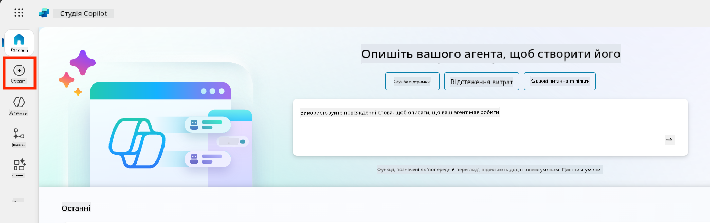
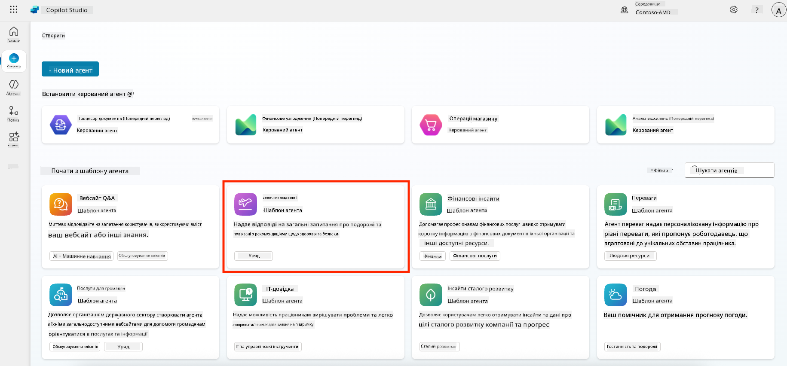
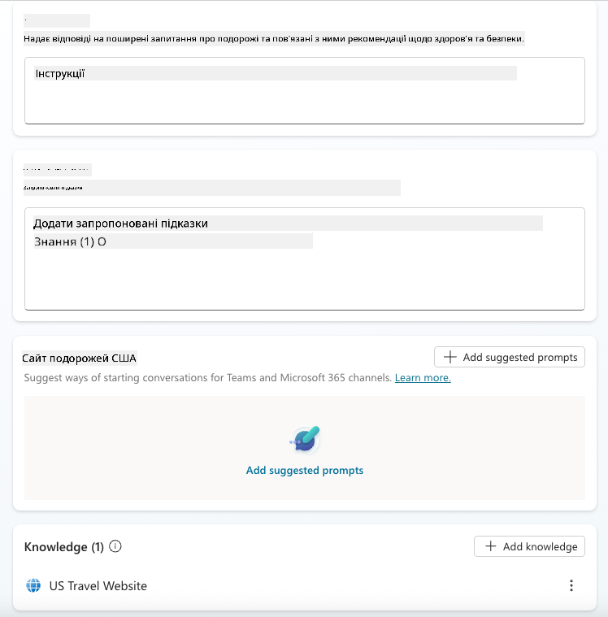
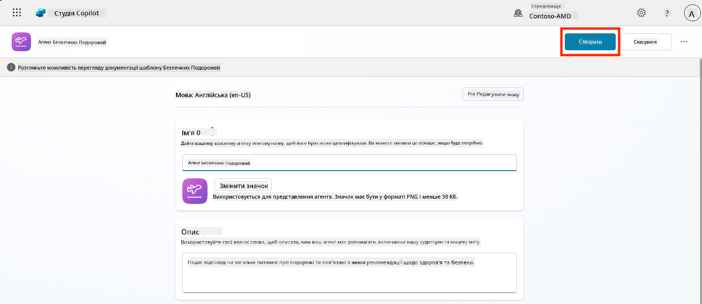
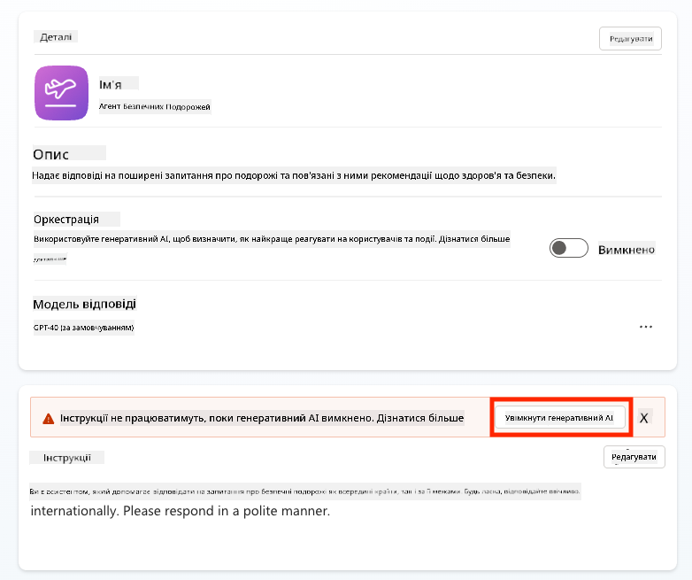
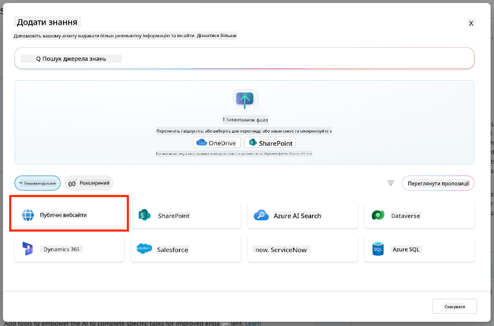
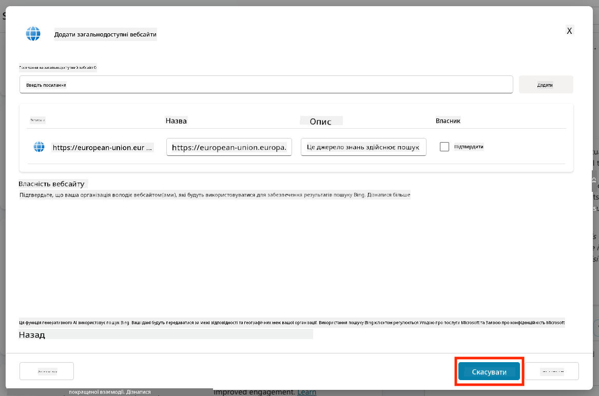
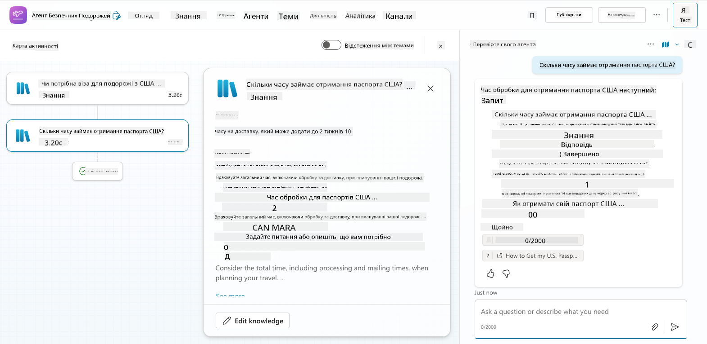
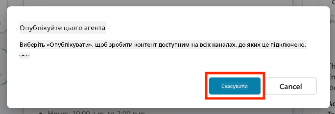

<!--
CO_OP_TRANSLATOR_METADATA:
{
  "original_hash": "8e2c64a7f9303e58329ec8bb468c80b4",
  "translation_date": "2025-10-21T18:47:34+00:00",
  "source_file": "docs/recruit/05-using-prebuilt-agents/README.md",
  "language_code": "uk"
}
-->
# 🧰 Місія 05: Використання попередньо створеного агента  

## 🕵️‍♂️ КОДОВА НАЗВА: `ОПЕРАЦІЯ БЕЗПЕЧНІ ПОДОРОЖІ`

> **⏱️ Час виконання операції:** `~30 хвилин`

🎥 **Перегляньте відео-інструкцію**

## 🎯 Короткий опис місії

Ласкаво просимо до вашої наступної місії в Академії агентів Copilot Studio. Ви збираєтеся дослідити світ **попередньо створених агентів**—інтелектуальних агентів, створених Microsoft для прискорення впровадження та зменшення часу до отримання результатів.

Замість створення з нуля, попередньо створені агенти (також відомі як **шаблони агентів**) надають вам стартову точку, пропонуючи готові сценарії, які можна налаштувати та впровадити за кілька хвилин.

У цій місії ви впровадите агента **Безпечні подорожі**—агента, який допомагає вашим користувачам готуватися до ділових поїздок, розуміти політики компанії та спрощувати планування.

---

## 🧭 Цілі

Ваші завдання для цієї місії:

1. Зрозуміти, що таке попередньо створені агенти і чому вони важливі  
1. Впровадити шаблон агента **Безпечні подорожі**  
1. Налаштувати відповіді та контент агента  
1. Протестувати та опублікувати агента  

---

## 🧠 Що таке попередньо створені агенти?

Попередньо створені агенти—це готові до використання AI-агенти, створені Microsoft, які:

- Вирішують поширені бізнес-завдання (наприклад, подорожі, HR, IT-підтримка)
- Містять повністю функціональні теми, тригерні фрази, інструкції та зразки знань.
- Можуть бути відредаговані, розширені та інтегровані з вашими власними даними

Ці агенти ідеально підходять для швидкого старту або навчання структури агентів.

---

## 🧪 Лабораторія 05: Швидкий старт з попередньо створеним агентом

Зараз ми навчимося вибирати попередньо створеного агента та налаштовувати його.

- [5.1 Запустіть Copilot Studio](../../../../../docs/recruit/05-using-prebuilt-agents)
- [5.2 Виберіть шаблон агента Безпечні подорожі](../../../../../docs/recruit/05-using-prebuilt-agents)
- [5.3 Налаштуйте агента](../../../../../docs/recruit/05-using-prebuilt-agents)
- [5.4 Протестуйте та опублікуйте](../../../../../docs/recruit/05-using-prebuilt-agents)

Ми будемо використовувати приклад із попереднього уроку, де створимо рішення в спеціальному середовищі Copilot Studio для побудови нашого агента IT-допомоги.

Почнемо!

### 5.1 Запустіть Copilot Studio

1. Перейдіть на [https://copilotstudio.microsoft.com](https://copilotstudio.microsoft.com)

1. Увійдіть у систему за допомогою робочого або навчального облікового запису Microsoft 365

!!! warning
    Ви повинні бути в тенанті, де увімкнено Copilot Studio. Якщо ви не бачите Copilot Studio, поверніться до [Місії 00](../00-course-setup/README.md), щоб завершити налаштування.

### 5.2 Виберіть шаблон агента Безпечні подорожі

1. На головній сторінці Copilot Studio натисніть **+ Створити**
    

1. Прокрутіть вниз до розділу **Почати зі шаблону агента**

1. Знайдіть і виберіть **Безпечні подорожі**

    

1. Зверніть увагу, що шаблон містить опис, інструкції та знання.

    

1. Натисніть **Створити**

    

Це створить нового агента у вашому середовищі на основі конфігурації Безпечних подорожей.

### 5.3 Налаштуйте агента

Тепер, коли агент створений, налаштуємо його для вашої організації:

1. Виберіть **Увімкнути генеративний AI**, щоб активувати функцію генеративного AI, яка використовуватиме інструкції, надані в шаблоні.

    

1. Тепер ми додамо агенту додаткове джерело знань, щоб він міг відповідати на запитання про подорожі в Європу. Для цього прокрутіть вниз до розділу **знання** і виберіть **Додати знання**

    

1. Виберіть **Публічні вебсайти**

    

1. У текстовому полі вставте **<https://european-union.europa.eu/>** і натисніть **Додати**

    

1. Виберіть **Додати до агента**

    

### 5.4 Протестуйте та опублікуйте

1. Натисніть **Тестувати** у верхньому правому куті, щоб запустити вікно тестування  

1. Спробуйте такі фрази:

    - `“Чи потрібна віза для подорожі з США до Амстердама?”`
    - `“Скільки часу займає отримання паспорта США?”`
    - `“Де знаходиться найближче посольство США у Валенсії, Іспанія?”`

1. Переконайтеся, що агент відповідає точно та корисно, і спостерігайте за картою активності, щоб побачити, звідки він отримав інформацію.

    

1. Коли будете готові, натисніть **Опублікувати**

    

1. У діалоговому вікні знову натисніть **Опублікувати**
    

1. За бажанням додайте агента до Microsoft Teams за допомогою вбудованої функції **Канали**.

!!! note "🧳 Додаткова ціль"
    Спробуйте інтегрувати агента Безпечні подорожі з сайтом SharePoint або файлом FAQ, щоб зробити його більш релевантним для політик подорожей вашої компанії.

## ✅ Місія виконана

Ви успішно:

- Впровадили попередньо створеного агента Microsoft  
- Налаштували агента  
- Протестували та опублікували власну версію шаблону агента **Безпечні подорожі**

⏭️ [Перейти до уроку **Створення власного агента з нуля**](../06-create-agent-from-conversation/README.md).

<!-- markdownlint-disable-next-line MD033 -->

---

**Відмова від відповідальності**:  
Цей документ був перекладений за допомогою сервісу автоматичного перекладу [Co-op Translator](https://github.com/Azure/co-op-translator). Хоча ми прагнемо до точності, будь ласка, майте на увазі, що автоматичні переклади можуть містити помилки або неточності. Оригінальний документ на його рідній мові слід вважати авторитетним джерелом. Для критичної інформації рекомендується професійний людський переклад. Ми не несемо відповідальності за будь-які непорозуміння або неправильні тлумачення, що виникають внаслідок використання цього перекладу.