<!--
CO_OP_TRANSLATOR_METADATA:
{
  "original_hash": "dcbcd9396b076da0a0f5d389e9ec1b12",
  "translation_date": "2025-10-21T18:49:26+00:00",
  "source_file": "docs/recruit/08-add-adaptive-card/README.md",
  "language_code": "uk"
}
-->
# 🚨 Місія 08: Покращення взаємодії користувачів у Темах за допомогою Адаптивних Карток

## 🕵️‍♂️ КОДОВА НАЗВА: `ОПЕРАЦІЯ ПІДЙОМ ІНТЕРФЕЙСУ`

> **⏱️ Час виконання операції:** `~45 хвилин`

🎥 **Перегляньте відео-інструкцію**

[](https://www.youtube.com/watch?v=RhIlzYHPCXo "Перегляньте відео-інструкцію на YouTube")

## 🎯 Короткий опис місії

Агенти, ваша місія — проникнути в статичний користувацький досвід і замінити його на багаті, динамічні та інтерактивні Адаптивні Картки. Ви будете використовувати JSON-пакети та формули Power Fx, щоб перетворити розмови в Copilot Studio з простих питань і відповідей на повноцінні інтерактивні взаємодії. Ваша мета — збирати дані від користувачів, красиво представляти інформацію та керувати розмовами з точністю та стилем. Якщо ви не адаптуєтеся, ваші користувачі можуть перейти до менш інтелектуальних інтерфейсів.

## 🔎 Цілі

У цій місії ви навчитеся:

1. Розуміти, що таке Адаптивні Картки і як вони покращують взаємодію користувачів у Copilot Studio.
1. Створювати інтерактивні картки за допомогою JSON і формул Power Fx для динамічного контенту.
1. Досліджувати Дизайнер Адаптивних Карток і його ключові компоненти для створення візуальних карток.
1. Створювати багаті, інтерактивні форми та досвід збору даних у темах агентів.
1. Впроваджувати найкращі практики для створення адаптивних і зручних для користувача карток.

## 🤔 Що таке Адаптивна Картка?

**Адаптивна Картка** — це спосіб створення інтерактивних, візуально багатих елементів інтерфейсу, які можна вбудовувати в додатки, такі як Microsoft Teams, Microsoft Outlook або агенти. Це структурований об'єкт JSON, який визначає макет і вміст картки:

- Які елементи з'являються на картці — текст, зображення, кнопки.
- Як ці елементи розташовані.
- Які дії можуть виконувати користувачі, наприклад, надсилати форму або відкривати посилання.

    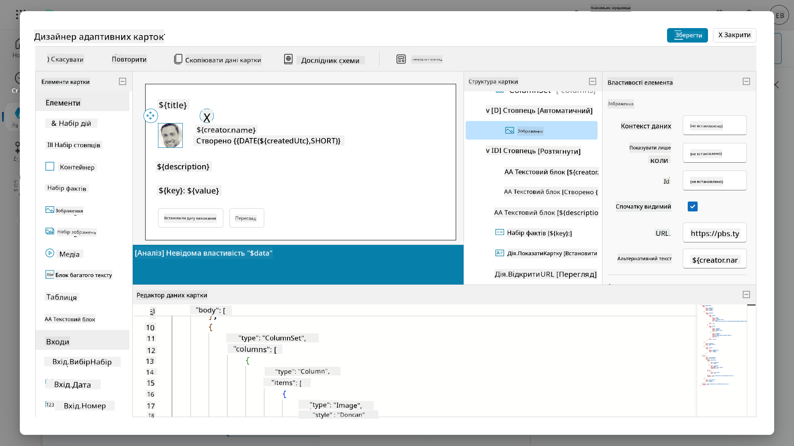

### Чому Адаптивні Картки важливі в Copilot Studio

Уявіть, що ви створюєте агента, який запитує у користувачів їхнє ім'я, електронну пошту або відгук. Якщо ви просто використовуєте текст, розмова може здатися нудною або важкою для сприйняття. Тут на допомогу приходять Адаптивні Картки!

1. **Роблять розмови інтерактивними** — замість того, щоб надсилати текстові повідомлення користувачеві, ви можете показувати кнопки, форми, зображення тощо.
    - Приклад: картка може попросити користувача заповнити своє ім'я та електронну пошту у зручній формі.

1. **Виглядають чудово всюди** — Адаптивні Картки автоматично підлаштовуються під стиль додатка, в якому вони знаходяться, наприклад, Microsoft 365 Copilot chat або Microsoft Teams. Вам не потрібно турбуватися про темний режим, шрифти чи макети — вони адаптуються.

1. **Легко створюються за допомогою JSON** — ви визначаєте картку за допомогою JSON-коду (подумайте про це як про _рецепт_ для інтерфейсу). Copilot Studio допомагає вам попередньо переглянути вашу картку перед додаванням її до теми.

1. **Збирають і використовують дані** — ви можете використовувати картку для запитань, збору відповідей і використання цих даних у потоці розмови.
    - Приклад: Запитайте номер телефону користувача, а потім покажіть картку підтвердження з його номером телефону.

1. **Покращують користувацький досвід** — картки роблять вашого агента більш інтерактивним. Це більш чистий, клікабельний і зручний для користувача тип інтерфейсу.

## 🐱 JSON — це людина?

Вимовляється як "Джейсон", але це не людина 😅

JSON, також відомий як _JavaScript Object Notation_, — це легкий формат, який використовується для структурування даних. Його легко читати і писати, і він виглядає як серія пар ключ-значення всередині фігурних дужок {}.

Це один із варіантів використання при додаванні адаптивної картки до вашої теми.

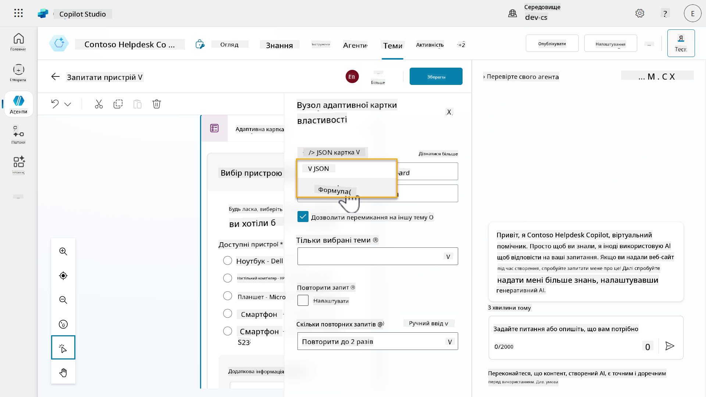

## 👀 Я бачу ще один варіант створення адаптивної картки за допомогою _формули_

Пам'ятаєте, як ми вивчали Power Fx у [Місії 07 - Використання Power Fx у ваших вузлах](../07-add-new-topic-with-trigger/README.md#what-power-fx-can-do-in-topics)? Те ж саме можна застосувати до Адаптивних Карток у Copilot Studio.

Як нагадування,

!!! note
    Power Fx — це мова програмування з низьким рівнем коду, яка використовується для додавання логіки та динамічної поведінки до вашого агента. Це та ж мова, що використовується в Microsoft Power Apps, і вона розроблена так, щоб бути простою та схожою на Excel, що робить її легкою для розробників і не тільки.

### Як Power Fx працює в Адаптивних Картках

Коли ви створюєте Адаптивну Картку в Copilot Studio, ви можете використовувати формули Power Fx для:

- Динамічного вставлення значень, таких як імена користувачів, дати або статус.
- Форматування тексту або чисел, наприклад, показ валюти або округлення чисел.
- Показу або приховування елементів на основі умов.
- Налаштування відповідей на основі введення користувача, змінних, результатів вузлів розмови.

Наприклад,

"`Привіт`" & `System.User.DisplayName`

Ця формула динамічно об'єднує слово "Привіт" з ім'ям користувача.

### Чому це корисно

1. **Персоналізація**

    Ви можете адаптувати повідомлення для кожного користувача, роблячи взаємодії більш природними та релевантними.

1. **Динамічний контент**

    Картки можуть показувати реальні дані зі змінних і результатів вузлів розмови.

1. **Розумна логіка**

    Ви можете контролювати, що користувачі бачать або з чим взаємодіють на основі умов, покращуючи зручність використання та зменшуючи помилки.

1. **Зручність для низького рівня коду**

    Power Fx — це мова програмування з низьким рівнем коду. Як згадувалося раніше, вона читабельна, інтуїтивно зрозуміла і схожа на формули Excel.

## 👷🏻‍♀️ Створення за допомогою Дизайнера Адаптивних Карток

**Дизайнер Адаптивних Карток** — це візуальний інструмент, який дозволяє створювати інтерактивні картки повідомлень за допомогою елементів перетягування, таких як текст, зображення, кнопки та введення. Його мета — допомогти вам створювати багаті, динамічні повідомлення без написання складного коду, що спрощує створення зручних для користувача інтерфейсів.

Інструмент дизайнера допомагає вам створювати картку візуально, але за лаштунками він генерує для вас JSON-об'єкт. Ви також можете переключитися на _формулу_, яка дозволяє використовувати вирази Power Fx у картці для відображення даних з інших джерел.

## 🎨 Розуміння Дизайнера Адаптивних Карток

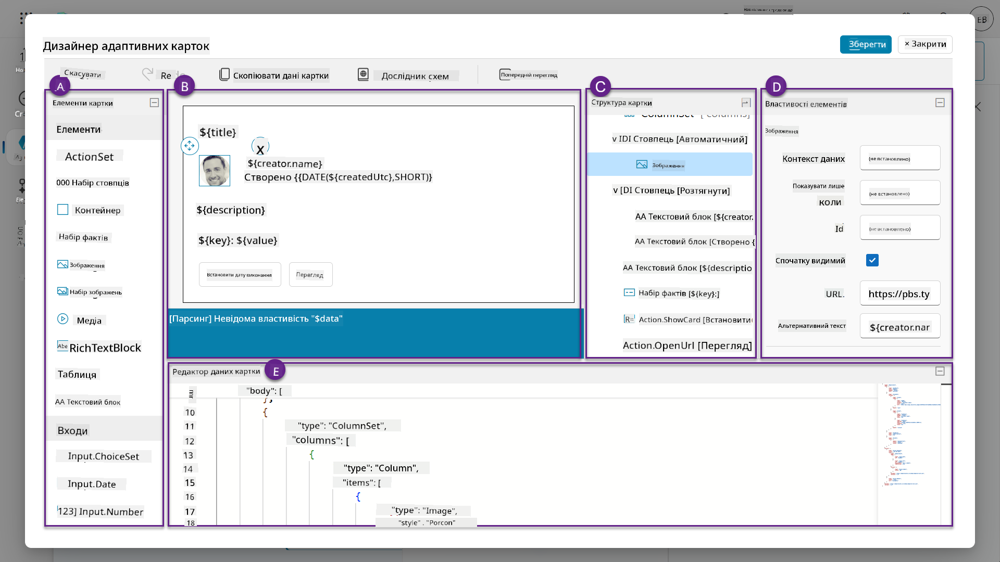

### A) Елементи картки

Це будівельні блоки вашої адаптивної картки. Ви можете перетягувати такі елементи:

- **TextBlock** для відображення тексту.
- **Image** для показу зображень.
- **FactSet** для пар ключ-значення.
- **Поля введення** для відображення текстових полів, вибору дат, перемикачів.
- **Дії** для відображення кнопок, таких як _Submit_, _Open URL_ або _Show Card_.

Кожен елемент має своє призначення і може бути стилізований або налаштований.

### B) Перегляд картки

Це **область попереднього перегляду**, де ви бачите, як ваша картка виглядатиме в реальному часі. Коли ви додаєте або редагуєте елементи, перегляд оновлюється миттєво, щоб відобразити зміни. Це дозволяє вам робити ітеративні оновлення і одночасно бачити результат дизайну.

### C) Структура картки

Це показує **ієрархію та макет** вашої картки. Наприклад:

- Картка може починатися з **TextBlock** для заголовка.
- Потім **ColumnSet** із зображенням з одного боку і текстом з іншого.
- Далі **FactSet** і кілька **кнопок дій**.

Це допомагає вам зрозуміти, як елементи вкладені та організовані.

### D) Властивості елементів

Коли ви натискаєте на будь-який елемент картки, ця панель дозволяє вам **налаштувати його параметри**:

- Змінити розмір тексту, вагу або колір.
- Встановити URL-адреси зображень або альтернативний текст.
- Налаштувати параметри введення, такі як текст-заповнювач або значення за замовчуванням.

Тут ви тонко налаштовуєте кожен елемент.

### E) Редактор JSON-коду картки

Це **сирий JSON-код**, який лежить в основі вашої картки. Досвідчені користувачі можуть редагувати його безпосередньо для:

- Використання функцій шаблонів.
- Копіювання/вставки визначень карток.

Навіть якщо ви новачок у Дизайнері Адаптивних Карток, корисно бачити, як візуальний дизайн перетворюється на код.

!!! tip "Порада - Ознайомтеся з прикладами Адаптивних Карток"

    1. Перейдіть на [https://adaptivecards.microsoft.com/designer](https://adaptivecards.microsoft.com/designer).
    2. Виберіть **New card**, щоб побачити список зразків, які ви можете вибрати та змінити.
    3. Зверніть увагу, що цей дизайнер є зовнішнім (веб-орієнтованим). Коли ви створюєте свою картку у веб-дизайнері Адаптивних Карток, скопіюйте JSON із Редактора JSON-коду картки.
    4. Вставте JSON у вашу адаптивну картку в агенті в Copilot Studio.

    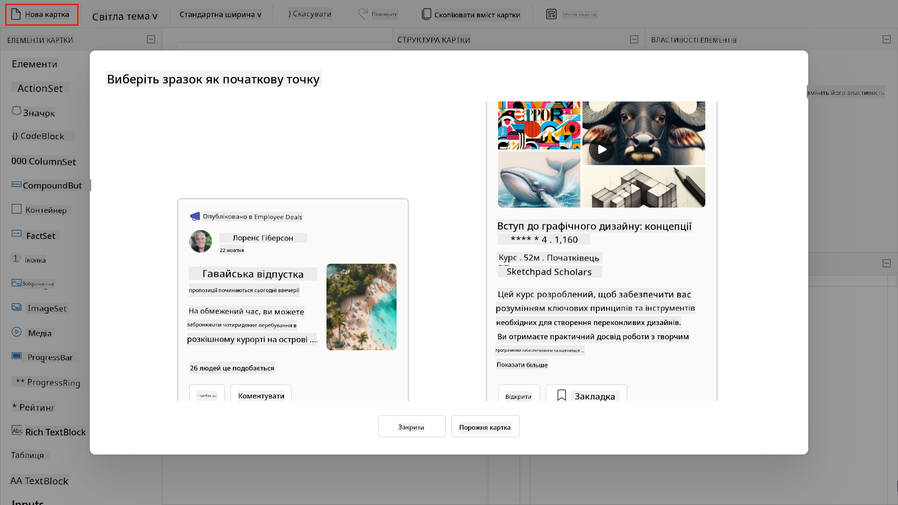

## 🌵 Загальні випадки використання

Нижче наведені загальні випадки використання Адаптивних Карток у Copilot Studio, коли вони використовуються у вузлах **Надіслати повідомлення** або **Задати питання**.

1. **Форми та збір даних**

    Використовуйте адаптивні картки для збору структурованих даних від користувачів, таких як:

    - Запити на відпустку.
    - Форми зворотного зв'язку.
    - Контактна інформація.
    - Планування зустрічей.

1. **Відображення динамічної інформації**

    Показує користувачам персоналізовані або реальні дані у чистому, читабельному форматі з корпоративних джерел, таких як ServiceNow, SAP, Dynamics 365, SharePoint тощо.

    - Резюме замовлень.
    - Баланс рахунку.
    - Статус квитка або справи.
    - Майбутні події або дедлайни.

1. **Інтерактивні вибори**

    Дозволяє користувачам робити вибір прямо в розмові:

    - Вибір зі списку опцій, наприклад, категорії продуктів, теми підтримки.
    - Підтвердження або скасування дії.
    - Оцінка послуги або досвіду.

1. **Запуск дій**

    Включає кнопки, які запускають подальші кроки в розмові внутрішньо або зовнішньо.

    - "Надіслати запит".
    - "Переглянути деталі".

## ⭐ Найкращі практики

Ось кілька найкращих практик для створення Адаптивних Карток для агентів у Copilot Studio.

1. **Тримайте все просто і зосереджено**

    - Проектуйте картки з чіткою метою, не перевантажуйте їх занадто великою кількістю елементів.
    - Використовуйте лаконічний текст і інтуїтивно зрозумілі макети, щоб направляти користувачів через взаємодію.

1. **Будьте уважними до введення**

    - Включайте лише необхідні елементи введення, такі як текст, вибір дати, щоб не перевантажувати користувачів.
    - Використовуйте мітки, щоб зробити введення легким для розуміння.

1. **Структуруйте для читабельності**

    - Використовуйте **TextBlocks** для заголовків і інструкцій.
    - Групуйте пов'язані елементи за допомогою **Containers** або **ColumnSets**, щоб покращити візуальний потік.

1. **Зробіть елементи дій зрозумілими**

    - Використовуйте **Action.Submit** або **Action.OpenUrl** із чіткими назвами кнопок, такими як "Надіслати запит" або "Переглянути деталі".
    - Уникайте нечітких міток, таких як "Натисніть тут".

1. **Проектуйте для адаптивності**

    - Припускайте, що картка може бути переглянута на різних розмірах екрана.
    - Уникайте фіксованих ширин і використовуйте гнучкі макети, такі як **ColumnSets**, для адаптивності.

1. **Використовуйте динамічний контент, коли це можливо**

    - Прив'язуйте елементи картки до змінних або результатів вузлів за допомогою Power Fx, щоб персоналізувати користувацький досвід.
    - Наприклад, динамічно показуйте ім'я користувача або поточний статус.

## 🧪 Лабораторія 08 - Додайте адаптивні картки та покращте можливості теми

Тепер ми навчимося покращувати нашу тему за допомогою адаптивних карток і використання розширених функцій тем і вузлів.

- [8.1 Створіть нову тему з адаптивною карткою для користувача, щоб надіслати свій запит](../../../../../docs/recruit/08-add-adaptive-card)
- [8.2 Оновіть інструкції агента для виклику теми Запит пристрою](../../../../../docs/recruit/08-add-adaptive-card)

### ✨ Випадок використання

**Як** співробітник

**Я хочу** запросити пристрій

**Щоб я міг** запросити пристрій зі списку доступних пристроїв

Почнемо!

### Передумови

1. **Список SharePoint**

    Ми будемо використовувати список **Devices** SharePoint із [Уроку 00 - Налаштування курсу - Крок 3: Створіть новий сайт SharePoint](../00-course-setup/README
1. Далі додайте вузол **Ask with adaptive card**. Цей вузол відображатиме інтерактивну картку, щоб користувач міг вибрати пристрій, який він хоче запросити.

    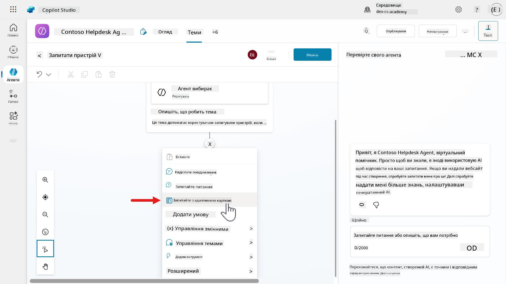

1. Виберіть вузол, і з'явиться панель **Adaptive Card Node properties**. Тепер ми будемо редагувати JSON. Виберіть **Edit adaptive card**. Виберіть **Edit adaptive card**.

    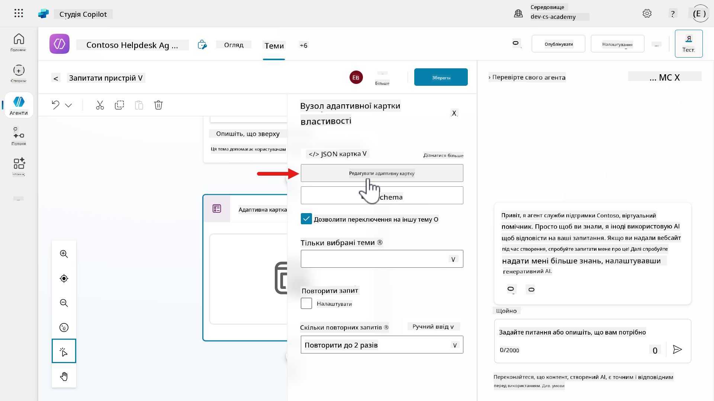

1. Це **Adaptive Card Designer**, де ви можете створювати свою картку та бачити її дизайн у реальному часі.

    Спробуйте перетягнути елементи картки **TextBlock** і **FactSet** на полотно для створення, область перегляду картки. Зверніть увагу, як оновлюється структура картки та редактор JSON, коли додаються ці два елементи картки. Ви можете безпосередньо оновлювати редактор JSON і панель властивостей елементів.

    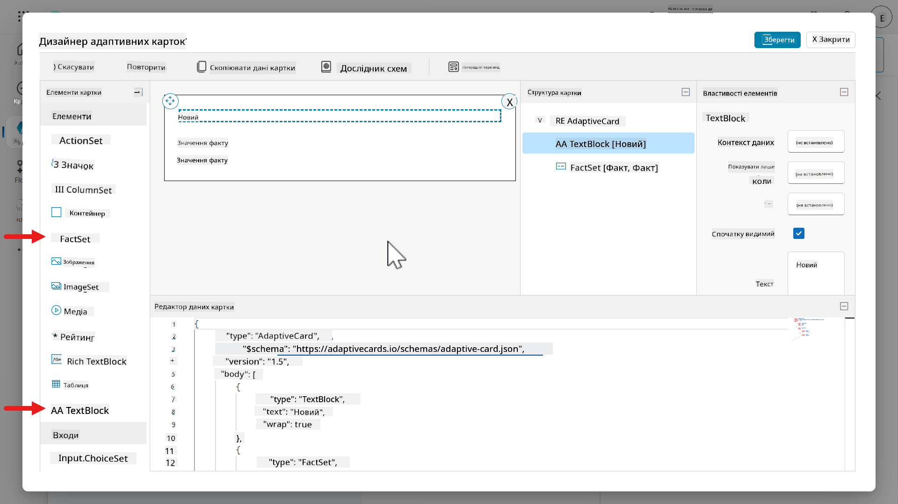

1. Виберіть **Preview**, щоб переглянути картку в різних ширинах.

    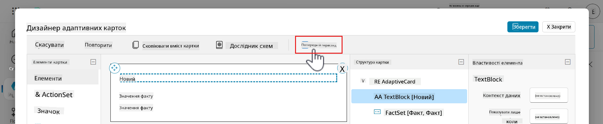

1. У режимі перегляду ви побачите різні варіанти картки залежно від ширини.

    

1. Вийдіть із режиму **Preview**, натиснувши **x icon**, і виберіть **Undo** у дизайнері, щоб видалити два елементи картки, які були додані раніше.

    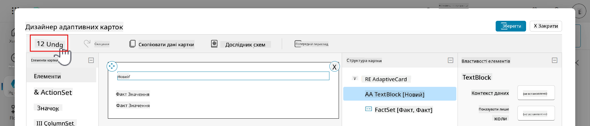

1. Перейдіть до **Card payload editor** і виберіть усі рядки за допомогою комбінації клавіш Windows _Ctrl + A_ або Mac _Command + A_, після чого видаліть рядки. **Вставте** JSON із [Request devices .JSON file](../../../../../docs/recruit/08-add-adaptive-card/assets/8.1_RequestDevice.json).

    

1. Зверніть увагу, як у **Card Preview** тепер з'являються елементи, які відображають текст і список доступних пристроїв.

    Цей JSON наразі є шаблоном і попереднім переглядом того, що ми будемо використовувати як основу для нашої картки, але у формі формули, а не JSON, оскільки ми будемо посилатися на **глобальну змінну**, `Global.VarDevices.value`, яка зберігає відповідь дії **Get items** з'єднувача SharePoint.

    Виберіть **Save** і **Close**, щоб вийти з модального вікна дизайнера адаптивної картки.

    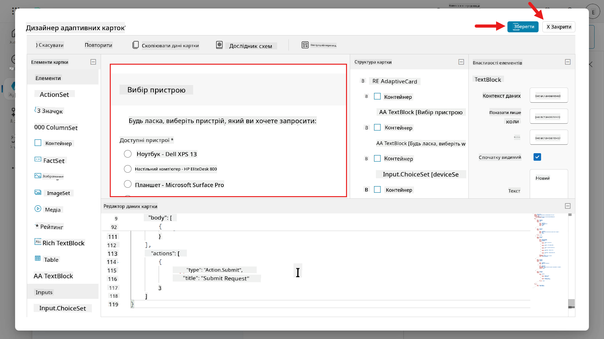

1. Закрийте панель **Adaptive Card Node properties**, натиснувши **X**.

    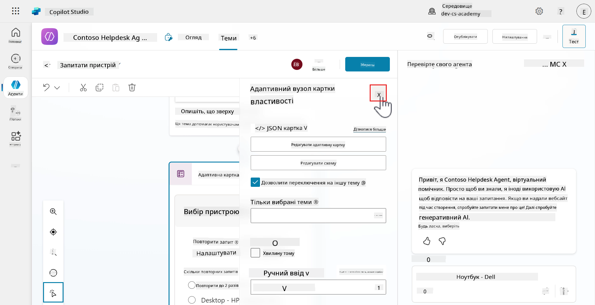

1. На полотні створення теми ви побачите адаптивну картку.

    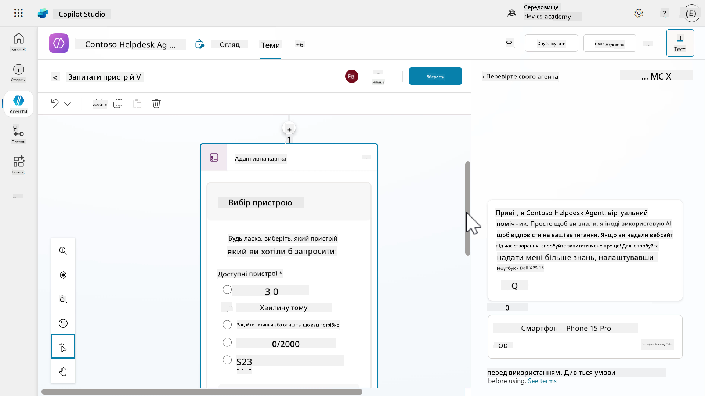

1. Прокрутіть до нижньої частини вузла, і ви побачите вихідні змінні. `commentsId` і `deviceSelectionId` були визначені у властивостях елементів. Ці дві змінні зберігатимуть значення з елементів картки, з якими взаємодіють користувачі. Ці значення будуть використані далі в темі, про що ми дізнаємося в наступному уроці.

    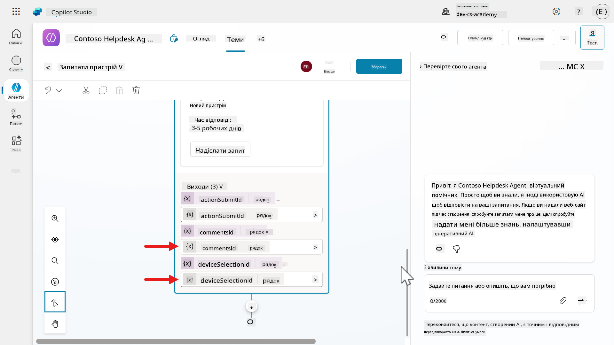

1. Тепер оновимо картку з JSON на формулу, оскільки ми знову будемо використовувати Power Fx для циклічного перегляду елементів, повернутих у дії **Get items** з'єднувача SharePoint, збережених у **глобальній змінній**, `Global.VarDevices.value`, через властивість `value` відповіді JSON.

    > Ми створили цю глобальну змінну в [Lab 07 - Add a new topic with conversation nodes, 7.3 Add a tool using a connector](../07-add-new-topic-with-trigger/README.md#73-add-a-tool-using-a-connector).

    Виберіть картку у вузлі **Ask with Adaptive Card**, потім виберіть **chevron** і виберіть **Formula**.

    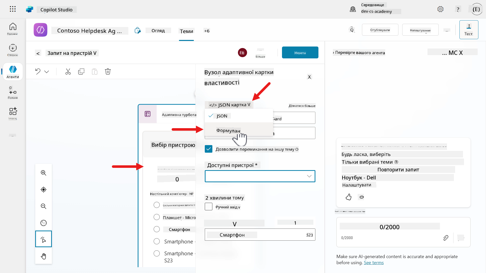

1. Натисніть на **expand** іконку, щоб збільшити поле формули.

    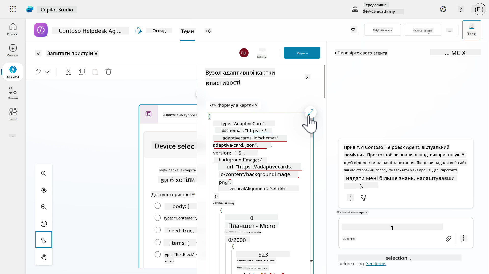

1. Перейдіть до **Card payload editor** і виберіть усі рядки за допомогою комбінації клавіш Windows _Ctrl + A_ або Mac _Command + A_, після чого видаліть рядки.

    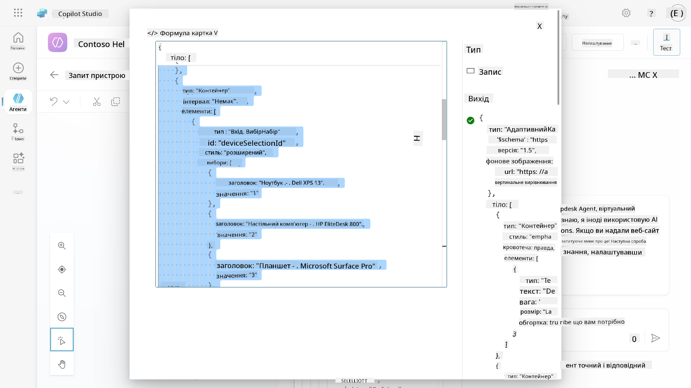

    Вставте формулу з [Request Devices formula file](../../../../../docs/recruit/08-add-adaptive-card/assets/8.1_RequestDeviceFormula.txt).

1. У формулі ми будемо циклічно переглядати кожен елемент списку SharePoint за допомогою функції `For All`, щоб відобразити значення `Model` у заголовку варіанту вибору, а елемент `ID` зі списку SharePoint буде посилатися як значення. Ми також обгортаємо значення функціями `If(IsBlank()`, оскільки формула очікує значення для рендерингу адаптивної картки на полотні створення теми. Інакше з'явиться повідомлення "Property cannot be null".

    **Закрийте** модальне вікно картки.

    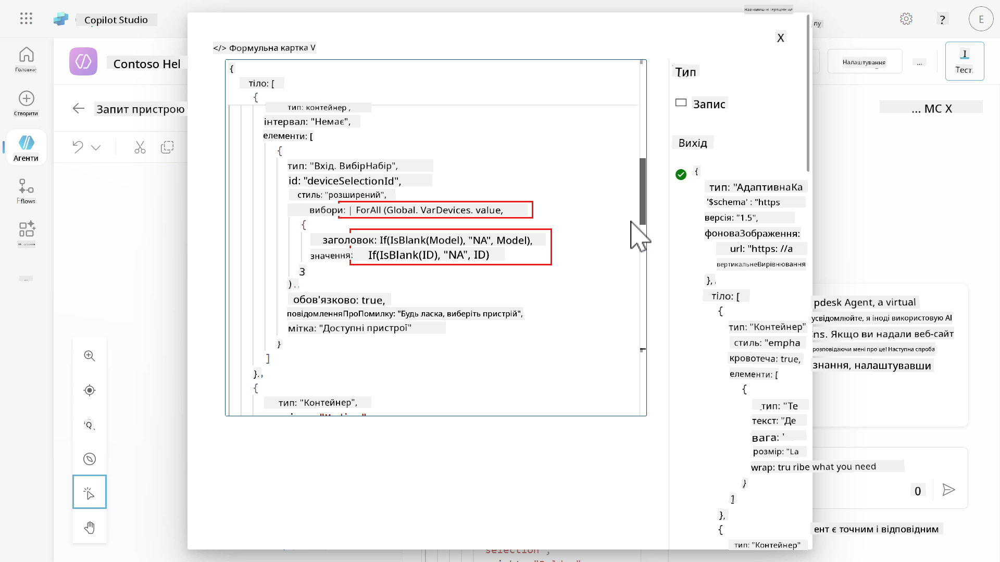

1. **Закрийте** панель **Adaptive Card Node properties**.

1. **Збережіть** тему.

    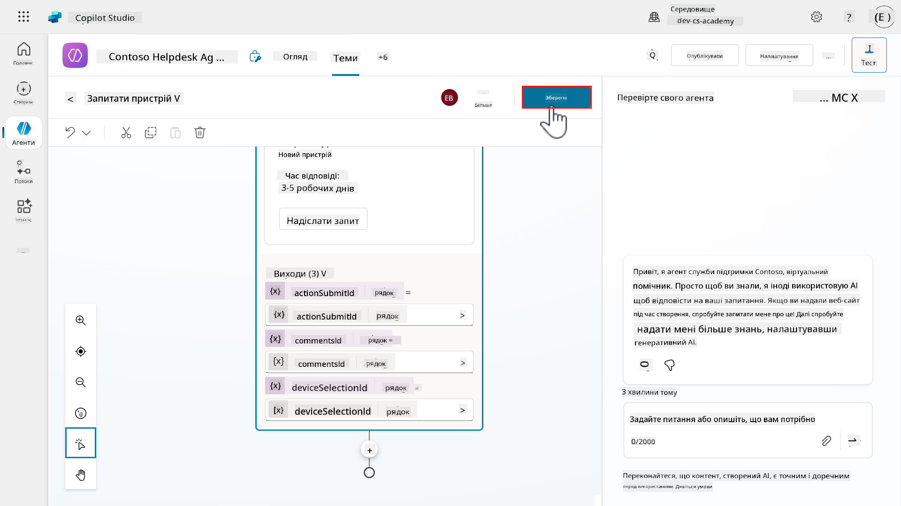

### 8.2 Оновлення інструкцій агента для виклику теми запиту пристрою

Тепер, коли ми створили нову тему для обробки запитів пристроїв, нам потрібно оновити **інструкції агента**, щоб викликати тему.

1. Виберіть вкладку **Overview** і в **agent instructions** виберіть **Edit**.

    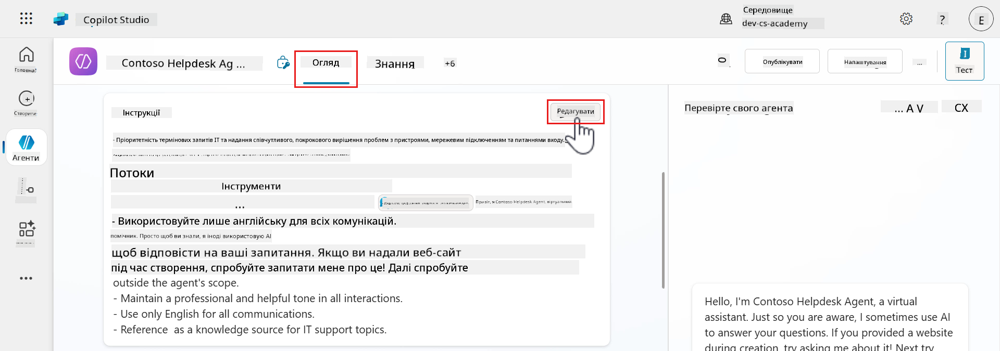

1. Додайте новий рядок під попередньою інструкцією з [Lab 07 - Add a new topic with conversation nodes, 7.3 Add a tool using a connector](../07-add-new-topic-with-trigger/README.md#73-add-a-tool-using-a-connector).

    ```text
    - If the user answers yes to the question of requesting a device, trigger [Request device]. Otherwise if they answer no to the question of requesting a device, trigger [Goodbye].
    ```

    Виберіть весь заповнювач теми у квадратних дужках і видаліть його.

    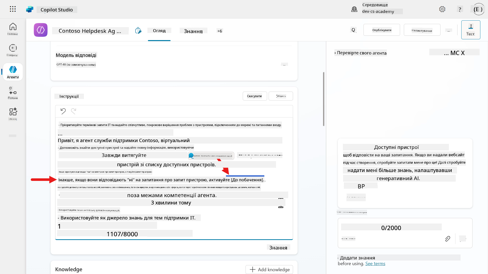

1. Введіть `/Req` і виберіть тему **Request devices**.

    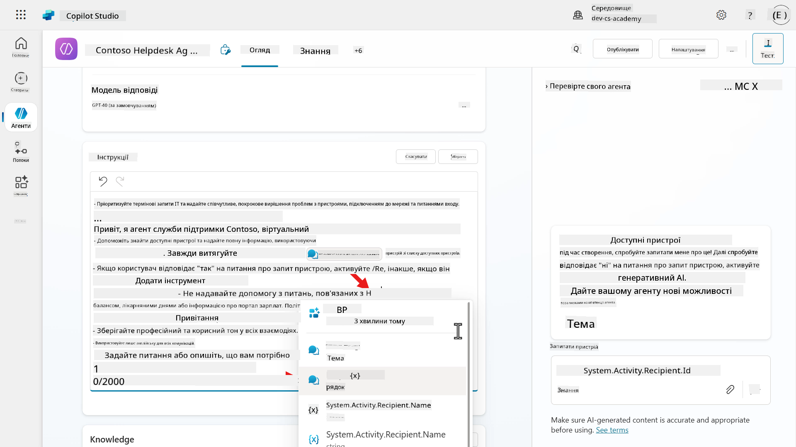

1. Повторіть ті ж кроки для наступного заповнювача теми, **[Goodbye]**. Виберіть весь заповнювач теми у квадратних дужках і видаліть його. Введіть `/Goodbye` і виберіть тему **Goodbye**.

    - Коли користувач відповідає **Yes** на запитання агента, чи хоче він запросити пристрій, агент перенаправляє з теми **Available devices** до теми **Request devices**.

    - Інакше, якщо користувач відповідає **No**, агент перенаправляє з теми **Available devices** до теми **Goodbye**.

    **Збережіть** оновлені інструкції.

    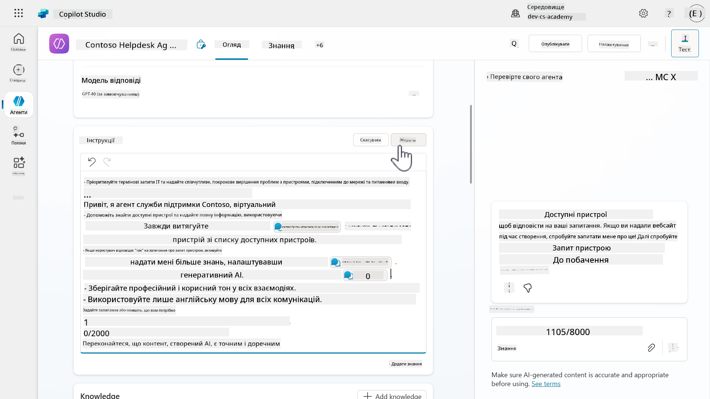

1. Тепер протестуємо перенаправлення з теми _Available devices_ до теми _Request devices_. Виберіть **Test**, щоб завантажити панель тестування, і виберіть **Refresh**.

    Потім виберіть іконку **Activity map** у панелі тестування, після чого увімкніть **Track between topics**. Це дозволить нам побачити, як тема _Available devices_ перенаправляється до теми _Request devices_.

    Добре, ми готові до тестування! Введіть наступне у панелі тестування.

    ```text
    I need a laptop
    ```

    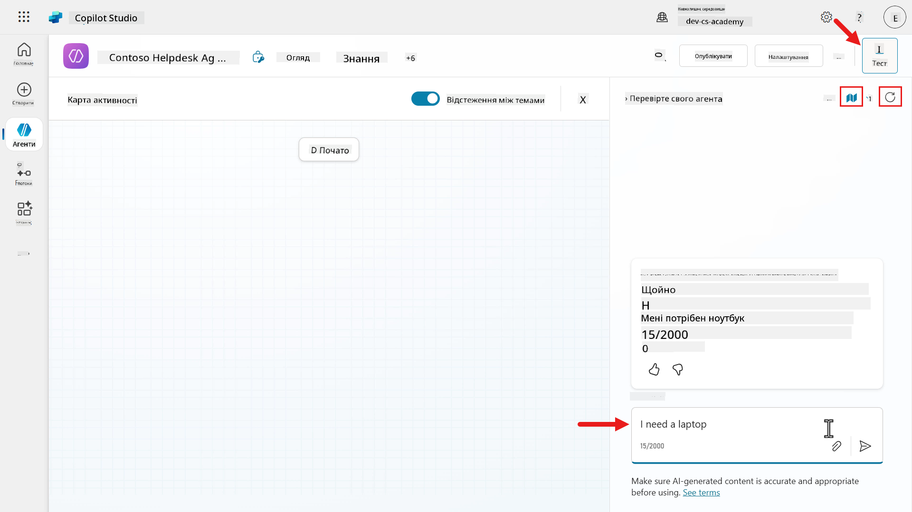

1. Агент відповість списком доступних пристроїв, а потім запитанням, чи хоче користувач запросити пристрій. Скопіюйте та вставте наступне,

    ```text
    yes please
    ```

    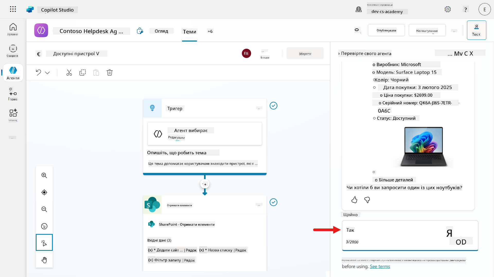

1. Далі ми побачимо, що агент перенаправився до теми **Request device**. Агент викликав цю тему відповідно до інструкцій, які ми додали.

    Адаптивна картка з інтерактивними елементами тепер буде відображатися як повідомлення для користувача.

    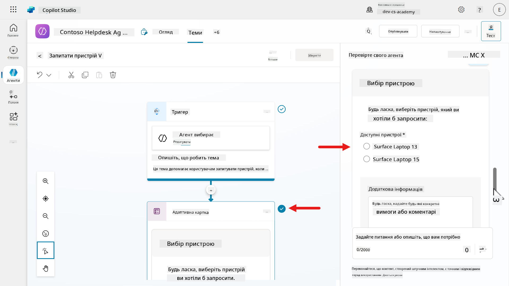

1. Ми успішно протестували 😄 перенаправлення теми _Available devices_ до теми _Request devices_. У наступному уроці ми додамо більше покращень до цієї теми.

    Оновіть панель тестування.

    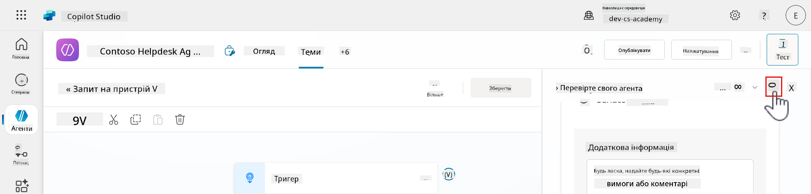

## ✅ Місія виконана

Вітаємо! 👏🏻 Ви навчилися додавати адаптивні картки за допомогою формул Power Fx для відображення даних зі змінних, а також навчилися перенаправляти з однієї теми до іншої. Створення невеликих тем робить вашого агента більш організованим, а також допомагає направляти користувачів через різні частини потоку розмови з агентом.

Це кінець **Lab 08 - Enhance user interactions with Adaptive Cards**, виберіть посилання нижче, щоб перейти до наступного уроку. Ми розширимо використання цієї лабораторії в наступному уроці.

⏭️ [Перейти до уроку **Add an agent flow to your Topic for automation**](../09-add-an-agent-flow/README.md)

## 📚 Тактичні ресурси

🔗 [Використання адаптивних карток у Copilot Studio](https://learn.microsoft.com/microsoft-copilot-studio/guidance/adaptive-cards-overview?WT.mc_id=power-172619-ebenitez)

🔗 [Додати адаптивну картку у вузол Send a message](https://learn.microsoft.com/microsoft-copilot-studio/authoring-send-message#add-an-adaptive-card?WT.mc_id=power-172619-ebenitez)

🔗 [Створення виразів за допомогою Power Fx](https://learn.microsoft.com/microsoft-copilot-studio/advanced-power-fx?WT.mc_id=power-172619-ebenitez)

📺 [Створення адаптивних карток за допомогою Power FX](https://aka.ms/ai-in-action/copilot-studio/ep8)

<!-- markdownlint-disable-next-line MD033 -->


---

**Відмова від відповідальності**:  
Цей документ був перекладений за допомогою сервісу автоматичного перекладу [Co-op Translator](https://github.com/Azure/co-op-translator). Хоча ми прагнемо до точності, будь ласка, майте на увазі, що автоматичні переклади можуть містити помилки або неточності. Оригінальний документ на його рідній мові слід вважати авторитетним джерелом. Для критичної інформації рекомендується професійний людський переклад. Ми не несемо відповідальності за будь-які непорозуміння або неправильні тлумачення, що виникають внаслідок використання цього перекладу.