<!--
CO_OP_TRANSLATOR_METADATA:
{
  "original_hash": "cd99a76bcb7372ac2771b6ae178b023d",
  "translation_date": "2025-10-21T18:16:42+00:00",
  "source_file": "docs/recruit/10-add-event-triggers/README.md",
  "language_code": "uk"
}
-->
# 🚨 Місія 10: Додати тригери подій - Активувати автономні можливості агента

## 🕵️‍♂️ КОДОВА НАЗВА: `ОПЕРАЦІЯ ПРИВИДОВА РУТИНА`

> **⏱️ Час виконання операції:** `~45 хвилин`

🎥 **Перегляньте відео-інструкцію**

[](https://www.youtube.com/watch?v=ZgwHL8PQ1nY "Перегляньте інструкцію на YouTube")

## 🎯 Короткий опис місії

Час підняти вашого агента з рівня розмовного асистента до автономного оператора. Ваше завдання - дозволити вашому агенту діяти без виклику, реагуючи на сигнали з вашого цифрового середовища з точністю та швидкістю.

Завдяки тригерам подій ви навчите вашого агента стежити за зовнішніми системами, такими як SharePoint, Teams та Outlook, і виконувати розумні дії, щойно отримано сигнал. Ця операція перетворює вашого агента на повністю функціонального польового помічника - тихого, швидкого і завжди готового.

Успіх означає створення агентів, які ініціюють цінність, а не просто реагують на неї.

## 🔎 Цілі

📖 У цьому уроці буде розглянуто:

- Розуміння тригерів подій і того, як вони забезпечують автономну поведінку агента
- Вивчення різниці між тригерами подій і тригерами тем, включаючи робочі процеси тригерів і корисні навантаження
- Дослідження поширених сценаріїв використання тригерів подій
- Розуміння питань автентифікації, безпеки та публікації для агентів, що працюють на основі подій
- Створення автономного агента IT Help Desk, який реагує на події SharePoint і надсилає підтвердження електронною поштою

## 🤔 Що таке тригер подій?

**Тригер подій** - це механізм, який дозволяє вашому агенту діяти автономно у відповідь на зовнішні події, без необхідності прямого введення користувача. Уявіть, що ваш агент "спостерігає" за певними подіями і автоматично діє, коли ці події відбуваються.

На відміну від тригерів тем, які вимагають від користувачів введення тексту для активації розмови, тригери подій активуються на основі подій, що відбуваються у ваших підключених системах. Наприклад:

- Коли створюється новий файл у SharePoint або OneDrive for Business
- Коли створюється запис у Dataverse
- Коли завдання завершено у Planner
- Коли надходить нова відповідь у Microsoft Forms
- Коли додається нове повідомлення у Microsoft Teams
- На основі повторюваного розкладу (наприклад, щоденні нагадування)  
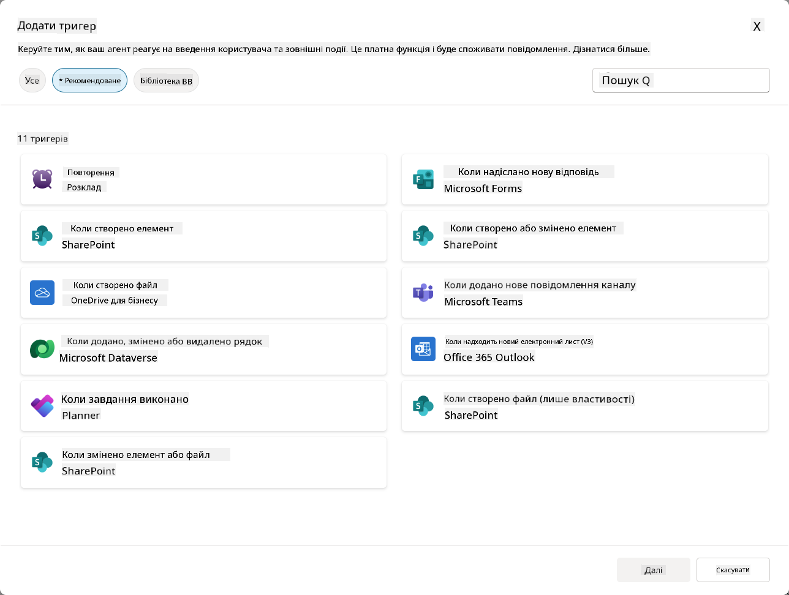

### Чому тригери подій важливі для автономних агентів

Тригери подій перетворюють вашого агента з реактивного асистента на проактивного, автономного помічника:

1. **Автономна робота** - ваш агент може працювати 24/7 без втручання людини, реагуючи на події в реальному часі.
    - *Приклад:* Автоматично вітати нових членів команди, коли їх додають до команди.

1. **Реакція в реальному часі** - замість очікування запитів від користувачів, ваш агент негайно реагує на відповідні події.
    - *Приклад:* Сповіщати IT-команду, коли документ у SharePoint змінено.

1. **Автоматизація робочих процесів** - об'єднувати кілька дій на основі однієї події.
    - *Приклад:* Коли створюється новий запит на підтримку, створити завдання, сповістити менеджера і оновити інформаційну панель.

1. **Послідовні процеси** - забезпечити, щоб важливі кроки не пропускалися, автоматизуючи відповіді на ключові події.
    - *Приклад:* Кожен новий співробітник автоматично отримує матеріали для адаптації та запити на доступ.

1. **Дії на основі даних** - використовувати інформацію з події для прийняття розумних рішень і виконання відповідних дій.
    - *Приклад:* Перенаправляти термінові запити старшим співробітникам на основі рівня пріоритету в корисному навантаженні тригера.

## ⚙️ Як працюють тригери подій?

Тригери подій працюють через трьохетапний робочий процес, який дозволяє вашому агенту автономно реагувати на зовнішні події:

### Робочий процес тригера

1. **Виявлення події** - У підключеній системі (SharePoint, Teams, Outlook тощо) відбувається певна подія.
1. **Активація тригера** - Тригер події виявляє цю подію і надсилає корисне навантаження вашому агенту через Power Automate Cloud Flow.
1. **Реакція агента** - Ваш агент отримує корисне навантаження і виконує визначені вами інструкції.

### Тригери подій vs тригери тем

Розуміння різниці між цими двома типами тригерів є важливим:

| **Тригери подій** | **Тригери тем** |
|-------------------|-------------------|
| Активуються подіями у зовнішній системі | Активуються введенням користувача/фразами |
| Забезпечують автономну поведінку агента | Забезпечують розмовні відповіді |
| Використовують автентифікацію творця | Можливість автентифікації користувача |
| Працюють без взаємодії з користувачем | Вимагають від користувача почати розмову |
| Приклади: створення файлу, отримання електронної пошти | Приклад: "Яка погода?" |

## 📦 Розуміння корисних навантажень тригера

Коли відбувається подія, тригер надсилає **корисне навантаження** вашому агенту, яке містить інформацію про подію та інструкції щодо реагування.

### Стандартні vs кастомні корисні навантаження

Кожен тип тригера має стандартну структуру корисного навантаження, але ви можете її налаштувати:

**Стандартне корисне навантаження** - Використовує стандартний формат, наприклад `Використовувати вміст з {Body}`

- Містить базову інформацію про подію
- Використовує загальні інструкції обробки
- Добре підходить для простих сценаріїв

**Кастомне корисне навантаження** - Додає конкретні інструкції та форматування даних

- Включає детальні вказівки для вашого агента
- Точно визначає, які дані використовувати і як
- Краще для складних робочих процесів

### Інструкції для агента vs інструкції для кастомного корисного навантаження

У вас є два способи керувати поведінкою агента за допомогою тригерів подій:

**Інструкції для агента** (загальні)

- Загальні вказівки, які застосовуються до всіх тригерів
- Приклад: "При обробці запитів завжди перевіряйте наявність дублікатів спочатку"
- Найкраще для загальних моделей поведінки

**Інструкції для корисного навантаження** (специфічні для тригера)

- Конкретні вказівки для окремих типів тригерів  
- Приклад: "Для цього оновлення SharePoint надішліть резюме до каналу проекту"
- Найкраще для складних агентів з кількома тригерами

💡 **Порада**: Уникайте конфліктуючих інструкцій між цими двома рівнями, оскільки це може спричинити непередбачену поведінку.

## 🎯 Поширені сценарії використання тригерів подій

Ось практичні приклади того, як тригери подій можуть покращити вашого агента:

### Агент IT Help Desk

- **Тригер**: Новий елемент списку SharePoint (запит на підтримку)
- **Дія**: Автоматично категоризувати, визначати пріоритет і сповіщати відповідних членів команди

### Агент адаптації співробітників

- **Тригер**: Новий користувач доданий до Dataverse
- **Дія**: Надіслати привітальне повідомлення, створити завдання для адаптації та надати доступ

### Агент управління проектами

- **Тригер**: Завдання завершено у Planner
- **Дія**: Оновити інформаційну панель проекту, сповістити зацікавлених осіб і перевірити наявність блокувань

### Агент управління документами

- **Тригер**: Файл завантажено до певної папки SharePoint
- **Дія**: Витягти метадані, застосувати теги і сповістити власників документа

### Асистент зустрічей

- **Тригер**: Створено подію календаря
- **Дія**: Надіслати нагадування перед зустріччю та порядок денний, забронювати ресурси

## ⚠️ Питання публікації та автентифікації

Перед тим, як ваш агент зможе використовувати тригери подій у виробництві, вам потрібно зрозуміти питання автентифікації та безпеки.

### Автентифікація творця

Тригери подій використовують **облікові дані творця агента** для всієї автентифікації:

- Ваш агент отримує доступ до систем, використовуючи ваші дозволи
- Користувачі можуть потенційно отримати доступ до даних через ваші облікові дані
- Усі дії виконуються "від вашого імені", навіть коли користувачі взаємодіють з агентом

### Найкращі практики захисту даних

Щоб забезпечити безпеку при публікації агентів з тригерами подій:

1. **Оцінюйте доступ до даних** - Перегляньте, до яких систем і даних ваші тригери мають доступ
1. **Ретельно тестуйте** - Зрозумійте, яку інформацію включають тригери у корисне навантаження
1. **Звужуйте область тригера** - Використовуйте конкретні параметри, щоб обмежити, які події активують тригери
1. **Переглядайте дані корисного навантаження** - Переконайтеся, що тригери не розкривають конфіденційну інформацію
1. **Моніторьте використання** - Відстежуйте активність тригерів і споживання ресурсів

## ⚠️ Вирішення проблем і обмеження

Майте на увазі ці важливі аспекти при роботі з тригерами подій:

### Квоти та вплив на оплату

- Кожна активація тригера враховується у вашому споживанні повідомлень
- Часті тригери (наприклад, щохвилинні повторення) можуть швидко споживати квоту
- Моніторьте використання, щоб уникнути обмежень

### Технічні вимоги

- Доступно лише для агентів з увімкненою генеративною оркестрацією
- Вимагає увімкнення спільного використання хмарного потоку, що враховує рішення, у вашому середовищі

### Запобігання втраті даних (DLP)

- Політики DLP вашої організації визначають, які тригери доступні
- Адміністратори можуть повністю блокувати тригери подій
- Зверніться до адміністратора, якщо очікувані тригери недоступні

## 🧪 Лабораторія 10 - Додати тригери подій для автономної поведінки агента

### 🎯 Використання

Ви покращите вашого агента IT Help Desk, щоб він автоматично реагував на нові запити на підтримку. Коли хтось створює новий елемент у списку запитів на підтримку SharePoint, ваш агент:

1. Автономно активується, коли створюється запит у SharePoint
1. Надає деталі запиту та інструкції щодо кроків, які ви хочете, щоб він виконав
1. Автоматично підтверджує отримання запиту відправнику через AI-генеровану електронну пошту

Ця лабораторія демонструє, як тригери подій забезпечують справді автономну поведінку агента.

### Передумови

Перед початком цієї лабораторії переконайтеся, що у вас є:

- ✅ Завершені попередні лабораторії (особливо Лабораторії 6-8 для агента IT Help Desk)
- ✅ Доступ до сайту SharePoint зі списком запитів на підтримку
- ✅ Середовище Copilot Studio з увімкненими тригерами подій
- ✅ Ваш агент має увімкнену генеративну оркестрацію
- ✅ Відповідні дозволи у SharePoint та вашому середовищі Copilot Studio

### 10.1 Увімкнути Generative AI та створити тригер створення елемента SharePoint

1. Відкрийте ваш **агент IT Help Desk** у **Copilot Studio**

1. Спочатку переконайтеся, що **Generative AI** увімкнено для вашого агента:
   - Перейдіть на вкладку **Огляд**
   - У розділі Оркестрація увімкніть **Generative orchestration**, якщо вона ще не увімкнена  
     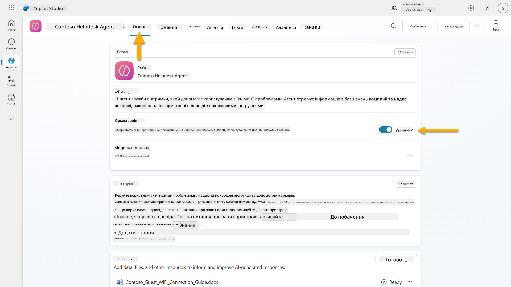

1. Перейдіть на вкладку **Огляд** і знайдіть розділ **Тригери**

1. Натисніть **+ Додати тригер**, щоб відкрити бібліотеку тригерів  
    

1. Знайдіть і виберіть **Коли створюється елемент** (SharePoint)  
    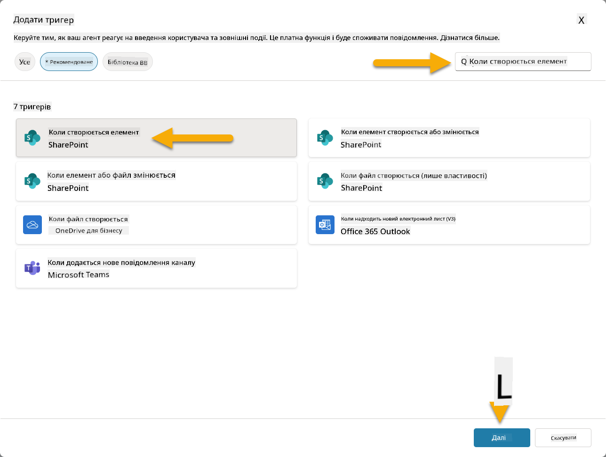

1. Налаштуйте назву тригера та підключення:

   - **Назва тригера:** Новий запит на підтримку створено у SharePoint

1. Дочекайтеся налаштування підключень і натисніть **Далі**, щоб продовжити.  
   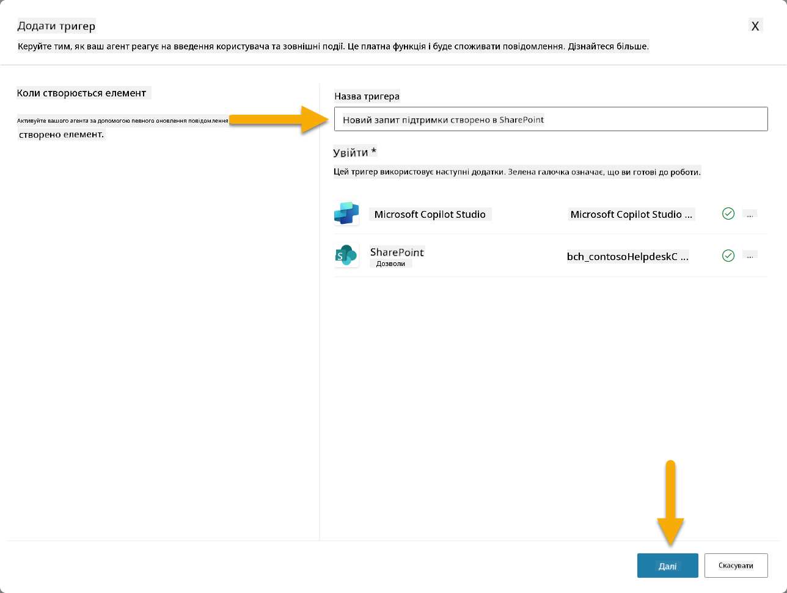

1. Налаштуйте параметри тригера:

   - **Адреса сайту**: Виберіть ваш сайт SharePoint "Contoso IT"

   - **Назва списку**: Виберіть ваш список "Запити"

   - **Додаткові інструкції для агента, коли його викликає тригер:**

     ```text
     New Support Ticket Created in SharePoint: {Body}
     
     Use the 'Acknowledge SharePoint Ticket' tool to generate the email body automatically and respond.
     
     IMPORTANT: Do not wait for any user input. Work completely autonomously.
     ```

     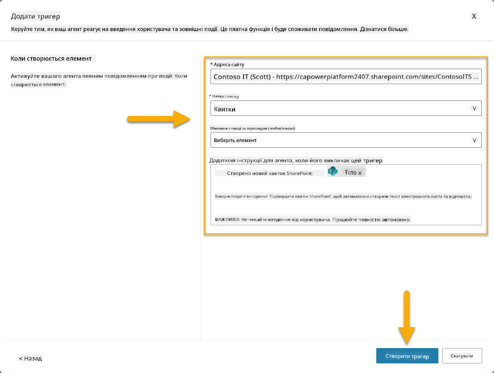

1. Виберіть **Створити тригер**, щоб завершити створення тригера. Хмарний потік Power Automate автоматично створюється для автономного виклику агента.

1. Виберіть **Закрити**.

### 10.2 Редагувати тригер

1. У розділі **Тригери** вкладки **Огляд** виберіть меню **...** на тригері **Новий запит на підтримку створено у SharePoint**

1. Виберіть **Редагувати у Power Automate**  
   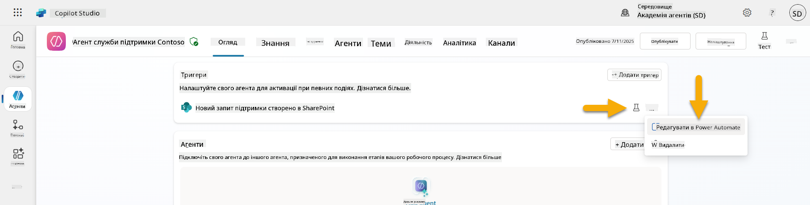

1. Виберіть вузол **Надсилає запит до зазначеного Copilot для обробки**

1. У полі **Тіло/повідомлення** видаліть вміст Тіла, **натисніть клавішу косої риски** (/) і виберіть **Вставити вираз**  
   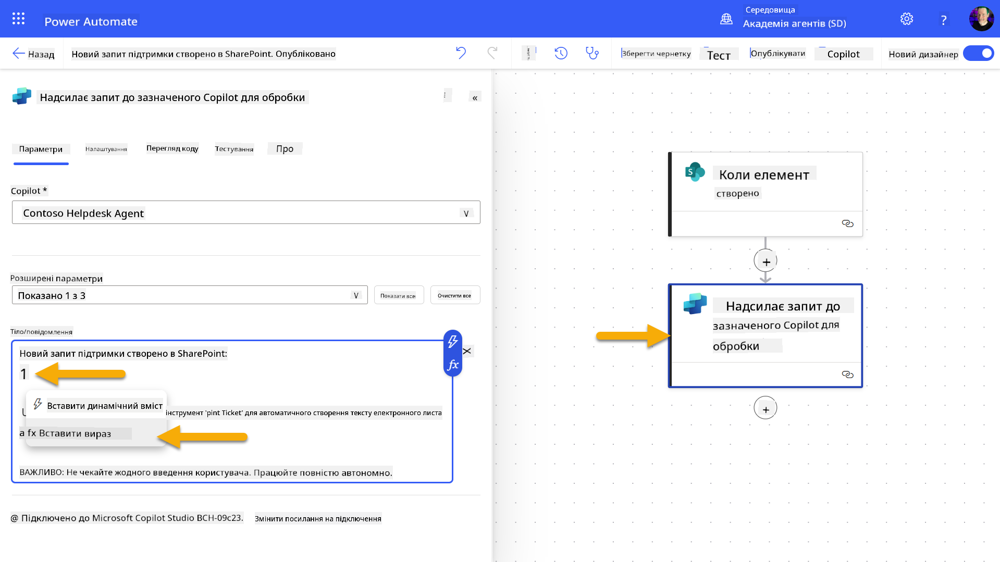

1. Введіть наступний вираз, щоб надати агенту конкретні деталі про зап
1. Відкрийте нову вкладку браузера та перейдіть до вашого списку **SharePoint IT Support Tickets**  
1. Натисніть **+ Додати новий елемент**, щоб створити тестовий запит:  
   - **Заголовок**: "Не можу підключитися до VPN"  
   - **Опис**: "Не можу підключитися до корпоративної мережі WIFI після останнього оновлення"  
   - **Пріоритет**: "Нормальний"  

1. **Збережіть** елемент SharePoint  
    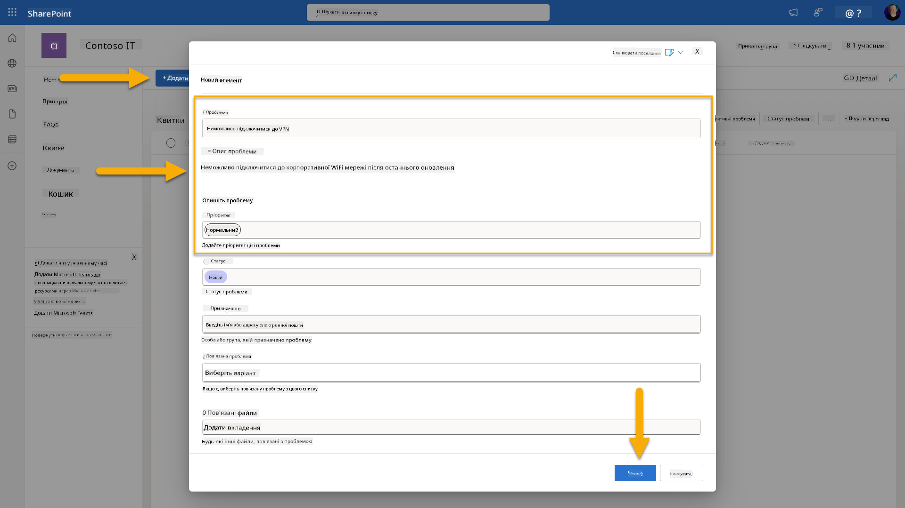  
1. Поверніться до **Copilot Studio** та слідкуйте за панеллю **Test your trigger**, щоб побачити активацію тригера. Використовуйте значок **Оновити**, щоб завантажити подію тригера, це може зайняти кілька хвилин.  
    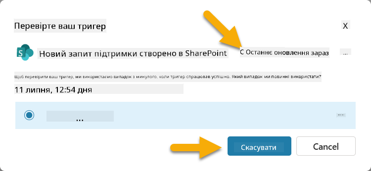  
1. Коли тригер з'явиться, виберіть **Почати тестування**  
1. Натисніть на **значок Activity Map** у верхній частині панелі **Test your agent**  
1. Переконайтеся, що ваш агент:  
   - Отримав дані тригера  
   - Викликав інструмент "Підтвердити запит SharePoint"  
     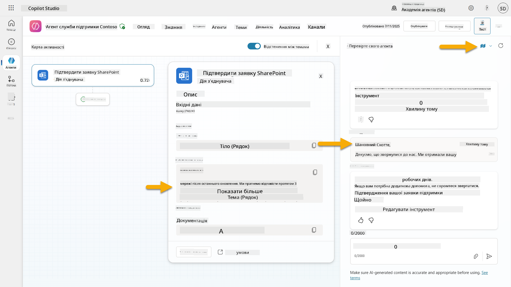  
1. Перевірте електронну пошту відправника, щоб підтвердити, що лист-підтвердження був надісланий  
    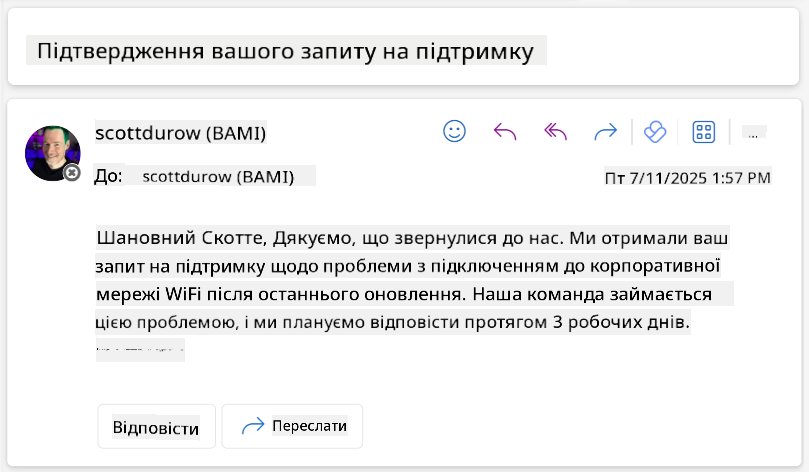  
1. Перегляньте вкладку **Activity** у Copilot Studio, щоб побачити повний процес виконання тригера та інструментів  

## ✅ Місія виконана  

🎉 **Вітаємо!** Ви успішно впровадили тригери подій із конекторними інструментами, які дозволяють вашому агенту працювати автономно, автоматично надсилати підтвердження електронною поштою та обробляти запити підтримки без втручання користувача. Після публікації ваш агент буде діяти автономно від вашого імені.  

🚀 **Далі**: У наступному уроці ви дізнаєтеся, як [опублікувати вашого агента](../11-publish-your-agent/README.md) у Microsoft Teams та Microsoft 365 Copilot, зробивши його доступним для всієї вашої організації!  

⏭️ [Перейти до уроку **Опублікувати вашого агента**](../11-publish-your-agent/README.md)  

## 📚 Тактичні ресурси  

Готові глибше зануритися у тригери подій та автономних агентів? Ознайомтеся з цими ресурсами:  

- **Microsoft Learn**: [Зробіть вашого агента автономним у Copilot Studio](https://learn.microsoft.com/training/modules/autonomous-agents-online-workshop/?WT.mc_id=power-177340-scottdurow)  
- **Документація**: [Додати тригер події](https://learn.microsoft.com/microsoft-copilot-studio/authoring-trigger-event?WT.mc_id=power-177340-scottdurow)  
- **Найкращі практики**: [Вступ до тригерів Power Automate](https://learn.microsoft.com/power-automate/triggers-introduction?WT.mc_id=power-177340-scottdurow)  
- **Розширені сценарії**: [Використання потоків Power Automate з агентами](https://learn.microsoft.com/microsoft-copilot-studio/advanced-flow-create?WT.mc_id=power-177340-scottdurow)  
- **Безпека**: [Запобігання втраті даних для Copilot Studio](https://learn.microsoft.com/microsoft-copilot-studio/admin-data-loss-prevention?WT.mc_id=power-177340-scottdurow)  

  

---

**Відмова від відповідальності**:  
Цей документ був перекладений за допомогою сервісу автоматичного перекладу [Co-op Translator](https://github.com/Azure/co-op-translator). Хоча ми прагнемо до точності, будь ласка, майте на увазі, що автоматичні переклади можуть містити помилки або неточності. Оригінальний документ на його рідній мові слід вважати авторитетним джерелом. Для критичної інформації рекомендується професійний людський переклад. Ми не несемо відповідальності за будь-які непорозуміння або неправильні тлумачення, що виникають внаслідок використання цього перекладу.