<!--
CO_OP_TRANSLATOR_METADATA:
{
  "original_hash": "9dceeba2eae2bb73e328602a060eddab",
  "translation_date": "2025-10-21T18:53:57+00:00",
  "source_file": "docs/recruit/11-publish-your-agent/README.md",
  "language_code": "uk"
}
-->
# 🚨 Місія 11: Опублікуйте свого агента

## 🕵️‍♂️ КОДОВА НАЗВА: `ОПЕРАЦІЯ ПУБЛІКУЙ ПУБЛІКУЙ ПУБЛІКУЙ`

> **⏱️ Час виконання операції:** `~30 хвилин`  

🎥 **Перегляньте відео-інструкцію**

[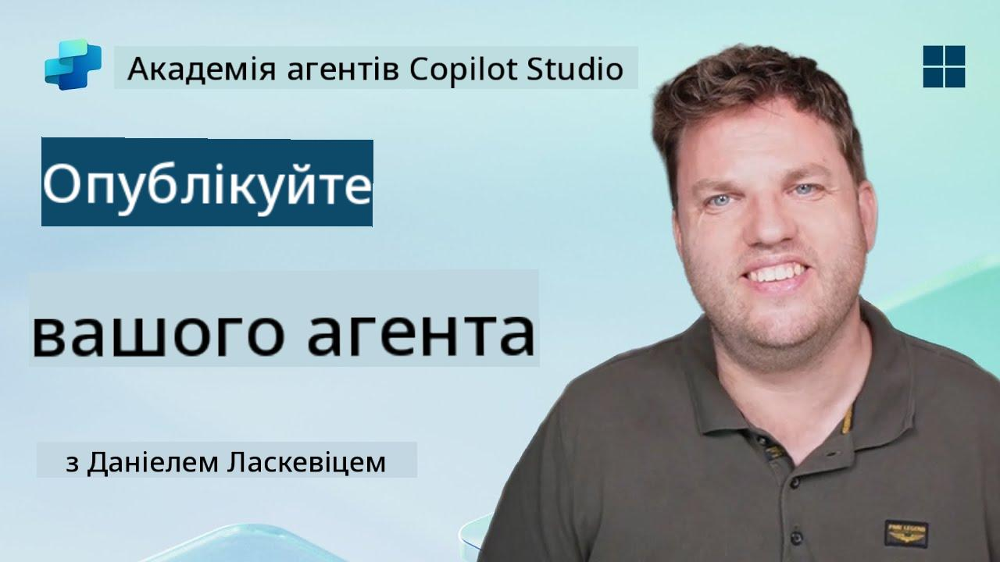](https://www.youtube.com/watch?v=eVZmljhYlSI "Перегляньте інструкцію на YouTube")

## 🎯 Короткий опис місії

Після завершення серії складних модулів, Творцю Агентів, ви готові до найважливішого кроку: публікації вашого агента. Настав час зробити ваше творіння доступним для користувачів у Microsoft Teams та Microsoft 365 Copilot.

Ваш агент—з чіткою місією, потужними інструментами та доступом до ключових джерел знань—готовий до роботи. Використовуючи Microsoft Copilot Studio, ви розгортаєте свого агента, щоб він міг почати допомагати реальним користувачам там, де вони працюють.

Давайте запустимо вашого агента в дію.

## 🔎 Цілі

📖 У цьому уроці розглядається:

1. Чому важливо опублікувати вашого агента
1. Що відбувається, коли ви публікуєте агента
1. Як додати канал (Microsoft Teams та Microsoft 365 Copilot)
1. Як додати агента в Microsoft Teams
1. Як зробити агента доступним у Microsoft Teams для всієї організації

## 🚀 Опублікуйте агента

Кожного разу, коли ви працюєте над агентом у Copilot Studio, ви можете оновлювати його, додаючи знання або інструменти. Коли всі зміни завершені, і ви ретельно протестували агента, ви готові до його публікації. Публікація гарантує, що останні оновлення будуть доступні. Якщо ви оновлюєте агента новими інструментами, але не натискаєте кнопку публікації, ці зміни ще не доступні для кінцевих користувачів.

Завжди натискайте кнопку публікації, коли хочете передати оновлення користувачам вашого агента. Ваш агент може мати додані канали, і коли ви натискаєте кнопку публікації, оновлення стають доступними для всіх каналів, які ви додали до агента.

## ⚙️ Налаштуйте канали

Канали визначають, де ваші користувачі можуть отримати доступ до вашого агента та взаємодіяти з ним. Після публікації агента ви можете зробити його доступним у кількох каналах. Кожен канал може відображати контент вашого агента по-різному.

Ви можете додати вашого агента до наступних каналів:

- **Microsoft Teams та Microsoft 365 Copilot** - Зробіть вашого агента доступним у чатах та зустрічах Teams, а також у досвіді Microsoft 365 Copilot ([Дізнатися більше](https://learn.microsoft.com/microsoft-copilot-studio/publication-add-bot-to-microsoft-teams))
- **Демо-сайт** - Тестуйте вашого агента на демо-сайті, наданому Copilot Studio ([Дізнатися більше](https://learn.microsoft.com/microsoft-copilot-studio/publication-connect-bot-to-web-channels))
- **Користувацький сайт** - Вбудуйте вашого агента безпосередньо у ваш власний сайт ([Дізнатися більше](https://learn.microsoft.com/microsoft-copilot-studio/publication-connect-bot-to-web-channels))
- **Мобільний додаток** - Інтегруйте вашого агента у користувацький мобільний додаток ([Дізнатися більше](https://learn.microsoft.com/microsoft-copilot-studio/publication-connect-bot-to-custom-application))
- **SharePoint** - Додайте вашого агента до сайтів SharePoint для допомоги з документами та сайтами ([Дізнатися більше](https://learn.microsoft.com/microsoft-copilot-studio/publication-add-bot-to-sharepoint))
- **Facebook Messenger** - Зв'язуйтеся з користувачами через платформу обміну повідомленнями Facebook ([Дізнатися більше](https://learn.microsoft.com/microsoft-copilot-studio/publication-add-bot-to-facebook))
- **Power Pages** - Інтегруйте вашого агента у сайти Power Pages ([Дізнатися більше](https://learn.microsoft.com/microsoft-copilot-studio/publication-add-bot-to-power-pages))
- **Канали Azure Bot Service** - Отримайте доступ до додаткових каналів, включаючи Slack, Telegram, Twilio SMS та інші ([Дізнатися більше](https://learn.microsoft.com/microsoft-copilot-studio/publication-connect-bot-to-azure-bot-service-channels))

Щоб додати канал, перейдіть на вкладку **Channels** у вашому агенті та виберіть канал, який хочете налаштувати. Кожен канал має специфічні вимоги до налаштування та може вимагати додаткової аутентифікації або конфігураційних кроків.

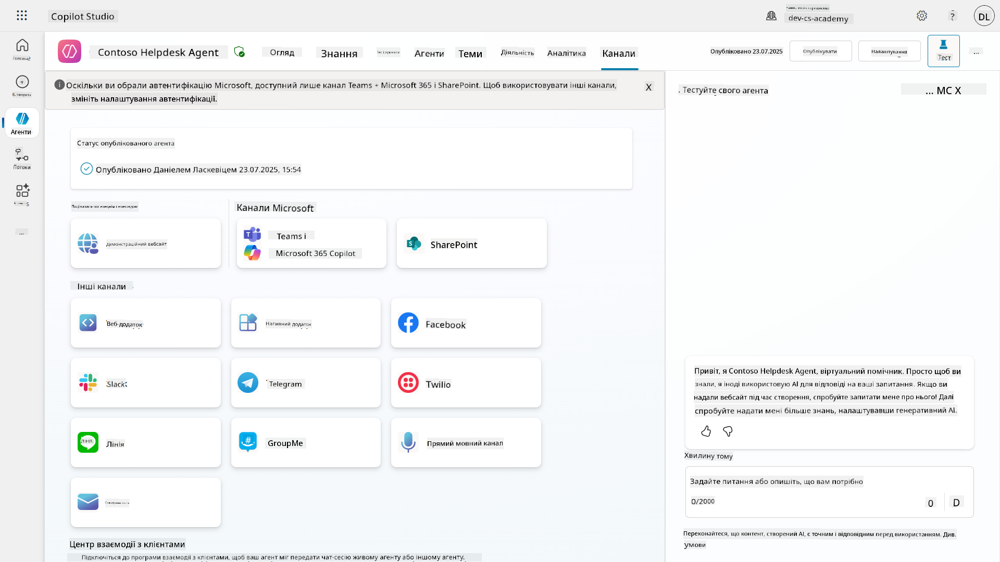

## 📺 Досвід роботи з каналами

Різні канали мають різний досвід користувачів. Коли ви створюєте агента для кількох каналів, переконайтеся, що ви враховуєте відмінності кожного каналу. Завжди корисно протестувати вашого агента у кількох каналах, щоб переконатися, що він працює так, як ви задумали.

| Досвід роботи                     | Веб-сайт      | Teams та Microsoft 365 Copilot         | Facebook                 | Dynamics Omnichannel для обслуговування клієнтів            |
| --------------------------------- | ------------- | --------------------------------------- | ------------------------ | ----------------------------------------------------------- |
| [Опитування задоволеності клієнтів][1] | Адаптивна картка | Тільки текст                            | Тільки текст             | Тільки текст                                                 |
| [Варіанти вибору][1]              | Підтримується | [Підтримується до шести (як картка героя)][4] | [Підтримується до 13][6] | [Частково підтримується][8]                                 |
| [Markdown][2]                     | Підтримується | [Частково підтримується][5]             | [Частково підтримується][7] | [Частково підтримується][9]                                 |
| [Привітальне повідомлення][1]     | Підтримується | Підтримується                           | Не підтримується         | Підтримується для [Чату][10]. Не підтримується для інших каналів. |
| [Did-You-Mean][3]                 | Підтримується | Підтримується                           | Підтримується            | Підтримується для [Microsoft Teams][11], [Чату][10], Facebook та текстових каналів (короткі повідомлення через [TeleSign][12] та [Twilio][13], [WhatsApp][14], [WeChat][15] та [Twitter][16]). Запропоновані дії представлені як текстовий список; користувачі повинні повторно ввести варіант для відповіді. |

[1]: https://learn.microsoft.com/microsoft-copilot-studio/authoring-create-edit-topics
[2]: https://daringfireball.net/projects/markdown/
[3]: https://learn.microsoft.com/microsoft-copilot-studio/advanced-ai-features
[4]: https://learn.microsoft.com/microsoftteams/platform/concepts/cards/cards-reference#hero-card
[5]: https://learn.microsoft.com/microsoftteams/platform/bots/how-to/format-your-bot-messages#text-only-messages
[6]: https://developers.facebook.com/docs/messenger-platform/send-messages/quick-replies/
[7]: https://www.facebook.com/help/147348452522644?helpref=related
[8]: https://learn.microsoft.com/dynamics365/customer-service/asynchronous-channels#suggested-actions-support
[9]: https://learn.microsoft.com/dynamics365/customer-service/asynchronous-channels#preview-support-for-formatted-messages
[10]: https://learn.microsoft.com/dynamics365/customer-service/set-up-chat-widget
[11]: https://learn.microsoft.com/dynamics365/customer-service/configure-microsoft-teams
[12]: https://learn.microsoft.com/dynamics365/customer-service/configure-sms-channel
[13]: https://learn.microsoft.com/dynamics365/customer-service/configure-sms-channel-twilio
[14]: https://learn.microsoft.com/dynamics365/customer-service/configure-whatsapp-channel
[15]: https://learn.microsoft.com/dynamics365/customer-service/configure-wechat-channel
[16]: https://learn.microsoft.com/dynamics365/customer-service/configure-twitter-channel

> [!NOTE]
> Є приклади, де можна використовувати різну логіку для різних каналів. Один із прикладів можна знайти в репозиторії Power Platform Snippets:
>
> Генрі Джаммес поділився прикладом, як показати різну адаптивну картку, якщо канал — Microsoft Teams. ([Посилання на приклад](https://github.com/pnp/powerplatform-snippets/blob/main/copilot-studio/multiple-topics-matched-topic/source/multiple-topics-matched.yaml#L40))

## 🧪 Лабораторія 11: Опублікуйте вашого агента у Teams та Microsoft 365 Copilot

### 🎯 Використання

Ваш агент служби підтримки Contoso IT тепер повністю налаштований з потужними можливостями—він може отримувати доступ до джерел знань SharePoint, створювати заявки на підтримку, надсилати проактивні сповіщення та інтелектуально відповідати на запити користувачів. Однак усі ці функції наразі доступні лише в середовищі розробки, де ви їх створили.

**Завдання:** Кінцеві користувачі не можуть скористатися можливостями вашого агента, доки він не буде належним чином опублікований і зроблений доступним через канали, де вони фактично працюють.

**Рішення:** Публікація вашого агента гарантує, що остання версія—з усіма вашими останніми оновленнями, новими темами, розширеними джерелами знань та налаштованими потоками—буде доступна реальним користувачам. Без публікації користувачі все ще взаємодіятимуть зі старою версією вашого агента, яка може не мати важливих функцій.

Додавання каналу Teams та Microsoft 365 Copilot також є надзвичайно важливим, оскільки:

- **Інтеграція з Teams**: Співробітники вашої організації проводять більшу частину дня у Microsoft Teams для співпраці, зустрічей та спілкування. Додавши вашого агента до Teams, користувачі можуть отримувати IT-підтримку, не залишаючи своє основне робоче середовище.

- **Microsoft 365 Copilot**: Користувачі можуть отримати доступ до вашого спеціалізованого агента служби підтримки IT безпосередньо у своєму досвіді Microsoft 365 Copilot, що забезпечує безперервну інтеграцію у їхній щоденний робочий процес у додатках Office.

- **Централізований доступ**: Замість того, щоб запам'ятовувати окремі веб-сайти або додатки, користувачі можуть отримати доступ до IT-підтримки через платформи, які вони вже використовують, зменшуючи складність і збільшуючи прийняття.

Ця місія перетворює вашу розробку на готове до використання рішення, яке приносить реальну користь кінцевим користувачам вашої організації.

### Попередні умови

Перед початком цієї лабораторії переконайтеся, що:

- ✅ Завершили попередні лабораторії та повністю налаштували агента служби підтримки Contoso
- ✅ Ваш агент протестований і готовий до використання у виробничому середовищі
- ✅ Маєте дозволи у вашому середовищі Copilot Studio для публікації агентів
- ✅ Маєте доступ до Microsoft Teams у вашій організації

### 11.1 Опублікуйте вашого агента

Тепер, коли вся робота над агентом завершена, ми повинні переконатися, що всі наші зусилля доступні для кінцевих користувачів, які будуть використовувати нашого агента. Щоб переконатися, що контент доступний для всіх користувачів, нам потрібно опублікувати нашого агента.

1. Перейдіть до агента служби підтримки Contoso у Copilot Studio (через [портал розробника Copilot Studio](https://copilotstudio.microsoft.com))

    У Copilot Studio легко опублікувати вашого агента. Ви можете просто вибрати кнопку публікації у верхній частині огляду агента.

    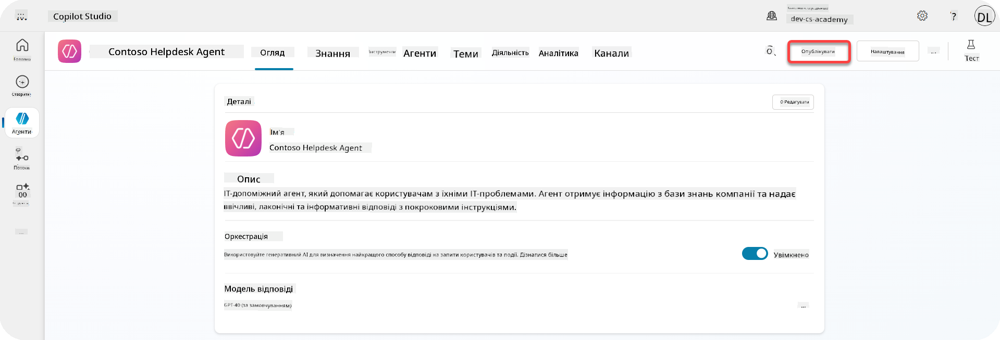

1. Виберіть кнопку **Publish** у вашому агенті

    Відкриється спливаюче вікно публікації—щоб підтвердити, що ви дійсно хочете опублікувати вашого агента.

    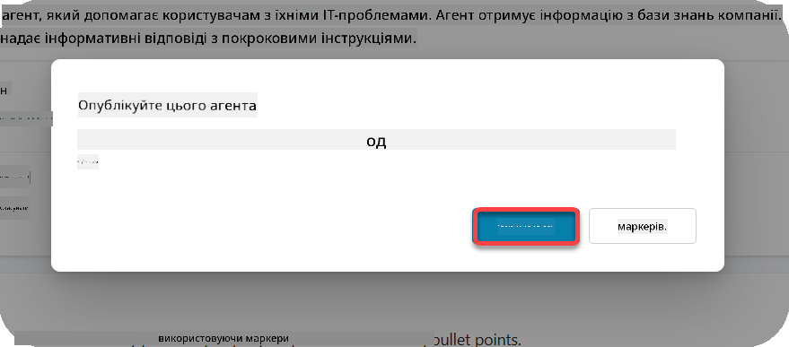

1. Виберіть **Publish**, щоб підтвердити публікацію вашого агента

    Тепер з'явиться повідомлення, що ваш агент публікується. Вам не потрібно тримати це спливаюче вікно відкритим. Ви отримаєте сповіщення, коли агент буде опублікований.

    

    Коли агент буде опублікований, ви побачите сповіщення у верхній частині сторінки агента.

    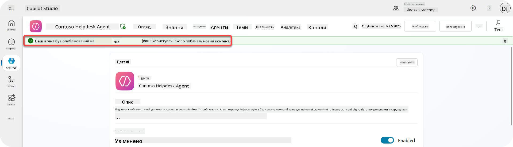

Але—ми лише опублікували агента, ми ще не додали його до каналу, тож давайте виправимо це зараз!

### 11.2 Додайте канал Teams та Microsoft 365 Copilot

1. Щоб додати канал Teams та Microsoft 365 Copilot до нашого агента, нам потрібно вибрати **Channel** у верхній навігації агента

    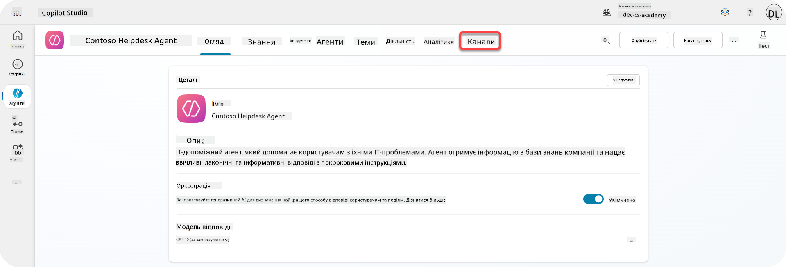

    Тут ми можемо побачити всі канали, які можемо додати до цього агента.

1. Виберіть **Teams та Microsoft 365**

    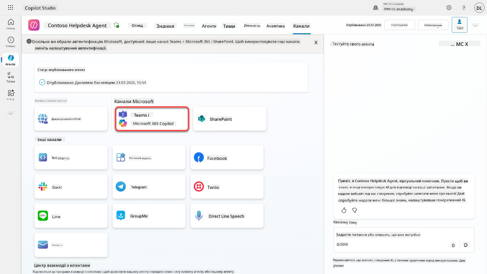

1. Виберіть **Add channel**, щоб завершити майстер і додати канал до агента

    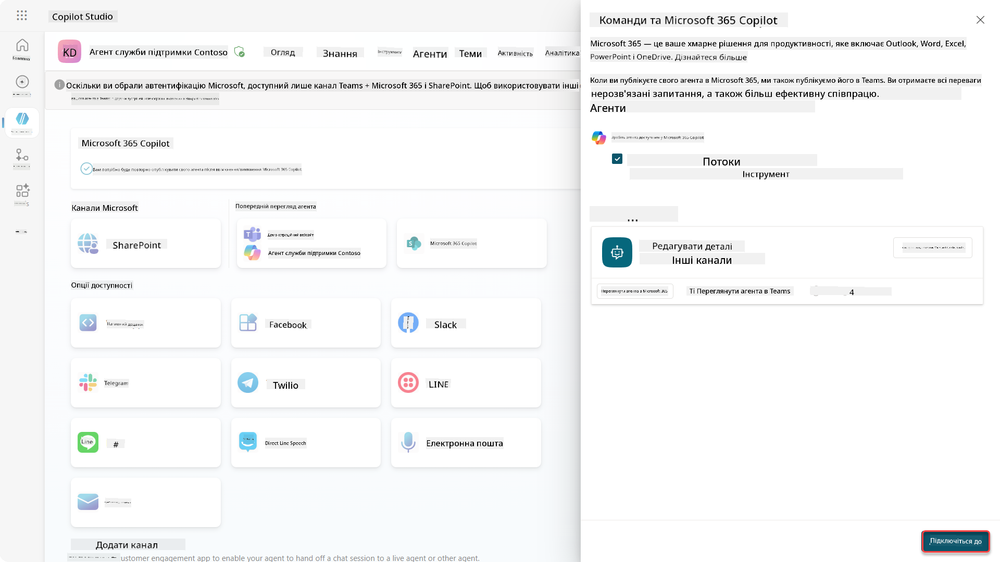

    Це займе трохи часу, поки канал буде додано. Після додавання у верхній частині бічної панелі з'явиться зелене сповіщення.

    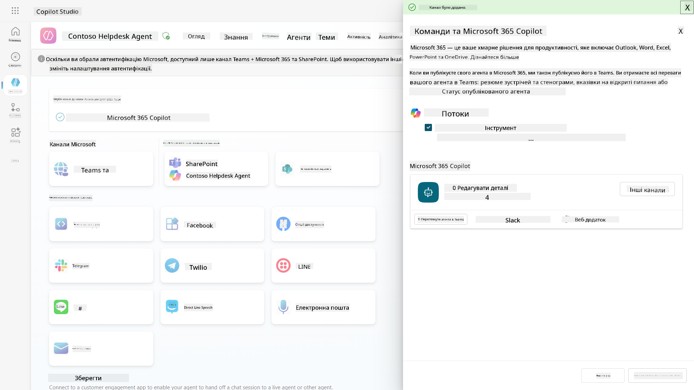

1. Виберіть **See agent in Teams**, щоб відкрити нову вкладку

    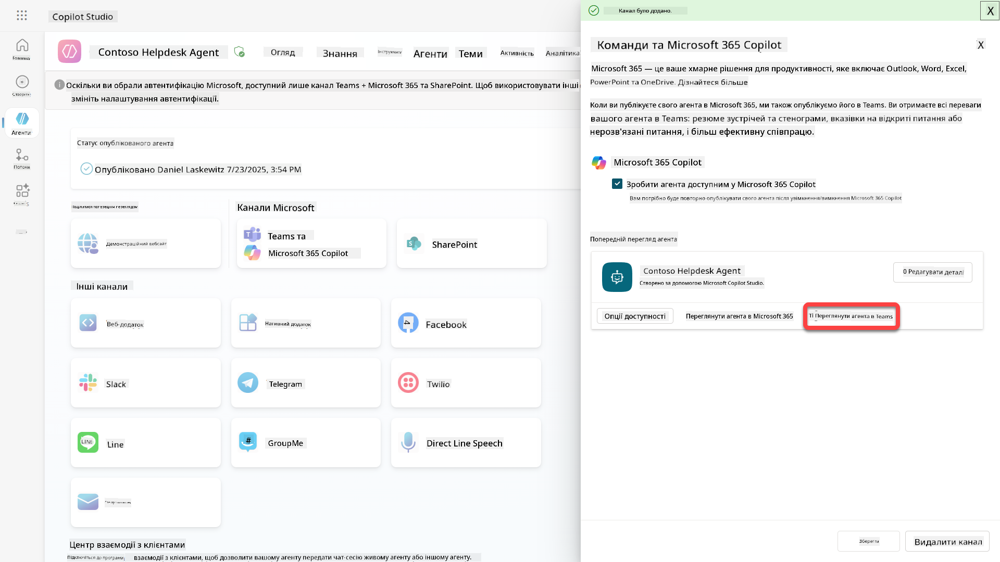

1. Виберіть **Add**, щоб додати агента служби підтримки Contoso до Teams

    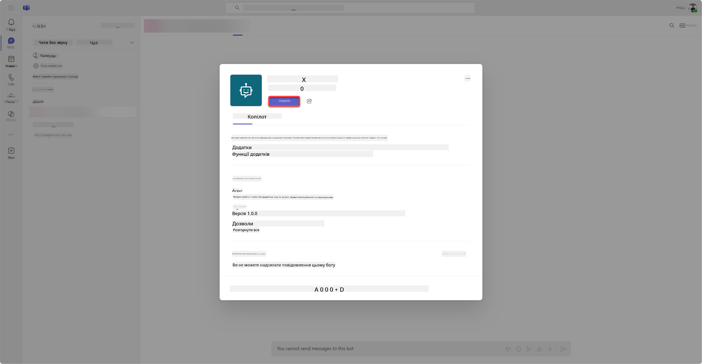

    Це займе трохи часу. Після цього має з'явитися наступний екран:

    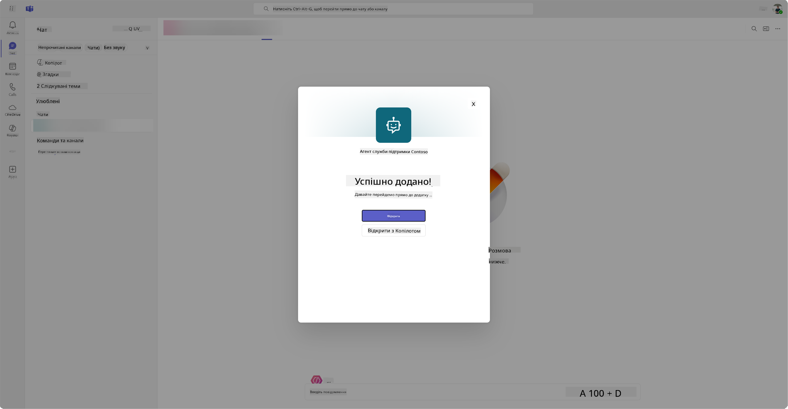

1. Виберіть **Open**, щоб відкрити агента в Teams

    Це відкриє агента в Teams як додаток Teams

    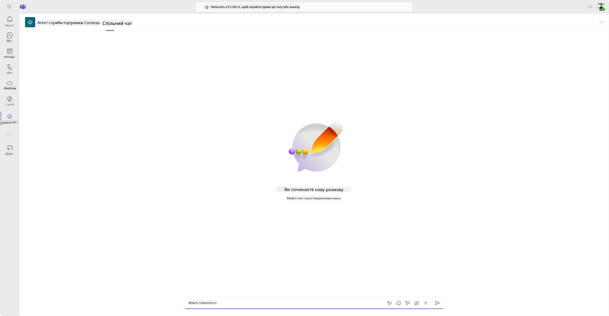

Тепер ми опублікували агента для роботи у Microsoft Teams, але ви можете захотіти зробити його доступним для більшої кількості людей.

### 11.3 Зробіть агента доступним для всіх користувачів у тенанті

1. Закрийте вкладку браузера, де відкрито агента служби підтримки Contoso

    Це має повернути вас до Copilot Studio, де бічна панель Teams та Microsoft 365 Copilot все ще відкрита. Ми лише відкрили агента в Teams зараз, але тут можна зробити набагато більше. Ми можемо редагувати деталі агента, розгорнути агента для більшої кількості користувачів тощо.

1. Виберіть **Edit details**

    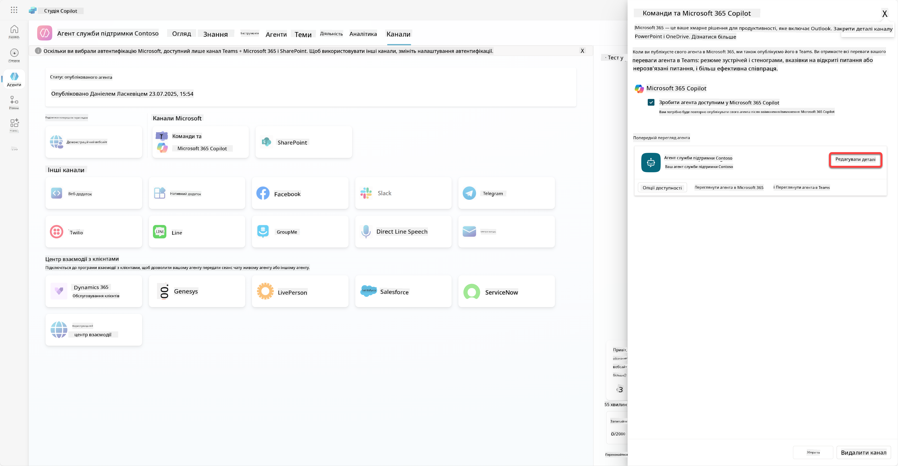
Це відкриє панель, де ми можемо змінити багато деталей і налаштувань агента. Ми можемо змінити основні деталі, такі як іконка, колір фону іконки та описи. Також тут можна змінити налаштування Teams (наприклад, дозволити користувачеві додати агента до команди або використовувати цього агента в групових і зустрічних чатах). Якщо вибрати *додатково*, можна змінити деталі розробника, такі як ім'я розробника, вебсайт, політика конфіденційності та умови використання.

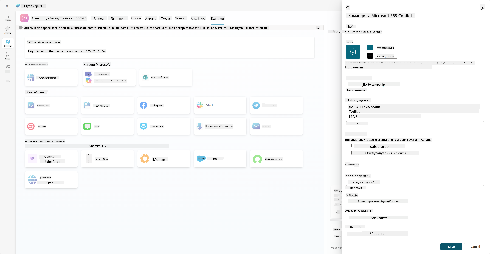

1. Виберіть **Скасувати**, щоб закрити панель редагування деталей.

1. Виберіть **Опції доступності**.

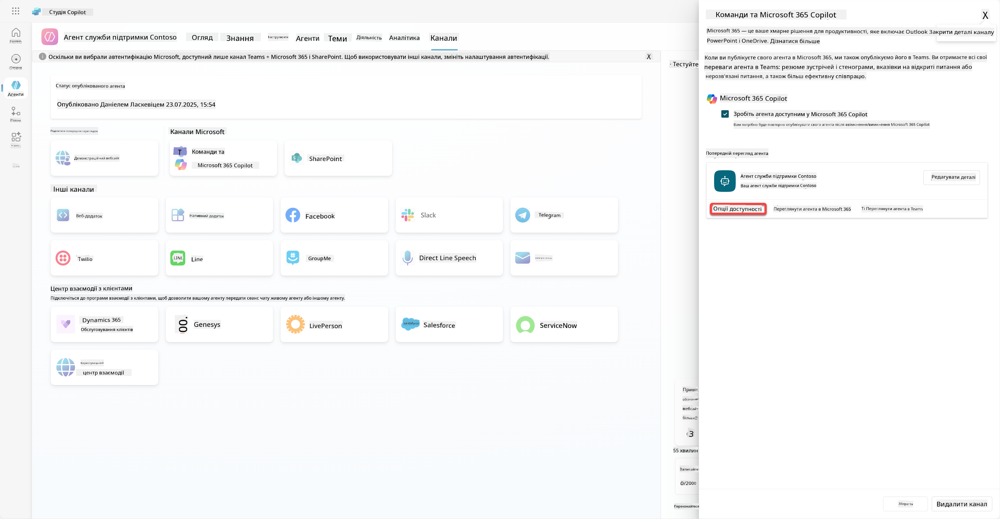

Це відкриє панель опцій доступності, де ви можете скопіювати посилання, щоб надіслати його користувачам для використання цього агента (зверніть увагу, що вам також потрібно поділитися агентом із користувачем), а також завантажити файл для додавання вашого агента до магазину Microsoft Teams або Microsoft 365. Щоб показати агента в магазині, є й інші опції: ви можете показати його своїм колегам і спільним користувачам (щоб він з'явився в розділі *Створено за допомогою Power Platform*) або показати його всім у вашій організації (це потребує схвалення адміністратора).

1. Виберіть **Показати всім у моїй організації**.

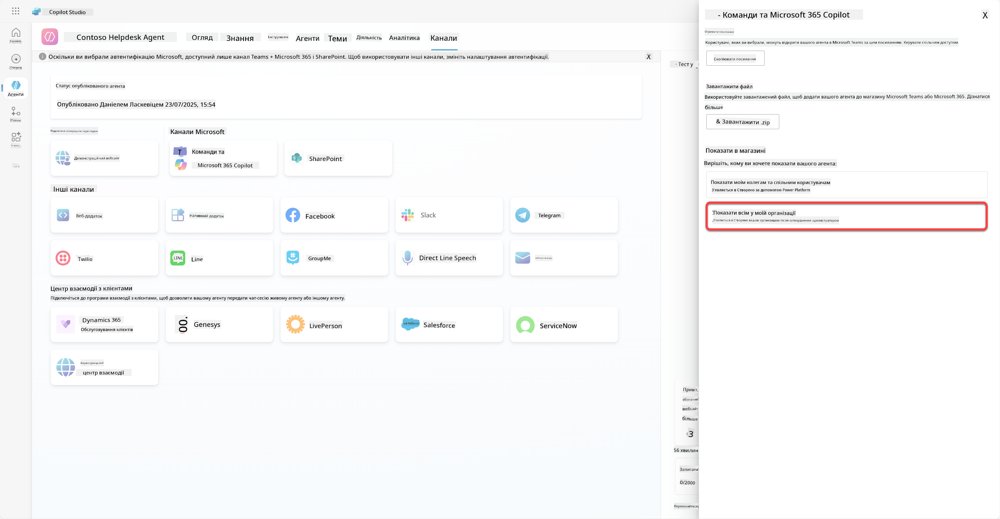

1. Виберіть **Надіслати на схвалення адміністратору**.

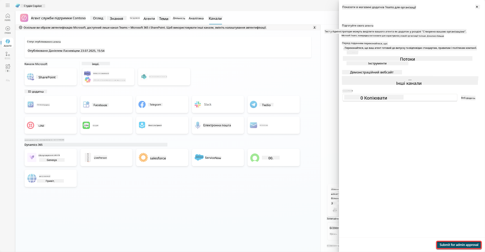

Тепер ваш адміністратор має схвалити подання вашого агента. Вони можуть зробити це, перейшовши до Центру адміністрування Teams і знайшовши Contoso Helpdesk Agent у розділі Додатки. На скріншоті ви можете побачити, що адміністратор побачить у Центрі адміністрування Teams.

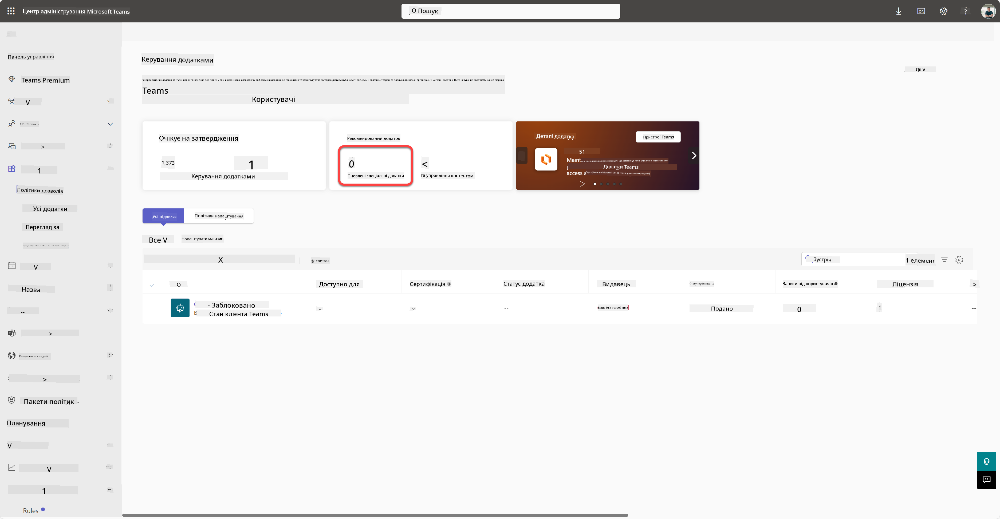

Адміністратор має вибрати Contoso Helpdesk Agent і натиснути *Опублікувати*, щоб опублікувати Contoso Helpdesk Agent для всіх.

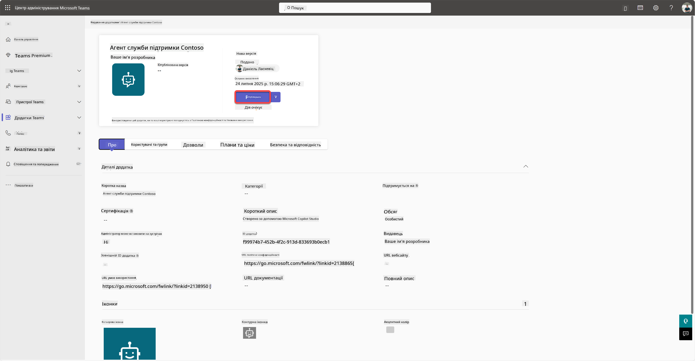

Коли адміністратор опублікує подання агента, ви зможете оновити Copilot Studio і побачите банер *доступно в магазині додатків* у опціях доступності.

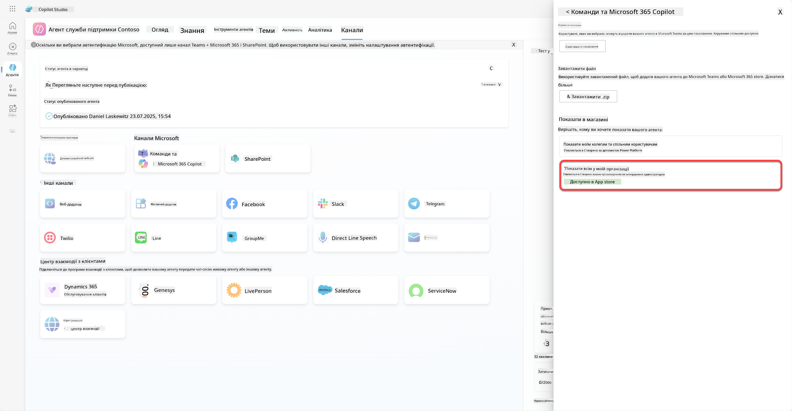

Тут є ще більше можливостей. Ваш адміністратор може змінити глобальну політику налаштування і автоматично встановити Contoso Helpdesk Agent для всіх у тенанті. Крім того, ви можете закріпити Contoso Helpdesk Agent на лівій панелі, щоб усі мали легкий доступ до нього.

## ✅ Місія виконана

🎉 **Вітаємо!** Ви успішно опублікували свого агента і додали його до Teams та Microsoft 365 Copilot! Наступна місія курсу: Розуміння ліцензування.

⏭️ [Перейти до уроку **Розуміння ліцензування**](../12-understanding-licensing/README.md)

## 📚 Тактичні ресурси

🔗 [Документація про канали публікації](https://learn.microsoft.com/microsoft-copilot-studio/publication-fundamentals-publish-channels)

---

**Відмова від відповідальності**:  
Цей документ був перекладений за допомогою сервісу автоматичного перекладу [Co-op Translator](https://github.com/Azure/co-op-translator). Хоча ми прагнемо до точності, будь ласка, майте на увазі, що автоматичні переклади можуть містити помилки або неточності. Оригінальний документ на його рідній мові слід вважати авторитетним джерелом. Для критичної інформації рекомендується професійний людський переклад. Ми не несемо відповідальності за будь-які непорозуміння або неправильні тлумачення, що виникають внаслідок використання цього перекладу.